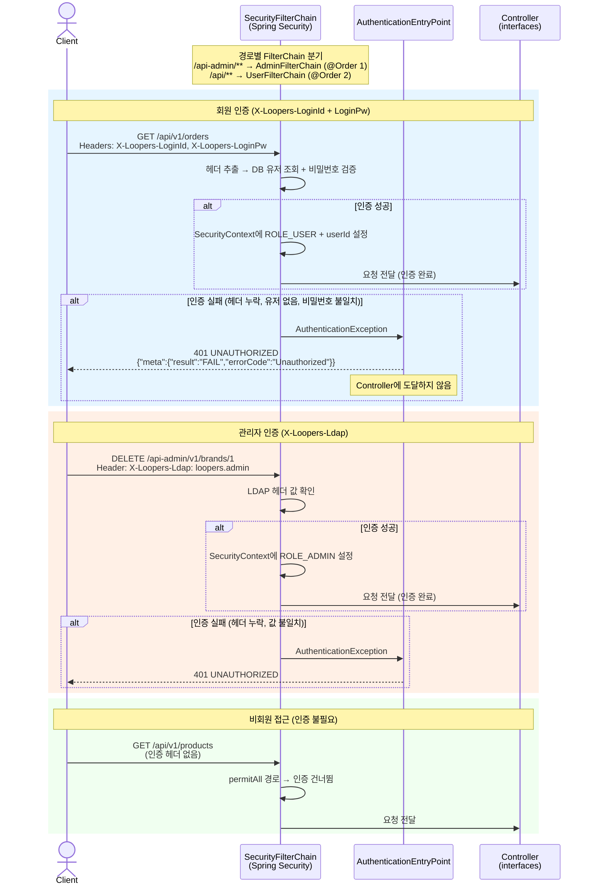
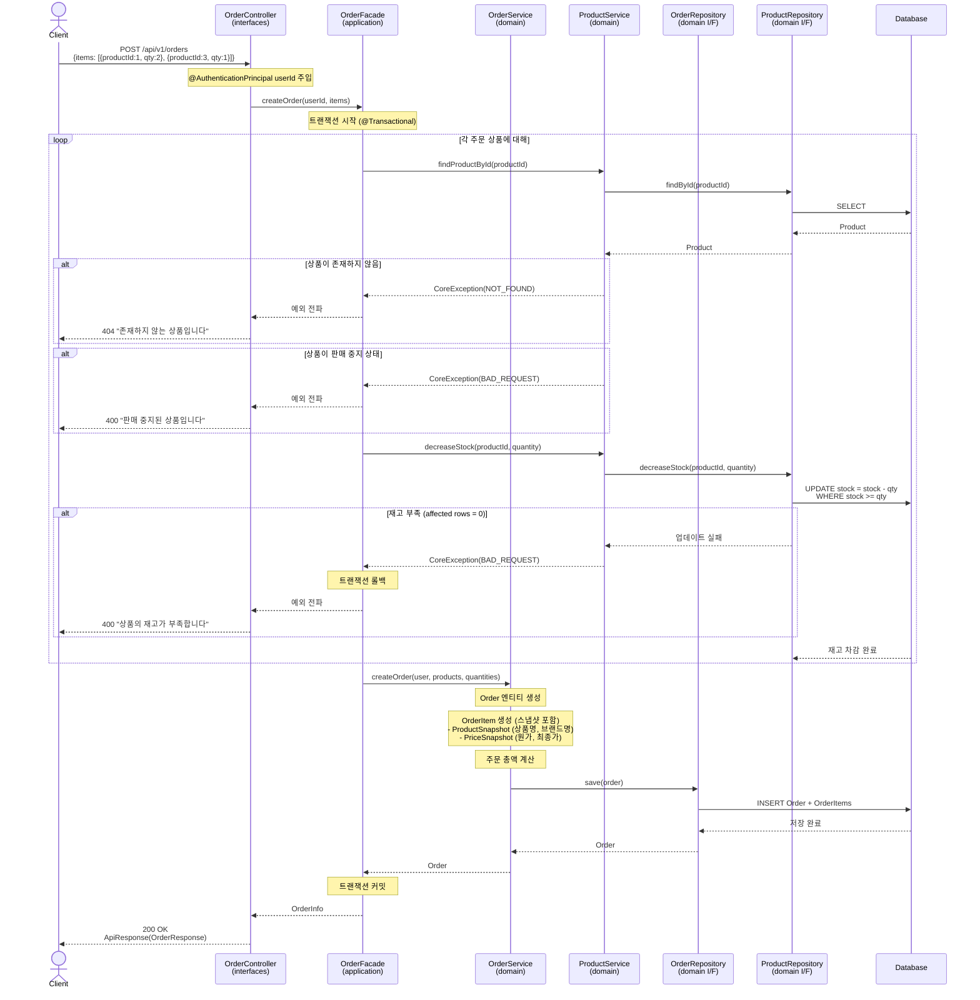
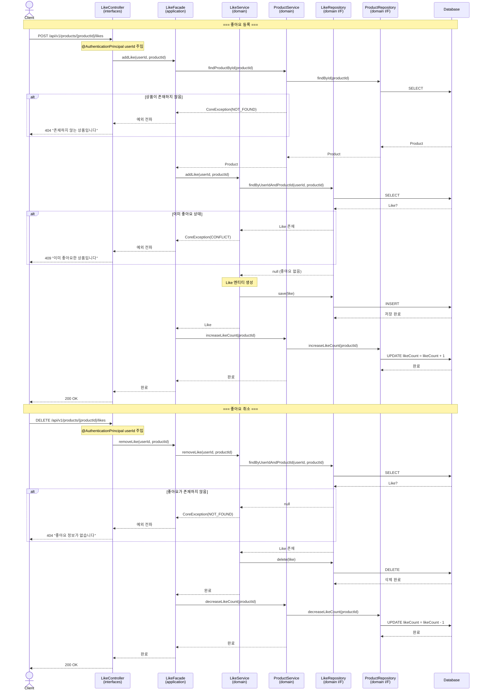
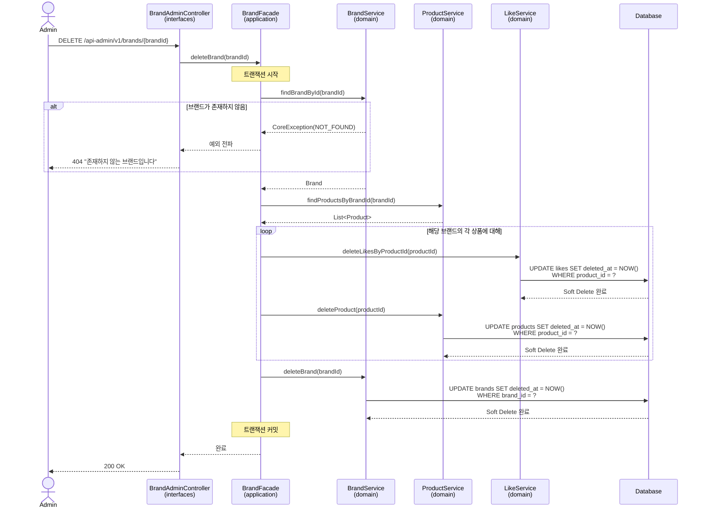
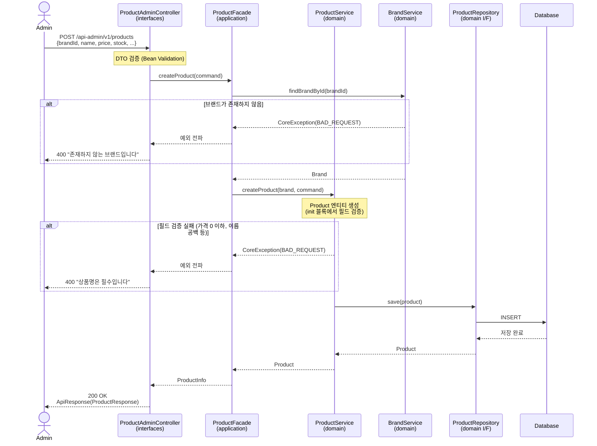

# 02. 시퀀스 다이어그램

---

## 왜 시퀀스 다이어그램이 필요한가

시퀀스 다이어그램으로 검증하려는 것:
1. **책임 분리**: 각 레이어(Controller, Facade, Service, Repository)가 어떤 역할을 하는가
2. **호출 순서**: 어떤 순서로 로직이 실행되는가
3. **트랜잭션 경계**: 어디서 트랜잭션이 시작/종료되는가
4. **예외 처리**: 어느 시점에 실패하면 어떻게 처리되는가

---

## 0. 인증 처리 흐름 (Security Filter Chain)

> 인증은 **횡단 관심사**이므로 모든 시퀀스에 중복하지 않고, 여기서 한 번만 정리한다.
> 이후 시퀀스(1~4)는 **인증 통과 후** 흐름으로 읽으면 된다.

### 이 다이어그램에서 봐야 할 포인트

1. **Controller 도달 전 차단**: 인증 실패 시 Security Filter에서 401을 반환. Controller 코드가 실행되지 않음
2. **Dual FilterChain**: `/api-admin/**`과 `/api/**`가 각각 독립적인 필터 체인으로 처리
3. **ApiResponse 형식 통일**: `CustomAuthenticationEntryPoint`에서 JSON 401 응답을 `ApiResponse` 형식으로 반환
4. **permitAll 경로**: 상품 목록/상세, 브랜드 조회 등 비회원 API는 인증을 건너뜀
5. **@AuthenticationPrincipal**: 인증 성공 시 SecurityContext에 담긴 유저 정보를 Controller에서 `@AuthenticationPrincipal`로 주입받아 사용

### permitAll 경로 목록 (인증 불필요)

| METHOD | URI | 설명 |
|--------|-----|------|
| GET | `/api/v1/brands/{brandId}` | 브랜드 조회 |
| GET | `/api/v1/products?...` | 상품 목록 조회 |
| GET | `/api/v1/products/{productId}` | 상품 상세 조회 |

> 위 경로 외 `/api/**`는 인증 필수, `/api-admin/**`은 LDAP 인증 필수.

---

## 1. 주문 생성 흐름 (정상 + 예외)

> 이 다이어그램이 가장 중요한 이유: 주문은 재고 차감, 스냅샷 저장, 금액 계산이 **하나의 트랜잭션** 안에서 일어나야 하며, 실패 시 전체 롤백이 필요하다.

### 이 다이어그램에서 봐야 할 포인트

1. **트랜잭션 경계**: Facade에서 `@Transactional`을 시작. 재고 차감과 주문 생성이 같은 트랜잭션 → 중간에 실패하면 전체 롤백
2. **재고 차감 방식**: `UPDATE ... WHERE stock >= qty` — DB 원자적 갱신. affected rows가 0이면 재고 부족
3. **스냅샷 생성 시점**: OrderItem 생성 시 Product의 현재 정보를 복사
4. **예외 발생 위치**: 상품 미존재(404), 판매 중지(400), 재고 부족(400) — 각각 다른 시점에서 실패

---

## 2. 상품 좋아요 등록/취소 흐름

> 이 다이어그램으로 검증하려는 것: 좋아요의 중복 방지, likeCount 동기화, 삭제된 상품에 대한 처리

### 이 다이어그램에서 봐야 할 포인트

1. **중복 좋아요 방지**: `findByUserIdAndProductId`로 기존 좋아요 확인 후, 있으면 409 CONFLICT
2. **likeCount 동기화**: Facade가 LikeService → ProductService를 순서대로 호출하여 좋아요 저장 + likeCount 증감을 조합
3. **좋아요 취소 시**: 물리 삭제 (Like 테이블에서 DELETE). 좋아요 이력이 필요하면 Soft Delete로 전환 가능
4. **상품 존재 확인을 먼저**: 삭제된 상품에 좋아요를 시도하면 404 반환
5. **서비스 간 직접 호출 없음**: LikeService와 ProductService가 서로 의존하지 않고, Facade가 조합하는 역할

---

## 3. 어드민 — 브랜드 삭제 흐름 (연쇄 삭제)

> 이 다이어그램으로 검증하려는 것: 브랜드 삭제 시 상품 연쇄 삭제의 범위와 트랜잭션 경계

### 이 다이어그램에서 봐야 할 포인트

1. **Facade의 역할**: 여러 도메인 서비스(Brand, Product, Like)를 조합하는 건 Facade의 책임. 각 서비스는 자기 도메인만 관리
2. **Soft Delete**: `BaseEntity.delete()` → `deletedAt = NOW()`. 주문 스냅샷에 브랜드/상품 정보가 남아있으므로 물리 삭제 불가
3. **삭제 순서**: 좋아요 → 상품 → 브랜드 (의존 관계 역순)
4. **트랜잭션 범위**: 전체가 하나의 트랜잭션. 중간에 실패하면 모두 롤백

### 잠재 리스크

- **대량 상품이 있는 브랜드 삭제 시**: 하나의 트랜잭션이 비대해질 수 있음
  - 대안 1: 배치 처리로 분리 (상품 삭제를 비동기로)
  - 대안 2: 브랜드만 Soft Delete하고, 상품은 조회 시 브랜드 상태를 체크
  - 현재 과제에서는 동기 처리로 충분. 상품 수가 극단적으로 많지 않다는 전제

---

## 4. 상품 등록 흐름 (어드민)

> 이 다이어그램으로 검증하려는 것: 브랜드 존재 확인, 상품 필드 검증

### 이 다이어그램에서 봐야 할 포인트

1. **브랜드 존재 확인이 먼저**: 상품을 만들기 전에 브랜드가 유효한지 검증
2. **엔티티 내 검증**: Product의 `init` 블록에서 필드 검증 (1주차 User 패턴과 동일)
3. **Facade가 조합**: BrandService와 ProductService를 순서대로 호출

---

## 5. 컴포넌트 책임 테이블

| 레이어 | 클래스 | 책임 |
|--------|--------|------|
| **interfaces** | `OrderController` | HTTP 요청 수신, DTO 변환, @AuthenticationPrincipal 주입 |
| **interfaces** | `OrderDto` | Request/Response 직렬화 |
| **application** | `OrderFacade` | 여러 도메인 서비스 조합, 트랜잭션 경계 |
| **application** | `OrderInfo` | 응답용 데이터 (Entity → Info 변환) |
| **domain** | `OrderService` | 주문 생성, 상태 관리, 비즈니스 규칙 |
| **domain** | `ProductService` | 상품 조회, 재고 차감, 좋아요 수 관리 |
| **domain** | `BrandService` | 브랜드 CRUD, 존재 확인 |
| **domain** | `LikeService` | 좋아요 등록/취소, 중복 확인 |
| **domain** | `Order`, `OrderItem` | 주문 엔티티, 스냅샷 포함 |
| **domain** | `Product` | 상품 엔티티, 재고, 상태 관리 |
| **domain** | `Brand` | 브랜드 엔티티 |
| **domain** | `Like` | 좋아요 엔티티 (userId + productId) |
| **infrastructure** | `*RepositoryImpl` | 도메인 Repository 인터페이스의 JPA 구현체 |
