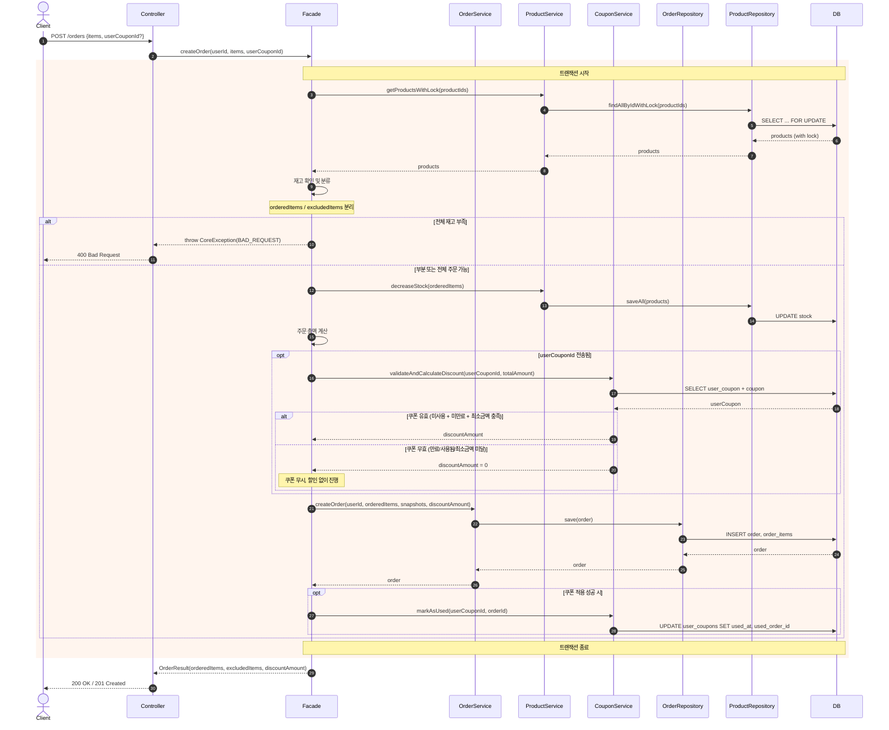
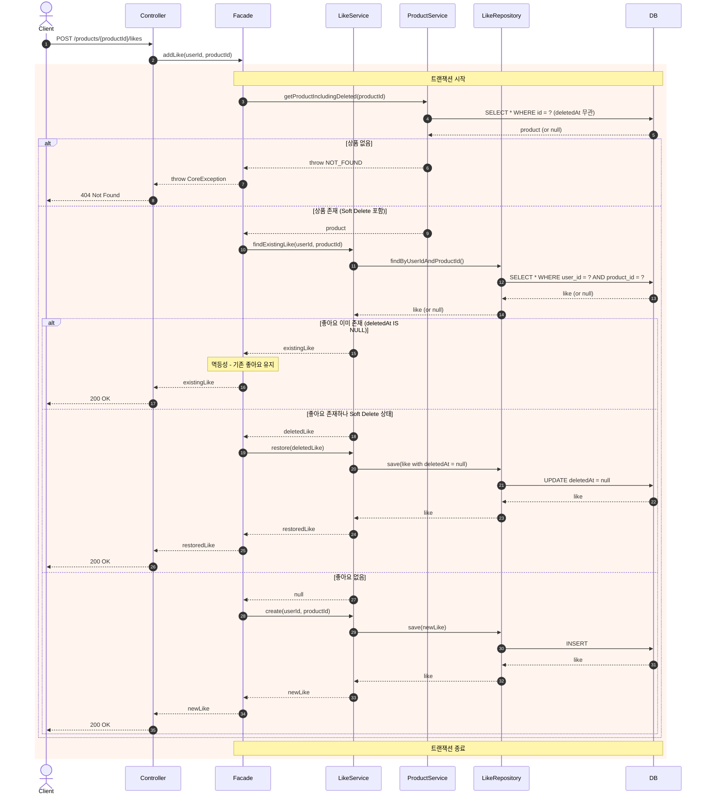
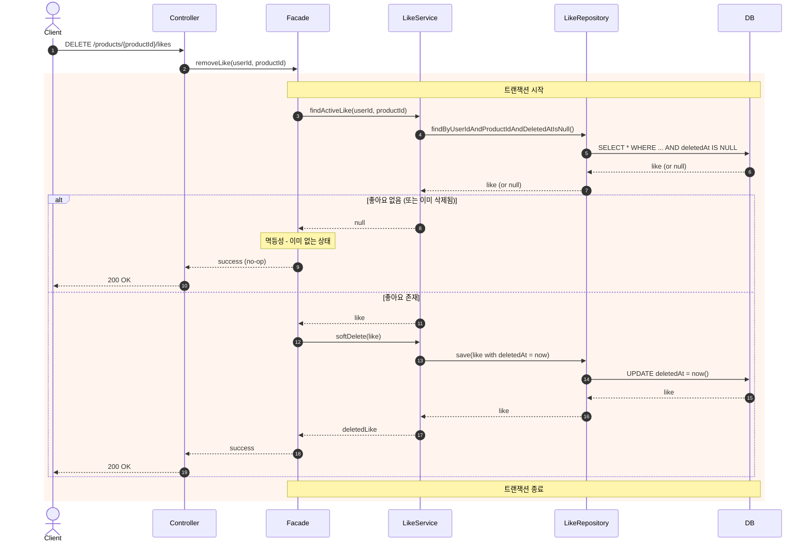
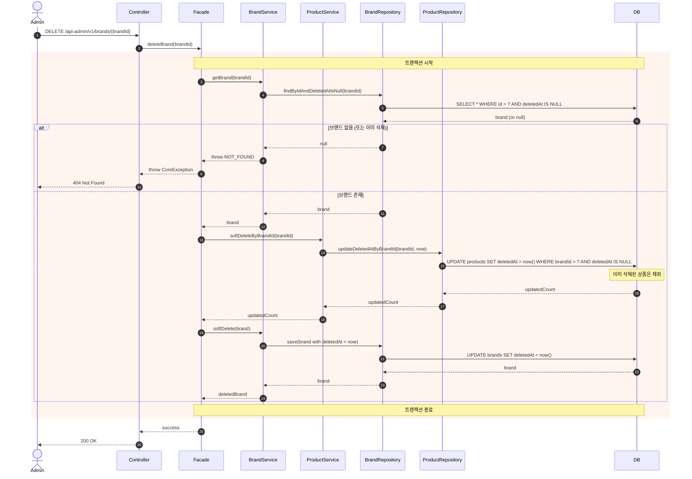
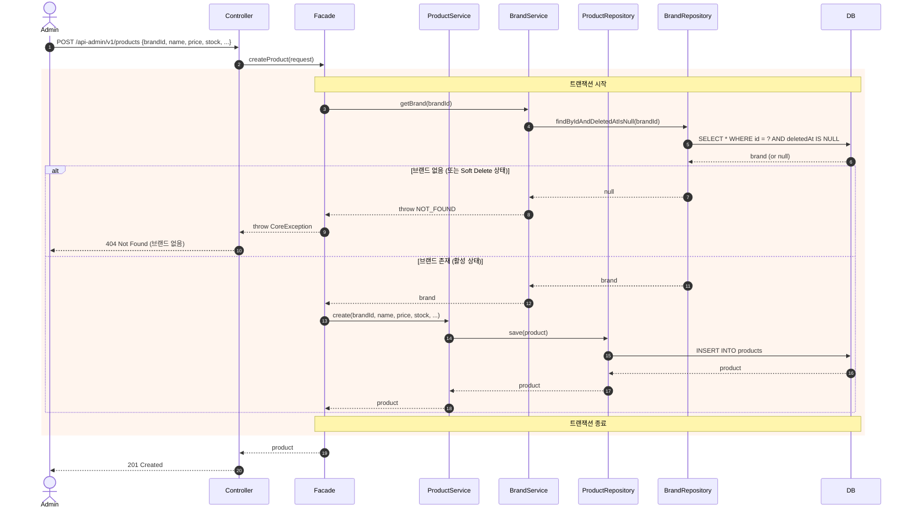

# 시퀀스 다이어그램

> 선정 기준: 여러 도메인 협력 / 트랜잭션 경계 명확화 필요 / 동시성·정합성 처리

---

## 목차

1. [주문 생성 (C10)](#1-주문-생성-c10)
2. [좋아요 등록 (C07)](#2-좋아요-등록-c07)
3. [좋아요 취소 (C08)](#3-좋아요-취소-c08)
4. [브랜드 삭제 - 어드민 (A05)](#4-브랜드-삭제---어드민-a05)
5. [상품 등록 - 어드민 (A08)](#5-상품-등록---어드민-a08)

---

## 1. 주문 생성 (C10)

### 협력 도메인
User → Product → Coupon → Order → OrderItem

### 다이어그램 목적
- 부분 주문 분기점과 excludedItems 결정 시점 확인
- 비관적 락 범위와 스냅샷 저장 순서 검증
- 쿠폰 검증/적용 시점과 실패 시 주문 진행 정책 확인
- 트랜잭션 경계 명확화

### 핵심 포인트
- **락 획득 시점**: 재고 확인 전에 `SELECT FOR UPDATE`로 락 선점
- **분류 시점**: 락 획득 후 Facade에서 orderedItems/excludedItems 분류
- **쿠폰 검증 시점**: 재고 차감 후, 주문 생성 전에 쿠폰 유효성 확인
- **쿠폰 실패 정책**: 검증 실패 시 쿠폰 무시하고 주문 진행 (discountAmount = 0)
- **쿠폰 사용 처리**: 주문 생성 성공 후 쿠폰 사용 상태 업데이트
- **스냅샷 저장**: 재고 차감 후 주문 생성 시 상품 정보 + 할인 정보 복사
- **트랜잭션 범위**: 락 획득 → 재고 차감 → 쿠폰 검증 → 주문 생성 → 쿠폰 사용 처리 전체를 하나의 트랜잭션으로

### 설계 결정
| 결정 | 선택 | 이유 |
|------|------|------|
| 부분 주문 분기 위치 | Facade | 여러 서비스 조합 필요 |
| 락 방식 | 비관적 락 | 재고 정합성 보장 |
| 응답 코드 | 200 OK (부분 주문 포함) | 요청은 성공, 결과에 제외 항목 포함 |
| 쿠폰 검증 시점 | 재고 차감 후 | 할인 대상 총액이 확정된 후 계산 |
| 쿠폰 실패 처리 | 무시하고 진행 | 쿠폰 때문에 주문 자체를 막지 않음 (매출 우선) |

### 잠재 리스크
- **트랜잭션 비대화**: 재고 락 + 쿠폰 검증 + 주문 생성이 하나의 트랜잭션에 포함되어 락 보유 시간 증가
  - 현 규모에서는 문제없으나, 트래픽 증가 시 쿠폰 검증을 트랜잭션 밖으로 분리하는 방안 고려 필요

---

## 2. 좋아요 등록 (C07)

### 협력 도메인
User → Product → Like

### 다이어그램 목적
- 멱등성 처리 분기점 확인
- Soft Delete된 상품/좋아요 처리 방식 검증
- 유니크 제약과 애플리케이션 로직의 역할 분담

### 핵심 포인트
- **상품 조회**: `deletedAt` 무관하게 조회 (Soft Delete 상품도 좋아요 가능)
- **멱등성 보장**: 이미 좋아요 존재 시 에러 없이 200 OK
- **Soft Delete 복원**: 이전에 취소한 좋아요는 신규 생성이 아닌 복원 처리

### 설계 결정
| 결정 | 선택 | 이유 |
|------|------|------|
| Soft Delete 좋아요 처리 | 복원 (deletedAt = null) | 이력 유지, 불필요한 row 증가 방지 |
| 유니크 제약 | DB 인덱스 + 애플리케이션 체크 | 동시 요청 방어 + 명확한 분기 처리 |
| 삭제된 상품 좋아요 | 허용 | 정책 결정 사항 반영 |

---

## 3. 좋아요 취소 (C08)

### 협력 도메인
User → Product → Like

### 다이어그램 목적
- 멱등성 처리 방식 확인 (없는 좋아요 취소 시)
- Soft Delete 처리 흐름 검증

### 핵심 포인트
- **조회 조건**: `deletedAt IS NULL`인 좋아요만 조회
- **멱등성 보장**: 좋아요 없으면 아무 작업 없이 200 OK
- **Soft Delete**: 물리 삭제가 아닌 `deletedAt` 업데이트

### 설계 결정
| 결정 | 선택 | 이유 |
|------|------|------|
| 없는 좋아요 취소 | 200 OK (no-op) | 멱등성 정책 |
| 삭제 방식 | Soft Delete | 이력 추적 |
| 상품 존재 검증 | 생략 | 좋아요만 확인하면 충분 |

---

## 4. 브랜드 삭제 - 어드민 (A05)

### 협력 도메인
Brand → Product (1:N)

### 다이어그램 목적
- 연쇄 Soft Delete 범위와 트랜잭션 경계 확인
- 이미 삭제된 상품 처리 방식 검증

### 핵심 포인트
- **연쇄 삭제 순서**: 상품 먼저 Soft Delete → 브랜드 Soft Delete
- **이미 삭제된 상품**: `deletedAt IS NULL` 조건으로 제외
- **트랜잭션 범위**: 상품 + 브랜드 삭제를 하나의 트랜잭션으로

### 설계 결정
| 결정 | 선택 | 이유 |
|------|------|------|
| 연쇄 삭제 방식 | 일괄 UPDATE | 개별 조회/저장보다 효율적 |
| 이미 삭제된 상품 | 건드리지 않음 | 기존 deletedAt 유지 |
| 트랜잭션 | 단일 트랜잭션 | 정합성 보장 |

### 잠재 리스크
- **대량 상품**: 브랜드에 상품이 수천 개인 경우 락 시간 증가
  - 대안: 배치 처리, 비동기 삭제 (현 요구사항에서는 단일 트랜잭션 유지)

---

## 5. 상품 등록 - 어드민 (A08)

### 협력 도메인
Brand → Product

### 다이어그램 목적
- 브랜드 존재 검증 방식 확인
- Soft Delete된 브랜드 처리 정책 검증

### 핵심 포인트
- **브랜드 검증**: `deletedAt IS NULL`인 브랜드만 허용
- **검증 위치**: 애플리케이션 레벨에서 명시적 검증 (FK 제약만 의존하지 않음)
- **트랜잭션 범위**: 브랜드 조회 + 상품 저장을 하나의 트랜잭션으로

### 설계 결정
| 결정 | 선택 | 이유 |
|------|------|------|
| Soft Delete 브랜드에 등록 | 불허 | 삭제된 브랜드에 상품 추가는 비즈니스적으로 부적절 |
| 검증 방식 | 애플리케이션 검증 | 명확한 에러 메시지, FK는 물리적 정합성만 담당 |
| 트랜잭션 범위 | 단일 트랜잭션 | 조회-저장 사이 브랜드 삭제 방지 |

---

## 요약

| # | API | 핵심 검증 포인트 | 트랜잭션 범위 |
|---|-----|-----------------|--------------|
| 1 | 주문 생성 | 비관적 락, 부분 주문 분기, 쿠폰 검증/적용, 스냅샷 | 락 → 재고 차감 → 쿠폰 검증 → 주문 생성 → 쿠폰 사용 처리 |
| 2 | 좋아요 등록 | 멱등성, Soft Delete 복원 | 상품 조회 → 좋아요 생성/복원 |
| 3 | 좋아요 취소 | 멱등성 (no-op), Soft Delete | 좋아요 조회 → Soft Delete |
| 4 | 브랜드 삭제 | 연쇄 Soft Delete | 상품 일괄 삭제 → 브랜드 삭제 |
| 5 | 상품 등록 | 브랜드 존재 검증 | 브랜드 조회 → 상품 저장 |
