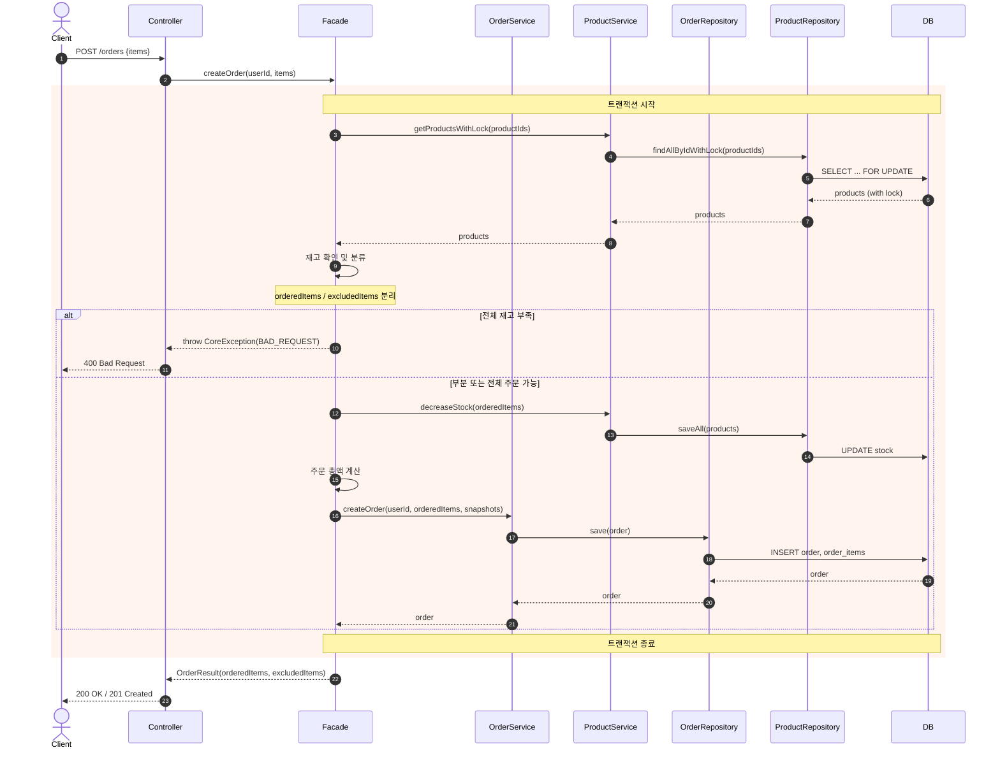
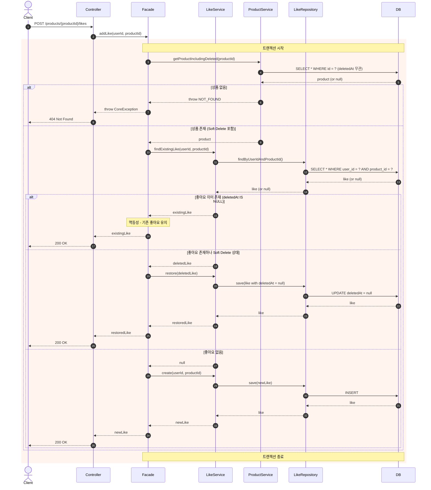
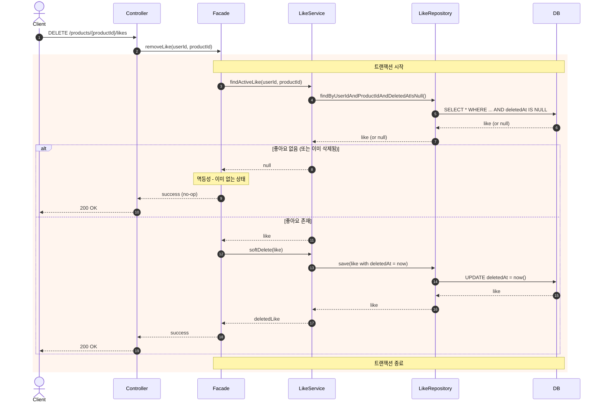
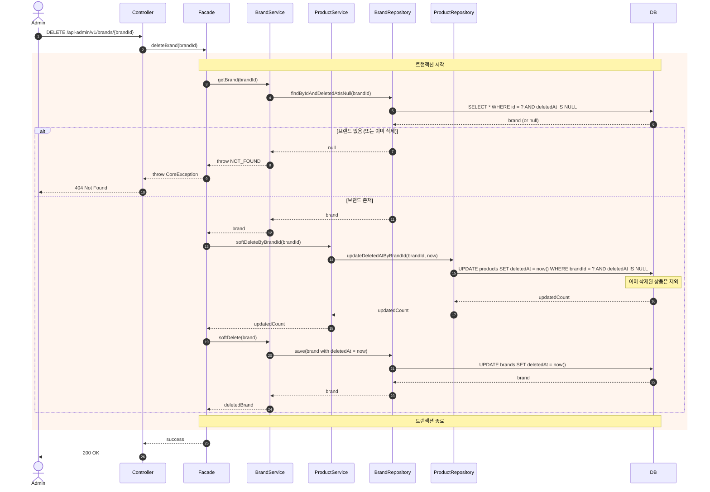
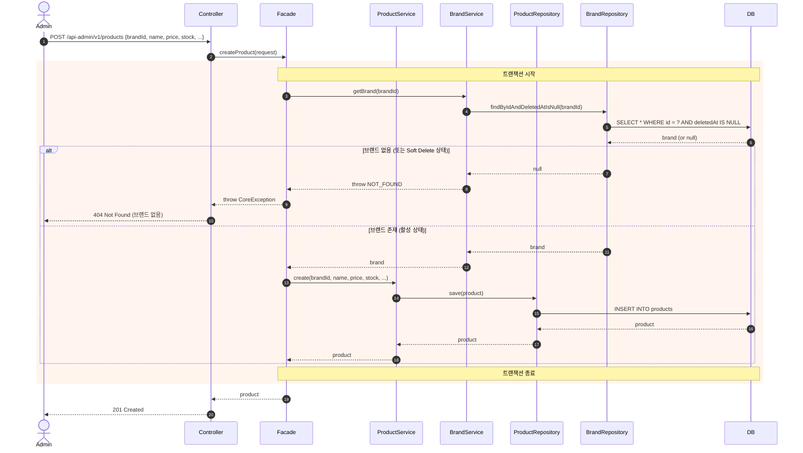
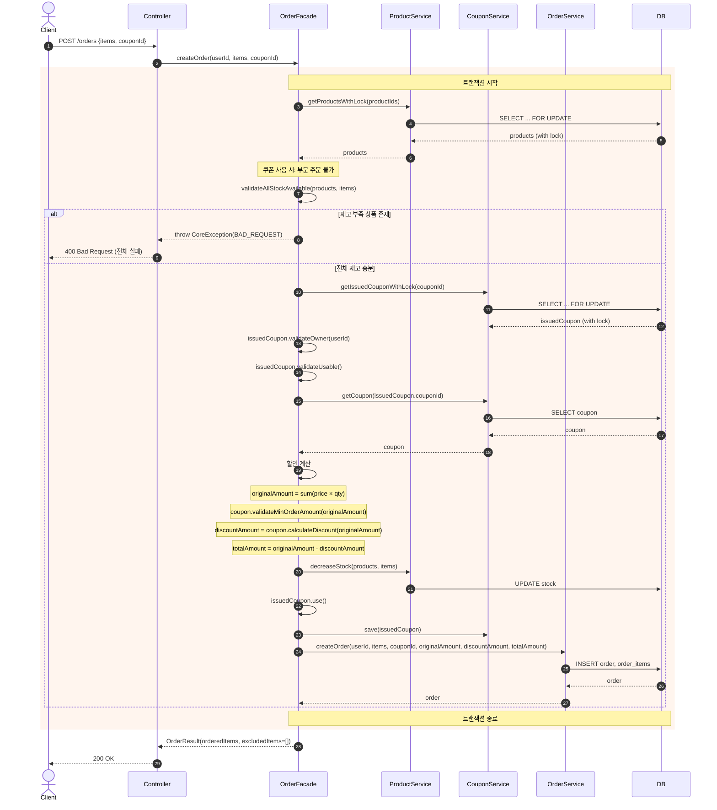
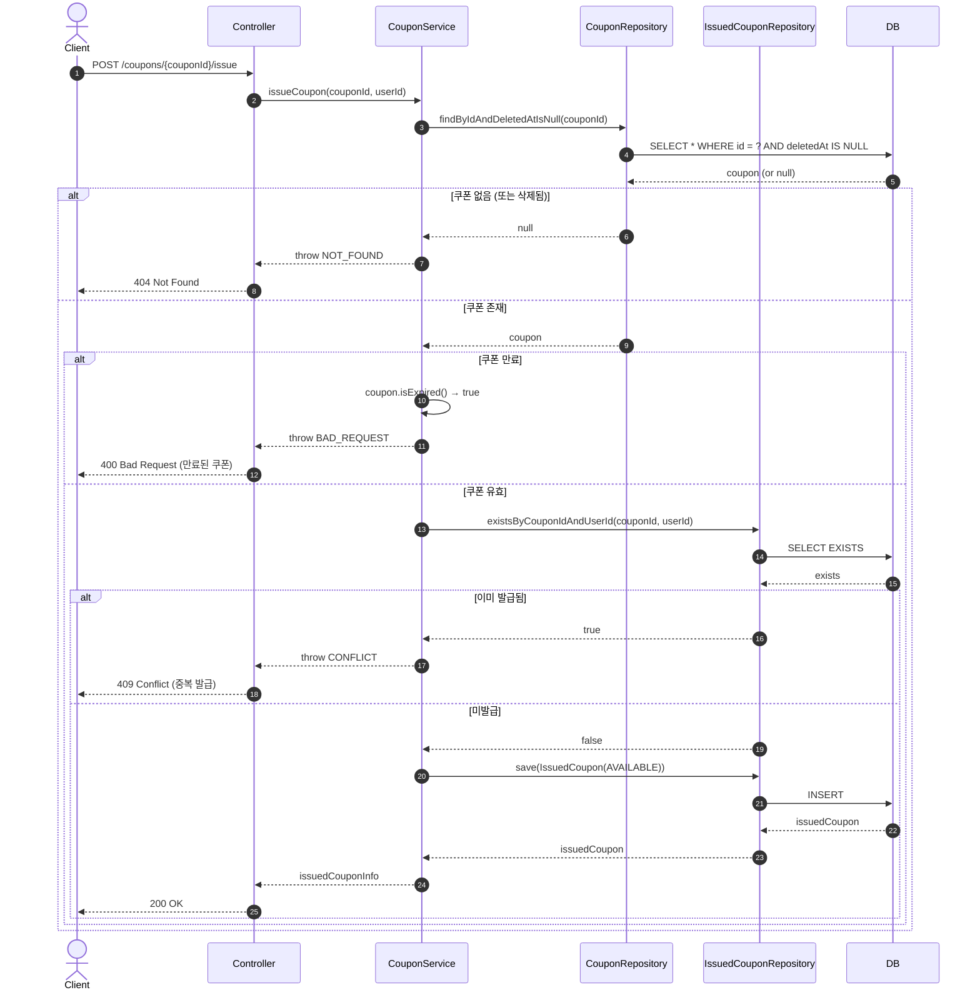

# 시퀀스 다이어그램

> 선정 기준: 여러 도메인 협력 / 트랜잭션 경계 명확화 필요 / 동시성·정합성 처리

---

## 목차

1. [주문 생성 (C10)](#1-주문-생성-c10)
2. [좋아요 등록 (C07)](#2-좋아요-등록-c07)
3. [좋아요 취소 (C08)](#3-좋아요-취소-c08)
4. [브랜드 삭제 - 어드민 (A05)](#4-브랜드-삭제---어드민-a05)
5. [상품 등록 - 어드민 (A08)](#5-상품-등록---어드민-a08)
6. [쿠폰 적용 주문 생성 (C10 + 쿠폰)](#6-쿠폰-적용-주문-생성-c10--쿠폰)
7. [쿠폰 발급 (C13)](#7-쿠폰-발급-c13)

---

## 1. 주문 생성 (C10)

### 협력 도메인
User → Product → Order → OrderItem

### 다이어그램 목적
- 부분 주문 분기점과 excludedItems 결정 시점 확인
- 비관적 락 범위와 스냅샷 저장 순서 검증
- 트랜잭션 경계 명확화

```mermaid
sequenceDiagram
    autonumber
    actor Client
    participant Controller
    participant Facade
    participant OrderService
    participant ProductService
    participant OrderRepository
    participant ProductRepository
    participant DB

    Client->>Controller: POST /orders {items}
    Controller->>Facade: createOrder(userId, items)

    rect rgb(255, 245, 238)
        Note over Facade,DB: 트랜잭션 시작

        Facade->>ProductService: getProductsWithLock(productIds)
        ProductService->>ProductRepository: findAllByIdWithLock(productIds)
        ProductRepository->>DB: SELECT ... FOR UPDATE
        DB-->>ProductRepository: products (with lock)
        ProductRepository-->>ProductService: products
        ProductService-->>Facade: products

        Facade->>Facade: 재고 확인 및 분류
        Note over Facade: orderedItems / excludedItems 분리

        alt 전체 재고 부족
            Facade-->>Controller: throw CoreException(BAD_REQUEST)
            Controller-->>Client: 400 Bad Request
        else 부분 또는 전체 주문 가능
            Facade->>ProductService: decreaseStock(orderedItems)
            ProductService->>ProductRepository: saveAll(products)
            ProductRepository->>DB: UPDATE stock

            Facade->>Facade: 주문 총액 계산

            Facade->>OrderService: createOrder(userId, orderedItems, snapshots)
            OrderService->>OrderRepository: save(order)
            OrderRepository->>DB: INSERT order, order_items
            DB-->>OrderRepository: order
            OrderRepository-->>OrderService: order
            OrderService-->>Facade: order
        end

        Note over Facade,DB: 트랜잭션 종료
    end

    Facade-->>Controller: OrderResult(orderedItems, excludedItems)
    Controller-->>Client: 200 OK / 201 Created
```

### 핵심 포인트
- **락 획득 시점**: 재고 확인 전에 `SELECT FOR UPDATE`로 락 선점
- **분류 시점**: 락 획득 후 Facade에서 orderedItems/excludedItems 분류
- **스냅샷 저장**: 재고 차감 후 주문 생성 시 상품 정보 복사
- **트랜잭션 범위**: 락 획득 → 재고 차감 → 주문 생성 전체를 하나의 트랜잭션으로

### 설계 결정
| 결정 | 선택 | 이유 |
|------|------|------|
| 부분 주문 분기 위치 | Facade | 여러 서비스 조합 필요 |
| 락 방식 | 비관적 락 | 재고 정합성 보장 |
| 응답 코드 | 200 OK (부분 주문 포함) | 요청은 성공, 결과에 제외 항목 포함 |

### 잠재 리스크
- **트랜잭션 내 락 보유 시간**: 재고 락 + 주문 생성이 하나의 트랜잭션에 포함되어 락 보유 시간이 있음
  - 현 규모에서는 문제없으나, 트래픽 증가 시 트랜잭션 범위 축소 방안 고려 필요

---

## 2. 좋아요 등록 (C07)

### 협력 도메인
User → Product → Like

### 다이어그램 목적
- 멱등성 처리 분기점 확인
- Soft Delete된 상품/좋아요 처리 방식 검증
- 유니크 제약과 애플리케이션 로직의 역할 분담

```mermaid
sequenceDiagram
    autonumber
    actor Client
    participant Controller
    participant Facade
    participant LikeService
    participant ProductService
    participant LikeRepository
    participant DB

    Client->>Controller: POST /products/{productId}/likes
    Controller->>Facade: addLike(userId, productId)

    rect rgb(255, 245, 238)
        Note over Facade,DB: 트랜잭션 시작

        Facade->>ProductService: getProductIncludingDeleted(productId)
        ProductService->>DB: SELECT * WHERE id = ? (deletedAt 무관)
        DB-->>ProductService: product (or null)

        alt 상품 없음
            ProductService-->>Facade: throw NOT_FOUND
            Facade-->>Controller: throw CoreException
            Controller-->>Client: 404 Not Found
        else 상품 존재 (Soft Delete 포함)
            ProductService-->>Facade: product

            Facade->>LikeService: findExistingLike(userId, productId)
            LikeService->>LikeRepository: findByUserIdAndProductId()
            LikeRepository->>DB: SELECT * WHERE user_id = ? AND product_id = ?
            DB-->>LikeRepository: like (or null)
            LikeRepository-->>LikeService: like (or null)

            alt 좋아요 이미 존재 (deletedAt IS NULL)
                LikeService-->>Facade: existingLike
                Note over Facade: 멱등성 - 기존 좋아요 유지
                Facade-->>Controller: existingLike
                Controller-->>Client: 200 OK
            else 좋아요 존재하나 Soft Delete 상태
                LikeService-->>Facade: deletedLike
                Facade->>LikeService: restore(deletedLike)
                LikeService->>LikeRepository: save(like with deletedAt = null)
                LikeRepository->>DB: UPDATE deletedAt = null
                DB-->>LikeRepository: like
                LikeRepository-->>LikeService: like
                LikeService-->>Facade: restoredLike
                Facade-->>Controller: restoredLike
                Controller-->>Client: 200 OK
            else 좋아요 없음
                LikeService-->>Facade: null
                Facade->>LikeService: create(userId, productId)
                LikeService->>LikeRepository: save(newLike)
                LikeRepository->>DB: INSERT
                DB-->>LikeRepository: like
                LikeRepository-->>LikeService: like
                LikeService-->>Facade: newLike
                Facade-->>Controller: newLike
                Controller-->>Client: 200 OK
            end
        end

        Note over Facade,DB: 트랜잭션 종료
    end
```

### 핵심 포인트
- **상품 조회**: `deletedAt` 무관하게 조회 (Soft Delete 상품도 좋아요 가능)
- **멱등성 보장**: 이미 좋아요 존재 시 에러 없이 200 OK
- **Soft Delete 복원**: 이전에 취소한 좋아요는 신규 생성이 아닌 복원 처리

### 설계 결정
| 결정 | 선택 | 이유 |
|------|------|------|
| Soft Delete 좋아요 처리 | 복원 (deletedAt = null) | 이력 유지, 불필요한 row 증가 방지 |
| 유니크 제약 | DB 인덱스 + 애플리케이션 체크 | 동시 요청 방어 + 명확한 분기 처리 |
| 삭제된 상품 좋아요 | 허용 | 정책 결정 사항 반영 |

---

## 3. 좋아요 취소 (C08)

### 협력 도메인
User → Product → Like

### 다이어그램 목적
- 멱등성 처리 방식 확인 (없는 좋아요 취소 시)
- Soft Delete 처리 흐름 검증

```mermaid
sequenceDiagram
    autonumber
    actor Client
    participant Controller
    participant Facade
    participant LikeService
    participant LikeRepository
    participant DB

    Client->>Controller: DELETE /products/{productId}/likes
    Controller->>Facade: removeLike(userId, productId)

    rect rgb(255, 245, 238)
        Note over Facade,DB: 트랜잭션 시작

        Facade->>LikeService: findActiveLike(userId, productId)
        LikeService->>LikeRepository: findByUserIdAndProductIdAndDeletedAtIsNull()
        LikeRepository->>DB: SELECT * WHERE ... AND deletedAt IS NULL
        DB-->>LikeRepository: like (or null)
        LikeRepository-->>LikeService: like (or null)

        alt 좋아요 없음 (또는 이미 삭제됨)
            LikeService-->>Facade: null
            Note over Facade: 멱등성 - 이미 없는 상태
            Facade-->>Controller: success (no-op)
            Controller-->>Client: 200 OK
        else 좋아요 존재
            LikeService-->>Facade: like
            Facade->>LikeService: softDelete(like)
            LikeService->>LikeRepository: save(like with deletedAt = now)
            LikeRepository->>DB: UPDATE deletedAt = now()
            DB-->>LikeRepository: like
            LikeRepository-->>LikeService: like
            LikeService-->>Facade: deletedLike
            Facade-->>Controller: success
            Controller-->>Client: 200 OK
        end

        Note over Facade,DB: 트랜잭션 종료
    end
```

### 핵심 포인트
- **조회 조건**: `deletedAt IS NULL`인 좋아요만 조회
- **멱등성 보장**: 좋아요 없으면 아무 작업 없이 200 OK
- **Soft Delete**: 물리 삭제가 아닌 `deletedAt` 업데이트

### 설계 결정
| 결정 | 선택 | 이유 |
|------|------|------|
| 없는 좋아요 취소 | 200 OK (no-op) | 멱등성 정책 |
| 삭제 방식 | Soft Delete | 이력 추적 |
| 상품 존재 검증 | 생략 | 좋아요만 확인하면 충분 |

---

## 4. 브랜드 삭제 - 어드민 (A05)

### 협력 도메인
Brand → Product (1:N)

### 다이어그램 목적
- 연쇄 Soft Delete 범위와 트랜잭션 경계 확인
- 이미 삭제된 상품 처리 방식 검증

```mermaid
sequenceDiagram
    autonumber
    actor Admin
    participant Controller
    participant Facade
    participant BrandService
    participant ProductService
    participant BrandRepository
    participant ProductRepository
    participant DB

    Admin->>Controller: DELETE /api-admin/v1/brands/{brandId}
    Controller->>Facade: deleteBrand(brandId)

    rect rgb(255, 245, 238)
        Note over Facade,DB: 트랜잭션 시작

        Facade->>BrandService: getBrand(brandId)
        BrandService->>BrandRepository: findByIdAndDeletedAtIsNull(brandId)
        BrandRepository->>DB: SELECT * WHERE id = ? AND deletedAt IS NULL
        DB-->>BrandRepository: brand (or null)

        alt 브랜드 없음 (또는 이미 삭제)
            BrandRepository-->>BrandService: null
            BrandService-->>Facade: throw NOT_FOUND
            Facade-->>Controller: throw CoreException
            Controller-->>Admin: 404 Not Found
        else 브랜드 존재
            BrandRepository-->>BrandService: brand
            BrandService-->>Facade: brand

            Facade->>ProductService: softDeleteByBrandId(brandId)
            ProductService->>ProductRepository: updateDeletedAtByBrandId(brandId, now)
            ProductRepository->>DB: UPDATE products SET deletedAt = now() WHERE brandId = ? AND deletedAt IS NULL
            Note over DB: 이미 삭제된 상품은 제외
            DB-->>ProductRepository: updatedCount
            ProductRepository-->>ProductService: updatedCount
            ProductService-->>Facade: updatedCount

            Facade->>BrandService: softDelete(brand)
            BrandService->>BrandRepository: save(brand with deletedAt = now)
            BrandRepository->>DB: UPDATE brands SET deletedAt = now()
            DB-->>BrandRepository: brand
            BrandRepository-->>BrandService: brand
            BrandService-->>Facade: deletedBrand
        end

        Note over Facade,DB: 트랜잭션 종료
    end

    Facade-->>Controller: success
    Controller-->>Admin: 200 OK
```

### 핵심 포인트
- **연쇄 삭제 순서**: 상품 먼저 Soft Delete → 브랜드 Soft Delete
- **이미 삭제된 상품**: `deletedAt IS NULL` 조건으로 제외
- **트랜잭션 범위**: 상품 + 브랜드 삭제를 하나의 트랜잭션으로

### 설계 결정
| 결정 | 선택 | 이유 |
|------|------|------|
| 연쇄 삭제 방식 | 일괄 UPDATE | 개별 조회/저장보다 효율적 |
| 이미 삭제된 상품 | 건드리지 않음 | 기존 deletedAt 유지 |
| 트랜잭션 | 단일 트랜잭션 | 정합성 보장 |

### 잠재 리스크
- **대량 상품**: 브랜드에 상품이 수천 개인 경우 락 시간 증가
  - 대안: 배치 처리, 비동기 삭제 (현 요구사항에서는 단일 트랜잭션 유지)

---

## 5. 상품 등록 - 어드민 (A08)

### 협력 도메인
Brand → Product

### 다이어그램 목적
- 브랜드 존재 검증 방식 확인
- Soft Delete된 브랜드 처리 정책 검증

```mermaid
sequenceDiagram
    autonumber
    actor Admin
    participant Controller
    participant Facade
    participant ProductService
    participant BrandService
    participant ProductRepository
    participant BrandRepository
    participant DB

    Admin->>Controller: POST /api-admin/v1/products {brandId, name, price, stock, ...}
    Controller->>Facade: createProduct(request)

    rect rgb(255, 245, 238)
        Note over Facade,DB: 트랜잭션 시작

        Facade->>BrandService: getBrand(brandId)
        BrandService->>BrandRepository: findByIdAndDeletedAtIsNull(brandId)
        BrandRepository->>DB: SELECT * WHERE id = ? AND deletedAt IS NULL
        DB-->>BrandRepository: brand (or null)

        alt 브랜드 없음 (또는 Soft Delete 상태)
            BrandRepository-->>BrandService: null
            BrandService-->>Facade: throw NOT_FOUND
            Facade-->>Controller: throw CoreException
            Controller-->>Admin: 404 Not Found (브랜드 없음)
        else 브랜드 존재 (활성 상태)
            BrandRepository-->>BrandService: brand
            BrandService-->>Facade: brand

            Facade->>ProductService: create(brandId, name, price, stock, ...)
            ProductService->>ProductRepository: save(product)
            ProductRepository->>DB: INSERT INTO products
            DB-->>ProductRepository: product
            ProductRepository-->>ProductService: product
            ProductService-->>Facade: product
        end

        Note over Facade,DB: 트랜잭션 종료
    end

    Facade-->>Controller: product
    Controller-->>Admin: 201 Created
```

### 핵심 포인트
- **브랜드 검증**: `deletedAt IS NULL`인 브랜드만 허용
- **검증 위치**: 애플리케이션 레벨에서 명시적 검증 (FK 제약만 의존하지 않음)
- **트랜잭션 범위**: 브랜드 조회 + 상품 저장을 하나의 트랜잭션으로

### 설계 결정
| 결정 | 선택 | 이유 |
|------|------|------|
| Soft Delete 브랜드에 등록 | 불허 | 삭제된 브랜드에 상품 추가는 비즈니스적으로 부적절 |
| 검증 방식 | 애플리케이션 검증 | 명확한 에러 메시지, FK는 물리적 정합성만 담당 |
| 트랜잭션 범위 | 단일 트랜잭션 | 조회-저장 사이 브랜드 삭제 방지 |

---

---

## 6. 쿠폰 적용 주문 생성 (C10 + 쿠폰)

### 협력 도메인
User → Product → IssuedCoupon → Coupon → Order → OrderItem

### 다이어그램 목적
- 쿠폰 적용 시 부분 주문 불가 정책 확인
- 비관적 락 범위 (상품 + 쿠폰) 확인
- 쿠폰 유효성 검증 순서와 롤백 범위 확인

```mermaid
sequenceDiagram
    autonumber
    actor Client
    participant Controller
    participant Facade as OrderFacade
    participant ProductService
    participant CouponService
    participant OrderService
    participant DB

    Client->>Controller: POST /orders {items, couponId}
    Controller->>Facade: createOrder(userId, items, couponId)

    rect rgb(255, 245, 238)
        Note over Facade,DB: 트랜잭션 시작

        Facade->>ProductService: getProductsWithLock(productIds)
        ProductService->>DB: SELECT ... FOR UPDATE
        DB-->>ProductService: products (with lock)
        ProductService-->>Facade: products

        Note over Facade: 쿠폰 사용 시: 부분 주문 불가
        Facade->>Facade: validateAllStockAvailable(products, items)

        alt 재고 부족 상품 존재
            Facade-->>Controller: throw CoreException(BAD_REQUEST)
            Controller-->>Client: 400 Bad Request (전체 실패)
        else 전체 재고 충분
            Facade->>CouponService: getIssuedCouponWithLock(couponId)
            CouponService->>DB: SELECT ... FOR UPDATE
            DB-->>CouponService: issuedCoupon (with lock)

            Facade->>Facade: issuedCoupon.validateOwner(userId)
            Facade->>Facade: issuedCoupon.validateUsable()

            Facade->>CouponService: getCoupon(issuedCoupon.couponId)
            CouponService->>DB: SELECT coupon
            DB-->>CouponService: coupon
            CouponService-->>Facade: coupon

            Facade->>Facade: 할인 계산
            Note over Facade: originalAmount = sum(price × qty)
            Note over Facade: coupon.validateMinOrderAmount(originalAmount)
            Note over Facade: discountAmount = coupon.calculateDiscount(originalAmount)
            Note over Facade: totalAmount = originalAmount - discountAmount

            Facade->>ProductService: decreaseStock(products, items)
            ProductService->>DB: UPDATE stock

            Facade->>Facade: issuedCoupon.use()
            Facade->>CouponService: save(issuedCoupon)

            Facade->>OrderService: createOrder(userId, items, couponId, originalAmount, discountAmount, totalAmount)
            OrderService->>DB: INSERT order, order_items
            DB-->>OrderService: order
            OrderService-->>Facade: order
        end

        Note over Facade,DB: 트랜잭션 종료
    end

    Facade-->>Controller: OrderResult(orderedItems, excludedItems=[])
    Controller-->>Client: 200 OK
```

### 핵심 포인트
- **부분 주문 불가**: 쿠폰 사용 시 모든 상품 재고가 충분해야 함 (전체 성공 or 전체 실패)
- **이중 비관적 락**: 상품(재고) + 발급 쿠폰을 모두 `SELECT FOR UPDATE`로 락
- **검증 순서**: 재고 확인 → 쿠폰 소유자 검증 → 사용 가능 검증 → 최소 주문 금액 검증
- **원자성**: 재고 차감 + 쿠폰 사용 처리 + 주문 생성이 하나의 트랜잭션

### 설계 결정
| 결정 | 선택 | 이유 |
|------|------|------|
| 쿠폰 + 부분 주문 | 불가 | 할인 금액 재계산 복잡성 회피 |
| 쿠폰 락 방식 | 비관적 락 | 동시 주문 시 중복 사용 방지 |
| 쿠폰 미사용 주문 | 기존 부분 주문 로직 유지 | 하위 호환성 |

---

## 7. 쿠폰 발급 (C13)

### 협력 도메인
User → Coupon → IssuedCoupon

### 다이어그램 목적
- 중복 발급 방지 로직 확인
- 만료/삭제 쿠폰 발급 거부 확인

```mermaid
sequenceDiagram
    autonumber
    actor Client
    participant Controller
    participant CouponService
    participant CouponRepository
    participant IssuedCouponRepository
    participant DB

    Client->>Controller: POST /coupons/{couponId}/issue
    Controller->>CouponService: issueCoupon(couponId, userId)

    CouponService->>CouponRepository: findByIdAndDeletedAtIsNull(couponId)
    CouponRepository->>DB: SELECT * WHERE id = ? AND deletedAt IS NULL
    DB-->>CouponRepository: coupon (or null)

    alt 쿠폰 없음 (또는 삭제됨)
        CouponRepository-->>CouponService: null
        CouponService-->>Controller: throw NOT_FOUND
        Controller-->>Client: 404 Not Found
    else 쿠폰 존재
        CouponRepository-->>CouponService: coupon

        alt 쿠폰 만료
            CouponService->>CouponService: coupon.isExpired() → true
            CouponService-->>Controller: throw BAD_REQUEST
            Controller-->>Client: 400 Bad Request (만료된 쿠폰)
        else 쿠폰 유효
            CouponService->>IssuedCouponRepository: existsByCouponIdAndUserId(couponId, userId)
            IssuedCouponRepository->>DB: SELECT EXISTS
            DB-->>IssuedCouponRepository: exists

            alt 이미 발급됨
                IssuedCouponRepository-->>CouponService: true
                CouponService-->>Controller: throw CONFLICT
                Controller-->>Client: 409 Conflict (중복 발급)
            else 미발급
                IssuedCouponRepository-->>CouponService: false
                CouponService->>IssuedCouponRepository: save(IssuedCoupon(AVAILABLE))
                IssuedCouponRepository->>DB: INSERT
                DB-->>IssuedCouponRepository: issuedCoupon
                IssuedCouponRepository-->>CouponService: issuedCoupon
                CouponService-->>Controller: issuedCouponInfo
                Controller-->>Client: 200 OK
            end
        end
    end
```

### 핵심 포인트
- **검증 순서**: 쿠폰 존재 → 만료 여부 → 중복 발급 여부
- **중복 발급 방지**: `existsByCouponIdAndUserId`로 확인
- **상태 초기화**: 발급 시 `AVAILABLE` 상태로 생성

### 설계 결정
| 결정 | 선택 | 이유 |
|------|------|------|
| 중복 발급 | 거부 (CONFLICT) | 1인 1쿠폰 정책 |
| 만료 쿠폰 | 발급 거부 | 사용 불가 쿠폰 발급 방지 |
| 삭제 쿠폰 | 발급 거부 | Soft Delete된 쿠폰은 비활성 |

---

## 요약

| # | API | 핵심 검증 포인트 | 트랜잭션 범위 |
|---|-----|-----------------|--------------|
| 1 | 주문 생성 | 비관적 락, 부분 주문 분기, 스냅샷 | 락 → 재고 차감 → 주문 생성 |
| 2 | 좋아요 등록 | 멱등성, Soft Delete 복원 | 상품 조회 → 좋아요 생성/복원 |
| 3 | 좋아요 취소 | 멱등성 (no-op), Soft Delete | 좋아요 조회 → Soft Delete |
| 4 | 브랜드 삭제 | 연쇄 Soft Delete | 상품 일괄 삭제 → 브랜드 삭제 |
| 5 | 상품 등록 | 브랜드 존재 검증 | 브랜드 조회 → 상품 저장 |
| 6 | 쿠폰 적용 주문 | 이중 비관적 락, 부분 주문 불가, 쿠폰 사용 처리 | 상품 락 → 쿠폰 락 → 재고 차감 → 쿠폰 사용 → 주문 생성 |
| 7 | 쿠폰 발급 | 중복 발급 방지, 만료/삭제 검증 | 쿠폰 조회 → 중복 확인 → 발급 |
