# 시퀀스 다이어그램

시스템의 주요 기능에 대한 **핵심 성공 흐름(Happy Path)** 을 기술한다.
상세한 예외 처리 규칙(400, 404 등)과 필드 검증 로직은 요구사항 명세서를 참고한다.

### 다이어그램 공통 규칙

- **참여자(Participant) 레벨 통일**:
    - **Controller**: 요청 수신, 파라미터 매핑, 응답 변환
    - **UseCase**: `@Transactional` 경계 설정, Repository / Domain Service 오케스트레이션
    - **Domain Service**: 여러 엔티티 간 원자적 얽힘이 있는 복잡한 비즈니스 로직 (예: `PointCharger`, `PointDeductor`)
    - **Repository**: DB 접근 (JPA)
- **트랜잭션 경계**: `@Transactional`은 UseCase의 `execute()` 메서드에 부착. Domain Service는 UseCase가 열어 둔 트랜잭션에 참여.
- **인증**: AuthInterceptor → `@AuthUser userId: Long` 파라미터 주입. 어드민은 AdminInterceptor가 `X-Loopers-Ldap` 헤더 검증.
- **soft delete**: `@Where` 미사용. Repository 메서드마다 `deletedAt IS NULL` 조건을 명시적으로 추가.
- **생략된 내용**:
    - 인증 인터셉터 처리 과정 (전제 조건으로 취급)
    - 상세한 DTO 변환 과정
    - 단순 유효성 검증 실패(400 Bad Request) 흐름

---

## 1. 브랜드 & 상품 — 대고객 API

### 1.1 브랜드 정보 조회

**API:** `GET /api/v1/brands/{brandId}` — 인증 불필요

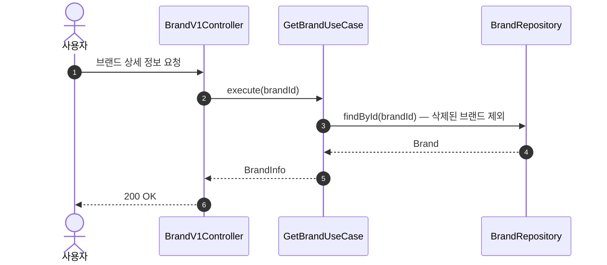
```mermaid
sequenceDiagram
    autonumber
    actor User as 사용자
    participant C as BrandV1Controller
    participant UC as GetBrandUseCase
    participant R as BrandRepository
    User ->> C: 브랜드 상세 정보 요청
    C ->> UC: execute(brandId)
    UC ->> R: findById(brandId) — 삭제된 브랜드 제외
    R -->> UC: Brand
    UC -->> C: BrandInfo
    C -->> User: 200 OK
```

### 1.2 상품 목록 조회

**API:** `GET /api/v1/products` — 인증 불필요

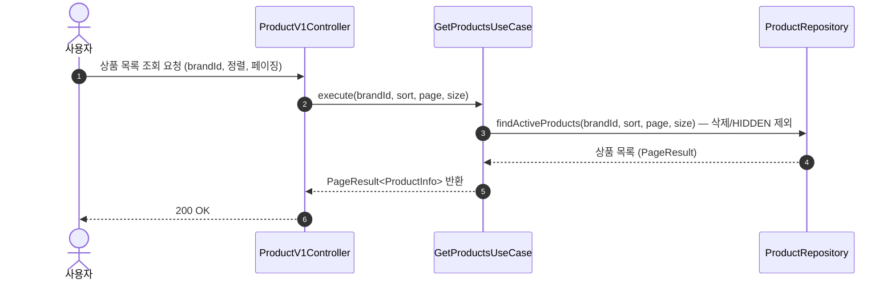
```mermaid
sequenceDiagram
    autonumber
    actor User as 사용자
    participant C as ProductV1Controller
    participant UC as GetProductsUseCase
    participant R as ProductRepository
    User ->> C: 상품 목록 조회 요청 (brandId, 정렬, 페이징)
    C ->> UC: execute(brandId, sort, page, size)
    UC ->> R: findActiveProducts(brandId, sort, page, size) — 삭제/HIDDEN 제외
    R -->> UC: 상품 목록 (PageResult)
    UC -->> C: PageResult<ProductInfo> 반환
    C -->> User: 200 OK
```

#### 참고

- 필터 조건: `deletedAt IS NULL AND status != 'HIDDEN'`, brandId 선택적 필터
- 응답에 페이징 메타데이터 포함: content, totalElements, totalPages, number, size

### 1.3 상품 상세 조회

상품 정보와 해당 브랜드 정보를 **UseCase**에서 조합하여 응답하는 흐름이다.

**API:** `GET /api/v1/products/{productId}` — 인증 불필요

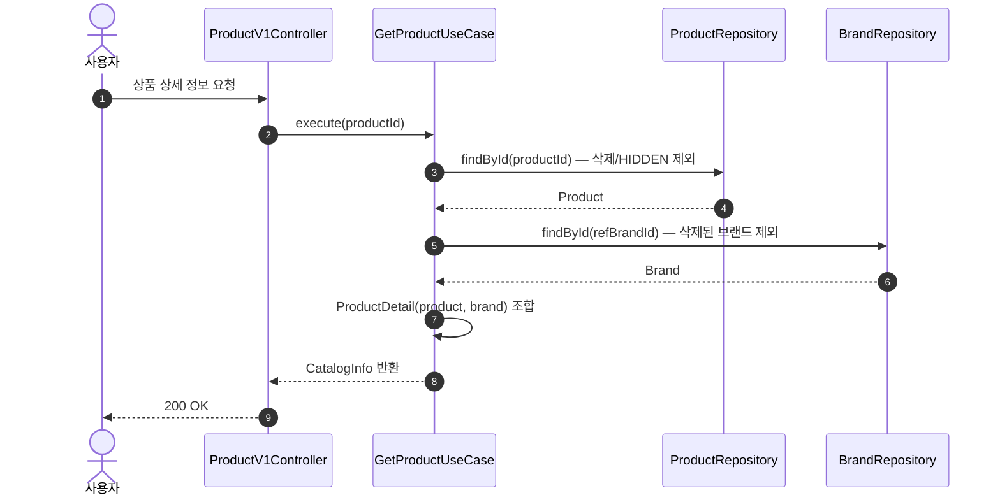
```mermaid
sequenceDiagram
    autonumber
    actor User as 사용자
    participant C as ProductV1Controller
    participant UC as GetProductUseCase
    participant PR as ProductRepository
    participant BR as BrandRepository
    User ->> C: 상품 상세 정보 요청
    C ->> UC: execute(productId)
    UC ->> PR: findById(productId) — 삭제/HIDDEN 제외
    PR -->> UC: Product
    UC ->> BR: findById(refBrandId) — 삭제된 브랜드 제외
    BR -->> UC: Brand
    UC ->> UC: ProductDetail(product, brand) 조합
    UC -->> C: CatalogInfo 반환
    C -->> User: 200 OK
```

#### 참고

- `GetProductUseCase`는 ProductRepository와 BrandRepository를 직접 주입받아 사용한다
- 삭제된 브랜드의 상품 조회 시 NOT_FOUND 예외 발생

---

## 2. 브랜드 & 상품 — 어드민 API

### 2.1 브랜드 목록 조회

**API:** `GET /api-admin/v1/brands` — LDAP 인증

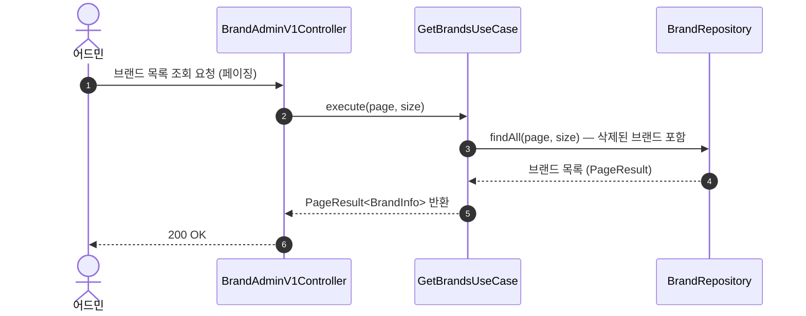
```mermaid
sequenceDiagram
    autonumber
    actor Admin as 어드민
    participant C as BrandAdminV1Controller
    participant UC as GetBrandsUseCase
    participant R as BrandRepository
    Admin ->> C: 브랜드 목록 조회 요청 (페이징)
    C ->> UC: execute(page, size)
    UC ->> R: findAll(page, size) — 삭제된 브랜드 포함
    R -->> UC: 브랜드 목록 (PageResult)
    UC -->> C: PageResult<BrandInfo> 반환
    C -->> Admin: 200 OK
```

#### 참고

- 어드민 목록 조회는 삭제된 브랜드 포함 (필터 없음)

### 2.2 브랜드 상세 조회

**API:** `GET /api-admin/v1/brands/{brandId}` — LDAP 인증

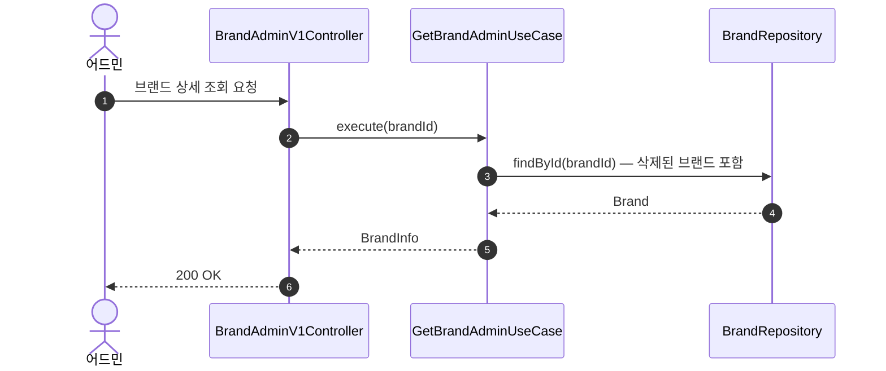
```mermaid
sequenceDiagram
    autonumber
    actor Admin as 어드민
    participant C as BrandAdminV1Controller
    participant UC as GetBrandAdminUseCase
    participant R as BrandRepository
    Admin ->> C: 브랜드 상세 조회 요청
    C ->> UC: execute(brandId)
    UC ->> R: findById(brandId) — 삭제된 브랜드 포함
    R -->> UC: Brand
    UC -->> C: BrandInfo
    C -->> Admin: 200 OK
```

#### 참고

- 어드민은 삭제된 브랜드도 조회 가능 (삭제 상태 확인 목적)

### 2.3 브랜드 등록

**API:** `POST /api-admin/v1/brands` — LDAP 인증

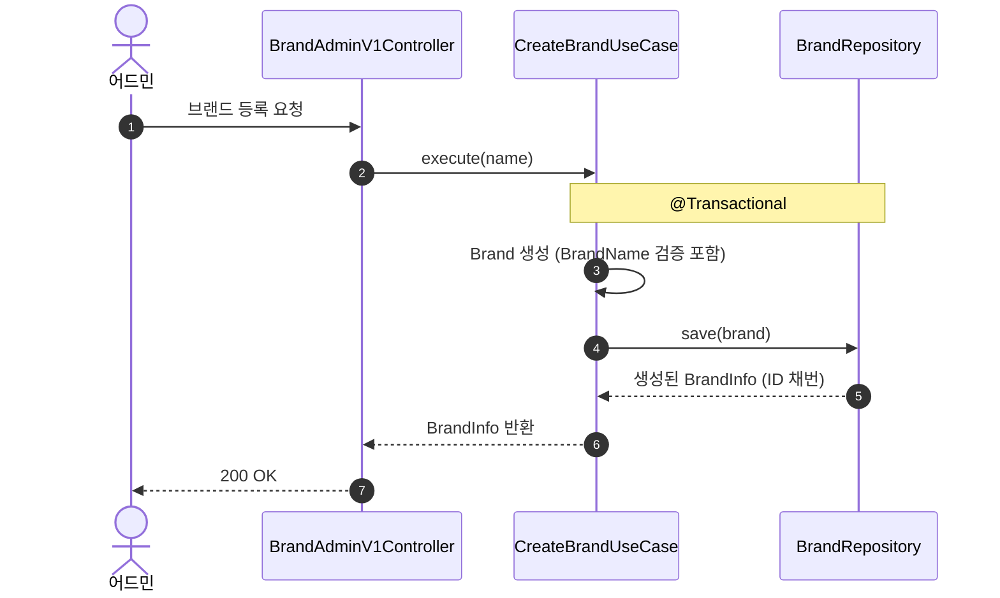
```mermaid
sequenceDiagram
    autonumber
    actor Admin as 어드민
    participant C as BrandAdminV1Controller
    participant UC as CreateBrandUseCase
    participant R as BrandRepository
    Admin ->> C: 브랜드 등록 요청
    C ->> UC: execute(name)
    Note over UC, R: @Transactional
    UC ->> UC: Brand 생성 (BrandName 검증 포함)
    UC ->> R: save(brand)
    R -->> UC: 생성된 BrandInfo (ID 채번)
    UC -->> C: BrandInfo 반환
    C -->> Admin: 200 OK
```

### 2.4 브랜드 수정

**API:** `PUT /api-admin/v1/brands/{brandId}` — LDAP 인증

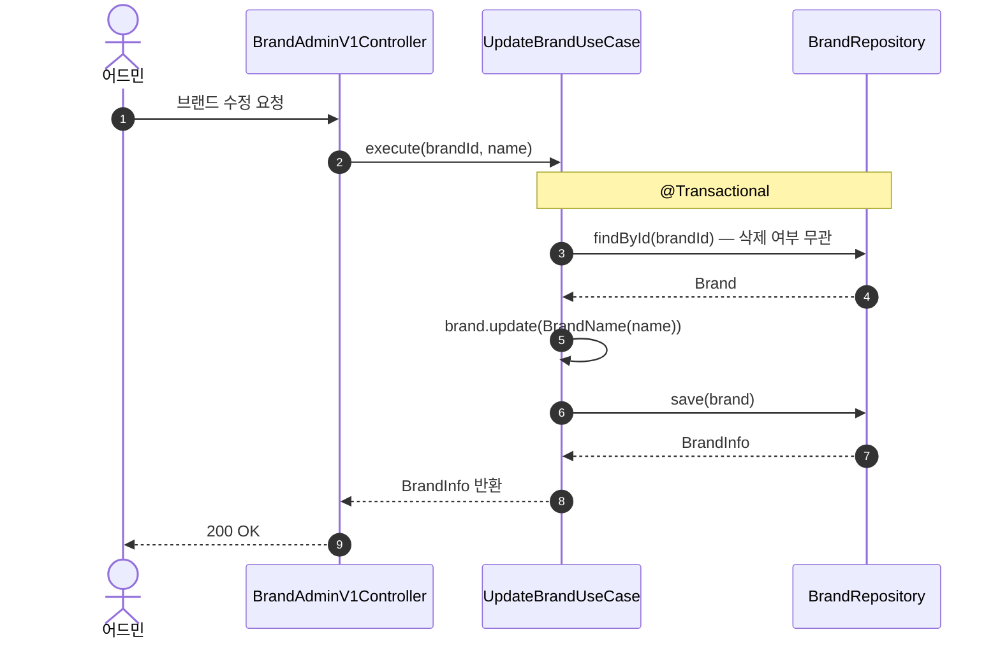
```mermaid
sequenceDiagram
    autonumber
    actor Admin as 어드민
    participant C as BrandAdminV1Controller
    participant UC as UpdateBrandUseCase
    participant R as BrandRepository
    Admin ->> C: 브랜드 수정 요청
    C ->> UC: execute(brandId, name)
    Note over UC, R: @Transactional
    UC ->> R: findById(brandId) — 삭제 여부 무관
    R -->> UC: Brand
    UC ->> UC: brand.update(BrandName(name))
    UC ->> R: save(brand)
    R -->> UC: BrandInfo
    UC -->> C: BrandInfo 반환
    C -->> Admin: 200 OK
```

#### 참고

- 삭제된 브랜드도 수정 가능 (어드민 권한)

### 2.5 브랜드 삭제 (Cascade Soft Delete)

브랜드 삭제 시 소속 상품까지 일괄 soft delete하는 흐름이다.

**API:** `DELETE /api-admin/v1/brands/{brandId}` — LDAP 인증

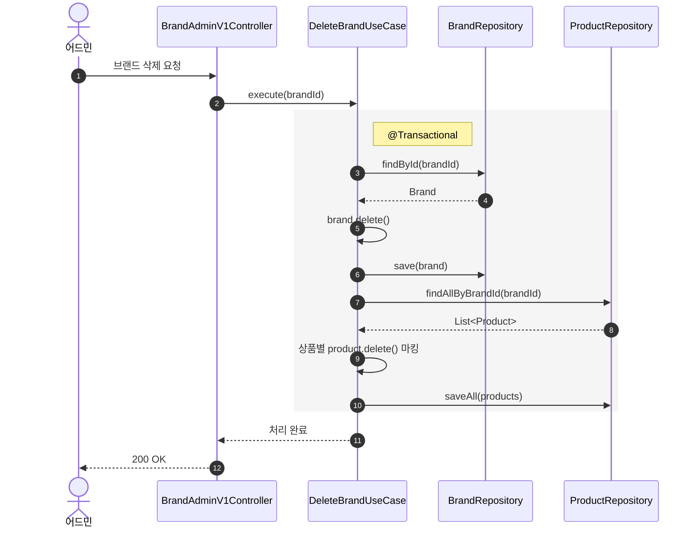
```mermaid
sequenceDiagram
    autonumber
    actor Admin as 어드민
    participant C as BrandAdminV1Controller
    participant UC as DeleteBrandUseCase
    participant BR as BrandRepository
    participant PR as ProductRepository
    Admin ->> C: 브랜드 삭제 요청
    C ->> UC: execute(brandId)

    rect rgb(245, 245, 245)
        Note right of UC: @Transactional
        UC ->> BR: findById(brandId)
        BR -->> UC: Brand
        UC ->> UC: brand.delete()
        UC ->> BR: save(brand)
        UC ->> PR: findAllByBrandId(brandId)
        PR -->> UC: List<Product>
        UC ->> UC: 상품별 product.delete() 마킹
        UC ->> PR: saveAll(products)
    end

    UC -->> C: 처리 완료
    C -->> Admin: 200 OK
```

#### 참고

- BaseEntity.delete()는 이미 삭제 상태면 무시 (멱등)
- 기존 주문의 OrderItem 스냅샷은 Product 삭제와 무관하게 보존
- `DeleteBrandUseCase`는 BrandRepository와 ProductRepository를 직접 주입받아 cascade 삭제를 처리한다

### 2.6 브랜드 복구

**API:** `POST /api-admin/v1/brands/{brandId}/restore` — LDAP 인증

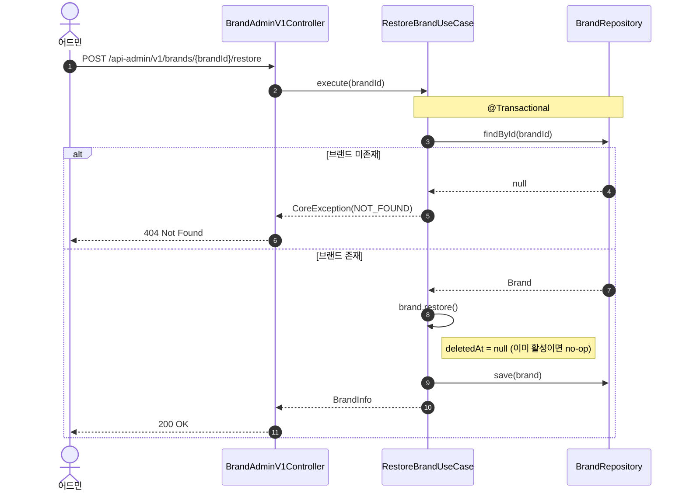
```mermaid
sequenceDiagram
    autonumber
    actor Admin as 어드민
    participant C as BrandAdminV1Controller
    participant UC as RestoreBrandUseCase
    participant R as BrandRepository

    Admin ->> C: POST /api-admin/v1/brands/{brandId}/restore
    C ->> UC: execute(brandId)
    Note over UC, R: @Transactional
    UC ->> R: findById(brandId)
    alt 브랜드 미존재
        R -->> UC: null
        UC -->> C: CoreException(NOT_FOUND)
        C -->> Admin: 404 Not Found
    else 브랜드 존재
        R -->> UC: Brand
        UC ->> UC: brand.restore()
        Note right of UC: deletedAt = null (이미 활성이면 no-op)
        UC ->> R: save(brand)
        UC -->> C: BrandInfo
        C -->> Admin: 200 OK
    end
```

### 2.7 상품 목록 조회

**API:** `GET /api-admin/v1/products` — LDAP 인증

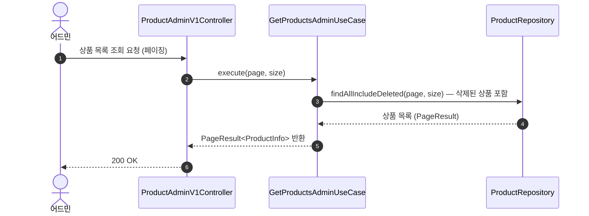
```mermaid
sequenceDiagram
    autonumber
    actor Admin as 어드민
    participant C as ProductAdminV1Controller
    participant UC as GetProductsAdminUseCase
    participant R as ProductRepository
    Admin ->> C: 상품 목록 조회 요청 (페이징)
    C ->> UC: execute(page, size)
    UC ->> R: findAllIncludeDeleted(page, size) — 삭제된 상품 포함
    R -->> UC: 상품 목록 (PageResult)
    UC -->> C: PageResult<ProductInfo> 반환
    C -->> Admin: 200 OK
```

#### 참고

- 어드민 목록 조회는 삭제된 상품 포함 (필터 없음)

### 2.8 상품 상세 조회

**API:** `GET /api-admin/v1/products/{productId}` — LDAP 인증

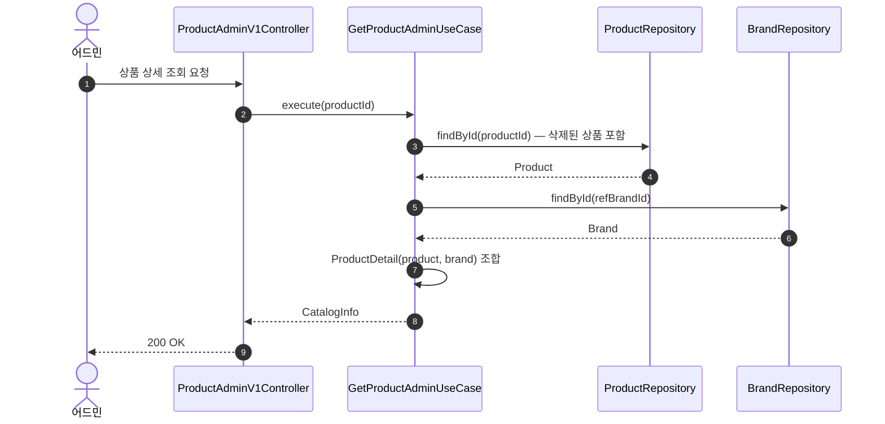
```mermaid
sequenceDiagram
    autonumber
    actor Admin as 어드민
    participant C as ProductAdminV1Controller
    participant UC as GetProductAdminUseCase
    participant PR as ProductRepository
    participant BR as BrandRepository
    Admin ->> C: 상품 상세 조회 요청
    C ->> UC: execute(productId)
    UC ->> PR: findById(productId) — 삭제된 상품 포함
    PR -->> UC: Product
    UC ->> BR: findById(refBrandId)
    BR -->> UC: Brand
    UC ->> UC: ProductDetail(product, brand) 조합
    UC -->> C: CatalogInfo
    C -->> Admin: 200 OK
```

#### 참고

- 어드민은 삭제된 상품도 조회 가능 (삭제 상태 확인 목적)

### 2.9 상품 등록

상품 등록 시 BrandRepository로 브랜드 유효성을 검증하는 흐름이다.

**API:** `POST /api-admin/v1/products` — LDAP 인증

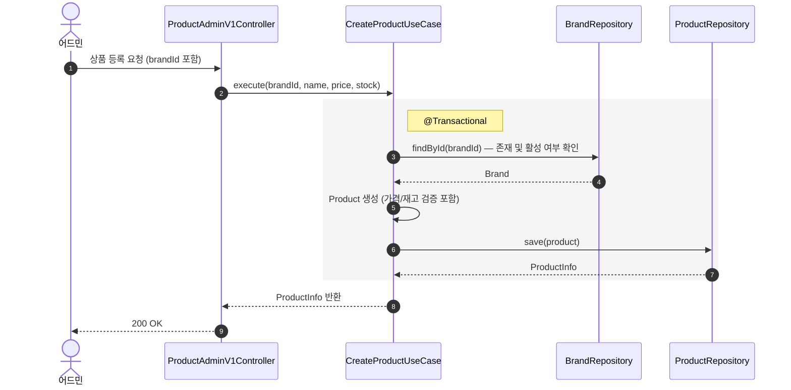
```mermaid
sequenceDiagram
    autonumber
    actor Admin as 어드민
    participant C as ProductAdminV1Controller
    participant UC as CreateProductUseCase
    participant BR as BrandRepository
    participant PR as ProductRepository
    Admin ->> C: 상품 등록 요청 (brandId 포함)
    C ->> UC: execute(brandId, name, price, stock)

    rect rgb(245, 245, 245)
        Note right of UC: @Transactional
        UC ->> BR: findById(brandId) — 존재 및 활성 여부 확인
        BR -->> UC: Brand
        UC ->> UC: Product 생성 (가격/재고 검증 포함)
        UC ->> PR: save(product)
        PR -->> UC: ProductInfo
    end

    UC -->> C: ProductInfo 반환
    C -->> Admin: 200 OK
```

### 2.10 상품 수정

**API:** `PUT /api-admin/v1/products/{productId}` — LDAP 인증

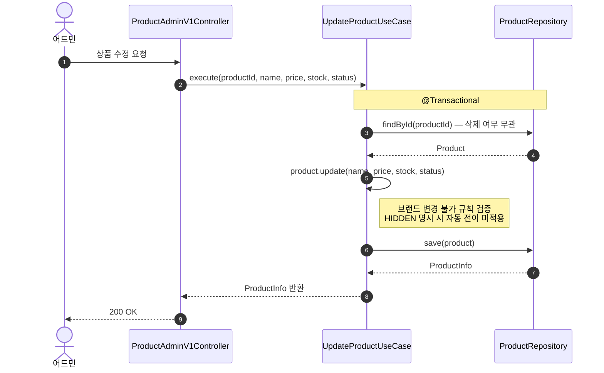
```mermaid
sequenceDiagram
    autonumber
    actor Admin as 어드민
    participant C as ProductAdminV1Controller
    participant UC as UpdateProductUseCase
    participant R as ProductRepository
    Admin ->> C: 상품 수정 요청
    C ->> UC: execute(productId, name, price, stock, status)
    Note over UC, R: @Transactional
    UC ->> R: findById(productId) — 삭제 여부 무관
    R -->> UC: Product
    UC ->> UC: product.update(name, price, stock, status)
    Note right of UC: 브랜드 변경 불가 규칙 검증<br/>HIDDEN 명시 시 자동 전이 미적용
    UC ->> R: save(product)
    R -->> UC: ProductInfo
    UC -->> C: ProductInfo 반환
    C -->> Admin: 200 OK
```

#### 참고

- 삭제된 상품도 수정 가능 (어드민 권한)

### 2.11 상품 삭제

**API:** `DELETE /api-admin/v1/products/{productId}` — LDAP 인증

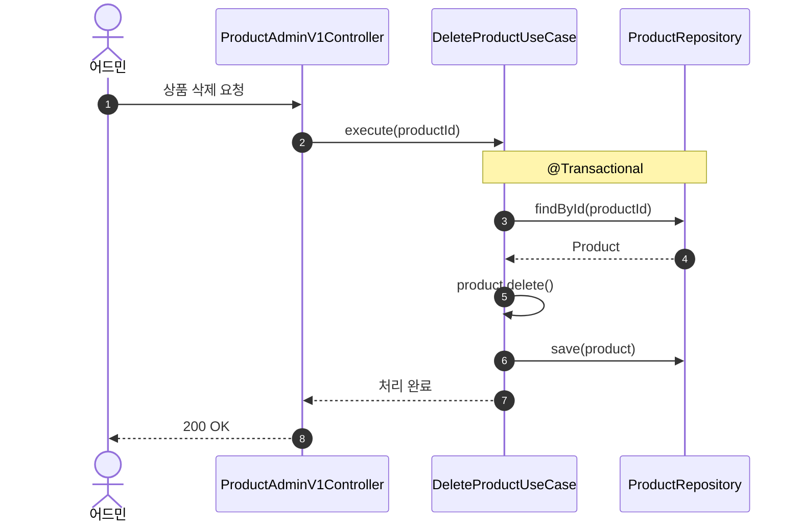
```mermaid
sequenceDiagram
    autonumber
    actor Admin as 어드민
    participant C as ProductAdminV1Controller
    participant UC as DeleteProductUseCase
    participant R as ProductRepository
    Admin ->> C: 상품 삭제 요청
    C ->> UC: execute(productId)
    Note over UC, R: @Transactional
    UC ->> R: findById(productId)
    R -->> UC: Product
    UC ->> UC: product.delete()
    UC ->> R: save(product)
    UC -->> C: 처리 완료
    C -->> Admin: 200 OK
```

#### 참고

- BaseEntity.delete()는 이미 삭제 상태면 무시 (멱등)
- 삭제된 상품의 like 는 추후 배치에서 제거

### 2.12 상품 복구

**API:** `POST /api-admin/v1/products/{productId}/restore` — LDAP 인증

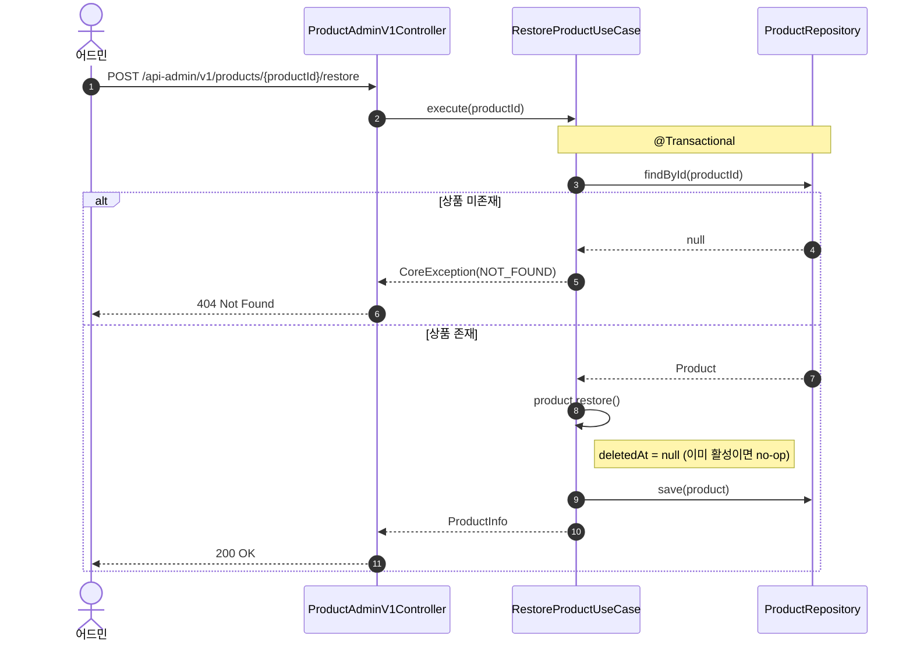
```mermaid
sequenceDiagram
    autonumber
    actor Admin as 어드민
    participant C as ProductAdminV1Controller
    participant UC as RestoreProductUseCase
    participant R as ProductRepository

    Admin ->> C: POST /api-admin/v1/products/{productId}/restore
    C ->> UC: execute(productId)
    Note over UC, R: @Transactional
    UC ->> R: findById(productId)
    alt 상품 미존재
        R -->> UC: null
        UC -->> C: CoreException(NOT_FOUND)
        C -->> Admin: 404 Not Found
    else 상품 존재
        R -->> UC: Product
        UC ->> UC: product.restore()
        Note right of UC: deletedAt = null (이미 활성이면 no-op)
        UC ->> R: save(product)
        UC -->> C: ProductInfo
        C -->> Admin: 200 OK
    end
```

---

## 3. 좋아요

### 3.1 좋아요 등록 (멱등성)

**API:** `POST /api/v1/products/{productId}/likes` — 인증 필요

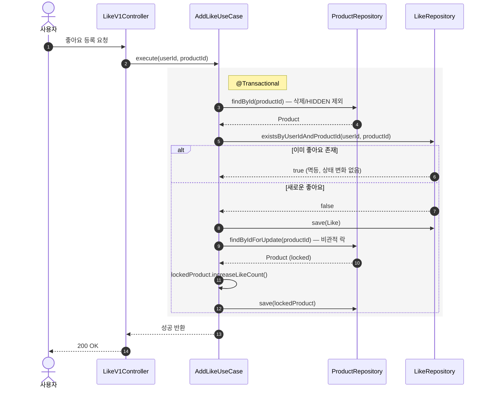
```mermaid
sequenceDiagram
    autonumber
    actor User as 사용자
    participant C as LikeV1Controller
    participant UC as AddLikeUseCase
    participant PR as ProductRepository
    participant LR as LikeRepository
    User ->> C: 좋아요 등록 요청
    C ->> UC: execute(userId, productId)

    rect rgb(245, 245, 245)
        Note right of UC: @Transactional
        UC ->> PR: findById(productId) — 삭제/HIDDEN 제외
        PR -->> UC: Product
        UC ->> LR: existsByUserIdAndProductId(userId, productId)
        alt 이미 좋아요 존재
            LR -->> UC: true (멱등, 상태 변화 없음)
        else 새로운 좋아요
            LR -->> UC: false
            UC ->> LR: save(Like)
            UC ->> PR: findByIdForUpdate(productId) — 비관적 락
            PR -->> UC: Product (locked)
            UC ->> UC: lockedProduct.increaseLikeCount()
            UC ->> PR: save(lockedProduct)
        end
    end

    UC -->> C: 성공 반환
    C -->> User: 200 OK
```

### 3.2 좋아요 취소 (멱등성 & Hard Delete)

좋아요 취소는 **물리적 삭제(Hard Delete)**를 수행하며, 삭제된 상품에 대해서도 멱등하게 처리된다.

**API:** `DELETE /api/v1/products/{productId}/likes` — 인증 필요

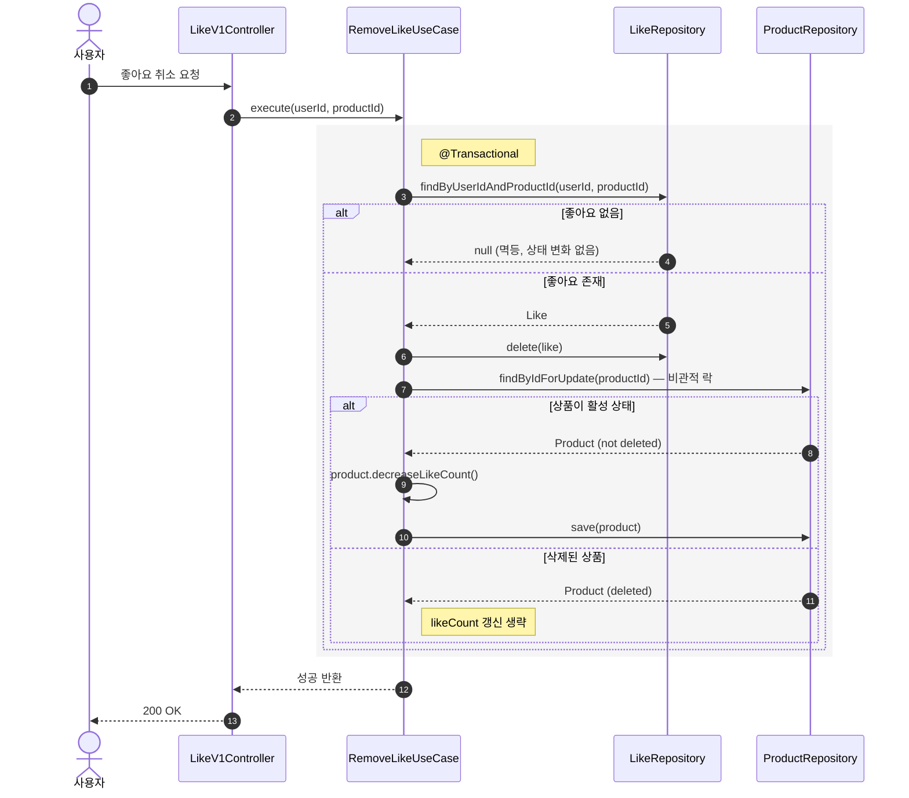
```mermaid
sequenceDiagram
    autonumber
    actor User as 사용자
    participant C as LikeV1Controller
    participant UC as RemoveLikeUseCase
    participant LR as LikeRepository
    participant PR as ProductRepository
    User ->> C: 좋아요 취소 요청
    C ->> UC: execute(userId, productId)

    rect rgb(245, 245, 245)
        Note right of UC: @Transactional
        UC ->> LR: findByUserIdAndProductId(userId, productId)
        alt 좋아요 없음
            LR -->> UC: null (멱등, 상태 변화 없음)
        else 좋아요 존재
            LR -->> UC: Like
            UC ->> LR: delete(like)
            UC ->> PR: findByIdForUpdate(productId) — 비관적 락
            alt 상품이 활성 상태
                PR -->> UC: Product (not deleted)
                UC ->> UC: product.decreaseLikeCount()
                UC ->> PR: save(product)
            else 삭제된 상품
                PR -->> UC: Product (deleted)
                Note right of UC: likeCount 갱신 생략
            end
        end
    end

    UC -->> C: 성공 반환
    C -->> User: 200 OK
```

#### 참고

- **삭제된 상품 포함 조회:** 좋아요 취소 시에는 삭제된 상품도 포함하여 처리한다. 삭제된 상품의 좋아요도 취소할 수 있어야 하기 때문이다 (요구사항: "삭제된 상품에 대한 좋아요 취소 → 200 OK")
- 삭제된 상품의 likeCount는 갱신하지 않음 (의미 없는 카운트 변경 방지)

### 3.3 내 좋아요 목록 조회

서로 다른 도메인(Like, Product)의 데이터를 조합하는 흐름이다.

**API:** `GET /api/v1/users/likes` — 인증 필요 (`@AuthUser`)

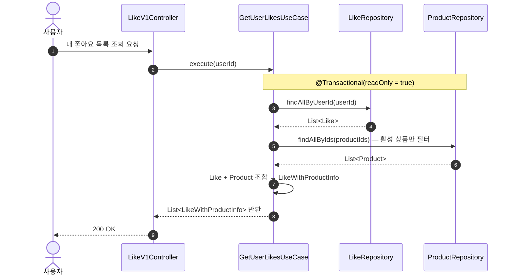
```mermaid
sequenceDiagram
    autonumber
    actor User as 사용자
    participant C as LikeV1Controller
    participant UC as GetUserLikesUseCase
    participant LR as LikeRepository
    participant PR as ProductRepository
    User ->> C: 내 좋아요 목록 조회 요청
    C ->> UC: execute(userId)
    Note over UC, PR: @Transactional(readOnly = true)
    UC ->> LR: findAllByUserId(userId)
    LR -->> UC: List<Like>
    UC ->> PR: findAllByIds(productIds) — 활성 상품만 필터
    PR -->> UC: List<Product>
    UC ->> UC: Like + Product 조합 → LikeWithProductInfo
    UC -->> C: List<LikeWithProductInfo> 반환
    C -->> User: 200 OK
```

#### 참고

- URL에 userId가 없으므로 타인 좋아요 조회 불가 (`@AuthUser`로 본인만 주입)
- 쿼리 총 2회: Like 조회 1회 + Product IN 조회 1회 (N+1 방지)
- 비활성(HIDDEN) 또는 삭제된 상품과 연결된 좋아요는 응답에서 제외

---

## 4. 주문 — 대고객 API

### 4.1 주문 생성 (Cross-Domain Transaction)

> **Round 3 변경**: 포인트 차감 단계 추가

주문 생성은 **상품 검증 → 재고 차감 → 주문 생성(totalPrice 계산 + Order/OrderItem 저장) → 포인트 차감**이 원자적으로 이루어져야 하는 핵심 트랜잭션이다.

**API:** `POST /api/v1/orders` — 인증 필요

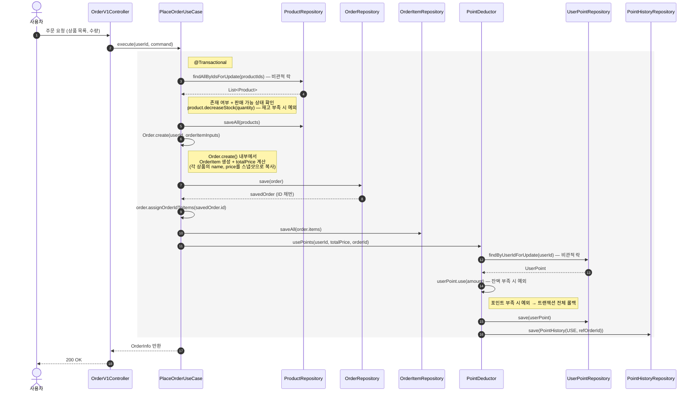
```mermaid
sequenceDiagram
    autonumber
    actor User as 사용자
    participant C as OrderV1Controller
    participant UC as PlaceOrderUseCase
    participant PR as ProductRepository
    participant OR as OrderRepository
    participant OIR as OrderItemRepository
    participant PD as PointDeductor
    participant UPR as UserPointRepository
    participant PHR as PointHistoryRepository
    User ->> C: 주문 요청 (상품 목록, 수량)
    C ->> UC: execute(userId, command)

    rect rgb(245, 245, 245)
        Note right of UC: @Transactional
    %% 1단계: 상품 유효성 확인 + 재고 차감
        UC ->> PR: findAllByIdsForUpdate(productIds) — 비관적 락
        PR -->> UC: List<Product>
        Note right of UC: 존재 여부 + 판매 가능 상태 확인<br/>product.decreaseStock(quantity) — 재고 부족 시 예외
        UC ->> PR: saveAll(products)
    %% 2단계: 주문 생성
        UC ->> UC: Order.create(userId, orderItemInputs)
        Note right of UC: Order.create() 내부에서<br/>OrderItem 생성 + totalPrice 계산<br/>(각 상품의 name, price를 스냅샷으로 복사)
        UC ->> OR: save(order)
        OR -->> UC: savedOrder (ID 채번)
        UC ->> UC: order.assignOrderIdToItems(savedOrder.id)
        UC ->> OIR: saveAll(order.items)
    %% 3단계: 포인트 차감
        UC ->> PD: usePoints(userId, totalPrice, orderId)
        PD ->> UPR: findByUserIdForUpdate(userId) — 비관적 락
        UPR -->> PD: UserPoint
        PD ->> PD: userPoint.use(amount) — 잔액 부족 시 예외
        Note right of PD: 포인트 부족 시 예외 → 트랜잭션 전체 롤백
        PD ->> UPR: save(userPoint)
        PD ->> PHR: save(PointHistory(USE, refOrderId))
    end

    UC -->> C: OrderInfo 반환
    C -->> User: 200 OK
```

#### 참고

- 재고 부족 또는 포인트 부족 시 트랜잭션 롤백으로 이전 차감분 모두 원복
- OrderItem은 주문 시점의 상품 정보(이름, 가격)를 스냅샷으로 보존
- `PlaceOrderUseCase`는 ProductRepository, OrderRepository, OrderItemRepository, PointDeductor를 직접 주입받아 오케스트레이션한다
- `PointDeductor`는 Domain Service로서 UseCase가 열어 둔 트랜잭션에 참여하여 잔고 차감 + 이력 생성의 원자성을 보장한다

### 4.2 주문 목록 조회 (기간 필터링)

**API:** `GET /api/v1/orders` — 인증 필요

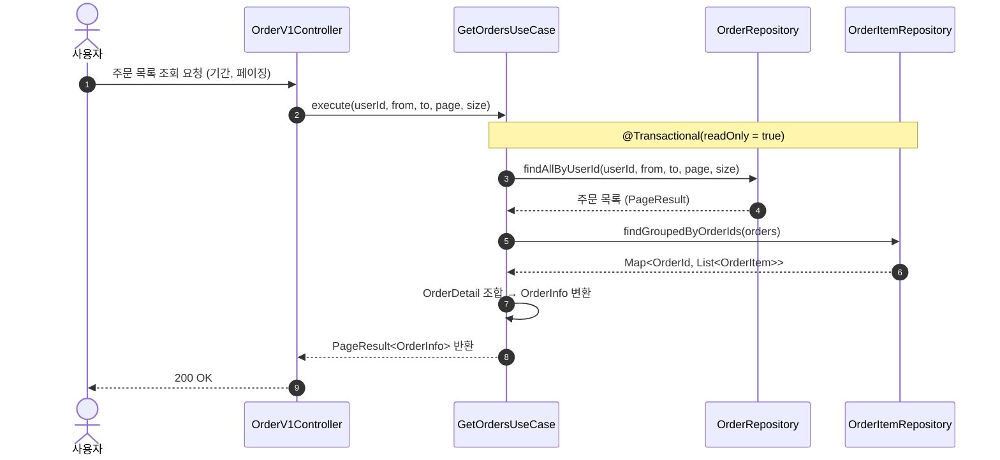
```mermaid
sequenceDiagram
    autonumber
    actor User as 사용자
    participant C as OrderV1Controller
    participant UC as GetOrdersUseCase
    participant OR as OrderRepository
    participant OIR as OrderItemRepository
    User ->> C: 주문 목록 조회 요청 (기간, 페이징)
    C ->> UC: execute(userId, from, to, page, size)
    Note over UC, OIR: @Transactional(readOnly = true)
    UC ->> OR: findAllByUserId(userId, from, to, page, size)
    OR -->> UC: 주문 목록 (PageResult)
    UC ->> OIR: findGroupedByOrderIds(orders)
    OIR -->> UC: Map<OrderId, List<OrderItem>>
    UC ->> UC: OrderDetail 조합 → OrderInfo 변환
    UC -->> C: PageResult<OrderInfo> 반환
    C -->> User: 200 OK
```

#### 참고

- from/to 미입력 시 기본값: 최근 1달

### 4.3 주문 상세 조회

**API:** `GET /api/v1/orders/{orderId}` — 인증 필요

```mermaid
sequenceDiagram
    autonumber
    actor User as 사용자
    participant C as OrderV1Controller
    participant UC as GetOrderUseCase
    participant OR as OrderRepository
    participant OIR as OrderItemRepository
    User ->> C: 주문 상세 정보 요청
    C ->> UC: execute(userId, orderId)
    Note over UC, OIR: @Transactional(readOnly = true)
    UC ->> OR: findById(orderId)
    OR -->> UC: Order
    Note right of UC: 본인 주문인지 소유권 검증 (order.refUserId == userId)
    UC ->> OIR: findAllByOrderId(orderId)
    OIR -->> UC: List<OrderItem>
    UC ->> UC: OrderDetail(order, items) 조합
    UC -->> C: OrderInfo 반환
    C -->> User: 200 OK
```

#### 참고

- 타인 주문 접근 시 403이 아닌 404 반환 (주문 존재 여부 노출 방지)

---

## 5. 주문 — 어드민 API

### 5.1 전체 주문 목록 조회

**API:** `GET /api-admin/v1/orders` — LDAP 인증

```mermaid
sequenceDiagram
    autonumber
    actor Admin as 어드민
    participant C as OrderAdminV1Controller
    participant UC as GetOrdersAdminUseCase
    participant OR as OrderRepository
    participant OIR as OrderItemRepository
    Admin ->> C: 전체 주문 목록 조회 요청
    C ->> UC: execute(page, size)
    Note over UC, OIR: @Transactional(readOnly = true)
    UC ->> OR: findAll(page, size) — userId 필터 없음
    OR -->> UC: 주문 목록 (PageResult)
    UC ->> OIR: findGroupedByOrderIds(orders)
    OIR -->> UC: Map<OrderId, List<OrderItem>>
    UC ->> UC: OrderDetail 조합 → OrderInfo 변환
    UC -->> C: PageResult<OrderInfo> 반환
    C -->> Admin: 200 OK
```

### 5.2 주문 상세 조회

**API:** `GET /api-admin/v1/orders/{orderId}` — LDAP 인증

```mermaid
sequenceDiagram
    autonumber
    actor Admin as 어드민
    participant C as OrderAdminV1Controller
    participant UC as GetOrderAdminUseCase
    participant OR as OrderRepository
    participant OIR as OrderItemRepository
    Admin ->> C: 주문 상세 조회 요청
    C ->> UC: execute(orderId)
    Note over UC, OIR: @Transactional(readOnly = true)
    UC ->> OR: findById(orderId)
    OR -->> UC: Order
    UC ->> OIR: findAllByOrderId(orderId)
    OIR -->> UC: List<OrderItem>
    UC ->> UC: OrderDetail(order, items) 조합
    UC -->> C: OrderInfo 반환
    C -->> Admin: 200 OK
```

#### 참고

- 어드민은 소유권 검증 없이 모든 주문 조회 가능

---

## 6. 포인트

### 6.1 포인트 충전 (Domain Service)

포인트 충전은 잔액 변경(UserPoint)과 충전 내역(PointHistory) 생성을 **PointCharger**(Domain Service)가 조율하는 흐름이다.

**API:** `POST /api/v1/users/points/charge` — 인증 필요

```mermaid
sequenceDiagram
    autonumber
    actor User as 사용자
    participant C as PointV1Controller
    participant UC as ChargePointUseCase
    participant PC as PointCharger
    participant UPR as UserPointRepository
    participant PHR as PointHistoryRepository
    User ->> C: 포인트 충전 요청 (amount)
    C ->> UC: execute(userId, amount)

    rect rgb(245, 245, 245)
        Note right of UC: @Transactional
        UC ->> PC: charge(userId, amount)
        PC ->> UPR: findByUserIdForUpdate(userId) — 비관적 락
        UPR -->> PC: UserPoint
        PC ->> PC: userPoint.charge(amount) — 잔액 증가
        PC ->> UPR: save(userPoint)
        PC ->> PHR: save(PointHistory(CHARGE))
        PC -->> UC: UserPoint
    end

    UC -->> C: PointBalanceInfo 반환
    C -->> User: 200 OK
```

#### 참고

- `PointCharger`는 Domain Layer의 Domain Service이다
- `ChargePointUseCase`가 `PointCharger`에 위임하며, `PointCharger`는 UserPointRepository와 PointHistoryRepository를 직접 주입받아 사용한다
- `@Transactional`은 UseCase에 설정하고, `PointCharger`는 해당 트랜잭션에 참여한다

### 6.2 포인트 잔액 조회

**API:** `GET /api/v1/users/points` — 인증 필요

```mermaid
sequenceDiagram
    autonumber
    actor User as 사용자
    participant C as PointV1Controller
    participant UC as GetUserPointUseCase
    participant R as UserPointRepository
    User ->> C: 포인트 잔액 조회 요청
    C ->> UC: execute(userId)
    Note over UC, R: @Transactional(readOnly = true)
    UC ->> R: findByUserId(userId)
    R -->> UC: UserPoint
    UC -->> C: PointBalanceInfo 반환
    C -->> User: 200 OK
```

---

## 7. 회원가입

### 7.1 회원가입 (Cross-Domain)

> **Round 3 변경**: UserPoint 초기화를 위해 RegisterUserUseCase가 UserPointRepository를 직접 호출

회원가입 시 User 생성과 함께 UserPoint(초기 잔액 0)를 생성하는 흐름이다.

**API:** `POST /api/v1/users/sign-up` — 인증 불필요

```mermaid
sequenceDiagram
    autonumber
    actor User as 사용자
    participant C as UserV1Controller
    participant UC as RegisterUserUseCase
    participant UR as UserRepository
    participant UPR as UserPointRepository
    User ->> C: 회원가입 요청 (loginId, password, name 등)
    C ->> UC: execute(loginId, password, name, birthDate, email)

    rect rgb(245, 245, 245)
        Note right of UC: @Transactional
        UC ->> UR: existsByLoginId(loginId) — 중복 확인
        UR -->> UC: false (중복 없음)
        UC ->> UR: save(user)
        UR -->> UC: 생성된 User (ID 채번)
        UC ->> UPR: save(UserPoint(refUserId = user.id, balance = 0))
    end

    UC -->> C: UserInfo 반환
    C -->> User: 200 OK
```

#### 참고

- `RegisterUserUseCase`는 UserRepository와 UserPointRepository를 직접 주입받아 사용한다
- **@Transactional은 UseCase 레벨에서 설정**하여, User 생성과 UserPoint 생성의 원자성을 보장한다 (UserPoint 생성 실패 시 User 생성도 롤백)
- 기존 Facade 패턴 없이 UseCase가 cross-domain 오케스트레이션을 직접 수행한다
