# 시퀀스 다이어그램

시스템의 주요 기능에 대한 **핵심 성공 흐름(Happy Path)** 을 기술한다.
상세한 예외 처리 규칙(400, 404 등)과 필드 검증 로직은 요구사항 명세서를 참고한다.

### 다이어그램 공통 규칙

- **참여자(Participant) 레벨 통일**:
    - **Controller**: 요청 수신, 파라미터 매핑, 응답 변환
    - **UseCase**: `@Transactional` 경계 설정, Repository / Domain Service 오케스트레이션
    - **Repository**: DB 접근 (JPA)
- **트랜잭션 경계**: `@Transactional`은 UseCase의 `execute()` 메서드에 부착. Domain Service는 UseCase가 열어 둔 트랜잭션에 참여.
- **인증**: AuthInterceptor → `@AuthUser userId: Long` 파라미터 주입. 어드민은 AdminInterceptor가 `X-Loopers-Ldap` 헤더 검증.
- **soft delete**: `@Where` 미사용. Repository 메서드마다 `deletedAt IS NULL` 조건을 명시적으로 추가.
- **생략된 내용**:
    - 인증 인터셉터 처리 과정 (전제 조건으로 취급)
    - 상세한 DTO 변환 과정
    - 단순 유효성 검증 실패(400 Bad Request) 흐름

---

## 1. 브랜드 & 상품 — 대고객 API

### 1.1 브랜드 정보 조회

**API:** `GET /api/v1/brands/{brandId}` — 인증 불필요

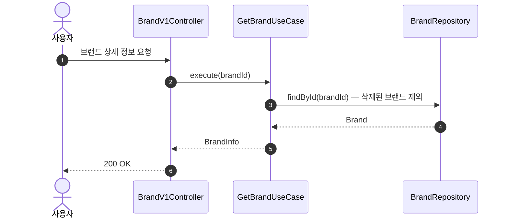
```mermaid
sequenceDiagram
    autonumber
    actor User as 사용자
    participant C as BrandV1Controller
    participant UC as GetBrandUseCase
    participant R as BrandRepository
    User ->> C: 브랜드 상세 정보 요청
    C ->> UC: execute(brandId)
    UC ->> R: findById(brandId) — 삭제된 브랜드 제외
    R -->> UC: Brand
    UC -->> C: BrandInfo
    C -->> User: 200 OK
```

### 1.2 상품 목록 조회

**API:** `GET /api/v1/products` — 인증 불필요

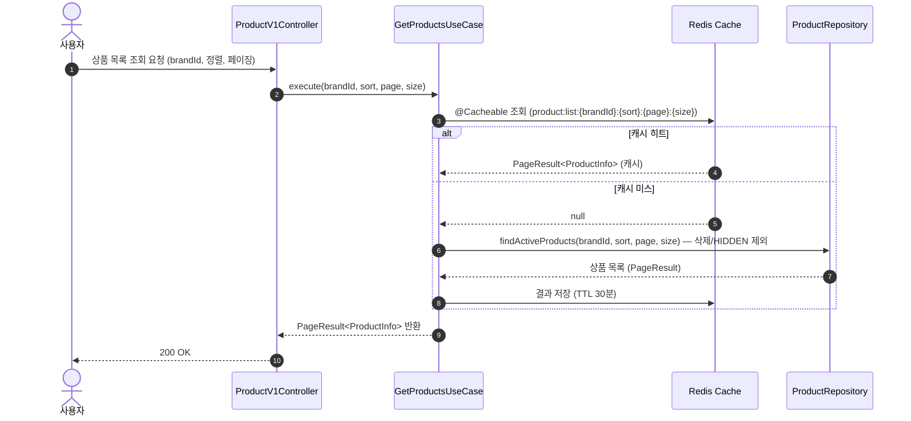
```mermaid
sequenceDiagram
    autonumber
    actor User as 사용자
    participant C as ProductV1Controller
    participant UC as GetProductsUseCase
    participant Cache as Redis Cache
    participant R as ProductRepository
    User ->> C: 상품 목록 조회 요청 (brandId, 정렬, 페이징)
    C ->> UC: execute(brandId, sort, page, size)
    UC ->> Cache: @Cacheable 조회 (product:list:{brandId}:{sort}:{page}:{size})
    alt 캐시 히트
        Cache -->> UC: PageResult<ProductInfo> (캐시)
    else 캐시 미스
        Cache -->> UC: null
        UC ->> R: findActiveProducts(brandId, sort, page, size) — 삭제/HIDDEN 제외
        R -->> UC: 상품 목록 (PageResult)
        UC ->> Cache: 결과 저장 (TTL 30분)
    end
    UC -->> C: PageResult<ProductInfo> 반환
    C -->> User: 200 OK
```

#### 참고

- 필터 조건: `deletedAt IS NULL AND status != 'HIDDEN'`, brandId 선택적 필터
- 응답에 페이징 메타데이터 포함: content, totalElements, totalPages, number, size
- 캐시 키: `(brandId ?: 'all') + ':' + sort + ':' + page + ':' + size`
- 상품 수정/삭제 시 `evictProductList(brandId)` 호출로 관련 목록 캐시 무효화

### 1.3 상품 상세 조회

상품 정보와 해당 브랜드 정보를 **UseCase**에서 조합하여 응답하는 흐름이다.

**API:** `GET /api/v1/products/{productId}` — 인증 불필요

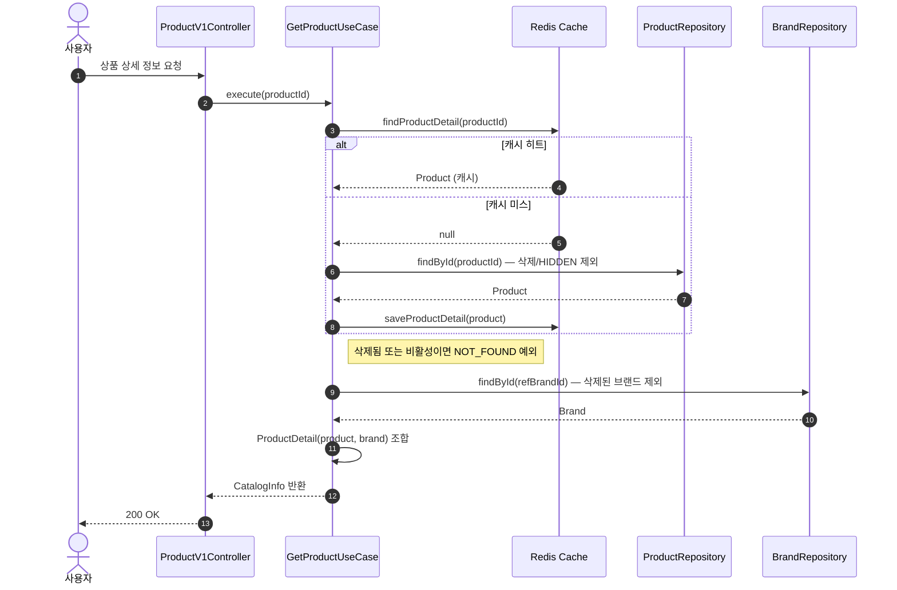
```mermaid
sequenceDiagram
    autonumber
    actor User as 사용자
    participant C as ProductV1Controller
    participant UC as GetProductUseCase
    participant Cache as Redis Cache
    participant PR as ProductRepository
    participant BR as BrandRepository
    User ->> C: 상품 상세 정보 요청
    C ->> UC: execute(productId)
    UC ->> Cache: findProductDetail(productId)
    alt 캐시 히트
        Cache -->> UC: Product (캐시)
    else 캐시 미스
        Cache -->> UC: null
        UC ->> PR: findById(productId) — 삭제/HIDDEN 제외
        PR -->> UC: Product
        UC ->> Cache: saveProductDetail(product)
    end
    Note right of UC: 삭제됨 또는 비활성이면 NOT_FOUND 예외
    UC ->> BR: findById(refBrandId) — 삭제된 브랜드 제외
    BR -->> UC: Brand
    UC ->> UC: ProductDetail(product, brand) 조합
    UC -->> C: CatalogInfo 반환
    C -->> User: 200 OK
```

#### 참고

- `GetProductUseCase`는 ProductRepository, BrandRepository, ProductCacheRepository를 직접 주입받아 사용한다
- 캐시 히트 시에도 Brand는 항상 DB에서 조회한다 (브랜드 캐시 미적용)
- 삭제된 브랜드의 상품 조회 시 NOT_FOUND 예외 발생
- Redis 장애 시 캐시 오류를 warn 로그로 처리하고 DB 조회로 폴백

---

## 2. 브랜드 & 상품 — 어드민 API

### 2.1 브랜드 목록 조회

**API:** `GET /api-admin/v1/brands` — LDAP 인증

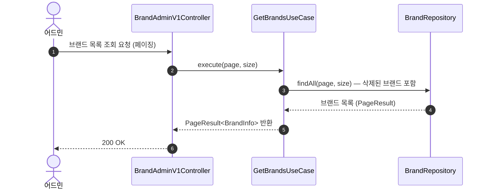
```mermaid
sequenceDiagram
    autonumber
    actor Admin as 어드민
    participant C as BrandAdminV1Controller
    participant UC as GetBrandsUseCase
    participant R as BrandRepository
    Admin ->> C: 브랜드 목록 조회 요청 (페이징)
    C ->> UC: execute(page, size)
    UC ->> R: findAll(page, size) — 삭제된 브랜드 포함
    R -->> UC: 브랜드 목록 (PageResult)
    UC -->> C: PageResult<BrandInfo> 반환
    C -->> Admin: 200 OK
```

#### 참고

- 어드민 목록 조회는 삭제된 브랜드 포함 (필터 없음)

### 2.2 브랜드 상세 조회

**API:** `GET /api-admin/v1/brands/{brandId}` — LDAP 인증

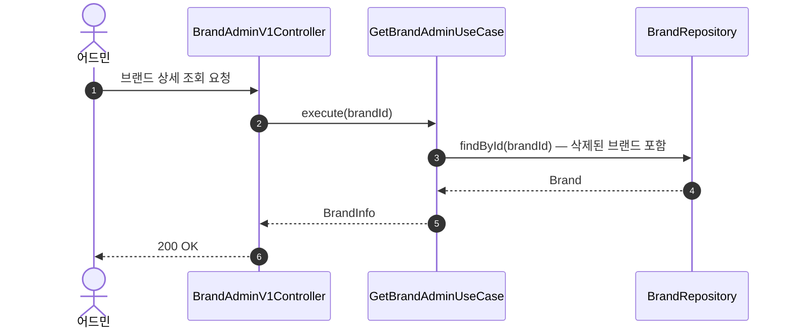
```mermaid
sequenceDiagram
    autonumber
    actor Admin as 어드민
    participant C as BrandAdminV1Controller
    participant UC as GetBrandAdminUseCase
    participant R as BrandRepository
    Admin ->> C: 브랜드 상세 조회 요청
    C ->> UC: execute(brandId)
    UC ->> R: findById(brandId) — 삭제된 브랜드 포함
    R -->> UC: Brand
    UC -->> C: BrandInfo
    C -->> Admin: 200 OK
```

#### 참고

- 어드민은 삭제된 브랜드도 조회 가능 (삭제 상태 확인 목적)

### 2.3 브랜드 등록

**API:** `POST /api-admin/v1/brands` — LDAP 인증

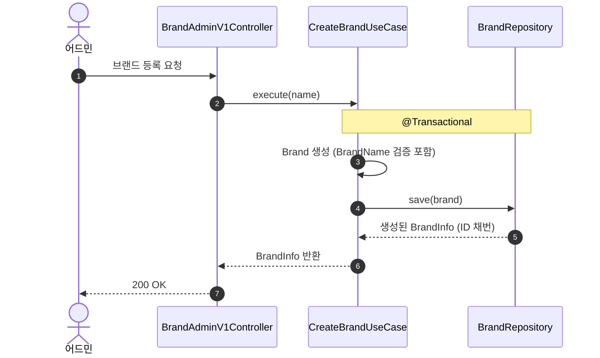
```mermaid
sequenceDiagram
    autonumber
    actor Admin as 어드민
    participant C as BrandAdminV1Controller
    participant UC as CreateBrandUseCase
    participant R as BrandRepository
    Admin ->> C: 브랜드 등록 요청
    C ->> UC: execute(name)
    Note over UC, R: @Transactional
    UC ->> UC: Brand 생성 (BrandName 검증 포함)
    UC ->> R: save(brand)
    R -->> UC: 생성된 BrandInfo (ID 채번)
    UC -->> C: BrandInfo 반환
    C -->> Admin: 200 OK
```

### 2.4 브랜드 수정

**API:** `PUT /api-admin/v1/brands/{brandId}` — LDAP 인증

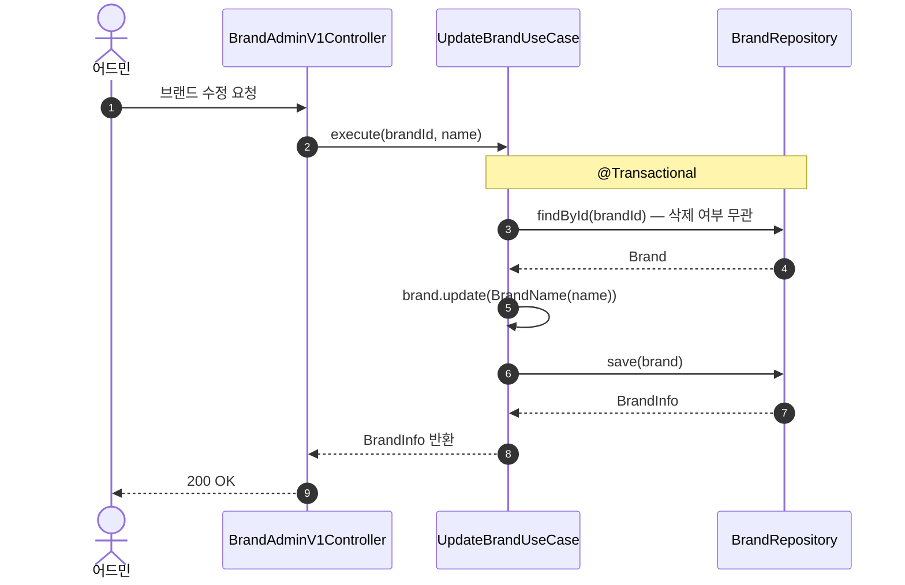
```mermaid
sequenceDiagram
    autonumber
    actor Admin as 어드민
    participant C as BrandAdminV1Controller
    participant UC as UpdateBrandUseCase
    participant R as BrandRepository
    Admin ->> C: 브랜드 수정 요청
    C ->> UC: execute(brandId, name)
    Note over UC, R: @Transactional
    UC ->> R: findById(brandId) — 삭제 여부 무관
    R -->> UC: Brand
    UC ->> UC: brand.update(BrandName(name))
    UC ->> R: save(brand)
    R -->> UC: BrandInfo
    UC -->> C: BrandInfo 반환
    C -->> Admin: 200 OK
```

#### 참고

- 삭제된 브랜드도 수정 가능 (어드민 권한)

### 2.5 브랜드 삭제 (Cascade Soft Delete)

브랜드 삭제 시 소속 상품까지 일괄 soft delete하는 흐름이다.

**API:** `DELETE /api-admin/v1/brands/{brandId}` — LDAP 인증

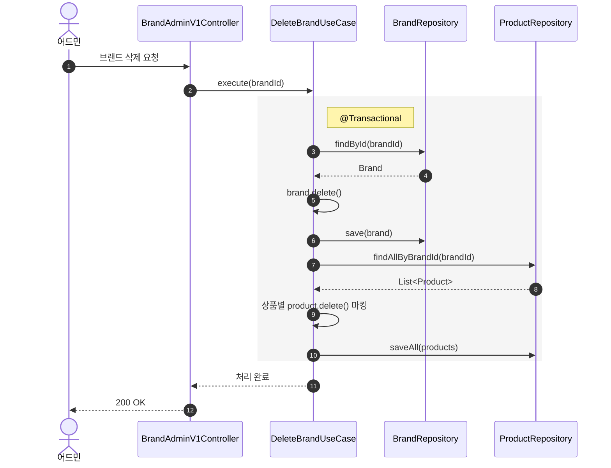
```mermaid
sequenceDiagram
    autonumber
    actor Admin as 어드민
    participant C as BrandAdminV1Controller
    participant UC as DeleteBrandUseCase
    participant BR as BrandRepository
    participant PR as ProductRepository
    Admin ->> C: 브랜드 삭제 요청
    C ->> UC: execute(brandId)

    rect rgb(245, 245, 245)
        Note right of UC: @Transactional
        UC ->> BR: findById(brandId)
        BR -->> UC: Brand
        UC ->> UC: brand.delete()
        UC ->> BR: save(brand)
        UC ->> PR: findAllByBrandId(brandId)
        PR -->> UC: List<Product>
        UC ->> UC: 상품별 product.delete() 마킹
        UC ->> PR: saveAll(products)
    end

    UC -->> C: 처리 완료
    C -->> Admin: 200 OK
```

#### 참고

- BaseEntity.delete()는 이미 삭제 상태면 무시 (멱등)
- 기존 주문의 OrderItem 스냅샷은 Product 삭제와 무관하게 보존
- `DeleteBrandUseCase`는 BrandRepository와 ProductRepository를 직접 주입받아 cascade 삭제를 처리한다

### 2.6 브랜드 복구

**API:** `POST /api-admin/v1/brands/{brandId}/restore` — LDAP 인증

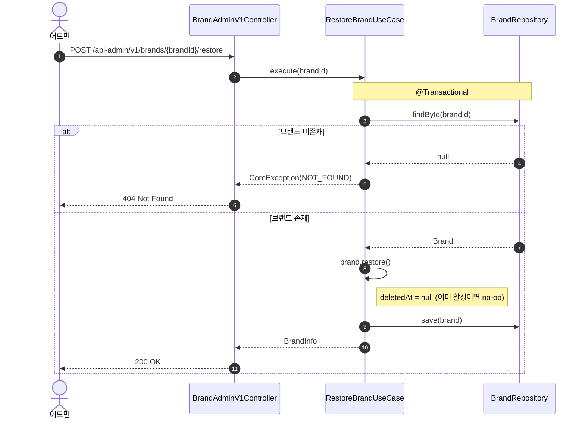
```mermaid
sequenceDiagram
    autonumber
    actor Admin as 어드민
    participant C as BrandAdminV1Controller
    participant UC as RestoreBrandUseCase
    participant R as BrandRepository

    Admin ->> C: POST /api-admin/v1/brands/{brandId}/restore
    C ->> UC: execute(brandId)
    Note over UC, R: @Transactional
    UC ->> R: findById(brandId)
    alt 브랜드 미존재
        R -->> UC: null
        UC -->> C: CoreException(NOT_FOUND)
        C -->> Admin: 404 Not Found
    else 브랜드 존재
        R -->> UC: Brand
        UC ->> UC: brand.restore()
        Note right of UC: deletedAt = null (이미 활성이면 no-op)
        UC ->> R: save(brand)
        UC -->> C: BrandInfo
        C -->> Admin: 200 OK
    end
```

### 2.7 상품 목록 조회

**API:** `GET /api-admin/v1/products` — LDAP 인증

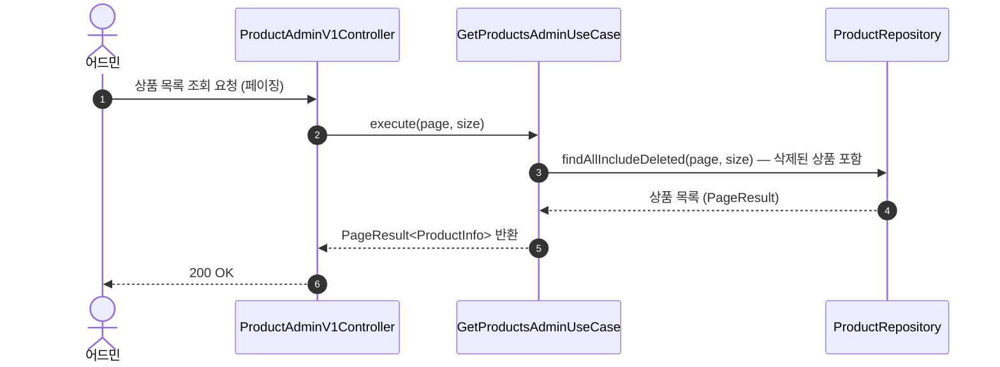
```mermaid
sequenceDiagram
    autonumber
    actor Admin as 어드민
    participant C as ProductAdminV1Controller
    participant UC as GetProductsAdminUseCase
    participant R as ProductRepository
    Admin ->> C: 상품 목록 조회 요청 (페이징)
    C ->> UC: execute(page, size)
    UC ->> R: findAllIncludeDeleted(page, size) — 삭제된 상품 포함
    R -->> UC: 상품 목록 (PageResult)
    UC -->> C: PageResult<ProductInfo> 반환
    C -->> Admin: 200 OK
```

#### 참고

- 어드민 목록 조회는 삭제된 상품 포함 (필터 없음)

### 2.8 상품 상세 조회

**API:** `GET /api-admin/v1/products/{productId}` — LDAP 인증

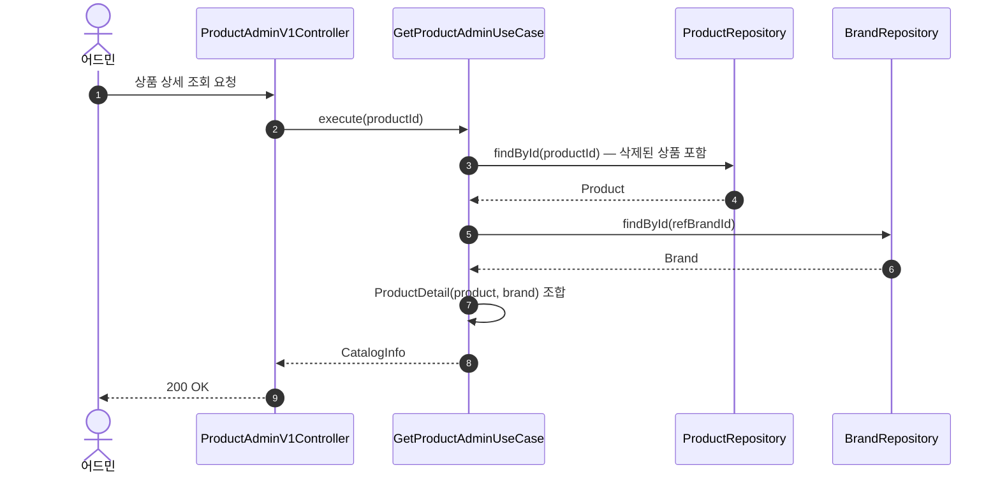
```mermaid
sequenceDiagram
    autonumber
    actor Admin as 어드민
    participant C as ProductAdminV1Controller
    participant UC as GetProductAdminUseCase
    participant PR as ProductRepository
    participant BR as BrandRepository
    Admin ->> C: 상품 상세 조회 요청
    C ->> UC: execute(productId)
    UC ->> PR: findById(productId) — 삭제된 상품 포함
    PR -->> UC: Product
    UC ->> BR: findById(refBrandId)
    BR -->> UC: Brand
    UC ->> UC: ProductDetail(product, brand) 조합
    UC -->> C: CatalogInfo
    C -->> Admin: 200 OK
```

#### 참고

- 어드민은 삭제된 상품도 조회 가능 (삭제 상태 확인 목적)

### 2.9 상품 등록

상품 등록 시 BrandRepository로 브랜드 유효성을 검증하는 흐름이다.

**API:** `POST /api-admin/v1/products` — LDAP 인증

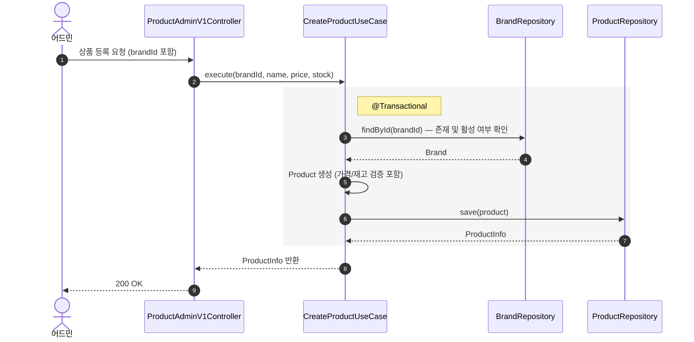
```mermaid
sequenceDiagram
    autonumber
    actor Admin as 어드민
    participant C as ProductAdminV1Controller
    participant UC as CreateProductUseCase
    participant BR as BrandRepository
    participant PR as ProductRepository
    Admin ->> C: 상품 등록 요청 (brandId 포함)
    C ->> UC: execute(brandId, name, price, stock)

    rect rgb(245, 245, 245)
        Note right of UC: @Transactional
        UC ->> BR: findById(brandId) — 존재 및 활성 여부 확인
        BR -->> UC: Brand
        UC ->> UC: Product 생성 (가격/재고 검증 포함)
        UC ->> PR: save(product)
        PR -->> UC: ProductInfo
    end

    UC -->> C: ProductInfo 반환
    C -->> Admin: 200 OK
```

### 2.10 상품 수정

**API:** `PUT /api-admin/v1/products/{productId}` — LDAP 인증

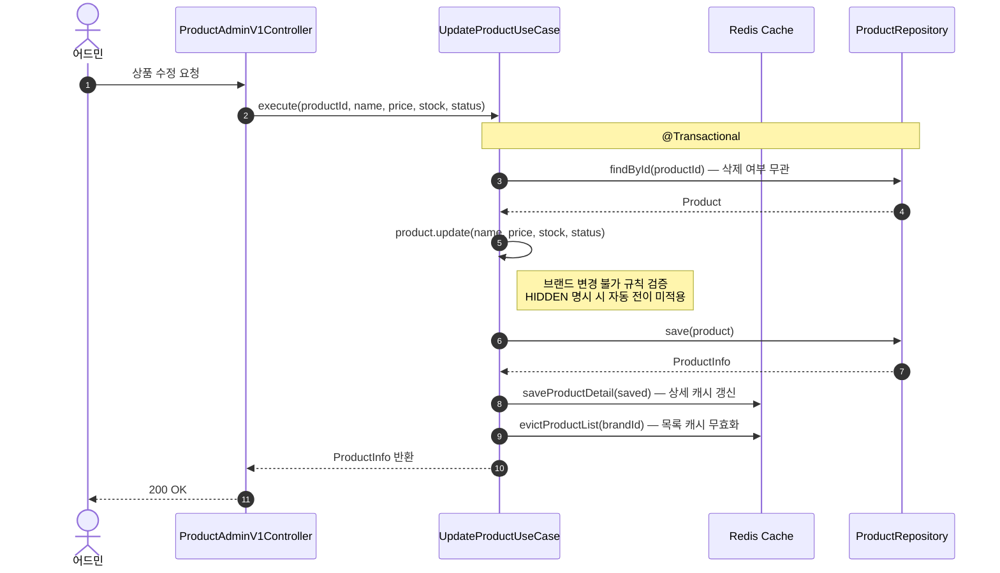
```mermaid
sequenceDiagram
    autonumber
    actor Admin as 어드민
    participant C as ProductAdminV1Controller
    participant UC as UpdateProductUseCase
    participant Cache as Redis Cache
    participant R as ProductRepository
    Admin ->> C: 상품 수정 요청
    C ->> UC: execute(productId, name, price, stock, status)
    Note over UC, R: @Transactional
    UC ->> R: findById(productId) — 삭제 여부 무관
    R -->> UC: Product
    UC ->> UC: product.update(name, price, stock, status)
    Note right of UC: 브랜드 변경 불가 규칙 검증<br/>HIDDEN 명시 시 자동 전이 미적용
    UC ->> R: save(product)
    R -->> UC: ProductInfo
    UC ->> Cache: saveProductDetail(saved) — 상세 캐시 갱신
    UC ->> Cache: evictProductList(brandId) — 목록 캐시 무효화
    UC -->> C: ProductInfo 반환
    C -->> Admin: 200 OK
```

#### 참고

- 삭제된 상품도 수정 가능 (어드민 권한)
- 캐시 갱신: 상세 캐시를 최신 상태로 덮어쓰고, 해당 브랜드의 목록 캐시를 무효화한다

### 2.11 상품 삭제

**API:** `DELETE /api-admin/v1/products/{productId}` — LDAP 인증

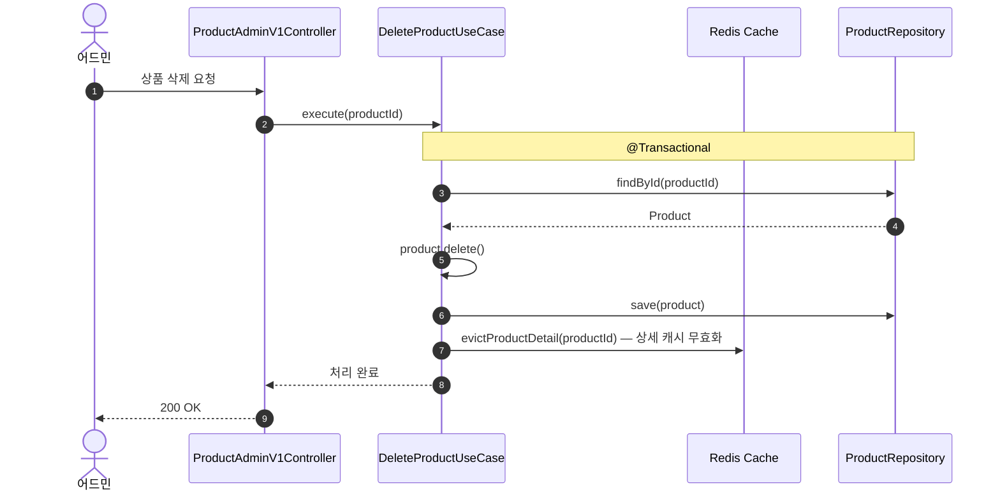
```mermaid
sequenceDiagram
    autonumber
    actor Admin as 어드민
    participant C as ProductAdminV1Controller
    participant UC as DeleteProductUseCase
    participant Cache as Redis Cache
    participant R as ProductRepository
    Admin ->> C: 상품 삭제 요청
    C ->> UC: execute(productId)
    Note over UC, R: @Transactional
    UC ->> R: findById(productId)
    R -->> UC: Product
    UC ->> UC: product.delete()
    UC ->> R: save(product)
    UC ->> Cache: evictProductDetail(productId) — 상세 캐시 무효화
    UC -->> C: 처리 완료
    C -->> Admin: 200 OK
```

#### 참고

- BaseEntity.delete()는 이미 삭제 상태면 무시 (멱등)
- 삭제된 상품의 like 는 추후 배치에서 제거
- 상세 캐시만 무효화. 목록 캐시는 TTL(30분) 만료 후 자동 정리

### 2.12 상품 복구

**API:** `POST /api-admin/v1/products/{productId}/restore` — LDAP 인증

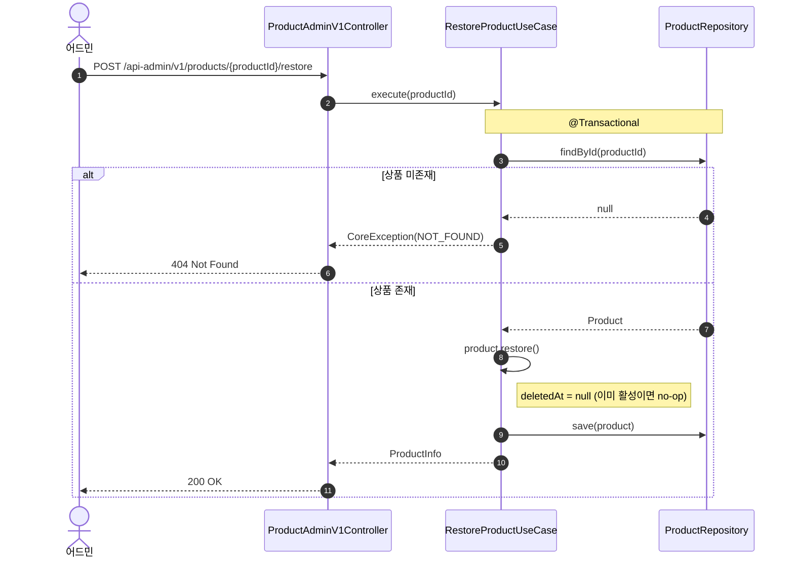
```mermaid
sequenceDiagram
    autonumber
    actor Admin as 어드민
    participant C as ProductAdminV1Controller
    participant UC as RestoreProductUseCase
    participant R as ProductRepository

    Admin ->> C: POST /api-admin/v1/products/{productId}/restore
    C ->> UC: execute(productId)
    Note over UC, R: @Transactional
    UC ->> R: findById(productId)
    alt 상품 미존재
        R -->> UC: null
        UC -->> C: CoreException(NOT_FOUND)
        C -->> Admin: 404 Not Found
    else 상품 존재
        R -->> UC: Product
        UC ->> UC: product.restore()
        Note right of UC: deletedAt = null (이미 활성이면 no-op)
        UC ->> R: save(product)
        UC -->> C: ProductInfo
        C -->> Admin: 200 OK
    end
```

---

## 3. 좋아요

### 3.1 좋아요 등록 (멱등성)

**API:** `POST /api/v1/products/{productId}/likes` — 인증 필요

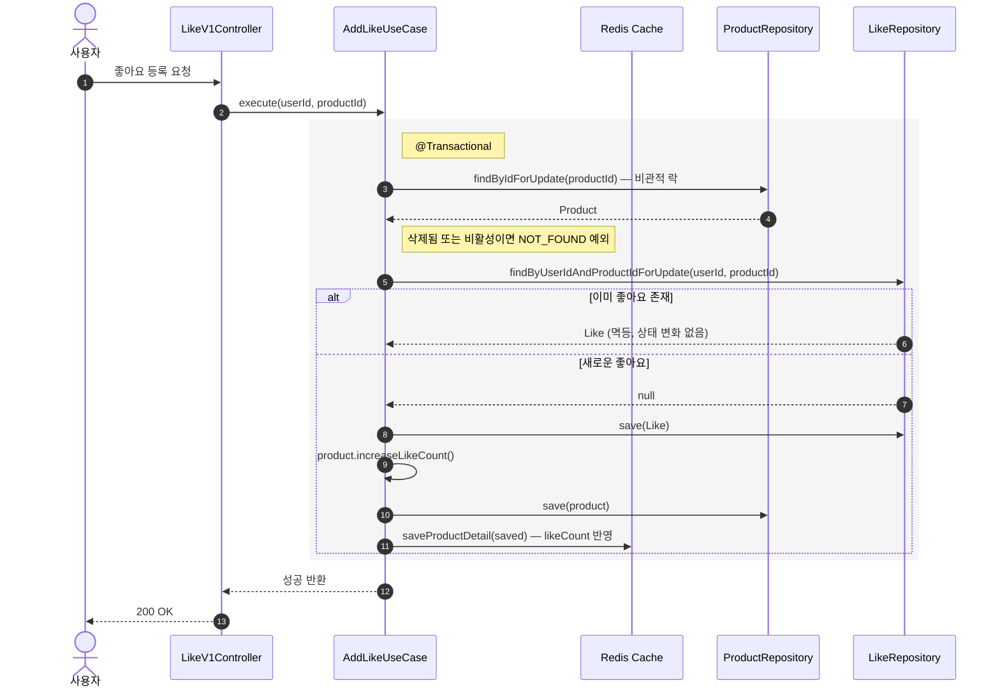
```mermaid
sequenceDiagram
    autonumber
    actor User as 사용자
    participant C as LikeV1Controller
    participant UC as AddLikeUseCase
    participant Cache as Redis Cache
    participant PR as ProductRepository
    participant LR as LikeRepository
    User ->> C: 좋아요 등록 요청
    C ->> UC: execute(userId, productId)

    rect rgb(245, 245, 245)
        Note right of UC: @Transactional
        UC ->> PR: findByIdForUpdate(productId) — 비관적 락
        PR -->> UC: Product
        Note right of UC: 삭제됨 또는 비활성이면 NOT_FOUND 예외
        UC ->> LR: findByUserIdAndProductIdForUpdate(userId, productId)
        alt 이미 좋아요 존재
            LR -->> UC: Like (멱등, 상태 변화 없음)
        else 새로운 좋아요
            LR -->> UC: null
            UC ->> LR: save(Like)
            UC ->> UC: product.increaseLikeCount()
            UC ->> PR: save(product)
            UC ->> Cache: saveProductDetail(saved) — likeCount 반영
        end
    end

    UC -->> C: 성공 반환
    C -->> User: 200 OK
```

### 3.2 좋아요 취소 (멱등성 & Hard Delete)

좋아요 취소는 **물리적 삭제(Hard Delete)**를 수행하며, 삭제된 상품에 대해서도 멱등하게 처리된다.

**API:** `DELETE /api/v1/products/{productId}/likes` — 인증 필요

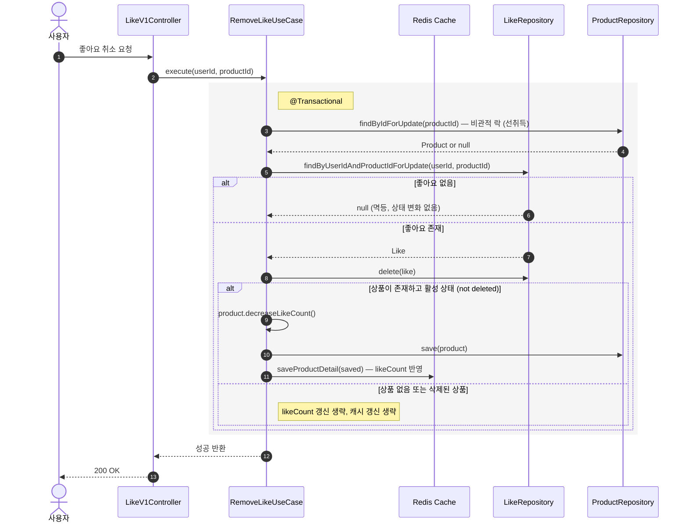
```mermaid
sequenceDiagram
    autonumber
    actor User as 사용자
    participant C as LikeV1Controller
    participant UC as RemoveLikeUseCase
    participant Cache as Redis Cache
    participant LR as LikeRepository
    participant PR as ProductRepository
    User ->> C: 좋아요 취소 요청
    C ->> UC: execute(userId, productId)

    rect rgb(245, 245, 245)
        Note right of UC: @Transactional
        UC ->> PR: findByIdForUpdate(productId) — 비관적 락 (선취득)
        PR -->> UC: Product or null
        UC ->> LR: findByUserIdAndProductIdForUpdate(userId, productId)
        alt 좋아요 없음
            LR -->> UC: null (멱등, 상태 변화 없음)
        else 좋아요 존재
            LR -->> UC: Like
            UC ->> LR: delete(like)
            alt 상품이 존재하고 활성 상태 (not deleted)
                UC ->> UC: product.decreaseLikeCount()
                UC ->> PR: save(product)
                UC ->> Cache: saveProductDetail(saved) — likeCount 반영
            else 상품 없음 또는 삭제된 상품
                Note right of UC: likeCount 갱신 생략, 캐시 갱신 생략
            end
        end
    end

    UC -->> C: 성공 반환
    C -->> User: 200 OK
```

#### 참고

- **삭제된 상품 포함 조회:** 좋아요 취소 시에는 삭제된 상품도 포함하여 처리한다. 삭제된 상품의 좋아요도 취소할 수 있어야 하기 때문이다 (요구사항: "삭제된 상품에 대한 좋아요 취소 → 200 OK")
- 삭제된 상품의 likeCount는 갱신하지 않음 (의미 없는 카운트 변경 방지)

### 3.3 내 좋아요 목록 조회

서로 다른 도메인(Like, Product)의 데이터를 조합하는 흐름이다.

**API:** `GET /api/v1/users/likes` — 인증 필요 (`@AuthUser`)

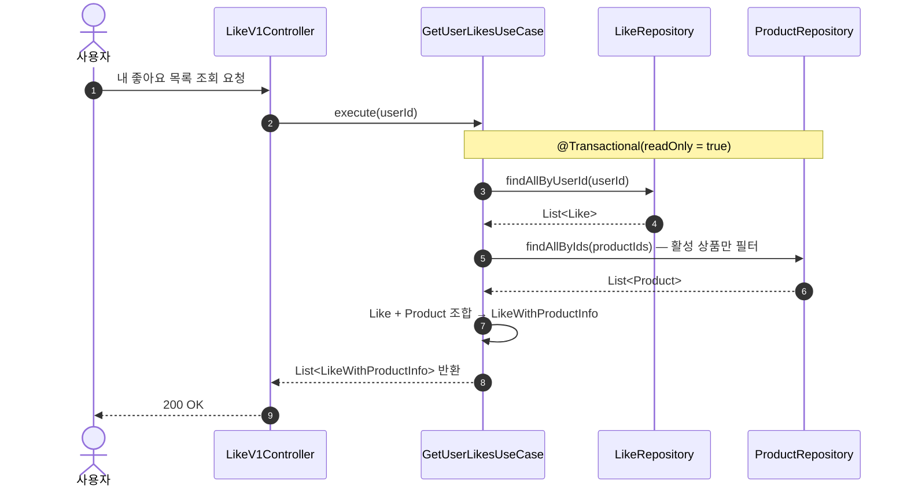
```mermaid
sequenceDiagram
    autonumber
    actor User as 사용자
    participant C as LikeV1Controller
    participant UC as GetUserLikesUseCase
    participant LR as LikeRepository
    participant PR as ProductRepository
    User ->> C: 내 좋아요 목록 조회 요청
    C ->> UC: execute(userId)
    Note over UC, PR: @Transactional(readOnly = true)
    UC ->> LR: findAllByUserId(userId)
    LR -->> UC: List<Like>
    UC ->> PR: findAllByIds(productIds) — 활성 상품만 필터
    PR -->> UC: List<Product>
    UC ->> UC: Like + Product 조합 → LikeWithProductInfo
    UC -->> C: List<LikeWithProductInfo> 반환
    C -->> User: 200 OK
```

#### 참고

- URL에 userId가 없으므로 타인 좋아요 조회 불가 (`@AuthUser`로 본인만 주입)
- 쿼리 총 2회: Like 조회 1회 + Product IN 조회 1회 (N+1 방지)
- 비활성(HIDDEN) 또는 삭제된 상품과 연결된 좋아요는 응답에서 제외

---

## 4. 주문 — 대고객 API

### 4.1 주문 생성 (Cross-Domain Transaction)

주문 생성은 **상품 검증 → 재고 차감 → 쿠폰 검증/사용 → 주문 생성(totalPrice 계산 + Order/OrderItem 저장)**이 원자적으로 이루어져야 하는 핵심 트랜잭션이다.

**API:** `POST /api/v1/orders` — 인증 필요

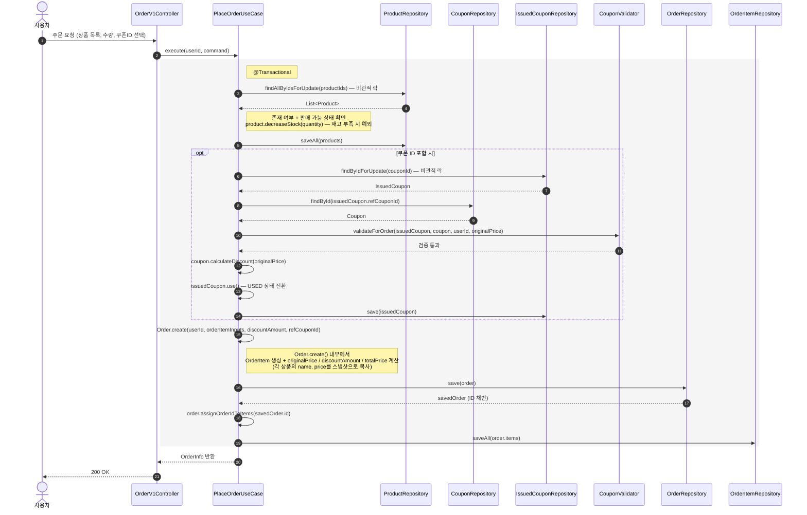
```mermaid
sequenceDiagram
    autonumber
    actor User as 사용자
    participant C as OrderV1Controller
    participant UC as PlaceOrderUseCase
    participant PR as ProductRepository
    participant CR as CouponRepository
    participant ICR as IssuedCouponRepository
    participant CV as CouponValidator
    participant OR as OrderRepository
    participant OIR as OrderItemRepository
    User ->> C: 주문 요청 (상품 목록, 수량, 쿠폰ID 선택)
    C ->> UC: execute(userId, command)

    rect rgb(245, 245, 245)
        Note right of UC: @Transactional
    %% 1단계: 상품 유효성 확인 + 재고 차감
        UC ->> PR: findAllByIdsForUpdate(productIds) — 비관적 락
        PR -->> UC: List<Product>
        Note right of UC: 존재 여부 + 판매 가능 상태 확인<br/>product.decreaseStock(quantity) — 재고 부족 시 예외
        UC ->> PR: saveAll(products)
    %% 2단계: 쿠폰 검증 + 사용 처리 (쿠폰 ID가 있는 경우)
        opt 쿠폰 ID 포함 시
            UC ->> ICR: findByIdForUpdate(couponId) — 비관적 락
            ICR -->> UC: IssuedCoupon
            UC ->> CR: findById(issuedCoupon.refCouponId)
            CR -->> UC: Coupon
            UC ->> CV: validateForOrder(issuedCoupon, coupon, userId, originalPrice)
            CV -->> UC: 검증 통과
            UC ->> UC: coupon.calculateDiscount(originalPrice)
            UC ->> UC: issuedCoupon.use() — USED 상태 전환
            UC ->> ICR: save(issuedCoupon)
        end
    %% 3단계: 주문 생성
        UC ->> UC: Order.create(userId, orderItemInputs, discountAmount, refCouponId)
        Note right of UC: Order.create() 내부에서<br/>OrderItem 생성 + originalPrice / discountAmount / totalPrice 계산<br/>(각 상품의 name, price를 스냅샷으로 복사)
        UC ->> OR: save(order)
        OR -->> UC: savedOrder (ID 채번)
        UC ->> UC: order.assignOrderIdToItems(savedOrder.id)
        UC ->> OIR: saveAll(order.items)
    end

    UC -->> C: OrderInfo 반환
    C -->> User: 200 OK
```

#### 참고

- 재고 부족 시 트랜잭션 롤백으로 이전 차감분 모두 원복
- OrderItem은 주문 시점의 상품 정보(이름, 가격)를 스냅샷으로 보존
- `PlaceOrderUseCase`는 ProductRepository, OrderRepository, OrderItemRepository, CouponRepository, IssuedCouponRepository, CouponValidator를 직접 주입받아 오케스트레이션한다
- 실행 순서: 재고 차감 → 쿠폰 검증/사용 → 주문 생성/저장

### 4.2 주문 목록 조회 (기간 필터링)

**API:** `GET /api/v1/orders` — 인증 필요

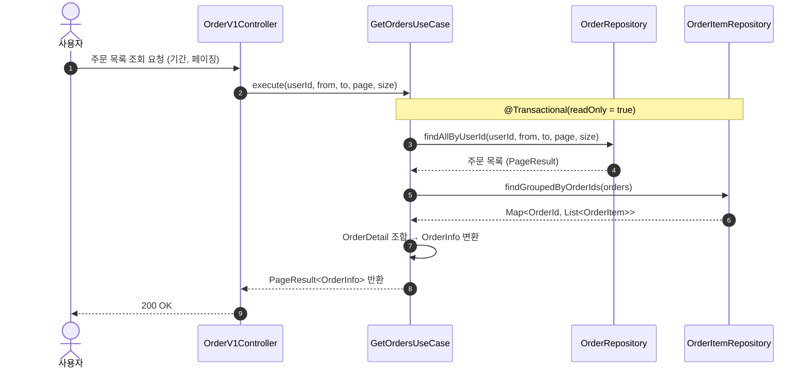
```mermaid
sequenceDiagram
    autonumber
    actor User as 사용자
    participant C as OrderV1Controller
    participant UC as GetOrdersUseCase
    participant OR as OrderRepository
    participant OIR as OrderItemRepository
    User ->> C: 주문 목록 조회 요청 (기간, 페이징)
    C ->> UC: execute(userId, from, to, page, size)
    Note over UC, OIR: @Transactional(readOnly = true)
    UC ->> OR: findAllByUserId(userId, from, to, page, size)
    OR -->> UC: 주문 목록 (PageResult)
    UC ->> OIR: findGroupedByOrderIds(orders)
    OIR -->> UC: Map<OrderId, List<OrderItem>>
    UC ->> UC: OrderDetail 조합 → OrderInfo 변환
    UC -->> C: PageResult<OrderInfo> 반환
    C -->> User: 200 OK
```

#### 참고

- from/to 미입력 시 기본값: 최근 1달

### 4.3 주문 상세 조회

**API:** `GET /api/v1/orders/{orderId}` — 인증 필요

```mermaid
sequenceDiagram
    autonumber
    actor User as 사용자
    participant C as OrderV1Controller
    participant UC as GetOrderUseCase
    participant OR as OrderRepository
    participant OIR as OrderItemRepository
    User ->> C: 주문 상세 정보 요청
    C ->> UC: execute(userId, orderId)
    Note over UC, OIR: @Transactional(readOnly = true)
    UC ->> OR: findById(orderId)
    OR -->> UC: Order
    Note right of UC: 본인 주문인지 소유권 검증 (order.refUserId == userId)
    UC ->> OIR: findAllByOrderId(orderId)
    OIR -->> UC: List<OrderItem>
    UC ->> UC: OrderDetail(order, items) 조합
    UC -->> C: OrderInfo 반환
    C -->> User: 200 OK
```

#### 참고

- 타인 주문 접근 시 403이 아닌 404 반환 (주문 존재 여부 노출 방지)

---

## 5. 주문 — 어드민 API

### 5.1 전체 주문 목록 조회

**API:** `GET /api-admin/v1/orders` — LDAP 인증

```mermaid
sequenceDiagram
    autonumber
    actor Admin as 어드민
    participant C as OrderAdminV1Controller
    participant UC as GetOrdersAdminUseCase
    participant OR as OrderRepository
    participant OIR as OrderItemRepository
    Admin ->> C: 전체 주문 목록 조회 요청
    C ->> UC: execute(page, size)
    Note over UC, OIR: @Transactional(readOnly = true)
    UC ->> OR: findAll(page, size) — userId 필터 없음
    OR -->> UC: 주문 목록 (PageResult)
    UC ->> OIR: findGroupedByOrderIds(orders)
    OIR -->> UC: Map<OrderId, List<OrderItem>>
    UC ->> UC: OrderDetail 조합 → OrderInfo 변환
    UC -->> C: PageResult<OrderInfo> 반환
    C -->> Admin: 200 OK
```

### 5.2 주문 상세 조회

**API:** `GET /api-admin/v1/orders/{orderId}` — LDAP 인증

```mermaid
sequenceDiagram
    autonumber
    actor Admin as 어드민
    participant C as OrderAdminV1Controller
    participant UC as GetOrderAdminUseCase
    participant OR as OrderRepository
    participant OIR as OrderItemRepository
    Admin ->> C: 주문 상세 조회 요청
    C ->> UC: execute(orderId)
    Note over UC, OIR: @Transactional(readOnly = true)
    UC ->> OR: findById(orderId)
    OR -->> UC: Order
    UC ->> OIR: findAllByOrderId(orderId)
    OIR -->> UC: List<OrderItem>
    UC ->> UC: OrderDetail(order, items) 조합
    UC -->> C: OrderInfo 반환
    C -->> Admin: 200 OK
```

#### 참고

- 어드민은 소유권 검증 없이 모든 주문 조회 가능

---

## 6. 쿠폰

### 6.1 쿠폰 발급 (선착순)

**API:** `POST /api/v1/coupons/{couponId}/issue` — 인증 필요

```mermaid
sequenceDiagram
    autonumber
    actor User as 사용자
    participant C as CouponV1Controller
    participant UC as IssueCouponUseCase
    participant CR as CouponRepository
    participant ICR as IssuedCouponRepository
    User ->> C: 쿠폰 발급 요청 (couponId)
    C ->> UC: execute(userId, couponId)

    rect rgb(245, 245, 245)
        Note right of UC: @Transactional
        UC ->> CR: findById(couponId)
        alt 쿠폰 미존재 또는 삭제됨
            CR -->> UC: null
            UC -->> C: CoreException(NOT_FOUND)
            C -->> User: 404 Not Found
        else 쿠폰 존재
            CR -->> UC: Coupon
            UC ->> ICR: existsByRefCouponIdAndRefUserId(couponId, userId)
            alt 이미 발급됨
                ICR -->> UC: true
                UC -->> C: CoreException(CONFLICT)
                C -->> User: 409 Conflict
            else 미발급
                ICR -->> UC: false
                Note right of UC: coupon.canIssue() 검증<br/>(만료 여부 + 수량 초과 여부)
                UC ->> UC: coupon.issue() — issuedCount++
                UC ->> CR: save(coupon)
                UC ->> ICR: save(IssuedCoupon)
                UC -->> C: IssuedCouponInfo 반환
                C -->> User: 200 OK
            end
        end
    end
```

#### 참고

- `coupon.canIssue()`: 만료 여부(`isExpired()`) + 수량 제한(totalQuantity == null 이거나 issuedCount < totalQuantity) 복합 검증. 삭제 여부(`isDeleted()`) 검증은 UseCase에서 별도 수행(findById 결과 null 처리)
- 만료 또는 수량 초과 시 400 BAD_REQUEST, 중복 발급 시 409 CONFLICT
- `CR.findById`는 비관적 락(`FOR UPDATE`)으로 동시 발급 경쟁 조건을 방지한다

### 6.2 내 쿠폰 목록 조회

**API:** `GET /api/v1/users/me/coupons` — 인증 필요

```mermaid
sequenceDiagram
    autonumber
    actor User as 사용자
    participant C as CouponV1Controller
    participant UC as GetMyCouponsUseCase
    participant ICR as IssuedCouponRepository
    participant CR as CouponRepository
    User ->> C: 내 쿠폰 목록 조회 요청
    C ->> UC: execute(userId)
    Note over UC, CR: @Transactional(readOnly = true)
    UC ->> ICR: findAllByRefUserId(userId)
    ICR -->> UC: List<IssuedCoupon>
    UC ->> CR: findAllByIds(couponIds)
    CR -->> UC: List<Coupon>
    UC ->> UC: IssuedCoupon + Coupon 조합 → IssuedCouponInfo
    UC -->> C: List<IssuedCouponInfo> 반환
    C -->> User: 200 OK
```

#### 참고

- 쿼리 총 2회: IssuedCoupon 조회 1회 + Coupon IN 조회 1회 (N+1 방지)
- 삭제된 쿠폰 템플릿과 연결된 발급 쿠폰도 조회 결과에 포함된다

---

## 7. 쿠폰 — 어드민 API

### 7.1 쿠폰 생성

**API:** `POST /api-admin/v1/coupons` — LDAP 인증

```mermaid
sequenceDiagram
    autonumber
    actor Admin as 어드민
    participant C as CouponAdminV1Controller
    participant UC as CreateCouponAdminUseCase
    participant CR as CouponRepository
    Admin ->> C: 쿠폰 생성 요청 (name, type, value, ...)
    C ->> UC: execute(command)
    Note over UC, CR: @Transactional
    UC ->> UC: Coupon 생성 (validate 포함)
    UC ->> CR: save(coupon)
    CR -->> UC: CouponInfo (ID 채번)
    UC -->> C: CouponInfo 반환
    C -->> Admin: 200 OK
```

### 7.2 쿠폰 수정

**API:** `PUT /api-admin/v1/coupons/{couponId}` — LDAP 인증

```mermaid
sequenceDiagram
    autonumber
    actor Admin as 어드민
    participant C as CouponAdminV1Controller
    participant UC as UpdateCouponAdminUseCase
    participant CR as CouponRepository
    Admin ->> C: 쿠폰 수정 요청
    C ->> UC: execute(couponId, command)
    Note over UC, CR: @Transactional
    UC ->> CR: findById(couponId)
    CR -->> UC: Coupon
    UC ->> UC: coupon.update(...)
    UC ->> CR: save(coupon)
    UC -->> C: CouponInfo 반환
    C -->> Admin: 200 OK
```

### 7.3 쿠폰 삭제

**API:** `DELETE /api-admin/v1/coupons/{couponId}` — LDAP 인증

```mermaid
sequenceDiagram
    autonumber
    actor Admin as 어드민
    participant C as CouponAdminV1Controller
    participant UC as DeleteCouponAdminUseCase
    participant CR as CouponRepository
    Admin ->> C: 쿠폰 삭제 요청
    C ->> UC: execute(couponId)
    Note over UC, CR: @Transactional
    UC ->> CR: findById(couponId)
    CR -->> UC: Coupon
    UC ->> UC: coupon.delete() — deletedAt 설정
    UC ->> CR: save(coupon)
    UC -->> C: 처리 완료
    C -->> Admin: 200 OK
```

### 7.4 쿠폰 발급 내역 조회

**API:** `GET /api-admin/v1/coupons/{couponId}/issues` — LDAP 인증

```mermaid
sequenceDiagram
    autonumber
    actor Admin as 어드민
    participant C as CouponAdminV1Controller
    participant UC as GetCouponIssuesAdminUseCase
    participant ICR as IssuedCouponRepository
    Admin ->> C: 발급 내역 조회 요청 (couponId, page, size)
    C ->> UC: execute(couponId, page, size)
    Note over UC, ICR: @Transactional(readOnly = true)
    UC ->> ICR: findAllByRefCouponId(couponId, page, size)
    ICR -->> UC: PageResult<IssuedCoupon>
    UC -->> C: PageResult<IssuedCouponInfo> 반환
    C -->> Admin: 200 OK
```

---

## 8. 회원가입

### 6.1 회원가입

**API:** `POST /api/v1/users/sign-up` — 인증 불필요

```mermaid
sequenceDiagram
    autonumber
    actor User as 사용자
    participant C as UserV1Controller
    participant UC as RegisterUserUseCase
    participant UR as UserRepository
    User ->> C: 회원가입 요청 (loginId, password, name 등)
    C ->> UC: execute(loginId, password, name, birthDate, email)

    rect rgb(245, 245, 245)
        Note right of UC: @Transactional
        UC ->> UR: existsByLoginId(loginId) — 중복 확인
        UR -->> UC: false (중복 없음)
        UC ->> UR: save(user)
        UR -->> UC: 생성된 User (ID 채번)
    end

    UC -->> C: UserInfo 반환
    C -->> User: 200 OK
```

#### 참고

- `RegisterUserUseCase`는 UserRepository를 직접 주입받아 사용한다

---

## 9. 결제 (Round 6 — PG 연동 + Resilience)

> PG Simulator는 별도 Spring Boot 앱(`apps/pg-simulator`)으로 동작한다.
> Resilience4j 적용 순서: CircuitBreaker(바깥) → Retry(안쪽) → TimeLimiter.
> PG 시뮬레이터 특성: 요청 성공률 60%, 응답 지연 100ms~500ms, 처리 지연 1s~5s.

### 9.1 결제 요청

**API:** `POST /api/v1/payments` — 사용자 인증 필요

```mermaid
sequenceDiagram
    autonumber
    actor User as 사용자
    participant C as PaymentController
    participant UC as RequestPaymentUseCase
    participant PG as PgClient (port)
    participant SIM as PG Simulator (FeignClient)
    participant PR as PaymentRepository
    participant OR as OrderRepository

    User ->> C: 결제 요청 (orderId, cardType, cardNo)
    C ->> UC: execute(orderId, cardType, cardNo, userId)

    rect rgb(245, 245, 245)
        Note right of UC: @Transactional
        UC ->> UC: Order 조회 및 결제 가능 상태 검증

        Note over PG, SIM: CircuitBreaker(pgPayment) → Retry(pgRetry) → TimeLimiter
        UC ->> PG: requestPayment(orderId, cardType, cardNo, amount, callbackUrl)
        PG ->> SIM: POST /api/v1/payments

        alt PG 정상 응답 (60% 확률, 100ms~500ms)
            SIM -->> PG: { transactionKey, status: PENDING }
            PG -->> UC: PgResponse(transactionKey, PENDING)
            UC ->> PR: save(Payment(status=REQUESTED, transactionKey))
            UC ->> OR: updateStatus(orderId, PENDING_PAYMENT)
            PR -->> UC: Payment
            UC -->> C: PaymentInfo
            C -->> User: 200 OK (paymentId, status=REQUESTED)

        else Timeout / Retry 소진 (TimeLimiter 초과 또는 Retry 횟수 소진)
            SIM -->> PG: 응답 없음 / 지연
            PG -->> UC: fallback 호출
            UC ->> PG: queryByOrderId(orderId) — PG 상태 조회 시도
            PG ->> SIM: GET /api/v1/payments?orderId={orderId}

            alt PG에 결제 기록 존재
                SIM -->> PG: 트랜잭션 목록
                PG -->> UC: PgResponse(transactionKey, PENDING)
                UC ->> PR: save(Payment(status=REQUESTED, transactionKey))
            else PG에 기록 없음
                UC ->> PR: save(Payment(status=TIMEOUT, transactionKey=null))
            end

            UC ->> OR: updateStatus(orderId, PENDING_PAYMENT)
            UC -->> C: PaymentInfo
            C -->> User: 200 OK (paymentId, status=REQUESTED or TIMEOUT)

        else CircuitBreaker OPEN (PG 장애 누적으로 회로 차단)
            PG -->> UC: fallback 즉시 호출 (CallNotPermittedException)
            UC ->> PR: save(Payment(status=TIMEOUT, transactionKey=null))
            UC ->> OR: updateStatus(orderId, PENDING_PAYMENT)
            Note right of UC: 스케줄러가 주기적으로 복구 시도
            UC -->> C: PaymentInfo
            C -->> User: 200 OK (paymentId, status=TIMEOUT)
        end
    end
```

### 9.2 PG 콜백 수신

**API:** `POST /api/v1/payments/callback` — 인증 불필요 (PG Simulator 발신)

```mermaid
sequenceDiagram
    autonumber
    participant SIM as PG Simulator
    participant C as PaymentCallbackController
    participant UC as HandlePaymentCallbackUseCase
    participant PR as PaymentRepository
    participant OR as OrderRepository

    SIM ->> C: POST /api/v1/payments/callback<br/>{ transactionKey, orderId, status, reason }
    C ->> UC: execute(transactionKey, status, reason)

    rect rgb(245, 245, 245)
        Note right of UC: @Transactional
        UC ->> PR: findByTransactionKey(transactionKey)
        PR -->> UC: Payment (status=REQUESTED or TIMEOUT)

        Note over UC: 조건부 UPDATE<br/>WHERE status IN ('REQUESTED', 'TIMEOUT')

        alt status = SUCCESS
            UC ->> PR: updateStatus(paymentId, SUCCESS)
            UC ->> OR: updateStatus(orderId, PAID)
        else status = FAILED
            UC ->> PR: updateStatus(paymentId, FAILED)
            UC ->> OR: updateStatus(orderId, FAILED)
        end

        PR -->> UC: 처리 완료
        OR -->> UC: 처리 완료
    end

    UC -->> C: 처리 완료
    C -->> SIM: 200 OK
```

### 9.3 스케줄러 자동 복구

**트리거:** `@Scheduled` — 시스템 자동 실행 (주기적)

```mermaid
sequenceDiagram
    autonumber
    participant SCH as PaymentRecoveryScheduler
    participant UC as RecoverPendingPaymentsUseCase
    participant PR as PaymentRepository
    participant PG as PgClient (port)
    participant SIM as PG Simulator (FeignClient)
    participant OR as OrderRepository

    SCH ->> UC: execute()
    UC ->> PR: findAllByStatusIn([REQUESTED, TIMEOUT])
    PR -->> UC: List<Payment>

    loop 각 미완료 Payment
        Note over PG, SIM: CircuitBreaker(pgStatusQuery) 적용
        UC ->> PG: queryByOrderId(payment.orderId)
        PG ->> SIM: GET /api/v1/payments?orderId={orderId}

        alt PG 응답 정상
            SIM -->> PG: 트랜잭션 목록 (status: SUCCESS / FAILED / PENDING)

            alt PG status = SUCCESS
                rect rgb(245, 245, 245)
                    Note right of UC: @Transactional
                    UC ->> PR: updateStatus(paymentId, SUCCESS) — 조건부 UPDATE
                    UC ->> OR: updateStatus(orderId, PAID)
                end
            else PG status = FAILED
                rect rgb(245, 245, 245)
                    Note right of UC: @Transactional
                    UC ->> PR: updateStatus(paymentId, FAILED) — 조건부 UPDATE
                    UC ->> OR: updateStatus(orderId, FAILED)
                end
            else PG status = PENDING
                Note right of UC: 아직 처리 중 — 다음 스케줄 주기에 재시도
            end
        else PG 응답 실패 / CB OPEN
            Note right of UC: 해당 건 스킵, 다음 주기에 재시도
        end
    end

    UC -->> SCH: 복구 완료
```

### 9.4 Admin 수동 PG 상태 동기화

**API:** `POST /api-admin/v1/payments/{paymentId}/sync` — 관리자 인증 필요

```mermaid
sequenceDiagram
    autonumber
    actor Admin as 관리자
    participant C as PaymentAdminController
    participant UC as SyncPaymentUseCase
    participant PR as PaymentRepository
    participant PG as PgClient (port)
    participant SIM as PG Simulator (FeignClient)
    participant OR as OrderRepository

    Admin ->> C: POST /api-admin/v1/payments/{paymentId}/sync
    C ->> UC: execute(paymentId)

    UC ->> PR: findById(paymentId)
    PR -->> UC: Payment

    Note over PG, SIM: CircuitBreaker(pgStatusQuery) 적용
    UC ->> PG: queryByOrderId(payment.orderId)
    PG ->> SIM: GET /api/v1/payments?orderId={orderId}
    SIM -->> PG: 트랜잭션 목록
    PG -->> UC: PgResponse

    rect rgb(245, 245, 245)
        Note right of UC: @Transactional
        Note over UC: 조건부 UPDATE<br/>WHERE status IN ('REQUESTED', 'TIMEOUT')

        alt PG status = SUCCESS
            UC ->> PR: updateStatus(paymentId, SUCCESS)
            UC ->> OR: updateStatus(orderId, PAID)
        else PG status = FAILED
            UC ->> PR: updateStatus(paymentId, FAILED)
            UC ->> OR: updateStatus(orderId, FAILED)
        else PG status = PENDING
            Note right of UC: 상태 변경 없음
        end
    end

    UC -->> C: SyncResult
    C -->> Admin: 200 OK
```

### 9.5 Admin 스케줄러 수동 트리거

**API:** `POST /api-admin/v1/payments/scheduler/trigger` — 관리자 인증 필요

```mermaid
sequenceDiagram
    autonumber
    actor Admin as 관리자
    participant C as PaymentAdminController
    participant UC as TriggerPaymentRecoveryUseCase
    participant RUC as RecoverPendingPaymentsUseCase

    Admin ->> C: POST /api-admin/v1/payments/scheduler/trigger
    C ->> UC: execute()
    UC ->> RUC: execute()
    Note right of RUC: 9.3 스케줄러 자동 복구와 동일한 로직 수행
    RUC -->> UC: 처리 완료
    UC -->> C: TriggerResult
    C -->> Admin: 200 OK
```

#### 참고

- PG Simulator 콜백 발신: `PaymentEventListener`가 트랜잭션 커밋 후 비동기(`@Async`)로 1s~5s 지연 후 `callbackUrl`로 POST 요청
- `pgPayment` CB 인스턴스: 결제 요청용 / `pgStatusQuery` CB 인스턴스: 상태 조회용 (별도 설정 권장)
- 조건부 UPDATE(`WHERE status IN (...)`)는 중복 콜백/스케줄러 동시 실행에 의한 상태 덮어쓰기를 방지
- **@Transactional은 UseCase 레벨에서 설정**하여 User 생성의 원자성을 보장한다

---

# Round 7 — 이벤트 기반 아키텍처 & Kafka 파이프라인

---

## 10. Step 1 — ApplicationEvent로 경계 나누기

### 10.1 주문 생성 + 이벤트 발행

**API:** `POST /api/v1/orders` — 인증 필수

```mermaid
sequenceDiagram
    autonumber
    actor User as 사용자
    participant C as OrderController
    participant UC as PlaceOrderUseCase
    participant R as Repository
    participant OR as OutboxRepository
    participant EP as EventPublisher
    participant EL as OrderEventListener

    User ->> C: POST /api/v1/orders (items, issuedCouponId?)
    C ->> UC: execute(userId, command)

    rect rgb(245, 245, 245)
        Note right of UC: @Transactional
        UC ->> R: findAllByIdsForUpdate(productIds)
        R -->> UC: products
        UC ->> UC: 재고 차감, 쿠폰 검증·할인 적용
        UC ->> R: 주문 저장 (order + orderItems)
        R -->> UC: savedOrder
        UC ->> OR: OrderOutbox 기록 (같은 트랜잭션)
        UC ->> EP: OrderCreatedEvent 발행
    end

    UC -->> C: OrderInfo
    C -->> User: 201 Created

    Note over EP, EL: AFTER_COMMIT (비동기)
    EP ->> EL: OrderCreatedEvent
    EL ->> EL: 유저 행동 로깅 (주문 완료)
```

#### 참고
- 재고 차감, 쿠폰 적용은 핵심 트랜잭션에 포함 (기존과 동일)
- Outbox 기록이 동일 트랜잭션에 포함되어 이벤트 유실 방지
- 유저 행동 로깅은 AFTER_COMMIT + @Async로 비동기 처리

---

### 10.2 결제 콜백 + 후속 이벤트

**API:** 내부 콜백 (PG → HandlePaymentCallbackUseCase)

```mermaid
sequenceDiagram
    autonumber
    participant PG as PG 서버
    participant C as PaymentCallbackController
    participant UC as HandlePaymentCallbackUseCase
    participant R as Repository
    participant OR as OutboxRepository
    participant EP as EventPublisher
    participant EL as PaymentEventListener

    PG ->> C: POST /api/v1/payments/callback (결제 결과)
    C ->> UC: execute(callbackCommand)

    rect rgb(245, 245, 245)
        Note right of UC: @Transactional
        UC ->> R: findByOrderIdForUpdate(orderId)
        R -->> UC: payment
        UC ->> UC: 결제 상태 업데이트 (SUCCESS/FAILED)
        UC ->> R: payment 저장
        UC ->> R: order 상태 업데이트 (PAID)
        UC ->> OR: OrderOutbox 기록 (결제 완료)
        UC ->> EP: PaymentCompletedEvent 발행
    end

    UC -->> C: 200 OK

    Note over EP, EL: AFTER_COMMIT (비동기)
    EP ->> EL: PaymentCompletedEvent
    EL ->> EL: 포인트 적립 기록
    EL ->> EL: 알림 처리
```

#### 참고
- PaymentCompletedEvent는 RequestPaymentUseCase가 아닌 **HandlePaymentCallbackUseCase**에서 발행
- PG 콜백으로 결제가 확정된 후 포인트 적립·알림 등 후속 처리를 이벤트로 분리
- 결제 실패 시 PaymentFailedEvent를 별도 발행하여 보상 처리 가능

---

### 10.3 좋아요 추가 + 비동기 집계

**API:** `POST /api/v1/products/{productId}/likes` — 인증 필수

```mermaid
sequenceDiagram
    autonumber
    actor User as 사용자
    participant C as LikeController
    participant UC as AddLikeUseCase
    participant R as Repository
    participant OR as OutboxRepository
    participant EP as EventPublisher
    participant EL as CacheEventListener

    User ->> C: POST /api/v1/products/{id}/likes
    C ->> UC: execute(userId, productId)

    rect rgb(245, 245, 245)
        Note right of UC: @Transactional
        UC ->> R: findByIdForUpdate(productId)
        R -->> UC: product
        UC ->> R: 중복 좋아요 확인
        UC ->> R: Like 저장
        UC ->> UC: product.increaseLikeCount() (동기)
        UC ->> R: product 저장
        R -->> UC: savedProduct
        UC ->> OR: CatalogOutbox 기록 (좋아요 이벤트)
        UC ->> EP: ProductLikedEvent 발행
    end

    UC -->> C: void
    C -->> User: 200 OK

    Note over EP, EL: AFTER_COMMIT
    EP ->> EL: ProductCacheEvent.DetailUpdated (캐시 무효화)
```

#### 참고
- `Product.likeCount`는 동기적으로 즉시 반영 (사용자에게 즉시 보임)
- `CatalogOutbox`에 좋아요 이벤트 기록 → Relay → Kafka → `commerce-streamer`에서 `product_metrics` 비동기 집계
- 캐시 무효화는 기존 `ProductCacheEvent` 패턴 유지

---

### 10.4 상품 조회 + 조회 이벤트

**API:** `GET /api/v1/products/{productId}` — 인증 선택

```mermaid
sequenceDiagram
    autonumber
    actor User as 사용자
    participant C as ProductController
    participant UC as GetProductUseCase
    participant R as Repository
    participant EP as EventPublisher
    participant EL as ActivityEventListener

    User ->> C: GET /api/v1/products/{id}
    C ->> UC: execute(productId)

    UC ->> R: findById(productId)
    R -->> UC: product

    UC ->> EP: ProductViewedEvent 발행

    UC -->> C: ProductInfo
    C -->> User: 200 OK

    Note over EP, EL: 비동기
    EP ->> EL: ProductViewedEvent
    EL ->> EL: Outbox 기록 (조회 이벤트, 별도 트랜잭션)
```

#### 참고
- 조회는 읽기 전용이므로 Outbox 기록은 EventListener 내 별도 트랜잭션
- 조회 실패가 이벤트 기록 실패에 영향받지 않도록 분리

---

## 11. Step 2 — Kafka 이벤트 파이프라인

### 11.1 Outbox Relay → Kafka 발행

```mermaid
sequenceDiagram
    autonumber
    participant S as Scheduler (Relay)
    participant OR as OutboxRepository
    participant KP as KafkaProducer
    participant K as Kafka Broker

    loop 주기적 폴링
        S ->> OR: 미발행 Outbox 조회 (published = false)
        OR -->> S: pendingEvents

        alt 미발행 이벤트 존재
            loop 각 이벤트
                S ->> KP: send(topic, key, payload)
                KP ->> K: produce (acks=all)
                K -->> KP: ack
                KP -->> S: 발행 성공
                S ->> OR: published = true 업데이트
            end
        end
    end
```

#### 참고
- Relay는 `@Scheduled`로 주기적 폴링
- 도메인별 Outbox 테이블(catalog_outbox, order_outbox, coupon_outbox) 각각 폴링
- Partition Key: aggregateId(productId, orderId 등)로 순서 보장
- 발행 실패 시 다음 폴링에서 재시도 → At Least Once 보장

---

### 11.2 commerce-streamer: 메트릭스 집계

```mermaid
sequenceDiagram
    autonumber
    participant K as Kafka Broker
    participant KC as KafkaConsumer
    participant EH as MetricsEventHandler
    participant EHR as EventHandledRepository
    participant MR as ProductMetricsRepository

    K ->> KC: poll (catalog-events, order-events)
    KC ->> EH: handle(event)

    rect rgb(245, 245, 245)
        Note right of EH: @Transactional
        EH ->> EHR: findById(eventId)
        EHR -->> EH: null (미처리)

        alt 좋아요 이벤트
            EH ->> MR: upsert likeCount
        else 주문 완료 이벤트
            EH ->> MR: upsert salesCount
        else 조회 이벤트
            EH ->> MR: upsert viewCount
        end

        EH ->> EHR: save(eventId) — 멱등 처리 기록
    end

    EH ->> KC: manual Ack (offset commit)
```

#### 참고
- `event_handled` 테이블로 중복 소비 방지 (멱등 처리)
- `product_metrics`는 upsert로 집계 — INSERT ON CONFLICT UPDATE 패턴
- `version`/`updated_at` 비교로 오래된 이벤트는 무시
- manual Ack: 처리 완료 후에만 offset commit → 실패 시 재소비

---

## 12. Step 3 — 선착순 쿠폰 발급

### 12.1 쿠폰 발급 요청 (API → Kafka)

**API:** `POST /api/v1/coupons/{couponId}/issue-async` — 인증 필수

```mermaid
sequenceDiagram
    autonumber
    actor User as 사용자
    participant C as CouponController
    participant UC as IssueCouponUseCase
    participant R as Repository
    participant OR as OutboxRepository

    User ->> C: POST /api/v1/coupons/{couponId}/issue-async
    C ->> UC: execute(userId, couponId)

    UC ->> R: 쿠폰 존재·활성 여부 확인
    R -->> UC: coupon

    rect rgb(245, 245, 245)
        Note right of UC: @Transactional
        UC ->> R: 발급 요청 저장 (requestId, status=PENDING)
        R -->> UC: savedRequest
        UC ->> OR: CouponOutbox 기록 (같은 트랜잭션)
    end

    UC -->> C: IssueRequestInfo (requestId)
    C -->> User: 202 Accepted (requestId)
```

#### 참고
- 발급 요청 저장 + Outbox 기록이 **동일 트랜잭션** → Kafka 발행 실패에도 요청 유실 없음
- Relay가 CouponOutbox를 폴링하여 Kafka `coupon-issue-requests`에 발행
- 실제 수량 확인·발급은 Consumer가 순차 처리
- Partition Key = couponId → 같은 쿠폰의 발급 요청은 동일 파티션에서 순차 처리

---

### 12.2 쿠폰 발급 Consumer 처리

```mermaid
sequenceDiagram
    autonumber
    participant K as Kafka Broker
    participant KC as KafkaConsumer
    participant EH as CouponIssueHandler
    participant R as Repository

    K ->> KC: poll (coupon-issue-requests)
    KC ->> EH: handle(issueRequest)

    rect rgb(245, 245, 245)
        Note right of EH: @Transactional
        EH ->> R: findByIdForUpdate(couponId)
        R -->> EH: coupon

        alt 수량 소진
            EH ->> R: 발급 요청 상태 → SOLD_OUT
        else 중복 발급 (userId 기반)
            EH ->> R: 발급 요청 상태 → DUPLICATE
        else 발급 가능
            EH ->> R: coupon.issue() → save
            EH ->> R: IssuedCoupon 생성·저장
            EH ->> R: 발급 요청 상태 → SUCCESS
        end
    end

    EH ->> KC: manual Ack
```

#### 참고
- Consumer가 순차 처리하므로 동일 couponId 파티션 내 동시성 충돌 없음
- `coupon.issue()`에서 잔여 수량 차감 + 발급 불가 시 예외
- 발급 결과(SUCCESS/SOLD_OUT/DUPLICATE)를 발급 요청 테이블에 저장
- 중복 발급 방지: userId + couponId 조합으로 기존 발급 여부 확인

---

### 9.3 쿠폰 발급 결과 조회

**API:** `GET /coupons/issue/{requestId}` — 인증 필수

```mermaid
sequenceDiagram
    autonumber
    actor User as 사용자
    participant C as CouponController
    participant UC as GetCouponIssueResultUseCase
    participant R as Repository

    User ->> C: GET /coupons/issue/{requestId}
    C ->> UC: execute(userId, requestId)

    UC ->> R: findById(requestId)
    R -->> UC: issueRequest

    UC ->> UC: 소유자 검증 (userId)

    alt status = PENDING
        UC -->> C: IssueResultInfo (PENDING)
        C -->> User: 200 OK (처리 중)
    else status = SUCCESS
        UC -->> C: IssueResultInfo (SUCCESS, issuedCouponId)
        C -->> User: 200 OK (발급 완료)
    else status = SOLD_OUT / DUPLICATE
        UC -->> C: IssueResultInfo (실패 사유)
        C -->> User: 200 OK (발급 실패)
    end
```

#### 참고
- 클라이언트가 주기적으로 Polling하여 발급 결과 확인
- 본인 요청만 조회 가능 (userId 검증)
- 발급 처리 전이면 PENDING, 완료되면 SUCCESS/SOLD_OUT/DUPLICATE 반환
