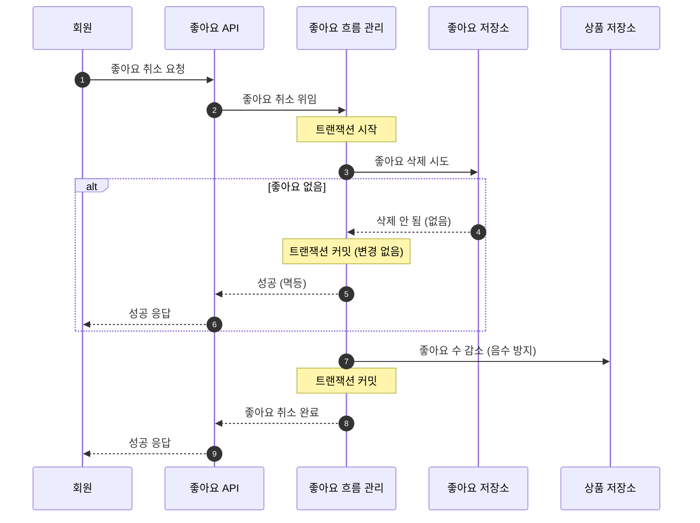

# 시퀀스 다이어그램

> 역할과 행위 중심의 설계 합의 문서.  
> 메서드/SQL이 아닌 **책임 흐름**을 검증한다.  
> 본 시퀀스 다이어그램은 유스케이스 기준의 애플리케이션 계층 협력 흐름을 표현한다.  
> 도메인 내부 책임 상세는 클래스 다이어그램에서 다룬다.  

**전제**: 본 설계는 단일 애플리케이션, 단일 RDB 트랜잭션 환경을 전제로 한다.
분산 트랜잭션, 메시지 기반 비동기 처리, eventual consistency는 현재 설계 범위에 포함하지 않는다.

---

## 참가자 정의

| 참가자 | 역할 |
|--------|------|
| 고객/회원 | 요청을 보내는 액터 (고객 API) |
| 어드민 | 운영 요청을 보내는 액터 (어드민 API) |
| API | 요청 수신, 응답 반환 |
| 흐름 관리 | 트랜잭션 경계, 유스케이스 조합 |
| 도메인 | 비즈니스 규칙, 상태 전이 |
| 저장소 | 영속성 (조회/저장/차감) |

---

## 1. 주문 생성

### 1-1. 목적

주문 생성은 **재고 정합성**과 **주문 스냅샷 일관성**을 보장하는 것이 목적이다.

- 동시 주문에도 재고가 음수가 되지 않아야 한다
- 주문 당시 상품 정보(이름, 가격)는 상품이 변경/삭제되어도 영구히 보존되어야 한다
- 하나라도 재고가 부족하면 주문 전체가 실패한다 (부분 주문 없음)

### 1-2. Happy Path

### 1-3. 설계 검증 슬라이스

| 케이스 | 처리 전략 | 왜 이렇게 설계했는가 | 영향 범위 |
|--------|----------|---------------------|----------|
| 상품 없음/삭제됨 | 즉시 실패 | 존재하지 않는 상품으로 주문 생성 차단 (BR-O04) | 주문 전체 중단 |
| 재고 부족 (일부 상품) | 전체 롤백 | 부분 주문 미선택 — 전체 단위 성공/실패 (BR-O02) | 사용자 재시도 필요 |
| 동시 주문으로 차감 실패 | 전체 롤백 | 저장소 레벨 원자적 차감으로 재고 정합성 유지 (BR-O01) | DB 락 의존 |
| 여러 상품 동시 락 | 상품 ID 오름차순 정렬 후 락 | 데드락 방지 | 정렬 로직 추가 |
| 트랜잭션 중 예외 | 전체 롤백 | 스냅샷 저장 — 재고 차감 사이 불일치 방지 | 롤백 비용 발생 |

### 1-4. 설계 의도

**부분 주문을 선택하지 않은 이유**
- BR-O02에 따라 주문은 전체 단위로 성공/실패한다
- 부분 주문은 "어떤 상품이 빠졌는지" UX 처리가 복잡하고, 재고 복구 범위가 불확실해진다
- 현 단계에서는 단순한 정책이 정합성 보장에 유리하다

**비관적 락을 선택한 이유**
- 재고 차감은 경합이 높은 연산이다
- 낙관적 락은 충돌 시 재시도 빈도가 높아지고, 여러 상품에 대한 원자적 롤백이 복잡해진다
- 비관적 락 + 조건부 차감(저장소 레벨)의 이중 방어로 안전성을 확보한다

**스냅샷을 주문 항목에 저장하는 이유**
- 상품 정보가 변경/삭제되어도 주문 이력이 유지되어야 한다 (BR-O03)
- 주문 조회 시 상품 테이블을 JOIN하지 않으므로 상품 삭제의 영향을 받지 않는다

**이벤트 기반으로 분리하지 않은 이유**
- 단일 애플리케이션이며, 재고 차감에는 강한 일관성이 필요하다
- 비동기 차감은 "주문 성공 → 재고 부족" 상태 불일치를 만들 수 있다

### 1-5. 잠재 리스크

| 리스크 | 현재 대응 | 한계 |
|--------|----------|------|
| 주문 상품 수 증가 시 트랜잭션 보유 시간 증가 | 상품 수 제한 권장 (max 20) | 정책으로만 방어, 기술적 제한 미적용 |
| 동일 상품에 동시 주문 집중 시 락 대기열 형성 | 비관적 락 순차 처리 | 트래픽 급증 시 응답 지연 |
| 스냅샷 데이터가 커지면 INSERT 비용 증가 | 필수 필드만 스냅샷 (이름, 가격) | 상품 속성 확장 시 재검토 필요 |

### 1-6. 확장 시 고려 사항

- **결제 도입**: PENDING → PAID 상태 전이 추가. 결제 실패 시 재고 복구 전략 필요 (Saga 패턴 검토)
- **부분 취소 정책**: OrderItem 단위 상태 관리 필요. 현재 주문 단위 전체 취소만 지원
- **주문 수량 제한 초과**: 대량 주문 시 주문 분할 또는 비동기 처리 전략 검토
- **상품 옵션 도입**: 스냅샷 범위 확장 필요 (옵션명, 옵션 가격)

---

## 2. 좋아요 등록

### 2-1. 목적

좋아요 등록은 **멱등성**과 **좋아요 수 정합성**을 보장하는 것이 목적이다.

- 한 사용자가 같은 상품에 여러 번 요청해도 1회만 반영되어야 한다
- 좋아요 저장과 좋아요 수 증가는 원자적으로 처리되어야 한다
- 동시 요청에도 좋아요 수가 실제 좋아요 레코드와 일치해야 한다

### 2-2. Happy Path

### 2-3. 설계 검증 슬라이스

| 케이스 | 처리 전략 | 왜 이렇게 설계했는가 | 영향 범위 |
|--------|----------|---------------------|----------|
| 상품 없음/삭제됨 | 즉시 실패 | 삭제된 상품에 좋아요 차단 (BR-L04) | 요청 중단 |
| 이미 좋아요함 | 성공 반환 (변경 없음) | 멱등성 보장 — 에러가 아닌 성공 (BR-L02) | 좋아요 수 변경 없음 |
| 동시 요청 (같은 유저+상품) | 저장소 유니크 제약으로 중복 방지 | 조회-삽입 사이 레이스 컨디션 원천 차단 | DB 유니크 제약 의존 |
| 좋아요 저장 후 카운트 증가 전 실패 | 트랜잭션 롤백 | 좋아요-카운트 불일치 방지 | 전체 롤백 |

### 2-4. 설계 의도

**"조회 후 삽입"이 아닌 "삽입 시도 후 결과 분기"를 선택한 이유**
- SELECT → INSERT 패턴은 두 연산 사이에 동시 INSERT가 끼어들 수 있다
- 저장소 레벨에서 중복 무시(INSERT ON CONFLICT) 하면 원자적으로 처리된다

**좋아요 수를 상품 필드로 관리하는 이유**
- 목록 조회 시 좋아요 수 정렬이 필요하다 (BR-P05)
- 매번 COUNT 쿼리를 실행하면 목록 조회 성능이 저하된다
- 비정규화된 카운터로 조회 성능을 확보한다

**중복 좋아요를 에러가 아닌 성공으로 반환하는 이유**
- 클라이언트가 현재 상태를 정확히 모를 수 있다 (네트워크 재시도 등)
- 멱등성이 클라이언트 UX를 단순하게 만든다

### 2-5. 잠재 리스크

| 리스크 | 현재 대응 | 한계 |
|--------|----------|------|
| likeCount와 실제 좋아요 레코드 수 불일치 가능 | 트랜잭션으로 원자적 처리 | 장애 복구 시 불일치 가능성 남음 |
| 인기 상품에 좋아요 수 UPDATE 경합 | 원자적 증가 연산 | 트래픽 집중 시 병목 가능 |

### 2-6. 확장 시 고려 사항

- **이벤트 기반 집계 전환**: 좋아요 수를 비동기로 집계하면 쓰기 경합이 줄어든다. 대신 실시간 정확도가 떨어진다 (eventual consistency)
- **likeCount 보정 배치**: 주기적으로 실제 레코드와 카운터를 비교/보정하는 배치 도입 가능
- **좋아요 알림**: 상품 소유자에게 좋아요 알림이 필요하면 이벤트 발행 구조 추가

---

## 3. 좋아요 취소

### 3-1. 목적

좋아요 취소는 **멱등성 보장**과 **좋아요 수 음수 방지**가 목적이다.

- 좋아요하지 않은 상태에서 취소해도 에러가 아닌 성공을 반환한다
- 좋아요 수는 0 미만으로 내려가지 않아야 한다

### 3-2. Happy Path

### 3-3. 설계 검증 슬라이스

| 케이스 | 처리 전략 | 왜 이렇게 설계했는가 | 영향 범위 |
|--------|----------|---------------------|----------|
| 좋아요 없음 | 성공 반환 (변경 없음) | 멱등성 보장 (BR-L03) | 좋아요 수 변경 없음 |
| 동시 취소 요청 | 삭제 영향 행수로 분기 | 1건만 실제 삭제, 나머지는 변경 없음 | 저장소 레벨 보장 |
| 좋아요 수 이미 0 | 저장소 레벨 음수 방지 (0 하한) | 어떤 상황에서도 음수 불가 | 저장소 의존 |

### 3-4. 설계 의도

**상품 존재 확인을 생략한 이유**
- 삭제된 상품의 좋아요도 취소할 수 있어야 자연스럽다
- 상품 조회는 취소 목적에 불필요한 쿼리다

**SELECT 없이 DELETE 결과로 분기하는 이유**
- "조회 → 삭제" 패턴은 레이스 컨디션에 취약하다
- DELETE 영향 행수로 "실제 삭제 여부"를 원자적으로 판단한다

### 3-5. 잠재 리스크

| 리스크 | 현재 대응 | 한계 |
|--------|----------|------|
| likeCount 불일치 누적 가능 | 저장소 레벨 음수 방지 | 근본 원인(불일치) 자체는 미해결 |
| 삭제된 상품의 좋아요 데이터 잔존 | 취소 시 정리됨 | 사용자가 취소하지 않으면 잔존 |

### 3-6. 확장 시 고려 사항

- **likeCount 보정 배치**: 좋아요 등록과 동일하게 주기적 보정 가능. 등록/취소 양쪽 불일치를 한 번에 처리
- **상품 삭제 시 좋아요 일괄 정리**: 브랜드/상품 삭제 시 연관 좋아요를 배치로 정리하는 전략 검토

---

## 4. 주문 취소

### 4-1. 목적

주문 취소는 **상태 전이의 안전성**과 **재고 복구 정합성**을 보장하는 것이 목적이다.

- PENDING 상태에서만 취소 가능하다
- 동시 취소 요청에도 재고가 중복 복구되지 않아야 한다
- 상태 변경과 재고 복구가 원자적으로 처리되어야 한다

### 4-2. Happy Path

### 4-3. 설계 검증 슬라이스

| 케이스 | 처리 전략 | 왜 이렇게 설계했는가 | 영향 범위 |
|--------|----------|---------------------|----------|
| 주문 없음 | 즉시 실패 | 존재하지 않는 주문 취소 차단 | 요청 중단 |
| 타인의 주문 | 권한 오류 (403) | 본인 주문만 취소 가능 (BR-O07) | 요청 중단 |
| PENDING이 아님 | 상태 오류 (400) | 완료/취소된 주문 재취소 방지 (BR-O05) | 요청 중단 |
| 동시 취소 요청 | 비관적 락 + 상태 선변경 | 두 번째 요청은 상태 검증에서 차단됨 | DB 락 의존 |
| 재고 복구 중 실패 | 전체 롤백 | 상태만 변경되고 재고는 미복구인 불일치 방지 | 취소 재시도 필요 |

### 4-4. 설계 의도

**상태를 재고 복구보다 먼저 변경하는 이유**
- 동시 취소 시, 상태가 아직 PENDING이면 두 번째 요청도 상태 검증을 통과해 재고가 중복 복구될 위험이 있다
- 상태를 CANCELLED로 먼저 변경하면, 두 번째 요청은 "PENDING이 아님" 검증에서 차단된다
- 트랜잭션 내에서 상태 변경 → 재고 복구 순서가 안전하다

**비관적 락을 사용하는 이유**
- 상태 검증과 변경 사이의 레이스 컨디션을 방지한다
- 주문 취소는 빈도가 낮아 락의 비용이 크지 않다

**부분 취소를 지원하지 않는 이유**
- 현재 주문은 전체 단위로 관리한다
- 부분 취소는 OrderItem 단위 상태 관리가 필요하며, 재고 복구 범위가 복잡해진다
- 현 단계에서는 과도한 복잡도다

### 4-5. 잠재 리스크

| 리스크 | 현재 대응 | 한계 |
|--------|----------|------|
| 삭제된 상품에 재고 복구 시도 | 상품 존재 여부 확인 필요 | 삭제된 상품의 재고 복구 정책 미정의 |
| 주문 항목이 많으면 복구 트랜잭션 길어짐 | 주문 생성 시 상품 수 제한과 동일 | 대량 항목 시 락 보유 시간 증가 |
| 취소 후 동일 상품 재주문 시 경합 | 별도 트랜잭션 | 타이밍에 따라 재고 경합 가능 |

### 4-6. 확장 시 고려 사항

- **결제 도입**: 취소 시 환불 프로세스 연동 필요. CANCELLED → REFUND_REQUESTED → REFUNDED 상태 전이 확장
- **부분 취소**: OrderItem 단위 상태 전이 + 부분 재고 복구. 주문 전체 상태와 항목 상태의 이중 관리 필요
- **취소 사유 기록**: 취소 사유(단순 변심, 배송 지연 등) 필드 추가로 CS 데이터 확보
- **취소 기한 정책**: "주문 후 N시간 이내만 취소 가능" 등 시간 기반 정책 도입 가능

---

## 5. 브랜드 등록

### 5-1. 목적

브랜드 등록은 **브랜드명 유일성**을 보장하는 것이 목적이다.

- 동일한 이름의 브랜드가 중복 등록되어서는 안 된다 (BR-B01)
- 등록 즉시 ACTIVE 상태로 고객에게 노출된다

### 5-2. Happy Path

### 5-3. 설계 검증 슬라이스

| 케이스 | 처리 전략 | 왜 이렇게 설계했는가 | 영향 범위 |
|--------|----------|---------------------|----------|
| 중복 브랜드명 | 즉시 실패 (409) | 브랜드명은 유일해야 한다 (BR-B01) | 요청 중단 |
| 동시 등록 (같은 이름) | DB UNIQUE 제약으로 최종 방어 | 조회-저장 사이 레이스 컨디션 방어 | DB 유니크 제약 의존 |
| 빈 문자열/초과 길이 | 도메인 Value Object(BrandName)에서 거부 | 생성 시점에 유효성 검증 | 도메인 레벨 |

### 5-4. 설계 의도

**중복 검사를 Application Service에서 수행하는 이유**
- 브랜드명 유일성은 전체 브랜드를 대상으로 검사해야 한다
- 도메인 객체 혼자서는 "다른 브랜드"를 알 수 없다
- Repository 조회가 필요하므로 Application Service가 조율한다

**UNIQUE 제약을 이중 방어로 두는 이유**
- `existsByName()` 조회 후 `save()` 사이에 동시 등록이 끼어들 수 있다 (TOCTOU)
- DB UNIQUE 제약이 최종 방어선이다
- Application Service의 사전 검사는 대부분의 중복을 빠르게 걸러내는 역할이다

### 5-5. 잠재 리스크

| 리스크 | 현재 대응 | 한계 |
|--------|----------|------|
| 동시 등록 시 UNIQUE 위반 예외 | DB 제약 + 예외 변환 | 두 번째 요청은 재시도 필요 |
| 삭제된 브랜드와 동일 이름 재등록 | UNIQUE는 name 단독 → 삭제된 이름 재사용 불가 | 삭제 후 동일 이름 등록이 필요하면 UNIQUE 전략 재검토 필요 |

### 5-6. 확장 시 고려 사항

- **승인 프로세스**: 등록 즉시 ACTIVE가 아닌, 승인 후 노출로 변경 가능 (PENDING_APPROVAL 상태 추가)
- **삭제된 이름 재사용**: 현재 UNIQUE(name)은 삭제 여부와 무관하다. 재사용이 필요하면 partial unique index(`WHERE deleted_at IS NULL`) 검토
- **브랜드 콘텐츠 확장**: 스토리, 이미지 등 추가 시 등록 흐름에 필드만 추가하면 된다

---

## 6. 브랜드 삭제

### 6-1. 목적

브랜드 삭제는 **연쇄 Soft Delete의 안전성**과 **기존 데이터 보존**을 보장하는 것이 목적이다.

- 브랜드 삭제 시 소속 상품도 함께 논리 삭제된다 (BR-B02)
- 이미 생성된 주문의 스냅샷은 영향받지 않는다 (BR-C04)
- 삭제된 상품의 좋아요는 유지된다 (BR-C05)

### 6-2. Happy Path

### 6-3. 설계 검증 슬라이스

| 케이스 | 처리 전략 | 왜 이렇게 설계했는가 | 영향 범위 |
|--------|----------|---------------------|----------|
| 브랜드 없음 | 즉시 실패 (404) | 존재하지 않는 브랜드 삭제 차단 | 요청 중단 |
| 이미 삭제됨 | 성공 반환 (변경 없음) | 멱등성 보장 — 에러가 아닌 성공 | 변경 없음 |
| 소속 상품이 있음 | 연쇄 Soft Delete | 브랜드 없는 상품이 고객에게 노출되면 안 됨 (BR-B02) | 해당 브랜드 전체 상품 |
| 상품이 주문 중 (락 보유) | 주문 트랜잭션 완료 후 Soft Delete 적용 | 주문의 FOR UPDATE 락이 해제될 때까지 대기 | 삭제 트랜잭션 대기 |
| 삭제된 상품의 좋아요 | 좋아요 레코드 유지 | 삭제된 상품의 좋아요는 보존한다 (BR-C05) | 좋아요 데이터 잔존 (노출/집계 대상 아님) |
| 삭제된 상품의 주문 이력 | 스냅샷으로 보존 | 주문은 과거의 사실이다 (BR-C04) | 영향 없음 |

### 6-4. 설계 의도

**물리 삭제가 아닌 논리 삭제를 선택한 이유**
- 주문 이력의 브랜드명은 스냅샷으로 보존되지만, 어드민이 삭제 이력을 조회할 수 있어야 한다 (BR-C03)
- 물리 삭제는 FK 제약(likes.product_id → product.id)과 충돌한다
- Soft Delete는 데이터를 보존하면서 고객 노출만 차단한다

**연쇄 삭제를 Application Service가 조율하는 이유**
- 브랜드 도메인은 상품 저장소를 직접 알지 못한다 (Aggregate 간 독립)
- 브랜드 삭제 → 상품 Soft Delete의 조율은 Application Service의 책임이다
- 하나의 트랜잭션 안에서 원자적으로 처리한다

**이미 삭제된 브랜드를 멱등 처리하는 이유**
- 네트워크 재시도 등으로 같은 삭제 요청이 반복될 수 있다
- 이미 삭제된 상태에서 다시 삭제해도 결과는 동일하므로 에러가 아닌 성공을 반환한다

**삭제 중 주문 요청이 들어온 경우**
- 주문 생성은 `findByIdForUpdate(productId)`로 상품 행을 잠근다
- 브랜드 삭제의 `softDeleteByBrandId()`는 해당 행의 락이 해제될 때까지 대기한다
- 주문이 먼저 완료되면 스냅샷이 보존되고, 이후 상품이 Soft Delete된다
- 이는 정상적인 동작이다 — 삭제 시점에 이미 진행 중이던 주문은 허용한다

### 6-5. 잠재 리스크

| 리스크 | 현재 대응 | 한계 |
|--------|----------|------|
| 대량 상품 보유 브랜드 삭제 시 트랜잭션 길어짐 | 단일 UPDATE로 처리 | 상품 수 천 건 이상이면 락 보유 시간 증가 |
| 삭제 중 해당 상품에 주문/좋아요 요청 | 주문은 락으로 순차 처리, 좋아요는 Soft Delete 레이스 허용 | 좋아요 Soft Delete 레이스는 논리적 오류 아님 (BR-C05) |
| 삭제된 이름 재사용 불가 | UNIQUE(name) 제약 | 재사용 필요 시 partial unique index 검토 |

### 6-6. 확장 시 고려 사항

- **비동기 연쇄 삭제**: 상품 수가 많아지면 브랜드 Soft Delete만 동기 처리하고, 상품 Soft Delete는 이벤트로 비동기 처리 가능
- **삭제 복구**: 현재 미지원. 복구 도입 시 브랜드 + 상품을 함께 복구해야 하며, 연쇄 복구 범위 정의 필요
- **삭제 예약**: 즉시 삭제가 아닌 "N일 후 삭제" 정책으로 실수 방지 가능

---

## 요약

| 유스케이스 | 보장하려는 것 | 실패 전략 | 동시성 방어 |
|-----------|-------------|----------|------------|
| 주문 생성 | 재고 정합성 + 스냅샷 일관성 | 전체 롤백 | 비관적 락 + 원자적 차감 |
| 좋아요 등록 | 멱등성 + 카운트 정합성 | 전체 롤백 | 유니크 제약 + 중복 무시 |
| 좋아요 취소 | 멱등성 + 음수 방지 | 전체 롤백 | 삭제 행수 분기 + 하한 방어 |
| 주문 취소 | 상태 전이 안전성 + 재고 복구 | 전체 롤백 | 비관적 락 + 상태 선변경 |
| 브랜드 등록 | 브랜드명 유일성 | 즉시 실패 | UNIQUE 제약 (DB 최종 방어) |
| 브랜드 삭제 | 연쇄 Soft Delete 안전성 + 데이터 보존 | 전체 롤백 | 주문 락 대기 후 순차 처리 |

---

> 동시성 상세 전략, 트랜잭션 경계, DB 쿼리 수준은
> **[02-sequence-diagram-tech.md](02-sequence-diagram-tech.md)** 참조
