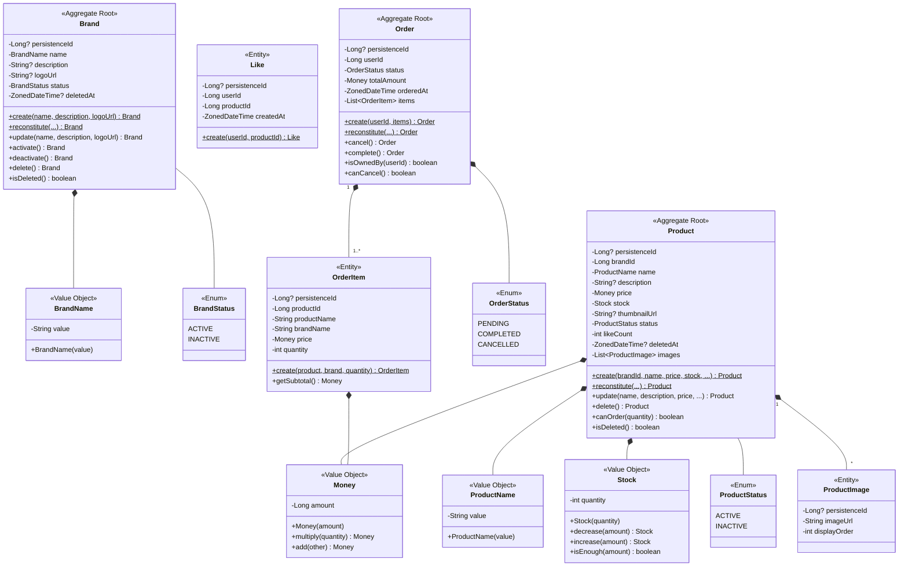

# 도메인 모델 설계

> 요구사항(01-requirements.md)의 규칙을,   
> 시퀀스 다이어그램(02-sequence-diagrams.md)의 흐름에 맞게 구조화한다.
> 
> 기존 User 도메인 패턴(private constructor + factory methods + immutable)을 따른다.

**전제**

- 도메인 객체는 JPA Entity가 아닌 순수 POJO다
- JPA Entity ↔ 도메인 POJO 변환은 Infrastructure 계층의 Mapper가 담당한다
- Aggregate 간 참조는 ID로만 한다 (직접 참조 X)
- `reconstitute()`는 Infrastructure 계층의 Mapper에서만 호출한다 (ArchUnit 강제)

---

## 설계 대원칙

### 계층 분리

```
┌─────────────────────────────────────────┐
│  Interfaces (Controller)                │  ← 요청/응답 변환
├─────────────────────────────────────────┤
│  Application (Service)                  │  ← 트랜잭션, 유스케이스 조합
├─────────────────────────────────────────┤
│  Domain (POJO)                          │  ← 비즈니스 규칙, 상태 변경
├─────────────────────────────────────────┤
│  Infrastructure (Repository Impl)       │  ← 영속성, 외부 시스템
└─────────────────────────────────────────┘
```

| 계층 | 책임 | 트랜잭션 |
|------|------|---------|
| Controller | 요청 수신, 응답 반환 | X |
| Application Service | 유스케이스 조합, 트랜잭션 경계 | O (시작/종료) |
| Domain | 비즈니스 규칙, 불변식 검증 | X (트랜잭션 모름) |
| Repository | 영속성 추상화 | X |

### 도메인 객체 패턴

기존 User 도메인에서 확립된 패턴을 따른다:

| 패턴 | 설명 |
|------|------|
| private constructor | 외부에서 직접 생성 불가. 팩토리 메서드만 사용 |
| `create()` | 새 객체 생성. `persistenceId = null` |
| `reconstitute()` | DB 복원. Infrastructure Mapper에서만 호출 |
| Immutable | 상태 변경 시 새 인스턴스 반환 |
| `persistenceId: Long?` | 저장 전 null, 저장 후 할당 |

### Aggregate 설계 기준

- Aggregate Root만 외부에서 참조 가능
- Aggregate 내부는 Root를 통해서만 접근
- Aggregate 간 참조는 ID로만 (직접 참조 X)

---

## 클래스 다이어그램



---

## 1. Brand (브랜드)

### Aggregate Root

#### 속성

| 속성 | 타입 | 설명 |
|------|------|------|
| persistenceId | Long? | 식별자 (저장 전 null, 저장 후 할당) |
| name | BrandName | 브랜드명 (unique) |
| description | String? | 브랜드 설명 |
| logoUrl | String? | 로고 이미지 URL |
| status | BrandStatus | 활성/비활성 상태 |
| deletedAt | ZonedDateTime? | 삭제 시점 (soft delete) |

#### 생성 메서드

| 메서드 | 설명 |
|--------|------|
| `create(name, description, logoUrl)` | 브랜드 생성 (ACTIVE 상태, persistenceId=null) |
| `reconstitute(...)` | DB 복원용 (Infrastructure Mapper에서만 호출) |

#### 행위

| 메서드 | 반환 | 설명 |
|--------|------|------|
| `update(name, description, logoUrl)` | Brand | 정보 수정 (새 인스턴스 반환) |
| `activate()` | Brand | ACTIVE로 변경 |
| `deactivate()` | Brand | INACTIVE로 변경 |
| `delete()` | Brand | deletedAt 설정 (soft delete) |
| `isDeleted()` | Boolean | 삭제 여부 확인 |

#### 불변식

- 삭제된 브랜드는 수정 불가
- 이름 중복 검사는 Application Service에서 수행 (Repository 조회 필요)

### BrandName (Value Object)

| 규칙 | 설명 |
|------|------|
| 빈 문자열 불가 | `value.isNotBlank()` |
| 100자 이내 | `value.length <= 100` |

---

## 2. Product (상품)

### Aggregate Root

#### 속성

| 속성 | 타입 | 설명 |
|------|------|------|
| persistenceId | Long? | 식별자 |
| brandId | Long | 브랜드 ID (ID 참조, 생성 시 설정, 변경 불가) |
| name | ProductName | 상품명 |
| description | String? | 상품 설명 |
| price | Money | 가격 |
| stock | Stock | 재고 |
| thumbnailUrl | String? | 대표 이미지 URL |
| status | ProductStatus | 상태 |
| likeCount | Int | 좋아요 수 (비정규화 필드, 0 이상) |
| deletedAt | ZonedDateTime? | 삭제 시점 |
| images | List\<ProductImage\> | 추가 이미지 목록 |

#### 생성 메서드

| 메서드 | 설명 |
|--------|------|
| `create(brandId, name, price, stock, ...)` | 상품 생성 (ACTIVE, likeCount=0, persistenceId=null) |
| `reconstitute(...)` | DB 복원용 (Infrastructure Mapper에서만 호출) |

#### 행위

| 메서드 | 반환 | 설명 |
|--------|------|------|
| `update(name, description, price, ...)` | Product | 정보 수정 (brandId 제외) |
| `delete()` | Product | soft delete |
| `canOrder(quantity)` | Boolean | 주문 가능 여부 (삭제 안 됨 + 재고 충분) |
| `isDeleted()` | Boolean | 삭제 여부 확인 |

#### 재고 차감/좋아요 카운트는 왜 도메인 메서드가 아닌가

재고 차감(`stock - ?`), 좋아요 카운트 증감(`like_count ± 1`)은 **도메인 객체의 메서드가 아니라 Repository의 원자적 UPDATE**로 처리한다.

- 재고 차감: `UPDATE SET stock = stock - ? WHERE stock >= ?` (DB 레벨 원자적 보장)
- 좋아요 증가: `UPDATE SET like_count = like_count + 1`
- 좋아요 감소: `UPDATE SET like_count = GREATEST(like_count - 1, 0)`

도메인 객체는 **검증**(`canOrder`)만 담당하고, 실제 변경은 Repository가 DB 레벨에서 원자적으로 수행한다.  

이유와 동시성 전략 상세는 [02-sequence-diagram-tech.md](02-sequence-diagram-tech.md) 참조.

#### 불변식

- brandId는 생성 시 설정, 변경 불가 (BR-P02)
- 재고가 0이어도 삭제되지 않으면 조회 가능 (BR-P04)
- likeCount는 0 미만 불가

### ProductName (Value Object)

| 규칙 | 설명 |
|------|------|
| 빈 문자열 불가 | `value.isNotBlank()` |
| 200자 이내 | `value.length <= 200` |

### Money (Value Object)

| 규칙 | 설명 |
|------|------|
| 0 이상 | `amount >= 0` |

| 메서드 | 설명 |
|--------|------|
| `multiply(quantity)` | 수량 곱하기 |
| `add(other)` | 금액 더하기 |

### Stock (Value Object)

| 규칙 | 설명 |
|------|------|
| 0 이상 | `quantity >= 0` |

| 메서드 | 설명 |
|--------|------|
| `decrease(amount)` | 차감 (부족 시 예외) |
| `increase(amount)` | 증가 |
| `isEnough(amount)` | 충분 여부 — `canOrder()`에서 사용 |

### ProductImage (Entity)

| 속성 | 타입 | 설명 |
|------|------|------|
| persistenceId | Long? | 식별자 |
| imageUrl | String | 이미지 URL |
| displayOrder | Int | 표시 순서 |

---

## 3. Like (좋아요)

### Entity

> Aggregate Root로 승격하지 않은 이유:
> - Like 자체에 복잡한 비즈니스 로직 없음
> - 독립적인 라이프사이클이지만 단순 저장/삭제
> - 멱등성은 Repository(insertIgnore)와 DB 유니크 제약으로 보장

#### 속성

| 속성 | 타입 | 설명 |
|------|------|------|
| persistenceId | Long? | 식별자 |
| userId | Long | 회원 ID |
| productId | Long | 상품 ID |
| createdAt | ZonedDateTime | 생성 시점 |

#### 생성 메서드

| 메서드 | 설명 |
|--------|------|
| `create(userId, productId)` | 좋아요 생성 |

#### 불변식

- (userId, productId) unique — DB 유니크 제약으로 보장
- soft delete 없음 (hard delete)

---

## 4. Order (주문)

### Aggregate Root

#### 속성

| 속성 | 타입 | 설명 |
|------|------|------|
| persistenceId | Long? | 식별자 |
| userId | Long | 회원 ID |
| status | OrderStatus | 주문 상태 |
| totalAmount | Money | 총 주문 금액 |
| orderedAt | ZonedDateTime | 주문 시점 |
| items | List\<OrderItem\> | 주문 항목 목록 (최소 1개) |

#### 생성 메서드

| 메서드 | 설명 |
|--------|------|
| `create(userId, items)` | 주문 생성 (PENDING, totalAmount 자동 계산, persistenceId=null) |
| `reconstitute(...)` | DB 복원용 (Infrastructure Mapper에서만 호출) |

#### 행위

| 메서드 | 반환 | 설명 |
|--------|------|------|
| `cancel()` | Order | 취소 (PENDING → CANCELLED). PENDING이 아니면 예외 |
| `complete()` | Order | 완료 (PENDING → COMPLETED). PENDING이 아니면 예외 |
| `isOwnedBy(userId)` | Boolean | 본인 주문 여부 확인 (BR-O07) |
| `canCancel()` | Boolean | 취소 가능 여부 (PENDING인지) |

#### 상태 전이 규칙

```
         ┌──────────────┐
         │   PENDING    │
         │  (결제 대기)  │
         └──────┬───────┘
                │
    ┌───────────┴───────────┐
    ▼                       ▼
┌──────────┐         ┌──────────┐
│COMPLETED │         │CANCELLED │
│(주문 완료) │         │ (취소됨)   │
└──────────┘         └──────────┘
```

#### 상태 전이 책임 분리

> 상태 전이 규칙은 도메인이 보호하고, 전이 시점은 ApplicationService가 결정한다.

| 책임 | 소유자 | 설명 |
|------|--------|------|
| 전이 규칙 | 도메인 (`cancel()`, `complete()`) | 현재 상태가 PENDING인지 검증. 위반 시 예외 |
| 전이 시점 | ApplicationService | 언제 `cancel()`/`complete()`를 호출할지 결정 |

**현재**: 주문 생성 직후 `complete()` 즉시 호출 (결제 없음)
**확장 시**: 결제 도입 시 별도 유스케이스(ConfirmPaymentUseCase)에서 `complete()` 호출. 도메인 코드 변경 없음

#### OrderStatus

| 값 | 의미 | 설명 |
|------|------|------|
| PENDING | 결제 대기 | 주문 생성 직후. 취소 가능 |
| COMPLETED | 주문 완료 | 결제 완료 (현재는 즉시 전이). 변경 불가 |
| CANCELLED | 취소됨 | 사용자 취소. 재고 복구됨 |

### OrderItem (Entity)

> Order 내부 Entity. Order를 통해서만 접근.
> 주문 시점의 상품/브랜드 정보를 스냅샷으로 보존한다 (BR-O03).

#### 속성

| 속성 | 타입 | 설명 |
|------|------|------|
| persistenceId | Long? | 식별자 |
| productId | Long | 상품 ID (참조용, 스냅샷) |
| productName | String | 주문 시점 상품명 (스냅샷) |
| brandName | String | 주문 시점 브랜드명 (스냅샷) |
| price | Money | 주문 시점 단가 (스냅샷) |
| quantity | Int | 주문 수량 |

#### 생성 메서드

| 메서드 | 설명 |
|--------|------|
| `create(product, brand, quantity)` | 스냅샷 생성 (상품/브랜드에서 이름, 가격 복사) |

#### 행위

| 메서드 | 설명 |
|--------|------|
| `getSubtotal()` | price × quantity |

---

## Repository 인터페이스

> 도메인 계층에 정의된 인터페이스.   
> 구현은 Infrastructure 계층.  
> 핵심 메서드는 [02-sequence-diagram-tech.md](02-sequence-diagram-tech.md)의 동시성 전략과 일치한다.

```kotlin
interface BrandRepository {
    fun findById(id: Long): Brand?
    fun findByName(name: BrandName): Brand?
    fun existsByName(name: BrandName): Boolean
    fun save(brand: Brand): Brand
    fun findAllActive(pageable: Pageable): Page<Brand>
}

interface ProductRepository {
    fun findById(id: Long): Product?
    fun findByIdForUpdate(id: Long): Product?       // SELECT ... FOR UPDATE
    fun findAllByBrandId(brandId: Long): List<Product>
    fun save(product: Product): Product
    fun decreaseStock(id: Long, quantity: Int): Int  // affected rows (0이면 재고 부족)
    fun increaseStock(id: Long, quantity: Int)       // 주문 취소 시 재고 복구
    fun incrementLikeCount(id: Long)
    fun decrementLikeCount(id: Long)                 // GREATEST(like_count - 1, 0)
    fun softDeleteByBrandId(brandId: Long)           // 연쇄 Soft Delete (BR-B02)
}

interface LikeRepository {
    fun insertIgnore(userId: Long, productId: Long): Boolean  // ON CONFLICT DO NOTHING
    fun deleteByUserIdAndProductId(userId: Long, productId: Long): Int  // affected rows
    fun findAllByUserId(userId: Long, pageable: Pageable): Page<Like>
}

interface OrderRepository {
    fun findById(id: Long): Order?
    fun findByIdForUpdate(id: Long): Order?          // SELECT ... FOR UPDATE
    fun save(order: Order): Order
    fun findAllByUserId(userId: Long, pageable: Pageable): Page<Order>
    fun findAll(pageable: Pageable): Page<Order>     // 어드민용
}
```

### Repository 핵심 메서드 매핑

| Repository | 메서드 | SQL 전략 | 비즈니스 예외 |
|------------|--------|---------|-------------|
| ProductRepository | `findByIdForUpdate(id)` | `SELECT ... FOR UPDATE` | `ProductNotFoundException` |
| ProductRepository | `decreaseStock(id, qty)` | `UPDATE SET stock = stock - ? WHERE stock >= ?` | `InsufficientStockException` |
| ProductRepository | `increaseStock(id, qty)` | `UPDATE SET stock = stock + ?` | - |
| ProductRepository | `incrementLikeCount(id)` | `UPDATE SET like_count = like_count + 1` | - |
| ProductRepository | `decrementLikeCount(id)` | `UPDATE SET like_count = GREATEST(like_count - 1, 0)` | - |
| LikeRepository | `insertIgnore(userId, productId)` | `INSERT ... ON CONFLICT DO NOTHING` | - |
| LikeRepository | `deleteByUserIdAndProductId(...)` | `DELETE WHERE user_id = ? AND product_id = ?` | - |
| OrderRepository | `findByIdForUpdate(id)` | `SELECT ... FOR UPDATE` | `OrderNotFoundException` |

---

## Application Service 책임

> 트랜잭션 경계를 소유하고, 도메인 객체를 조합하여 유스케이스를 수행한다.
> 상태 전이 시점을 결정하되, 전이 규칙 자체는 도메인에 위임한다.

| AppService | 주요 책임 |
|------------|----------|
| BrandAppService | 브랜드 CRUD. 삭제 시 연쇄 Soft Delete 조율 (BR-B02) |
| ProductAppService | 상품 CRUD. 브랜드 존재 확인 (BR-P01) |
| LikeAppService | 좋아요 등록/취소. 상품 존재 확인 (BR-L04), 카운트 증감 조율 |
| OrderAppService | 주문 생성 (재고 차감→스냅샷→저장→complete), 주문 취소 (권한/상태 검증→cancel→재고 복구) |

---

## 설계 결정 및 트레이드오프

| 결정 | 이유 | 트레이드오프 |
|------|------|-------------|
| Aggregate 간 ID 참조 | 결합도 감소, 독립적 확장 | 조회 시 JOIN 필요 |
| Product에 likeCount 비정규화 | 목록 정렬 성능 (BR-P05) | 정합성 관리 필요 (원자적 UPDATE) |
| 재고 차감/카운트 증감을 Repository에서 처리 | DB 레벨 원자적 보장이 필요 | 도메인 객체가 이 로직을 직접 가지지 않음 |
| Order에 items 포함 | 함께 로드/저장 (하나의 Aggregate) | 주문항목 많으면 성능 이슈 (상품 수 제한 권장) |
| Like는 Aggregate Root 아님 | 단순 CRUD, 복잡한 규칙 없음 | 확장 시 재검토 필요 |
| Value Object 적극 사용 | 타입 안정성, 규칙 캡슐화 | 클래스 수 증가 |
| Immutable 도메인 객체 | 부수효과 방지, 테스트 용이 | 객체 재생성 비용 |

---

## 잠재 리스크

| 리스크 | 영향 | 대응 |
|--------|------|------|
| likeCount 정합성 | 집계 오류 가능 | 원자적 UPDATE + 정기 배치 검증 |
| Order.items 비대화 | 조회 성능 저하 | 주문당 상품 수 제한 (권장 20) |
| 브랜드 삭제 시 대량 Soft Delete | 락 경합 | 상품 수 많을 시 청크 처리 검토 |
