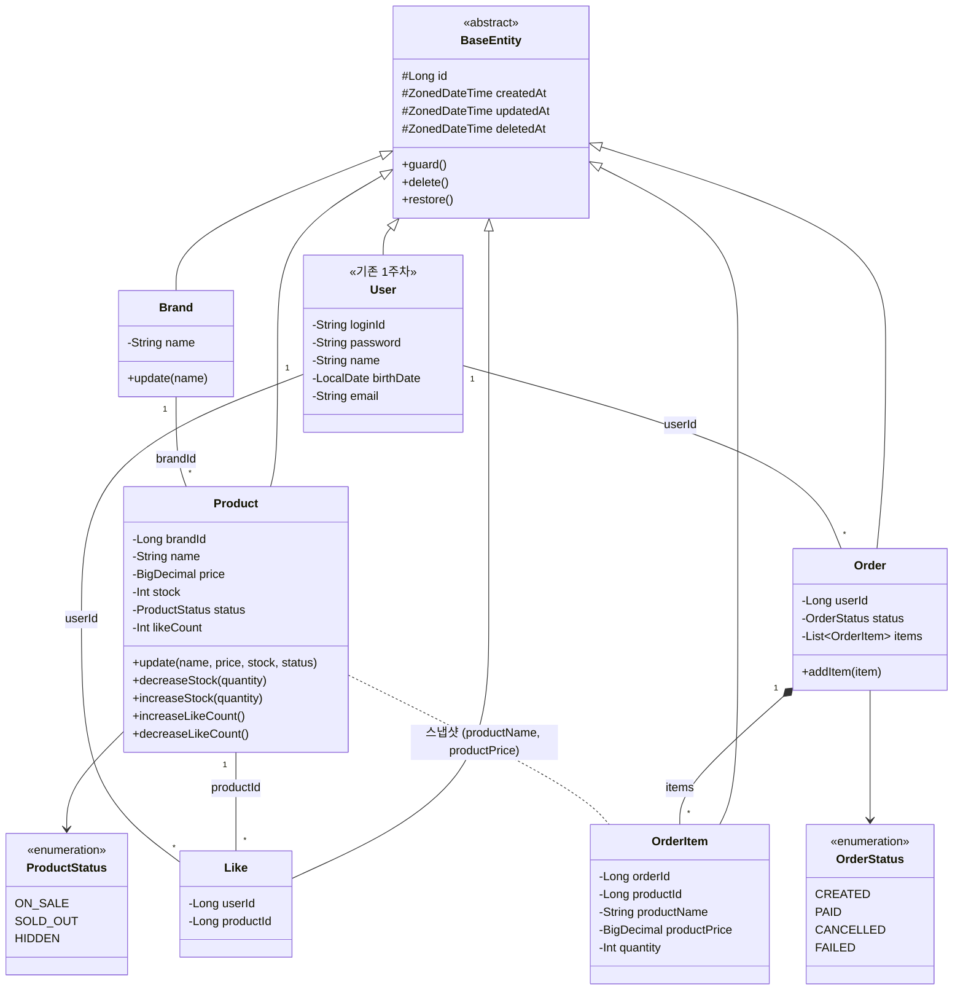
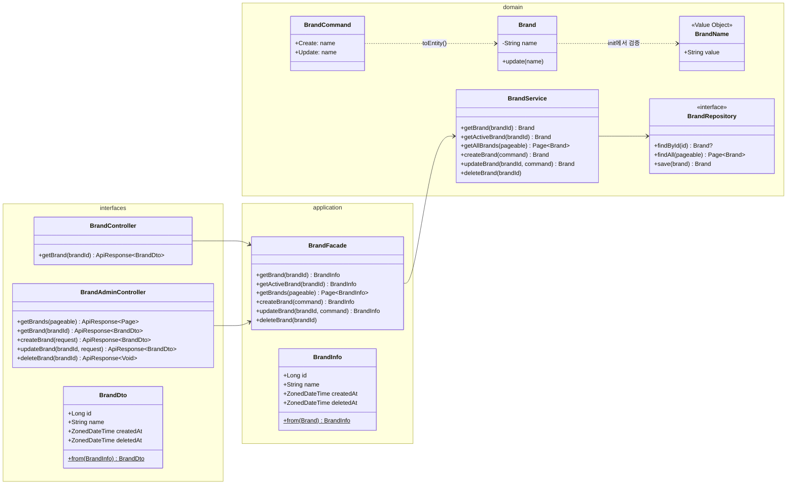
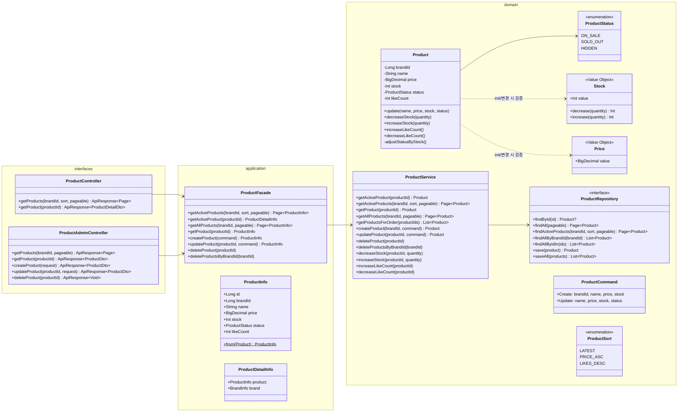
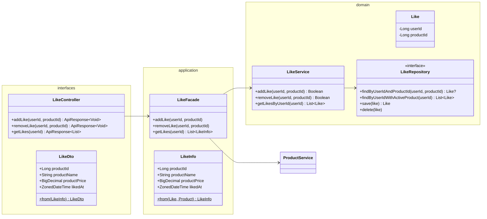
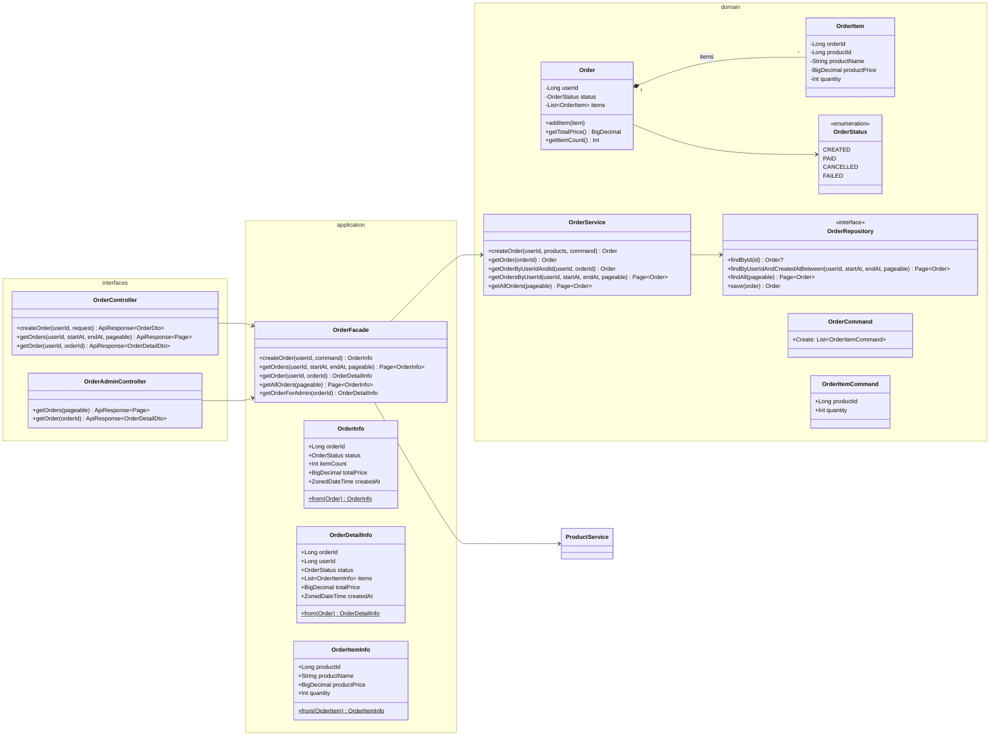
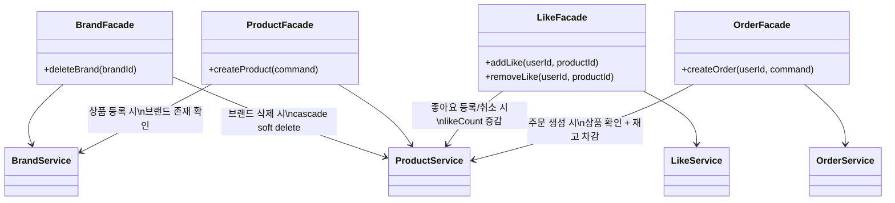

# 클래스 다이어그램

도메인 객체의 책임, 의존 방향, Entity/VO 구분을 Mermaid 클래스 다이어그램으로 정리한다.
구성 순서는 요구사항 명세(01-requirements.md)의 도메인 순서를 따른다.

---

## 1. 도메인 모델 전체 관계도

### 이 다이어그램이 필요한 이유

4개 도메인(Brand, Product, Like, Order)이 서로 어떻게 연결되는지, Entity와 VO의 경계가 어디인지를 한눈에 파악하기 위해서다.
시퀀스 다이어그램의 참여자들이 실제로 어떤 구조를 가지는지 검증하는 출발점이기도 하다.



### 읽는 법

- **실선 화살표(`--`)**: 참조 관계. `Brand "1" -- "*" Product`는 Product가 brandId로 Brand를 참조한다는 뜻이다. JPA `@ManyToOne`이 아닌 **ID 참조**로 구현한다.
- **합성(`*--`)**: Order가 OrderItem을 소유한다. Order 없이 OrderItem은 존재하지 않는다. JPA `@OneToMany(cascade = ALL)`로 구현.
- **점선(`..`)**: Product와 OrderItem은 직접 참조가 아닌 **스냅샷 복사** 관계다. OrderItem은 주문 시점의 productName, productPrice를 자체 필드로 보유한다.
- **User는 기존 1주차 도메인**이다. 이번 설계에서는 userId(Long)로만 참조하며, User 엔티티에 직접 의존하지 않는다.

---

## 2. Brand 도메인

### 이 다이어그램이 필요한 이유

Brand는 가장 단순한 도메인이지만, 삭제 시 Product로의 cascade soft delete 흐름이 있다.
레이어별 클래스 구성과 의존 방향을 확인한다.



### 읽는 법

- **BrandName VO**: Entity 필드는 `String name`으로 유지하되, 생성/수정 시점에 `BrandName(name)`으로 검증한다. VO는 영속화하지 않는다.
- **BrandFacade**: `deleteBrand()` 시 BrandService + ProductService를 조합하여 cascade soft delete를 오케스트레이션한다.
- **getActiveBrand vs getBrand**: 대고객 API는 `getActiveBrand`(삭제 상태 체크), 어드민은 `getBrand`(삭제 포함)을 사용한다.

---

## 3. Product 도메인

### 이 다이어그램이 필요한 이유

Product는 stock VO, status enum, likeCount 비정규화 등 가장 복잡한 도메인 로직을 가진다.
재고 차감 시 자동 상태 전환, 좋아요 수 증감 등 비즈니스 메서드의 책임을 확인한다.



### 읽는 법

- **adjustStatusByStock()**: private 메서드. `decreaseStock`/`increaseStock`/`update` 내부에서 호출되어 stock 값에 따라 status를 자동 전환한다. stock이 0이 되면 `SOLD_OUT`, 0에서 양수가 되면 `ON_SALE`. 단, 현재 status가 `HIDDEN`이면 전환하지 않는다.
- **Stock VO**: `decrease(quantity)` 시 결과가 음수면 `CoreException(BAD_REQUEST)` throw. `increase(quantity)` 시 결과를 반환.
- **Price VO**: 0 미만이면 `CoreException(BAD_REQUEST)` throw.
- **ProductSort enum**: 대고객 상품 목록 조회의 정렬 기준. Repository에서 동적 쿼리로 변환된다.
- **ProductDetailInfo**: 대고객 상품 상세 조회 시 Product + Brand 정보를 조합한 응답 객체. Facade에서 조립한다.

---

## 4. Like 도메인

### 이 다이어그램이 필요한 이유

Like는 userId + productId 쌍의 유일성과 멱등 등록/취소가 핵심이다.
Product.likeCount 비정규화와의 연동 흐름에서 Facade의 오케스트레이션 역할을 확인한다.



### 읽는 법

- **LikeService.addLike() 반환값 Boolean**: 실제로 새 좋아요가 생성되었으면 `true`, 이미 존재하여 early return이면 `false`. Facade는 이 반환값에 따라 `Product.likeCount` 증감 여부를 결정한다.
- **LikeFacade가 ProductService에 의존**: Like 등록/취소 시 Product의 `likeCount`를 증감해야 하므로 cross-domain 오케스트레이션이 Facade 레벨에서 일어난다.
- **Like 엔티티에는 비즈니스 메서드가 없다**: 생성과 삭제만 존재하는 단순 관계 엔티티다.
- **findByUserIdWithActiveProduct**: 좋아요 목록 조회 시 Product JOIN + `deletedAt IS NULL` 필터가 필요하므로, Repository에서 조인 쿼리를 제공한다.

---

## 5. Order 도메인

### 이 다이어그램이 필요한 이유

Order는 OrderItem과의 합성 관계, 상품 스냅샷 저장, 재고 차감 오케스트레이션 등 가장 복잡한 흐름을 가진다.
Facade에서의 트랜잭션 내 다중 서비스 호출 구조와 OrderItem의 스냅샷 책임을 확인한다.



### 읽는 법

- **Order *-- OrderItem (합성)**: OrderItem은 Order 없이 존재할 수 없다. JPA에서 `@OneToMany(cascade = ALL, orphanRemoval = true)`로 구현한다.
- **OrderFacade가 ProductService에 의존**: 주문 생성 시 상품 존재/판매 가능 확인 + 재고 차감을 ProductService에 위임한다. 이 과정이 하나의 `@Transactional` 안에서 실행된다.
- **OrderItem의 스냅샷 필드**: `productName`, `productPrice`는 주문 시점의 Product 정보를 복사한 값이다. Product가 나중에 수정/삭제되어도 주문 내역에는 영향 없다.
- **getTotalPrice()**: items의 `productPrice * quantity`를 합산하여 계산한다. 별도 필드로 저장하지 않고 매번 계산한다.
- **대고객 vs 어드민 주문 상세 조회**: 대고객은 `getOrder(userId, orderId)`로 본인 주문만, 어드민은 `getOrderForAdmin(orderId)`로 userId 체크 없이 조회한다.

---

## 6. 도메인 간 의존 관계

### 이 다이어그램이 필요한 이유

Facade 레이어에서 도메인 간 협력이 발생한다.
어떤 Facade가 어떤 Service에 의존하는지 정리하여, 결합도와 트랜잭션 경계를 확인한다.



### 읽는 법

- **ProductService가 가장 많이 참조된다**: Brand, Like, Order 도메인 모두 ProductService에 의존한다. Product가 이 시스템의 핵심 도메인임을 보여준다.
- **Service 간 직접 의존은 없다**: 모든 cross-domain 협력은 Facade 레벨에서 일어난다. Service는 자신의 Repository만 의존한다.
- **트랜잭션 경계**: Facade 메서드가 `@Transactional`을 선언하여, 여러 Service 호출이 하나의 트랜잭션으로 묶인다.

---

## 7. 인증 레이어

### 이 다이어그램이 필요한 이유

기존 AuthInterceptor 확장과 신규 AdminInterceptor의 역할을 정리한다.

```mermaid
classDiagram
    direction LR

    class AuthInterceptor {
        <<기존 확장>>
        -AuthService authService
        +preHandle(request, response, handler) Boolean
    }

    class AdminInterceptor {
        <<신규>>
        +preHandle(request, response, handler) Boolean
    }

    class AuthService {
        <<기존>>
        +authenticate(loginId, password) User
    }

    class WebMvcConfig {
        +addInterceptors(registry)
    }

    WebMvcConfig --> AuthInterceptor
    WebMvcConfig --> AdminInterceptor
    AuthInterceptor --> AuthService
    AdminInterceptor ..> "X-Loopers-Ldap" : 헤더 값 비교
```

### 읽는 법

- **AuthInterceptor**: 기존 User 인증. 적용 경로 확장: `/api/v1/users/**`, `/api/v1/products/*/likes`, `/api/v1/users/*/likes`, `/api/v1/orders/**`
- **AdminInterceptor**: 신규. `X-Loopers-Ldap: loopers.admin` 헤더 값을 단순 비교. 불일치 시 401.
- **AdminInterceptor는 AuthService에 의존하지 않는다**: LDAP 인증은 헤더 값 비교만으로 충분하다.

---

## 8. Value Object 정리

| VO | 소속 도메인 | 검증 규칙 | 사용 시점 |
|------|---------|--------|--------|
| BrandName | Brand | 빈 값 불가 | Brand 생성/수정 시 init에서 검증 |
| Price | Product | BigDecimal >= 0 | Product 생성/수정 시 init에서 검증 |
| Stock | Product | Int >= 0, decrease 시 부족 확인 | Product 생성/수정/재고차감 시 검증 |
| ProductSort | Product | LATEST, PRICE_ASC, LIKES_DESC만 허용 | 대고객 상품 목록 조회 시 |

> VO는 Entity 필드로 저장되지 않는다. 기존 User 도메인과 동일하게 Entity 필드는 기본 타입(String, BigDecimal, Int)을 유지하되, 생성/변경 시점에 VO를 통해 검증한다.

---

## 9. 시퀀스 다이어그램과의 정합성

| 시퀀스 참여자 | 클래스 다이어그램 위치 | 섹션 |
|-----------|--------------|------|
| BrandController / BrandAdminController | 2. Brand 도메인 | interfaces |
| BrandFacade / BrandService / BrandRepository | 2. Brand 도메인 | application / domain |
| ProductController / ProductAdminController | 3. Product 도메인 | interfaces |
| ProductFacade / ProductService / ProductRepository | 3. Product 도메인 | application / domain |
| LikeController | 4. Like 도메인 | interfaces |
| LikeFacade / LikeService / LikeRepository | 4. Like 도메인 | application / domain |
| OrderController / OrderAdminController | 5. Order 도메인 | interfaces |
| OrderFacade / OrderService / OrderRepository | 5. Order 도메인 | application / domain |
| AuthInterceptor / AdminInterceptor | 7. 인증 레이어 | interfaces/interceptor |

모든 시퀀스 다이어그램의 참여자가 클래스 다이어그램에 정의되어 있다.

---

## 10. 설계 포인트

1. **ID 참조 vs 객체 참조**: 도메인 간 관계는 모두 ID(Long)로 참조한다. JPA `@ManyToOne`을 사용하지 않아 도메인 간 결합을 최소화한다. 유일한 예외는 Order-OrderItem 합성 관계다.

2. **Facade의 역할**: 단일 도메인 내 조회는 Service를 바로 호출하지만, 도메인 간 협력(브랜드 삭제 cascade, 주문 시 재고 차감, 좋아요 시 likeCount 증감)은 반드시 Facade에서 오케스트레이션한다.

3. **Product의 비대함**: stock, status, likeCount가 모두 Product 엔티티에 있어 책임이 많다. 현재 스코프에서는 허용 가능하며, 트래픽 증가 시 Stock 분리(설계 결정 #3), likeCount Redis 캐싱(설계 결정 #4)으로 개선할 수 있다.
