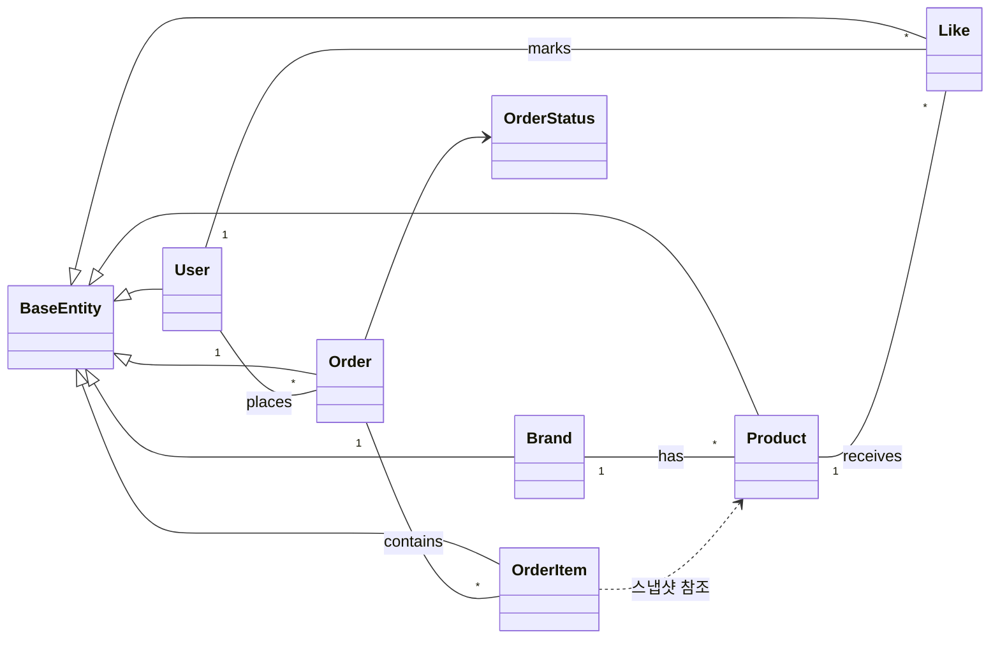
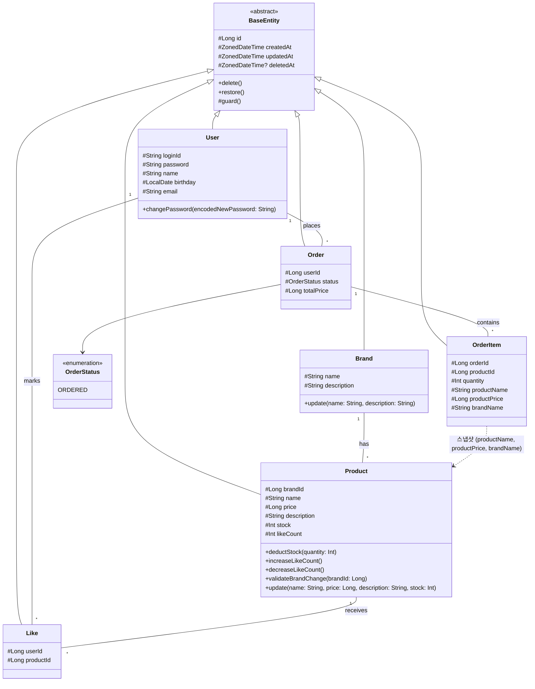

# 클래스 다이어그램: 도메인 모델

> **왜 필요한가?** 각 도메인의 **책임 범위와 의존 방향**을 확인하기 위해서다. 특히 Order-Product 간의 관계에서 스냅샷이 어떻게 분리되는지가 핵심이다.

---

## 1. 전체 도메인 관계도

> 엔티티 간 관계와 의존 방향만 표현한다. "어떤 도메인이 어떤 도메인을 알고 있는가?"를 한눈에 파악하기 위한 용도다.



**봐야 할 포인트:**
- **모든 관계는 ID 기반 단방향이다.** 객체 참조가 아닌 `brandId`, `userId`, `productId` 등 FK로 연결한다. 양방향 매핑은 사용하지 않는다.
- **OrderItem → Product는 점선(의존)이다.** 주문 시점에 스냅샷을 복사하므로, 런타임에는 Product를 참조하지 않는다.
- **User는 Order와 Like를 통해 간접적으로 Product와 연결된다.** User → Product 직접 의존은 없다.

---

## 2. 도메인 모델 상세

> 각 엔티티의 필드, 도메인 메서드, 검증 책임을 포함한 전체 클래스 다이어그램이다.



**봐야 할 포인트:**
- **Product에 도메인 메서드가 집중되어 있다.** 재고 관리(`deductStock`), 좋아요 카운트(`increase/decreaseLikeCount`), 수정 검증(`validateBrandChange`), 상태 변경(`update`). 이는 Product가 가장 많은 비즈니스 규칙을 가진 엔티티이기 때문이다.
- **OrderItem은 Product를 FK로 참조하되, 스냅샷 필드(productName, productPrice, brandName)를 별도로 저장한다.** Product가 변경/삭제되어도 주문 이력은 보존된다.
- **Like는 userId + productId의 조합으로 유일성을 가진다.** (유니크 제약)
- **Product가 stock과 likeCount를 직접 관리한다.** 비정규화된 필드이므로, 정합성 관리가 중요하다.

## 3. 엔티티별 책임 분석

> "한 객체에 책임이 몰리지 않았는가?" 점검한다.

### 3.1 책임 분포

| 엔티티 | 상태 관리 | 도메인 검증 | 비즈니스 행위 | 책임 수 |
|--------|----------|------------|-------------|--------|
| **User** | loginId, password, name, birthday, email | LoginId/Email 형식 검증 (init) | 비밀번호 변경 | 3 |
| **Brand** | name, description | — | 정보 수정 | 2 |
| **Product** | name, price, description, stock, likeCount | brandId 변경 불가 | 재고 차감, 좋아요 증감, 정보 수정 | 5 |
| **Like** | userId, productId | — | — | 1 |
| **Order** | userId, status, totalPrice | — | — | 1 |
| **OrderItem** | 스냅샷 필드 | — | — | 1 |

### 3.2 Product에 책임이 몰리는 이유와 판단

Product는 5개의 책임을 가지고 있어 가장 무겁다. 하지만 이는 **의도된 설계**다:

- **재고(`stock`)와 좋아요 수(`likeCount`)는 Product의 비정규화 필드다.** 별도 엔티티로 분리하면 조회 성능이 떨어지고, 현재 요구사항에서는 과도한 분리다.
- **`validateBrandChange()`는 Product 엔티티의 불변 규칙이다.** 브랜드 변경 불가 제약은 Product가 스스로 지켜야 할 규칙이므로 엔티티에 위치하는 것이 자연스럽다.
- **`update()`는 엔티티의 상태 변경 메서드다.** `protected set`으로 제한된 필드를 변경하는 유일한 경로다.

분리를 고려해야 하는 시점:
- 재고 관리가 복잡해지면 (예약 재고, 입고/출고 이력) → `Stock` 엔티티 분리
- 좋아요 집계가 별도 요구사항을 가지면 → `ProductStats` 분리

### 3.3 Like와 OrderItem이 가벼운 이유

- **Like는 관계 자체가 값이다.** "누가 어떤 상품을 좋아요했는가"만 저장한다. 멱등 판단 로직은 `LikeService`에 있고, 카운트 관리는 `Product`에 있다.
- **OrderItem은 스냅샷 저장소다.** 주문 시점의 상품 정보를 보존하는 것이 유일한 역할이다. 행위가 없는 것이 정상이다.

---

## 4. 설계 결정 사항

### 4.1 연관 관계: ID 참조 vs 객체 참조

```
// ID 참조 (현재 선택)
class Product {
    #Long brandId        // Brand의 ID만 저장
}

// 객체 참조 (선택하지 않음)
class Product {
    #Brand brand         // @ManyToOne 직접 참조
}
```

**ID 참조를 선택한 이유:**
- 양방향 매핑에 의한 순환 참조 위험을 제거한다
- 도메인 간 결합도를 낮춘다 (Product가 Brand 엔티티를 알 필요 없음)
- Facade 레벨에서 필요 시 조합하면 충분하다 (시퀀스 다이어그램 참고)
- 지연 로딩(N+1) 문제를 원천 차단한다

### 4.2 스냅샷 vs FK 참조 (OrderItem)

| 방식 | 장점 | 단점 |
|------|------|------|
| **스냅샷 (현재)** | 상품 변경/삭제에 독립적, 주문 이력 보존 | 데이터 중복 |
| FK + JOIN | 정규화, 중복 없음 | 상품 삭제 시 주문 이력 깨짐 |

요구사항에 "주문 시점의 상품 정보가 스냅샷으로 저장되어야 한다"고 명시되어 있으므로, 스냅샷 방식이 필수다.

### 4.3 비정규화 필드 (stock, likeCount)

| 필드 | 정규화 대안 | 비정규화 선택 이유 |
|------|-----------|-------------------|
| `stock` | Stock 엔티티 분리 | 현재 요구사항은 단순 차감만. 별도 엔티티는 과잉 설계 |
| `likeCount` | `SELECT COUNT(*)` 집계 | `likes_desc` 정렬 시 매번 집계하면 성능 문제. 비정규화로 정렬 성능 확보 |

동시성 문제 (lost update)는 요구사항에 따라 "기능 구현 후 별도 단계에서 해결"한다.
