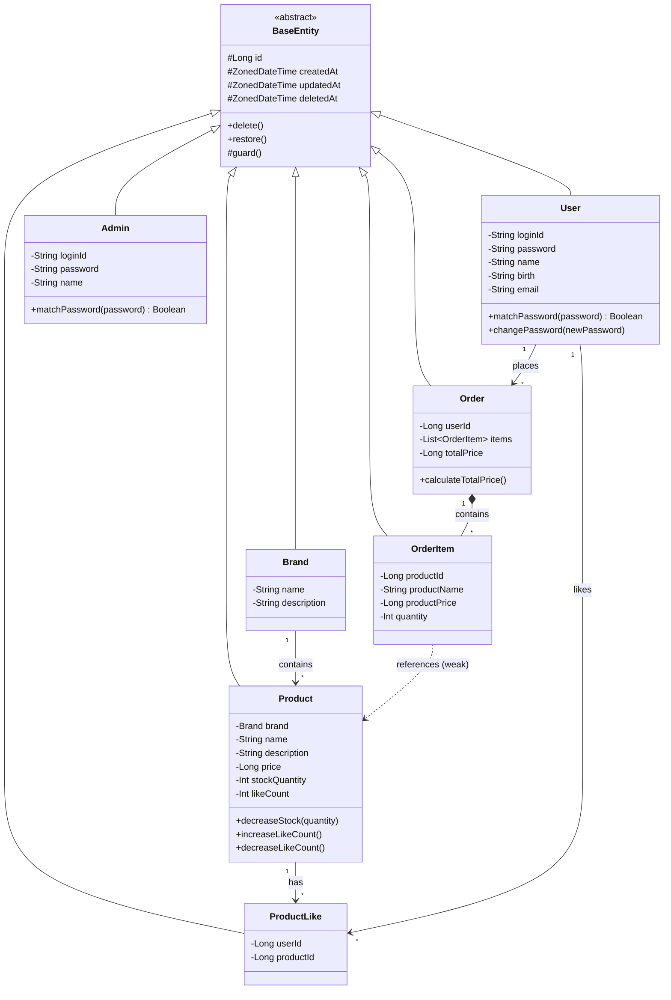

# 클래스 다이어그램 (도메인 계층)

**왜 필요한가**: 도메인 간 의존 방향과 책임 경계를 확인하기 위함입니다. 특히 Order가 Product를 직접 참조하지 않고 스냅샷만 가지는 구조가 핵심입니다.

**해석 포인트**:
- 모든 엔티티가 `BaseEntity`를 상속 → `id`, `createdAt`, `updatedAt`, `deletedAt`, `delete()`, `restore()` 공통 제공
- `Order` → `OrderItem`은 Composition (Order 삭제 시 함께 삭제)
- `OrderItem` → `Product`는 점선(약한 참조) → productId만 보관, 실제 객체 참조 아님
- `Product.decreaseStock()`은 재고 차감 책임을 가짐 → 재고 부족 시 예외 발생
