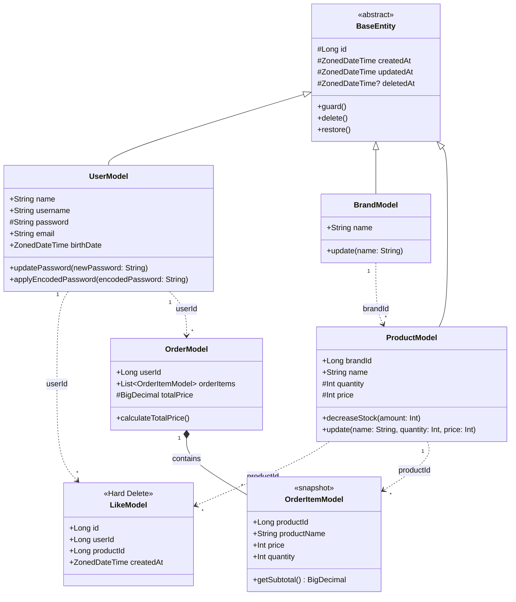

# 클래스 다이어그램

## 설계 원칙

| 원칙 | 적용                                | 근거                                                                 |
|------|-----------------------------------|--------------------------------------------------------------------|
| **삭제 전략** | Soft Delete 기본, Like만 Hard Delete | Like는 Row explosion 우려. 연관관계 많은 도메인(Brand, Product)은 Soft Delete 유리 |
| **FK 미사용** | 도메인 간 연관은 ID 참조                   | 데드락, 마이그레이션, 성능. 앱 레벨 정합성 관리                                       |
| **바운디드 컨텍스트** | 타 도메인 엔티티 직접 참조 금지, ID로 참조        | 같은 이름이라도 맥락에 따라 다른 개념일 수 있음                                        |
| **도메인 비즈니스** | 엔티티 메서드 = 변하지 않는 본질적 행위           | 재고 차감, 비밀번호 규칙, 총액 계산 등                                            |
| **어플리케이션 비즈니스** | 서비스에서 오케스트레이션                     | 재고 검증, 중복 확인, 인증 — 서비스마다 다를 수 있음                                   |
| **주문 = 계약서** | 주문 항목에 상품 스냅샷 저장                  | 주문의 본질은 계약서 작성. 가격/이름은 시점 보존                                       |

## 도메인 비즈니스 vs 어플리케이션 비즈니스

| 도메인 | 도메인 비즈니스 (엔티티 메서드) | 어플리케이션 비즈니스 (서비스 오케스트레이션) |
|--------|------------------------------|---------------------------------------------|
| **User** | 비밀번호 유효성, 비밀번호 변경 | username 중복 확인, BCrypt 암호화 |
| **Brand** | 브랜드 정보 수정 | — |
| **Product** | 재고 차감/증가, 상품 정보 수정 | 브랜드 존재 확인, 브랜드 변경 불가 검증 |
| **Like** | — | 상품 존재 확인, 중복 좋아요 확인 |
| **Order** | 총액 계산, 스냅샷 구성 | 재고 확인/차감, 상품 존재 확인 |

## 도메인 모델

