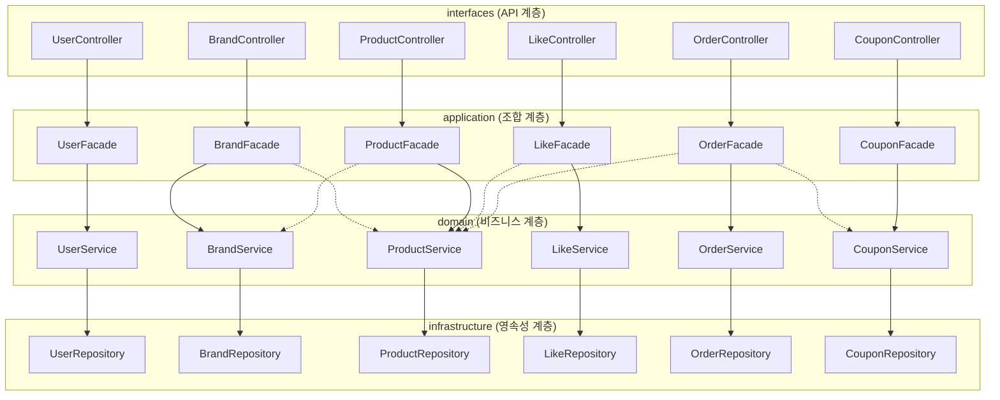
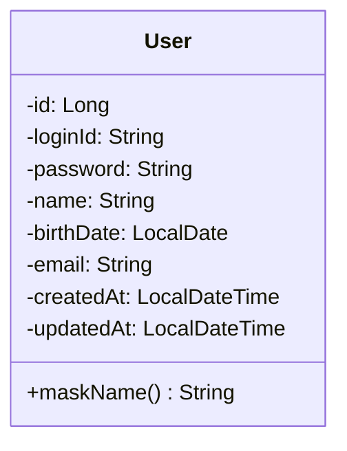
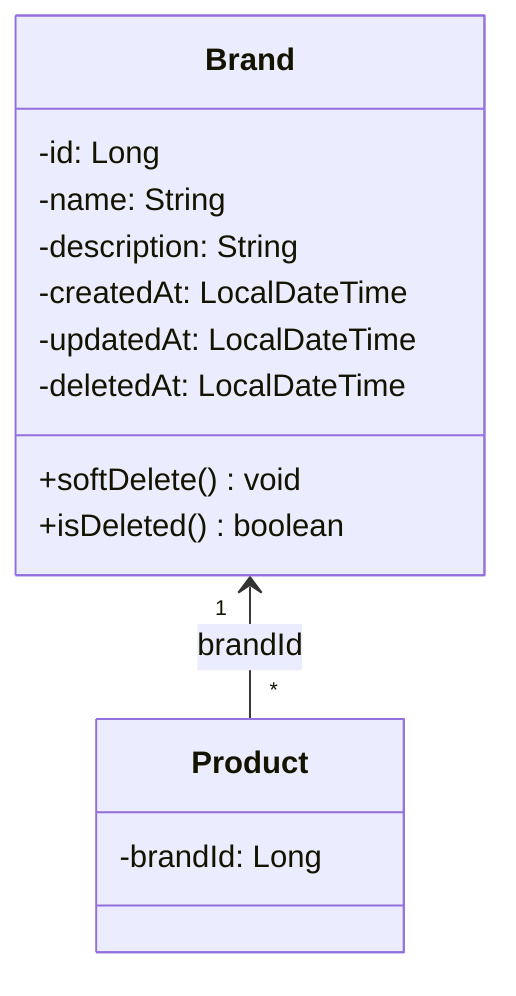
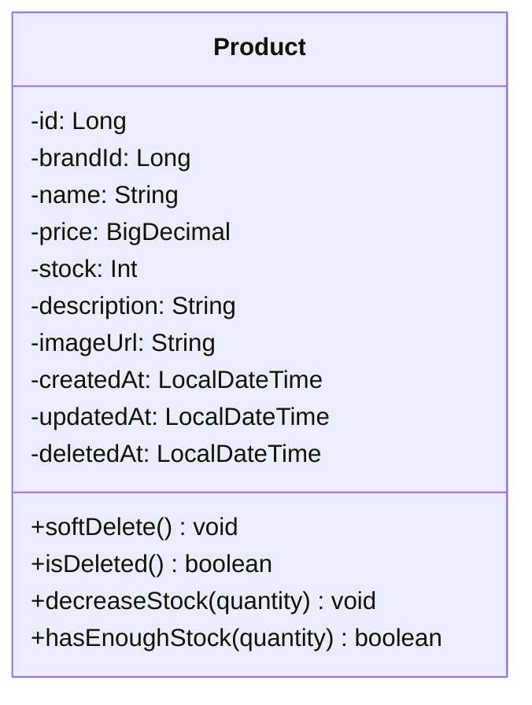
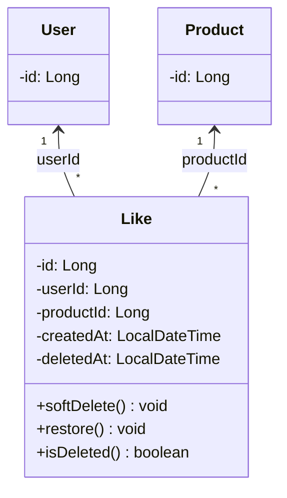
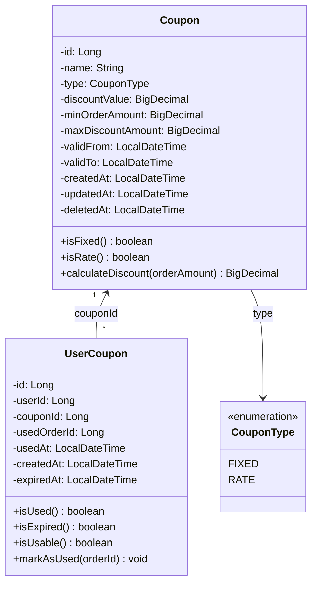
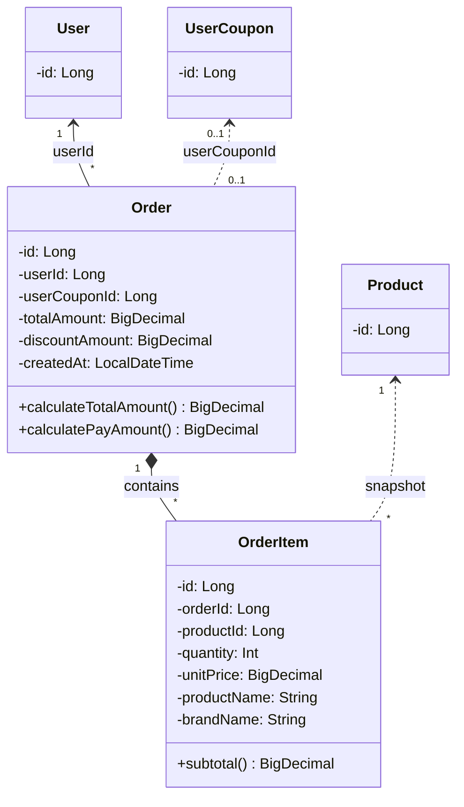

# 클래스 다이어그램

> 목적: 레이어 간 의존 방향, 도메인 클래스 구조, 클래스 간 관계 확인

---

## 목차

1. [레이어 아키텍처 전체 구조](#1-레이어-아키텍처-전체-구조)
2. [도메인 클래스 다이어그램](#2-도메인-클래스-다이어그램)

---

## 1. 레이어 아키텍처 전체 구조

### 다이어그램 목적
- 4개 레이어의 역할과 단방향 의존 확인
- 각 레이어가 무엇을 알고, 무엇을 모르는지 명확화



> CouponController/Facade는 향후 쿠폰 API 개발 시 사용. 현재는 OrderFacade → CouponService 의존만 활성

### 핵심 포인트

| 레이어 | 역할 | 알아야 하는 것 | 몰라야 하는 것 |
|--------|------|---------------|---------------|
| **Controller** | 요청/응답 처리, DTO 변환 | Facade | Service, Repository, Entity |
| **Facade** | 도메인 간 조합, 트랜잭션 경계 | 여러 Service | Repository, DB |
| **Service** | 단일 도메인 로직 | 자기 Repository, Entity | 다른 Service |
| **Repository** | 영속성 처리 | Entity, DB | 비즈니스 로직 |

### 의존 방향 규칙

```
Controller → Facade → Service → Repository
     ↓           ↓         ↓          ↓
   (DTO)    (여러 Service) (Entity)   (DB)

※ 화살표 반대 방향 의존 금지
※ 같은 레이어 내 의존 금지 (Service → Service 금지)
```

---

## 2. 도메인 클래스 다이어그램

### 다이어그램 목적
- 도메인 Entity 간 관계와 책임 확인
- Soft Delete, 스냅샷 등 도메인 행위 명시

### 2.1 User



| 메서드 | 책임 |
|--------|------|
| `maskName()` | 이름 마스킹 (홍길동 → 홍길*) |

---

### 2.2 Brand



| 메서드 | 책임 |
|--------|------|
| `softDelete()` | deletedAt 설정 |
| `isDeleted()` | 삭제 여부 확인 |

---

### 2.3 Product



| 메서드 | 책임 |
|--------|------|
| `decreaseStock()` | 재고 차감 (stock >= 0 보장) |
| `hasEnoughStock()` | 재고 충분 여부 확인 |
| `softDelete()` | deletedAt 설정 |

---

### 2.4 Like



| 메서드 | 책임 |
|--------|------|
| `softDelete()` | deletedAt 설정 |
| `restore()` | deletedAt = null (멱등성 복원) |

---

### 2.5 Coupon / UserCoupon

> 쿠폰 API는 향후 개발이나, 주문 흐름에서 참조하므로 Entity 구조를 미리 정의



| 메서드 | 책임 |
|--------|------|
| `calculateDiscount()` | FIXED: 고정 금액 반환, RATE: 주문금액 × 할인율 (상한 적용) |
| `isUsable()` | 미사용 + 미만료 여부 확인 |
| `markAsUsed()` | usedAt, usedOrderId 설정 |

---

### 2.6 Order / OrderItem



| 클래스 | 필드 | 설명 |
|--------|------|------|
| **Order** | userCouponId, discountAmount | 쿠폰 적용 정보 (null이면 미적용) |
| **OrderItem** | unitPrice, productName, brandName | 주문 시점 스냅샷 |

| 메서드 | 책임 |
|--------|------|
| `calculateTotalAmount()` | 주문 총액 계산 (할인 전) |
| `calculatePayAmount()` | 실결제 금액 (totalAmount - discountAmount) |
| `subtotal()` | 항목별 소계 (unitPrice × quantity) |

### 관계 표기 설명
- `<--` : ID 참조 (느슨한 결합)
- `*--` : 컴포지션 (생명주기 동일, Aggregate)
- `<..` : 점선 = 스냅샷 참조 (실시간 참조 아님)

---

## 설계 원칙 요약

| 원칙 | 적용 |
|------|------|
| **Soft Delete** | Entity 메서드로 캡슐화 (`softDelete()`, `isDeleted()`) |
| **도메인 불변식** | Entity 내부에서 보장 (`decreaseStock()` → stock >= 0) |
| **ID 참조** | 도메인 간 엔티티는 ID로만 참조 |
| **스냅샷** | OrderItem에 주문 시점 상품 정보 복사 |
| **쿠폰 할인** | Order에 discountAmount로 기록, Coupon Entity에서 할인 계산 캡슐화 |
| **느슨한 결합** | OrderFacade → CouponService (Facade에서 조합, Service 간 직접 참조 없음) |
