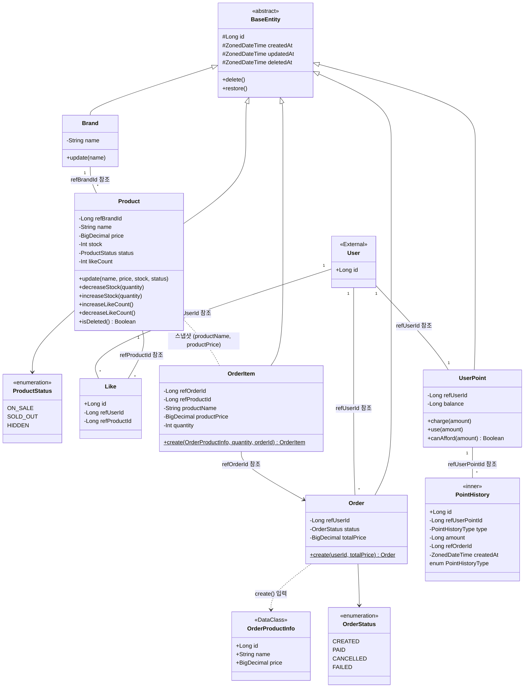
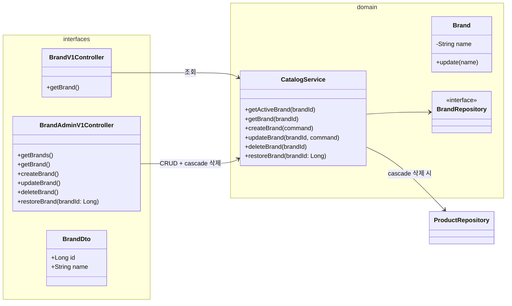
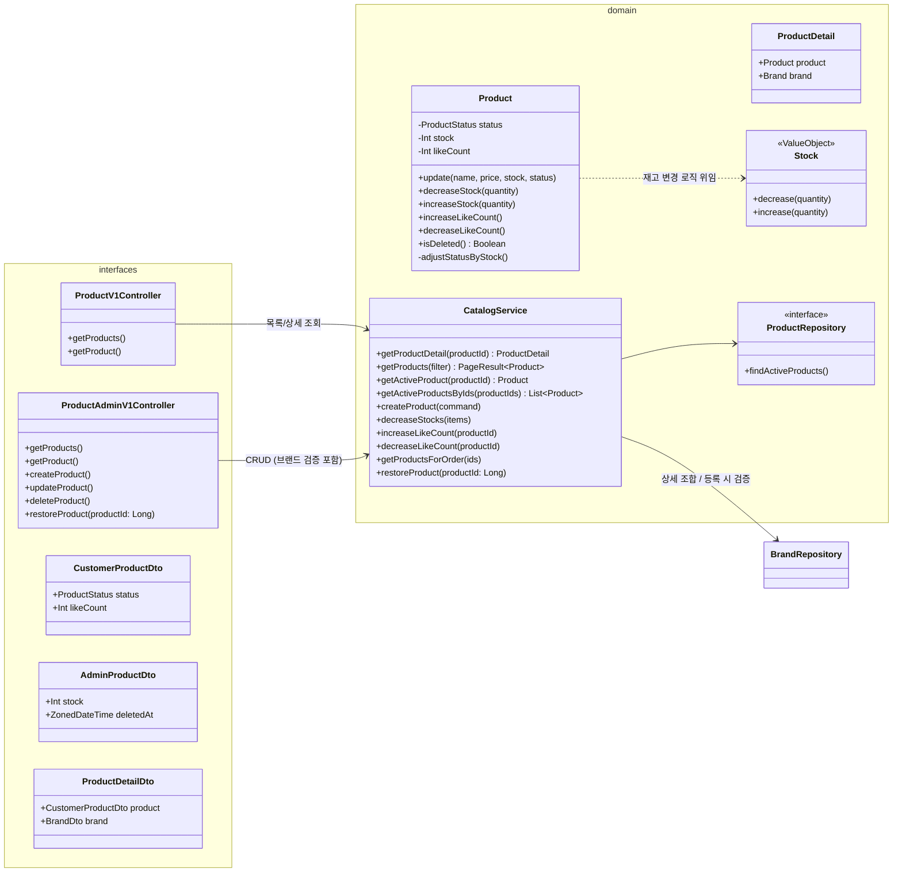
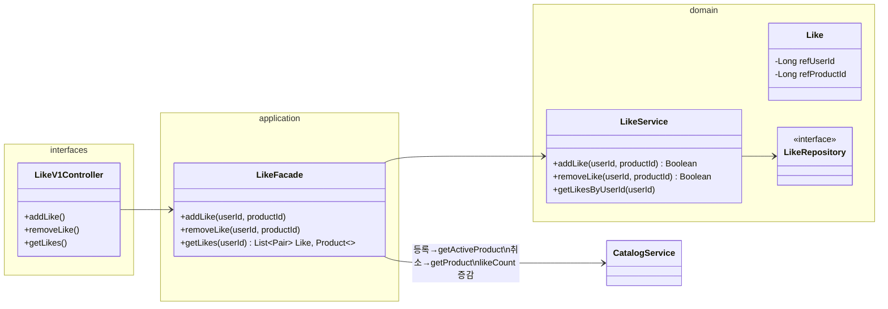
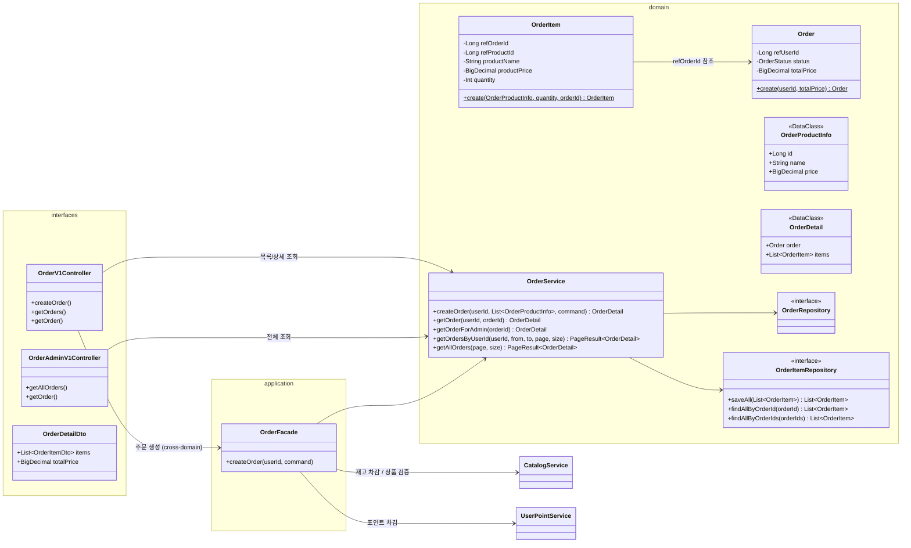
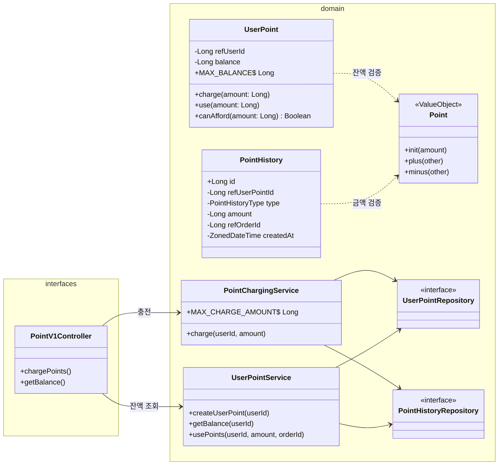
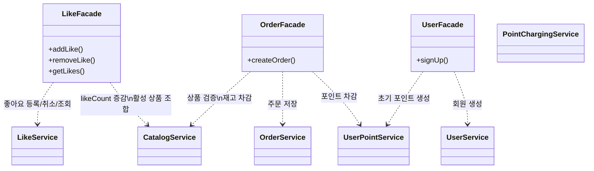
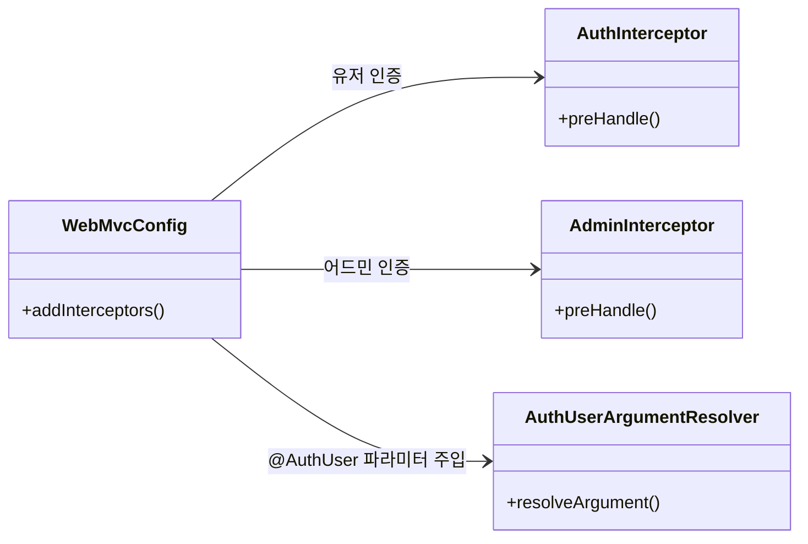

# 클래스 다이어그램

도메인 객체의 책임, 의존 방향, Entity/VO 구분을 Mermaid 클래스 다이어그램으로 정리한다.
**단순 Getter/Setter와 모든 필드 나열은 생략**하고, 핵심 비즈니스 로직과 아키텍처 구조 위주로 기술한다.

---

## 1. 도메인 모델 전체 관계도 (Entity Relationship)

시스템의 뼈대가 되는 4개 도메인(Brand, Product, Like, Order)의 엔티티 간 관계와 참조 방식을 정의한다.

```mermaid
classDiagram
    direction TB

    class BaseEntity {
        <<abstract>>
        #Long id
        #ZonedDateTime createdAt
        #ZonedDateTime updatedAt
        #ZonedDateTime deletedAt
        +delete()
        +restore()
    }

    class Brand {
        -String name
        +update(name)
    }

    class Product {
        -Long refBrandId
        -String name
        -BigDecimal price
        -Int stock
        -ProductStatus status
        -Int likeCount
        +update(name, price, stock, status)
        +decreaseStock(quantity)
        +increaseStock(quantity)
        +increaseLikeCount()
        +decreaseLikeCount()
        +isDeleted() Boolean
    }

    class ProductStatus {
        <<enumeration>>
        ON_SALE
        SOLD_OUT
        HIDDEN
    }

    class Like {
        +Long id
        -Long refUserId
        -Long refProductId
    }

    class Order {
        -Long refUserId
        -OrderStatus status
        -BigDecimal totalPrice
        +create(userId, totalPrice)$ Order
    }

    class OrderProductInfo {
        <<DataClass>>
        +Long id
        +String name
        +BigDecimal price
    }

    class OrderItem {
        -Long refOrderId
        -Long refProductId
        -String productName
        -BigDecimal productPrice
        -Int quantity
        +create(OrderProductInfo, quantity, orderId)$ OrderItem
    }

    class OrderStatus {
        <<enumeration>>
        CREATED
        PAID
        CANCELLED
        FAILED
    }

    class UserPoint {
        -Long refUserId
        -Long balance
        +charge(amount)
        +use(amount)
        +canAfford(amount) Boolean
    }

    class PointHistory {
        +Long id
        -Long refUserPointId
        -PointHistoryType type
        -Long amount
        -Long refOrderId
        -ZonedDateTime createdAt
        <<inner>>
        enum PointHistoryType
    }

    class User {
        <<External>>
        +Long id
    }

    BaseEntity <|-- Brand
    BaseEntity <|-- Product
    BaseEntity <|-- Order
    BaseEntity <|-- OrderItem
    BaseEntity <|-- UserPoint
    Brand "1" -- "*" Product: refBrandId 참조
    Product "1" -- "*" Like: refProductId 참조
    User "1" -- "*" Like: refUserId 참조
    User "1" -- "*" Order: refUserId 참조
    User "1" -- "1" UserPoint: refUserId 참조
    UserPoint "1" -- "*" PointHistory: refUserPointId 참조
    OrderItem --> Order: refOrderId 참조
    Order ..> OrderProductInfo: create() 입력
    Product .. OrderItem: 스냅샷 (productName, productPrice)
    Product --> ProductStatus
    Order --> OrderStatus
```

---

## 2. Brand 도메인

Brand는 단순하지만, **삭제 시 Product로의 전파(Cascade)** 가 중요한 도메인이다.
어드민(Admin)과 사용자(User)의 진입점이 분리되어 있다.

```mermaid
classDiagram
    direction LR

    namespace interfaces {
        class BrandV1Controller {
            +getBrand()
        }
        class BrandAdminV1Controller {
            +getBrands()
            +getBrand()
            +createBrand()
            +updateBrand()
            +deleteBrand()
            +restoreBrand(brandId: Long)
        }
        class BrandDto {
            +Long id
            +String name
        }
    }

    namespace domain {
        class Brand {
            -String name
            +update(name)
        }
    %% BrandName VO 삭제 — Brand.guard()에서 인라인 검증
        class CatalogService {
            +getActiveBrand(brandId)
            +getBrand(brandId)
            +createBrand(command)
            +updateBrand(brandId, command)
            +deleteBrand(brandId)
            +restoreBrand(brandId: Long)
        }
        class BrandRepository {
            <<interface>>
        }
    }

    BrandV1Controller --> CatalogService: 조회
    BrandAdminV1Controller --> CatalogService: CRUD + cascade 삭제
    CatalogService --> BrandRepository
    CatalogService --> ProductRepository: cascade 삭제 시
```

### 핵심 포인트

- **CatalogService 단일 서비스:** Brand와 Product가 같은 Catalog 바운디드 컨텍스트에 속하므로, CatalogService가 브랜드 CRUD와 cascade 삭제를 모두 담당한다.
  Facade 없이 Controller가 직접 호출한다.
- **인라인 검증:** `BrandName` VO를 제거하고, `Brand.guard()`에서 이름 생성 규칙(빈 값 불가 등)을 인라인 검증한다.
- **getActiveBrand vs getBrand:** 대고객 API는 `getActiveBrand`(삭제 상태 체크), 어드민은 `getBrand`(삭제 포함)을 사용한다.

---

## 3. Product 도메인

가장 복잡한 도메인으로, **재고(Stock), 상태(Status), 가격(Price)** 의 비즈니스 규칙이 집중되어 있다.
어드민용 DTO와 고객용 DTO가 분리된다.

```mermaid
classDiagram
    direction LR

    namespace interfaces {
        class ProductV1Controller {
            +getProducts()
            +getProduct()
        }
        class ProductAdminV1Controller {
            +getProducts()
            +getProduct()
            +createProduct()
            +updateProduct()
            +deleteProduct()
            +restoreProduct(productId: Long)
        }
        class CustomerProductDto {
            +ProductStatus status
            +Int likeCount
        }
        class AdminProductDto {
            +Int stock
            +ZonedDateTime deletedAt
        }
        class ProductDetailDto {
            +CustomerProductDto product
            +BrandDto brand
        }
    }

    namespace domain {
        class ProductDetail {
            +Product product
            +Brand brand
        }
        class Product {
            -ProductStatus status
            -Int stock
            -Int likeCount
            +update(name, price, stock, status)
            +decreaseStock(quantity)
            +increaseStock(quantity)
            +increaseLikeCount()
            +decreaseLikeCount()
            +isDeleted() Boolean
            -adjustStatusByStock()
        }
        class Stock {
            <<ValueObject>>
            +decrease(quantity)
            +increase(quantity)
        }
    %% Price VO 삭제 — Product.guard()에서 인라인 검증
        class CatalogService {
            +getProductDetail(productId) ProductDetail
            +getProducts(filter) PageResult~Product~
            +getActiveProduct(productId) Product
            +getActiveProductsByIds(productIds) List~Product~
            +createProduct(command)
            +decreaseStocks(items)
            +increaseLikeCount(productId)
            +decreaseLikeCount(productId)
            +getProductsForOrder(ids)
            +restoreProduct(productId: Long)
        }
        class ProductRepository {
            <<interface>>
            +findActiveProducts()
        }
    }

    ProductV1Controller --> CatalogService: 목록/상세 조회
    ProductAdminV1Controller --> CatalogService: CRUD (브랜드 검증 포함)
    CatalogService --> ProductRepository
    CatalogService --> BrandRepository: 상세 조합 / 등록 시 검증
    Product ..> Stock: 재고 변경 로직 위임
```

### 핵심 포인트

- **adjustStatusByStock():** `decreaseStock()`/`increaseStock()`/`update()` 내부에서 호출. 재고가 0이 되면 `SOLD_OUT`, 0에서 양수가 되면
  `ON_SALE`로 자동 전환. 단, `HIDDEN`이 명시된 경우 자동 전이를 적용하지 않는다 (어드민의 HIDDEN 설정이 우선).
- **CatalogService 통합 (Round 3):** 상품/브랜드 CRUD, 상품 상세 조합 (Product + Brand + likeCount), 재고 관리 등을 단일 서비스가 담당한다.
  Controller가 직접 호출하며 Facade를 거치지 않는다.

### CatalogService 전체 메서드 요약

Brand(Section 2)와 Product(Section 3) 다이어그램에 분산된 CatalogService의 전체 책임을 한눈에 정리한다.

| 구분          | 메서드                                  | 설명                             | 호출 주체                    |
|-------------|--------------------------------------|--------------------------------|--------------------------|
| Brand 조회    | `getActiveBrand(brandId)`            | 대고객 브랜드 조회 (삭제 제외)             | BrandV1Controller        |
| Brand 조회    | `getBrand(brandId)`                  | 어드민 브랜드 조회 (삭제 포함)             | BrandAdminV1Controller   |
| Brand 조회    | `getBrands(pageable)`                | 어드민 브랜드 목록                     | BrandAdminV1Controller   |
| Brand CUD   | `createBrand(command)`               | 브랜드 등록                         | BrandAdminV1Controller   |
| Brand CUD   | `updateBrand(brandId, command)`      | 브랜드 수정                         | BrandAdminV1Controller   |
| Brand CUD   | `deleteBrand(brandId)`               | 브랜드 삭제 + 소속 상품 cascade         | BrandAdminV1Controller   |
| Product 조회  | `getProductDetail(productId)`        | 대고객 상품 상세 (Product + Brand 조합) | ProductV1Controller      |
| Product 조회  | `getProducts(filter)`                | 대고객 상품 목록 (정렬/필터/페이징)          | ProductV1Controller      |
| Product 조회  | `getActiveProduct(productId)`        | 활성 상품 단건 조회 (삭제/HIDDEN 제외)     | LikeFacade               |
| Product 조회  | `getActiveProductsByIds(productIds)` | 활성 상품 일괄 조회 (삭제/HIDDEN 제외)     | LikeFacade               |
| Product 조회  | `getProduct(productId)`              | 삭제 포함 상품 조회 (좋아요 취소 등)         | LikeFacade               |
| Product 조회  | `getProductsForOrder(ids)`           | 주문용 상품 일괄 조회                   | OrderFacade              |
| Product CUD | `createProduct(command)`             | 상품 등록 (브랜드 검증 포함)              | ProductAdminV1Controller |
| Product CUD | `updateProduct(productId, command)`  | 상품 수정                          | ProductAdminV1Controller |
| Product CUD | `deleteProduct(productId)`           | 상품 삭제                          | ProductAdminV1Controller |
| 재고          | `decreaseStocks(items)`              | 주문 시 재고 일괄 차감                  | OrderFacade              |
| likeCount   | `increaseLikeCount(productId)`       | 좋아요 등록 시 카운트 증가                | LikeFacade               |
| likeCount   | `decreaseLikeCount(productId)`       | 좋아요 취소 시 카운트 감소                | LikeFacade               |
| Brand CUD   | `restoreBrand(brandId)`              | soft delete된 브랜드 복구 (어드민 전용)   | BrandAdminV1Controller   |
| Product 조회  | `getAdminProducts(page, size)`       | 어드민 상품 목록 (삭제 포함, 페이징)         | ProductAdminV1Controller |
| Product 조회  | `getAdminProduct(productId)`         | 어드민 상품 단건 조회 (삭제 포함)           | ProductAdminV1Controller |
| Product CUD | `restoreProduct(productId)`          | soft delete된 상품 복구 (어드민 전용)    | ProductAdminV1Controller |

- **DTO 분리:** 대고객용 `CustomerProductDto`는 재고 수량(stock)과 삭제일(deletedAt)을 노출하지 않는다. `ProductDetailDto`는 대고객 상품 상세 조회 시
  Product + Brand 정보를 조합한 응답이다.

---

## 4. Like 도메인

**사용자-상품 간의 유일성(Unique)** 과 Product 도메인과의 협력이 핵심이다.
어드민 기능 없이 사용자 기능만 존재한다.

```mermaid
classDiagram
    direction LR

    namespace interfaces {
        class LikeV1Controller {
            +addLike()
            +removeLike()
            +getLikes()
        }
    }

    namespace application {
        class LikeFacade {
            +addLike(userId, productId)
            +removeLike(userId, productId)
            +getLikes(userId) List~Pair~ Like, Product~~
        }
    }

    namespace domain {
        class Like {
            -Long refUserId
            -Long refProductId
        }
        class LikeService {
            +addLike(userId, productId) Boolean
            +removeLike(userId, productId) Boolean
            +getLikesByUserId(userId)
        }
        class LikeRepository {
            <<interface>>
        }
    }

    LikeV1Controller --> LikeFacade
    LikeFacade --> LikeService
    LikeFacade --> CatalogService: 등록→getActiveProduct\n취소→getProduct\nlikeCount 증감
    LikeService --> LikeRepository
```

### 핵심 포인트

- **Cross-Domain Orchestration:** `LikeFacade`는 `LikeService`로 좋아요를 등록/취소한 후, `CatalogService`를 호출하여 상품의 `likeCount`를
  증감시킨다. 목록 조회 시에도 `CatalogService`로 활성 상품 정보를 조합한다.
- **BaseEntity 미상속:** 단순 매핑 테이블 성격이므로 이력 관리 필드(created/updatedAt) 없이 ID와 관계 필드만 가진다. 취소 시 하드 딜리트(물리 삭제).
- **Boolean 반환:** `addLike()`/`removeLike()`는 실제 변경이 발생했으면 `true`, 이미 존재/이미 없어서 early return이면 `false`. Facade는 이 값으로
  `likeCount` 증감 여부를 결정한다.
- **삭제된 상품의 좋아요 취소:** `removeLike()` 시 상품이 삭제 상태(`deletedAt != null`)이면 Like 레코드만 삭제하고
  `CatalogService.decreaseLikeCount()`를 호출하지 않는다. 삭제된 상품의 likeCount를 갱신하는 것은 무의미하며, 복구 시 재집계로 해결한다.

---

## 5. Order 도메인

주문 생성 시점의 스냅샷 저장과 Order-OrderItem의 합성 관계가 핵심이다.
어드민은 전체 주문을 조회할 수 있다.

```mermaid
classDiagram
    direction LR

    namespace interfaces {
        class OrderV1Controller {
            +createOrder()
            +getOrders()
            +getOrder()
        }
        class OrderAdminV1Controller {
            +getAllOrders()
            +getOrder()
        }
        class OrderDetailDto {
            +List~OrderItemDto~ items
            +BigDecimal totalPrice
        }
    }

    namespace application {
        class OrderFacade {
            +createOrder(userId, command)
        }
    }

    namespace domain {
        class Order {
            -Long refUserId
            -OrderStatus status
            -BigDecimal totalPrice
            +create(userId, totalPrice)$ Order
        }
        class OrderProductInfo {
            <<DataClass>>
            +Long id
            +String name
            +BigDecimal price
        }
        class OrderItem {
            -Long refOrderId
            -Long refProductId
            -String productName
            -BigDecimal productPrice
            -Int quantity
            +create(OrderProductInfo, quantity, orderId)$ OrderItem
        }
        class OrderDetail {
            <<DataClass>>
            +Order order
            +List~OrderItem~ items
        }
        class OrderService {
            +createOrder(userId, List~OrderProductInfo~, command) OrderDetail
            +getOrder(userId, orderId) OrderDetail
            +getOrderForAdmin(orderId) OrderDetail
            +getOrdersByUserId(userId, from, to, page, size) PageResult~OrderDetail~
            +getAllOrders(page, size) PageResult~OrderDetail~
        }
        class OrderRepository {
            <<interface>>
        }
        class OrderItemRepository {
            <<interface>>
            +saveAll(List~OrderItem~) List~OrderItem~
            +findAllByOrderId(orderId) List~OrderItem~
            +findAllByOrderIds(orderIds) List~OrderItem~
        }
    }

    OrderV1Controller --> OrderFacade: 주문 생성 (cross-domain)
    OrderV1Controller --> OrderService: 목록/상세 조회
    OrderAdminV1Controller --> OrderService: 전체 조회
    OrderFacade --> OrderService
    OrderFacade --> CatalogService: 재고 차감 / 상품 검증
    OrderFacade --> UserPointService: 포인트 차감
    OrderService --> OrderRepository
    OrderService --> OrderItemRepository
    OrderItem --> Order: refOrderId 참조
```

### 핵심 포인트

- **OrderItem 관리:** `OrderItem`은 `refOrderId` FK로 `Order`를 참조하며, 별도 `OrderItemRepository`를 통해 저장/조회한다. `@OneToMany` 없이
  독립적으로 관리된다.
- **정적 팩토리 메서드:** `Order.create(userId, totalPrice)`로 주문을 생성하고, `OrderItem.create(product, quantity, orderId)`로 각 항목을 별도
  생성한다. `OrderProductInfo`의 가격과 이름을 스냅샷으로 복사한다. Order 도메인은 Catalog 도메인 타입(`Product`)에 의존하지 않으며, Facade에서 `Product` →
  `OrderProductInfo` 변환(cross-domain 매핑)을 수행한다.
- **OrderDetail:** `OrderDetail(order, items)` 데이터 클래스로 Order와 OrderItem 목록을 조합하여 반환한다.
- **totalPrice (반정규화):** `OrderService.createOrder()`에서 `productPrice × quantity`를 합산하여 계산하고,
  `Order.create(userId, totalPrice)`로 전달하여 저장. 목록 조회 시 OrderItem을 로딩하지 않고도 총액을
  제공한다.
- **Facade 사용 기준 (Round 3 변경):** `createOrder()`는 CatalogService(상품 검증 + 재고 차감) + UserPointService(포인트 차감) +
  OrderService를 조율하므로 Facade를 사용한다. 조회 API는 Controller가 OrderService를 직접 호출한다.
- **소유권 검증:** 대고객 `getOrder(userId, orderId)`는 Service에서 소유권 검증. 어드민 `getOrderForAdmin(orderId)`는 검증 없이 조회.
- **수량 검증:** OrderItem 생성 시 `init` 블록에서 수량을 인라인 검증한다 (>= 1). 별도 Quantity VO 없이 처리.

---

## 6. Point 도메인

포인트 충전(잔액 변경 + 내역 생성)을 **PointChargingService**(Domain Service)가 조율하는 구조이다.
어드민 기능 없이 사용자 기능만 존재한다.

```mermaid
classDiagram
    direction LR

    namespace interfaces {
        class PointV1Controller {
            +chargePoints()
            +getBalance()
        }
    }

    namespace domain {
        class UserPoint {
            -Long refUserId
            -Long balance
            +MAX_BALANCE$ Long
            +charge(amount: Long)
            +use(amount: Long)
            +canAfford(amount: Long) Boolean
        }
        class PointHistory {
            +Long id
            -Long refUserPointId
            -PointHistoryType type
            -Long amount
            -Long refOrderId
            -ZonedDateTime createdAt
        }
        class Point {
            <<ValueObject>>
            +init(amount)
            +plus(other)
            +minus(other)
        }
        class PointChargingService {
            +MAX_CHARGE_AMOUNT$ Long
            +charge(userId, amount)
        }
        class UserPointService {
            +createUserPoint(userId)
            +getBalance(userId)
            +usePoints(userId, amount, orderId)
        }
        class UserPointRepository {
            <<interface>>
        }
        class PointHistoryRepository {
            <<interface>>
        }
    }

    PointV1Controller --> PointChargingService: 충전
    PointV1Controller --> UserPointService: 잔액 조회
    PointChargingService --> UserPointRepository
    PointChargingService --> PointHistoryRepository
    UserPointService --> UserPointRepository
    UserPointService --> PointHistoryRepository
    UserPoint ..> Point: 잔액 검증
    PointHistory ..> Point: 금액 검증
```

### 핵심 포인트

- **PointChargingService**: 포인트 충전의 복합 로직(잔액 변경 + 내역 생성)을 조율하는 Domain Service. UserPoint.charge()와 PointHistory 생성이 반드시
  함께 수행되어야 하므로 Domain Service가 이 협력을 보장한다.
- **UserPointService**: 잔액 조회, 포인트 사용(주문 시 차감) 등을 담당한다.
- **서비스 분리 근거 (PointChargingService vs UserPointService):** PointChargingService는 독립적인 진입점(Controller 직접 호출)이며, 추후 결제
  시스템(PG사 연동) 연결 시 충전 로직이 확장될 가능성이 있어 별도 Domain Service로 분리했다. UserPointService.usePoints()는 OrderFacade에서 호출되는 빌딩 블록으로,
  단순 차감 + 내역 기록을 수행한다.
- **BaseEntity 상속**: UserPoint는 BaseEntity를 상속(soft delete 지원). PointHistory는 BaseEntity를 상속하지 않는다(불변 이력 데이터).
- **Point VO**: 금액의 음수 방지, 연산(plus/minus/isGreaterThanOrEqual)을 캡슐화한다.

---

## 7. Facade 레이어의 의존 관계 (Architecture View)

Facade는 2개 이상의 Domain Service를 조율하는 cross-domain 작업에서만 사용한다.
1:1 단일 서비스 호출 시 Controller가 Domain Service를 직접 호출한다.

> **Round 3 변경**: ProductFacade/BrandFacade 제거. CatalogService(단일 Domain Service)로 통합. `OrderFacade`에 포인트 차감 추가.

```mermaid
classDiagram
    direction TB

    class LikeFacade {
        +addLike()
        +removeLike()
        +getLikes()
    }
    class OrderFacade {
        +createOrder()
    }
    class UserFacade {
        +signUp()
    }

    class CatalogService
    class LikeService
    class OrderService
    class UserPointService
    class PointChargingService

    LikeFacade ..> LikeService: 좋아요 등록/취소/조회
    LikeFacade ..> CatalogService: likeCount 증감\n활성 상품 조합
    OrderFacade ..> OrderService: 주문 저장
    OrderFacade ..> CatalogService: 상품 검증\n재고 차감
    OrderFacade ..> UserPointService: 포인트 차감
    UserFacade ..> UserService: 회원 생성
    UserFacade ..> UserPointService: 초기 포인트 생성
```

### Controller → Domain Service 직접 호출 (Facade 미사용)

> Facade를 거치지 않는 경로에서는 application 레이어의 Info 객체를 사용하지 않는다.
> Domain Service가 Entity 또는 domain 레이어 데이터 클래스(예: `ProductDetail`)를 반환하고, Controller에서 Dto로 변환한다.

| Controller                 | Domain Service         | 반환 타입                                    | 용도                                  |
|----------------------------|------------------------|------------------------------------------|-------------------------------------|
| `ProductV1Controller`      | `CatalogService`       | `ProductDetail`, `PageResult<Product>`   | 상품 목록/상세 조회 (Product + Brand 조합 포함) |
| `ProductAdminV1Controller` | `CatalogService`       | `Product`, `Brand`                       | 상품 CRUD (등록 시 브랜드 검증 포함)            |
| `BrandV1Controller`        | `CatalogService`       | `Brand`                                  | 브랜드 조회                              |
| `BrandAdminV1Controller`   | `CatalogService`       | `Brand`                                  | 브랜드 CRUD + cascade 삭제               |
| `PointV1Controller`        | `PointChargingService` | `UserPoint`                              | 포인트 충전                              |
| `PointV1Controller`        | `UserPointService`     | `UserPoint`                              | 포인트 잔액 조회                           |
| `OrderV1Controller`        | `OrderService`         | `OrderDetail`, `PageResult<OrderDetail>` | 주문 목록/상세 조회                         |

---

## 8. 인증 레이어 구조

기존 인증 방식(User)과 신규 어드민 인증(Admin)이 공존한다.

```mermaid
classDiagram
    direction LR

    class AuthInterceptor {
        +preHandle()
    }
    class AdminInterceptor {
        +preHandle()
    }
    class AuthUserArgumentResolver {
        +resolveArgument()
    }
    class WebMvcConfig {
        +addInterceptors()
    }

    WebMvcConfig --> AuthInterceptor: 유저 인증
    WebMvcConfig --> AdminInterceptor: 어드민 인증
    WebMvcConfig --> AuthUserArgumentResolver: @AuthUser 파라미터 주입
```

---

## 9. Value Object 정리

| VO            | 소속 도메인  | 검증 규칙                             | 사용 시점                      | 상태                        |
|---------------|---------|-----------------------------------|----------------------------|---------------------------|
| ~~BrandName~~ | Brand   | 빈 값 불가                            | Brand guard()에서 인라인 검증     | 삭제됨 — guard() 인라인 검증으로 대체 |
| ~~Price~~     | Product | BigDecimal >= 0                   | Product guard()에서 인라인 검증   | 삭제됨 — guard() 인라인 검증으로 대체 |
| Stock         | Product | Int >= 0, decrease 시 부족 확인        | Product 생성/수정/재고차감 시 검증    | 유지                        |
| Point         | point   | Long >= 0, 연산(plus/minus) 시 음수 방지 | UserPoint 충전/사용 시 검증       | 유지                        |
| ~~Quantity~~  | order   | Int >= 1                          | OrderItem init 블록에서 인라인 검증 | 삭제됨 — init 블록 인라인 검증으로 대체 |

> VO는 Entity 필드로 저장되지 않는다. Entity 필드는 기본 타입(String, BigDecimal, Int, Long)을 유지하되, 생성/변경 시점에 VO를 통해 검증한다.
>
> **Point VO와 충전 금액의 검증 차이:** Point VO는 `>= 0`을 검증하지만, 포인트 충전 금액은 `>= 1`이어야 한다. Point VO만으로는 0원 충전이 통과하므로,
> PointChargingService에서 충전 금액에 대한 별도 검증(`>= 1`)을 수행한다.

> **DTO 변환 흐름:**
> - **단일 Entity 반환** (Facade 없음): Domain Service → Entity 반환 → Controller에서 Dto 변환
> - **같은 BC 내 조합** (Facade 없음): CatalogService → `ProductDetail`(domain 데이터 클래스) 반환 → Controller에서 Dto 변환
> - **다른 BC 간 조합** (Facade 경유): Facade → `List<Pair<Like, Product>>` 반환 → Controller에서 Dto 변환

---

## 10. 상세 설계 원칙 및 결정 사유 (Design Principles)

1. **ID 참조 방식 (Loose Coupling)**
    - **결정**: 객체 간 연관 관계(`@ManyToOne`)를 맺지 않고, **ID(Long) 값만 참조**한다.
    - **이유**: 도메인 간의 강한 결합을 끊어 추후 MSA 분리를 용이하게 하고, 트랜잭션 범위를 명확히 제어하기 위함이다.

2. **Facade 패턴의 역할 (Cross-Domain Orchestration)**
    - **결정**: 단일 서비스 호출(1:1)인 경우 Controller가 Service를 직접 호출한다. 2개 이상의 서비스를 조율하는 경우에만 Facade를 사용한다.
    - **이유**: 1:1 pass-through Facade는 불필요한 레이어를 추가할 뿐이다. Facade는 도메인 간 흐름 제어가 실제로 필요한 경우에만 그 가치를 발휘한다.

3. **Product 엔티티의 책임 범위 (Rich Domain Model)**
    - **결정**: `stock`, `status`, `likeCount` 등 변경 성격이 다른 필드들을 `Product` 하나의 엔티티에 둔다.
    - **이유 (Trade-off)**: 현재 단계에서는 엔티티 분리보다 복잡도가 더 크다. 추후 트래픽 증가 시 Stock 분리나 Redis 캐싱을 고려한다.

4. **VO (Value Object) 선별적 도입**
    - **결정**: `Stock`, `Point` 등 연산이 필요한 값은 VO로, 단순 검증만 필요한 값(`BrandName`, `Price`, `Quantity`)은 `guard()`/`init` 블록에서
      인라인 검증한다.
    - **이유**: 검증 로직을 도메인 객체 내부에 캡슐화하되, 단순 범위 검증만 필요한 경우 별도 VO 클래스를 만들지 않아 복잡도를 줄인다.

5. **주문 스냅샷 (Snapshot)**
    - **결정**: `OrderItem`은 Product를 참조하는 대신 `productName`, `productPrice` 값을 별도 컬럼으로 저장한다.
    - **이유**: 상품 정보가 추후 변경/삭제되어도, 주문 당시의 데이터 불변성을 보장해야 한다.

6. **Soft Delete 조회 전략**
    - **결정**: Hibernate `@Where(clause = "deleted_at IS NULL")`을 사용하지 않는다.
    - **이유**: 어드민 기능에서 삭제된 데이터도 조회해야 한다. 메서드마다 명시적으로 조건을 추가하여 조회 유연성을 확보한다.

7. **DTO 분리 (Security)**
    - **결정**: 동일한 Product라도 `CustomerProductDto`와 `AdminProductDto`로 분리한다.
    - **이유**: 대고객 API에서는 재고 수량이나 내부 관리 필드(deletedAt)를 노출하지 않아야 한다. 같은 BC 내 조합 결과(예: `ProductDetail`)는 domain 레이어 데이터
      클래스로,
      BC 간 조합 결과(예: `LikeFacade`의 `List<Pair<Like, Product>>`)는 Facade에서 직접 반환하되, interfaces 레이어에서 액터별로 필요한 필드만 Dto로
      노출한다.
