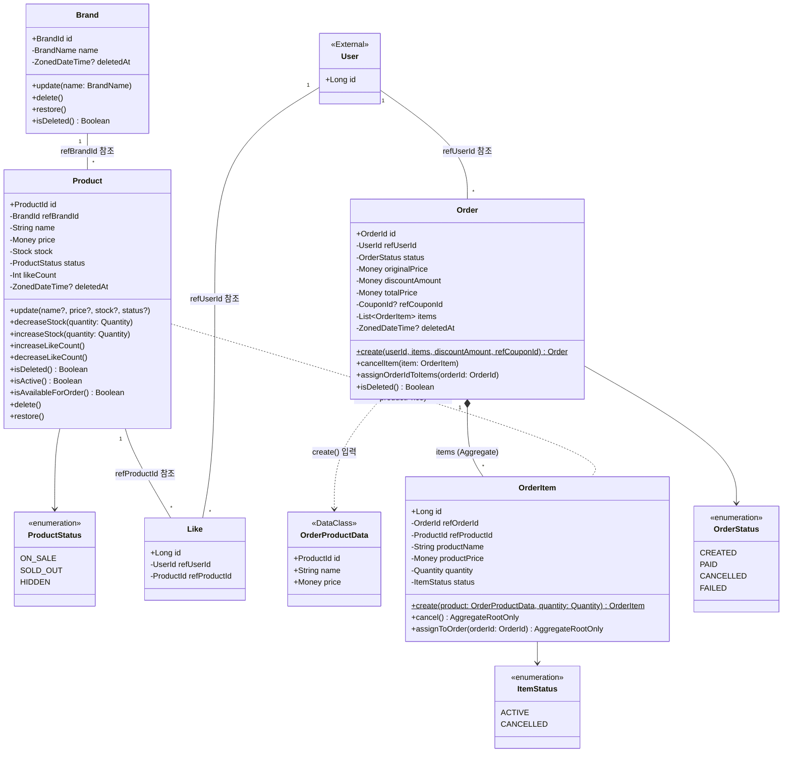
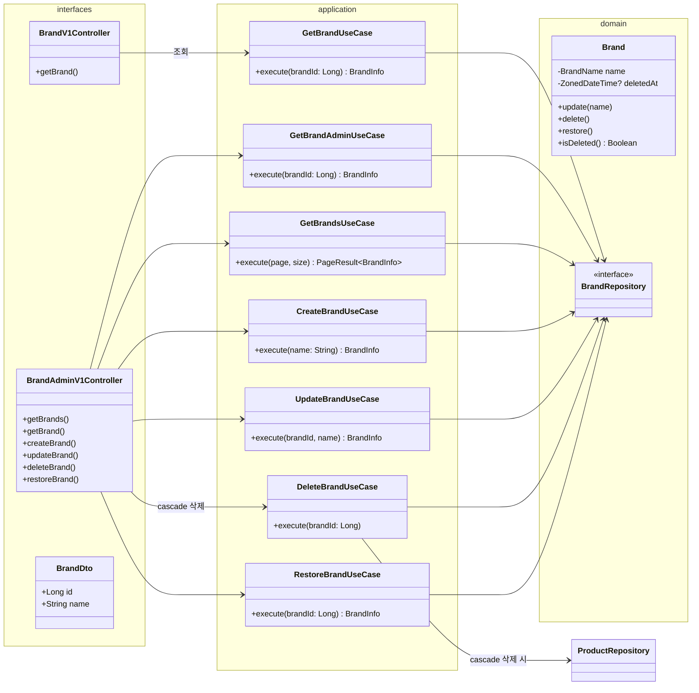
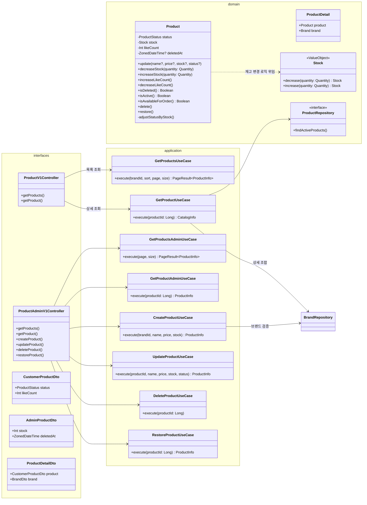
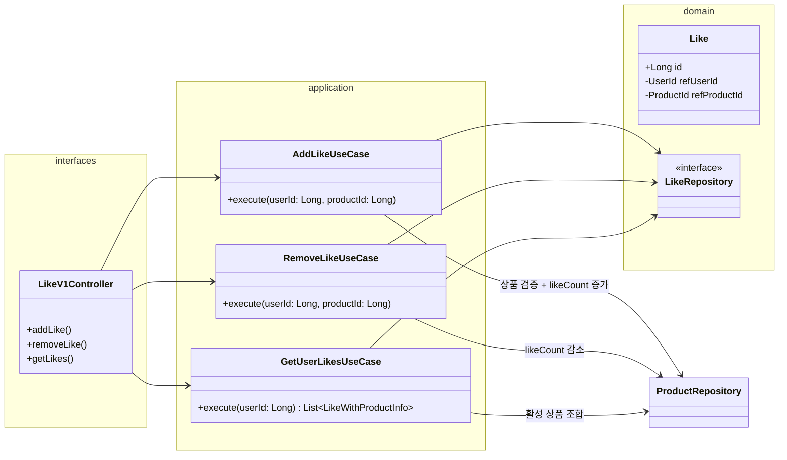
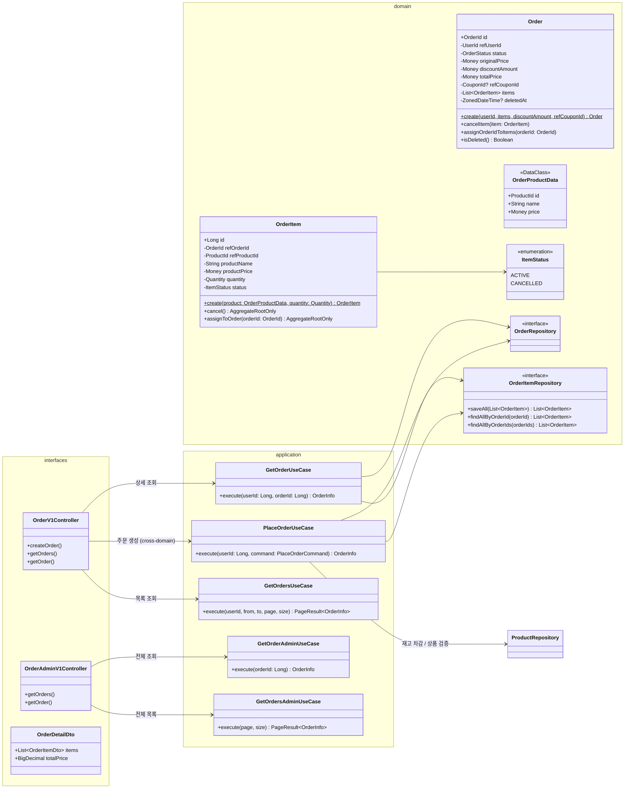
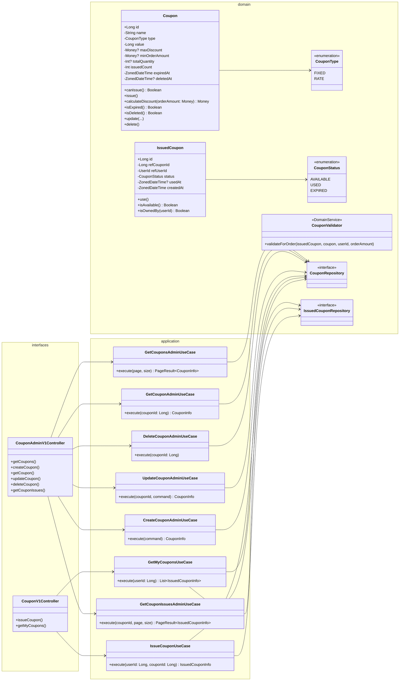
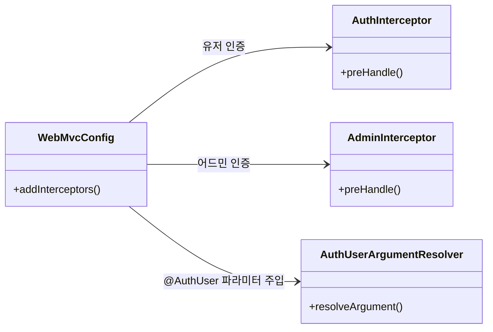

# 클래스 다이어그램

도메인 객체의 책임, 의존 방향, Domain Model/VO 구분을 Mermaid 클래스 다이어그램으로 정리한다.
**단순 Getter/Setter와 모든 필드 나열은 생략**하고, 핵심 비즈니스 로직과 아키텍처 구조 위주로 기술한다.

---

## 1. 도메인 모델 전체 관계도 (Domain Model Relationship)

시스템의 뼈대가 되는 4개 도메인(Brand, Product, Like, Order)의 Domain Model 간 관계와 참조 방식을 정의한다.

> **Domain Model은 순수 POJO다.** BaseEntity를 상속하지 않으며 JPA 애노테이션이 없다.
> soft delete 필드(`deletedAt`)와 `delete()`/`restore()` 메서드는 각 모델에 직접 구현된다.
> 영속성 관련 필드(`createdAt`, `updatedAt` 등)는 Entity 레벨(infrastructure)에서 BaseEntity 상속으로 관리된다.

```mermaid
classDiagram
    direction TB

    class Brand {
        +BrandId id
        -BrandName name
        -ZonedDateTime? deletedAt
        +update(name: BrandName)
        +delete()
        +restore()
        +isDeleted() Boolean
    }

    class Product {
        +ProductId id
        -BrandId refBrandId
        -String name
        -Money price
        -Stock stock
        -ProductStatus status
        -Int likeCount
        -ZonedDateTime? deletedAt
        +update(name?, price?, stock?, status?)
        +decreaseStock(quantity: Quantity)
        +increaseStock(quantity: Quantity)
        +increaseLikeCount()
        +decreaseLikeCount()
        +isDeleted() Boolean
        +isActive() Boolean
        +isAvailableForOrder() Boolean
        +delete()
        +restore()
    }

    class ProductStatus {
        <<enumeration>>
        ON_SALE
        SOLD_OUT
        HIDDEN
    }

    class Like {
        +Long id
        -UserId refUserId
        -ProductId refProductId
    }

    class Order {
        +OrderId id
        -UserId refUserId
        -OrderStatus status
        -Money originalPrice
        -Money discountAmount
        -Money totalPrice
        -CouponId? refCouponId
        -List~OrderItem~ items
        -ZonedDateTime? deletedAt
        +create(userId, items, discountAmount, refCouponId)$ Order
        +cancelItem(item: OrderItem)
        +assignOrderIdToItems(orderId: OrderId)
        +isDeleted() Boolean
    }

    class OrderProductData {
        <<DataClass>>
        +ProductId id
        +String name
        +Money price
    }

    class OrderItem {
        +Long id
        -OrderId refOrderId
        -ProductId refProductId
        -String productName
        -Money productPrice
        -Quantity quantity
        -ItemStatus status
        +create(product: OrderProductData, quantity: Quantity)$ OrderItem
        +cancel() AggregateRootOnly
        +assignToOrder(orderId: OrderId) AggregateRootOnly
    }

    class ItemStatus {
        <<enumeration>>
        ACTIVE
        CANCELLED
    }

    class OrderStatus {
        <<enumeration>>
        CREATED
        PAID
        CANCELLED
        FAILED
    }

    class User {
        <<External>>
        +Long id
    }

    Brand "1" -- "*" Product: refBrandId 참조
    Product "1" -- "*" Like: refProductId 참조
    User "1" -- "*" Like: refUserId 참조
    User "1" -- "*" Order: refUserId 참조
    Order "1" *-- "*" OrderItem: items (Aggregate)
    Order ..> OrderProductData: create() 입력
    Product .. OrderItem: 스냅샷 (productName, productPrice)
    Product --> ProductStatus
    Order --> OrderStatus
    OrderItem --> ItemStatus
```

> **영속성 필드 관리 분리:**
> - Domain Model은 `createdAt`, `updatedAt` 등 순수 영속성 필드를 갖지 않는다.
> - Infrastructure Entity(`BrandEntity`, `ProductEntity` 등)가 BaseEntity를 상속하여 이를 관리한다.
> - `toDomain()` / `fromDomain()` 변환 시 영속성 필드는 Entity에만 남는다.

---

## 2. Brand 도메인

Brand는 단순하지만, **삭제 시 Product로의 전파(Cascade)** 가 중요한 도메인이다.
어드민(Admin)과 사용자(User)의 진입점이 분리되어 있다.

```mermaid
classDiagram
    direction LR

    namespace interfaces {
        class BrandV1Controller {
            +getBrand()
        }
        class BrandAdminV1Controller {
            +getBrands()
            +getBrand()
            +createBrand()
            +updateBrand()
            +deleteBrand()
            +restoreBrand()
        }
        class BrandDto {
            +Long id
            +String name
        }
    }

    namespace application {
        class GetBrandUseCase {
            +execute(brandId: Long) BrandInfo
        }
        class GetBrandAdminUseCase {
            +execute(brandId: Long) BrandInfo
        }
        class GetBrandsUseCase {
            +execute(page, size) PageResult~BrandInfo~
        }
        class CreateBrandUseCase {
            +execute(name: String) BrandInfo
        }
        class UpdateBrandUseCase {
            +execute(brandId, name) BrandInfo
        }
        class DeleteBrandUseCase {
            +execute(brandId: Long)
        }
        class RestoreBrandUseCase {
            +execute(brandId: Long) BrandInfo
        }
    }

    namespace domain {
        class Brand {
            -BrandName name
            -ZonedDateTime? deletedAt
            +update(name)
            +delete()
            +restore()
            +isDeleted() Boolean
        }
    %% BrandName VO — @JvmInline value class (빈 값 불가)
        class BrandRepository {
            <<interface>>
        }
    }

    BrandV1Controller --> GetBrandUseCase: 조회
    BrandAdminV1Controller --> GetBrandsUseCase
    BrandAdminV1Controller --> GetBrandAdminUseCase
    BrandAdminV1Controller --> CreateBrandUseCase
    BrandAdminV1Controller --> UpdateBrandUseCase
    BrandAdminV1Controller --> DeleteBrandUseCase: cascade 삭제
    BrandAdminV1Controller --> RestoreBrandUseCase
    GetBrandUseCase --> BrandRepository
    GetBrandAdminUseCase --> BrandRepository
    GetBrandsUseCase --> BrandRepository
    CreateBrandUseCase --> BrandRepository
    UpdateBrandUseCase --> BrandRepository
    DeleteBrandUseCase --> BrandRepository
    DeleteBrandUseCase --> ProductRepository: cascade 삭제 시
    RestoreBrandUseCase --> BrandRepository
```

### 핵심 포인트

- **UseCase 분리:** Brand CRUD와 조회는 각 책임에 맞는 UseCase로 분리된다. Controller는 직접 UseCase를 호출한다.
- **BrandName VO:** `@JvmInline value class BrandName`으로 브랜드명을 타입 안전하게 표현한다. 빈 값 불가 규칙은 VO 생성자에서 검증한다.
- **getActiveBrand vs getAdminBrand:** 대고객 UseCase(`GetBrandUseCase`)는 삭제 상태를 체크하고, 어드민 UseCase(`GetBrandAdminUseCase`)는 삭제 포함 조회.

---

## 3. Product 도메인

가장 복잡한 도메인으로, **재고(Stock), 상태(Status), 가격(Price)** 의 비즈니스 규칙이 집중되어 있다.
어드민용 DTO와 고객용 DTO가 분리된다.

```mermaid
classDiagram
    direction LR

    namespace interfaces {
        class ProductV1Controller {
            +getProducts()
            +getProduct()
        }
        class ProductAdminV1Controller {
            +getProducts()
            +getProduct()
            +createProduct()
            +updateProduct()
            +deleteProduct()
            +restoreProduct()
        }
        class CustomerProductDto {
            +ProductStatus status
            +Int likeCount
        }
        class AdminProductDto {
            +Int stock
            +ZonedDateTime deletedAt
        }
        class ProductDetailDto {
            +CustomerProductDto product
            +BrandDto brand
        }
    }

    namespace application {
        class GetProductsUseCase {
            +execute(brandId, sort, page, size) PageResult~ProductInfo~
        }
        class GetProductUseCase {
            +execute(productId: Long) CatalogInfo
        }
        class GetProductsAdminUseCase {
            +execute(page, size) PageResult~ProductInfo~
        }
        class GetProductAdminUseCase {
            +execute(productId: Long) ProductInfo
        }
        class CreateProductUseCase {
            +execute(brandId, name, price, stock) ProductInfo
        }
        class UpdateProductUseCase {
            +execute(productId, name, price, stock, status) ProductInfo
        }
        class DeleteProductUseCase {
            +execute(productId: Long)
        }
        class RestoreProductUseCase {
            +execute(productId: Long) ProductInfo
        }
    }

    namespace domain {
        class ProductDetail {
            +Product product
            +Brand brand
        }
        class Product {
            -ProductStatus status
            -Stock stock
            -Int likeCount
            -ZonedDateTime? deletedAt
            +update(name?, price?, stock?, status?)
            +decreaseStock(quantity: Quantity)
            +increaseStock(quantity: Quantity)
            +increaseLikeCount()
            +decreaseLikeCount()
            +isDeleted() Boolean
            +isActive() Boolean
            +isAvailableForOrder() Boolean
            +delete()
            +restore()
            -adjustStatusByStock()
        }
        class Stock {
            <<ValueObject>>
            +decrease(quantity: Quantity) Stock
            +increase(quantity: Quantity) Stock
        }
    %% Money VO — @JvmInline value class (BigDecimal >= 0)
        class ProductRepository {
            <<interface>>
            +findActiveProducts()
        }
    }

    ProductV1Controller --> GetProductsUseCase: 목록 조회
    ProductV1Controller --> GetProductUseCase: 상세 조회
    ProductAdminV1Controller --> GetProductsAdminUseCase
    ProductAdminV1Controller --> GetProductAdminUseCase
    ProductAdminV1Controller --> CreateProductUseCase
    ProductAdminV1Controller --> UpdateProductUseCase
    ProductAdminV1Controller --> DeleteProductUseCase
    ProductAdminV1Controller --> RestoreProductUseCase
    GetProductUseCase --> ProductRepository
    GetProductUseCase --> BrandRepository: 상세 조합
    CreateProductUseCase --> BrandRepository: 브랜드 검증
    Product ..> Stock: 재고 변경 로직 위임
```

### 핵심 포인트

- **adjustStatusByStock():** `decreaseStock()`/`increaseStock()` 호출 시 내부에서 자동 실행된다. 재고가 0이 되면 `SOLD_OUT`, 0에서 양수가 되면 `ON_SALE`로 자동 전환. 단, 현재 상태가 `HIDDEN`인 경우 이 자동 상태 전이 로직은 무시되고 기존 `HIDDEN` 상태를 그대로 유지해야 한다.
- **isActive() vs isDeleted():** `isActive()`는 순수 비즈니스 상태(`status != HIDDEN`)만 판단하며 삭제 여부를 검사하지 않는다. 삭제 여부 검증(`isDeleted()`)은 UseCase(Application 계층)의 책임이다.
- **UseCase 직접 호출:** Controller가 UseCase를 직접 호출한다. Facade 레이어는 존재하지 않는다.

---

## 4. Like 도메인

**사용자-상품 간의 유일성(Unique)** 과 Product 도메인과의 협력이 핵심이다.
어드민 기능 없이 사용자 기능만 존재한다.

```mermaid
classDiagram
    direction LR

    namespace interfaces {
        class LikeV1Controller {
            +addLike()
            +removeLike()
            +getLikes()
        }
    }

    namespace application {
        class AddLikeUseCase {
            +execute(userId: Long, productId: Long)
        }
        class RemoveLikeUseCase {
            +execute(userId: Long, productId: Long)
        }
        class GetUserLikesUseCase {
            +execute(userId: Long) List~LikeWithProductInfo~
        }
    }

    namespace domain {
        class Like {
            +Long id
            -UserId refUserId
            -ProductId refProductId
        }
        class LikeRepository {
            <<interface>>
        }
    }

    LikeV1Controller --> AddLikeUseCase
    LikeV1Controller --> RemoveLikeUseCase
    LikeV1Controller --> GetUserLikesUseCase
    AddLikeUseCase --> LikeRepository
    AddLikeUseCase --> ProductRepository: 상품 검증 + likeCount 증가
    RemoveLikeUseCase --> LikeRepository
    RemoveLikeUseCase --> ProductRepository: likeCount 감소
    GetUserLikesUseCase --> LikeRepository
    GetUserLikesUseCase --> ProductRepository: 활성 상품 조합
```

### 핵심 포인트

- **UseCase 직접 조율:** `LikeV1Controller`는 UseCase를 직접 호출한다. 별도 Facade 클래스는 존재하지 않는다.
- **Cross-Domain 조율은 UseCase 내부:** `AddLikeUseCase`는 `LikeRepository`로 좋아요를 등록한 후, `ProductRepository`를 직접 호출하여 `likeCount`를 증감시킨다.
- **BaseEntity 미상속:** 단순 매핑 테이블 성격이므로 이력 관리 필드(createdAt/updatedAt) 없이 ID와 관계 필드만 가진다. 취소 시 하드 딜리트(물리 삭제).
- **삭제된 상품의 좋아요 취소:** `RemoveLikeUseCase`에서 상품이 삭제 상태(`isDeleted()`)이면 Like 레코드만 삭제하고 `likeCount` 갱신을 건너뛴다.
- **비활성 상품 좋아요 방지:** `AddLikeUseCase`에서 상품이 삭제(`isDeleted()`)되었거나 비활성(`!isActive()`)이면 NOT_FOUND 예외를 발생시킨다.

---

## 5. Order 도메인

주문 생성 시점의 스냅샷 저장과 Order-OrderItem의 합성 관계가 핵심이다.
어드민은 전체 주문을 조회할 수 있다.

```mermaid
classDiagram
    direction LR

    namespace interfaces {
        class OrderV1Controller {
            +createOrder()
            +getOrders()
            +getOrder()
        }
        class OrderAdminV1Controller {
            +getOrders()
            +getOrder()
        }
        class OrderDetailDto {
            +List~OrderItemDto~ items
            +BigDecimal totalPrice
        }
    }

    namespace application {
        class PlaceOrderUseCase {
            +execute(userId: Long, command: PlaceOrderCommand) OrderInfo
        }
        class GetOrderUseCase {
            +execute(userId: Long, orderId: Long) OrderInfo
        }
        class GetOrdersUseCase {
            +execute(userId, from, to, page, size) PageResult~OrderInfo~
        }
        class GetOrderAdminUseCase {
            +execute(orderId: Long) OrderInfo
        }
        class GetOrdersAdminUseCase {
            +execute(page, size) PageResult~OrderInfo~
        }
    }

    namespace domain {
        class Order {
            +OrderId id
            -UserId refUserId
            -OrderStatus status
            -Money originalPrice
            -Money discountAmount
            -Money totalPrice
            -CouponId? refCouponId
            -List~OrderItem~ items
            -ZonedDateTime? deletedAt
            +create(userId, items, discountAmount, refCouponId)$ Order
            +cancelItem(item: OrderItem)
            +assignOrderIdToItems(orderId: OrderId)
            +isDeleted() Boolean
        }
        class OrderProductData {
            <<DataClass>>
            +ProductId id
            +String name
            +Money price
        }
        class OrderItem {
            +Long id
            -OrderId refOrderId
            -ProductId refProductId
            -String productName
            -Money productPrice
            -Quantity quantity
            -ItemStatus status
            +create(product: OrderProductData, quantity: Quantity)$ OrderItem
            +cancel() AggregateRootOnly
            +assignToOrder(orderId: OrderId) AggregateRootOnly
        }
        class ItemStatus {
            <<enumeration>>
            ACTIVE
            CANCELLED
        }
        class OrderRepository {
            <<interface>>
        }
        class OrderItemRepository {
            <<interface>>
            +saveAll(List~OrderItem~) List~OrderItem~
            +findAllByOrderId(orderId) List~OrderItem~
            +findAllByOrderIds(orderIds) List~OrderItem~
        }
    }

    OrderV1Controller --> PlaceOrderUseCase: 주문 생성 (cross-domain)
    OrderV1Controller --> GetOrderUseCase: 상세 조회
    OrderV1Controller --> GetOrdersUseCase: 목록 조회
    OrderAdminV1Controller --> GetOrderAdminUseCase: 전체 조회
    OrderAdminV1Controller --> GetOrdersAdminUseCase: 전체 목록
    PlaceOrderUseCase --> OrderRepository
    PlaceOrderUseCase --> OrderItemRepository
    PlaceOrderUseCase --> ProductRepository: 재고 차감 / 상품 검증
    GetOrderUseCase --> OrderRepository
    GetOrderUseCase --> OrderItemRepository
    OrderItem --> ItemStatus
```

### 핵심 포인트

- **Aggregate Root 규칙:** `OrderItem`의 상태 변경(취소 등)은 반드시 `Order`를 통해서만 수행한다. `cancelItem()`이 내부에서 `item.cancel()`을 호출하고 `totalPrice`를 재계산한다. `cancel()`은 `@AggregateRootOnly`로 표시되어 외부 직접 호출을 차단한다.
- **Aggregate 영속성 및 ID 주입 규칙:** `Order.create()` 시점에는 DB 저장 전이라 ID가 없다. `PlaceOrderUseCase`가 다음 순서를 따른다:
    1. `Order`를 먼저 DB에 저장하여 ID를 채번받는다 (`orderRepository.save(order)`).
    2. `order.assignOrderIdToItems(savedOrder.id)`로 OrderItem에 FK를 주입한다.
    3. `orderItemRepository.saveAll(order.items)`로 항목들을 저장한다.
- **Order.create() 팩토리 메서드:** `Order.create(userId, items: List<Pair<OrderProductData, Quantity>>)`가 OrderItem 생성과 totalPrice 계산을 내부에서 수행한다.
- **소유권 검증:** 대고객 `GetOrderUseCase`는 UseCase 내에서 소유권 검증. 어드민 `GetOrderAdminUseCase`는 검증 없이 조회.

---

## 6. Coupon 도메인

쿠폰 템플릿(Coupon)과 발급 인스턴스(IssuedCoupon)로 구성된다.
어드민은 쿠폰 템플릿을 관리하고, 사용자는 발급 API를 통해 IssuedCoupon을 생성한다.

```mermaid
classDiagram
    direction LR

    namespace interfaces {
        class CouponV1Controller {
            +issueCoupon()
            +getMyCoupons()
        }
        class CouponAdminV1Controller {
            +getCoupons()
            +createCoupon()
            +getCoupon()
            +updateCoupon()
            +deleteCoupon()
            +getCouponIssues()
        }
    }

    namespace application {
        class IssueCouponUseCase {
            +execute(userId: Long, couponId: Long) IssuedCouponInfo
        }
        class GetMyCouponsUseCase {
            +execute(userId: Long) List~IssuedCouponInfo~
        }
        class CreateCouponAdminUseCase {
            +execute(command) CouponInfo
        }
        class UpdateCouponAdminUseCase {
            +execute(couponId, command) CouponInfo
        }
        class DeleteCouponAdminUseCase {
            +execute(couponId: Long)
        }
        class GetCouponAdminUseCase {
            +execute(couponId: Long) CouponInfo
        }
        class GetCouponsAdminUseCase {
            +execute(page, size) PageResult~CouponInfo~
        }
        class GetCouponIssuesAdminUseCase {
            +execute(couponId, page, size) PageResult~IssuedCouponInfo~
        }
    }

    namespace domain {
        class Coupon {
            +Long id
            -String name
            -CouponType type
            -Long value
            -Money? maxDiscount
            -Money? minOrderAmount
            -Int? totalQuantity
            -Int issuedCount
            -ZonedDateTime expiredAt
            -ZonedDateTime? deletedAt
            +canIssue() Boolean
            +issue()
            +calculateDiscount(orderAmount: Money) Money
            +isExpired() Boolean
            +isDeleted() Boolean
            +update(...)
            +delete()
        }
        class CouponType {
            <<enumeration>>
            FIXED
            RATE
        }
        class IssuedCoupon {
            +Long id
            -Long refCouponId
            -UserId refUserId
            -CouponStatus status
            -ZonedDateTime? usedAt
            -ZonedDateTime createdAt
            +use()
            +isAvailable() Boolean
            +isOwnedBy(userId) Boolean
        }
        class CouponStatus {
            <<enumeration>>
            AVAILABLE
            USED
            EXPIRED
        }
        class CouponValidator {
            <<DomainService>>
            +validateForOrder(issuedCoupon, coupon, userId, orderAmount)
        }
        class CouponRepository {
            <<interface>>
        }
        class IssuedCouponRepository {
            <<interface>>
        }
    }

    CouponV1Controller --> IssueCouponUseCase
    CouponV1Controller --> GetMyCouponsUseCase
    CouponAdminV1Controller --> CreateCouponAdminUseCase
    CouponAdminV1Controller --> UpdateCouponAdminUseCase
    CouponAdminV1Controller --> DeleteCouponAdminUseCase
    CouponAdminV1Controller --> GetCouponAdminUseCase
    CouponAdminV1Controller --> GetCouponsAdminUseCase
    CouponAdminV1Controller --> GetCouponIssuesAdminUseCase
    IssueCouponUseCase --> CouponRepository
    IssueCouponUseCase --> IssuedCouponRepository
    GetMyCouponsUseCase --> IssuedCouponRepository
    GetMyCouponsUseCase --> CouponRepository
    CreateCouponAdminUseCase --> CouponRepository
    UpdateCouponAdminUseCase --> CouponRepository
    DeleteCouponAdminUseCase --> CouponRepository
    GetCouponAdminUseCase --> CouponRepository
    GetCouponsAdminUseCase --> CouponRepository
    GetCouponIssuesAdminUseCase --> IssuedCouponRepository
    Coupon --> CouponType
    IssuedCoupon --> CouponStatus
```

### 핵심 포인트

- **Coupon (템플릿)**: 어드민이 생성/관리하는 쿠폰 정의. `canIssue()`로 발급 가능 여부를 자가 검증한다.
- **IssuedCoupon (인스턴스)**: 사용자에게 발급된 쿠폰. `use()` 호출로 USED 상태로 전이되며 중복 사용이 방지된다.
- **FIXED vs RATE**: `calculateDiscount()`가 타입에 따라 정액/정률 할인을 계산한다. RATE 타입은 maxDiscount로 상한을 제한할 수 있다.
- **Order 연결**: 주문 생성 시 쿠폰 ID를 전달하면 `discountAmount`와 `refCouponId`가 Order에 기록된다.

---

## 7. Controller → UseCase 의존 관계 (Architecture View)

모든 Controller는 UseCase를 직접 호출한다. Facade 레이어는 존재하지 않는다.
cross-domain 조율(예: 주문 시 재고 차감)은 UseCase 내부에서 직접 수행한다.

```mermaid
classDiagram
    direction TB

    class BrandV1Controller
    class BrandAdminV1Controller
    class ProductV1Controller
    class ProductAdminV1Controller
    class LikeV1Controller
    class OrderV1Controller
    class OrderAdminV1Controller
    class CouponV1Controller
    class CouponAdminV1Controller

    class GetBrandUseCase
    class GetBrandAdminUseCase
    class GetBrandsUseCase
    class CreateBrandUseCase
    class UpdateBrandUseCase
    class DeleteBrandUseCase
    class RestoreBrandUseCase

    class GetProductUseCase
    class GetProductsUseCase
    class GetProductAdminUseCase
    class GetProductsAdminUseCase
    class CreateProductUseCase
    class UpdateProductUseCase
    class DeleteProductUseCase
    class RestoreProductUseCase

    class AddLikeUseCase
    class RemoveLikeUseCase
    class GetUserLikesUseCase

    class PlaceOrderUseCase
    class GetOrderUseCase
    class GetOrdersUseCase
    class GetOrderAdminUseCase
    class GetOrdersAdminUseCase

    class IssueCouponUseCase
    class GetMyCouponsUseCase
    class CreateCouponAdminUseCase
    class UpdateCouponAdminUseCase
    class DeleteCouponAdminUseCase
    class GetCouponAdminUseCase
    class GetCouponsAdminUseCase
    class GetCouponIssuesAdminUseCase

    BrandV1Controller ..> GetBrandUseCase
    BrandAdminV1Controller ..> GetBrandsUseCase
    BrandAdminV1Controller ..> GetBrandAdminUseCase
    BrandAdminV1Controller ..> CreateBrandUseCase
    BrandAdminV1Controller ..> UpdateBrandUseCase
    BrandAdminV1Controller ..> DeleteBrandUseCase
    BrandAdminV1Controller ..> RestoreBrandUseCase

    ProductV1Controller ..> GetProductsUseCase
    ProductV1Controller ..> GetProductUseCase
    ProductAdminV1Controller ..> GetProductsAdminUseCase
    ProductAdminV1Controller ..> GetProductAdminUseCase
    ProductAdminV1Controller ..> CreateProductUseCase
    ProductAdminV1Controller ..> UpdateProductUseCase
    ProductAdminV1Controller ..> DeleteProductUseCase
    ProductAdminV1Controller ..> RestoreProductUseCase

    LikeV1Controller ..> AddLikeUseCase
    LikeV1Controller ..> RemoveLikeUseCase
    LikeV1Controller ..> GetUserLikesUseCase

    OrderV1Controller ..> PlaceOrderUseCase
    OrderV1Controller ..> GetOrderUseCase
    OrderV1Controller ..> GetOrdersUseCase
    OrderAdminV1Controller ..> GetOrderAdminUseCase
    OrderAdminV1Controller ..> GetOrdersAdminUseCase

    CouponV1Controller ..> IssueCouponUseCase
    CouponV1Controller ..> GetMyCouponsUseCase
    CouponAdminV1Controller ..> CreateCouponAdminUseCase
    CouponAdminV1Controller ..> UpdateCouponAdminUseCase
    CouponAdminV1Controller ..> DeleteCouponAdminUseCase
    CouponAdminV1Controller ..> GetCouponAdminUseCase
    CouponAdminV1Controller ..> GetCouponsAdminUseCase
    CouponAdminV1Controller ..> GetCouponIssuesAdminUseCase
```

### Controller → UseCase 직접 호출 요약

| Controller                 | UseCase                                              | 용도                              |
|----------------------------|------------------------------------------------------|---------------------------------|
| `BrandV1Controller`        | `GetBrandUseCase`                                    | 브랜드 조회 (삭제 제외)                  |
| `BrandAdminV1Controller`   | `GetBrandsUseCase`, `GetBrandAdminUseCase`, `CreateBrandUseCase`, `UpdateBrandUseCase`, `DeleteBrandUseCase`, `RestoreBrandUseCase` | 브랜드 CRUD + cascade 삭제 |
| `ProductV1Controller`      | `GetProductsUseCase`, `GetProductUseCase`            | 상품 목록/상세 조회                     |
| `ProductAdminV1Controller` | `GetProductsAdminUseCase`, `GetProductAdminUseCase`, `CreateProductUseCase`, `UpdateProductUseCase`, `DeleteProductUseCase`, `RestoreProductUseCase` | 상품 CRUD |
| `LikeV1Controller`         | `AddLikeUseCase`, `RemoveLikeUseCase`, `GetUserLikesUseCase` | 좋아요 등록/취소/목록                   |
| `OrderV1Controller`        | `PlaceOrderUseCase`, `GetOrderUseCase`, `GetOrdersUseCase` | 주문 생성/상세/목록                    |
| `OrderAdminV1Controller`   | `GetOrderAdminUseCase`, `GetOrdersAdminUseCase`      | 어드민 주문 조회                       |
| `CouponV1Controller`       | `IssueCouponUseCase`, `GetMyCouponsUseCase`          | 쿠폰 발급 / 내 쿠폰 목록               |
| `CouponAdminV1Controller`  | `CreateCouponAdminUseCase`, `UpdateCouponAdminUseCase`, `DeleteCouponAdminUseCase`, `GetCouponAdminUseCase`, `GetCouponsAdminUseCase`, `GetCouponIssuesAdminUseCase` | 쿠폰 CRUD + 발급 내역 |

---

## 8. 인증 레이어 구조

기존 인증 방식(User)과 신규 어드민 인증(Admin)이 공존한다.

```mermaid
classDiagram
    direction LR

    class AuthInterceptor {
        +preHandle()
    }
    class AdminInterceptor {
        +preHandle()
    }
    class AuthUserArgumentResolver {
        +resolveArgument()
    }
    class WebMvcConfig {
        +addInterceptors()
    }

    WebMvcConfig --> AuthInterceptor: 유저 인증
    WebMvcConfig --> AdminInterceptor: 어드민 인증
    WebMvcConfig --> AuthUserArgumentResolver: @AuthUser 파라미터 주입
```

---

## 9. Value Object 정리

| VO       | 타입                        | 소속 도메인    | 검증 규칙                                        | 사용 시점                    |
|----------|---------------------------|-----------|----------------------------------------------|--------------------------|
| BrandId  | @JvmInline value class    | 공통 (common) | -                                            | Brand 참조 시               |
| ProductId | @JvmInline value class   | 공통 (common) | -                                            | Product 참조 시              |
| UserId   | @JvmInline value class    | 공통 (common) | -                                            | User 참조 시                 |
| OrderId  | @JvmInline value class    | 공통 (common) | -                                            | Order 참조 시                |
| CouponId | @JvmInline value class    | 공통 (common) | -                                            | Coupon 참조 시               |
| Money    | @JvmInline value class    | 공통 (common) | BigDecimal >= 0, 연산(plus/minus/times) 지원    | Product 가격, 주문 총액 등       |
| Quantity | @JvmInline value class    | 공통 (common) | Int >= 1                                     | 주문 수량                     |
| BrandName | @JvmInline value class   | Brand     | 빈 값 불가                                      | Brand 생성/수정 시             |
| Stock    | @JvmInline value class    | Product   | Int >= 0, decrease 시 부족 확인                   | Product 생성/수정/재고차감 시     |

> **VO 도입 기준**: Domain Model이 순수 POJO이므로 `@Converter` 부담 없이 모든 도메인 값을 VO로 표현할 수 있다. 단일 값과 도메인 메서드가 있는 경우 모두 `@JvmInline value class`로 선언한다. JPA Entity는 DB 컬럼 타입(String, BigDecimal 등)으로 저장하고, `toDomain()`에서 VO로 복원한다.
>
> **DTO 변환 흐름:**
> - **단일 도메인 조회** (UseCase → Repository): UseCase → Domain Model → Info DTO → Controller에서 Response Dto 변환
> - **같은 BC 내 조합**: UseCase → `ProductDetail`(domain 데이터 클래스) → `CatalogInfo` → Controller에서 Response Dto 변환
> - **cross-domain 조율** (UseCase 내부): UseCase가 여러 Repository/DomainService를 직접 조율 → `OrderInfo`, `LikeWithProductInfo` 등 반환

---

## 10. 상세 설계 원칙 및 결정 사유 (Design Principles)

1. **ID 참조 방식 (Loose Coupling)**
    - **결정**: 객체 간 연관 관계(`@ManyToOne`)를 맺지 않고, **VO로 감싼 ID(BrandId, ProductId 등) 값만 참조**한다.
    - **이유**: 도메인 간의 강한 결합을 끊어 추후 MSA 분리를 용이하게 하고, 트랜잭션 범위를 명확히 제어하기 위함이다.

2. **UseCase 패턴 (Strict Layered Architecture)**
    - **결정**: 모든 Controller는 UseCase를 통과한다. Facade 레이어는 존재하지 않는다. cross-domain 조율도 UseCase 내부에서 직접 수행한다.
    - **이유**: Facade는 불필요한 레이어를 추가할 뿐이다. UseCase가 단일 책임(`execute`)으로 오케스트레이션 경계를 명확히 한다.

3. **Product Domain Model의 책임 범위 (Rich Domain Model)**
    - **결정**: `stock`, `status`, `likeCount` 등 변경 성격이 다른 필드들을 `Product` 하나의 Domain Model에 둔다.
    - **이유 (Trade-off)**: 현재 단계에서는 Domain Model 분리보다 복잡도가 더 크다. 추후 트래픽 증가 시 Stock 분리나 Redis 캐싱을 고려한다.

4. **VO (Value Object) 적극 도입**
    - **결정**: Domain Model이 순수 POJO이므로 `@Converter` 부담 없이 모든 도메인 값을 VO로 표현한다. ID 참조도 `BrandId`, `ProductId` 등 VO로 감싸 타입 안전성을 확보한다.
    - **이유**: JPA Entity와 분리된 Domain Model은 기술적 제약이 없으므로, 한 줄짜리 검증이라도 VO로 표현하여 타입 안전성을 확보한다.

5. **주문 스냅샷 (Snapshot)**
    - **결정**: `OrderItem`은 Product를 참조하는 대신 `productName`, `productPrice` 값을 별도 컬럼으로 저장한다.
    - **이유**: 상품 정보가 추후 변경/삭제되어도, 주문 당시의 데이터 불변성을 보장해야 한다.

6. **Soft Delete 조회 전략**
    - **결정**: Hibernate `@Where(clause = "deleted_at IS NULL")`을 사용하지 않는다.
    - **이유**: 어드민 기능에서 삭제된 데이터도 조회해야 한다. 메서드마다 명시적으로 조건을 추가하여 조회 유연성을 확보한다.

7. **DTO 분리 (Security)**
    - **결정**: 동일한 Product라도 `CustomerProductDto`와 `AdminProductDto`로 분리한다.
    - **이유**: 대고객 API에서는 재고 수량이나 내부 관리 필드(deletedAt)를 노출하지 않아야 한다.

8. **Domain Model 순수성 (Pure POJO)**
    - **결정**: Domain Model은 BaseEntity를 상속하지 않는다. `deletedAt` 등 soft delete 필드는 각 모델에 직접 선언하고, `createdAt`/`updatedAt` 등 순수 영속성 필드는 Entity 레벨에서만 관리한다.
    - **이유**: Domain Model을 JPA 기술에서 완전히 격리하여 순수 비즈니스 로직만 담도록 한다.
