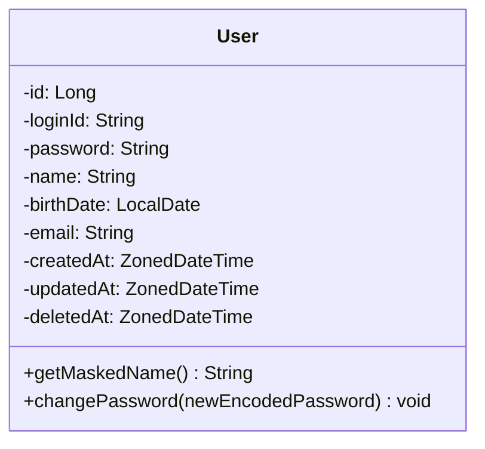
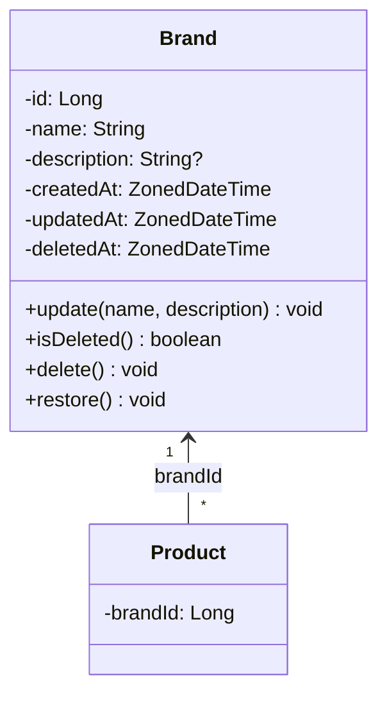
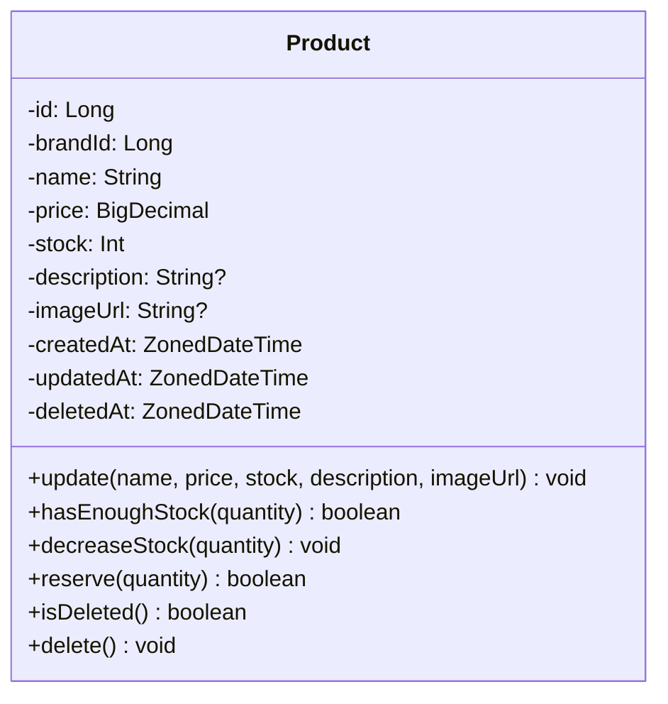
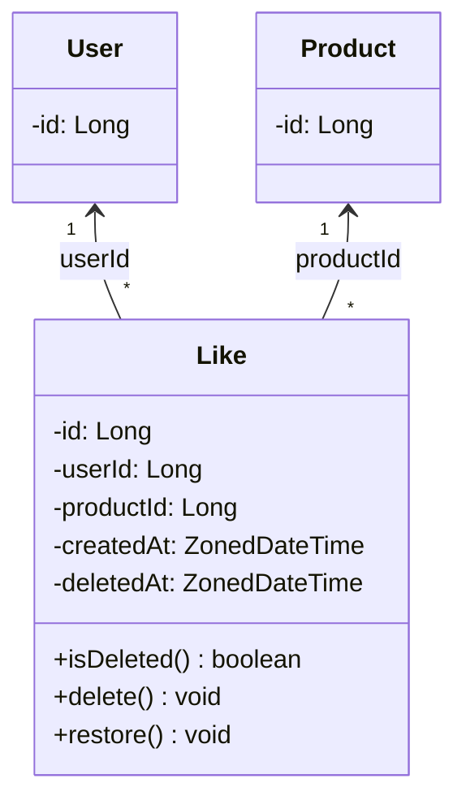
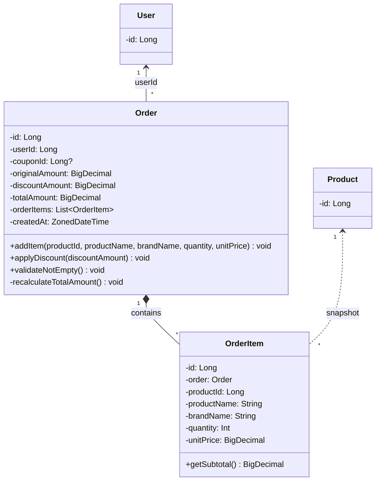
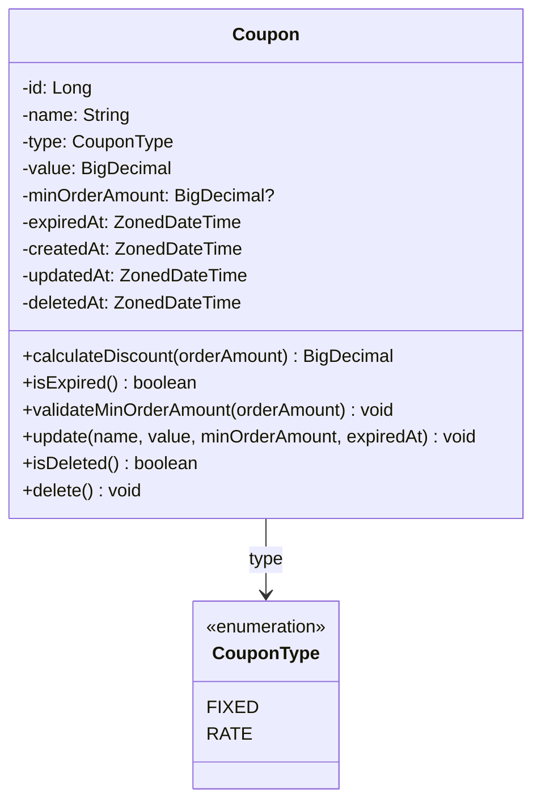
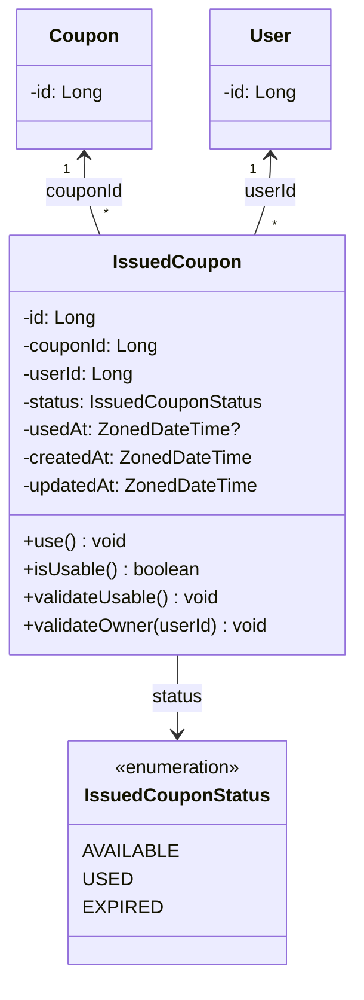

# 클래스 다이어그램

> 목적: 레이어 간 의존 방향, 도메인 클래스 구조, 클래스 간 관계 확인

---

## 목차

1. [레이어 아키텍처 전체 구조](#1-레이어-아키텍처-전체-구조)
2. [도메인 클래스 다이어그램](#2-도메인-클래스-다이어그램)

---

## 1. 레이어 아키텍처 전체 구조

### 다이어그램 목적
- 4개 레이어의 역할과 단방향 의존 확인
- 각 레이어가 무엇을 알고, 무엇을 모르는지 명확화


```mermaid
flowchart TB
    subgraph Interfaces["interfaces (API 계층)"]
        direction LR
        C1[UserV1Controller]
        C2[BrandV1Controller]
        C2A[BrandAdminV1Controller]
        C3[ProductV1Controller]
        C3A[ProductAdminV1Controller]
        C4[LikeV1Controller]
        C5[OrderV1Controller]
        C5A[OrderAdminV1Controller]
    end

    subgraph Application["application (응용 계층)"]
        direction LR
        S1[UserService]
        S2[BrandService]
        S3[ProductService]
        S4[LikeService]
        S5[OrderService]
        S6[CouponService]
        F1[OrderFacade]
    end

    subgraph Domain["domain (도메인 계층)"]
        direction LR
        D1[User]
        D2[Brand]
        D3[Product]
        D4[Like]
        D5[Order / OrderItem]
        D6[Coupon]
        D7[IssuedCoupon]
        DS1[BrandDomainService]
        DS2[OrderDomainService]
        RI1[UserRepository]
        RI2[BrandRepository]
        RI3[ProductRepository]
        RI4[LikeRepository]
        RI5[OrderRepository]
        RI6[CouponRepository]
        RI7[IssuedCouponRepository]
    end

    subgraph Infrastructure["infrastructure (영속성 계층)"]
        direction LR
        R1[UserRepositoryImpl]
        R2[BrandRepositoryImpl]
        R3[ProductRepositoryImpl]
        R4[LikeRepositoryImpl]
        R5[OrderRepositoryImpl]
        R6[CouponRepositoryImpl]
        R7[IssuedCouponRepositoryImpl]
    end

    C1 --> S1
    C2 --> S2
    C2A --> S2
    C3 --> S3
    C3A --> S3
    C4 --> S4
    C4 -.-> S1
    C5 --> F1
    C5 -.-> S5
    C5 -.-> S1
    C5A --> S5

    F1 --> S5
    F1 -.-> S3
    F1 -.-> S2
    S2 --> RI2
    S2 -.-> RI3
    S2 -.-> DS1
    S3 --> RI3
    S3 -.-> RI2
    S4 --> RI4
    S4 -.-> S3
    S5 --> RI5
    S5 -.-> DS2
    S1 --> RI1
    S6 --> RI6
    S6 --> RI7

    R1 -.->|implements| RI1
    R2 -.->|implements| RI2
    R3 -.->|implements| RI3
    R4 -.->|implements| RI4
    R5 -.->|implements| RI5
    R6 -.->|implements| RI6
    R7 -.->|implements| RI7
```

### 핵심 포인트

| 레이어 | 역할 | 포함 클래스 | 알아야 하는 것 | 몰라야 하는 것 |
|--------|------|-----------|---------------|---------------|
| **interfaces** | 요청/응답 처리, DTO 변환 | Controller, ApiSpec, Dto | Service, Facade | Repository, Entity |
| **application** | 비즈니스 조합, 트랜잭션 경계 | Service, Facade, Info, Criteria | Repository Interface, Entity, DomainService | RepositoryImpl, DB |
| **domain** | 엔티티, 도메인 규칙, 저장소 인터페이스 | Entity, DomainService, Repository Interface | Entity 자신 | 다른 도메인, 프레임워크 |
| **infrastructure** | Repository 구현체, 외부 연동 | RepositoryImpl, JpaRepository | Entity, JPA | 비즈니스 로직 |

### 의존 방향 규칙

```
Controller → Service/Facade → Repository Interface ← RepositoryImpl
     ↓           ↓                    ↓                     ↓
   (DTO)    (Entity, DomainService) (Domain 계층)         (JPA)

※ 화살표 반대 방향 의존 금지
※ Repository 인터페이스는 domain 레이어, 구현체는 infrastructure 레이어 (DIP)
```

### 의존 관계 특이사항

| 관계 | 설명 |
|------|------|
| Controller → 다수 Service | OrderV1Controller는 UserService(인증) + OrderService + OrderFacade 의존 |
| LikeService → ProductService | 좋아요 등록 시 상품 존재 검증을 위해 application 레이어 내 교차 의존 |
| BrandService → ProductRepository | 브랜드 삭제 시 연쇄 상품 삭제를 위해 직접 참조 |
| ProductService → BrandRepository | 상품 등록 시 브랜드 존재 검증을 위해 직접 참조 |
| OrderFacade | 교차 도메인 조합 시에만 사용 (OrderService + ProductService + BrandService) |

---

## 2. 도메인 클래스 다이어그램

### 다이어그램 목적
- 도메인 Entity 간 관계와 책임 확인
- Soft Delete, 스냅샷 등 도메인 행위 명시

### 2.1 User


```mermaid
classDiagram
    class User {
        -id: Long
        -loginId: String
        -password: String
        -name: String
        -birthDate: LocalDate
        -email: String
        -createdAt: ZonedDateTime
        -updatedAt: ZonedDateTime
        -deletedAt: ZonedDateTime
        +getMaskedName() String
        +changePassword(newEncodedPassword) void
    }
```

| 메서드 | 책임 |
|--------|------|
| `getMaskedName()` | 이름 마스킹 (홍길동 → 홍길*) |
| `changePassword()` | 암호화된 비밀번호 변경 |

---

### 2.2 Brand


```mermaid
classDiagram
    class Brand {
        -id: Long
        -name: String
        -description: String?
        -createdAt: ZonedDateTime
        -updatedAt: ZonedDateTime
        -deletedAt: ZonedDateTime
        +update(name, description) void
        +isDeleted() boolean
        +delete() void
        +restore() void
    }

    class Product {
        -brandId: Long
    }

    Brand "1" <-- "*" Product : brandId
```

| 메서드 | 책임 |
|--------|------|
| `update()` | 브랜드 정보 수정 |
| `isDeleted()` | 삭제 여부 확인 |
| `delete()` | deletedAt 설정 (BaseEntity 상속) |
| `restore()` | deletedAt = null (BaseEntity 상속) |

---

### 2.3 Product


```mermaid
classDiagram
    class Product {
        -id: Long
        -brandId: Long
        -name: String
        -price: BigDecimal
        -stock: Int
        -description: String?
        -imageUrl: String?
        -createdAt: ZonedDateTime
        -updatedAt: ZonedDateTime
        -deletedAt: ZonedDateTime
        +update(name, price, stock, description, imageUrl) void
        +hasEnoughStock(quantity) boolean
        +decreaseStock(quantity) void
        +reserve(quantity) boolean
        +isDeleted() boolean
        +delete() void
    }
```

| 메서드 | 책임 |
|--------|------|
| `update()` | 상품 정보 수정 |
| `decreaseStock()` | 재고 차감 (stock >= 0 보장, 부족 시 예외) |
| `reserve()` | 재고 예약 차감 (부족 시 false 반환, 예외 없음) |
| `hasEnoughStock()` | 재고 충분 여부 확인 |
| `isDeleted()` | 삭제 여부 확인 |

---

### 2.4 Like


```mermaid
classDiagram
    class Like {
        -id: Long
        -userId: Long
        -productId: Long
        -createdAt: ZonedDateTime
        -deletedAt: ZonedDateTime
        +isDeleted() boolean
        +delete() void
        +restore() void
    }

    class User {
        -id: Long
    }

    class Product {
        -id: Long
    }

    User "1" <-- "*" Like : userId
    Product "1" <-- "*" Like : productId
```

| 메서드 | 책임 |
|--------|------|
| `isDeleted()` | 삭제 여부 확인 |
| `delete()` | deletedAt 설정 (BaseEntity 상속) |
| `restore()` | deletedAt = null, 멱등성 복원 (BaseEntity 상속) |

---

### 2.5 Order / OrderItem


```mermaid
classDiagram
    class Order {
        -id: Long
        -userId: Long
        -couponId: Long?
        -originalAmount: BigDecimal
        -discountAmount: BigDecimal
        -totalAmount: BigDecimal
        -orderItems: List~OrderItem~
        -createdAt: ZonedDateTime
        +addItem(productId, productName, brandName, quantity, unitPrice) void
        +applyDiscount(discountAmount) void
        +validateNotEmpty() void
        -recalculateTotalAmount() void
    }

    class OrderItem {
        -id: Long
        -order: Order
        -productId: Long
        -productName: String
        -brandName: String
        -quantity: Int
        -unitPrice: BigDecimal
        +getSubtotal() BigDecimal
    }

    class User {
        -id: Long
    }

    class Product {
        -id: Long
    }

    User "1" <-- "*" Order : userId
    Order "1" *-- "*" OrderItem : contains
    Product "1" <.. "*" OrderItem : snapshot
```

| 클래스 | 필드 | 설명 |
|--------|------|------|
| **Order** | couponId, originalAmount, discountAmount | 쿠폰 적용 시 할인 정보 |
| **OrderItem** | unitPrice, productName, brandName | 주문 시점 스냅샷 |

| 메서드 | 책임 |
|--------|------|
| `addItem()` | 주문 항목 추가 + 총액 재계산 |
| `applyDiscount()` | 쿠폰 할인 금액 적용 |
| `validateNotEmpty()` | 주문 항목 비어있으면 예외 |
| `recalculateTotalAmount()` | 주문 총액 재계산 (private) |
| `getSubtotal()` | 항목별 소계 (unitPrice × quantity) |

---

### 2.6 Coupon


```mermaid
classDiagram
    class Coupon {
        -id: Long
        -name: String
        -type: CouponType
        -value: BigDecimal
        -minOrderAmount: BigDecimal?
        -expiredAt: ZonedDateTime
        -createdAt: ZonedDateTime
        -updatedAt: ZonedDateTime
        -deletedAt: ZonedDateTime
        +calculateDiscount(orderAmount) BigDecimal
        +isExpired() boolean
        +validateMinOrderAmount(orderAmount) void
        +update(name, value, minOrderAmount, expiredAt) void
        +isDeleted() boolean
        +delete() void
    }

    class CouponType {
        <<enumeration>>
        FIXED
        RATE
    }

    Coupon --> CouponType : type
```

| 메서드 | 책임 |
|--------|------|
| `calculateDiscount()` | 할인 금액 계산 (FIXED: value, RATE: orderAmount × value/100) |
| `isExpired()` | 만료 여부 확인 |
| `validateMinOrderAmount()` | 최소 주문 금액 검증 |
| `update()` | 쿠폰 템플릿 수정 |
| `delete()` | deletedAt 설정 (BaseEntity 상속) |

---

### 2.7 IssuedCoupon


```mermaid
classDiagram
    class IssuedCoupon {
        -id: Long
        -couponId: Long
        -userId: Long
        -status: IssuedCouponStatus
        -usedAt: ZonedDateTime?
        -createdAt: ZonedDateTime
        -updatedAt: ZonedDateTime
        +use() void
        +isUsable() boolean
        +validateUsable() void
        +validateOwner(userId) void
    }

    class IssuedCouponStatus {
        <<enumeration>>
        AVAILABLE
        USED
        EXPIRED
    }

    class Coupon {
        -id: Long
    }

    class User {
        -id: Long
    }

    IssuedCoupon --> IssuedCouponStatus : status
    Coupon "1" <-- "*" IssuedCoupon : couponId
    User "1" <-- "*" IssuedCoupon : userId
```

| 메서드 | 책임 |
|--------|------|
| `use()` | 쿠폰 사용 처리 (AVAILABLE → USED, usedAt 설정) |
| `isUsable()` | 사용 가능 여부 확인 |
| `validateUsable()` | 사용 불가 시 예외 |
| `validateOwner()` | 쿠폰 소유자 검증 (타인 쿠폰 → FORBIDDEN) |

**설계 특이사항**: `IssuedCoupon`은 `BaseEntity`를 상속하지 않고 독자 구현. Soft Delete 대상이 아니며 (사용된 쿠폰도 기록 보존), `status` 필드로 생명주기를 관리함.

### 관계 표기 설명
- `<--` : ID 참조 (느슨한 결합)
- `*--` : 컴포지션 (생명주기 동일, Aggregate)
- `<..` : 점선 = 스냅샷 참조 (실시간 참조 아님)

---

## 설계 원칙 요약

| 원칙 | 적용 |
|------|------|
| **DIP** | Repository 인터페이스는 domain, 구현체는 infrastructure |
| **Soft Delete** | BaseEntity의 `delete()`, `restore()` 메서드로 캡슐화 |
| **도메인 불변식** | Entity 내부에서 보장 (`decreaseStock()` → stock >= 0, `use()` → AVAILABLE 상태만) |
| **ID 참조** | 도메인 간 엔티티는 ID로만 참조 |
| **스냅샷** | OrderItem에 주문 시점 상품 정보 복사 |
| **Facade** | 교차 도메인 조합 시에만 사용 (OrderFacade) |
| **독자 엔티티** | IssuedCoupon은 BaseEntity 미상속, status로 생명주기 관리 |
