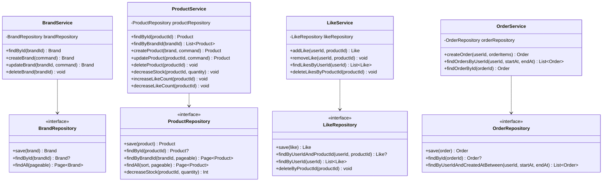

# 03. 클래스 다이어그램 (도메인 객체 설계)

---

## 왜 이 다이어그램이 필요한가

- 도메인 객체 간 **책임과 의존 방향**을 검증한다
- 각 엔티티가 어떤 **필드와 행위**를 가지는지 정의한다
- `@Embedded VO`, 상속(BaseEntity) 등 **설계 패턴 적용 지점**을 명확히 한다
- DTO 분리 전략과 각 레이어 간 데이터 흐름을 정의한다

---

## 1. 핵심 도메인 클래스 다이어그램


### 이 다이어그램에서 봐야 할 포인트

1. **모든 엔티티가 BaseEntity를 상속**: `id`, `createdAt`, `updatedAt`, `deletedAt` 공통 관리. Soft Delete는 `delete()` 메서드로 통일
2. **Product의 행위**: `decreaseStock()`, `isOrderable()` 등 **비즈니스 규칙이 엔티티 내부에 위치** (1주차 User 패턴과 동일)
3. **@Embedded VO**: `ProductSnapshot`과 `PriceSnapshot`은 OrderItem에 내장. 물리적으로는 같은 테이블, 논리적으로 분리
4. **의존 방향**: Product → Brand 방향 (brandId FK). Order → OrderItem 방향 (1:N 컴포지션)
5. **User 포함**: 1주차에 완성된 User 엔티티. Like와 Order가 userId로 참조
6. **Like는 독립**: User-Product 매핑 테이블. FK만 보유하고 행위 없음. BaseEntity를 상속하여 `id`, `createdAt`을 사용하지만 `updatedAt`, `deletedAt`은 실질적으로 사용하지 않는다 (물리 삭제이므로). 프로젝트 컨벤션 일관성을 위해 상속 유지

---

## 2. 서비스 레이어 구조



### 이 다이어그램에서 봐야 할 포인트

1. **DIP 적용**: Service는 Repository **인터페이스**에만 의존. 구현체(JPA)는 infrastructure 레이어에 위치
2. **서비스는 자기 도메인만 관리**: ProductService가 Like를 직접 다루지 않음. 조합은 Facade 책임
3. **decreaseStock 반환값**: `Int` (affected rows) — 0이면 재고 부족

---

## 3. Facade 레이어 (도메인 서비스 조합)


### 이 다이어그램에서 봐야 할 포인트

1. **OrderFacade**: 주문 생성 시 ProductService(재고 차감) + OrderService(주문 생성) 조합
2. **BrandFacade**: 브랜드 삭제 시 Like 삭제 → Product 삭제 → Brand 삭제 순서 조합
3. **LikeFacade**: 좋아요 등록 시 상품 존재 확인(ProductService) + 좋아요 생성(LikeService) + 좋아요 수 증가(ProductService)
4. **Facade는 비즈니스 로직을 갖지 않음**: 도메인 서비스의 호출 순서와 조합만 담당

---

## 4. Product 엔티티 상세 — 행위 중심 설계


### 엔티티 내 검증 규칙 (init 블록)

| 필드 | 검증 규칙 |
|------|----------|
| `name` | 공백 불가 |
| `price` | 0 이상 |
| `stockQuantity` | 0 이상 |
| `brandId` | null 불가 |

---

## 5. DTO 분리 전략

> 멘토 피드백: "DTO는 따로 만들어야 한다" — Entity를 직접 응답하지 않고, 레이어별 전용 객체를 사용

```
요청: Client → Controller (Dto.Request) → Facade (Command) → Service (Entity)
응답: Service (Entity) → Facade (Info) → Controller (Dto.Response) → Client
```

| 객체 | 위치 | 방향 | 역할 | 예시 |
|------|------|------|------|------|
| `*Dto.Request` | interfaces | 요청 → | HTTP 요청 역직렬화 + Bean Validation | `ProductV1Dto.CreateRequest` |
| `*Command` | application | 요청 → | 비즈니스 의도를 담은 명령 객체 | `CreateProductCommand` |
| Entity | domain | — | 비즈니스 로직 + 영속성 | `Product`, `Order` |
| `*Info` | application | ← 응답 | Facade → Controller 응답 전달 | `ProductInfo`, `OrderInfo` |
| `*Dto.Response` | interfaces | ← 응답 | HTTP 응답 직렬화 | `ProductV1Dto.Response` |

### 왜 분리하는가

1. **Entity 보호**: Entity가 HTTP 요청/응답에 직접 노출되면 필드 추가/삭제 시 API가 깨짐
2. **관심사 분리**: Controller는 직렬화, Facade는 조합, Service는 비즈니스에만 집중
3. **테스트 용이**: 각 레이어를 독립적으로 테스트 가능
4. **Entity ≠ Response**: 내부 상태(deletedAt, password 등)가 노출되면 안 됨

### Info 객체 예시

```
ProductInfo {
    id, name, description, price, stockQuantity, likeCount,
    status, displayYn, imageUrl, brandId, brandName
}

OrderInfo {
    id, orderNumber, totalAmount, orderStatus,
    items: List<OrderItemInfo> {
        productId, quantity,
        productSnapshot: { productName, brandName, imageUrl },
        priceSnapshot: { originalPrice, discountAmount, finalPrice }
    }
}
```

---

## 6. 향후 확장 가능 구조 (참고)

> 현재 과제에서는 구현하지 않는다. 인터페이스 기반 설계로 확장 여지만 남겨둔다.

| 영역 | 현재 | 확장 방식 |
|------|------|----------|
| 할인 정책 | 할인 없이 원가 주문 | `DiscountPolicy` 인터페이스 + 구현체 추가 (OCP) |
| 결제 | 주문 생성 = 완료 | `PaymentGateway` 인터페이스 연동 |
| 장바구니 | 직접 주문 | Cart 도메인 + `buyNowYn` 플래그 |
| 취소/반품/환불 | 미지원 | OrderItem 단위 상태 관리 + OrderClaim + OrderRefund |
| 추천/랭킹 | likeCount 기반 인기순 정렬 | 별도 이벤트/집계 테이블 + 비동기 파이프라인 |

---

## 7. 패키지 구조 (commerce-api 기준)

```
apps/commerce-api/src/main/kotlin/com/loopers/
├── interfaces/api/
│   ├── brand/
│   │   ├── BrandV1Controller.kt          (대고객)
│   │   ├── BrandAdminV1Controller.kt     (어드민)
│   │   ├── BrandV1ApiSpec.kt
│   │   └── BrandV1Dto.kt
│   ├── product/
│   │   ├── ProductV1Controller.kt
│   │   ├── ProductAdminV1Controller.kt
│   │   ├── ProductV1ApiSpec.kt
│   │   └── ProductV1Dto.kt
│   ├── like/
│   │   ├── LikeV1Controller.kt
│   │   ├── LikeV1ApiSpec.kt
│   │   └── LikeV1Dto.kt
│   └── order/
│       ├── OrderV1Controller.kt
│       ├── OrderAdminV1Controller.kt
│       ├── OrderV1ApiSpec.kt
│       └── OrderV1Dto.kt
├── application/
│   ├── brand/
│   │   ├── BrandFacade.kt
│   │   └── BrandInfo.kt
│   ├── product/
│   │   ├── ProductFacade.kt
│   │   └── ProductInfo.kt
│   ├── like/
│   │   ├── LikeFacade.kt
│   │   └── LikeInfo.kt
│   └── order/
│       ├── OrderFacade.kt
│       └── OrderInfo.kt
├── domain/
│   ├── brand/
│   │   ├── Brand.kt
│   │   ├── BrandService.kt
│   │   └── BrandRepository.kt           (인터페이스)
│   ├── product/
│   │   ├── Product.kt
│   │   ├── ProductStatus.kt
│   │   ├── ProductService.kt
│   │   └── ProductRepository.kt
│   ├── like/
│   │   ├── Like.kt
│   │   ├── LikeService.kt
│   │   └── LikeRepository.kt
│   └── order/
│       ├── Order.kt
│       ├── OrderItem.kt
│       ├── OrderStatus.kt
│       ├── ProductSnapshot.kt            (@Embeddable)
│       ├── PriceSnapshot.kt              (@Embeddable)
│       ├── OrderService.kt
│       └── OrderRepository.kt
└── infrastructure/
    ├── brand/
    │   ├── BrandRepositoryImpl.kt
    │   └── BrandJpaRepository.kt
    ├── product/
    │   ├── ProductRepositoryImpl.kt
    │   └── ProductJpaRepository.kt
    ├── like/
    │   ├── LikeRepositoryImpl.kt
    │   └── LikeJpaRepository.kt
    └── order/
        ├── OrderRepositoryImpl.kt
        └── OrderJpaRepository.kt
```
