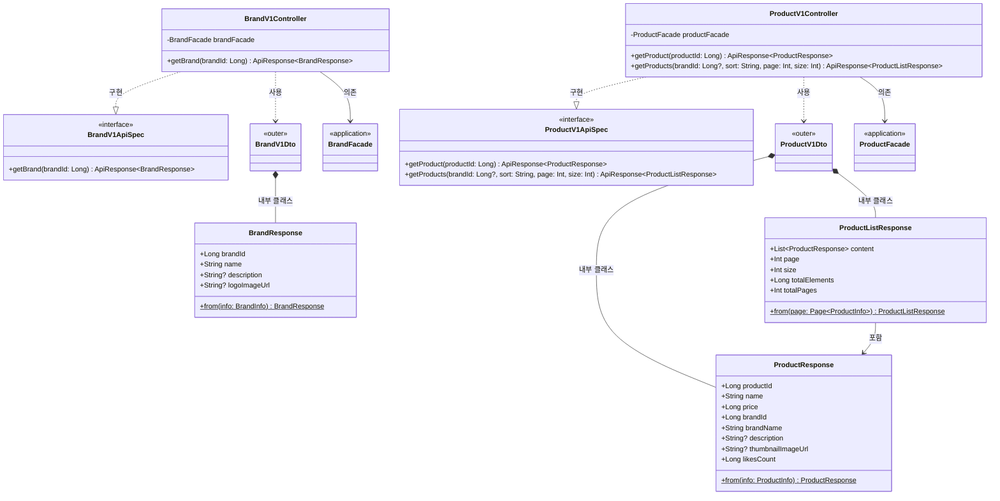

# 전체 클래스 다이어그램

이 문서는 프로젝트의 모든 도메인(유저, 브랜드-상품, 브랜드-상품 Admin, 좋아요, 주문, 주문 Admin)의 클래스 다이어그램을 통합한 문서입니다.

## 목차

1. [유저](#1-유저)
2. [브랜드 & 상품](#2-브랜드--상품)
3. [브랜드 & 상품 Admin](#3-브랜드--상품-admin)
4. [좋아요](#4-좋아요)
5. [주문](#5-주문)
6. [주문 Admin](#6-주문-admin)

---

# 1. 유저


## 개요

이 문서는 유저 도메인의 레이어별 클래스 구조를 Mermaid 클래스 다이어그램으로 표현합니다.
Round2에서는 기존 `member` 패키지 구조를 유지하면서, 인증 방식을 JWT에서 헤더 기반으로 변경하는 것이 핵심입니다.
API 경로는 `/api/v1/users`로 변경되지만, 내부 클래스명은 `Member*` 네이밍을 유지합니다.

---

## 1. 전체 레이어 관계


### 레이어 의존 방향

```
Interfaces → Application → Domain ← Infrastructure
                                  ← Support (유틸리티)
```

- **Interfaces**: Controller가 Facade를 호출하고, ApiSpec 인터페이스를 구현합니다.
- **Application**: Facade가 Service와 BCryptPasswordEncoder를 조합하고, Info DTO로 데이터를 전달합니다.
- **Domain**: Model(엔티티), Service, Repository 인터페이스, AuthenticatedMember가 위치합니다.
- **Infrastructure**: HeaderAuthenticationFilter, Repository 구현체, JPA Repository, BCryptPasswordEncoder가 위치합니다.
- **Support**: PasswordValidator, MaskingUtils 등 도메인에 종속되지 않는 유틸리티가 위치합니다.

---

## 2. Domain 레이어 상세


### 클래스 설명

| 클래스 | 역할 | 주요 메서드 |
|--------|------|-----------|
| `BaseEntity` | 모든 엔티티의 공통 부모 클래스. id, 생성/수정/삭제 시각을 자동 관리합니다. `@PrePersist`와 `@PreUpdate`에서 타임스탬프를 갱신합니다. | `delete()`, `restore()`, `guard()` |
| `MemberModel` | 회원 JPA 엔티티(테이블: `member`). 생성자에서 loginId, name, email, birthDate의 형식을 검증하며, 비밀번호 변경 비즈니스 메서드를 포함합니다. | `changePassword()`, `validateLoginId()`, `validateName()`, `validateEmail()`, `validateBirthDate()` |
| `MemberRepository` | 회원 Repository 인터페이스. 도메인 레이어에 위치하여 인프라 구현과 분리됩니다. | `existsByLoginId()`, `save()`, `findByLoginId()`, `findById()` |
| `MemberService` | 회원 도메인 서비스. 회원 조회, 가입(중복 검사 포함), 비밀번호 변경을 담당합니다. 조회 실패 시 `CoreException(NOT_FOUND)`을 발생시킵니다. | `findById()`, `signUp()`, `changePassword()` |
| `AuthenticatedMember` | 인증 필터에서 검증된 유저 정보를 컨트롤러로 전달하는 데이터 클래스입니다. 요청 속성(attribute)으로 설정됩니다. | - |

### MemberModel 검증 규칙

| 검증 메서드 | 대상 필드 | 규칙 |
|------------|----------|------|
| `validateLoginId()` | loginId | 비어있지 않을 것, 4~20자, 영문 소문자/숫자/언더스코어만 허용 (`^[a-z0-9_]+$`) |
| `validateName()` | name | 비어있지 않을 것, 2~50자, 한글 또는 영문만 허용 (`^[가-힣a-zA-Z\\s]+$`) |
| `validateEmail()` | email | 비어있지 않을 것, 이메일 형식 (`^[a-zA-Z0-9._%+-]+@[a-zA-Z0-9.-]+\\.[a-zA-Z]{2,}$`) |
| `validateBirthDate()` | birthDate | 미래 날짜 불가 |

---

## 3. Application 레이어 상세


### 클래스 설명

| 클래스 | 역할 | 주요 메서드 |
|--------|------|-----------|
| `MemberFacade` | 회원 관련 비즈니스 로직을 조합합니다. MemberService로 도메인 로직을 실행하고, BCryptPasswordEncoder로 비밀번호를 해싱/검증하며, PasswordValidator로 새 비밀번호를 검증합니다. | `getMyInfo()`, `signUp()`, `changePassword()` |
| `MemberInfo` | Facade와 Controller 사이에서 데이터를 전달하는 DTO입니다. MemberModel로부터 `from()` 팩토리 메서드로 생성됩니다. | `from(MemberModel)` |

### MemberFacade 메서드별 책임

| 메서드 | 책임 |
|--------|------|
| `getMyInfo(memberId)` | Service에서 유저 조회 -> MemberInfo로 변환 |
| `signUp(request)` | 비밀번호 BCrypt 해싱 -> Service에서 중복 검사 및 저장 -> MemberInfo로 변환 |
| `changePassword(memberId, currentPlainPassword, newPassword)` | 현재/새 비밀번호 동일 여부 검사 -> 유저 조회 -> PasswordValidator로 새 비밀번호 검증 -> BCrypt 해싱 -> Service에서 저장 |

---

## 4. Interfaces 레이어 상세


### 클래스 설명

| 클래스 | 역할 | 주요 메서드 |
|--------|------|-----------|
| `MemberV1ApiSpec` | 회원 API의 Swagger 문서화를 위한 인터페이스입니다. `@Tag`, `@Operation` 어노테이션을 정의합니다. | `getMyInfo()`, `signUp()`, `changePassword()` |
| `MemberV1Controller` | 회원 REST API 컨트롤러(`@RequestMapping("/api/v1/users")`). MemberV1ApiSpec을 구현하고, MemberFacade를 호출합니다. 인증이 필요한 엔드포인트에서는 요청 속성에서 `AuthenticatedMember`를 추출합니다. | `getMyInfo()`, `signUp()`, `changePassword()` |
| `MemberV1Dto` | 회원 API의 요청/응답 DTO를 포함하는 외부 클래스입니다. | - |
| `SignUpRequest` | 회원가입 요청 DTO. `init` 블록에서 `PasswordValidator.validatePassword()`를 호출하여 비밀번호를 검증합니다. | - |
| `SignUpResponse` | 회원가입 응답 DTO. MemberInfo로부터 id, loginId, name, email을 추출합니다. | `from(MemberInfo)` |
| `ChangePasswordRequest` | 비밀번호 변경 요청 DTO. Round2에서는 `newPassword`만 포함합니다 (현재 비밀번호는 인증 헤더로 전달). | - |
| `MyInfoResponse` | 내 정보 조회 응답 DTO. `MaskingUtils`를 사용하여 이름과 이메일을 마스킹합니다. | `from(MemberInfo)` |

### Round1 대비 변경 사항

| 항목 | Round1 | Round2 |
|------|--------|--------|
| `@RequestMapping` | `/api/v1/members` | `/api/v1/users` |
| 회원가입 매핑 | `@PostMapping("/sign-up")` | `@PostMapping` (루트) |
| 비밀번호 변경 매핑 | `@PatchMapping("/me/password")` | `@PutMapping("/password")` |
| `ChangePasswordRequest` 필드 | currentPassword, newPassword | newPassword만 |
| 인증 정보 추출 | `JwtAuthenticationFilter.AUTHENTICATED_MEMBER_ATTRIBUTE` | `HeaderAuthenticationFilter.AUTHENTICATED_MEMBER_ATTRIBUTE` |

---

## 5. Infrastructure 레이어 상세


### 클래스 설명

| 클래스 | 역할 | 주요 메서드 |
|--------|------|-----------|
| `MemberRepositoryImpl` | MemberRepository 인터페이스의 구현체. MemberJpaRepository에 위임합니다. `findById()`는 `Optional`을 nullable로 변환합니다. | `existsByLoginId()`, `save()`, `findByLoginId()`, `findById()` |
| `MemberJpaRepository` | Spring Data JPA의 `JpaRepository<MemberModel, Long>`을 확장하는 인터페이스입니다. Spring Data가 쿼리 메서드를 자동 생성합니다. | `existsByLoginId()`, `findByLoginId()` |
| `BCryptPasswordEncoder` | BCrypt 알고리즘으로 비밀번호를 해싱하고 매칭합니다. `org.mindrot.jbcrypt.BCrypt`를 사용합니다. | `encode()`, `matches()` |
| `HeaderAuthenticationFilter` | (신규) HTTP 헤더 기반 인증 필터. `X-Loopers-LoginId`와 `X-Loopers-LoginPw` 헤더로 유저를 인증합니다. 기존 `JwtAuthenticationFilter`를 대체합니다. | `shouldNotFilter()`, `doFilterInternal()`, `writeErrorResponse()` |

### HeaderAuthenticationFilter 상세 설계

| 상수/필드 | 값 | 설명 |
|----------|-----|------|
| `HEADER_LOGIN_ID` | `"X-Loopers-LoginId"` | 로그인 ID 헤더명 |
| `HEADER_LOGIN_PW` | `"X-Loopers-LoginPw"` | 비밀번호 헤더명 |
| `AUTHENTICATED_PATHS` | `["/api/v1/users/me", "/api/v1/users/password"]` | 인증이 필요한 경로 목록 |
| `AUTHENTICATED_MEMBER_ATTRIBUTE` | `"authenticatedMember"` | 요청 속성에 설정되는 인증 정보의 키 |

---

## 6. Support 레이어 상세


### 클래스 설명

| 클래스 | 역할 | 주요 메서드 |
|--------|------|-----------|
| `PasswordValidator` | Kotlin `object`(싱글턴). 비밀번호의 7가지 검증 규칙을 담당합니다. 검증 실패 시 `CoreException(BAD_REQUEST)`을 발생시킵니다. | `validatePassword()`, `containsBirthDate()` |
| `MaskingUtils` | Kotlin `object`(싱글턴). 개인정보(이름, 이메일) 마스킹을 담당합니다. | `maskName()`, `maskEmail()` |
| `CoreException` | 비즈니스 예외를 표현하는 커스텀 예외 클래스입니다. `ErrorType`과 선택적 커스텀 메시지를 포함합니다. | - |
| `ErrorType` | HTTP 상태 코드, 에러 코드, 기본 메시지를 정의하는 열거형입니다. `ApiControllerAdvice`에서 에러 응답 생성에 사용됩니다. | - |

---

## 품질 체크리스트

- [x] 도메인 모델(Model)에 비즈니스 로직과 검증 메서드가 포함되어 있는가? (MemberModel: changePassword, validateLoginId, validateName, validateEmail, validateBirthDate)
- [x] 여러 도메인이 관련된 경우, 도메인 간 참조 관계가 명확히 표현되어 있는가? (유저 도메인은 단일 도메인이므로 해당 없음)
- [x] Facade가 조합하는 여러 Service 의존성이 모두 표현되어 있는가? (MemberFacade -> MemberService, BCryptPasswordEncoder, PasswordValidator)
- [x] 각 레이어(Domain, Application, Interfaces, Infrastructure, Support)의 클래스가 모두 포함되어 있는가?
- [x] 클래스 간 관계(상속, 구현, 의존, 컴포지션)가 정확히 표현되어 있는가?

---

# 2. 브랜드 & 상품


## 개요

이 문서는 브랜드 & 상품 대고객 조회 API의 레이어별 클래스 구조를 Mermaid 클래스 다이어그램으로 표현합니다.
프로젝트의 기존 패턴(MemberModel, MemberService 등)을 따르며, Brand-Product 간 1:N 관계를 반영합니다.

---

## 1. 전체 레이어 관계


### 레이어 의존 방향

```
Interfaces → Application → Domain ← Infrastructure
```

- **Interfaces**: Controller가 Facade를 호출하고, ApiSpec 인터페이스를 구현합니다.
- **Application**: Facade가 Service를 조합하고, Info DTO로 데이터를 전달합니다.
- **Domain**: Model(엔티티), Service, Repository 인터페이스가 위치합니다. 비즈니스 로직의 핵심입니다.
- **Infrastructure**: Repository 인터페이스의 구현체와 JPA Repository가 위치합니다.

---

## 2. Domain 레이어 상세


### 클래스 설명

| 클래스 | 역할 | 주요 메서드 |
|--------|------|-----------|
| `BaseEntity` | 모든 엔티티의 공통 부모 클래스. id, 생성/수정/삭제 시각을 자동 관리합니다. | `delete()`, `restore()`, `guard()` |
| `BrandModel` | 브랜드 JPA 엔티티. 브랜드명 검증 로직을 포함합니다. | `validateName()` |
| `ProductModel` | 상품 JPA 엔티티. Brand와 ManyToOne 관계를 가지며, 상품명/가격/좋아요수 검증 로직을 포함합니다. | `validateName()`, `validatePrice()`, `validateLikesCount()` |
| `BrandRepository` | 브랜드 Repository 인터페이스. 도메인 레이어에 위치하여 인프라 구현과 분리됩니다. | `findByIdAndDeletedAtIsNull()` |
| `ProductRepository` | 상품 Repository 인터페이스. 조건부 조회(필터, 정렬, 페이징)를 지원합니다. | `findByIdAndDeletedAtIsNull()`, `findAllByCondition()` |
| `BrandService` | 브랜드 도메인 서비스. 브랜드 조회 시 존재하지 않으면 `CoreException(NOT_FOUND)`을 발생시킵니다. | `findById()` |
| `ProductService` | 상품 도메인 서비스. 상품 단건/목록 조회를 담당합니다. | `findById()`, `findAll()` |

---

## 3. Application 레이어 상세


### 클래스 설명

| 클래스 | 역할 | 주요 메서드 |
|--------|------|-----------|
| `BrandFacade` | 브랜드 Service를 호출하고, 결과를 BrandInfo로 변환하여 Controller에 전달합니다. | `getBrandInfo()` |
| `BrandInfo` | Facade와 Controller 사이에서 데이터를 전달하는 DTO입니다. BrandModel로부터 생성됩니다. | `from(BrandModel)` |
| `ProductFacade` | 상품 Service를 호출하고, 결과를 ProductInfo로 변환합니다. Brand 관계를 통해 brandName을 포함합니다. | `getProductInfo()`, `getProductList()` |
| `ProductInfo` | Facade와 Controller 사이에서 데이터를 전달하는 DTO입니다. ProductModel의 Brand 관계에서 brandName을 추출합니다. | `from(ProductModel)` |

---

## 4. Interfaces 레이어 상세



### 클래스 설명

| 클래스 | 역할 | 주요 메서드 |
|--------|------|-----------|
| `BrandV1ApiSpec` | 브랜드 API의 Swagger 문서화를 위한 인터페이스입니다. `@Tag`, `@Operation` 어노테이션을 정의합니다. | `getBrand()` |
| `BrandV1Controller` | 브랜드 REST API 컨트롤러. BrandV1ApiSpec을 구현하고, BrandFacade를 호출합니다. | `getBrand()` |
| `BrandV1Dto` | 브랜드 API의 응답 DTO를 포함하는 외부 클래스입니다. | - |
| `BrandResponse` | 브랜드 조회 응답 DTO. BrandInfo로부터 변환됩니다. | `from(BrandInfo)` |
| `ProductV1ApiSpec` | 상품 API의 Swagger 문서화를 위한 인터페이스입니다. | `getProduct()`, `getProducts()` |
| `ProductV1Controller` | 상품 REST API 컨트롤러. 쿼리 파라미터 검증(sort, page, size) 후 ProductFacade를 호출합니다. | `getProduct()`, `getProducts()` |
| `ProductV1Dto` | 상품 API의 요청/응답 DTO를 포함하는 외부 클래스입니다. | - |
| `ProductResponse` | 상품 단건 조회 응답 DTO. brandName을 포함합니다. | `from(ProductInfo)` |
| `ProductListResponse` | 상품 목록 조회 응답 DTO. Spring Page의 메타 정보(page, size, totalElements, totalPages)와 content를 포함합니다. | `from(Page<ProductInfo>)` |

---

## 5. Infrastructure 레이어 상세


### 클래스 설명

| 클래스 | 역할 | 주요 메서드 |
|--------|------|-----------|
| `BrandRepositoryImpl` | BrandRepository 인터페이스의 구현체. BrandJpaRepository에 위임합니다. | `findByIdAndDeletedAtIsNull()` |
| `BrandJpaRepository` | Spring Data JPA의 `JpaRepository<BrandModel, Long>`을 확장하는 인터페이스입니다. | `findByIdAndDeletedAtIsNull()` |
| `ProductRepositoryImpl` | ProductRepository 인터페이스의 구현체. 정렬 기준에 따라 Pageable을 구성하고 JpaRepository에 위임합니다. | `findByIdAndDeletedAtIsNull()`, `findAllByCondition()` |
| `ProductJpaRepository` | Spring Data JPA의 `JpaRepository<ProductModel, Long>`을 확장하는 인터페이스입니다. deletedAt과 Brand의 deletedAt 필터링을 포함합니다. | `findByIdAndDeletedAtIsNull()`, `findAllByDeletedAtIsNullAndBrand_DeletedAtIsNull()` |

---

## 6. Brand-Product 도메인 관계


---

## 품질 체크리스트

- [x] 도메인 모델(Model)에 비즈니스 로직과 검증 메서드가 포함되어 있는가? (BrandModel: validateName, ProductModel: validateName/validatePrice/validateLikesCount)
- [x] 여러 도메인이 관련된 경우, 도메인 간 참조 관계가 명확히 표현되어 있는가? (ProductModel → BrandModel: ManyToOne)
- [x] Facade가 조합하는 여러 Service 의존성이 모두 표현되어 있는가? (BrandFacade → BrandService, ProductFacade → ProductService)
- [x] 각 레이어(Domain, Application, Interfaces, Infrastructure)의 클래스가 모두 포함되어 있는가?
- [x] 클래스 간 관계(상속, 구현, 의존, 컴포지션)가 정확히 표현되어 있는가?

---

# 3. 브랜드 & 상품 Admin


## 개요

이 문서는 브랜드 & 상품 Admin API의 클래스 구조를 레이어별 Mermaid 클래스 다이어그램으로 표현합니다.
프로젝트의 레이어드 아키텍처(Interfaces → Application → Domain ← Infrastructure)에 따라
각 레이어의 클래스와 의존 관계를 정의합니다.

---

## 1. 전체 레이어 관계


### 레이어간 의존 방향

```
Interfaces (Controller, DTO)
    ↓ 의존
Application (Facade, Info)
    ↓ 의존
Domain (Model, Service, Repository 인터페이스)
    ↑ 구현
Infrastructure (RepositoryImpl, JpaRepository, Filter)
```

---

## 2. Domain 레이어 상세

### 2.1 엔티티 및 Enum


### 2.2 서비스 및 레포지토리


### 클래스 설명

| 클래스 | 역할 | 주요 메서드 |
|--------|------|-----------|
| `BaseEntity` | 모든 엔티티의 공통 기반 클래스. ID, 생성/수정/삭제 시각을 관리 | `delete()`, `restore()`, `guard()` |
| `BrandModel` | 브랜드 도메인 엔티티. init 블록에서 필드 검증, 비즈니스 메서드 포함 | `updateInfo()`, `isActive()` |
| `ProductModel` | 상품 도메인 엔티티. init 블록에서 필드 검증, 브랜드 ID를 FK로 참조 | `updateInfo()`, `isSelling()`, `isVisible()` |
| `BrandStatus` | 브랜드 활성 상태 (ACTIVE, INACTIVE) | - |
| `SaleStatus` | 상품 판매 상태 (SELLING, STOP_SELLING) | - |
| `DisplayStatus` | 상품 노출 상태 (VISIBLE, HIDDEN) | - |
| `BrandService` | 브랜드 도메인 서비스. CRUD + 중복 검증 로직 | `create()`, `findById()`, `delete()` |
| `ProductService` | 상품 도메인 서비스. CRUD + 브랜드별 연쇄 삭제 로직 | `create()`, `softDeleteAllByBrandId()` |
| `BrandRepository` | 브랜드 영속성 인터페이스 (도메인 계층에 정의) | `existsByName()`, `countProductsByBrandId()` |
| `ProductRepository` | 상품 영속성 인터페이스 (도메인 계층에 정의) | `findAllByBrandId()`, `saveAll()` |

---

## 3. Application 레이어 상세


### 클래스 설명

| 클래스 | 역할 | 핵심 책임 |
|--------|------|----------|
| `BrandFacade` | 브랜드 CRUD 오케스트레이션. 삭제 시 ProductService를 통해 연쇄 삭제 수행 | 브랜드명 중복 검증 조율, 연쇄 삭제 트랜잭션 관리 |
| `ProductFacade` | 상품 CRUD 오케스트레이션. 등록 시 BrandService를 통해 브랜드 존재/활성 검증 | 브랜드 활성 상태 검증, 상품-브랜드 정보 조합 |
| `BrandInfo` | Facade → Controller 간 브랜드 정보 전달 객체. 상품 수(productCount) 포함 | `from()` 팩토리 메서드로 Model → Info 변환 |
| `ProductInfo` | Facade → Controller 간 상품 정보 전달 객체. 브랜드 요약 정보 포함 | `from()` 팩토리 메서드로 Model → Info 변환 |
| `BrandSummary` | 상품 응답에 포함되는 브랜드 요약 정보 (brandId, name만 포함) | ProductInfo의 내부 구성 요소 |

### Facade 의존성 관계

```
BrandFacade
  ├── BrandService    (브랜드 CRUD)
  └── ProductService  (브랜드 삭제 시 소속 상품 연쇄 삭제)

ProductFacade
  ├── ProductService  (상품 CRUD)
  └── BrandService    (상품 등록 시 브랜드 존재/활성 검증, 상품 조회 시 브랜드 정보 조회)
```

---

## 4. Interfaces 레이어 상세

### 4.1 브랜드 API


### 4.2 상품 API


### 클래스 설명

| 클래스 | 역할 |
|--------|------|
| `AdminBrandV1ApiSpec` | 브랜드 어드민 API의 OpenAPI 스펙 인터페이스 (@Tag, @Operation 애노테이션) |
| `AdminBrandV1Controller` | 브랜드 어드민 API 컨트롤러. ApiSpec을 구현하고 BrandFacade에 위임 |
| `AdminProductV1ApiSpec` | 상품 어드민 API의 OpenAPI 스펙 인터페이스 |
| `AdminProductV1Controller` | 상품 어드민 API 컨트롤러. ApiSpec을 구현하고 ProductFacade에 위임 |
| `CreateBrandRequest` | 브랜드 등록 요청 DTO. init 블록에서 name 필수, 길이, logoUrl 형식 검증 |
| `UpdateBrandRequest` | 브랜드 수정 요청 DTO. init 블록에서 name, status 검증 |
| `CreateProductRequest` | 상품 등록 요청 DTO. init 블록에서 name, price 범위, 재고, 상태 값 검증 |
| `UpdateProductRequest` | 상품 수정 요청 DTO. brandId를 포함하지 않음 (브랜드 변경 불가) |
| `BrandResponse` | 브랜드 응답 DTO. productCount 포함 |
| `ProductResponse` | 상품 응답 DTO. 브랜드 요약 정보(BrandSummaryResponse) 포함 |
| `BrandListResponse` | 브랜드 목록 페이징 응답 DTO |
| `ProductListResponse` | 상품 목록 페이징 응답 DTO |

---

## 5. Infrastructure 레이어 상세


### 클래스 설명

| 클래스 | 역할 |
|--------|------|
| `BrandRepositoryImpl` | BrandRepository 인터페이스의 구현체. BrandJpaRepository에 위임 |
| `BrandJpaRepository` | Spring Data JPA 인터페이스. 소프트 삭제 조건(`deletedAtIsNull`)이 포함된 쿼리 메서드 |
| `ProductRepositoryImpl` | ProductRepository 인터페이스의 구현체. ProductJpaRepository에 위임 |
| `ProductJpaRepository` | Spring Data JPA 인터페이스. 브랜드별 필터링 및 소프트 삭제 조건 포함 |
| `AdminLdapAuthenticationFilter` | 어드민 LDAP 인증 필터. `/api-admin/v1/**` 경로에만 적용, `X-Loopers-Ldap` 헤더 검증 |

### JpaRepository 쿼리 메서드 네이밍 규칙

| 메서드 패턴 | SQL 의미 |
|------------|---------|
| `findByIdAndDeletedAtIsNull(id)` | `WHERE id = ? AND deleted_at IS NULL` |
| `findAllByDeletedAtIsNull(pageable)` | `WHERE deleted_at IS NULL LIMIT ? OFFSET ?` |
| `existsByNameAndDeletedAtIsNull(name)` | `SELECT EXISTS (... WHERE name = ? AND deleted_at IS NULL)` |
| `existsByNameAndIdNotAndDeletedAtIsNull(name, id)` | `SELECT EXISTS (... WHERE name = ? AND id != ? AND deleted_at IS NULL)` |
| `findAllByBrandIdAndDeletedAtIsNull(brandId, pageable)` | `WHERE brand_id = ? AND deleted_at IS NULL LIMIT ? OFFSET ?` |
| `countByBrandIdAndDeletedAtIsNull(brandId)` | `SELECT COUNT(*) WHERE brand_id = ? AND deleted_at IS NULL` |

---

## 6. 에러 처리 구조


### 에러 처리 흐름

```
서비스/퍼사드/DTO에서 CoreException 발생
    → ApiControllerAdvice가 @ExceptionHandler로 캐치
    → ErrorType의 status, code, message를 사용하여 ApiResponse.fail() 생성
    → ResponseEntity에 적절한 HTTP 상태 코드와 함께 반환
```

### 브랜드-상품 Admin에서 사용하는 에러 타입

| ErrorType | 사용 상황 |
|-----------|----------|
| `UNAUTHORIZED` | LDAP 헤더 누락/불일치 |
| `BAD_REQUEST` | 입력값 검증 실패, 비활성 브랜드에 상품 등록 시도 |
| `NOT_FOUND` | 존재하지 않는 브랜드/상품 조회/수정/삭제 |
| `CONFLICT` | 중복 브랜드명으로 등록/수정 시도 |

---

## 7. 도메인 간 관계 다이어그램

```mermaid
classDiagram
    direction LR

    class BrandModel {
        +Long id
        +String name
        +BrandStatus status
    }

    class ProductModel {
        +Long id
        +String name
        +Long price
        +Long brandId
        +SaleStatus saleStatus
        +DisplayStatus displayStatus
    }

    class MemberModel {
        <<existing>>
        +Long id
        +String loginId
    }

    class LikeModel {
        <<future>>
        +Long id
        +Long memberId
        +Long productId
    }

    class OrderModel {
        <<future>>
        +Long id
        +Long memberId
    }

    class OrderItemModel {
        <<future>>
        +Long id
        +Long orderId
        +Long productId
        +String productNameSnapshot
        +Long priceSnapshot
    }

    BrandModel "1" --> "*" ProductModel : 1:N (brandId FK)
    MemberModel "1" --> "*" LikeModel : 1:N (memberId FK)
    ProductModel "1" --> "*" LikeModel : 1:N (productId FK)
    MemberModel "1" --> "*" OrderModel : 1:N (memberId FK)
    OrderModel "1" --> "*" OrderItemModel : 1:N (orderId FK)
    ProductModel "1" --> "*" OrderItemModel : 1:N (productId FK)

    note for OrderItemModel "주문 시점의 상품 정보를\n스냅샷으로 보존\n(productNameSnapshot,\npriceSnapshot)"
```

### 도메인 간 참조 관계

| 관계 | 방향 | 참조 방식 | 설명 |
|------|------|----------|------|
| Brand → Product | 1:N | `ProductModel.brandId` (FK) | 하나의 브랜드에 여러 상품 소속 |
| Product → Like | 1:N | `LikeModel.productId` (FK) | 하나의 상품에 여러 좋아요 (향후 구현) |
| Product → OrderItem | 1:N | `OrderItemModel.productId` (FK) | 하나의 상품이 여러 주문 항목에 포함 (향후 구현) |
| OrderItem (스냅샷) | - | `productNameSnapshot`, `priceSnapshot` | 주문 시점의 상품 정보를 별도 컬럼으로 보존 |

---

## 품질 체크리스트

- [x] 도메인 모델(Model)에 비즈니스 로직과 검증 메서드가 포함되어 있는가? (빈약한 도메인 모델 지양)
  - `BrandModel`: `updateInfo()`, `isActive()`, `validateName()` 등 포함
  - `ProductModel`: `updateInfo()`, `isSelling()`, `isVisible()`, `validatePrice()` 등 포함
- [x] 여러 도메인이 관련된 경우, 도메인 간 참조 관계가 명확히 표현되어 있는가?
  - Brand → Product 1:N 관계, Product → Like/OrderItem 향후 관계 표현
- [x] Facade가 조합하는 여러 Service 의존성이 모두 표현되어 있는가?
  - `BrandFacade` → BrandService + ProductService
  - `ProductFacade` → ProductService + BrandService
- [x] 각 레이어(Domain, Application, Interfaces, Infrastructure)의 클래스가 모두 포함되어 있는가?
- [x] 클래스 간 관계(상속, 구현, 의존, 컴포지션)가 정확히 표현되어 있는가?
  - 상속: `BaseEntity <|-- BrandModel`, `OncePerRequestFilter <|-- AdminLdapAuthenticationFilter`
  - 구현: `BrandRepositoryImpl ..|> BrandRepository`, `AdminBrandV1Controller ..|> AdminBrandV1ApiSpec`
  - 의존: `BrandFacade --> BrandService`, `ProductFacade --> BrandService`
  - 컴포지션: `AdminBrandV1Dto *-- CreateBrandRequest`, `ProductResponse *-- BrandSummaryResponse`

---

# 4. 좋아요


## 개요

좋아요 기능을 구성하는 클래스들의 구조와 레이어 간 의존 관계를 정의합니다.
좋아요 도메인은 유저(Users)와 상품(Products) 도메인에 의존하며, LikeFacade가 여러 도메인 Service를 조합하여 비즈니스 흐름을 오케스트레이션합니다.

---

## 1. 전체 레이어 관계

```mermaid
classDiagram
    direction TB

    namespace Interfaces {
        class LikeV1ApiSpec
        class LikeV1Controller
        class LikeV1Dto
    }

    namespace Application {
        class LikeFacade
        class LikeInfo
    }

    namespace Domain {
        class LikeModel
        class LikeService
        class LikeRepository
        class MemberService
        class ProductService
    }

    namespace Infrastructure {
        class HeaderAuthFilter
        class LikeRepositoryImpl
        class LikeJpaRepository
    }

    LikeV1Controller ..|> LikeV1ApiSpec : implements
    LikeV1Controller --> LikeFacade : depends
    LikeV1Controller --> LikeV1Dto : uses

    LikeFacade --> LikeService : depends
    LikeFacade --> ProductService : depends
    LikeFacade --> LikeInfo : creates

    LikeService --> LikeRepository : depends

    LikeRepositoryImpl ..|> LikeRepository : implements
    LikeRepositoryImpl --> LikeJpaRepository : depends

    HeaderAuthFilter --> MemberService : depends
```

### 레이어 간 의존 방향

```
Interfaces (Controller, Dto, ApiSpec)
    ↓
Application (Facade, Info)
    ↓
Domain (Model, Service, Repository 인터페이스)
    ↑
Infrastructure (RepositoryImpl, JpaRepository, Filter)
```

- **Interfaces → Application**: Controller가 Facade를 호출합니다.
- **Application → Domain**: Facade가 Service를 조합하고, Info로 결과를 변환합니다.
- **Infrastructure → Domain**: RepositoryImpl이 Repository 인터페이스를 구현하고, Filter가 MemberService를 사용합니다.

---

## 2. Domain 레이어 상세

```mermaid
classDiagram
    class BaseEntity {
        <<abstract>>
        +Long id
        +ZonedDateTime createdAt
        +ZonedDateTime updatedAt
        +ZonedDateTime? deletedAt
        +guard() void
        +delete() void
        +restore() void
    }

    class LikeModel {
        -Long userId
        -Long productId
        +getUserId() Long
        +getProductId() Long
    }

    BaseEntity <|-- LikeModel

    class LikeRepository {
        <<interface>>
        +findByUserIdAndProductId(userId: Long, productId: Long) LikeModel?
        +findByUserIdAndDeletedAtIsNull(userId: Long, pageable: Pageable) Page~LikeModel~
        +save(like: LikeModel) LikeModel
    }

    class LikeService {
        -LikeRepository likeRepository
        +like(userId: Long, productId: Long) void
        +unlike(userId: Long, productId: Long) void
        +findByUserId(userId: Long, pageable: Pageable) Page~LikeModel~
    }

    LikeService --> LikeRepository : depends

    class MemberService {
        -MemberRepository memberRepository
        +findById(id: Long) MemberModel
        +findByLoginId(loginId: String) MemberModel?
    }

    class ProductService {
        -ProductRepository productRepository
        +findById(id: Long) ProductModel
    }

    note for LikeModel "like 테이블\nuser_id + product_id 유니크 제약\nBaseEntity의 delete()/restore()로\n소프트 삭제 및 복원 처리"

    note for LikeService "멱등성 보장:\n- like(): 기록 없음→생성, 삭제됨→복원, 활성→무시\n- unlike(): 활성→삭제, 기록 없음→무시"
```

### 클래스 설명

| 클래스 | 역할 | 주요 메서드 |
|--------|------|-----------|
| `BaseEntity` | 모든 엔티티의 공통 부모 클래스. id, 생성/수정/삭제 시각, 소프트 삭제/복원 메서드 제공 | `delete()`, `restore()`, `guard()` |
| `LikeModel` | 좋아요 도메인 엔티티. 유저 ID와 상품 ID의 쌍으로 좋아요 관계를 표현 | 상속받은 `delete()`, `restore()` 활용 |
| `LikeRepository` | 좋아요 저장소 인터페이스. 도메인 레이어에서 정의하고 인프라 레이어에서 구현 | `findByUserIdAndProductId()`, `findByUserIdAndDeletedAtIsNull()`, `save()` |
| `LikeService` | 좋아요 도메인 서비스. 좋아요 등록/취소의 멱등성 처리와 목록 조회 담당 | `like()`, `unlike()`, `findByUserId()` |
| `MemberService` | 유저 도메인 서비스. 인증 필터에서 유저 조회 및 검증에 사용 (기존 클래스) | `findById()`, `findByLoginId()` |
| `ProductService` | 상품 도메인 서비스. 좋아요 등록 시 상품 존재 및 삭제 여부 검증에 사용 (신규 또는 기존 클래스) | `findById()` |

---

## 3. Application 레이어 상세

```mermaid
classDiagram
    class LikeFacade {
        -LikeService likeService
        -MemberService memberService
        -ProductService productService
        +likeProduct(userId: Long, productId: Long) void
        +unlikeProduct(userId: Long, productId: Long) void
        +getMyLikes(userId: Long, page: Int, size: Int) LikePageInfo
    }

    class LikeInfo {
        +Long likeId
        +LikeProductInfo product
        +ZonedDateTime createdAt
    }

    class LikeProductInfo {
        +Long productId
        +String productName
        +Long price
        +Long brandId
        +String brandName
        +Boolean isDeleted
    }

    class LikePageInfo {
        +List~LikeInfo~ content
        +Int page
        +Int size
        +Long totalElements
        +Int totalPages
    }

    LikeFacade --> LikeService : depends
    LikeFacade --> ProductService : depends
    LikeFacade --> LikeInfo : creates
    LikeFacade --> LikePageInfo : creates

    LikePageInfo *-- LikeInfo : contains
    LikeInfo *-- LikeProductInfo : contains

    note for LikeFacade "여러 도메인 Service를 조합:\n- ProductService로 상품 존재 검증\n- LikeService로 좋아요 등록/취소/조회\n- 결과를 Info 객체로 변환"
```

### 클래스 설명

| 클래스 | 역할 | 주요 메서드 |
|--------|------|-----------|
| `LikeFacade` | 좋아요 비즈니스 흐름 오케스트레이션. ProductService로 상품 검증 후 LikeService로 좋아요 처리 | `likeProduct()`, `unlikeProduct()`, `getMyLikes()` |
| `LikeInfo` | 좋아요 단건 정보. 좋아요 ID, 상품 정보, 등록 시각을 포함 | `from(LikeModel)` companion 메서드 |
| `LikeProductInfo` | 좋아요에 포함되는 상품 정보. 상품명, 가격, 브랜드 정보, 삭제 여부를 포함 | - |
| `LikePageInfo` | 좋아요 목록 페이징 정보. content, page, size, totalElements, totalPages를 포함 | - |

---

## 4. Interfaces 레이어 상세

```mermaid
classDiagram
    class LikeV1ApiSpec {
        <<interface>>
        +likeProduct(request: HttpServletRequest, productId: Long) ApiResponse
        +unlikeProduct(request: HttpServletRequest, productId: Long) ApiResponse
        +getMyLikes(request: HttpServletRequest, userId: Long, page: Int, size: Int) ApiResponse~LikeListResponse~
    }

    class LikeV1Controller {
        -LikeFacade likeFacade
        +likeProduct(request: HttpServletRequest, productId: Long) ApiResponse
        +unlikeProduct(request: HttpServletRequest, productId: Long) ApiResponse
        +getMyLikes(request: HttpServletRequest, userId: Long, page: Int, size: Int) ApiResponse~LikeListResponse~
    }

    LikeV1Controller ..|> LikeV1ApiSpec : implements
    LikeV1Controller --> LikeFacade : depends
    LikeV1Controller --> LikeV1Dto : uses

    class LikeV1Dto {
        <<sealed>>
    }

    class LikeListResponse {
        +List~LikeItemResponse~ content
        +Int page
        +Int size
        +Long totalElements
        +Int totalPages
        +from(LikePageInfo) LikeListResponse
    }

    class LikeItemResponse {
        +Long likeId
        +LikeProductResponse product
        +String createdAt
        +from(LikeInfo) LikeItemResponse
    }

    class LikeProductResponse {
        +Long productId
        +String productName
        +Long price
        +Long brandId
        +String brandName
        +Boolean isDeleted
        +from(LikeProductInfo) LikeProductResponse
    }

    LikeV1Dto *-- LikeListResponse : inner class
    LikeV1Dto *-- LikeItemResponse : inner class
    LikeV1Dto *-- LikeProductResponse : inner class
    LikeListResponse *-- LikeItemResponse : contains
    LikeItemResponse *-- LikeProductResponse : contains

    class ApiResponse~T~ {
        +Metadata meta
        +T? data
        +success() ApiResponse
        +success(data: T) ApiResponse~T~
        +fail(errorCode: String, errorMessage: String) ApiResponse
    }

    LikeV1Controller --> ApiResponse : returns

    note for LikeV1ApiSpec "Swagger @Tag, @Operation 어노테이션으로\nAPI 문서 자동 생성"
    note for LikeV1Controller "@RestController\nPOST /api/v1/products/{productId}/likes\nDELETE /api/v1/products/{productId}/likes\nGET /api/v1/users/{userId}/likes"
```

### 클래스 설명

| 클래스 | 역할 | 주요 메서드 |
|--------|------|-----------|
| `LikeV1ApiSpec` | Swagger 문서화를 위한 API 인터페이스. @Tag, @Operation 어노테이션 포함 | `likeProduct()`, `unlikeProduct()`, `getMyLikes()` |
| `LikeV1Controller` | REST 컨트롤러. ApiSpec을 구현하고 LikeFacade에 위임. 요청 속성에서 인증 유저 정보 추출 | `likeProduct()`, `unlikeProduct()`, `getMyLikes()` |
| `LikeV1Dto` | 요청/응답 DTO 컨테이너. 내부 data class로 Response DTO를 정의 | - |
| `LikeListResponse` | 좋아요 목록 조회 응답. 페이징 정보와 좋아요 항목 목록 포함 | `from(LikePageInfo)` |
| `LikeItemResponse` | 좋아요 단건 응답. 좋아요 ID, 상품 정보, 등록 시각 포함 | `from(LikeInfo)` |
| `LikeProductResponse` | 상품 정보 응답. 상품명, 가격, 브랜드 정보, 삭제 여부 포함 | `from(LikeProductInfo)` |

---

## 5. Infrastructure 레이어 상세

```mermaid
classDiagram
    class LikeRepository {
        <<interface>>
        +findByUserIdAndProductId(userId: Long, productId: Long) LikeModel?
        +findByUserIdAndDeletedAtIsNull(userId: Long, pageable: Pageable) Page~LikeModel~
        +save(like: LikeModel) LikeModel
    }

    class LikeRepositoryImpl {
        -LikeJpaRepository likeJpaRepository
        +findByUserIdAndProductId(userId: Long, productId: Long) LikeModel?
        +findByUserIdAndDeletedAtIsNull(userId: Long, pageable: Pageable) Page~LikeModel~
        +save(like: LikeModel) LikeModel
    }

    class LikeJpaRepository {
        <<interface>>
        +findByUserIdAndProductId(userId: Long, productId: Long) LikeModel?
        +findByUserIdAndDeletedAtIsNull(userId: Long, pageable: Pageable) Page~LikeModel~
    }

    class JpaRepository~T_ID~ {
        <<interface>>
        +save(entity: T) T
        +findById(id: ID) Optional~T~
        +deleteById(id: ID) void
    }

    LikeRepositoryImpl ..|> LikeRepository : implements
    LikeRepositoryImpl --> LikeJpaRepository : depends
    LikeJpaRepository --|> JpaRepository~LikeModel_Long~ : extends

    class HeaderAuthFilter {
        -MemberService memberService
        -BCryptPasswordEncoder passwordEncoder
        -ObjectMapper objectMapper
        +shouldNotFilter(request: HttpServletRequest) Boolean
        #doFilterInternal(request, response, filterChain) void
        -writeErrorResponse(response, errorType, customMessage) void
    }

    class OncePerRequestFilter {
        <<abstract>>
        #doFilterInternal(request, response, filterChain)* void
        +shouldNotFilter(request: HttpServletRequest) Boolean
    }

    HeaderAuthFilter --|> OncePerRequestFilter : extends
    HeaderAuthFilter --> MemberService : depends
    HeaderAuthFilter --> BCryptPasswordEncoder : depends

    class BCryptPasswordEncoder {
        +encode(rawPassword: String) String
        +matches(rawPassword: String, encodedPassword: String) Boolean
    }

    class AuthenticatedMember {
        +Long memberId
        +String loginId
    }

    HeaderAuthFilter --> AuthenticatedMember : creates

    note for LikeRepositoryImpl "@Component\nLikeRepository 인터페이스를 구현하여\n도메인 레이어와 인프라 레이어를 분리"
    note for HeaderAuthFilter "X-Loopers-LoginId, X-Loopers-LoginPw\n헤더를 검증하고 AuthenticatedMember를\n요청 속성에 설정"
    note for LikeJpaRepository "Spring Data JPA 메서드 네이밍 규칙을 활용한\n자동 쿼리 생성"
```

### 클래스 설명

| 클래스 | 역할 | 주요 메서드 |
|--------|------|-----------|
| `LikeRepositoryImpl` | LikeRepository 인터페이스 구현체. LikeJpaRepository에 위임하여 데이터 접근 | `findByUserIdAndProductId()`, `findByUserIdAndDeletedAtIsNull()`, `save()` |
| `LikeJpaRepository` | Spring Data JPA 인터페이스. 메서드 네이밍 규칙으로 쿼리 자동 생성 | `findByUserIdAndProductId()`, `findByUserIdAndDeletedAtIsNull()` |
| `HeaderAuthFilter` | 헤더 기반 인증 필터. `X-Loopers-LoginId/LoginPw` 헤더에서 유저를 인증하고 AuthenticatedMember를 요청 속성에 설정 | `doFilterInternal()`, `shouldNotFilter()` |
| `BCryptPasswordEncoder` | 비밀번호 해싱 및 검증 (기존 클래스) | `encode()`, `matches()` |
| `AuthenticatedMember` | 인증된 유저 정보를 전달하는 데이터 클래스 (기존 클래스) | - |

---

## 6. 도메인 간 참조 관계

```mermaid
classDiagram
    direction LR

    class MemberModel {
        +Long id
        -String loginId
        -String password
        -String name
        -LocalDate birthDate
        -String email
    }

    class LikeModel {
        -Long userId
        -Long productId
    }

    class ProductModel {
        +Long id
        -String name
        -Long price
        -Long brandId
    }

    class BrandModel {
        +Long id
        -String name
    }

    MemberModel "1" -- "0..*" LikeModel : userId로 참조
    ProductModel "1" -- "0..*" LikeModel : productId로 참조
    BrandModel "1" -- "0..*" ProductModel : brandId로 참조

    note for LikeModel "JPA 연관관계(FK)가 아닌\nID 참조 방식으로 도메인 간 결합도를 낮춤\nuserId, productId를 Long 필드로 보관"
```

### 도메인 간 관계 설명

| 관계 | 참조 방식 | 설명 |
|------|----------|------|
| MemberModel → LikeModel | `userId` (Long) | 하나의 유저는 여러 좋아요를 가질 수 있습니다. LikeModel은 유저의 ID를 Long 필드로 보관합니다. |
| ProductModel → LikeModel | `productId` (Long) | 하나의 상품은 여러 좋아요를 받을 수 있습니다. LikeModel은 상품의 ID를 Long 필드로 보관합니다. |
| BrandModel → ProductModel | `brandId` (Long) | 하나의 브랜드는 여러 상품을 가집니다. 좋아요 목록 조회 시 브랜드 정보를 함께 제공합니다. |

> JPA 엔티티 간 `@ManyToOne` 등의 연관관계를 사용하지 않고, ID 필드 참조 방식으로 도메인 간 결합도를 낮춥니다. 필요한 경우 Facade 레이어에서 각 도메인의 Service를 통해 조합합니다.

---

## 품질 체크리스트

- [x] 도메인 모델(Model)에 비즈니스 로직과 검증 메서드가 포함되어 있는가? - LikeModel은 BaseEntity의 `delete()`/`restore()`를 활용하여 소프트 삭제/복원 처리
- [x] 여러 도메인이 관련된 경우, 도메인 간 참조 관계가 명확히 표현되어 있는가? - 섹션 6에서 MemberModel, ProductModel, BrandModel과 LikeModel 간 ID 참조 관계를 표현
- [x] Facade가 조합하는 여러 Service 의존성이 모두 표현되어 있는가? - LikeFacade가 LikeService, ProductService에 의존하는 관계를 명시
- [x] 각 레이어(Domain, Application, Interfaces, Infrastructure)의 클래스가 모두 포함되어 있는가? - 섹션 2~5에서 레이어별 상세 다이어그램 포함
- [x] 클래스 간 관계(상속, 구현, 의존, 컴포지션)가 정확히 표현되어 있는가? - BaseEntity 상속, Repository 인터페이스 구현, Facade 의존, Dto 내부 클래스 컴포지션 등 표현

---

# 5. 주문


## 개요

이 문서는 주문 기능의 클래스 구조를 레이어별로 정의합니다. 주문 도메인은 유저(Member), 상품(Product), 브랜드(Brand) 도메인과 연관되며, Facade 레이어에서 여러 도메인 Service를 조합하여 주문 유스케이스를 구현합니다.

---

## 1. 전체 레이어 관계

```mermaid
classDiagram
    direction TB

    namespace Interfaces {
        class OrderV1Controller
        class OrderV1ApiSpec
        class OrderV1Dto
    }

    namespace Application {
        class OrderFacade
        class OrderInfo
    }

    namespace Domain {
        class OrderModel
        class OrderItemModel
        class OrderStatus
        class OrderService
        class OrderRepository
        class MemberService
        class ProductService
    }

    namespace Infrastructure {
        class OrderRepositoryImpl
        class OrderJpaRepository
        class OrderItemJpaRepository
        class HeaderAuthFilter
    }

    OrderV1Controller ..|> OrderV1ApiSpec : implements
    OrderV1Controller --> OrderFacade : depends
    OrderV1Controller --> OrderV1Dto : uses

    OrderFacade --> OrderService : depends
    OrderFacade --> MemberService : depends
    OrderFacade --> ProductService : depends
    OrderFacade --> OrderInfo : creates

    OrderService --> OrderRepository : depends
    OrderRepository <|.. OrderRepositoryImpl : implements

    OrderRepositoryImpl --> OrderJpaRepository : depends
    OrderRepositoryImpl --> OrderItemJpaRepository : depends

    OrderModel *-- OrderItemModel : contains
    OrderModel --> OrderStatus : uses

    HeaderAuthFilter --> MemberService : depends
```

### 레이어간 의존 방향
```
Interfaces → Application → Domain ← Infrastructure
```
- **Interfaces**: API 진입점 (Controller, DTO)
- **Application**: 유스케이스 조합 (Facade가 여러 도메인 Service를 조합)
- **Domain**: 비즈니스 로직의 핵심 (Model, Service, Repository 인터페이스)
- **Infrastructure**: 기술 구현 상세 (Repository 구현체, JPA, 인증 필터)

---

## 2. Domain 레이어 상세

```mermaid
classDiagram
    class BaseEntity {
        <<abstract>>
        +Long id
        +ZonedDateTime createdAt
        +ZonedDateTime updatedAt
        +ZonedDateTime? deletedAt
        +guard() void
        +delete() void
        +restore() void
    }

    class OrderStatus {
        <<enumeration>>
        ORDERED
    }

    class OrderModel {
        -Long memberId
        -OrderStatus status
        -Long totalAmount
        -LocalDateTime orderedAt
        -List~OrderItemModel~ items
        +calculateTotalAmount() Long
        +getItemCount() Int
    }

    class OrderItemModel {
        -Long orderId
        -Long productId
        -String productName
        -String brandName
        -Long price
        -Int quantity
        -Long subTotal
        +calculateSubTotal() Long
    }

    class OrderRepository {
        <<interface>>
        +save(order: OrderModel) OrderModel
        +findById(id: Long) OrderModel?
        +findByIdAndMemberId(id: Long, memberId: Long) OrderModel?
        +findByMemberIdAndOrderedAtBetween(memberId: Long, startAt: LocalDateTime, endAt: LocalDateTime) List~OrderModel~
    }

    class OrderService {
        -OrderRepository orderRepository
        +createOrder(memberId: Long, orderItems: List~OrderItemCommand~) OrderModel
        +findByIdAndMemberId(orderId: Long, memberId: Long) OrderModel
        +findOrdersByMemberIdAndDateRange(memberId: Long, startAt: LocalDate, endAt: LocalDate) List~OrderModel~
    }

    BaseEntity <|-- OrderModel
    BaseEntity <|-- OrderItemModel
    OrderModel *-- "1..*" OrderItemModel : items
    OrderModel --> OrderStatus : status
    OrderService --> OrderRepository : depends
```

### 클래스 설명

| 클래스 | 역할 | 주요 메서드/필드 |
|--------|------|-----------------|
| `OrderStatus` | 주문 상태를 정의하는 열거형. 초기 구현에서는 ORDERED 단일 상태만 사용하며, 향후 결제/배송 기능 추가 시 확장 가능 | `ORDERED` |
| `OrderModel` | 주문 엔티티. 주문자(memberId), 상태, 총 금액, 주문 일시를 관리하며 주문 항목(OrderItemModel)을 포함 | `calculateTotalAmount()`: 주문 항목들의 소계 합산, `getItemCount()`: 주문 항목 수 반환 |
| `OrderItemModel` | 주문 항목 엔티티. 주문 당시의 상품 정보를 스냅샷으로 보관 (상품명, 가격, 브랜드명) | `calculateSubTotal()`: price x quantity 계산 |
| `OrderRepository` | 주문 저장/조회를 위한 인터페이스. Domain 레이어에 정의하여 Infrastructure와의 의존 역전 실현 | `findByIdAndMemberId()`: 본인 주문 조회, `findByMemberIdAndOrderedAtBetween()`: 기간별 조회 |
| `OrderService` | 주문 도메인 서비스. 주문 생성(재고 확인/차감, 스냅샷 저장)과 조회 로직 담당 | `createOrder()`: 비관적 락을 이용한 재고 차감 및 주문 생성 |

### OrderModel 필드 상세

| 필드 | 타입 | 설명 | 제약 조건 |
|------|------|------|-----------|
| `memberId` | Long | 주문자의 회원 ID | NOT NULL |
| `status` | OrderStatus | 주문 상태 | NOT NULL, 기본값 ORDERED |
| `totalAmount` | Long | 주문 총 금액 (주문 항목 소계의 합) | NOT NULL |
| `orderedAt` | LocalDateTime | 주문 일시 | NOT NULL |
| `items` | List\<OrderItemModel\> | 주문에 포함된 항목 목록 | 최소 1개 이상 |

### OrderItemModel 필드 상세

| 필드 | 타입 | 설명 | 제약 조건 |
|------|------|------|-----------|
| `orderId` | Long | 소속 주문의 ID | NOT NULL, FK |
| `productId` | Long | 원본 상품 ID (참조용) | NOT NULL |
| `productName` | String | 주문 당시 상품명 (스냅샷) | NOT NULL |
| `brandName` | String | 주문 당시 브랜드명 (스냅샷) | NOT NULL |
| `price` | Long | 주문 당시 상품 가격 (스냅샷) | NOT NULL |
| `quantity` | Int | 주문 수량 | NOT NULL, 1~99 |
| `subTotal` | Long | 소계 (price x quantity) | NOT NULL |

---

## 3. Application 레이어 상세

```mermaid
classDiagram
    class OrderFacade {
        -MemberService memberService
        -ProductService productService
        -OrderService orderService
        +createOrder(memberId: Long, request: CreateOrderRequest) OrderInfo
        +getOrders(memberId: Long, startAt: LocalDate, endAt: LocalDate) List~OrderInfo~
        +getOrderDetail(memberId: Long, orderId: Long) OrderInfo
        -validateOrderItems(items: List~OrderItemRequest~) void
        -validateDateRange(startAt: LocalDate, endAt: LocalDate) void
    }

    class OrderInfo {
        +Long orderId
        +String orderStatus
        +LocalDateTime orderedAt
        +Long totalAmount
        +Int itemCount
        +List~OrderItemInfo~ items
        +from(model: OrderModel)$ OrderInfo
    }

    class OrderItemInfo {
        +String productName
        +String brandName
        +Long price
        +Int quantity
        +Long subTotal
        +from(model: OrderItemModel)$ OrderItemInfo
    }

    class MemberService {
        <<external>>
        +findById(id: Long) MemberModel
        +findByLoginId(loginId: String) MemberModel?
    }

    class ProductService {
        <<external>>
        +findAllByIds(ids: List~Long~) List~ProductModel~
        +findByIdWithLock(id: Long) ProductModel
        +deductStock(product: ProductModel, quantity: Int) void
    }

    class OrderService {
        +createOrder(memberId: Long, orderItems: List~OrderItemCommand~) OrderModel
        +findByIdAndMemberId(orderId: Long, memberId: Long) OrderModel
        +findOrdersByMemberIdAndDateRange(memberId: Long, startAt: LocalDate, endAt: LocalDate) List~OrderModel~
    }

    OrderFacade --> MemberService : 유저 인증/조회
    OrderFacade --> ProductService : 상품 조회/재고 확인
    OrderFacade --> OrderService : 주문 생성/조회
    OrderFacade --> OrderInfo : creates
    OrderInfo *-- "0..*" OrderItemInfo : items
```

### 클래스 설명

| 클래스 | 역할 | 주요 메서드 |
|--------|------|-----------|
| `OrderFacade` | 주문 유스케이스의 진입점. MemberService, ProductService, OrderService 세 도메인 서비스를 조합하여 주문 생성/조회 흐름을 구성 | `createOrder()`: 요청 검증 → 상품 조회 → 재고 확인/차감 → 주문 생성, `validateDateRange()`: 기간 유효성 검증 (startAt < endAt, 최대 90일) |
| `OrderInfo` | Facade에서 Controller로 전달하는 정보 객체. Domain 모델을 API 응답에 적합한 형태로 변환 | `from()`: OrderModel을 OrderInfo로 변환하는 팩토리 메서드 |
| `OrderItemInfo` | 주문 항목의 정보 객체. 스냅샷 데이터(상품명, 가격, 브랜드명)를 포함 | `from()`: OrderItemModel을 OrderItemInfo로 변환하는 팩토리 메서드 |

### Facade 의존 관계

| 의존 대상 | 역할 | 사용 시점 |
|----------|------|----------|
| `MemberService` | 유저 존재 확인 및 인증 정보 조회 | 모든 API에서 인증된 유저의 정보를 조회할 때 |
| `ProductService` | 상품 존재 확인, 재고 조회 및 차감 | 주문 생성 시 상품 유효성 검증과 재고 처리 |
| `OrderService` | 주문 엔티티 생성 및 조회 | 주문 저장, 기간별 목록 조회, 상세 조회 |

---

## 4. Interfaces 레이어 상세

```mermaid
classDiagram
    class OrderV1ApiSpec {
        <<interface>>
        +createOrder(request: HttpServletRequest, body: CreateOrderRequest) ApiResponse~OrderCreateResponse~
        +getOrders(request: HttpServletRequest, startAt: LocalDate, endAt: LocalDate) ApiResponse~OrderListResponse~
        +getOrderDetail(request: HttpServletRequest, orderId: Long) ApiResponse~OrderDetailResponse~
    }

    class OrderV1Controller {
        -OrderFacade orderFacade
        +createOrder(request: HttpServletRequest, body: CreateOrderRequest) ApiResponse~OrderCreateResponse~
        +getOrders(request: HttpServletRequest, startAt: LocalDate, endAt: LocalDate) ApiResponse~OrderListResponse~
        +getOrderDetail(request: HttpServletRequest, orderId: Long) ApiResponse~OrderDetailResponse~
    }

    class OrderV1Dto {
        <<namespace>>
    }

    class CreateOrderRequest {
        +List~OrderItemRequest~ items
    }

    class OrderItemRequest {
        +Long productId
        +Int quantity
    }

    class OrderCreateResponse {
        +Long orderId
        +String orderStatus
        +LocalDateTime orderedAt
        +Long totalAmount
        +List~OrderItemResponse~ items
        +from(info: OrderInfo)$ OrderCreateResponse
    }

    class OrderListResponse {
        +List~OrderSummaryResponse~ orders
        +from(infos: List~OrderInfo~)$ OrderListResponse
    }

    class OrderSummaryResponse {
        +Long orderId
        +String orderStatus
        +LocalDateTime orderedAt
        +Long totalAmount
        +Int itemCount
    }

    class OrderDetailResponse {
        +Long orderId
        +String orderStatus
        +LocalDateTime orderedAt
        +Long totalAmount
        +List~OrderItemResponse~ items
        +from(info: OrderInfo)$ OrderDetailResponse
    }

    class OrderItemResponse {
        +String productName
        +String brandName
        +Long price
        +Int quantity
        +Long subTotal
    }

    OrderV1Controller ..|> OrderV1ApiSpec : implements
    OrderV1Controller --> OrderFacade : depends

    OrderV1Dto *-- CreateOrderRequest
    OrderV1Dto *-- OrderItemRequest
    OrderV1Dto *-- OrderCreateResponse
    OrderV1Dto *-- OrderListResponse
    OrderV1Dto *-- OrderSummaryResponse
    OrderV1Dto *-- OrderDetailResponse
    OrderV1Dto *-- OrderItemResponse

    CreateOrderRequest *-- "1..*" OrderItemRequest : items
    OrderCreateResponse *-- "1..*" OrderItemResponse : items
    OrderListResponse *-- "0..*" OrderSummaryResponse : orders
    OrderDetailResponse *-- "1..*" OrderItemResponse : items
```

### 클래스 설명

| 클래스 | 역할 | 비고 |
|--------|------|------|
| `OrderV1ApiSpec` | OpenAPI/Swagger 문서를 위한 API 인터페이스. `@Tag`, `@Operation` 어노테이션으로 API 문서를 정의 | Controller가 이 인터페이스를 구현 |
| `OrderV1Controller` | REST API 엔드포인트. 요청을 수신하여 Facade에 위임하고 ApiResponse로 응답을 반환 | `@RestController`, `@RequestMapping("/api/v1/orders")` |
| `CreateOrderRequest` | 주문 생성 요청 DTO. 주문 항목 목록(items)을 포함 | `OrderV1Dto`의 내부 클래스 |
| `OrderItemRequest` | 주문 항목 요청 DTO. 상품 ID와 수량을 포함 | `OrderV1Dto`의 내부 클래스 |
| `OrderCreateResponse` | 주문 생성 응답 DTO. 생성된 주문의 전체 정보(스냅샷 포함)를 반환 | `from(OrderInfo)` 팩토리 메서드 |
| `OrderListResponse` | 주문 목록 응답 DTO. 주문 요약 정보의 리스트를 반환 | 주문 항목 상세는 미포함, 항목 수(itemCount)만 포함 |
| `OrderSummaryResponse` | 주문 요약 응답 DTO. 목록 조회에서 사용하는 주문 건 단위 요약 | `OrderV1Dto`의 내부 클래스 |
| `OrderDetailResponse` | 주문 상세 응답 DTO. 주문 정보와 스냅샷 항목을 포함 | `from(OrderInfo)` 팩토리 메서드 |
| `OrderItemResponse` | 주문 항목 응답 DTO. 스냅샷 데이터(상품명, 가격, 브랜드명, 수량, 소계)를 포함 | `OrderV1Dto`의 내부 클래스 |

---

## 5. Infrastructure 레이어 상세

```mermaid
classDiagram
    class OrderRepository {
        <<interface>>
        +save(order: OrderModel) OrderModel
        +findById(id: Long) OrderModel?
        +findByIdAndMemberId(id: Long, memberId: Long) OrderModel?
        +findByMemberIdAndOrderedAtBetween(memberId: Long, startAt: LocalDateTime, endAt: LocalDateTime) List~OrderModel~
    }

    class OrderRepositoryImpl {
        -OrderJpaRepository orderJpaRepository
        -OrderItemJpaRepository orderItemJpaRepository
        +save(order: OrderModel) OrderModel
        +findById(id: Long) OrderModel?
        +findByIdAndMemberId(id: Long, memberId: Long) OrderModel?
        +findByMemberIdAndOrderedAtBetween(memberId: Long, startAt: LocalDateTime, endAt: LocalDateTime) List~OrderModel~
    }

    class OrderJpaRepository {
        <<interface>>
        +findByIdAndMemberId(id: Long, memberId: Long) OrderModel?
        +findByMemberIdAndOrderedAtBetweenOrderByOrderedAtDesc(memberId: Long, startAt: LocalDateTime, endAt: LocalDateTime) List~OrderModel~
    }

    class OrderItemJpaRepository {
        <<interface>>
        +findByOrderId(orderId: Long) List~OrderItemModel~
    }

    class JpaRepository~T, ID~ {
        <<interface>>
        +findById(id: ID) Optional~T~
        +save(entity: T) T
        +findAll() List~T~
    }

    class HeaderAuthFilter {
        -MemberService memberService
        -BCryptPasswordEncoder passwordEncoder
        -ObjectMapper objectMapper
        +doFilterInternal(request, response, filterChain) void
        -extractLoginId(request: HttpServletRequest) String?
        -extractLoginPw(request: HttpServletRequest) String?
        -authenticate(loginId: String, loginPw: String) MemberModel
        -writeErrorResponse(response, errorType, customMessage) void
    }

    class OncePerRequestFilter {
        <<abstract>>
        +doFilterInternal(request, response, filterChain)* void
        +shouldNotFilter(request: HttpServletRequest) Boolean
    }

    OrderRepository <|.. OrderRepositoryImpl : implements
    OrderRepositoryImpl --> OrderJpaRepository : depends
    OrderRepositoryImpl --> OrderItemJpaRepository : depends
    JpaRepository <|-- OrderJpaRepository : extends
    JpaRepository <|-- OrderItemJpaRepository : extends
    OncePerRequestFilter <|-- HeaderAuthFilter : extends
```

### 클래스 설명

| 클래스 | 역할 | 비고 |
|--------|------|------|
| `OrderRepositoryImpl` | Domain의 `OrderRepository` 인터페이스를 구현하는 클래스. JpaRepository를 내부적으로 사용하여 실제 DB 접근을 수행 | `@Component`, 의존 역전 원칙(DIP) 적용 |
| `OrderJpaRepository` | Spring Data JPA가 제공하는 주문(OrderModel) 전용 인터페이스. 메서드명 기반 쿼리 자동 생성 활용 | `JpaRepository<OrderModel, Long>` 확장 |
| `OrderItemJpaRepository` | Spring Data JPA가 제공하는 주문 항목(OrderItemModel) 전용 인터페이스 | `JpaRepository<OrderItemModel, Long>` 확장 |
| `HeaderAuthFilter` | Round2 인증 필터. `X-Loopers-LoginId`, `X-Loopers-LoginPw` 헤더에서 로그인 정보를 추출하여 MemberService로 인증을 수행 | `OncePerRequestFilter` 확장, 보호 대상 경로에만 적용 |

### 비관적 락 관련 (ProductJpaRepository 참조)

주문 생성 시 재고 차감을 위해 상품 도메인의 Repository에서 비관적 락을 사용합니다:

```kotlin
// ProductJpaRepository에 추가될 메서드
@Lock(LockModeType.PESSIMISTIC_WRITE)
@Query("SELECT p FROM ProductModel p WHERE p.id = :id")
fun findByIdWithLock(id: Long): ProductModel?
```

이 메서드는 주문 도메인이 아닌 상품 도메인에 속하지만, 주문 생성 흐름에서 핵심적인 역할을 하므로 참고용으로 명시합니다.

---

## 6. 도메인 간 관계 다이어그램

```mermaid
classDiagram
    class MemberModel {
        <<external - domain/member>>
        +Long id
        +String loginId
        +String password
        +String name
        +LocalDate birthDate
        +String email
    }

    class ProductModel {
        <<external - domain/product>>
        +Long id
        +String name
        +Long price
        +Int stock
        +Long brandId
        +deductStock(quantity: Int) void
    }

    class BrandModel {
        <<external - domain/brand>>
        +Long id
        +String name
    }

    class OrderModel {
        +Long id
        +Long memberId
        +OrderStatus status
        +Long totalAmount
        +LocalDateTime orderedAt
    }

    class OrderItemModel {
        +Long id
        +Long orderId
        +Long productId
        +String productName
        +String brandName
        +Long price
        +Int quantity
        +Long subTotal
    }

    MemberModel "1" <-- "0..*" OrderModel : memberId로 참조
    OrderModel "1" *-- "1..*" OrderItemModel : 주문 항목 포함
    ProductModel "1" <.. "0..*" OrderItemModel : productId로 참조\n(스냅샷 저장)
    BrandModel "1" <.. "0..*" OrderItemModel : brandName 스냅샷
    ProductModel "0..*" --> "1" BrandModel : brandId로 소속
```

### 도메인 간 참조 방식

| 참조 관계 | 참조 방식 | 설명 |
|----------|----------|------|
| OrderModel → MemberModel | `memberId` (Long) | 주문 엔티티가 주문자의 회원 ID를 직접 저장. JPA 연관 관계 대신 ID 참조를 사용하여 도메인 간 결합도를 낮춤 |
| OrderItemModel → ProductModel | `productId` (Long) + 스냅샷 필드 | 원본 상품 ID를 참조용으로 보관하되, 상품명/가격/브랜드명은 스냅샷으로 별도 저장. 상품 정보 변경과 무관하게 주문 내역 보존 |
| OrderItemModel → BrandModel | `brandName` (String) 스냅샷 | 브랜드를 직접 참조하지 않고, 주문 시점의 브랜드명을 문자열로 저장 |

---

## 품질 체크리스트

- [x] 도메인 모델(Model)에 비즈니스 로직과 검증 메서드가 포함되어 있는가?
  - OrderModel: `calculateTotalAmount()`, `getItemCount()` / OrderItemModel: `calculateSubTotal()` 비즈니스 로직 포함
- [x] 여러 도메인이 관련된 경우, 도메인 간 참조 관계가 명확히 표현되어 있는가?
  - 섹션 6에서 MemberModel, ProductModel, BrandModel과 OrderModel/OrderItemModel 간의 참조 관계와 스냅샷 방식을 명시
- [x] Facade가 조합하는 여러 Service 의존성이 모두 표현되어 있는가?
  - OrderFacade가 MemberService, ProductService, OrderService 세 Service에 의존하는 관계를 다이어그램과 표로 명시
- [x] 각 레이어(Domain, Application, Interfaces, Infrastructure)의 클래스가 모두 포함되어 있는가?
  - 4개 레이어 각각의 상세 다이어그램과 클래스 설명 테이블을 포함
- [x] 클래스 간 관계(상속, 구현, 의존, 컴포지션)가 정확히 표현되어 있는가?
  - 상속(`<|--`): BaseEntity ← OrderModel/OrderItemModel, OncePerRequestFilter ← HeaderAuthFilter
  - 구현(`<|..`): OrderRepository ← OrderRepositoryImpl, OrderV1ApiSpec ← OrderV1Controller
  - 의존(`-->`): Controller → Facade → Service → Repository
  - 컴포지션(`*--`): OrderModel *-- OrderItemModel, OrderV1Dto *-- 내부 DTO 클래스들

---

# 6. 주문 Admin


## 개요

이 문서는 주문 Admin API를 구성하는 클래스의 구조와 레이어 간 의존 관계를 다이어그램으로 표현합니다.

**주요 특징:**
- 어드민 전용 레이어(`interfaces/api/admin/order`, `application/admin/order`)와 기존 주문 도메인(`domain/order`)을 분리합니다.
- `OrderAdminFacade`가 `OrderService`(주문 도메인)와 `MemberService`(유저 도메인) 두 개의 도메인 서비스를 조합하여 어드민 조회 기능을 제공합니다.
- `LdapAuthenticationFilter`가 어드민 API 경로(`/api-admin/**`)를 보호합니다.

---

## 1. 전체 레이어 관계

```mermaid
classDiagram
    direction TB

    namespace Interfaces {
        class OrderAdminV1ApiSpec {
            <<interface>>
        }
        class OrderAdminV1Controller
        class OrderAdminV1Dto
    }

    namespace Application {
        class OrderAdminFacade
        class OrderAdminInfo
    }

    namespace Domain_Order {
        class OrderModel
        class OrderItemModel
        class OrderStatus
        class OrderService
        class OrderRepository {
            <<interface>>
        }
    }

    namespace Domain_Member {
        class MemberModel
        class MemberService
        class MemberRepository {
            <<interface>>
        }
    }

    namespace Infrastructure {
        class LdapAuthenticationFilter
        class OrderRepositoryImpl
        class OrderJpaRepository {
            <<interface>>
        }
        class MemberRepositoryImpl
        class MemberJpaRepository {
            <<interface>>
        }
    }

    OrderAdminV1Controller ..|> OrderAdminV1ApiSpec
    OrderAdminV1Controller --> OrderAdminFacade
    OrderAdminV1Controller --> OrderAdminV1Dto
    OrderAdminFacade --> OrderAdminInfo
    OrderAdminFacade --> OrderService
    OrderAdminFacade --> MemberService
    OrderService --> OrderRepository
    MemberService --> MemberRepository
    OrderRepositoryImpl ..|> OrderRepository
    OrderRepositoryImpl --> OrderJpaRepository
    MemberRepositoryImpl ..|> MemberRepository
    MemberRepositoryImpl --> MemberJpaRepository
```

### 레이어 간 의존 방향

```
Interfaces (Controller, DTO)
    ↓ 의존
Application (Facade, Info)
    ↓ 의존
Domain (Model, Service, Repository 인터페이스)
    ↑ 구현
Infrastructure (RepositoryImpl, JpaRepository, Filter)
```

- **Interfaces → Application**: Controller가 Facade를 호출합니다.
- **Application → Domain**: Facade가 여러 도메인의 Service를 조합합니다.
- **Infrastructure → Domain**: RepositoryImpl이 도메인의 Repository 인터페이스를 구현합니다 (의존성 역전).
- **Infrastructure (Filter)**: LdapAuthenticationFilter는 레이어와 독립적으로 HTTP 요청을 가로채어 인증을 처리합니다.

---

## 2. Domain 레이어 상세

```mermaid
classDiagram
    class BaseEntity {
        <<abstract>>
        +Long id
        +ZonedDateTime createdAt
        +ZonedDateTime updatedAt
        +ZonedDateTime? deletedAt
        +guard() void
        +delete() void
        +restore() void
    }

    class OrderModel {
        -Long memberId
        -OrderStatus status
        -ZonedDateTime orderedAt
        -List~OrderItemModel~ items
        +getItemCount() Int
        +getTotalAmount() Long
    }

    class OrderItemModel {
        -Long orderId
        -Long productId
        -String productName
        -String brandName
        -Long price
        -Int quantity
        +getSubtotal() Long
    }

    class OrderStatus {
        <<enumeration>>
        ORDERED
        PREPARING
        SHIPPING
        DELIVERED
        CANCELLED
    }

    class OrderRepository {
        <<interface>>
        +findById(id: Long) OrderModel?
        +findByIdWithItems(id: Long) OrderModel?
        +findAllWithFilters(pageable: Pageable, status: OrderStatus?, loginId: String?) Page~OrderModel~
        +save(order: OrderModel) OrderModel
    }

    class OrderService {
        -OrderRepository orderRepository
        +findByIdWithItems(orderId: Long) OrderModel
        +findAllForAdmin(page: Int, size: Int, status: OrderStatus?, loginId: String?, sort: String, direction: String) Page~OrderModel~
    }

    class MemberModel {
        -String loginId
        -String password
        -String name
        -LocalDate birthDate
        -String email
        +changePassword(newEncodedPassword: String) void
    }

    class MemberRepository {
        <<interface>>
        +findById(id: Long) MemberModel?
        +findByLoginId(loginId: String) MemberModel?
        +existsByLoginId(loginId: String) Boolean
        +save(member: MemberModel) MemberModel
    }

    class MemberService {
        -MemberRepository memberRepository
        +findById(id: Long) MemberModel
    }

    BaseEntity <|-- OrderModel
    BaseEntity <|-- OrderItemModel
    BaseEntity <|-- MemberModel
    OrderModel --> OrderStatus
    OrderModel *-- OrderItemModel : items
    OrderService --> OrderRepository
    MemberService --> MemberRepository
```

### 클래스 설명

| 클래스 | 역할 | 주요 메서드 |
|--------|------|-----------|
| `OrderModel` | 주문 엔티티. 주문자 ID, 상태, 주문 항목 목록을 포함합니다. | `getItemCount()`: 주문 항목 수 반환, `getTotalAmount()`: 전체 주문 금액 합산 |
| `OrderItemModel` | 주문 항목 엔티티. 주문 시점의 상품 스냅샷(상품명, 브랜드명, 가격)과 수량을 저장합니다. | `getSubtotal()`: 항목별 소계(price * quantity) 반환 |
| `OrderStatus` | 주문 상태를 나타내는 열거형. ORDERED → PREPARING → SHIPPING → DELIVERED 또는 CANCELLED로 전이합니다. | - |
| `OrderRepository` | 주문 리포지토리 인터페이스. 어드민용 필터링/페이징 조회 메서드를 포함합니다. | `findAllWithFilters()`: 상태/유저별 필터와 페이징을 적용하여 조회 |
| `OrderService` | 주문 도메인 서비스. 주문 조회 로직을 담당합니다. | `findAllForAdmin()`: 어드민 목록 조회, `findByIdWithItems()`: 주문 항목 포함 상세 조회 |
| `MemberModel` | 회원 엔티티 (기존). 어드민 주문 상세 조회에서 주문자 정보를 가져오는 데 사용됩니다. | - |
| `MemberService` | 회원 도메인 서비스 (기존). `findById()`로 주문자 정보를 조회합니다. | `findById()`: ID로 회원 조회 |

---

## 3. Application 레이어 상세

```mermaid
classDiagram
    class OrderAdminFacade {
        -OrderService orderService
        -MemberService memberService
        +getOrders(page: Int, size: Int, status: String?, loginId: String?, sort: String, direction: String) OrderAdminInfo.OrderListPage
        +getOrderDetail(orderId: Long) OrderAdminInfo.OrderDetail
    }

    class OrderAdminInfo {
        <<sealed>>
    }

    class OrderListPage {
        +List~OrderListItem~ content
        +Int page
        +Int size
        +Long totalElements
        +Int totalPages
    }

    class OrderListItem {
        +Long orderId
        +String loginId
        +String status
        +Long totalAmount
        +Int itemCount
        +ZonedDateTime orderedAt
    }

    class OrderDetail {
        +Long orderId
        +OrdererInfo orderer
        +String status
        +List~OrderItemDetail~ items
        +Long totalAmount
        +ZonedDateTime orderedAt
    }

    class OrdererInfo {
        +String loginId
        +String name
        +String email
    }

    class OrderItemDetail {
        +Long orderItemId
        +Long productId
        +String productName
        +String brandName
        +Long price
        +Int quantity
        +Long subtotal
    }

    class OrderService {
        <<domain>>
    }

    class MemberService {
        <<domain>>
    }

    OrderAdminFacade --> OrderService : 주문 조회
    OrderAdminFacade --> MemberService : 주문자 정보 조회
    OrderAdminFacade --> OrderAdminInfo : 생성 및 반환

    OrderAdminInfo <|-- OrderListPage
    OrderAdminInfo <|-- OrderDetail
    OrderListPage *-- OrderListItem : content
    OrderDetail *-- OrdererInfo : orderer
    OrderDetail *-- OrderItemDetail : items
```

### 클래스 설명

| 클래스 | 역할 | 주요 메서드/필드 |
|--------|------|----------------|
| `OrderAdminFacade` | 어드민 주문 조회 퍼사드. OrderService와 MemberService를 조합하여 어드민 전용 조회 기능을 제공합니다. | `getOrders()`: 파라미터 검증 + 목록 조회 + 금액 계산, `getOrderDetail()`: 주문 조회 + 주문자 조회 + DTO 변환 |
| `OrderAdminInfo.OrderListPage` | 주문 목록 페이징 결과를 전달하는 Info DTO입니다. | content, page, size, totalElements, totalPages |
| `OrderAdminInfo.OrderListItem` | 주문 목록의 개별 항목을 나타내는 Info DTO입니다. | orderId, loginId, status, totalAmount, itemCount, orderedAt |
| `OrderAdminInfo.OrderDetail` | 주문 상세 정보를 전달하는 Info DTO입니다. 주문자 정보와 주문 항목 목록을 포함합니다. | orderId, orderer, status, items, totalAmount, orderedAt |
| `OrderAdminInfo.OrdererInfo` | 주문자 정보를 나타내는 Info DTO입니다. 어드민 조회이므로 마스킹 없이 원본 정보를 포함합니다. | loginId, name, email |
| `OrderAdminInfo.OrderItemDetail` | 주문 항목의 상세 정보를 나타내는 Info DTO입니다. 상품 스냅샷과 금액 소계를 포함합니다. | productName, brandName, price, quantity, subtotal |

---

## 4. Interfaces 레이어 상세

```mermaid
classDiagram
    class OrderAdminV1ApiSpec {
        <<interface>>
        +getOrders(page: Int, size: Int, status: String?, loginId: String?, sort: String, direction: String) ApiResponse~OrderListResponse~
        +getOrderDetail(orderId: Long) ApiResponse~OrderDetailResponse~
    }

    class OrderAdminV1Controller {
        -OrderAdminFacade orderAdminFacade
        +getOrders(page: Int, size: Int, status: String?, loginId: String?, sort: String, direction: String) ApiResponse~OrderListResponse~
        +getOrderDetail(orderId: Long) ApiResponse~OrderDetailResponse~
    }

    class OrderAdminV1Dto {
        <<sealed>>
    }

    class OrderListResponse {
        +List~OrderSummary~ content
        +Int page
        +Int size
        +Long totalElements
        +Int totalPages
        +from(info: OrderListPage)$ OrderListResponse
    }

    class OrderSummary {
        +Long orderId
        +String loginId
        +String status
        +Long totalAmount
        +Int itemCount
        +String orderedAt
    }

    class OrderDetailResponse {
        +Long orderId
        +OrdererResponse orderer
        +String status
        +List~OrderItemResponse~ items
        +Long totalAmount
        +String orderedAt
        +from(info: OrderDetail)$ OrderDetailResponse
    }

    class OrdererResponse {
        +String loginId
        +String name
        +String email
    }

    class OrderItemResponse {
        +Long orderItemId
        +Long productId
        +String productName
        +String brandName
        +Long price
        +Int quantity
        +Long subtotal
    }

    class ApiResponse~T~ {
        +Metadata meta
        +T? data
        +success(data: T?)$ ApiResponse~T~
        +fail(errorCode: String, errorMessage: String)$ ApiResponse~Any?~
    }

    class OrderAdminFacade {
        <<application>>
    }

    OrderAdminV1Controller ..|> OrderAdminV1ApiSpec
    OrderAdminV1Controller --> OrderAdminFacade
    OrderAdminV1Controller --> ApiResponse

    OrderAdminV1Dto <|-- OrderListResponse
    OrderAdminV1Dto <|-- OrderDetailResponse
    OrderListResponse *-- OrderSummary : content
    OrderDetailResponse *-- OrdererResponse : orderer
    OrderDetailResponse *-- OrderItemResponse : items
```

### 클래스 설명

| 클래스 | 역할 | 주요 메서드/필드 |
|--------|------|----------------|
| `OrderAdminV1ApiSpec` | OpenAPI 스펙 인터페이스. Controller가 구현할 API 엔드포인트를 정의합니다. | `getOrders()`, `getOrderDetail()` |
| `OrderAdminV1Controller` | 어드민 주문 REST 컨트롤러. `@RequestMapping("/api-admin/v1/orders")`로 매핑됩니다. | GET `/` (목록 조회), GET `/{orderId}` (상세 조회) |
| `OrderAdminV1Dto.OrderListResponse` | 주문 목록 조회 응답 DTO. 페이징 정보와 주문 요약 목록을 포함합니다. | `from()`: OrderAdminInfo.OrderListPage → OrderListResponse 변환 |
| `OrderAdminV1Dto.OrderDetailResponse` | 주문 상세 조회 응답 DTO. 주문자, 주문 항목, 금액 정보를 포함합니다. | `from()`: OrderAdminInfo.OrderDetail → OrderDetailResponse 변환 |
| `OrderAdminV1Dto.OrdererResponse` | 주문자 정보 응답 DTO. 마스킹 없이 원본 정보를 포함합니다. | loginId, name, email |
| `OrderAdminV1Dto.OrderItemResponse` | 주문 항목 응답 DTO. 상품 스냅샷과 금액 소계를 포함합니다. | subtotal = price * quantity |

---

## 5. Infrastructure 레이어 상세

```mermaid
classDiagram
    class LdapAuthenticationFilter {
        -ObjectMapper objectMapper
        -String LDAP_HEADER_NAME$
        -String LDAP_HEADER_VALUE$
        -String ADMIN_PATH_PREFIX$
        #shouldNotFilter(request: HttpServletRequest) Boolean
        #doFilterInternal(request: HttpServletRequest, response: HttpServletResponse, filterChain: FilterChain) void
        -writeErrorResponse(response: HttpServletResponse, errorType: ErrorType) void
    }

    class OncePerRequestFilter {
        <<abstract>>
        #shouldNotFilter(request: HttpServletRequest) Boolean
        #doFilterInternal(request: HttpServletRequest, response: HttpServletResponse, filterChain: FilterChain)* void
    }

    class OrderRepositoryImpl {
        -OrderJpaRepository orderJpaRepository
        +findById(id: Long) OrderModel?
        +findByIdWithItems(id: Long) OrderModel?
        +findAllWithFilters(pageable: Pageable, status: OrderStatus?, loginId: String?) Page~OrderModel~
        +save(order: OrderModel) OrderModel
    }

    class OrderJpaRepository {
        <<interface>>
        +findById(id: Long) Optional~OrderModel~
    }

    class OrderRepository {
        <<interface>>
        +findById(id: Long) OrderModel?
        +findByIdWithItems(id: Long) OrderModel?
        +findAllWithFilters(pageable: Pageable, status: OrderStatus?, loginId: String?) Page~OrderModel~
        +save(order: OrderModel) OrderModel
    }

    class MemberRepositoryImpl {
        -MemberJpaRepository memberJpaRepository
        +findById(id: Long) MemberModel?
        +findByLoginId(loginId: String) MemberModel?
        +existsByLoginId(loginId: String) Boolean
        +save(member: MemberModel) MemberModel
    }

    class MemberJpaRepository {
        <<interface>>
        +findById(id: Long) Optional~MemberModel~
        +findByLoginId(loginId: String) MemberModel?
        +existsByLoginId(loginId: String) Boolean
    }

    class MemberRepository {
        <<interface>>
    }

    class JpaRepository~T_ID~ {
        <<interface>>
    }

    OncePerRequestFilter <|-- LdapAuthenticationFilter
    OrderRepository <|.. OrderRepositoryImpl
    OrderRepositoryImpl --> OrderJpaRepository
    JpaRepository <|-- OrderJpaRepository
    MemberRepository <|.. MemberRepositoryImpl
    MemberRepositoryImpl --> MemberJpaRepository
    JpaRepository <|-- MemberJpaRepository
```

### 클래스 설명

| 클래스 | 역할 | 주요 메서드 |
|--------|------|-----------|
| `LdapAuthenticationFilter` | 어드민 API 인증 필터. `OncePerRequestFilter`를 상속하여 `/api-admin/`으로 시작하는 요청에 대해 `X-Loopers-Ldap` 헤더를 검증합니다. | `shouldNotFilter()`: `/api-admin/` 경로만 필터 적용, `doFilterInternal()`: 헤더 값 검증, `writeErrorResponse()`: 인증 실패 시 JSON 응답 |
| `OrderRepositoryImpl` | 주문 리포지토리 구현체. OrderJpaRepository를 위임하여 도메인 Repository 인터페이스를 구현합니다. | `findAllWithFilters()`: 상태/유저 필터 + 페이징 + 정렬 적용 조회 |
| `OrderJpaRepository` | Spring Data JPA 리포지토리. JpaRepository를 상속하여 기본 CRUD와 커스텀 쿼리를 제공합니다. | JPA 기본 메서드 + 필터 조회용 커스텀 메서드 |
| `MemberRepositoryImpl` | 회원 리포지토리 구현체 (기존). 어드민 주문 상세 조회에서 주문자 정보를 가져올 때 사용됩니다. | `findById()`: ID로 회원 조회 |
| `MemberJpaRepository` | 회원 JPA 리포지토리 (기존). | `findById()`, `findByLoginId()`, `existsByLoginId()` |

### LdapAuthenticationFilter와 JwtAuthenticationFilter 비교

| 항목 | JwtAuthenticationFilter (기존) | LdapAuthenticationFilter (신규) |
|------|-------------------------------|-------------------------------|
| 보호 경로 | `/api/v1/members/me` (startsWith) | `/api-admin/` (startsWith) |
| 인증 헤더 | `Authorization: Bearer {token}` | `X-Loopers-Ldap: loopers.admin` |
| 인증 방식 | JWT 토큰 파싱 및 서명 검증 | 헤더 값 단순 문자열 일치 비교 |
| 인증 성공 시 | `AuthenticatedMember` 객체를 request attribute에 설정 | 별도 속성 설정 없이 필터 체인 통과 |
| 인증 실패 시 | `ApiResponse(FAIL, UNAUTHORIZED)` JSON 응답 | `ApiResponse(FAIL, UNAUTHORIZED)` JSON 응답 |

---

## 품질 체크리스트
- [x] 도메인 모델(Model)에 비즈니스 로직과 검증 메서드가 포함되어 있는가? (빈약한 도메인 모델 지양)
  - OrderModel에 `getItemCount()`, `getTotalAmount()` 비즈니스 메서드 포함, OrderItemModel에 `getSubtotal()` 포함
- [x] 여러 도메인이 관련된 경우, 도메인 간 참조 관계가 명확히 표현되어 있는가?
  - OrderModel이 MemberModel을 memberId로 참조, OrderItemModel이 상품 스냅샷으로 Product 정보를 저장하는 구조를 표현함
- [x] Facade가 조합하는 여러 Service 의존성이 모두 표현되어 있는가?
  - OrderAdminFacade가 OrderService(주문 조회)와 MemberService(주문자 정보 조회) 두 가지 의존성을 명시적으로 표현함
- [x] 각 레이어(Domain, Application, Interfaces, Infrastructure)의 클래스가 모두 포함되어 있는가?
  - 전체 레이어 관계도(섹션 1)와 레이어별 상세 다이어그램(섹션 2~5) 모두 작성함
- [x] 클래스 간 관계(상속, 구현, 의존, 컴포지션)가 정확히 표현되어 있는가?
  - 상속(`<|--`): BaseEntity ← Model, OncePerRequestFilter ← LdapAuthenticationFilter
  - 구현(`<|..`): Repository ← RepositoryImpl, ApiSpec ← Controller
  - 의존(`-->`): Controller → Facade → Service → Repository
  - 컴포지션(`*--`): OrderModel *-- OrderItemModel, OrderDetail *-- OrdererInfo
