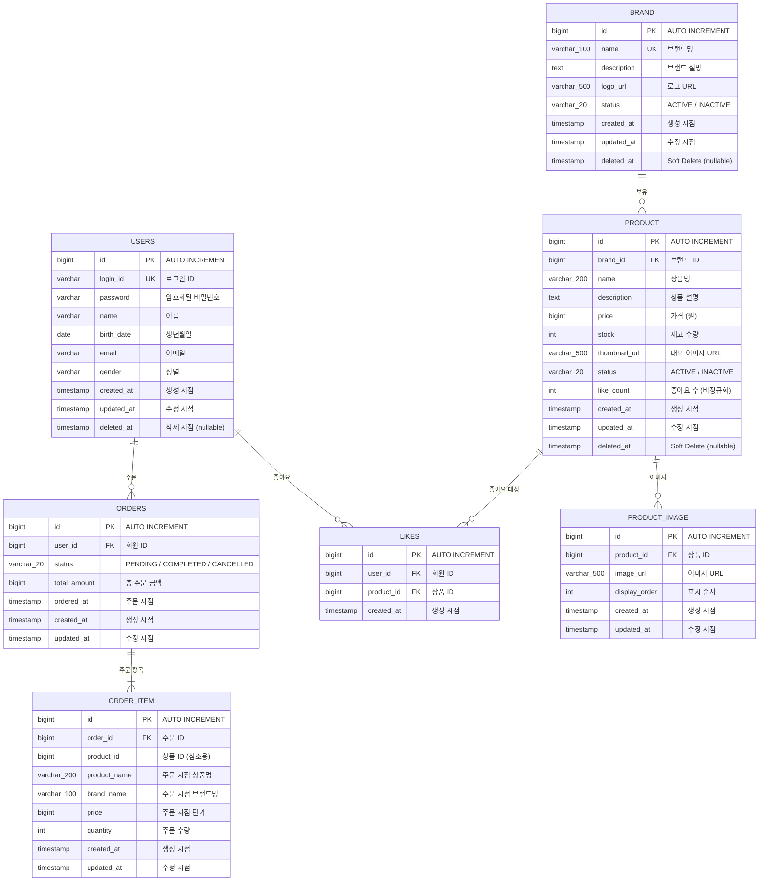

# ERD (Entity Relationship Diagram)

> 도메인 모델(03-class-diagram.md)을 물리 테이블로 매핑한다.
> 모든 JPA Entity는 BaseEntity(id, created_at, updated_at, deleted_at)를 상속한다.

**전제**

- RDB: 단일 데이터베이스
- ID 전략: `IDENTITY` (auto increment)
- Soft Delete: `deleted_at IS NOT NULL`로 판별
- 타임스탬프: `ZonedDateTime` → DB `TIMESTAMP`
- User 테이블은 1주차에 구현 완료. 연관관계만 표현한다

---

## ER 다이어그램

---

## 테이블 상세

### brand

| 컬럼 | 타입 | 제약조건 | 설명 |
|------|------|---------|------|
| id | BIGINT | PK, AUTO INCREMENT | |
| name | VARCHAR(100) | NOT NULL, UNIQUE | 브랜드명 (BR-B01) |
| description | TEXT | NULLABLE | 브랜드 설명 |
| logo_url | VARCHAR(500) | NULLABLE | 로고 이미지 URL |
| status | VARCHAR(20) | NOT NULL, DEFAULT 'ACTIVE' | ACTIVE / INACTIVE |
| created_at | TIMESTAMP | NOT NULL | |
| updated_at | TIMESTAMP | NOT NULL | |
| deleted_at | TIMESTAMP | NULLABLE | Soft Delete (BR-C01) |

### product

| 컬럼 | 타입 | 제약조건 | 설명 |
|------|------|---------|------|
| id | BIGINT | PK, AUTO INCREMENT | |
| brand_id | BIGINT | NOT NULL, FK → brand.id | 브랜드 참조 (BR-P02: 변경 불가) |
| name | VARCHAR(200) | NOT NULL | 상품명 |
| description | TEXT | NULLABLE | 상품 설명 |
| price | BIGINT | NOT NULL, CHECK >= 0 | 가격 (원) |
| stock | INT | NOT NULL, DEFAULT 0, CHECK >= 0 | 재고 수량 |
| thumbnail_url | VARCHAR(500) | NULLABLE | 대표 이미지 URL |
| status | VARCHAR(20) | NOT NULL, DEFAULT 'ACTIVE' | ACTIVE / INACTIVE |
| like_count | INT | NOT NULL, DEFAULT 0, CHECK >= 0 | 좋아요 수 (비정규화) |
| created_at | TIMESTAMP | NOT NULL | |
| updated_at | TIMESTAMP | NOT NULL | |
| deleted_at | TIMESTAMP | NULLABLE | Soft Delete (BR-C01) |

> **status와 deleted_at의 구분:**
> - `status`(ACTIVE/INACTIVE) = **운영 상태**. 어드민이 상품을 숨기거나 노출하는 것. 되돌릴 수 있다   
> - `deleted_at` = **논리 삭제**. 더 이상 존재하지 않는 것으로 취급. 현재 복구 미지원  
> - INACTIVE 상품: 고객 조회에서 제외되지만 어드민이 다시 ACTIVE로 변경 가능  
> - deleted_at이 설정된 상품: 고객/어드민 모두에서 "삭제된 상품"으로 취급 (어드민 조회는 가능)  
>
> 즉, `status`는 가역적 운영 제어이고, `deleted_at`은 비가역적 삭제 표시다. brand도 동일하다.  

### product_image

| 컬럼 | 타입 | 제약조건 | 설명 |
|------|------|---------|------|
| id | BIGINT | PK, AUTO INCREMENT | |
| product_id | BIGINT | NOT NULL, FK → product.id | 상품 참조 |
| image_url | VARCHAR(500) | NOT NULL | 이미지 URL |
| display_order | INT | NOT NULL, DEFAULT 0 | 표시 순서 |
| created_at | TIMESTAMP | NOT NULL | |
| updated_at | TIMESTAMP | NOT NULL | |

> product_image는 product의 lifecycle에 종속된다.    
> product가 Soft Delete되면 image도 조회 대상에서 제외되므로, 별도 Soft Delete를 두지 않는다.   

### likes

| 컬럼 | 타입 | 제약조건 | 설명 |
|------|------|---------|------|
| id | BIGINT | PK, AUTO INCREMENT | |
| user_id | BIGINT | NOT NULL, FK → users.id | 회원 ID |
| product_id | BIGINT | NOT NULL, FK → product.id | 상품 ID |
| created_at | TIMESTAMP | NOT NULL | |

> **UNIQUE(user_id, product_id)** — BR-L01 보장 + `INSERT ON CONFLICT DO NOTHING`의 핵심.  
> Soft Delete 없음. 좋아요 취소 시 물리 삭제한다.   
>
> **FK 정책:** `user_id`, `product_id` 모두 FK를 건다.   
> product는 Soft Delete(물리 행 유지)이므로 FK 무결성이 깨지지 않는다.   
> 좋아요 취소 시 likes 행을 물리 삭제하므로, product Soft Delete와 충돌하지 않는다.   
> **삭제된 상품의 좋아요 정책:**
> 삭제된 상품의 좋아요 레코드는 유지된다 (BR-C05). 삭제된 상품은 고객 조회에서 제외되므로 (BR-C02),   
> 잔존 좋아요와 like_count는 더 이상 노출/집계 대상이 아니다.   
> 배치 정리는 선택 사항이다 — 데이터 정합성이나 서비스 동작에 영향을 주지 않으므로 필수가 아니다.  

### orders

| 컬럼 | 타입 | 제약조건 | 설명 |
|------|------|---------|------|
| id | BIGINT | PK, AUTO INCREMENT | |
| user_id | BIGINT | NOT NULL, FK → users.id | 회원 ID (BR-O07) |
| status | VARCHAR(20) | NOT NULL, DEFAULT 'PENDING' | PENDING / COMPLETED / CANCELLED |
| total_amount | BIGINT | NOT NULL, CHECK >= 0 | 총 주문 금액 |
| ordered_at | TIMESTAMP | NOT NULL | 주문 시점 |
| created_at | TIMESTAMP | NOT NULL | |
| updated_at | TIMESTAMP | NOT NULL | |

> Soft Delete 없음. 주문 상태(CANCELLED)로 삭제를 표현한다.
>
> **ordered_at vs created_at:**
> - `ordered_at` = **비즈니스 시점**. "사용자가 주문한 시점". 주문 이력 조회/정렬의 기준
> - `created_at` = **기술 시점**. "레코드가 DB에 삽입된 시점". BaseEntity가 자동 관리
> - 현재는 동일하지만, 확장 시 분리될 수 있다 (예: 결제 완료 후 주문 확정, 배치 주문 생성 등)
> - 비즈니스 도메인에서 "언제 주문했는가"를 명시적으로 표현하기 위해 분리한다
>
> **total_amount 계산 책임:**
> - `Order.create()` 시 `items.sumOf { it.getSubtotal() }`로 계산한다 (도메인 책임)
> - 생성 이후 변경 불가 (불변). 환불 금액 계산의 기준이 된다
> - DB CHECK 제약으로는 cross-row 계산을 강제할 수 없으므로, 도메인 불변식으로만 보장한다

### order_item

| 컬럼 | 타입 | 제약조건 | 설명 |
|------|------|---------|------|
| id | BIGINT | PK, AUTO INCREMENT | |
| order_id | BIGINT | NOT NULL, FK → orders.id | 주문 참조 |
| product_id | BIGINT | NOT NULL | 상품 ID (참조용, **FK 아님**) |
| product_name | VARCHAR(200) | NOT NULL | 주문 시점 상품명 (스냅샷) |
| brand_name | VARCHAR(100) | NOT NULL | 주문 시점 브랜드명 (스냅샷) |
| price | BIGINT | NOT NULL, CHECK >= 0 | 주문 시점 단가 (스냅샷) |
| quantity | INT | NOT NULL, CHECK > 0 | 주문 수량 |
| created_at | TIMESTAMP | NOT NULL | |
| updated_at | TIMESTAMP | NOT NULL | |

> `product_id`는 FK가 아니다. 상품이 삭제되어도 주문 이력은 보존되어야 한다 (BR-O03, BR-C04).
>
> **스냅샷과 환불:** 환불 금액은 `order_item.price`(주문 시점 단가) 기준이다.
> 현재 `product.price`가 변경/삭제되어도 주문 이력의 금액은 영향받지 않는다.
> 주문은 과거의 사실이며, 스냅샷은 자기 완결적이다.

---

## 인덱스 전략

| 테이블 | 인덱스명 | 타입 | 컬럼 | 용도 |
|--------|---------|------|------|------|
| brand | `uk_brand_name` | UNIQUE | name | 브랜드명 중복 방지 (BR-B01) |
| product | `idx_product_brand_id` | INDEX | brand_id | 브랜드별 상품 조회 |
| product | `idx_product_like_count` | INDEX | like_count | 좋아요순 정렬 (BR-P05) |
| product | `idx_product_created_at` | INDEX | created_at | 최신순 정렬 |
| likes | `uk_likes_user_product` | UNIQUE | (user_id, product_id) | 중복 좋아요 방지 + INSERT ON CONFLICT 핵심 |
| likes | `idx_likes_user_id` | INDEX | user_id | 내 좋아요 목록 조회 |
| orders | `idx_orders_user_id` | INDEX | user_id | 내 주문 목록 조회 |
| order_item | `idx_order_item_order_id` | INDEX | order_id | 주문별 항목 조회 (FK 자동 생성 가능) |

---

## 도메인 ↔ 테이블 매핑 요약

| 도메인 | 테이블 | Soft Delete | 비고 |
|--------|--------|:-----------:|------|
| Brand | brand | O | `deleted_at` |
| Product | product | O | `deleted_at` |
| ProductImage | product_image | X | 상품과 함께 관리 |
| Like | likes | X | 물리 삭제 |
| Order | orders | X | 상태(CANCELLED)로 관리 |
| OrderItem | order_item | X | 스냅샷, 불변 |

---

## 설계 결정

| 결정 | 이유 |
|------|------|
| `order_item.product_id`는 FK 아님 | 상품 삭제와 주문 이력을 독립시킨다 (BR-C04) |
| likes에 Soft Delete 없음 | 좋아요/취소는 단순 토글. 삭제 이력이 불필요하다 |
| orders에 Soft Delete 없음 | 주문 상태(CANCELLED)가 이미 삭제를 표현한다 |
| `like_count`를 product에 비정규화 | COUNT 쿼리 없이 정렬 가능 (BR-P05) |
| `stock`을 product에 직접 보관 | 현재 단일 RDB 환경에서 충분. 재고 차감 병목 발생 시 stock 전용 테이블 분리 가능 (FOR UPDATE → 조건부 UPDATE 전환과 함께) |
| likes.id를 PK로 유지 | UNIQUE(user_id, product_id)만으로도 PK 가능하나, BaseEntity 패턴과 일관성 유지 |
| `price`를 BIGINT으로 | Money VO의 amount(Long)와 1:1 매핑. 소수점 없는 원(₩) 단위 |
| `status`와 `deleted_at` 분리 | status는 가역적 운영 제어, deleted_at은 비가역적 삭제 표시. 역할이 다르다 |
| likes에 FK 적용 | Soft Delete로 물리 행이 유지되므로 FK 무결성이 깨지지 않는다 |
| `ordered_at`과 `created_at` 분리 | 비즈니스 시점과 기술 시점을 명시적으로 구분. 확장 시 분리가 필요해진다 |
| `total_amount`는 도메인이 계산 | DB CHECK로 강제 불가. 도메인 불변식으로 보장하고 생성 이후 변경하지 않는다 |

---

## 확장 고려 사항

| 확장 포인트 | 현재 구조 | 확장 시 |
|------------|----------|--------|
| 결제/배송 도입 | orders에 status/total_amount만 존재 | Payment Aggregate(payment 테이블) 분리. orders는 주문 사실만, payment는 결제 상태/금액/환불 관리. 현재 COMPLETED는 "주문 확정" 의미이며, 배송 도입 시 PAID → SHIPPING → DELIVERED 등으로 상태 세분화가 필요하다 |
| 재고 분리 | stock이 product에 직접 보관 | stock 전용 테이블 분리 → 상품 메타와 재고 경합 분리 |
| 환불 | order_item.price 기준 (스냅샷) | payment 테이블에 paid_amount, refund_amount 관리 |
