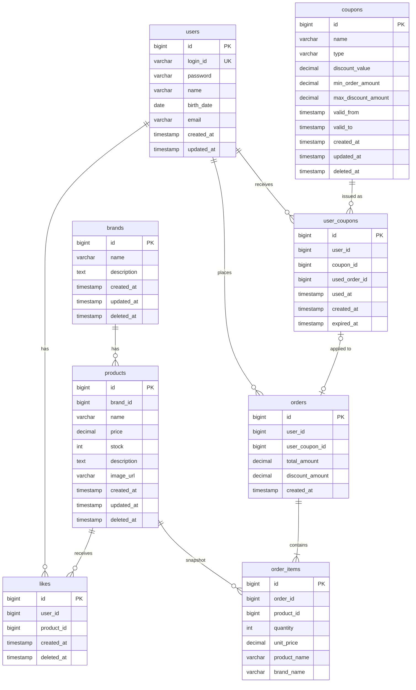

# ERD (Entity Relationship Diagram)

> 목적: 테이블 구조, 관계, 인덱스 정의

---

## 목차

1. [전체 ERD](#1-전체-erd)
2. [테이블 상세](#2-테이블-상세)
3. [인덱스 설계](#3-인덱스-설계)

---

## 1. 전체 ERD

### 다이어그램 목적
- 테이블 간 관계와 카디널리티 확인
- 논리적 관계 표현 (FK 제약 없음, 애플리케이션에서 검증)

### 핵심 포인트
- **FK 제약 없음**: 참조 무결성은 애플리케이션에서 검증
- **brands → products**: 1:N, 브랜드 삭제 시 상품 연쇄 Soft Delete
- **products → order_items**: 스냅샷 관계 (주문 시점 정보 복사)
- **likes**: user_id + product_id 유니크 인덱스
- **coupons → user_coupons**: 1:N, 쿠폰 템플릿과 발급 이력 분리
- **user_coupons ↔ orders**: 1:1 (선택적), 주문당 쿠폰 1장
- **orders**: user_coupon_id + discount_amount로 쿠폰 적용 기록

---

## 2. 테이블 상세

### 2.1 users

| 컬럼 | 타입 | 제약 | 설명 |
|------|------|------|------|
| id | BIGINT | PK, AUTO_INCREMENT | |
| login_id | VARCHAR(50) | UNIQUE, NOT NULL | 로그인 ID |
| password | VARCHAR(255) | NOT NULL | BCrypt 암호화 |
| name | VARCHAR(100) | NOT NULL | |
| birth_date | DATE | NOT NULL | |
| email | VARCHAR(255) | NOT NULL | |
| created_at | TIMESTAMP | NOT NULL | |
| updated_at | TIMESTAMP | NOT NULL | |

---

### 2.2 brands

| 컬럼 | 타입 | 제약 | 설명 |
|------|------|------|------|
| id | BIGINT | PK, AUTO_INCREMENT | |
| name | VARCHAR(100) | NOT NULL | |
| description | TEXT | | |
| created_at | TIMESTAMP | NOT NULL | |
| updated_at | TIMESTAMP | NOT NULL | |
| deleted_at | TIMESTAMP | | Soft Delete |

---

### 2.3 products

| 컬럼 | 타입 | 제약 | 설명 |
|------|------|------|------|
| id | BIGINT | PK, AUTO_INCREMENT | |
| brand_id | BIGINT | NOT NULL | brands.id (앱에서 검증) |
| name | VARCHAR(200) | NOT NULL | |
| price | DECIMAL(15,2) | NOT NULL | |
| stock | INT | NOT NULL, DEFAULT 0 | >= 0 |
| description | TEXT | | |
| image_url | VARCHAR(500) | | |
| created_at | TIMESTAMP | NOT NULL | |
| updated_at | TIMESTAMP | NOT NULL | |
| deleted_at | TIMESTAMP | | Soft Delete |

---

### 2.4 likes

| 컬럼 | 타입 | 제약 | 설명 |
|------|------|------|------|
| id | BIGINT | PK, AUTO_INCREMENT | |
| user_id | BIGINT | NOT NULL | users.id (앱에서 검증) |
| product_id | BIGINT | NOT NULL | products.id (앱에서 검증) |
| created_at | TIMESTAMP | NOT NULL | |
| deleted_at | TIMESTAMP | | Soft Delete |

**유니크 제약**: `(user_id, product_id)` - 중복 좋아요 방지

---

### 2.5 coupons

> 향후 쿠폰 API 개발 시 사용. 주문 흐름에서 참조하므로 테이블 구조를 미리 정의

| 컬럼 | 타입 | 제약 | 설명 |
|------|------|------|------|
| id | BIGINT | PK, AUTO_INCREMENT | |
| name | VARCHAR(100) | NOT NULL | 쿠폰명 |
| type | VARCHAR(20) | NOT NULL | FIXED / RATE |
| discount_value | DECIMAL(15,2) | NOT NULL | 할인 금액 또는 할인율 |
| min_order_amount | DECIMAL(15,2) | | 최소 주문 금액 (null이면 제한 없음) |
| max_discount_amount | DECIMAL(15,2) | | 최대 할인 금액 (RATE 타입 시 필수) |
| valid_from | TIMESTAMP | NOT NULL | 유효 시작일 |
| valid_to | TIMESTAMP | NOT NULL | 유효 종료일 |
| created_at | TIMESTAMP | NOT NULL | |
| updated_at | TIMESTAMP | NOT NULL | |
| deleted_at | TIMESTAMP | | Soft Delete |

---

### 2.6 user_coupons

| 컬럼 | 타입 | 제약 | 설명 |
|------|------|------|------|
| id | BIGINT | PK, AUTO_INCREMENT | |
| user_id | BIGINT | NOT NULL | users.id (앱에서 검증) |
| coupon_id | BIGINT | NOT NULL | coupons.id (앱에서 검증) |
| used_order_id | BIGINT | | orders.id (사용 시 기록, null이면 미사용) |
| used_at | TIMESTAMP | | 사용 시점 (null이면 미사용) |
| created_at | TIMESTAMP | NOT NULL | 발급 시점 |
| expired_at | TIMESTAMP | NOT NULL | 만료 시점 |

**사용 여부 판단**: `used_at IS NULL AND expired_at > NOW()`

---

### 2.7 orders

| 컬럼 | 타입 | 제약 | 설명 |
|------|------|------|------|
| id | BIGINT | PK, AUTO_INCREMENT | |
| user_id | BIGINT | NOT NULL | users.id (앱에서 검증) |
| user_coupon_id | BIGINT | | user_coupons.id (null이면 쿠폰 미적용) |
| total_amount | DECIMAL(15,2) | NOT NULL | 주문 총액 (할인 전) |
| discount_amount | DECIMAL(15,2) | NOT NULL, DEFAULT 0 | 쿠폰 할인 금액 |
| created_at | TIMESTAMP | NOT NULL | |

**삭제 정책**: 삭제 불가 (기록 보존)
**실결제 금액**: total_amount - discount_amount

---

### 2.8 order_items

| 컬럼 | 타입 | 제약 | 설명 |
|------|------|------|------|
| id | BIGINT | PK, AUTO_INCREMENT | |
| order_id | BIGINT | NOT NULL | orders.id (앱에서 검증) |
| product_id | BIGINT | NOT NULL | 참조용 |
| quantity | INT | NOT NULL | >= 1 |
| unit_price | DECIMAL(15,2) | NOT NULL | 주문 시점 가격 (스냅샷) |
| product_name | VARCHAR(200) | NOT NULL | 주문 시점 상품명 (스냅샷) |
| brand_name | VARCHAR(100) | | 주문 시점 브랜드명 (스냅샷) |

**스냅샷 필드**: `unit_price`, `product_name`, `brand_name`

---

## 3. 인덱스 설계

### 3.1 인덱스 목록

| 테이블 | 인덱스명 | 컬럼 | 타입 | 용도 |
|--------|----------|------|------|------|
| users | uk_users_login_id | login_id | UNIQUE | 로그인 조회 |
| products | idx_products_brand_id | brand_id | INDEX | 브랜드별 상품 조회 |
| likes | uk_likes_user_product | (user_id, product_id) | UNIQUE | 중복 좋아요 방지 |
| likes | idx_likes_user_id | user_id | INDEX | 내 좋아요 목록 |
| user_coupons | idx_user_coupons_user_id | user_id | INDEX | 내 쿠폰 목록 |
| user_coupons | idx_user_coupons_coupon_id | coupon_id | INDEX | 쿠폰별 발급 현황 |
| orders | idx_orders_user_id | user_id | INDEX | 내 주문 목록 |
| orders | idx_orders_created_at | created_at | INDEX | 기간별 조회 |
| order_items | idx_order_items_order_id | order_id | INDEX | 주문별 항목 조회 |

### 3.2 인덱스 설계 근거

| 인덱스 | 목적 |
|--------|------|
| uk_likes_user_product | 동시 요청 시 중복 좋아요 방지 (멱등성) |
| idx_products_brand_id | 브랜드별 상품 조회, 연쇄 삭제 시 사용 |
| idx_orders_created_at | 기간별 주문 조회 (startAt ~ endAt) |
| idx_user_coupons_user_id | 유저별 보유 쿠폰 조회 |

---

## 설계 결정 요약

| 항목 | 결정 | 이유 |
|------|------|------|
| **FK 제약** | 없음 | 성능, Soft Delete 호환, 운영 유연성 |
| **참조 무결성** | 애플리케이션 검증 | Service 레이어에서 존재 확인 |
| **Soft Delete** | brands, products, likes, coupons | 복구 가능성, 이력 추적 |
| **삭제 불가** | orders, order_items, user_coupons | 기록 보존 필수 |
| **스냅샷** | order_items에 포함 | 주문 시점 정보 보존 |
| **쿠폰 구조** | coupons(템플릿) + user_coupons(발급) 분리 | 쿠폰 정의 재사용, 발급 이력 추적 |
| **할인 기록** | orders.discount_amount | 쿠폰 삭제/변경과 무관하게 주문 시점 할인 보존 |
