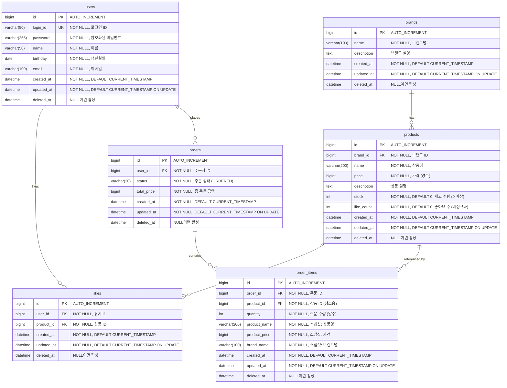

# ERD

> **왜 필요한가?** 도메인 모델의 물리적 구현을 정의한다. 테이블 구조, 관계의 주인, 인덱스 전략, 제약조건을 확인하여 **성능(조회 쿼리, 인덱스)**과 **데이터 정합성**을 보장한다.

---

## 1. 테이블 구조

---

## 2. 제약조건

> 데이터 정합성을 DB 레벨에서 보장하기 위한 제약조건이다.

### 2.1 유니크 제약

| 테이블 | 컬럼 | 근거 |
|--------|------|------|
| `users` | `login_id` | 로그인 ID 중복 방지 |
| `likes` | `(user_id, product_id)` | 동일 유저의 동일 상품 좋아요 중복 방지. 멱등 처리의 기반 |

### 2.2 NOT NULL 제약

- 모든 테이블의 `id`, `created_at`, `updated_at`은 NOT NULL
- `deleted_at`만 NULL 허용 (NULL = 활성, NOT NULL = 삭제됨)
- `order_items`의 스냅샷 필드(`product_name`, `product_price`, `brand_name`)는 NOT NULL — 주문 시점에 반드시 존재하는 값

### 2.3 비즈니스 제약 (애플리케이션 레벨 검증)

| 제약 | 검증 위치 | 근거 |
|------|----------|------|
| `products.price > 0` | Controller 입력 검증 + Entity init 블록 | 가격은 양수만 허용 |
| `products.stock >= 0` | Entity `deductStock()` 메서드 | 재고는 음수 불가 |
| `products.like_count >= 0` | Entity `decreaseLikeCount()` 메서드 | 좋아요 수는 음수 불가 |
| `order_items.quantity > 0` | Controller 입력 검증 | 주문 수량은 양수만 허용 |
| `orders.status` 값 범위 | OrderStatus enum | 현재는 ORDERED만 존재, 확장 가능 |

---

## 3. 인덱스 전략

> API 조회 패턴을 기반으로 설계한다. "어떤 쿼리가 이 인덱스를 사용하는가?"를 근거로 한다.

### 3.1 인덱스 목록

| 테이블 | 인덱스 | 타입 | 사용하는 API / 쿼리 패턴 |
|--------|--------|------|------------------------|
| `users` | `login_id` | UNIQUE | 로그인 시 유저 조회 |
| `products` | `brand_id` | INDEX | 브랜드별 상품 목록 조회 (`GET /api/v1/products?brandId=`) |
| `likes` | `(user_id, product_id)` | UNIQUE | 좋아요 등록/취소 시 존재 여부 확인 (멱등 처리) |
| `likes` | `user_id` | INDEX | 유저의 좋아요 목록 조회 (`GET /api/v1/users/{userId}/likes`) |
| `orders` | `(user_id, created_at)` | INDEX | 유저의 기간별 주문 목록 조회 (`GET /api/v1/orders?startAt=&endAt=`) |
| `order_items` | `order_id` | INDEX | 주문 상세 조회 시 주문 항목 조회 (`GET /api/v1/orders/{orderId}`) |

### 3.2 상품 목록 정렬과 인덱스

상품 목록 조회 시 3가지 정렬 기준이 존재한다:

| 정렬 기준 | SQL | 인덱스 활용 |
|----------|-----|-----------|
| `latest` (기본값) | `ORDER BY created_at DESC` | PK의 역순으로 대체 가능 (auto_increment 기반) |
| `price_asc` | `ORDER BY price ASC` | 페이징과 함께 사용 시 인덱스 효과 제한적, 데이터 규모에 따라 추가 검토 |
| `likes_desc` | `ORDER BY like_count DESC` | `like_count` 비정규화로 집계 쿼리 회피. 데이터 규모에 따라 추가 검토 |

> **현재 판단**: 정렬 전용 인덱스는 데이터 규모가 커진 후 슬로우 쿼리 모니터링을 기반으로 추가한다. 조기 최적화보다 실제 부하를 관찰한 후 결정한다.

### 3.3 Soft Delete와 조회 조건

모든 조회 쿼리에 `WHERE deleted_at IS NULL` 조건이 추가된다. 복합 인덱스 설계 시 `deleted_at`을 포함할지 여부는 데이터 중 삭제 비율에 따라 결정한다.

> **현재 판단**: 삭제 비율이 낮을 것으로 예상되므로, `deleted_at`은 인덱스에 포함하지 않는다. 삭제된 데이터가 많아져 성능 저하가 관측되면 부분 인덱스 또는 복합 인덱스를 검토한다.

---

## 4. 설계 결정 사항

### 4.1 상태 관리: VARCHAR vs 코드 테이블

| 방식 | 장점 | 단점 |
|------|------|------|
| **VARCHAR (현재)** | 단순, JPA `@Enumerated(STRING)` 매핑 용이 | DB 레벨 값 제한 없음 |
| 코드 테이블 | DB 레벨에서 유효값 강제 | 조회 시 JOIN 필요, 과잉 설계 |

> 현재 주문 상태는 `ORDERED` 하나뿐이고, 결제 추가 시 `PAID`, `CANCELLED` 등으로 확장된다. VARCHAR + enum 매핑이 현재 규모에 적합하다. 상태 전이 규칙은 애플리케이션 레벨에서 관리한다.

### 4.2 Soft Delete: deleted_at 방식

| 방식 | 장점 | 단점 |
|------|------|------|
| **deleted_at (현재)** | 삭제 시점 추적 가능, BaseEntity 패턴과 일관 | 모든 쿼리에 조건 추가 필요 |
| is_deleted (boolean) | 단순 | 삭제 시점 정보 없음 |

> `BaseEntity`가 `deletedAt: ZonedDateTime?`을 제공하므로, `deleted_at` 방식으로 통일한다. 삭제 시점 정보는 어드민 데이터 관리에 유용하다.

### 4.3 비정규화 필드

| 필드 | 정규화 대안 | 비정규화 선택 이유 |
|------|-----------|-------------------|
| `products.stock` | Stock 엔티티 분리 | 현재 요구사항은 단순 차감. 별도 엔티티는 과잉 설계 |
| `products.like_count` | `SELECT COUNT(*)` 집계 | `likes_desc` 정렬 시 매번 집계하면 성능 문제. 비정규화로 정렬 성능 확보 |
| `order_items.product_name/price/brand_name` | FK JOIN으로 조회 | 요구사항 명시 — 주문 시점의 상품 정보를 스냅샷으로 보존 |

> `stock`, `like_count`의 동시성 문제(lost update)는 기능 구현 후 별도 단계에서 해결한다.

### 4.4 연관 관계 매핑

모든 관계는 **ID 기반 단방향**으로 설계한다. 양방향 매핑을 사용하지 않는다.

| 관계 | 외래키 위치 | 방향 |
|------|-----------|------|
| Brand 1:N Product | `products.brand_id` | Product → Brand (ID 참조) |
| User 1:N Like | `likes.user_id` | Like → User (ID 참조) |
| Product 1:N Like | `likes.product_id` | Like → Product (ID 참조) |
| User 1:N Order | `orders.user_id` | Order → User (ID 참조) |
| Order 1:N OrderItem | `order_items.order_id` | OrderItem → Order (ID 참조) |
| Product 1:N OrderItem | `order_items.product_id` | OrderItem → Product (참조용, 스냅샷과 별개) |

---

## 5. 테이블별 조회 패턴 정리

> 인덱스 설계의 근거가 되는 주요 조회 패턴이다.

| API | 대상 테이블 | WHERE 조건 | ORDER BY | 사용 인덱스 |
|-----|-----------|-----------|----------|-----------|
| `GET /api/v1/products?brandId=&sort=` | products | `brand_id = ? AND deleted_at IS NULL` | `created_at DESC / price ASC / like_count DESC` | `idx_products_brand_id` |
| `GET /api/v1/products/{id}` | products | `id = ? AND deleted_at IS NULL` | — | PK |
| `POST /api/v1/products/{id}/likes` | likes | `user_id = ? AND product_id = ?` | — | `uk_likes_user_product` |
| `GET /api/v1/users/{id}/likes` | likes → products (JOIN) | `likes.user_id = ? AND products.deleted_at IS NULL` | — | `idx_likes_user_id` |
| `GET /api/v1/orders?startAt=&endAt=` | orders | `user_id = ? AND created_at BETWEEN ? AND ?` | `created_at DESC` | `idx_orders_user_created` |
| `GET /api/v1/orders/{id}` | orders + order_items | `order_items.order_id = ?` | — | `idx_order_items_order_id` |
| `GET /api-admin/v1/brands` | brands | `deleted_at IS NULL` | — | 풀스캔 (소량 데이터) |
| `GET /api-admin/v1/orders` | orders | — | `created_at DESC` | PK 역순 |
