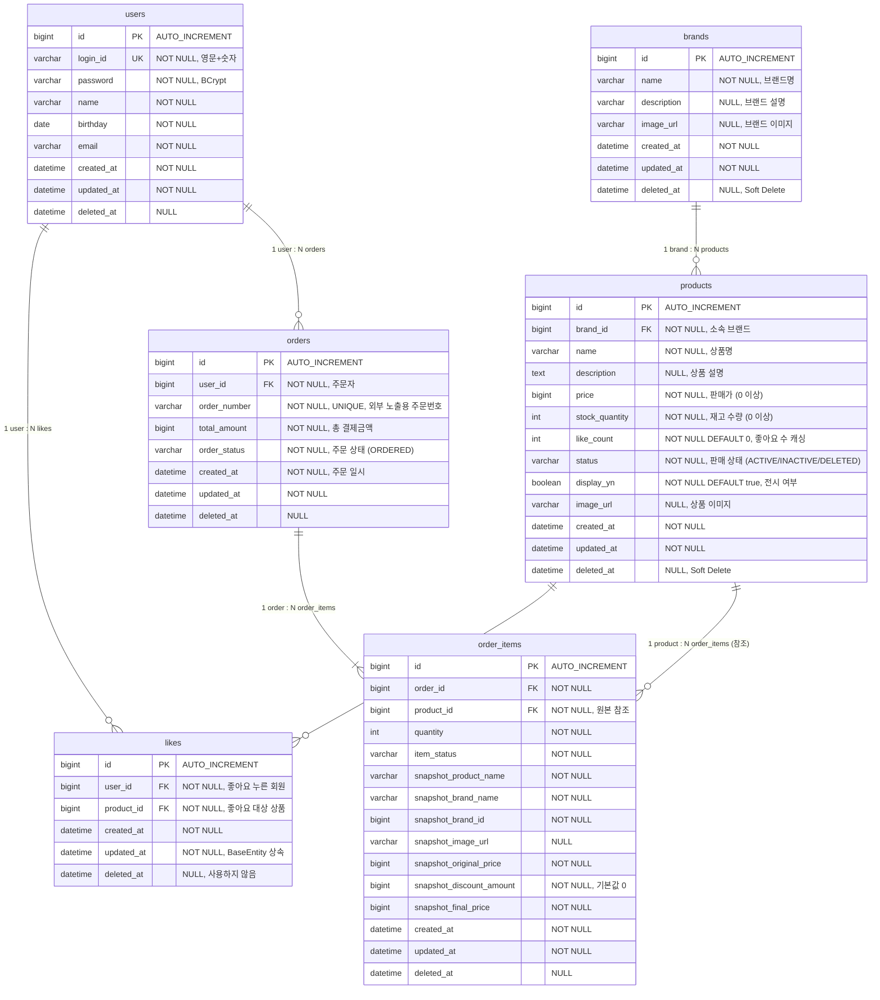

# 04. ERD (Entity Relationship Diagram)

---

## 왜 이 ERD가 필요한가

- **영속성 구조**를 정의: 어떤 데이터가 어떤 테이블에, 어떤 타입으로 저장되는가
- **관계의 주인**을 명확히: FK가 어느 쪽에 있는가
- **인덱스 설계**: 어떤 쿼리가 자주 발생하고, 어떤 컬럼에 인덱스가 필요한가
- **스냅샷 전략**: `@Embedded`로 저장되는 컬럼과 FK로 참조되는 컬럼의 구분

---

## 1. 전체 ERD



---

## 2. 테이블별 상세 설명

### 2.1 users (기존 — 1주차 완성)

| 컬럼 | 타입 | 제약 | 설명 |
|------|------|------|------|
| id | BIGINT | PK, AUTO_INCREMENT | |
| login_id | VARCHAR(50) | UNIQUE, NOT NULL | 영문+숫자만 |
| password | VARCHAR(100) | NOT NULL | BCrypt 암호화 |
| name | VARCHAR(50) | NOT NULL | |
| birthday | DATE | NOT NULL | |
| email | VARCHAR(100) | NOT NULL | |
| created_at | DATETIME | NOT NULL | |
| updated_at | DATETIME | NOT NULL | |
| deleted_at | DATETIME | NULL | Soft Delete |

### 2.2 brands

| 컬럼 | 타입 | 제약 | 설명 |
|------|------|------|------|
| id | BIGINT | PK, AUTO_INCREMENT | |
| name | VARCHAR(100) | NOT NULL | 브랜드명 |
| description | VARCHAR(500) | NULL | 브랜드 설명 |
| image_url | VARCHAR(500) | NULL | 브랜드 이미지 |
| created_at | DATETIME | NOT NULL | |
| updated_at | DATETIME | NOT NULL | |
| deleted_at | DATETIME | NULL | Soft Delete |

### 2.3 products

| 컬럼 | 타입 | 제약 | 설명 |
|------|------|------|------|
| id | BIGINT | PK, AUTO_INCREMENT | |
| brand_id | BIGINT | FK → brands.id, NOT NULL | 소속 브랜드 |
| name | VARCHAR(200) | NOT NULL | 상품명 |
| description | TEXT | NULL | 상품 설명 |
| price | BIGINT | NOT NULL, >= 0 | 판매가 (원) |
| stock_quantity | INT | NOT NULL, >= 0 | 재고 수량 |
| like_count | INT | NOT NULL, DEFAULT 0 | 좋아요 수 (캐싱) |
| status | VARCHAR(20) | NOT NULL | ACTIVE / INACTIVE / DELETED |
| display_yn | BOOLEAN | NOT NULL, DEFAULT true | 전시 여부 |
| image_url | VARCHAR(500) | NULL | 상품 이미지 |
| created_at | DATETIME | NOT NULL | |
| updated_at | DATETIME | NOT NULL | |
| deleted_at | DATETIME | NULL | Soft Delete |

> **status와 display_yn 분리 이유:**
> - `status=ACTIVE, display_yn=false` → 판매 가능하지만 목록에 미노출 (URL 직접 접근 시에만)
> - `status=INACTIVE` → 전시 여부와 무관하게 구매 불가
> - `display_yn=true, status=INACTIVE` → 목록에 노출되되 딤(dim) 처리 + "판매중지" 뱃지 등으로 표현 가능
> - 두 필드를 분리해야 "보이지만 구매 불가" 상태를 표현 가능. 상세 매트릭스는 `05-state-diagrams.md` 참조

> **like_count를 별도 컬럼으로 가져가는 이유:**
> - 상품 목록 정렬 `sort=likes_desc` 시 매번 likes 테이블을 COUNT 하면 느림
> - 좋아요 등록/취소 시 증감하여 캐싱
> - 정합성이 어긋날 가능성은 있으나, 배치로 보정 가능 (확장 시)

### 2.4 likes

| 컬럼 | 타입 | 제약 | 설명 |
|------|------|------|------|
| id | BIGINT | PK, AUTO_INCREMENT | |
| user_id | BIGINT | FK → users.id, NOT NULL | 좋아요 누른 회원 |
| product_id | BIGINT | FK → products.id, NOT NULL | 좋아요 대상 상품 |
| created_at | DATETIME | NOT NULL | 좋아요 등록 일시 |
| updated_at | DATETIME | NOT NULL | BaseEntity 상속으로 존재 (실질적 사용 없음) |
| deleted_at | DATETIME | NULL | BaseEntity 상속으로 존재 (사용하지 않음) |

> **물리 삭제**: 좋아요 취소 시 레코드를 DELETE 한다 (Soft Delete 아님). 좋아요 이력 추적이 필요 없으므로 물리 삭제가 적절

> **BaseEntity 상속 이유:**
> Like도 BaseEntity를 상속한다. `updated_at`과 `deleted_at` 컬럼은 실질적으로 사용하지 않지만, 프로젝트 컨벤션 상 **모든 엔티티가 BaseEntity를 상속**하는 일관성을 유지한다. Like만 예외를 두면 구현 시 "왜 얘만 다르지?" 혼란이 생기고, 미사용 컬럼 2개의 저장 비용은 무시할 수 있는 수준으로 판단

> **중복 방지**: `(user_id, product_id)` 복합 유니크 제약 (UK)
> - 애플리케이션에서 `findByUserIdAndProductId`로 1차 확인
> - 동시 요청 시 UK 위반 → `DataIntegrityViolationException` → 409 CONFLICT 변환
> - **UK가 동시성 최종 방어선** 역할

### 2.5 orders

| 컬럼 | 타입 | 제약 | 설명 |
|------|------|------|------|
| id | BIGINT | PK, AUTO_INCREMENT | |
| user_id | BIGINT | FK → users.id, NOT NULL | 주문자 |
| order_number | VARCHAR(14) | UNIQUE, NOT NULL | 주문번호 (yyMMdd + id 8자리) |
| total_amount | BIGINT | NOT NULL | 총 결제금액 |
| order_status | VARCHAR(20) | NOT NULL | ORDERED / PAID / ... |
| created_at | DATETIME | NOT NULL | 주문 일시 |
| updated_at | DATETIME | NOT NULL | |
| deleted_at | DATETIME | NULL | |

> **order_number 생성 규칙**:
> - 형식: `yyMMddxxxxxxxx` (날짜 6자리 + 시퀀스 8자리, 총 14자리)
> - 시퀀스: orderId를 8자리 zero-padding (예: orderId=1 → `00000001`)
> - 예시: 2026년 2월 11일, orderId=42 → `26021100000042`
> - 생성 시점: Order INSERT 후 id가 확정된 직후에 `updateOrderNumber()` 호출
> - 이유: PK(id)는 내부용, orderNumber는 외부 노출용 (CS, 주문 조회, 결제 연동)

### 2.6 order_items

| 컬럼 | 타입 | 제약 | 설명 |
|------|------|------|------|
| id | BIGINT | PK, AUTO_INCREMENT | |
| order_id | BIGINT | FK → orders.id, NOT NULL | 소속 주문 |
| product_id | BIGINT | FK → products.id, NOT NULL | 원본 상품 참조 |
| quantity | INT | NOT NULL, >= 1 | 주문 수량 |
| item_status | VARCHAR(20) | NOT NULL | 품목별 상태 |
| — | — | — | **@Embedded ProductSnapshot** |
| snapshot_product_name | VARCHAR(200) | NOT NULL | 주문 당시 상품명 |
| snapshot_brand_name | VARCHAR(100) | NOT NULL | 주문 당시 브랜드명 |
| snapshot_brand_id | BIGINT | NOT NULL | 브랜드 원본 참조 |
| snapshot_image_url | VARCHAR(500) | NULL | 주문 당시 상품 이미지 |
| — | — | — | **@Embedded PriceSnapshot** |
| snapshot_original_price | BIGINT | NOT NULL | 주문 당시 상품 원가 |
| snapshot_discount_amount | BIGINT | NOT NULL, DEFAULT 0 | 할인액 (현재는 0) |
| snapshot_final_price | BIGINT | NOT NULL | 최종 결제가 |
| created_at | DATETIME | NOT NULL | |
| updated_at | DATETIME | NOT NULL | |
| deleted_at | DATETIME | NULL | |

> **product_id와 스냅샷을 동시에 저장하는 이유:**
> - `product_id`: 상품 페이지 링크, 재주문 시 원본 참조
> - 스냅샷 컬럼들: 상품이 삭제/변경되어도 주문 당시 정보 보존 (CS, 환불, 주문 내역 표시)

> **@Embedded 설명:**
> - `ProductSnapshot`과 `PriceSnapshot`은 Kotlin 클래스로 분리되지만, 물리적으로는 `order_items` 테이블의 컬럼
> - JPA `@Embedded` / `@Embeddable` 으로 매핑
> - 추후 할인 필드가 폭증하면 PriceSnapshot을 별도 테이블로 분리 가능

---

## 3. 인덱스 설계

### 필수 인덱스

| 테이블 | 인덱스 | 컬럼 | 사용 쿼리 |
|--------|--------|------|----------|
| products | `idx_products_brand_id` | brand_id | 브랜드별 상품 목록 조회 |
| products | `idx_products_status_display` | status, display_yn | 대고객 상품 목록 (활성+전시 필터) |
| products | `idx_products_like_count` | like_count DESC | `sort=likes_desc` 정렬 |
| products | `idx_products_price` | price ASC | `sort=price_asc` 정렬 |
| products | `idx_products_created_at` | created_at DESC | `sort=latest` 정렬 |
| likes | `uk_likes_user_product` | user_id, product_id (UNIQUE) | 중복 좋아요 방지 |
| likes | `idx_likes_user_id` | user_id | 내 좋아요 목록 조회 |
| likes | `idx_likes_product_id` | product_id | 상품별 좋아요 조회/삭제 |
| orders | `idx_orders_user_id_created_at` | user_id, created_at | 기간별 주문 목록 조회 |
| order_items | `idx_order_items_order_id` | order_id | 주문 상세 조회 시 OrderItem 조회 |

### 인덱스 설계 근거

**products 테이블**: 대고객 상품 목록 조회가 가장 빈번한 쿼리. 정렬 옵션이 3가지(`latest`, `price_asc`, `likes_desc`)이므로 각각 인덱스 필요

```sql
-- 가장 빈번한 쿼리 예상
SELECT * FROM products
WHERE status = 'ACTIVE' AND display_yn = true AND deleted_at IS NULL
ORDER BY created_at DESC
LIMIT 20 OFFSET 0;

-- 브랜드별 필터 + 정렬
SELECT * FROM products
WHERE brand_id = ? AND status = 'ACTIVE' AND display_yn = true AND deleted_at IS NULL
ORDER BY price ASC
LIMIT 20 OFFSET 0;
```

**likes 테이블**: `(user_id, product_id)` 복합 유니크 인덱스가 중복 좋아요 방지 + 조회를 동시에 해결

**orders 테이블**: 기간별 조회(`startAt ~ endAt`)가 필수이므로 `(user_id, created_at)` 복합 인덱스

---

## 4. 관계 정리

| 관계 | 타입 | FK 위치 | 설명 |
|------|------|--------|------|
| Brand → Product | 1:N | products.brand_id | 하나의 브랜드에 여러 상품 |
| User → Like | 1:N | likes.user_id | 한 유저가 여러 상품에 좋아요 |
| Product → Like | 1:N | likes.product_id | 한 상품에 여러 유저가 좋아요 |
| User → Order | 1:N | orders.user_id | 한 유저가 여러 주문 |
| Order → OrderItem | 1:N | order_items.order_id | 한 주문에 여러 주문 상품 |
| Product → OrderItem | 1:N | order_items.product_id | 원본 참조 (스냅샷과 병행) |

### 관계 주인

- **Product ← Brand**: Product 쪽에 FK (brand_id). Product가 Brand를 참조
- **Like ← User, Product**: Like가 양쪽을 참조하는 매핑 테이블
- **OrderItem ← Order**: OrderItem 쪽에 FK (order_id). Order가 주인이 아니라 OrderItem이 FK를 보유

---

## 5. 향후 확장 시 추가될 테이블 (참고)

> 현재 과제에서는 구현하지 않으며, 기존 테이블 구조 변경 없이 테이블 추가만으로 확장 가능하도록 설계

| 확장 영역 | 추가 테이블 | 기존 테이블 변경 |
|----------|-----------|----------------|
| 장바구니 | `carts` | 없음 |
| 취소/반품 | `order_claims` | 없음 |
| 환불 | `order_refunds` | 없음 (취소/반품의 결과로 생성) |
| 결제 | `order_payments` | 없음 |
| 상품 옵션 | `option_groups`, `option_values`, `product_variants` | stock_quantity 관리 주체 이동 |
| 쿠폰 | `coupons`, `coupon_policies` | order_items에 할인 스냅샷 컬럼 추가 |
| 추천/랭킹 | `product_rankings`, `user_events` | 없음 (likes + likeCount로 기초 랭킹 지원, 고급 분석 시 이벤트/집계 테이블 추가) |

---

## 6. 잠재 리스크

### 리스크 1: likeCount 정합성

- Product.likeCount는 캐싱된 값. 좋아요/취소 시 증감하지만, 동시 요청이 많으면 어긋날 수 있음
- **대안**: `UPDATE like_count = like_count + 1` (DB 원자적 갱신)으로 동시성 보장
- **추후**: Redis 캐시 또는 배치 보정 도입

### 리스크 2: 재고 차감 동시성

- 현재 설계: `UPDATE stock_quantity = stock_quantity - :qty WHERE stock_quantity >= :qty` (D안)
- 단일 인스턴스 + 단일 DB에서는 충분하지만, 다중 인스턴스 환경에서는 분산 락(Redisson) 필요
- **구현 주차에서 비관적 락 / 낙관적 락 / 분산 락 / DB 원자적 갱신 4가지 비교 실험 예정**

### 리스크 3: 브랜드 삭제 시 대량 상품 처리

- 하나의 트랜잭션에서 브랜드 + N개 상품 + M개 좋아요를 Soft Delete
- 상품 수가 극단적으로 많으면 트랜잭션 비대화 + Lock 대기 시간 증가
- **대안**: 비동기 처리 (이벤트 기반), 벌크 UPDATE 쿼리
