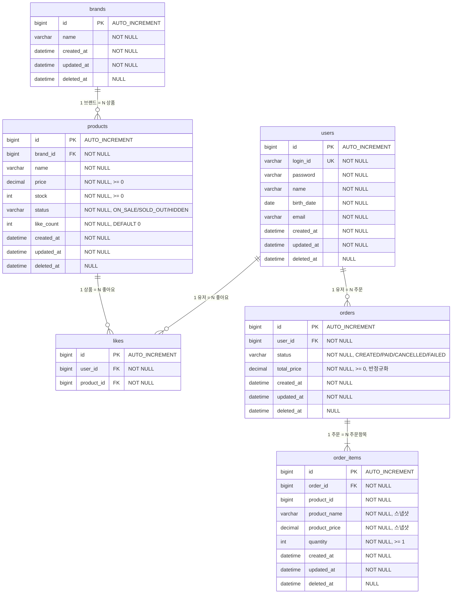

# ERD (Entity-Relationship Diagram)

영속성 구조를 Mermaid ERD로 정리한다.
클래스 다이어그램(03-class-diagram.md)의 도메인 객체가 DB 테이블로 어떻게 매핑되는지,
VO는 컬럼으로, 관계는 FK로 풀어서 표현한다.

---

## 1. 전체 ERD

### 이 다이어그램이 필요한 이유

클래스 다이어그램에서 정의한 Entity, VO, enum이 실제 테이블 구조로 어떻게 변환되는지 확인한다.
특히 다음을 검증한다:

- VO(Stock, Price, BrandName)가 별도 테이블 없이 컬럼으로 표현되는가
- 도메인 간 ID 참조가 FK로 올바르게 매핑되는가
- Order-OrderItem 합성 관계가 FK + CASCADE로 표현되는가
- 스냅샷 필드(productName, productPrice)가 OrderItem의 독립 컬럼으로 존재하는가

### 읽는 법

- **users 테이블은 1주차 기존 테이블**이다. 이번 설계에서 변경하지 않으며, likes/orders에서 user_id로 참조한다.
- **brands → products**: 1:N 관계. products.brand_id가 FK 주인. 브랜드 삭제 시 cascade는 DB 레벨이 아닌 **애플리케이션 레벨** soft delete로 처리한다.
- **products → likes**: 1:N 관계. likes 테이블에 `user_id + product_id` UNIQUE 제약으로 중복 좋아요를 방지한다.
- **orders → order_items**: 1:N 합성 관계. `||--|{` (필수)로 표현 — 주문에는 최소 1개 이상의 항목이 있어야 한다.
- **order_items.product_id**: FK 제약을 걸지 **않는다**. 스냅샷 필드(product_name, product_price)로 독립적이며, 상품 삭제와 무관하게 주문 이력을 보존하기 위해 product_id는 참조 추적용으로만 보관한다.

---

## 2. 테이블별 상세

### 2.1 brands

| 컬럼         | 타입           | 제약조건               | 비고                    |
|------------|--------------|--------------------|-----------------------|
| id         | BIGINT       | PK, AUTO_INCREMENT |                       |
| name       | VARCHAR(255) | NOT NULL           | VO(BrandName)로 빈 값 검증 |
| created_at | DATETIME     | NOT NULL           | BaseEntity            |
| updated_at | DATETIME     | NOT NULL           | BaseEntity            |
| deleted_at | DATETIME     | NULL               | soft delete           |

### 2.2 products

| 컬럼         | 타입            | 제약조건                | 비고                          |
|------------|---------------|---------------------|-----------------------------|
| id         | BIGINT        | PK, AUTO_INCREMENT  |                             |
| brand_id   | BIGINT        | FK, NOT NULL        | brands.id 참조                |
| name       | VARCHAR(255)  | NOT NULL            |                             |
| price      | DECIMAL(19,2) | NOT NULL            | VO(Price) 검증: >= 0          |
| stock      | INT           | NOT NULL, DEFAULT 0 | VO(Stock) 검증: >= 0          |
| status     | VARCHAR(20)   | NOT NULL            | ON_SALE / SOLD_OUT / HIDDEN |
| like_count | INT           | NOT NULL, DEFAULT 0 | 비정규화 필드, Like 증감 시 동기 갱신    |
| created_at | DATETIME      | NOT NULL            | BaseEntity                  |
| updated_at | DATETIME      | NOT NULL            | BaseEntity                  |
| deleted_at | DATETIME      | NULL                | soft delete                 |

### 2.3 likes

| 컬럼         | 타입     | 제약조건               | 비고             |
|------------|--------|--------------------|----|
| id         | BIGINT | PK, AUTO_INCREMENT |                |
| user_id    | BIGINT | FK, NOT NULL       | users.id 참조    |
| product_id | BIGINT | FK, NOT NULL       | products.id 참조 |

> BaseEntity를 상속하지 않는다. 이력 관리 불필요, 취소 시 하드 딜리트(물리 삭제).

**UNIQUE 제약:** `(user_id, product_id)` — 동일 유저가 같은 상품에 중복 좋아요 방지

### 2.4 orders

| 컬럼          | 타입            | 제약조건               | 비고                                  |
|-------------|---------------|--------------------|-------------------------------------|
| id          | BIGINT        | PK, AUTO_INCREMENT |                                     |
| user_id     | BIGINT        | FK, NOT NULL       | users.id 참조                         |
| status      | VARCHAR(20)   | NOT NULL           | CREATED / PAID / CANCELLED / FAILED |
| total_price | DECIMAL(19,2) | NOT NULL           | 반정규화, 주문 생성 시 계산하여 저장              |
| created_at  | DATETIME      | NOT NULL           | BaseEntity, 주문 생성일 (기간 조회 기준)       |
| updated_at  | DATETIME      | NOT NULL           | BaseEntity                          |
| deleted_at  | DATETIME      | NULL               | soft delete                         |

### 2.5 order_items

| 컬럼            | 타입            | 제약조건               | 비고                            |
|---------------|---------------|--------------------|-------------------------------|
| id            | BIGINT        | PK, AUTO_INCREMENT |                               |
| order_id      | BIGINT        | FK, NOT NULL       | orders.id 참조 (CASCADE DELETE) |
| product_id    | BIGINT        | NOT NULL           | FK 아님, 참조 추적용                 |
| product_name  | VARCHAR(255)  | NOT NULL           | 주문 시점 스냅샷                     |
| product_price | DECIMAL(19,2) | NOT NULL           | 주문 시점 스냅샷                     |
| quantity      | INT           | NOT NULL           | >= 1                          |
| created_at    | DATETIME      | NOT NULL           | BaseEntity                    |
| updated_at    | DATETIME      | NOT NULL           | BaseEntity                    |
| deleted_at    | DATETIME      | NULL               | soft delete                   |

---

## 3. 인덱스 전략

| 테이블         | 인덱스                     | 타입     | 용도                         |
|-------------|-------------------------|--------|----------------------------|
| products    | `(brand_id)`            | 일반     | 브랜드별 상품 필터 조회              |
| products    | `(deleted_at, status, like_count DESC)` | 복합 | 대고객 활성 상품 조회 필터 + likes_desc 정렬 커버 |
| products    | `(created_at)`          | 일반     | latest 정렬                  |
| products    | `(price)`               | 일반     | price_asc 정렬               |
| likes       | `(user_id, product_id)` | UNIQUE | 중복 좋아요 방지 + 조회             |
| likes       | `(user_id)`             | 일반     | 유저별 좋아요 목록 조회 (UNIQUE에 포함) |
| orders      | `(user_id, created_at)` | 복합     | 유저별 기간 주문 조회               |
| order_items | `(order_id)`            | 일반     | 주문 상세의 항목 조회 (FK에 포함)      |

> `likes(user_id, product_id)` UNIQUE 인덱스가 `user_id` 단독 조회도 커버하므로, 별도 user_id 인덱스는 불필요하다.
> likes 테이블에 created_at은 두지 않는다. 최신순 정렬이 필요하면 id 역순으로 대체한다.

---

## 4. 클래스 다이어그램과의 매핑

| 클래스 다이어그램                  | ERD                            | 변환 규칙                                  |
|----------------------------|--------------------------------|----------------------------------------|
| BaseEntity (abstract)      | 각 테이블의 공통 컬럼                   | id, created_at, updated_at, deleted_at |
| Brand entity               | brands 테이블                     | 1:1                                    |
| Product entity             | products 테이블                   | 1:1                                    |
| ProductStatus enum         | products.status VARCHAR        | enum → VARCHAR                         |
| Stock VO                   | products.stock INT             | VO → 컬럼                                |
| Price VO                   | products.price DECIMAL         | VO → 컬럼                                |
| Like entity (non-BaseEntity) | likes 테이블                      | 1:1, BaseEntity 미상속, 하드 딜리트           |
| Order entity               | orders 테이블                     | 1:1                                    |
| OrderItem entity           | order_items 테이블                | 1:1                                    |
| OrderStatus enum           | orders.status VARCHAR          | enum → VARCHAR                         |
| BrandName VO               | brands.name VARCHAR            | VO → 컬럼                                |
| Order *-- OrderItem (합성)   | order_items.order_id FK        | CASCADE DELETE                         |
| Brand -- Product (ID 참조)   | products.brand_id FK           | 일반 FK                                  |
| Product .. OrderItem (스냅샷) | product_name, product_price 컬럼 | FK 없음, 값 복사                            |

---

## 5. 정규화 판단

### 비정규화 필드

| 테이블         | 컬럼            | 비정규화 사유                             | 정합성 유지 방법                   |
|-------------|---------------|-------------------------------------|-----------------------------|
| products    | like_count    | likes_desc 정렬 성능. COUNT 쿼리 매번 실행 불가 | 좋아요 등록/취소 시 동기 증감 (같은 트랜잭션) |
| order_items | product_name  | 주문 시점 상품 정보 보존                      | 주문 생성 시 1회 복사, 이후 불변        |
| order_items | product_price | 주문 시점 가격 보존                         | 주문 생성 시 1회 복사, 이후 불변        |
| orders      | total_price   | 주문 목록 조회 시 OrderItem 로딩 없이 총액 제공     | 주문 생성 시 1회 계산, 이후 불변        |

### 정규화 유지

- brands ↔ products: 정규화 유지. products에 brand_name을 두지 않고 brand_id FK로 참조한다.
- users ↔ likes/orders: 정규화 유지. user_id FK로 참조한다.

---

## 6. 잠재 리스크

| 리스크                     | 영향                                               | 현재 대응             | 향후 대응                             |
|-------------------------|--------------------------------------------------|-------------------|-----------------------------------|
| **like_count 동시 갱신**    | 동시 좋아요 시 lost update 가능                          | 단일 트랜잭션 내 처리      | 비관적 락 또는 Redis 캐싱                 |
| **products 테이블 비대화**    | stock, like_count, status가 모두 한 테이블 → 빈번한 UPDATE | 현재 규모에서 무시 가능     | stock 테이블 분리, like_count Redis 이관 |
| **orders 기간 조회 성능**     | user_id + created_at 범위 검색, 데이터 증가 시 느려짐         | 복합 인덱스 + 기본 1달 제한 | 파티셔닝 또는 아카이빙                      |
| **order_items 스냅샷 불변성** | 애플리케이션에서만 불변 보장, DB 레벨 제약 없음                     | 코드 리뷰로 관리         | 필요 시 DB 트리거 또는 불변 테이블 전략          |
| **soft delete 쿼리 복잡도**  | 모든 조회에 `deleted_at IS NULL` 조건 필요                | Repository 메서드마다 조건 명시 (`@Where` 미사용) | 필요 시 Hibernate `@Filter` 또는 `@SoftDelete` 검토 |
