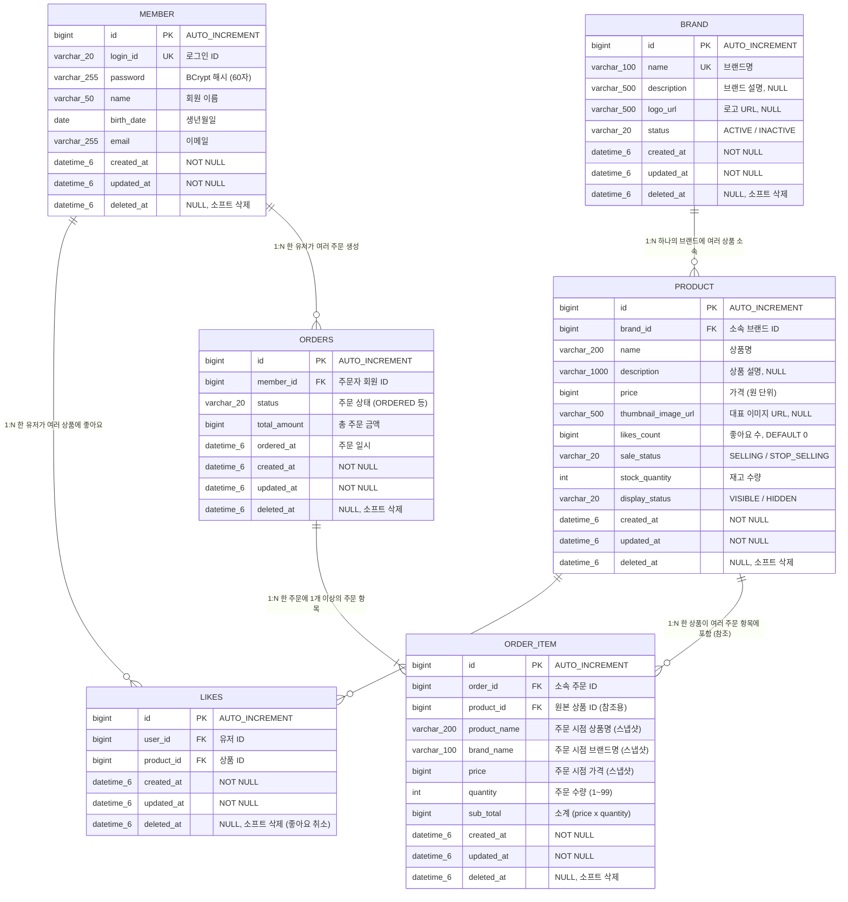

# 전체 도메인 통합 ERD

## 개요

이 문서는 프로젝트의 전체 도메인(유저, 브랜드-상품, 브랜드-상품 Admin, 좋아요, 주문, 주문 Admin)에 걸친 데이터베이스 테이블 구조를 하나의 ERD로 통합합니다.
각 도메인별 상세 명세는 아래 원본 문서를 참고하세요.

| 도메인 | 원본 문서 |
|--------|----------|
| 유저 | `docs/유저/04-erd.md` |
| 브랜드-상품 | `docs/브랜드-상품/04-erd.md` |
| 브랜드-상품 Admin | `docs/브랜드-상품-Admin/04-erd.md` |
| 좋아요 | `docs/좋아요/04-erd.md` |
| 주문 | `docs/주문/04-erd.md` |
| 주문 Admin | `docs/주문-Admin/04-erd.md` |

모든 테이블은 `BaseEntity`를 상속하여 `id`, `created_at`, `updated_at`, `deleted_at` 공통 컬럼을 포함합니다.

---

## 1. 전체 ERD

---

## 2. 테이블 요약

| 테이블 | 도메인 | 설명 |
|--------|--------|------|
| `member` | 유저 | 회원 정보. 로그인, 인증, 주문/좋아요의 주체 |
| `brand` | 브랜드-상품 | 브랜드 정보. 상품의 상위 그룹 |
| `product` | 브랜드-상품 | 상품 정보. 브랜드에 소속되며 주문/좋아요의 대상 |
| `likes` | 좋아요 | 유저-상품 좋아요 관계. UNIQUE(user_id, product_id) |
| `orders` | 주문 | 주문 헤더. 주문자와 총액 정보 |
| `order_item` | 주문 | 주문 항목. 주문 시점의 상품 정보를 스냅샷으로 보존 |

---

## 3. 테이블간 관계

| 관계 | 카디널리티 | FK | 삭제 정책 | 설명 |
|------|-----------|----|---------|----|
| `brand` -> `product` | 1:N | `product.brand_id` -> `brand.id` | 연쇄 소프트 삭제 | 브랜드 소프트 삭제 시 소속 상품도 함께 소프트 삭제 |
| `member` -> `likes` | 1:N | `likes.user_id` -> `member.id` | 소프트 삭제 독립 | 유저 삭제 시 좋아요 기록 보존 |
| `product` -> `likes` | 1:N | `likes.product_id` -> `product.id` | 소프트 삭제 독립 | 상품 삭제 시 좋아요 기록 보존 (isDeleted 표시) |
| `member` -> `orders` | 1:N | `orders.member_id` -> `member.id` | 소프트 삭제 독립 | 유저 삭제 시 주문 데이터 보존 |
| `orders` -> `order_item` | 1:N | `order_item.order_id` -> `orders.id` | 연쇄 소프트 삭제 | 주문 소프트 삭제 시 주문 항목도 함께 소프트 삭제 |
| `product` -> `order_item` | 1:N (참조) | `order_item.product_id` -> `product.id` | 참조 유지 (FK 없음) | 상품 삭제 시 스냅샷 데이터로 원본 정보 보존 |

---

## 4. 유니크 제약 조건

| 테이블 | 제약 조건 | 설명 |
|--------|----------|------|
| `member` | `UNIQUE(login_id)` | 로그인 ID 중복 방지 |
| `brand` | `UNIQUE(name)` | 브랜드명 중복 방지 (애플리케이션 레벨에서 `deleted_at IS NULL` 조건부 검증) |
| `likes` | `UNIQUE(user_id, product_id)` | 동일 유저의 동일 상품 중복 좋아요 방지 |

---

## 5. Enum 값 정의

### brand.status

| 값 | 설명 |
|----|------|
| `ACTIVE` | 활성 상태. 소속 상품이 대고객 API에서 정상 노출 |
| `INACTIVE` | 비활성 상태. 소속 상품이 대고객 API에서 비노출 |

### product.sale_status

| 값 | 설명 |
|----|------|
| `SELLING` | 판매 중. 대고객 API에서 주문 가능 |
| `STOP_SELLING` | 판매 중지. 조회는 가능하지만 주문 불가 |

### product.display_status

| 값 | 설명 |
|----|------|
| `VISIBLE` | 노출. 대고객 API에서 조회 가능 |
| `HIDDEN` | 숨김. 어드민 API에서만 관리 |

### orders.status

| 값 | 설명 |
|----|------|
| `ORDERED` | 주문 완료 (초기 상태) |
| `PREPARING` | 배송 준비 중 |
| `SHIPPING` | 배송 중 |
| `DELIVERED` | 배송 완료 |
| `CANCELLED` | 주문 취소 |

---

## 6. 스냅샷 설계

`order_item` 테이블은 주문 시점의 상품 정보를 스냅샷으로 저장합니다.
이후 상품의 이름, 가격, 브랜드명이 변경되어도 주문 내역에는 주문 당시의 정보가 유지됩니다.

| 스냅샷 필드 | 원본 출처 | 설명 |
|------------|----------|------|
| `order_item.product_name` | `product.name` | 주문 시점 상품명 |
| `order_item.brand_name` | `brand.name` (product.brand_id 경유) | 주문 시점 브랜드명 |
| `order_item.price` | `product.price` | 주문 시점 상품 가격 |

`order_item.product_id`는 원본 상품 추적을 위한 참조용 컬럼이며, FK 제약을 두지 않습니다.
상품이 삭제되어도 주문 항목의 스냅샷 데이터는 영향받지 않습니다.
