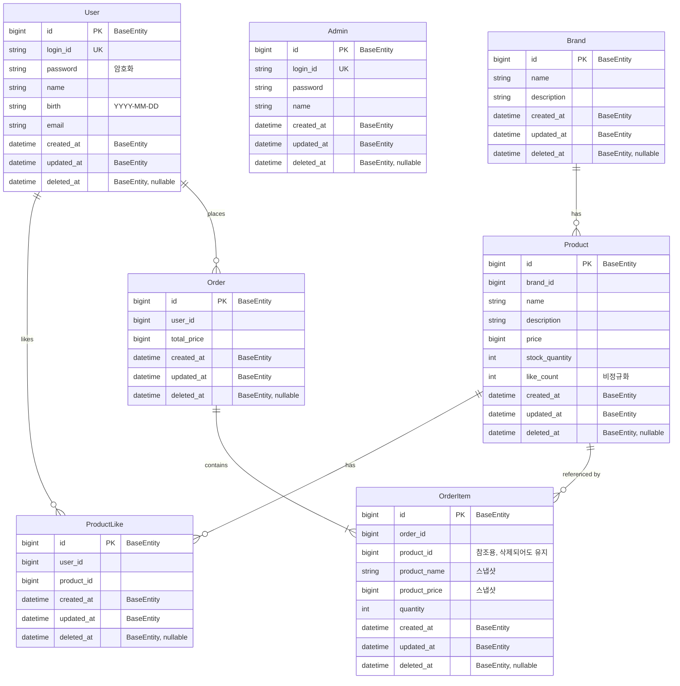

# ERD

**왜 필요한가**: Soft Delete 정책과 주문 스냅샷 구조를 검증하기 위함입니다. 특히 `deletedAt` 필드 위치와 OrderItem의 스냅샷 컬럼이 핵심입니다.

**해석 포인트**:
- 모든 엔티티가 `BaseEntity`를 상속 → `id`, `created_at`, `updated_at`, `deleted_at` 공통 제공
- `deleted_at`은 모든 테이블에 존재하지만, 실제 Soft Delete 활용은 Brand, Product에서 주로 사용
- `User`는 기존 구현된 도메인 구조 반영 → `login_id`, `birth` 필드 포함, 비밀번호 암호화
- `OrderItem`은 `product_id`를 참조하되, `product_name`과 `product_price`를 스냅샷으로 저장
