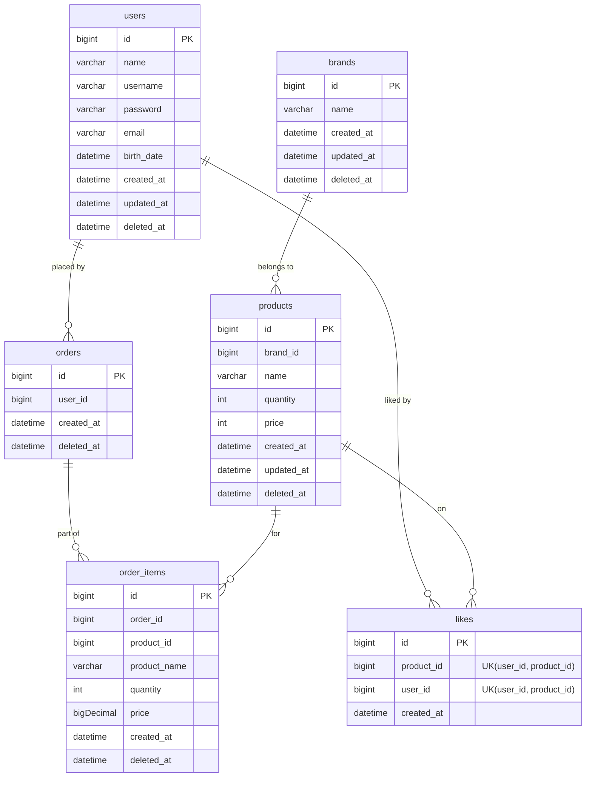

# ERD

```mermaid
%% FK 미사용: 데드락, 마이그레이션, 성능 이유로 DB FK 제약조건을 걸지 않는다.
%% 정합성은 어플리케이션 레벨에서 관리한다.
%% 아래 관계선(||--o{)은 논리적 참조 관계를 나타내며, DB 레벨 FK가 아니다.

erDiagram
    users {
        bigint id PK
        varchar name
        varchar username
        varchar password
        varchar email
        datetime birth_date
        datetime created_at
        datetime updated_at
        datetime deleted_at
    }
    brands {
        bigint id PK
        varchar name
        datetime created_at
        datetime updated_at
        datetime deleted_at
    }
    products {
        bigint id PK
        bigint brand_id
        varchar name
        int quantity
        int price
        datetime created_at
        datetime updated_at
        datetime deleted_at
    }
    likes {
        bigint id PK
        bigint product_id "UK(user_id, product_id)"
        bigint user_id "UK(user_id, product_id)"
        datetime created_at
    }
    orders {
        bigint id PK
        bigint user_id
        datetime created_at
        datetime deleted_at
    }
    order_items {
        bigint id PK
        bigint order_id
        bigint product_id
        varchar product_name
        int quantity
        bigDecimal price
        datetime created_at
        datetime deleted_at
    }
    brands ||--o{ products : "belongs to"
    users ||--o{ orders : "placed by"
    users ||--o{ likes : "liked by"
    products ||--o{ likes : "on"
    orders ||--o{ order_items : "part of"
    products ||--o{ order_items : "for"
```
