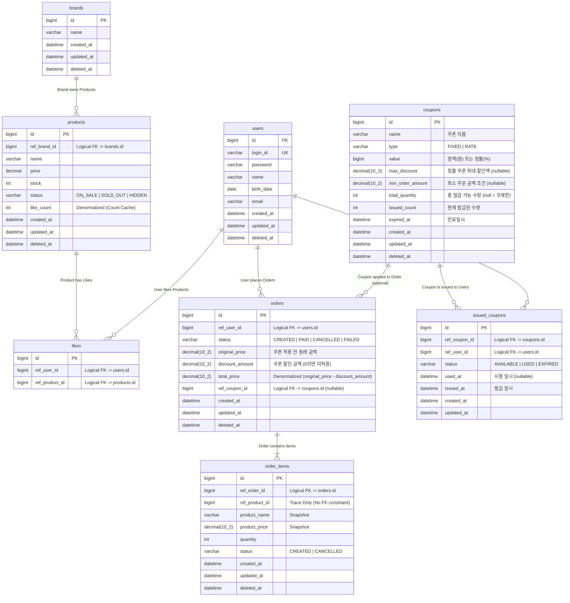

# ERD (Entity-Relationship Diagram)

영속성 구조를 정의한다. JPA Entity(Persistence Model) 기준의 물리 스키마와 인덱스 전략을 기술한다. Domain Model과 JPA Entity는 완전 분리되어 있으며, 이 문서의 스키마는 `infrastructure/` 레이어의 XxxEntity 클래스에 대응한다.

---

## 1. 전체 ERD & 설계 원칙

### 1.1 설계 원칙 (Key Design Decisions)

1. **논리적 FK 사용 (No Physical FK)**
    * 확장성과 데드락 방지를 위해 물리적 Foreign Key 제약조건을 제거하고, 애플리케이션 레벨에서 참조 무결성을 관리한다.
    * `brands`, `products` 삭제 시 연관 데이터 처리는 애플리케이션의 Soft Delete 로직을 따른다.
2. **주문-상품 스냅샷 (Snapshot)**
    * `order_items`는 상품의 현재 상태(`products`)를 참조하지 않고, 주문 시점의 데이터(`product_name`, `product_price`)를 복제하여 저장한다.
    * 상품 정보가 변경되거나 삭제되어도 주문 이력의 무결성을 보장한다.
3. **반정규화 (Denormalization)**
    * 조회 성능 최적화를 위해 `orders.total_price`, `products.like_count` 등 집계 데이터를 컬럼으로 관리한다.
    * 데이터 정합성은 트랜잭션 범위 내 동기화로 보장한다.

### 1.2 Mermaid ERD

```mermaid
erDiagram
    users {
        bigint id PK
        varchar login_id UK
        varchar password
        varchar name
        date birth_date
        varchar email
        datetime created_at
        datetime updated_at
        datetime deleted_at
    }

    brands {
        bigint id PK
        varchar name
        datetime created_at
        datetime updated_at
        datetime deleted_at
    }

    products {
        bigint id PK
        bigint ref_brand_id "Logical FK -> brands.id"
        varchar name
        decimal price
        int stock
        varchar status "ON_SALE | SOLD_OUT | HIDDEN"
        int like_count "Denormalized (Count Cache)"
        datetime created_at
        datetime updated_at
        datetime deleted_at
    }

    likes {
        bigint id PK
        bigint ref_user_id "Logical FK -> users.id"
        bigint ref_product_id "Logical FK -> products.id"
    }

    orders {
        bigint id PK
        bigint ref_user_id "Logical FK -> users.id"
        varchar status "CREATED | PAID | CANCELLED | FAILED"
        decimal(10_2) original_price "쿠폰 적용 전 원래 금액"
        decimal(10_2) discount_amount "쿠폰 할인 금액 (0이면 미적용)"
        decimal(10_2) total_price "Denormalized (original_price - discount_amount)"
        bigint ref_coupon_id "Logical FK -> coupons.id (nullable)"
        datetime created_at
        datetime updated_at
        datetime deleted_at
    }

    coupons {
        bigint id PK
        varchar name "쿠폰 이름"
        varchar type "FIXED | RATE"
        bigint value "정액(원) 또는 정률(%)"
        decimal(10_2) max_discount "정률 쿠폰 최대 할인액 (nullable)"
        decimal(10_2) min_order_amount "최소 주문 금액 조건 (nullable)"
        int total_quantity "총 발급 가능 수량 (null = 무제한)"
        int issued_count "현재 발급된 수량"
        datetime expired_at "만료일시"
        datetime created_at
        datetime updated_at
        datetime deleted_at
    }

    issued_coupons {
        bigint id PK
        bigint ref_coupon_id "Logical FK -> coupons.id"
        bigint ref_user_id "Logical FK -> users.id"
        varchar status "AVAILABLE | USED | EXPIRED"
        datetime used_at "사용 일시 (nullable)"
        datetime issued_at "발급 일시"
        datetime created_at
        datetime updated_at
    }

    order_items {
        bigint id PK
        bigint ref_order_id "Logical FK -> orders.id"
        bigint ref_product_id "Trace Only (No FK constraint)"
        varchar product_name "Snapshot"
        decimal(10_2) product_price "Snapshot"
        int quantity
        varchar status "CREATED | CANCELLED"
        datetime created_at
        datetime updated_at
        datetime deleted_at
    }

    brands ||--o{ products: "Brand owns Products"
    products ||--o{ likes: "Product has Likes"
    users ||--o{ likes: "User likes Products"
    users ||--o{ orders: "User places Orders"
    orders ||--|{ order_items: "Order contains Items"
    coupons ||--o{ issued_coupons: "Coupon is issued to Users"
    users ||--o{ issued_coupons: "User holds IssuedCoupons"
    coupons ||--o{ orders: "Coupon applied to Order (optional)"
```

---

## 2. 스키마 상세 (Schema Details)

### 2.1 Core Domain (Products & Brands)

| 테이블          | 컬럼           | 타입            | 제약조건         | 설명                                         |
|--------------|--------------|---------------|--------------|--------------------------------------------|
| **brands**   | id           | BIGINT        | PK, Auto Inc |                                            |
|              | name         | VARCHAR(255)  | NOT NULL     | 브랜드명 (빈 값 불가, BrandName VO에서 검증)                |
| **products** | id           | BIGINT        | PK, Auto Inc |                                            |
|              | ref_brand_id | BIGINT        | NOT NULL     | [논리FK] Brand 참조                            |
|              | name         | VARCHAR(255)  | NOT NULL     | 상품명                                        |
|              | price        | DECIMAL(19,2) | NOT NULL     | 상품 가격 (>= 0, Price VO에서 검증)                 |
|              | stock        | INT           | NOT NULL     | 재고 수량 (VO: Stock >= 0)                     |
|              | status       | VARCHAR(20)   | NOT NULL     | 상품 상태 (`@Enumerated(STRING)` → VARCHAR 매핑) |
|              | like_count   | INT           | NOT NULL     | [반정규화] 좋아요 수 캐싱                            |

### 2.2 Order Domain

| 테이블             | 컬럼              | 타입            | 제약조건         | 설명                                         |
|-----------------|-----------------|---------------|--------------|--------------------------------------------|
| **orders**      | id              | BIGINT        | PK, Auto Inc |                                            |
|                 | ref_user_id     | BIGINT        | NOT NULL     | [논리FK] User 참조                             |
|                 | status          | VARCHAR(20)   | NOT NULL     | 주문 상태 (`@Enumerated(STRING)` → VARCHAR 매핑) |
|                 | original_price  | DECIMAL(10,2) | NOT NULL     | 쿠폰 적용 전 원래 금액                              |
|                 | discount_amount | DECIMAL(10,2) | NOT NULL     | 쿠폰 할인 금액 (미적용 시 0)                         |
|                 | total_price     | DECIMAL(10,2) | NOT NULL     | [반정규화] 주문 총액 (original_price - discount_amount) |
|                 | ref_coupon_id   | BIGINT        | NULL 허용      | [논리FK] 적용된 쿠폰 참조 (미적용 시 null)              |
| **order_items** | id              | BIGINT        | PK, Auto Inc |                                            |
|                 | ref_order_id    | BIGINT        | NOT NULL     | [논리FK] Order 참조 (Aggregate Root)           |
|                 | ref_product_id  | BIGINT        | NOT NULL     | 단순 참조용 (데이터 추적)                            |
|                 | product_name    | VARCHAR(255)  | NOT NULL     | [Snapshot] 주문 시점 상품명                       |
|                 | product_price   | DECIMAL(10,2) | NOT NULL     | [Snapshot] 주문 시점 가격                        |
|                 | quantity        | INT           | NOT NULL     | 주문 수량 (>= 1)                               |
|                 | status          | VARCHAR(20)   | NOT NULL     | 주문 항목 상태 (`@Enumerated(STRING)` → VARCHAR 매핑) |

### 2.3 Coupon Domain

| 테이블                | 컬럼               | 타입            | 제약조건         | 설명                                              |
|--------------------|------------------|---------------|--------------|-------------------------------------------------|
| **coupons**        | id               | BIGINT        | PK, Auto Inc |                                                 |
|                    | name             | VARCHAR(255)  | NOT NULL     | 쿠폰 이름 (빈 값 불가)                                  |
|                    | type             | VARCHAR(20)   | NOT NULL     | 할인 타입 (FIXED / RATE)                            |
|                    | value            | BIGINT        | NOT NULL     | 할인 값 (FIXED: 원, RATE: %)                        |
|                    | max_discount     | DECIMAL(10,2) | NULL 허용      | 정률 쿠폰 최대 할인 금액 상한                               |
|                    | min_order_amount | DECIMAL(10,2) | NULL 허용      | 최소 주문 금액 조건                                     |
|                    | total_quantity   | INT           | NULL 허용      | 총 발급 가능 수량 (null = 무제한)                         |
|                    | issued_count     | INT           | NOT NULL     | 현재 발급된 수량 (>= 0)                                |
|                    | expired_at       | DATETIME      | NOT NULL     | 쿠폰 만료 일시                                        |
| **issued_coupons** | id               | BIGINT        | PK, Auto Inc |                                                 |
|                    | ref_coupon_id    | BIGINT        | NOT NULL     | [논리FK] Coupon 참조                               |
|                    | ref_user_id      | BIGINT        | NOT NULL     | [논리FK] User 참조                                 |
|                    | status           | VARCHAR(20)   | NOT NULL     | 발급 쿠폰 상태 (AVAILABLE / USED / EXPIRED)          |
|                    | used_at          | DATETIME      | NULL 허용      | 사용 일시 (미사용 시 null)                              |
|                    | issued_at        | DATETIME      | NOT NULL     | 발급 일시                                           |
|                    | (UK)             |               | UNIQUE       | `(ref_coupon_id, ref_user_id)` 중복 발급 방지         |

### 2.3 User Interaction

| 테이블       | 컬럼             | 타입     | 제약조건         | 설명                                    |
|-----------|----------------|--------|--------------|---------------------------------------|
| **likes** | id             | BIGINT | PK, Auto Inc |                                       |
|           | ref_user_id    | BIGINT | NOT NULL     | [논리FK] User 참조                        |
|           | ref_product_id | BIGINT | NOT NULL     | [논리FK] Product 참조                     |
|           | (UK)           |        | UNIQUE       | `(ref_user_id, ref_product_id)` 중복 방지 |

*참고: 모든 테이블(likes 제외)은 `created_at`, `updated_at`, `deleted_at`(Soft Delete)을 공통으로 포함한다.*

---

## 3. 인덱스 전략 (Indexing Strategy)

조회 성능과 데이터 정합성을 위한 인덱스 구성이다.

| 대상 테이블              | 인덱스 컬럼                                  | 타입        | 목적                             |
|---------------------|-----------------------------------------|-----------|--------------------------------|
| **products**        | `(ref_brand_id)`                        | Normal    | 브랜드별 상품 리스트 조회                 |
| **products**        | `(deleted_at, status, like_count DESC)` | Composite | 활성 상품 인기순 정렬 조회 (커버링)          |
| **products**        | `(deleted_at, status, created_at DESC)` | Composite | 활성 상품 최신순 정렬 조회 (커버링)          |
| **products**        | `(deleted_at, status, price ASC)`       | Composite | 활성 상품 낮은 가격순 정렬 조회 (커버링)       |
| **likes**           | `(ref_user_id, ref_product_id)`         | UNIQUE    | 중복 좋아요 방지 및 유저별 좋아요 목록 조회      |
| **orders**          | `(ref_user_id, created_at)`             | Composite | 유저별 주문 이력 조회 (최신순)             |
| **order_items**     | `(ref_order_id, ref_product_id)`        | Normal    | 주문별 상품 항목 조회                   |
| **order_items**     | `(ref_product_id)`                      | Normal    | 상품별 주문 이력 추적 (논리FK, 명시적 추가 필요) |
| **coupons**         | `(expired_at, deleted_at)`              | Composite | 유효한 쿠폰 조회                       |
| **issued_coupons**  | `(ref_coupon_id, ref_user_id)`          | UNIQUE    | 중복 발급 방지 및 쿠폰별 발급 내역 조회        |
| **issued_coupons**  | `(ref_user_id)`                         | Normal    | 사용자별 보유 쿠폰 목록 조회               |

> `likes(ref_user_id, ref_product_id)` UNIQUE 인덱스가 `ref_user_id` 단독 조회도 커버하므로, 별도 ref_user_id 인덱스는 불필요하다. \
> likes 테이블에 created_at은 두지 않는다. 최신순 정렬이 필요하면 id 역순으로 대체한다. \
> 어드민 조회는 현재 필터 없이 `findAll(pageable)`을 사용한다. 운영 데이터 증가 시 `products(ref_brand_id, created_at)` 등 어드민 전용 복합 인덱스를 추가로
> 검토한다. \
> 복합 인덱스의 컬럼 순서는 현재 WHERE 절 패턴 기준으로 설정하였다. 운영 단계에서 실제 데이터 분포도(Cardinality)에 따라 컬럼 순서를 재조정할 수 있다.

---

## 4. 정규화 판단

### 반정규화 필드

| 테이블         | 컬럼            | 반정규화 사유                             | 정합성 유지 방법                   |
|-------------|---------------|-------------------------------------|-----------------------------|
| products    | like_count    | likes_desc 정렬 성능. COUNT 쿼리 매번 실행 불가 | 좋아요 등록/취소 시 동기 증감 (같은 트랜잭션) |
| order_items | product_name  | 주문 시점 상품 정보 보존                      | 주문 생성 시 1회 복사, 이후 불변        |
| order_items | product_price | 주문 시점 가격 보존                         | 주문 생성 시 1회 복사, 이후 불변        |
| orders      | total_price   | 주문 목록 조회 시 OrderItem 로딩 없이 총액 제공    | 주문 생성 시 1회 계산, 이후 불변        |

### 정규화 유지

- brands ↔ products: 정규화 유지. products에 brand_name을 두지 않고 ref_brand_id FK로 참조한다.
- users ↔ likes/orders: 정규화 유지. ref_user_id FK로 참조한다.

---

## 5. 데이터 무결성 및 리스크 관리

물리적 제약조건을 완화(No FK, 반정규화)함에 따라 발생하는 리스크와 대응 방안이다.

| 구분            | 잠재 리스크                                                                                                                   | 대응 전략 (Architecture & Implementation)                                                              |
|---------------|--------------------------------------------------------------------------------------------------------------------------|----------------------------------------------------------------------------------------------------|
| **동시성**       | `like_count` 손실 갱신 (Lost Update)                                                                                         | 좋아요 등록/취소 트랜잭션 내에서 **Atomic Update** 또는 락 처리                                                       |
| **정합성**       | 상품 정보 변경 시 주문 이력 왜곡                                                                                                      | `order_items`에 **Snapshot 컬럼**(name, price)을 두어 불변성 보장                                             |
| **참조 무결성**    | 삭제된 Brand의 Product 잔존 (Orphan)                                                                                           | 애플리케이션 레벨의 **Cascade Soft Delete** 로직 구현                                                           |
| **성능**        | `orders` 기간 조회 성능 저하                                                                                                     | 복합 인덱스 활용 및 어플리케이션 단에서 **조회 기간 제한** (Pagination)                                                   |
| **비대화**       | products에 stock, like_count, status 집중 → 빈번한 UPDATE                                                                      | 현재 규모 무시 가능. 향후 stock 분리, like_count Redis 이관 검토                                                   |
| **불변성**       | order_items 스냅샷이 애플리케이션에서만 불변 보장 (DB 제약 없음)                                                                              | 코드 리뷰로 관리. 필요 시 DB 트리거 또는 불변 테이블 전략 검토                                                             |
| **쿼리 복잡도**    | 모든 조회에 `deleted_at IS NULL` 조건 필요                                                                                        | Repository 메서드마다 조건 명시. 필요 시 Hibernate `@Filter` 또는 `@SoftDelete` 검토                               |
| **복구 정합성**    | 상품 복구 시 likeCount와 실제 likes 수 불일치 가능                                                                                     | 어드민 전용 복구 API 제공. `deleted_at`을 `null`로 설정하여 복구하며, 멱등하게 동작한다. Brand와 Product에 대해 개별 복구 API를 제공한다.  |
| **인덱스 커버리지**  | `refBrandId` 필터 + 정렬 조합 시 기존 복합 인덱스 미활용 (`(ref_brand_id)` 단독 → filesort, `(deleted_at, status, ...)` → ref_brand_id 후필터) | 현재 데이터 규모에서 무시 가능. 데이터 증가 시 `(ref_brand_id, deleted_at, status, created_at)` 등 브랜드 기반 복합 인덱스 추가 검토 |
| **UK 충돌**     | Soft Delete 된 login_id, brand name 재사용 시 UK 중복 에러                                                                        | 탈퇴/삭제 시 식별자 변조 (예: `name_deleted_{timestamp}`) 또는 정책 결정 필요. MySQL은 Partial Unique Index 미지원        |
