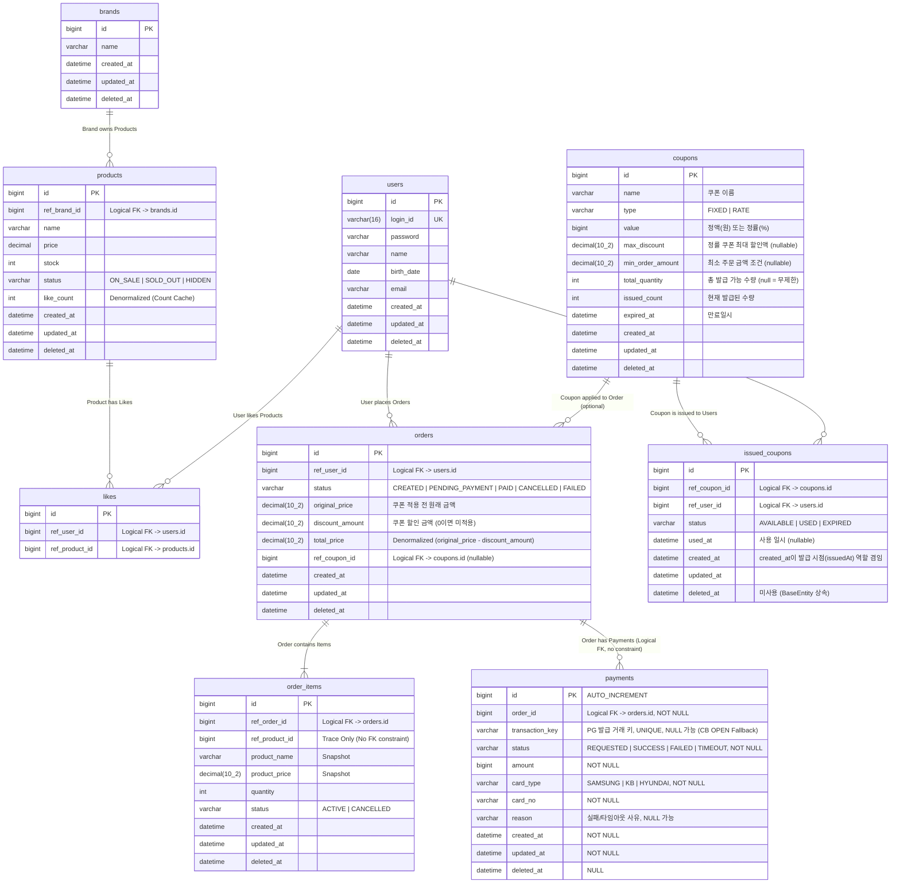

# ERD (Entity-Relationship Diagram)

영속성 구조를 정의한다. JPA Entity(Persistence Model) 기준의 물리 스키마와 인덱스 전략을 기술한다. Domain Model과 JPA Entity는 완전 분리되어 있으며, 이 문서의 스키마는 `infrastructure/` 레이어의 XxxEntity 클래스에 대응한다.

---

## 1. 전체 ERD & 설계 원칙

### 1.1 설계 원칙 (Key Design Decisions)

1. **논리적 FK 사용 (No Physical FK)**
    * 확장성과 데드락 방지를 위해 물리적 Foreign Key 제약조건을 제거하고, 애플리케이션 레벨에서 참조 무결성을 관리한다.
    * `brands`, `products` 삭제 시 연관 데이터 처리는 애플리케이션의 Soft Delete 로직을 따른다.
2. **주문-상품 스냅샷 (Snapshot)**
    * `order_items`는 상품의 현재 상태(`products`)를 참조하지 않고, 주문 시점의 데이터(`product_name`, `product_price`)를 복제하여 저장한다.
    * 상품 정보가 변경되거나 삭제되어도 주문 이력의 무결성을 보장한다.
3. **반정규화 (Denormalization)**
    * 조회 성능 최적화를 위해 `orders.total_price`, `products.like_count` 등 집계 데이터를 컬럼으로 관리한다.
    * 데이터 정합성은 트랜잭션 범위 내 동기화로 보장한다.
4. **결제-주문 BC 분리 (Separate Bounded Context)**
    * `payments`와 `orders`는 별도 Bounded Context로 분리한다. 물리 FK 없이 `order_id`로 논리 참조한다.
    * `transaction_key`는 PG 응답 전 NULL 가능하다 (Circuit Breaker OPEN Fallback으로 TIMEOUT Payment 생성 시).
    * 인덱스 후보: `(order_id)` — 주문별 결제 이력 조회, `(status)` — REQUESTED/TIMEOUT 조건 재처리 조회 최적화.

### 1.2 Mermaid ERD

```mermaid
erDiagram
    users {
        bigint id PK
        varchar(16) login_id UK
        varchar password
        varchar name
        date birth_date
        varchar email
        datetime created_at
        datetime updated_at
        datetime deleted_at
    }

    brands {
        bigint id PK
        varchar name
        datetime created_at
        datetime updated_at
        datetime deleted_at
    }

    products {
        bigint id PK
        bigint ref_brand_id "Logical FK -> brands.id"
        varchar name
        decimal price
        int stock
        varchar status "ON_SALE | SOLD_OUT | HIDDEN"
        int like_count "Denormalized (Count Cache)"
        datetime created_at
        datetime updated_at
        datetime deleted_at
    }

    likes {
        bigint id PK
        bigint ref_user_id "Logical FK -> users.id"
        bigint ref_product_id "Logical FK -> products.id"
    }

    orders {
        bigint id PK
        bigint ref_user_id "Logical FK -> users.id"
        varchar status "CREATED | PENDING_PAYMENT | PAID | CANCELLED | FAILED"
        decimal(10_2) original_price "쿠폰 적용 전 원래 금액"
        decimal(10_2) discount_amount "쿠폰 할인 금액 (0이면 미적용)"
        decimal(10_2) total_price "Denormalized (original_price - discount_amount)"
        bigint ref_coupon_id "Logical FK -> coupons.id (nullable)"
        datetime created_at
        datetime updated_at
        datetime deleted_at
    }

    coupons {
        bigint id PK
        varchar name "쿠폰 이름"
        varchar type "FIXED | RATE"
        bigint value "정액(원) 또는 정률(%)"
        decimal(10_2) max_discount "정률 쿠폰 최대 할인액 (nullable)"
        decimal(10_2) min_order_amount "최소 주문 금액 조건 (nullable)"
        int total_quantity "총 발급 가능 수량 (null = 무제한)"
        int issued_count "현재 발급된 수량"
        datetime expired_at "만료일시"
        datetime created_at
        datetime updated_at
        datetime deleted_at
    }

    issued_coupons {
        bigint id PK
        bigint ref_coupon_id "Logical FK -> coupons.id"
        bigint ref_user_id "Logical FK -> users.id"
        varchar status "AVAILABLE | USED | EXPIRED"
        datetime used_at "사용 일시 (nullable)"
        datetime created_at "created_at이 발급 시점(issuedAt) 역할 겸임"
        datetime updated_at
        datetime deleted_at "미사용 (BaseEntity 상속)"
    }

    order_items {
        bigint id PK
        bigint ref_order_id "Logical FK -> orders.id"
        bigint ref_product_id "Trace Only (No FK constraint)"
        varchar product_name "Snapshot"
        decimal(10_2) product_price "Snapshot"
        int quantity
        varchar status "ACTIVE | CANCELLED"
        datetime created_at
        datetime updated_at
        datetime deleted_at
    }

    payments {
        bigint id PK "AUTO_INCREMENT"
        bigint order_id "Logical FK -> orders.id, NOT NULL"
        varchar transaction_key "PG 발급 거래 키, UNIQUE, NULL 가능 (CB OPEN Fallback)"
        varchar status "REQUESTED | SUCCESS | FAILED | TIMEOUT, NOT NULL"
        bigint amount "NOT NULL"
        varchar card_type "SAMSUNG | KB | HYUNDAI, NOT NULL"
        varchar card_no "NOT NULL"
        varchar reason "실패/타임아웃 사유, NULL 가능"
        datetime created_at "NOT NULL"
        datetime updated_at "NOT NULL"
        datetime deleted_at "NULL"
    }

    brands ||--o{ products: "Brand owns Products"
    products ||--o{ likes: "Product has Likes"
    users ||--o{ likes: "User likes Products"
    users ||--o{ orders: "User places Orders"
    orders ||--|{ order_items: "Order contains Items"
    coupons ||--o{ issued_coupons: "Coupon is issued to Users"
    users ||--o{ issued_coupons: "User holds IssuedCoupons"
    coupons ||--o{ orders: "Coupon applied to Order (optional)"
    orders ||--o{ payments: "Order has Payments (Logical FK, no constraint)"
```

---

## 2. 스키마 상세 (Schema Details)

### 2.1 Core Domain (Products & Brands)

| 테이블          | 컬럼           | 타입            | 제약조건         | 설명                                         |
|--------------|--------------|---------------|--------------|--------------------------------------------|
| **brands**   | id           | BIGINT        | PK, Auto Inc |                                            |
|              | name         | VARCHAR(255)  | NOT NULL, UK | 브랜드명 (빈 값 불가, BrandName VO에서 검증)                |
| **products** | id           | BIGINT        | PK, Auto Inc |                                            |
|              | ref_brand_id | BIGINT        | NOT NULL     | [논리FK] Brand 참조                            |
|              | name         | VARCHAR(255)  | NOT NULL     | 상품명                                        |
|              | price        | DECIMAL(19,2) | NOT NULL     | 상품 가격 (>= 0, Price VO에서 검증)                 |
|              | stock        | INT           | NOT NULL     | 재고 수량 (VO: Stock >= 0)                     |
|              | status       | VARCHAR(20)   | NOT NULL     | 상품 상태 (`@Enumerated(STRING)` → VARCHAR 매핑) |
|              | like_count   | INT           | NOT NULL     | [반정규화] 좋아요 수 캐싱                            |

### 2.2 Order Domain

| 테이블             | 컬럼              | 타입            | 제약조건         | 설명                                         |
|-----------------|-----------------|---------------|--------------|--------------------------------------------|
| **orders**      | id              | BIGINT        | PK, Auto Inc |                                            |
|                 | ref_user_id     | BIGINT        | NOT NULL     | [논리FK] User 참조                             |
|                 | status          | VARCHAR       | NOT NULL     | 주문 상태 (`@Enumerated(STRING)` → VARCHAR 매핑) `CREATED | PENDING_PAYMENT | PAID | CANCELLED | FAILED` |
|                 | original_price  | DECIMAL(10,2) | NOT NULL     | 쿠폰 적용 전 원래 금액                              |
|                 | discount_amount | DECIMAL(10,2) | NOT NULL     | 쿠폰 할인 금액 (미적용 시 0)                         |
|                 | total_price     | DECIMAL(10,2) | NOT NULL     | [반정규화] 주문 총액 (original_price - discount_amount) |
|                 | ref_coupon_id   | BIGINT        | NULL 허용      | [논리FK] 적용된 쿠폰 참조 (미적용 시 null)              |
| **order_items** | id              | BIGINT        | PK, Auto Inc |                                            |
|                 | ref_order_id    | BIGINT        | NOT NULL     | [논리FK] Order 참조 (Aggregate Root)           |
|                 | ref_product_id  | BIGINT        | NOT NULL     | 단순 참조용 (데이터 추적)                            |
|                 | product_name    | VARCHAR(255)  | NOT NULL     | [Snapshot] 주문 시점 상품명                       |
|                 | product_price   | DECIMAL(10,2) | NOT NULL     | [Snapshot] 주문 시점 가격                        |
|                 | quantity        | INT           | NOT NULL     | 주문 수량 (>= 1)                               |
|                 | status          | VARCHAR       | NOT NULL     | 주문 항목 상태 (`@Enumerated(STRING)` → VARCHAR 매핑) |

### 2.3 Coupon Domain

| 테이블                | 컬럼               | 타입            | 제약조건         | 설명                                              |
|--------------------|------------------|---------------|--------------|-------------------------------------------------|
| **coupons**        | id               | BIGINT        | PK, Auto Inc |                                                 |
|                    | name             | VARCHAR(255)  | NOT NULL     | 쿠폰 이름 (빈 값 불가)                                  |
|                    | type             | VARCHAR(20)   | NOT NULL     | 할인 타입 (FIXED / RATE)                            |
|                    | value            | BIGINT        | NOT NULL     | 할인 값 (FIXED: 원, RATE: %)                        |
|                    | max_discount     | DECIMAL(10,2) | NULL 허용      | 정률 쿠폰 최대 할인 금액 상한                               |
|                    | min_order_amount | DECIMAL(10,2) | NULL 허용      | 최소 주문 금액 조건                                     |
|                    | total_quantity   | INT           | NULL 허용      | 총 발급 가능 수량 (null = 무제한)                         |
|                    | issued_count     | INT           | NOT NULL     | 현재 발급된 수량 (>= 0)                                |
|                    | expired_at       | DATETIME      | NOT NULL     | 쿠폰 만료 일시                                        |
| **issued_coupons** | id               | BIGINT        | PK, Auto Inc |                                                 |
|                    | ref_coupon_id    | BIGINT        | NOT NULL     | [논리FK] Coupon 참조                               |
|                    | ref_user_id      | BIGINT        | NOT NULL     | [논리FK] User 참조                                 |
|                    | status           | VARCHAR       | NOT NULL     | 발급 쿠폰 상태 (AVAILABLE / USED / EXPIRED)          |
|                    | used_at          | DATETIME      | NULL 허용      | 사용 일시 (미사용 시 null)                              |
|                    | created_at       | DATETIME      | NOT NULL     | 발급 일시 (created_at이 issuedAt 역할 겸임)              |
|                    | deleted_at       | DATETIME      | NULL 허용      | BaseEntity 상속으로 존재하나 soft delete 미적용            |
|                    | (UK)             |               | UNIQUE       | `(ref_coupon_id, ref_user_id)` 중복 발급 방지         |

### 2.4 Payment Domain

| 테이블           | 컬럼              | 타입          | 제약조건              | 설명                                                        |
|---------------|-----------------|-------------|-------------------|------------------------------------------------------------|
| **payments**  | id              | BIGINT      | PK, Auto Inc      |                                                            |
|               | order_id        | BIGINT      | NOT NULL          | [논리FK] Order 참조 (`orders.id`)                             |
|               | transaction_key | VARCHAR(255) | NULL 허용, UNIQUE  | PG 발급 거래 키. CB OPEN Fallback(TIMEOUT) 생성 시 null 가능        |
|               | status          | VARCHAR(20) | NOT NULL          | 결제 상태 (`@Enumerated(STRING)` → VARCHAR 매핑) `REQUESTED \| SUCCESS \| FAILED \| TIMEOUT` |
|               | amount          | BIGINT      | NOT NULL          | 결제 요청 금액 (원)                                              |
|               | card_type       | VARCHAR(20) | NOT NULL          | 카드 종류 `SAMSUNG \| KB \| HYUNDAI`                           |
|               | card_no         | VARCHAR(50) | NOT NULL          | 카드 번호                                                     |
|               | reason          | VARCHAR(255) | NULL 허용          | 실패/타임아웃 사유 (SUCCESS 시 null)                               |
|               | created_at      | DATETIME    | NOT NULL          |                                                            |
|               | updated_at      | DATETIME    | NOT NULL          |                                                            |
|               | deleted_at      | DATETIME    | NULL 허용           | Soft Delete                                                |

### 2.3 User Interaction

| 테이블       | 컬럼             | 타입     | 제약조건         | 설명                                    |
|-----------|----------------|--------|--------------|---------------------------------------|
| **likes** | id             | BIGINT | PK, Auto Inc |                                       |
|           | ref_user_id    | BIGINT | NOT NULL     | [논리FK] User 참조                        |
|           | ref_product_id | BIGINT | NOT NULL     | [논리FK] Product 참조                     |
|           | (UK)           |        | UNIQUE       | `(ref_user_id, ref_product_id)` 중복 방지 |

*참고: 모든 테이블(likes 제외)은 `created_at`, `updated_at`, `deleted_at`(Soft Delete)을 공통으로 포함한다.*

---

## 3. 인덱스 전략 (Indexing Strategy)

조회 성능과 데이터 정합성을 위한 인덱스 구성이다.

| 대상 테이블              | 인덱스 컬럼                                  | 타입        | 목적                             |
|---------------------|-----------------------------------------|-----------|--------------------------------|
| **brands**          | `(name)`                                | UNIQUE    | 브랜드명 중복 방지                      |
| **products**        | `(ref_brand_id)`                        | Normal    | 브랜드별 상품 리스트 조회                 |
| **products**        | `(deleted_at, status, like_count DESC)` | Composite | 활성 상품 인기순 정렬 조회 (커버링)          |
| **products**        | `(deleted_at, status, created_at DESC)` | Composite | 활성 상품 최신순 정렬 조회 (커버링)          |
| **products**        | `(deleted_at, status, price ASC)`       | Composite | 활성 상품 낮은 가격순 정렬 조회 (커버링)       |
| **likes**           | `(ref_user_id, ref_product_id)`         | UNIQUE    | 중복 좋아요 방지 및 유저별 좋아요 목록 조회      |
| **orders**          | `(ref_user_id, created_at)`             | Composite | 유저별 주문 이력 조회 (최신순)             |
| **order_items**     | `(ref_order_id, ref_product_id)`        | Normal    | 주문별 상품 항목 조회                   |
| **order_items**     | `(ref_product_id)`                      | Normal    | 상품별 주문 이력 추적 (논리FK, 명시적 추가 필요) |
| **coupons**         | `(expired_at, deleted_at)`              | Composite | 유효한 쿠폰 조회                       |
| **issued_coupons**  | `(ref_coupon_id, ref_user_id)`          | UNIQUE    | 중복 발급 방지 및 쿠폰별 발급 내역 조회        |
| **issued_coupons**  | `(ref_user_id)`                         | Normal    | 사용자별 보유 쿠폰 목록 조회               |
| **payments**        | `(order_id)`                            | Normal    | 주문별 결제 이력 조회                    |
| **payments**        | `(status)`                              | Normal    | REQUESTED/TIMEOUT 상태 결제 재처리 조회  |
| **payments**        | `(transaction_key)`                     | UNIQUE    | PG 거래 키 중복 방지 (NULL 허용)         |

> `likes(ref_user_id, ref_product_id)` UNIQUE 인덱스가 `ref_user_id` 단독 조회도 커버하므로, 별도 ref_user_id 인덱스는 불필요하다. \
> likes 테이블에 created_at은 두지 않는다. 최신순 정렬이 필요하면 id 역순으로 대체한다. \
> 어드민 조회는 현재 필터 없이 `findAll(pageable)`을 사용한다. 운영 데이터 증가 시 `products(ref_brand_id, created_at)` 등 어드민 전용 복합 인덱스를 추가로
> 검토한다. \
> 복합 인덱스의 컬럼 순서는 현재 WHERE 절 패턴 기준으로 설정하였다. 운영 단계에서 실제 데이터 분포도(Cardinality)에 따라 컬럼 순서를 재조정할 수 있다.

---

## 4. 정규화 판단

### 반정규화 필드

| 테이블         | 컬럼            | 반정규화 사유                             | 정합성 유지 방법                   |
|-------------|---------------|-------------------------------------|-----------------------------|
| products    | like_count    | likes_desc 정렬 성능. COUNT 쿼리 매번 실행 불가 | 좋아요 등록/취소 시 동기 증감 (같은 트랜잭션) |
| order_items | product_name  | 주문 시점 상품 정보 보존                      | 주문 생성 시 1회 복사, 이후 불변        |
| order_items | product_price | 주문 시점 가격 보존                         | 주문 생성 시 1회 복사, 이후 불변        |
| orders      | total_price   | 주문 목록 조회 시 OrderItem 로딩 없이 총액 제공    | 주문 생성 시 1회 계산, 이후 불변        |

### 정규화 유지

- brands ↔ products: 정규화 유지. products에 brand_name을 두지 않고 ref_brand_id FK로 참조한다.
- users ↔ likes/orders: 정규화 유지. ref_user_id FK로 참조한다.

---

## 5. 데이터 무결성 및 리스크 관리

물리적 제약조건을 완화(No FK, 반정규화)함에 따라 발생하는 리스크와 대응 방안이다.

| 구분            | 잠재 리스크                                                                                                                   | 대응 전략 (Architecture & Implementation)                                                              |
|---------------|--------------------------------------------------------------------------------------------------------------------------|----------------------------------------------------------------------------------------------------|
| **동시성**       | `like_count` 손실 갱신 (Lost Update)                                                                                         | 좋아요 등록/취소 트랜잭션 내에서 **Atomic Update** 또는 락 처리                                                       |
| **정합성**       | 상품 정보 변경 시 주문 이력 왜곡                                                                                                      | `order_items`에 **Snapshot 컬럼**(name, price)을 두어 불변성 보장                                             |
| **참조 무결성**    | 삭제된 Brand의 Product 잔존 (Orphan)                                                                                           | 애플리케이션 레벨의 **Cascade Soft Delete** 로직 구현                                                           |
| **성능**        | `orders` 기간 조회 성능 저하                                                                                                     | 복합 인덱스 활용 및 어플리케이션 단에서 **조회 기간 제한** (Pagination)                                                   |
| **비대화**       | products에 stock, like_count, status 집중 → 빈번한 UPDATE                                                                      | 현재 규모 무시 가능. 향후 stock 분리, like_count Redis 이관 검토                                                   |
| **불변성**       | order_items 스냅샷이 애플리케이션에서만 불변 보장 (DB 제약 없음)                                                                              | 코드 리뷰로 관리. 필요 시 DB 트리거 또는 불변 테이블 전략 검토                                                             |
| **쿼리 복잡도**    | 모든 조회에 `deleted_at IS NULL` 조건 필요                                                                                        | Repository 메서드마다 조건 명시. 필요 시 Hibernate `@Filter` 또는 `@SoftDelete` 검토                               |
| **복구 정합성**    | 상품 복구 시 likeCount와 실제 likes 수 불일치 가능                                                                                     | 어드민 전용 복구 API 제공. `deleted_at`을 `null`로 설정하여 복구하며, 멱등하게 동작한다. Brand와 Product에 대해 개별 복구 API를 제공한다.  |
| **인덱스 커버리지**  | `refBrandId` 필터 + 정렬 조합 시 기존 복합 인덱스 미활용 (`(ref_brand_id)` 단독 → filesort, `(deleted_at, status, ...)` → ref_brand_id 후필터) | 현재 데이터 규모에서 무시 가능. 데이터 증가 시 `(ref_brand_id, deleted_at, status, created_at)` 등 브랜드 기반 복합 인덱스 추가 검토 |
| **결제 중복 처리**  | 네트워크 재시도로 동일 주문에 REQUESTED 결제가 중복 생성될 수 있음                                                                                   | 애플리케이션 레벨에서 REQUESTED 상태 중복 체크. `transaction_key` UNIQUE 인덱스로 PG 응답 후 중복 방지                              |
| **결제-주문 정합성** | payments.order_id 참조 대상 주문이 삭제/취소되어도 물리 FK 없어 DB에서 감지 불가                                                                      | 애플리케이션 레벨에서 주문 상태 검증 후 결제 요청. 결제 완료 후 주문 상태를 PAID로 동기 전환하여 정합성 유지                                      |
| **CB OPEN 고아 결제** | Circuit Breaker OPEN 시 TIMEOUT Payment가 생성되나 PG 실제 결제 여부 불명                                                                   | 재처리 배치로 REQUESTED/TIMEOUT Payment를 주기적으로 PG 조회하여 최종 상태 확정                                               |
| **UK 충돌**     | Soft Delete 된 login_id, brand name 재사용 시 UK 중복 에러                                                                        | 탈퇴/삭제 시 식별자 변조 (예: `name_deleted_{timestamp}`) 또는 정책 결정 필요. MySQL은 Partial Unique Index 미지원        |

---

# Round 7 — 신규 테이블

---

## 6. Round 7 설계 원칙 추가

5. **도메인별 Outbox 테이블 (Per-Domain Outbox)**
    * 범용 JSON payload 테이블 대신 도메인별 Outbox 테이블 분리 (order_outbox, catalog_outbox, coupon_outbox).
    * 각 도메인의 aggregate ID에 직접 인덱스를 적용할 수 있어 조건 검색·정리 작업에 유리.
    * Trade-off: 테이블 수 증가 → 현재 토픽 3개이므로 관리 가능.

6. **ProductMetrics는 별도 읽기 모델**
    * products.like_count(동기 반정규화)와 별개로, product_metrics 테이블에 비동기 집계 데이터 유지.
    * 두 값의 일시적 불일치 허용 (eventual consistency).

7. **coupon_issue_requests는 요청 추적 테이블**
    * Kafka 비동기 처리 결과를 Polling으로 조회하기 위한 상태 추적 테이블.

## 7. Round 7 ERD

```mermaid
erDiagram
    %% 기존 테이블 (관계 표시용)
    orders { bigint id PK }
    products { bigint id PK }
    coupons { bigint id PK }
    users { bigint id PK }
    issued_coupons { bigint id PK }

    %% Outbox 테이블
    order_outbox {
        bigint id PK
        bigint ref_order_id "Logical FK -> orders.id"
        varchar event_type "ORDER_CREATED | PAYMENT_COMPLETED"
        varchar status "PENDING | PUBLISHED | FAILED"
        text payload "Kafka 메시지 본문 (JSON)"
        datetime created_at
        datetime published_at "발행 완료 시각 (nullable)"
    }

    catalog_outbox {
        bigint id PK
        bigint ref_product_id "Logical FK -> products.id"
        varchar event_type "PRODUCT_VIEWED | PRODUCT_LIKED | PRODUCT_UNLIKED"
        varchar status "PENDING | PUBLISHED | FAILED"
        text payload "Kafka 메시지 본문 (JSON)"
        datetime created_at
        datetime published_at "발행 완료 시각 (nullable)"
    }

    coupon_outbox {
        bigint id PK
        bigint ref_coupon_id "Logical FK -> coupons.id"
        varchar event_type "COUPON_ISSUED"
        varchar status "PENDING | PUBLISHED | FAILED"
        text payload "Kafka 메시지 본문 (JSON)"
        datetime created_at
        datetime published_at "발행 완료 시각 (nullable)"
    }

    %% 선착순 쿠폰 발급 요청
    coupon_issue_requests {
        bigint id PK
        bigint ref_coupon_id "Logical FK -> coupons.id"
        bigint ref_user_id "Logical FK -> users.id"
        varchar status "PENDING | SUCCESS | SOLD_OUT | DUPLICATE"
        bigint issued_coupon_id "Logical FK -> issued_coupons.id (nullable)"
        datetime created_at
        datetime processed_at "Consumer 처리 완료 시각 (nullable)"
    }

    %% 메트릭스 읽기 모델 (commerce-streamer)
    product_metrics {
        bigint product_id PK "Logical FK -> products.id"
        bigint view_count "상세 페이지 조회 수"
        bigint like_count "좋아요 수"
        bigint sales_count "판매량"
        bigint version "낙관적 동시성 제어"
        datetime updated_at
    }

    %% 멱등 처리 (commerce-streamer)
    event_handled {
        varchar event_id PK "이벤트 고유 ID (UUID)"
        datetime handled_at
    }

    %% 관계
    orders ||--o{ order_outbox : "이벤트 발행"
    products ||--o{ catalog_outbox : "이벤트 발행"
    coupons ||--o{ coupon_outbox : "이벤트 발행"
    coupons ||--o{ coupon_issue_requests : "발급 요청"
    users ||--o{ coupon_issue_requests : "요청자"
    coupon_issue_requests ||--o| issued_coupons : "발급 성공 시"
    products ||--o| product_metrics : "읽기 모델"
```

---

## 8. Round 7 스키마 상세

### 8.1 Outbox 테이블

세 Outbox 테이블은 동일한 구조를 가지며, aggregate ID 컬럼명만 다르다.

| 테이블 | 컬럼 | 타입 | 제약조건 | 설명 |
|-------|------|------|---------|------|
| **order_outbox** | id | BIGINT | PK, AUTO_INCREMENT | |
| | ref_order_id | BIGINT | NOT NULL | 주문 ID (Logical FK → orders.id) |
| | event_type | VARCHAR(50) | NOT NULL | ORDER_CREATED, PAYMENT_COMPLETED |
| | status | VARCHAR(20) | NOT NULL, DEFAULT 'PENDING' | PENDING → PUBLISHED / FAILED |
| | payload | TEXT | NOT NULL | Kafka 메시지 본문 (JSON) |
| | created_at | DATETIME | NOT NULL | 이벤트 생성 시각 |
| | published_at | DATETIME | NULL | Kafka 발행 완료 시각 |
| **catalog_outbox** | id | BIGINT | PK, AUTO_INCREMENT | |
| | ref_product_id | BIGINT | NOT NULL | 상품 ID (Logical FK → products.id) |
| | event_type | VARCHAR(50) | NOT NULL | PRODUCT_VIEWED, PRODUCT_LIKED, PRODUCT_UNLIKED |
| | status | VARCHAR(20) | NOT NULL, DEFAULT 'PENDING' | PENDING → PUBLISHED / FAILED |
| | payload | TEXT | NOT NULL | Kafka 메시지 본문 (JSON) |
| | created_at | DATETIME | NOT NULL | |
| | published_at | DATETIME | NULL | |
| **coupon_outbox** | id | BIGINT | PK, AUTO_INCREMENT | |
| | ref_coupon_id | BIGINT | NOT NULL | 쿠폰 ID (Logical FK → coupons.id) |
| | event_type | VARCHAR(50) | NOT NULL | COUPON_ISSUED |
| | status | VARCHAR(20) | NOT NULL, DEFAULT 'PENDING' | PENDING → PUBLISHED / FAILED |
| | payload | TEXT | NOT NULL | Kafka 메시지 본문 (JSON) |
| | created_at | DATETIME | NOT NULL | |
| | published_at | DATETIME | NULL | |

### 8.2 선착순 쿠폰 발급 요청

| 테이블 | 컬럼 | 타입 | 제약조건 | 설명 |
|-------|------|------|---------|------|
| **coupon_issue_requests** | id | BIGINT | PK, AUTO_INCREMENT | requestId로 Polling 조회 |
| | ref_coupon_id | BIGINT | NOT NULL | 대상 쿠폰 (Logical FK → coupons.id) |
| | ref_user_id | BIGINT | NOT NULL | 요청자 (Logical FK → users.id) |
| | status | VARCHAR(20) | NOT NULL, DEFAULT 'PENDING' | PENDING / SUCCESS / SOLD_OUT / DUPLICATE |
| | issued_coupon_id | BIGINT | NULL | 발급 성공 시 IssuedCoupon ID |
| | created_at | DATETIME | NOT NULL | 요청 시각 |
| | processed_at | DATETIME | NULL | Consumer 처리 완료 시각 |

### 8.3 메트릭스 (commerce-streamer)

| 테이블 | 컬럼 | 타입 | 제약조건 | 설명 |
|-------|------|------|---------|------|
| **product_metrics** | product_id | BIGINT | PK | 상품 ID (Logical FK → products.id), AUTO_INCREMENT 아님 |
| | view_count | BIGINT | NOT NULL, DEFAULT 0 | 상세 페이지 조회 수 |
| | like_count | BIGINT | NOT NULL, DEFAULT 0 | 좋아요 수 (비동기 집계) |
| | sales_count | BIGINT | NOT NULL, DEFAULT 0 | 판매량 |
| | version | BIGINT | NOT NULL, DEFAULT 0 | 낙관적 동시성 제어 |
| | updated_at | DATETIME | NOT NULL | 마지막 집계 시각 |

### 8.4 멱등 처리 (commerce-streamer)

| 테이블 | 컬럼 | 타입 | 제약조건 | 설명 |
|-------|------|------|---------|------|
| **event_handled** | event_id | VARCHAR(36) | PK | 이벤트 UUID. 중복 삽입 시 PK 위반으로 skip |
| | handled_at | DATETIME | NOT NULL | 처리 완료 시각 |

---

## 9. Round 7 인덱스 전략

| 대상 테이블 | 인덱스 컬럼 | 타입 | 목적 |
|-----------|----------|------|------|
| **order_outbox** | `(status, created_at)` | INDEX | Relay 폴링: PENDING 이벤트를 생성순으로 조회 |
| **catalog_outbox** | `(status, created_at)` | INDEX | Relay 폴링 |
| **coupon_outbox** | `(status, created_at)` | INDEX | Relay 폴링 |
| **order_outbox** | `(ref_order_id)` | INDEX | 주문별 이벤트 이력 조회 |
| **catalog_outbox** | `(ref_product_id)` | INDEX | 상품별 이벤트 이력 조회 |
| **coupon_outbox** | `(ref_coupon_id)` | INDEX | 쿠폰별 이벤트 이력 조회 |
| **coupon_issue_requests** | `(ref_coupon_id, ref_user_id)` | UNIQUE | 동일 쿠폰 + 사용자 중복 요청 방지 |
| **coupon_issue_requests** | `(ref_user_id, status)` | INDEX | 사용자별 발급 요청 목록 조회 |

---

## 10. Round 7 정규화 판단

### 반정규화 필드

| 테이블 | 컬럼 | 반정규화 사유 | 정합성 유지 방법 |
|-------|------|-----------|-------------|
| product_metrics | view_count | 조회 수 집계를 위한 읽기 모델 | Kafka 이벤트 소비 시 upsert |
| product_metrics | like_count | 비동기 좋아요 집계 (products.like_count와 별도) | Kafka 이벤트 소비 시 upsert |
| product_metrics | sales_count | 판매량 집계를 위한 읽기 모델 | Kafka 이벤트 소비 시 upsert |

---

## 11. Round 7 데이터 무결성 및 리스크 관리

| 구분 | 잠재 리스크 | 대응 전략 |
|------|----------|---------|
| **Outbox 테이블 증가** | 발행 완료 레코드가 계속 쌓임 → 디스크·쿼리 성능 영향 | 발행 완료(PUBLISHED) 레코드를 주기적으로 정리하는 배치 작업 (보존 기간 7일) |
| **product_metrics 불일치** | products.like_count와 product_metrics.like_count 간 일시적 불일치 | Eventual consistency 허용 (동기 UX vs 비동기 통계, 용도가 다름) |
| **coupon_issue_requests 중복** | 같은 사용자가 같은 쿠폰에 여러 번 요청 | UNIQUE 인덱스 (ref_coupon_id, ref_user_id)로 DB 레벨 방지 |
| **event_handled 증가** | 처리 완료 이벤트 ID가 무한 증가 | 오래된 레코드 주기적 정리 (Kafka 메시지 보존 기간과 동기화) |
| **Relay 폴링 부하** | 주기적 폴링이 DB에 부하 유발 | (status, created_at) 인덱스로 최적화 |
