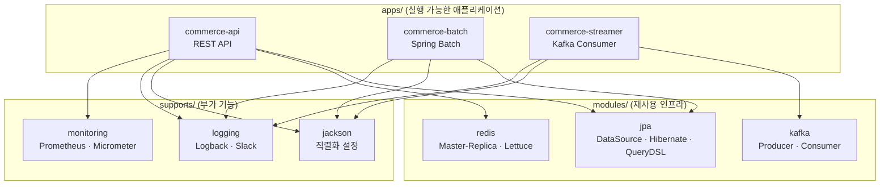
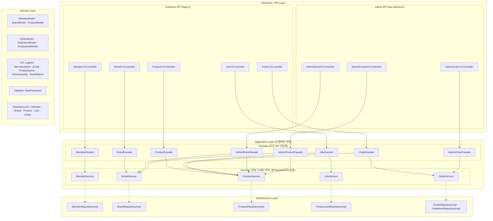
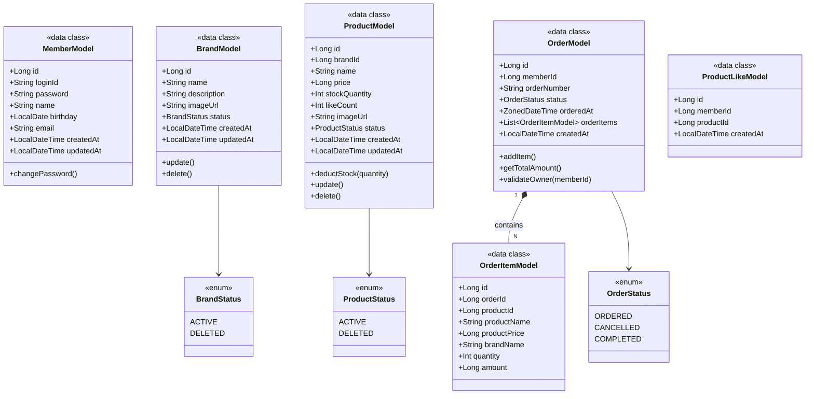
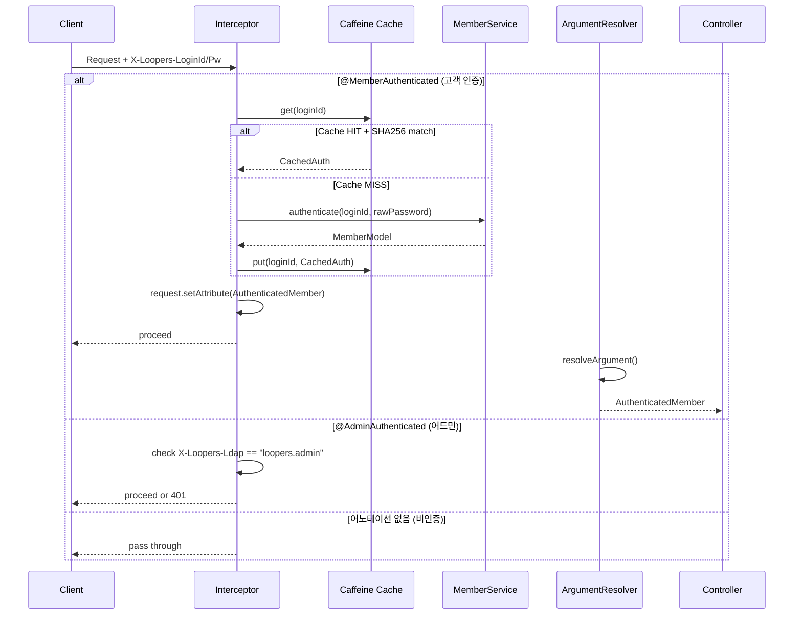
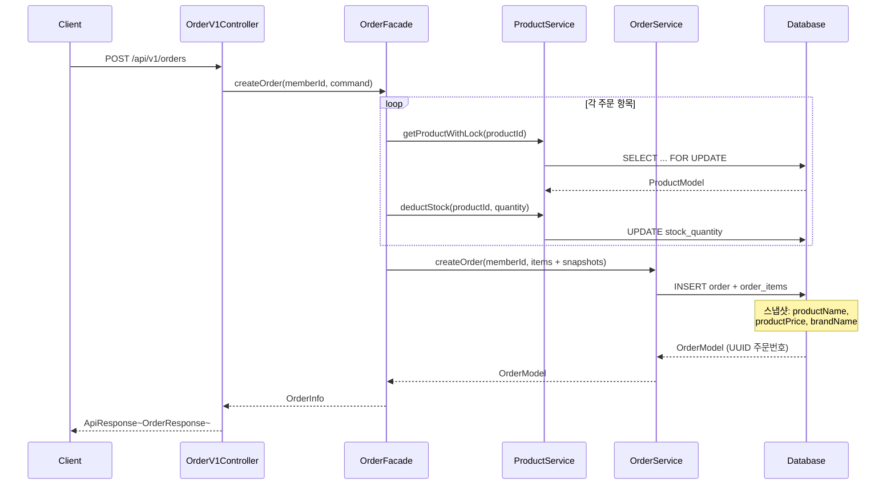
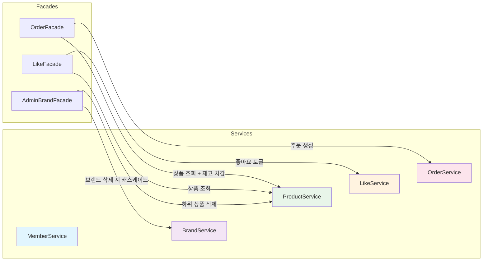
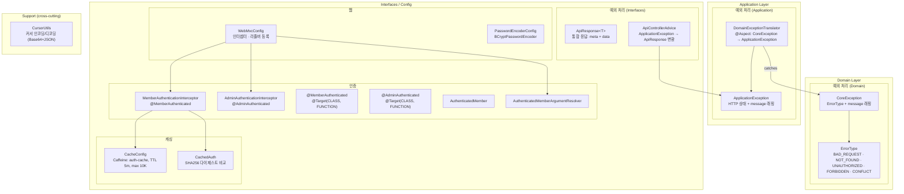

# 05. 아키텍처

---

## 1. 멀티 모듈 구조

### 다이어그램의 목적

프로젝트 전체 모듈 간 의존 관계와 각 모듈의 역할을 파악한다.

### 모듈 역할

| 구분 | 모듈 | 역할 |
|------|------|------|
| apps | commerce-api | REST API 서버. 고객/어드민 엔드포인트 제공 |
| apps | commerce-batch | Spring Batch 기반 배치 처리 |
| apps | commerce-streamer | Kafka 토픽 소비 스트리밍 처리 |
| modules | jpa | DataSource, Hibernate, QueryDSL 설정. TestContainers 테스트 픽스처 포함 |
| modules | redis | Redis Master-Replica 설정. Lettuce 커넥션 관리 |
| modules | kafka | Kafka Producer/Consumer 설정 |
| supports | jackson | Jackson ObjectMapper 설정 (LocalDate, ZonedDateTime 직렬화) |
| supports | logging | Logback, Slack 알림 연동 |
| supports | monitoring | Prometheus, Micrometer 메트릭 수집 |

---

## 2. 레이어드 아키텍처 (4-Layer + DIP)

### 다이어그램의 목적

commerce-api의 계층 구조와 의존 방향을 파악한다. Domain 레이어가 Infrastructure에 의존하지 않고, Repository 인터페이스를 통해 DIP를 달성하는 구조를 검증한다.

### 레이어 책임

| 레이어 | 패키지 | 책임 |
|--------|--------|------|
| Interfaces | `interfaces/api/`, `interfaces/config/` | REST 엔드포인트 정의, 요청 DTO 값 유효성 검증, 응답 DTO 반환, 인증 어노테이션/Interceptor/ArgumentResolver, WebMvcConfig |
| Application | `application/` | **Facade(`@Transactional`): 유일한 트랜잭션 주체. 모든 Controller의 진입점.** Service: 단일 도메인 로직 (`@Transactional` 없음). Command, Info DTO. ApplicationException, DomainExceptionTranslator(@Aspect) |
| Domain | `domain/` | Model(data class): 순수 불변 도메인 모델. Repository 인터페이스. VO: 값 검증. Validator: VO로 검증 불가능한 복합 비즈니스 규칙. CoreException, ErrorType |
| Infrastructure | `infrastructure/`, `infrastructure/config/` | JpaModel(@Entity): DB 매핑. Repository 구현체 (JPA Repository). BaseEntity. 인프라 빈 설정 (CacheConfig, PasswordEncoderConfig) |
| Support (cross-cutting) | `support/` | 유틸리티 (CursorUtils) — 모든 레이어에서 참조 |

### 핵심 설계 원칙

- **@Transactional 소유권은 Facade만**: Facade만 `@Transactional`을 부여하며, Service는 `@Transactional` 없음
- **모든 API는 Facade 경유**: Controller → Facade → Service. 예외 없음
- **Facade = API 진입점 및 트랜잭션 경계**: 단일 도메인이라도 반드시 Facade 경유
- **Service 공유, Facade만 분리**: 고객/어드민 Facade가 동일한 Service를 사용
- **cross-domain 접근은 Facade에서만**: Service 간 직접 참조 금지
- **Domain Model은 순수 data class**: JPA Entity는 Infrastructure의 JpaModel로 분리. Model은 JPA 어노테이션 없음
- **예외 전파**: `CoreException`(Domain) → `DomainExceptionTranslator`(@Aspect, Application) → `ApplicationException`(Application) → `ApiControllerAdvice`(Interfaces)
- **Model이 비즈니스 불변식 보호**: `deductStock()`, `validateOwner()`, `delete()` 등 단일 객체 규칙은 Model 내부
- **VO = 값 검증, Validator = 복합 비즈니스 규칙 검증**: VO는 단일 필드 형식 검증, Validator는 여러 필드 조합이 필요한 규칙 (예: 비밀번호 내 생년월일 포함 금지)
- **Interfaces Layer에서 값 유효성 검증**: 요청 DTO에서 null, 음수, 이메일 형식 등 기본 검증 수행
- **DTO 분리는 Controller 레벨**: Facade는 동일한 Info DTO 반환
- **물리 FK 미사용**: 도메인 간 ID 참조만 (향후 서비스 분리 대비)

---

## 3. 도메인 모델 클래스 다이어그램

### 다이어그램의 목적

Domain Model(순수 data class) 간 관계와 각 도메인 모델의 필드 및 비즈니스 메서드를 파악한다. Domain Model은 JPA 어노테이션 없이 순수 Kotlin data class로 구현되며, JPA Entity(`@Entity`, `BaseEntity` 상속)는 Infrastructure 레이어의 JpaModel에 위치한다.

> **참고**: `BaseEntity`(`@MappedSuperclass`, id/createdAt/updatedAt/deletedAt)는 Infrastructure 레이어의 JpaModel(`BrandJpaModel`, `ProductJpaModel` 등)에서만 상속한다.

---

## 4. Value Object & Validator 구조

### 다이어그램의 목적

Domain Layer의 검증 체계를 파악한다. VO는 단일 필드의 값 형식을 검증하고, Validator는 VO로 검증 불가능한 복합 비즈니스 규칙을 검증한다.

```mermaid
classDiagram
    class LoginId {
        <<VO · JvmInline value class>>
        +String value
        +of(raw) LoginId$
    }

    class MemberName {
        <<VO · JvmInline value class>>
        +String value
        +of(raw) MemberName$
        +masked() String
    }

    class Email {
        <<VO · JvmInline value class>>
        +String value
        +of(raw) Email$
    }

    class ProductName {
        <<VO · JvmInline value class>>
        +String value
        +of(raw) ProductName$
    }

    class ProductDescription {
        <<VO · JvmInline value class>>
        +String value
        +of(raw) ProductDescription$
    }

    class StockQuantity {
        <<VO · JvmInline value class>>
        +Int value
        +of(raw) StockQuantity$
    }

    class BrandName {
        <<VO · JvmInline value class>>
        +String value
        +of(raw) BrandName$
    }

    class RawPassword {
        <<Validator · object>>
        +validate(password, birthday)$
    }

    MemberModel ..> LoginId : creates in Service
    MemberModel ..> MemberName : creates in Service
    MemberModel ..> Email : creates in Service
    MemberService ..> RawPassword : validates in Service
    ProductModel ..> ProductName : creates in Service
    ProductModel ..> ProductDescription : creates in Service
    ProductModel ..> StockQuantity : creates in Service
    BrandModel ..> BrandName : creates in Service
```

### VO 컨벤션

| 규칙 | 설명 |
|------|------|
| 구현 방식 | `@JvmInline value class` |
| 역할 | 단일 필드의 값 형식 검증 (regex, 범위, 길이 등) |
| 생성 경계 | Service 레이어에서 `VO.of()` 팩토리로 생성 |
| 생성자 | 검증 없음 (DB 복원용). `of()`에서만 검증 |
| Entity 필드 | 생성자는 VO 타입 수신, 내부 필드는 primitive 저장 |
| Facade/Controller | primitive 유지 (VO 노출하지 않음) |

### Validator 컨벤션

| 규칙 | 설명 |
|------|------|
| 구현 방식 | `object` (상태 없는 싱글턴) |
| 역할 | VO로 검증 불가능한 복합 비즈니스 규칙 (여러 필드 조합 필요) |
| 예시 | `RawPassword.validate(password, birthday)` — 비밀번호 내 생년월일 포함 금지 |
| 배치 | `domain/{domain}/` 패키지 |
| 호출 위치 | Service에서 호출 |

---

## 5. 인증 흐름

### 다이어그램의 목적

JWT 미사용 환경에서 어노테이션 기반 인증이 어떻게 동작하는지, Caffeine 캐시를 활용한 BCrypt 최적화 흐름을 파악한다.

### 인증 어노테이션 매핑

| 구분 | 어노테이션 | 헤더 | 인터셉터 |
|------|-----------|------|----------|
| 비인증 | 없음 | 없음 | 미적용 |
| 고객 인증 | `@MemberAuthenticated` (`@Target(CLASS, FUNCTION)`) | `X-Loopers-LoginId` + `X-Loopers-LoginPw` | `MemberAuthenticationInterceptor` |
| 어드민 | `@AdminAuthenticated` (`@Target(CLASS, FUNCTION)`) | `X-Loopers-Ldap: loopers.admin` | `AdminAuthenticationInterceptor` |

### 캐시 전략

- **백엔드**: Caffeine 로컬 캐시 (`auth-cache`)
- **키**: loginId
- **비교 방식**: SHA256 다이제스트로 비밀번호 비교 (BCrypt 반복 호출 방지)
- **TTL**: 5분, 최대 10,000 엔트리
- **Eviction**: 비밀번호 변경 시 loginId 기반 즉시 evict

---

## 6. 주문 생성 시퀀스

### 다이어그램의 목적

주문 생성 시 cross-domain 오케스트레이션, 비관적 락을 통한 재고 차감, 스냅샷 저장 흐름을 파악한다.

### 주문 설계 결정

| 항목 | 결정 |
|------|------|
| 주문 번호 | UUID |
| 재고 동시성 | `SELECT FOR UPDATE` 비관적 락 |
| 스냅샷 범위 | productName, productPrice, brandName |
| 본인 검증 | `OrderModel.validateOwner()` 도메인 규칙 |

---

## 7. 도메인 간 의존 관계

### 다이어그램의 목적

Facade 레벨에서 도메인 간 조합이 어떻게 이루어지는지, Service 간 직접 참조가 없는지를 검증한다.

### 의존 규칙

- **Service 간 직접 참조 금지**: cross-domain 접근은 Facade에서만 조합
- **물리 FK 미사용**: 도메인 간 ID 참조만 (향후 서비스 분리 대비)
- **Soft Delete 캐스케이드**: 브랜드 삭제 시 AdminBrandFacade가 ProductService를 호출하여 하위 상품 삭제

---

## 8. Config & Support 구조

### 다이어그램의 목적

인증, 캐싱, 에러 핸들링 등 횡단 관심사(cross-cutting concerns)의 구성 요소와 연결 관계를 파악한다.

---

## 9. 도메인별 클래스 전체 목록

### Member (회원)

| 레이어 | 클래스 | 책임 |
|--------|--------|------|
| Interfaces | `MemberV1Controller` | `POST /api/v1/members` 회원가입, `GET /api/v1/members/me` 내 정보 조회, `PATCH /api/v1/members/me/password` 비밀번호 변경 |
| Interfaces | `MemberV1ApiSpec` | OpenAPI 스펙 |
| Interfaces | `MemberV1Dto` | RegisterRequest, MemberResponse, ChangePasswordRequest |
| Application | `MemberFacade` | 가입 · 인증 · 조회 · 비밀번호 변경 오케스트레이션 (`@Transactional`) |
| Application | `MemberService` | 단일 도메인 로직: 가입, 인증, 조회, 비밀번호 변경 (`@Transactional` 없음) |
| Application | `MemberInfo` | 회원 정보 DTO |
| Domain | `MemberModel` | data class: Aggregate Root, `changePassword()` |
| Domain | `MemberRepository` | Interface: save, findByLoginId, existsByLoginId |
| Domain/VO | `LoginId` | `@JvmInline value class`: 로그인 ID (영숫자 검증) |
| Domain/VO | `MemberName` | `@JvmInline value class`: 이름 + 마스킹 |
| Domain/Validator | `RawPassword` | `object`: VO로 검증 불가능한 복합 비즈니스 규칙 (비밀번호 내 생년월일 포함 금지 등) |
| Infrastructure | `MemberJpaModel` | `@Entity`: DB 매핑, `BaseEntity` 상속 |
| Infrastructure | `MemberRepositoryImpl` | Repository 구현체 |
| Infrastructure | `MemberJpaRepository` | Spring Data JPA |

### Brand (브랜드)

| 레이어 | 클래스 | 책임 |
|--------|--------|------|
| Interfaces | `BrandV1Controller` | `GET /api/v1/brands/{id}` 고객 조회 |
| Interfaces | `BrandV1ApiSpec` | OpenAPI 스펙 |
| Interfaces | `BrandV1Dto` | BrandResponse, BrandListResponse |
| Interfaces (Admin) | `AdminBrandV1Controller` | `POST/GET/PUT/DELETE /api-admin/v1/brands` |
| Interfaces (Admin) | `AdminBrandV1ApiSpec` | 어드민 브랜드 CRUD 스펙 |
| Interfaces (Admin) | `AdminBrandV1Dto` | CreateRequest, UpdateRequest, AdminBrandResponse |
| Application | `BrandFacade` | 고객용 브랜드 조회 (`@Transactional`) |
| Application | `AdminBrandFacade` | 어드민 CRUD + 삭제 시 하위 상품 캐스케이드 (`@Transactional`) |
| Application | `BrandService` | 단일 도메인 로직: CRUD + deleteProductsByBrandId (`@Transactional` 없음) |
| Application | `BrandCommand` | Create, Update 커맨드 |
| Application | `BrandInfo` | 브랜드 정보 DTO |
| Domain | `BrandModel` | data class: Aggregate Root, `update()`, `delete()` |
| Domain | `BrandRepository` | Interface: save, findById, findAll |
| Domain | `BrandStatus` | Enum: ACTIVE, DELETED |
| Domain/VO | `BrandName` | `@JvmInline value class`: 브랜드명 길이 검증 |
| Infrastructure | `BrandJpaModel` | `@Entity`: DB 매핑, `BaseEntity` 상속 |
| Infrastructure | `BrandRepositoryImpl` | Repository 구현체 |
| Infrastructure | `BrandJpaRepository` | Spring Data JPA |

### Product (상품)

| 레이어 | 클래스 | 책임 |
|--------|--------|------|
| Interfaces | `ProductV1Controller` | `GET /api/v1/products` (커서), `GET /{id}` |
| Interfaces | `ProductV1ApiSpec` | OpenAPI 스펙 |
| Interfaces | `ProductV1Dto` | ProductResponse, ProductListResponse |
| Interfaces (Admin) | `AdminProductV1Controller` | `POST/GET/PUT/DELETE /api-admin/v1/products` (offset) |
| Interfaces (Admin) | `AdminProductV1ApiSpec` | 어드민 상품 CRUD 스펙 |
| Interfaces (Admin) | `AdminProductV1Dto` | CreateRequest, UpdateRequest, AdminProductResponse |
| Application | `ProductFacade` | 고객용 조회 + 재고 차감 (`@Transactional`) |
| Application | `AdminProductFacade` | 어드민 CRUD + 브랜드 존재 검증 (`@Transactional`) |
| Application | `ProductService` | 단일 도메인 로직: CRUD + findByIdWithLock (비관적 락) (`@Transactional` 없음) |
| Application | `ProductCommand` | Create, Update 커맨드 |
| Application | `ProductInfo` | 상품 정보 DTO |
| Application | `ProductListResult` | 커서 기반 페이징 결과 |
| Domain | `ProductModel` | data class: Aggregate Root, `deductStock()`, `update()`, `delete()` |
| Domain | `ProductRepository` | Interface: save, findById, findByIdWithLock, findActiveProducts |
| Domain | `ProductStatus` | Enum: ACTIVE, DELETED |
| Domain | `ProductSearchCondition` | 커서 페이징 쿼리 조건 |
| Domain | `ProductSort` | Enum: LATEST, PRICE_ASC, LIKES_DESC |
| Domain/VO | `ProductName` | `@JvmInline value class`: 상품명 길이 검증 |
| Domain/VO | `ProductDescription` | `@JvmInline value class`: 설명 길이 검증 |
| Domain/VO | `StockQuantity` | `@JvmInline value class`: 재고 비음수 검증 |
| Infrastructure | `ProductJpaModel` | `@Entity`: DB 매핑, `BaseEntity` 상속 |
| Infrastructure | `ProductRepositoryImpl` | Repository 구현체 (SELECT FOR UPDATE 포함) |
| Infrastructure | `ProductJpaRepository` | Spring Data JPA |

### Like (좋아요)

| 레이어 | 클래스 | 책임 |
|--------|--------|------|
| Interfaces | `LikeV1Controller` | `POST/DELETE /api/v1/products/{id}/likes`, `GET /api/v1/likes` |
| Interfaces | `LikeV1ApiSpec` | OpenAPI 스펙 |
| Interfaces | `LikeV1Dto` | LikedProductResponse |
| Application | `LikeFacade` | 좋아요/취소 (양방향 멱등) + 목록 조회 (`@Transactional`) |
| Application | `LikeService` | 단일 도메인 로직: like (멱등), unlike, getLikedProductIds (`@Transactional` 없음) |
| Application | `LikedProductInfo` | 좋아요 상품 정보 DTO |
| Domain | `ProductLikeModel` | data class: 회원-상품 관계 (UNIQUE Constraint) |
| Domain | `ProductLikeRepository` | Interface: save, find, delete, findAllByMemberId |
| Infrastructure | `ProductLikeJpaModel` | `@Entity`: DB 매핑, `BaseEntity` 상속 |
| Infrastructure | `ProductLikeRepositoryImpl` | Repository 구현체 |
| Infrastructure | `ProductLikeJpaRepository` | Spring Data JPA |

### Order (주문)

| 레이어 | 클래스 | 책임 |
|--------|--------|------|
| Interfaces | `OrderV1Controller` | `POST /api/v1/orders`, `GET /api/v1/orders`, `GET /{id}` |
| Interfaces | `OrderV1ApiSpec` | OpenAPI 스펙 |
| Interfaces | `OrderV1Dto` | CreateRequest, OrderResponse, OrderItemResponse |
| Interfaces (Admin) | `AdminOrderV1Controller` | `GET /api-admin/v1/orders`, `GET /{id}` |
| Interfaces (Admin) | `AdminOrderV1ApiSpec` | 어드민 주문 조회 스펙 |
| Interfaces (Admin) | `AdminOrderV1Dto` | AdminOrderResponse |
| Application | `OrderFacade` | 주문 생성 (상품 조회 + 재고 차감 + 스냅샷) (`@Transactional`) |
| Application | `AdminOrderFacade` | 어드민 주문 목록/상세 조회 (`@Transactional`) |
| Application | `OrderService` | 단일 도메인 로직: 주문 생성 · 조회 · 목록 (본인 검증) (`@Transactional` 없음) |
| Application | `OrderCommand` | Create, CreateOrderItem 커맨드 |
| Application | `OrderInfo` | 주문 정보 DTO (UUID 주문번호) |
| Application | `OrderItemInfo` | 주문 항목 DTO (스냅샷 포함) |
| Domain | `OrderModel` | data class: Aggregate Root, `addItem()`, `getTotalAmount()`, `validateOwner()` |
| Domain | `OrderItemModel` | data class: 주문 항목 (스냅샷 데이터) |
| Domain | `OrderRepository` | Interface: save, findById, findAll, findByMemberIdAndRange |
| Domain | `OrderItemRepository` | Interface: save, findByOrderId |
| Domain | `OrderStatus` | Enum: ORDERED, CANCELLED, COMPLETED |
| Infrastructure | `OrderJpaModel` | `@Entity`: DB 매핑, `BaseEntity` 상속 |
| Infrastructure | `OrderItemJpaModel` | `@Entity`: 주문 항목 DB 매핑, `BaseEntity` 상속 |
| Infrastructure | `OrderRepositoryImpl` | Repository 구현체 |
| Infrastructure | `OrderJpaRepository` | Spring Data JPA |
| Infrastructure | `OrderItemRepositoryImpl` | Repository 구현체 |
| Infrastructure | `OrderItemJpaRepository` | Spring Data JPA |

### 공통

| 레이어 | 클래스 | 책임 |
|--------|--------|------|
| Domain/VO | `Email` | `@JvmInline value class`: 이메일 형식 검증 |
| Domain/Error | `ErrorType` | 에러 코드 Enum (BAD_REQUEST, NOT_FOUND, UNAUTHORIZED, FORBIDDEN, CONFLICT) |
| Domain/Error | `CoreException` | 도메인 커스텀 런타임 예외 (ErrorType + message) |
| Application/Error | `ApplicationException` | HTTP 상태 + message 래핑 (Presentation 전달용) |
| Application/Error | `DomainExceptionTranslator` | `@Aspect`: CoreException → ApplicationException 변환 |
| Interfaces | `ApiResponse<T>` | 통합 응답 래퍼 |
| Interfaces | `ApiControllerAdvice` | 글로벌 예외 핸들러: ApplicationException → ApiResponse 변환 |
| Infrastructure | `BaseEntity` | `@MappedSuperclass`: id, createdAt, updatedAt, deletedAt (JpaModel 전용) |
| Support | `CursorUtils` | 커서 인코딩/디코딩 |

---

## 10. 핵심 설계 패턴 요약

| 패턴 | 적용 | 관련 Decision |
|------|------|---------------|
| DIP (의존성 역전) | Domain → Repository(IF), Infrastructure → RepositoryImpl | - |
| Facade 분리 | 모든 API는 Facade 경유. 고객/어드민 Facade 분리, Service 공유. Facade만 `@Transactional` | D8 |
| Domain Model 분리 | Domain Model은 순수 data class. JPA Entity(JpaModel)는 Infrastructure 레이어에 격리 | - |
| 예외 계층 변환 | CoreException(Domain) → DomainExceptionTranslator(@Aspect) → ApplicationException → ApiControllerAdvice | - |
| Validator | VO로 검증 불가능한 복합 비즈니스 규칙 검증 (`RawPassword`: 비밀번호 내 생년월일 포함 금지) | - |
| VO (@JvmInline) | LoginId, MemberName, ProductName, StockQuantity 등 | D23 |
| Soft Delete | status=DELETED + deleted_at 병행, `delete()` 메서드 | D11 |
| 비관적 락 | `ProductService.findByIdWithLock()` → SELECT FOR UPDATE | D9 |
| 멱등 좋아요 | 사전 조회 후 INSERT, 양방향 멱등 (등록/취소 모두 200 OK) | D17 |
| 스냅샷 | OrderItemModel에 productName, productPrice, brandName 복사 | D25 |
| 커서 페이징 | 고객 상품 목록 (Base64), 어드민/주문은 offset | D28 |
| 인증 캐싱 | Caffeine auth-cache, SHA256 다이제스트, TTL 5분 | D4, D5 |
| 어노테이션 기반 인증 | JWT 미사용, `@MemberAuthenticated` + `@AdminAuthenticated` + Interceptor + ArgumentResolver | D3 |
| Unique Constraint | 사전 조회 중복체크 금지, DB Constraint + 예외 처리 | D2 |
| Virtual Threads | `spring.threads.virtual.enabled=true`, synchronized 금지 | D1 |
