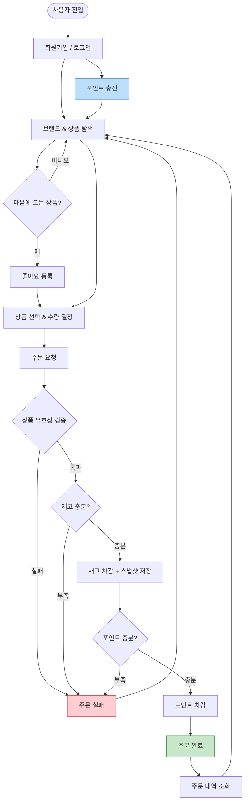
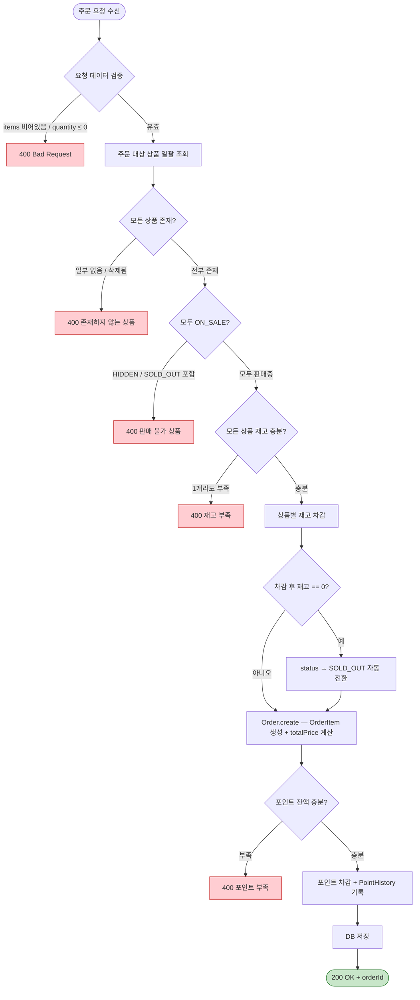
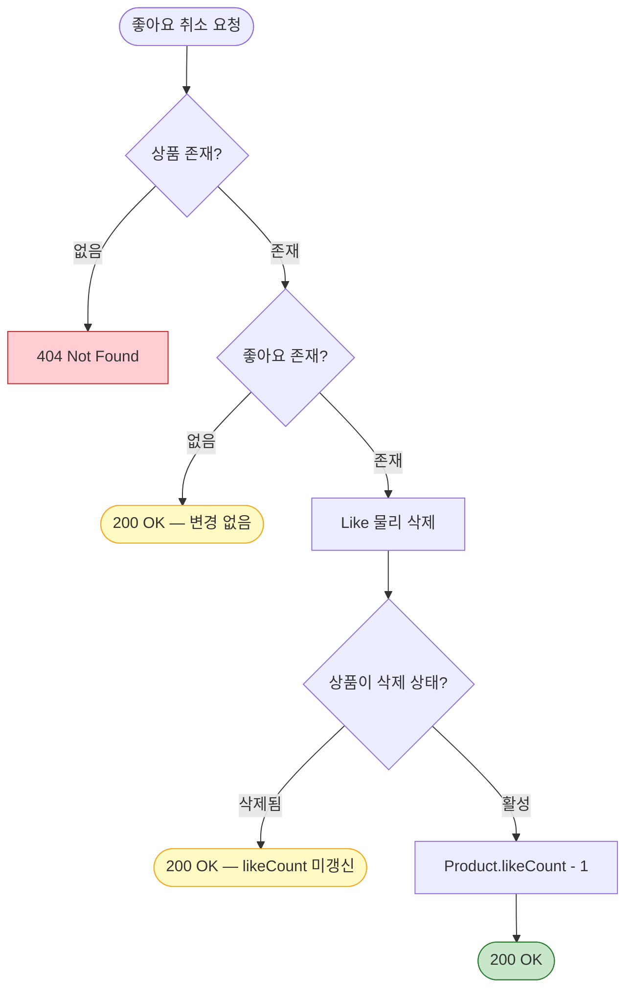
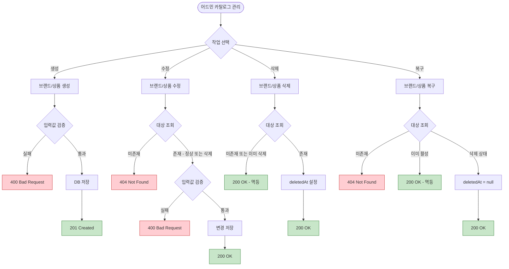

# 플로우차트

시스템의 핵심 흐름을 의사결정 관점에서 시각화한다.
시퀀스 다이어그램이 "누가 누구를 호출하는가"를 보여준다면, 플로우차트는 "어떤 조건에서 어떤 경로로 분기하는가"를 보여준다.

> 단순 CRUD는 시퀀스 다이어그램으로 충분하므로, **분기가 복잡하거나 cross-domain 흐름**만 플로우차트로 작성한다.

---

## 1. 서비스 전체 흐름

사용자가 시스템을 이용하는 핵심 여정을 조감도로 표현한다.



### 참고

- 쿠폰 발급/적용 단계는 추후 개발 시 F→G 사이에 삽입 예정
- 포인트 충전은 로그인 후 탐색 전에 수행하는 선택적 단계이며, 상세 흐름은 아래 Section 4를 참고
- 어드민 흐름(브랜드/상품 관리)은 별도 경로이므로 이 조감도에서 생략

---

## 2. 주문 생성 프로세스

주문 생성 시 내부에서 일어나는 검증 및 처리 로직의 의사결정 흐름이다.
시퀀스 다이어그램 4.1과 대응된다.



### 참고

- `Order.create()`가 내부에서 OrderItem 생성과 totalPrice 계산을 수행한다 (Rich Domain Model)
- 전체 과정이 **하나의 트랜잭션** 내에서 원자적으로 실행 (all-or-nothing)
- 어느 단계에서든 실패하면 트랜잭션 롤백으로 재고 차감 + 포인트 차감 모두 원복
- **Round 3 추가**: 포인트 잔액 확인 및 차감 단계가 주문 생성 후 수행된다
- 인증 인터셉터 검증은 전제 조건으로 생략 (시퀀스 다이어그램 공통 규칙 참고)

---

## 3. 좋아요 토글 (등록 / 취소)

좋아요의 멱등성 보장과 삭제된 상품에 대한 분기 처리를 시각화한다.
시퀀스 다이어그램 3.1, 3.2와 대응된다.

### 3.1 좋아요 등록

```mermaid
flowchart TB
    Start([좋아요 등록 요청]) --> CheckProduct{상품 활성 상태(미삭제 & 미숨김)?}
    CheckProduct -->|없음 / 삭제됨 / HIDDEN| Err404[404 Not Found]:::error

    CheckProduct -->|유효| CheckLike{이미 좋아요 존재?}
    CheckLike -->|존재| Idempotent([200 OK — 변경 없음]):::idempotent

    CheckLike -->|없음| SaveLike[Like 저장]
    SaveLike --> IncCount[Product.likeCount + 1]
    IncCount --> Success([200 OK]):::success

    classDef error fill:#ffcdd2,stroke:#c62828
    classDef success fill:#c8e6c9,stroke:#2e7d32
    classDef idempotent fill:#fff9c4,stroke:#f9a825
```

### 3.2 좋아요 취소



### 참고

- 등록: 삭제된 상품에는 좋아요 등록 불가 (404)
- 취소: 삭제된 상품이라도 Like 레코드가 있으면 물리 삭제 수행, 단 likeCount는 갱신하지 않음
- 노란색 경로는 멱등성에 의한 무변경 응답

---

## 4. 포인트 충전 (Domain Service)

포인트 충전 시 PointChargingService(Domain Service)가 잔액 변경과 내역 생성을 조율하는 흐름이다.

```mermaid
flowchart TB
    Start([포인트 충전 요청]) --> CheckAmount{충전 금액 >= 1?}
    CheckAmount -->|아니오| Err400[400 Bad Request]:::error

    CheckAmount -->|유효| CheckLimit{1회 충전 한도(1000만) 초과?}
    CheckLimit -->|초과| Err400_2[400 Bad Request]:::error

    CheckLimit -->|이내| FindUP[UserPoint 조회]
    FindUP --> CheckBalance{충전 후 잔액이 최대 한도(1000만) 초과?}
    CheckBalance -->|초과| Err400_3[400 Bad Request]:::error

    CheckBalance -->|이내| Charge[UserPoint.charge — 잔액 증가]
    Charge --> History[PointHistory 생성 — type: CHARGE]
    History --> Save[DB 저장]
    Save --> Success([200 OK]):::success

    classDef error fill:#ffcdd2,stroke:#c62828
    classDef success fill:#c8e6c9,stroke:#2e7d32
```

### 참고

- PointChargingService는 도메인 레이어의 Domain Service이다
- 잔액 변경(UserPoint.charge)과 내역 생성(PointHistory)이 하나의 트랜잭션에서 원자적으로 처리된다
- Controller가 PointChargingService를 직접 호출한다 (Facade 없음)

---

## 5. 어드민 카탈로그 관리 프로세스

어드민이 브랜드/상품을 생성, 수정, 삭제, 복구하는 전체 의사결정 흐름이다.
대고객 API와의 핵심 차이는 수정 시 삭제 상태 여부를 구분하지 않고 허용한다는 점이다.



### 참고

- 수정(Update)은 삭제 상태와 무관하게 어드민이 수행 가능 — 대고객 API와의 핵심 차이점
- 삭제와 복구는 멱등하게 동작
- 브랜드 삭제 시 소속 상품도 연쇄 soft delete 처리
