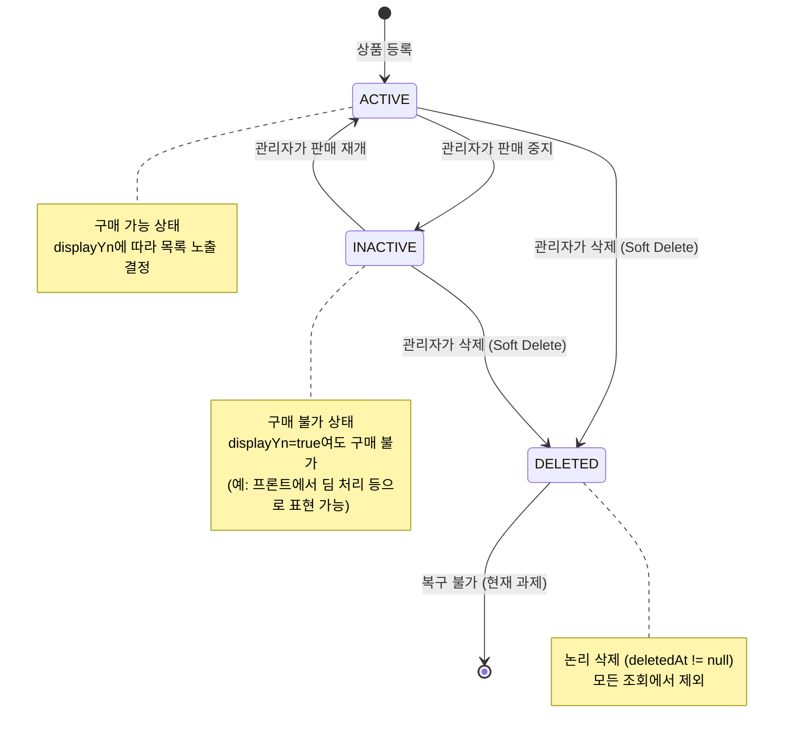
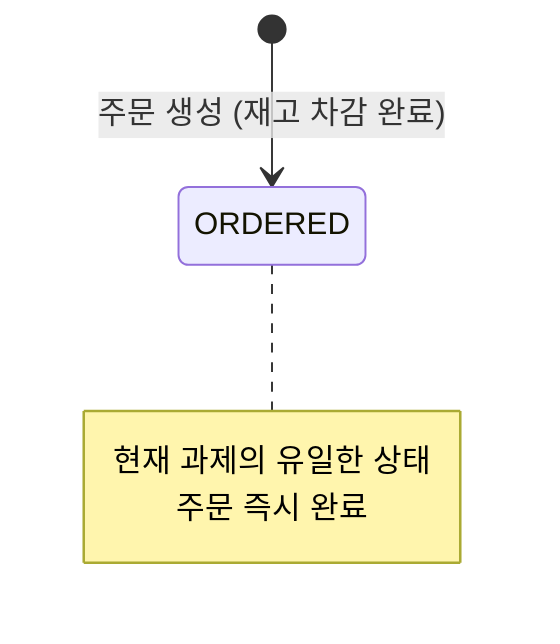
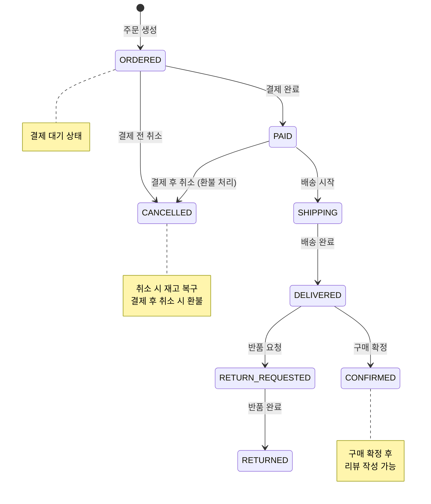

# 05. 상태 다이어그램 (State Diagrams)

---

## 왜 이 다이어그램이 필요한가

- 상태 전이의 **허용/금지 규칙**을 명확히 한다
- 각 상태에서 **어떤 행위가 가능한지** 정의한다
- `status`와 `displayYn` 분리의 이유를 **UI 관점에서도** 설명한다
- 확장 시 상태 추가가 기존 흐름을 깨뜨리지 않는지 검증한다

---

## 1. ProductStatus 상태 전이



### 전이 규칙

| From | To | 트리거 | 비즈니스 규칙 |
|------|-----|--------|-------------|
| (신규) | ACTIVE | 상품 등록 | 기본 상태. `displayYn=true` |
| ACTIVE | INACTIVE | 관리자 수정 | 기존 주문에는 영향 없음 (스냅샷 보존) |
| INACTIVE | ACTIVE | 관리자 수정 | 재고/가격 확인 후 재개 |
| ACTIVE | DELETED | 관리자 삭제 | Soft Delete. 좋아요도 함께 삭제 |
| INACTIVE | DELETED | 관리자 삭제 | Soft Delete. 좋아요도 함께 삭제 |
| DELETED | ~~ACTIVE~~ | ❌ 불가 | 현재 과제에서 복구 기능 없음 |

### 금지된 전이

- `DELETED → ACTIVE`: 삭제된 상품 복구는 현재 미지원 (BaseEntity에 `restore()` 메서드는 있지만, 비즈니스적으로 사용하지 않음)
- 상태 건너뛰기 없음: `ACTIVE → DELETED` 시 반드시 연쇄 삭제(좋아요) 수행

---

## 2. status × displayYn 조합 매트릭스

| status | displayYn | 목록 노출 | 구매 가능 | 프론트 표현 예시 |
|--------|----------|----------|----------|----------------|
| ACTIVE | true | ✅ | ✅ | 일반 상품 카드 |
| ACTIVE | false | ❌ | ✅ (URL 직접) | 미노출 (관리자가 의도적으로 숨긴 상태) |
| INACTIVE | true | ✅ | ❌ | 딤(dim) 처리 + "판매중지" 뱃지 등으로 표현 가능 |
| INACTIVE | false | ❌ | ❌ | 미노출 + 구매 불가 |
| DELETED | - | ❌ | ❌ | 모든 조회에서 제외 |

### 왜 status와 displayYn을 분리하는가

**시스템 관점:**
- "판매 상태"와 "전시 여부"는 **독립적인 비즈니스 의사결정**
- 시즌 상품 일시 숨김 (displayYn=false) ≠ 판매 중지 (status=INACTIVE)
- 단일 필드로는 "보이지만 구매 불가" 상태를 표현할 수 없음

**UI 관점 (이렇게도 표현 가능하다):**
- 두 필드를 분리하면 프론트에서 상태별 시각적 피드백을 줄 수 있다
- 예: `displayYn=true` + `INACTIVE` → 딤(dim) 처리 + "판매중지" 뱃지 표시
- 예: `displayYn=true` + `ACTIVE` → 일반 상품 카드
- 단일 필드였다면 "목록에 보이지만 구매 불가"를 표현할 방법이 없음
- 이런 UI 분기가 가능하다는 것 자체가 두 필드 분리의 설계 근거가 된다

> 아래는 프론트에서 활용할 수 있는 분기 예시이며, 현재 구현 범위는 아니다.

```
if (!displayYn) → 목록에서 제외
if (displayYn && status == ACTIVE) → 정상 카드
if (displayYn && status == INACTIVE) → 딤처리 + "판매중지" 라벨
```

### Product.isOrderable() 과의 관계

```
isOrderable() = status == ACTIVE && displayYn == true && stockQuantity > 0
```

- 주문 가능 여부 판단 시 세 가지 조건을 **AND**로 결합
- 하나라도 불만족하면 주문 불가, 각각 다른 에러 메시지 반환

---

## 3. OrderStatus 상태 전이

### 현재 과제 범위



현재 과제에서는 `ORDERED` 단일 상태만 존재한다. 주문 생성 = 주문 완료.

### 확장 시 이렇게도 표현 가능하다 (참고)



### 확장 시 전이 규칙 예시 (참고)

| From | To | 트리거 | 비즈니스 규칙 |
|------|-----|--------|-------------|
| ORDERED | PAID | 결제 완료 | PG 결제 승인 |
| ORDERED | CANCELLED | 사용자 취소 | 결제 전 취소 → 재고 복구 |
| PAID | SHIPPING | 배송 시작 | 관리자/배송시스템 |
| PAID | CANCELLED | 사용자 취소 | 결제 후 취소 → 환불 처리 |
| SHIPPING | DELIVERED | 배송 완료 | 배송시스템 연동 |
| DELIVERED | CONFIRMED | 자동 확정 (7일) 또는 사용자 확정 | 구매 확정 → 리뷰 가능 |
| DELIVERED | RETURN_REQUESTED | 사용자 반품 | 반품 사유 입력 |
| RETURN_REQUESTED | RETURNED | 반품 완료 | 환불 처리 + 재고 복구 |

> 확장 시 이 전이 규칙은 `OrderStatus` enum에 `canTransitionTo()` 메서드로 구현하여,
> 허용되지 않는 상태 전이를 엔티티 레벨에서 방어할 수 있다.

---

## 4. 상태 전이의 설계 원칙

> 구현 시 아래 원칙을 기준으로 삼을 수 있다.

1. **전이 규칙은 엔티티가 관리**: Service가 아닌 Entity/Enum이 `canTransitionTo()` 판단
2. **역방향 전이 금지**: DELETED → ACTIVE, CONFIRMED → ORDERED 등은 허용하지 않음
3. **상태 변경 시 부수효과**: 삭제 시 연쇄 삭제, 취소 시 재고 복구 등은 Facade에서 조합
4. **확장 시 기존 전이 불변**: 새 상태 추가 시 기존 전이 규칙은 건드리지 않음 (OCP)
