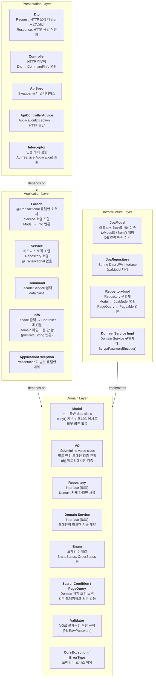
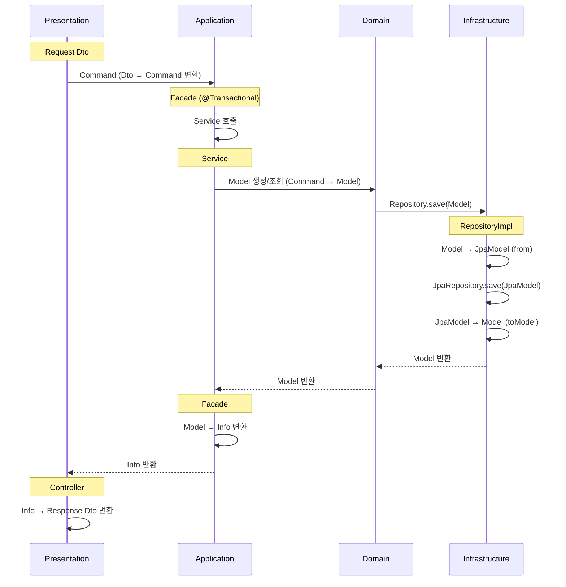
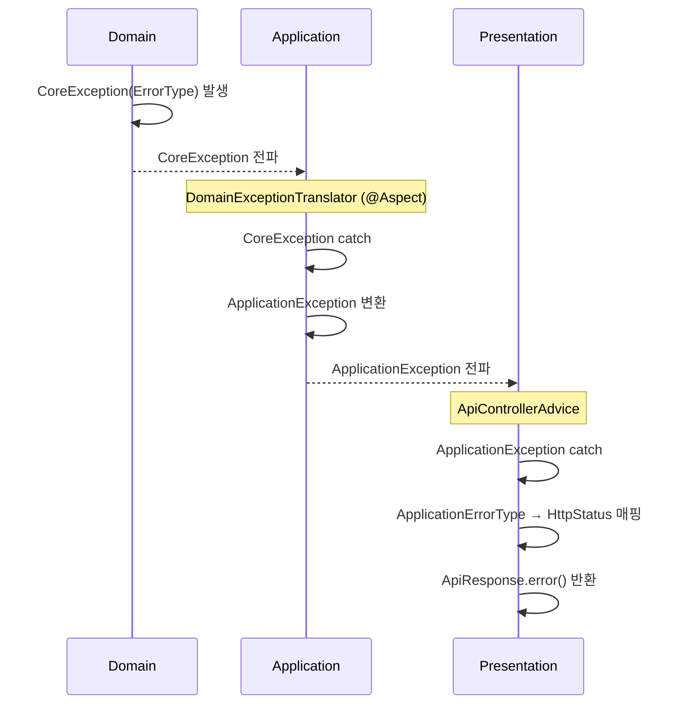

# Layer & Class Responsibility

## Layer 의존성 방향

```mermaid
graph LR
    subgraph Presentation["Presentation Layer"]
        direction TB
        P_CTRL["Controller"]
        P_SPEC["ApiSpec"]
        P_DTO["Dto\n(Request / Response)"]
        P_RES["ApiResponse\nApiControllerAdvice"]
        P_AUTH["Interceptor\nArgumentResolver\nAnnotation"]
    end

    subgraph Application["Application Layer"]
        direction TB
        A_FACADE["Facade\n(@Transactional)"]
        A_SVC["Service"]
        A_CMD["Command"]
        A_INFO["Info"]
        A_ERR["ApplicationException\nApplicationErrorType"]
        A_ASPECT["DomainExceptionTranslator\n(@Aspect)"]
        A_AUTH_SVC["AuthService"]
    end

    subgraph Domain["Domain Layer"]
        direction TB
        D_MODEL["Model\n(data class)"]
        D_VO["VO\n(value class)"]
        D_REPO["Repository\n(interface)"]
        D_DS["PasswordEncoder\n(interface)"]
        D_ENUM["Enum\n(Status 등)"]
        D_COND["SearchCondition\nPageQuery / PageResult"]
        D_VALID["Validator"]
        D_ERR["CoreException\nErrorType"]
    end

    subgraph Infrastructure["Infrastructure Layer"]
        direction TB
        I_JPA_MODEL["JpaModel\n(@Entity)"]
        I_JPA_REPO["JpaRepository\n(Spring Data JPA)"]
        I_REPO_IMPL["RepositoryImpl"]
        I_DS_IMPL["BcryptPasswordEncoder"]
        I_CONFIG["Config\n(CacheConfig 등)"]
    end

    Presentation -->|"depends on"| Application
    Application -->|"depends on"| Domain
    Infrastructure -->|"implements"| Domain
```

## Class Suffix별 책임

## 레이어 경계 데이터 변환 흐름

## 예외 전파 흐름

## 의존성 검증

| Layer | 참조 가능 | 참조 불가 |
|-------|----------|----------|
| Presentation | Application | Domain, Infrastructure |
| Application | Domain | Presentation, Infrastructure |
| Domain | 없음 (자기 자신만) | Presentation, Application, Infrastructure |
| Infrastructure | Domain | Presentation, Application |

## Class Suffix 소속 레이어

| Suffix | Layer | import 가능 대상 |
|--------|-------|-----------------|
| Dto (Request/Response) | Presentation | Application (Command, Info) |
| Controller | Presentation | Application (Facade, Command, Info) |
| ApiSpec | Presentation | Application (Info) |
| Interceptor | Presentation | Application (AuthService) |
| Facade | Application | Domain (Model, Repository, VO, Enum, CoreException) |
| Service | Application | Domain (Model, Repository, VO, Enum, CoreException) |
| Command | Application | primitive only (Domain 타입 참조 안 함) |
| Info | Application | primitive only (Domain 타입 노출 안 함) |
| Model | Domain | Domain 내부만 (VO, Enum, CoreException) |
| VO | Domain | 없음 |
| Repository (interface) | Domain | Domain (Model, PageQuery, PageResult, Enum) |
| Validator | Domain | Domain (VO, CoreException) |
| JpaModel | Infrastructure | Domain (Model), JPA (BaseEntity) |
| JpaRepository | Infrastructure | Infrastructure (JpaModel), Spring Data |
| RepositoryImpl | Infrastructure | Domain (Repository, Model), Infrastructure (JpaModel, JpaRepository) |
