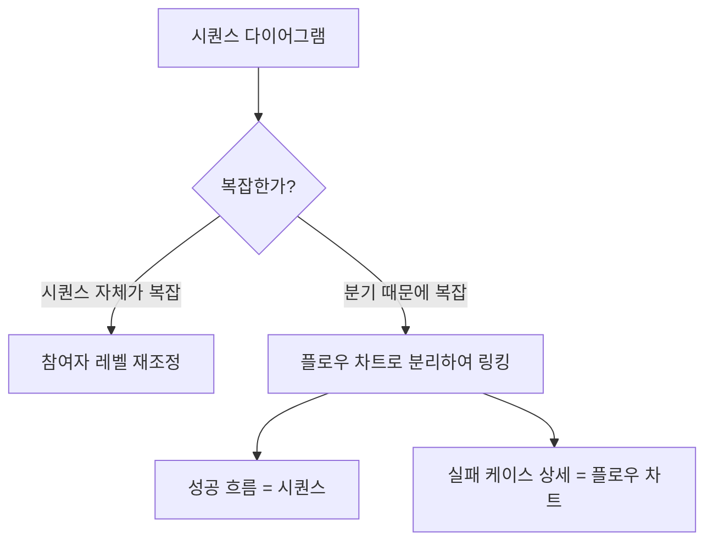
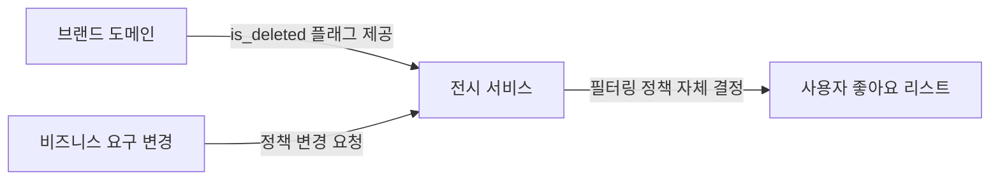
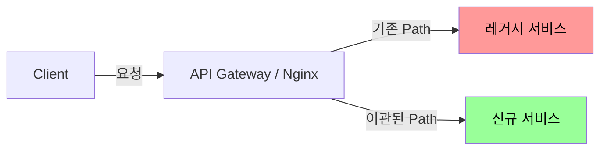
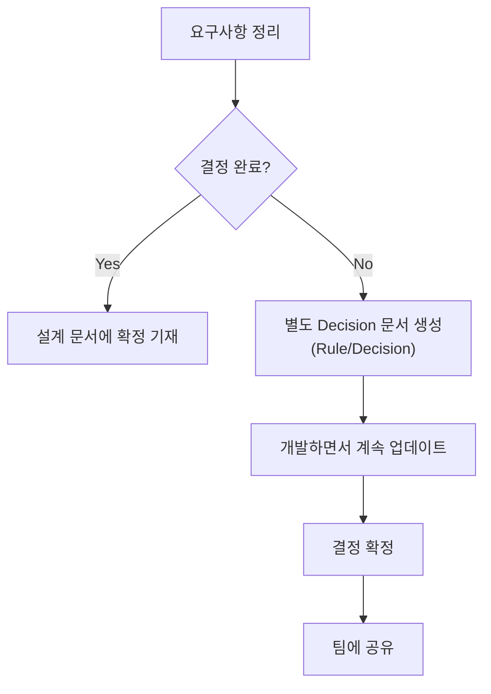
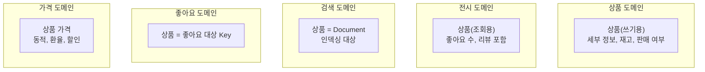

# [Round-2] 1팀 멘토링 세션 정리

> **멘토**: Devin | **일시**: 2026년 2월 11일 21:00 (KST)
> **참고**: 본 문서는 멘토링 세션 녹음을 텍스트로 변환한 후 핵심 내용을 주제별로 재구성한 것입니다.

---

## TL;DR (핵심 요약)

- 시퀀스 다이어그램은 **참여자 추상화 레벨 통일**이 핵심. DB 포함 권장, SQL은 불필요. 복잡한 분기는 플로우 차트로 분리
- 기본은 **Soft Delete**, 좋아요처럼 Row 폭발 시만 Hard Delete. 전시와 도메인의 책임을 분리
- **도메인 비즈니스**(변하지 않는 본질)와 **어플리케이션 비즈니스**(우리 서비스 특성)를 구분하라
- FK는 걸지 않는다 — 데드락, 마이그레이션, 성능 세 가지 이유
- 미결정 사항은 **별도 Decision 문서로 분리**, 개발하면서 업데이트 후 팀에 공유
- 유비쿼터스 언어는 **PM 포함 팀 전체 합의**, Amazon/Meta 등 오픈 API로 근거 확보
- 바운디드 컨텍스트는 정답이 없다 — **단어에 집착하며 계속 쪼개보기**, 설계의 유효 범위를 합의하는 것이 핵심

---

## 목차

**도구 활용**
1. [Claude CLI 활용 팁](#1-claude-cli-활용-팁)
11. [다이어그램 툴과 회의 플로우](#11-다이어그램-툴과-회의-플로우)

**설계 방법론**
2. [시퀀스 다이어그램 작성 가이드](#2-시퀀스-다이어그램-작성-가이드)
3. [Soft Delete vs Hard Delete](#3-soft-delete-vs-hard-delete)
4. [좋은 설계란 — 도메인 비즈니스 vs 어플리케이션 비즈니스](#4-좋은-설계란--도메인-비즈니스-vs-어플리케이션-비즈니스)
5. [FK(Foreign Key) 제약조건 — 왜 걸지 않는가](#5-fk-제약조건--왜-걸지-않는가)
6. [상품 변경 이력 관리](#6-상품-변경-이력-관리)
12. [바운디드 컨텍스트 나누기](#12-바운디드-컨텍스트-나누기)
14. [VO(Value Object) 활용](#14-vo-활용)

**프로세스 & 문서화**
7. [레거시 프로젝트와 문서화](#7-레거시-프로젝트와-문서화)
8. [요구사항 문서화 — 확정과 미결정의 관리](#8-요구사항-문서화--확정과-미결정의-관리)
9. [유비쿼터스 언어(Ubiquitous Language)](#9-유비쿼터스-언어)
10. [설계 문서 첫 단추 꿰기](#10-설계-문서-첫-단추-꿰기)

**소프트 스킬 & 커리어**
13. [LLM Agent 시대의 커리어](#13-llm-agent-시대의-커리어)
15. [리더십과 대화 스킬](#15-리더십과-대화-스킬)
16. [이번 라운드 운영 안내](#16-이번-라운드-운영-안내)

---

## 1. Claude CLI 활용 팁

> 질문 배경: 서민주 — AI에 다소 의존적으로 설계를 진행, 원하는 결과와 다른 결과물이 나옴
> 장유나 — agent에게 명확하게 지시했다 생각했는데 왜 다른 결과물이 나오는가

### 멘토 피드백

- **프로젝트 루트에서 Claude를 켜고** 함께 작업하는 것을 추천
- **Shift+Tab** → 플랜 모드(Plan Mode) 전환. 플랜 모드를 켜고 작업하면 금방 익숙해진다
- 멘토 자신은 **컨텍스트를 적게 넣는다** — 오히려 속도가 빠른 이유

> "저는 계속 말씀드리지만 되게 두루뭉술하게 넘겨서 AI의 아이디어를 보고 제가 컨펌하는 형태로 작업을 합니다."

- 작업 방식: **두루뭉술하게 지시** → AI 아이디어 확인 → **본인이 컨펌**하는 형태
- Claude는 **기존 코드 스타일을 참고**하므로, 베이스 코드가 잘 정리되어 있어야 결과물 품질이 올라감

> **적용 포인트**: 다음 과제부터 Claude에 상세 지시 대신, 플랜 모드에서 두루뭉술하게 지시 → AI 제안 확인 → 컨펌 방식으로 작업 흐름을 전환해볼 것

---

## 2. 시퀀스 다이어그램 작성 가이드

> 질문자: 장유나(P0) — DB 포함 수준, 김요한 — 너무 구체적인 시퀀스, 오민형(P2) — 다이어그램 수량과 잘 작성된 시퀀스의 정의

### 추상화 수준은 "무엇을 보여주고 싶은가"로 결정

- 모든 다이어그램은 **추상화 레벨을 선택**할 수 있다
- 글쓰기에서 **무엇을 보여주려는지**에 따라 구체화 수준이 결정됨

> "시퀀스 다이어그램이 너무 구체적일 필요가 없습니다. 글쓰기에서 뭘 보여주고 싶은지에 따라서 얼마나 구체화할지가 결정되는 거 같아요."

- URI, 함수명, 테이블명까지 기재할 필요 없음 — "왜 이 호출이 필요한지"가 중요

### 참여자(Participant) 레벨 통일이 핵심

> 위쪽에 쓰는 컴포넌트의 **추상화 수준이 비슷해야** 한다

| 패턴 | 예시 | 판정 |
|------|------|------|
| 서비스 레벨 통일 | `User → OrderService → InventoryService → DB` | Good |
| 클래스 레벨 통일 | `User → Controller → Service → Repository → DB` | Good |
| 수준 혼재 | `User → OrderService → SomeClassName → DB` | Bad |

> "최상위 레벨의 컴포넌트를 쓰고 있다가 갑자기 어떤 클래스 이름을 써버리면, 읽는 사람 입장에서 컴포넌트 수준이 맞지 않아서 헷갈린다."

### DB 포함 여부 — 포함을 추천

- **DB까지 작성하는 것이 좋다**
- 표기는 한글로 간결하게: `상품 조회`, `락 획득(비관적 락)` 정도
- **SQL 쿼리는 쓰지 않는다** — 복잡한 쿼리를 다이어그램에 넣는 것은 의미 없음
- 락(Lock) 표현을 결정했다면 당연히 시퀀스에 포함해야 한다

### 복잡도 관리 — 분기는 별도 문서로



- 시퀀스 다이어그램은 **흐름도** — 성공 흐름과 실패 흐름
- 실패의 모든 케이스를 담을 필요 없음 (예: `4xx` 한 줄이면 충분)
- 결제처럼 에러 코드가 30~40개인 경우, 시퀀스로 표현 자체가 불가능 → 별도 문서

### 선(Line) 표기 주의

- **동기/비동기**, **리스폰스**, **액티베이션 바(Activation Bar)** — 놓치지 말고 꼼꼼하게

### 다이어그램이 너무 많다?

- 지금 한 번에 많은 API를 설계하고 있어서 많은 것
- **실무에서도 API별로 다 그린다** — 많은 게 정상
- 락, 좋아요, 암호화 등 **핵심 로직이 있는 흐름은 더 딥하게** 작성

> **적용 포인트**: 현재 작성 중인 시퀀스 다이어그램의 참여자(Participant)가 서비스 레벨과 클래스 레벨이 혼재되어 있지 않은지 점검할 것. DB는 포함하되 쿼리 대신 `상품 조회`, `락 획득` 등 한글 서술로 표기

---

## 3. Soft Delete vs Hard Delete

> 질문자: 공명선(P0) — 브랜드 삭제 시 soft/hard delete 선택 기준과 단점 보완

### 기본 원칙

| 항목 | 권장 | 이유 |
|------|------|------|
| **디폴트** | **Soft Delete** | 실수를 되돌릴 수 있음. 연관 데이터 체이닝을 신경 쓸 필요 감소 |
| **Hard Delete 주의** | 다건(bulk) 삭제 | 장애 유발 가능, 데이터 보관 관점에서 불리 |
| **Hard Delete 적용** | 좋아요 같은 대량 Row | Soft Delete 시 테이블 Row가 과도하게 쌓임 |

### 브랜드 삭제 — Soft Delete가 유리

- 브랜드는 상품과 연관관계가 많음 → 체이닝을 다 신경 써야 하므로 Soft Delete 유리
- **명선님의 분석이 정확했다**는 피드백 — 추천/랭킹 기능 활용에 Soft Delete가 유리하다는 판단이 맞음

### 유저향 정책은 계속 변한다

- "좋아요 리스트에서 삭제된 브랜드를 보이게 할 것인가?" → **사업 요구에 따라 수시 변경**
- 보이게 했다가 브랜드가 다시 살아날 수도 있음
- 커머스가 커지면 **전시(Display)와 도메인의 책임을 분리**



- 브랜드 도메인: `is_deleted` 같은 플래그 제공
- 전시 팀: 좋아요 + 브랜드 조인 시 필터링 여부를 **자체 결정** → 책임 분리

### 도메인 성향에 따라 다르다

- Soft Delete가 기본이지만 **도메인적 성향을 많이 탄다**
- 좋아요처럼 Row가 폭발적으로 쌓이는 경우 → Hard Delete
- **상황마다 다르고, 정책마다 계속 변경될 수 있음**

> **적용 포인트**: 이번 과제에서 삭제 정책을 정할 때 "이 데이터가 연관관계가 많은가 / Row가 대량으로 쌓이는가"를 기준으로 Soft/Hard를 판단할 것

---

## 4. 좋은 설계란 — 도메인 비즈니스 vs 어플리케이션 비즈니스

> 질문자: 양권모(P0) — 변하는 것과 변하지 않는 것 구분, 좋은 설계란?

### 핵심 인사이트

> **우리가 당연히 도메인 로직이라 생각하는 것 중 상당수가 "어플리케이션 비즈니스"(우리 서비스만의 특성)일 수 있다.**

### 주문(Order)의 본질 — "계약서 작성"

| 구분 | 내용 | 변하는가? |
|------|------|-----------|
| **도메인 비즈니스** | 사겠다는 사람의 의사를 얼마에 계약서로 작성하는 행위 | 변하지 않음 |
| **어플리케이션 비즈니스** | 재고 검사, 상품 유효성 검증, 사용자 인증 | 서비스마다 다름, 변할 수 있음 |

> "주문이라는 건 그냥 계약서 작성이 중요한 거지, 상태를 검증하는 게 주문의 역할인지는 잘 모르겠다. 주문서가 주문서 쓸 때 주문서만 잘 쓰면 되지."

- 재고가 있어서 주문서를 작성했지만, 결제 과정에서 재고가 빠질 수 있음 → 주문 시 재고 판단의 의미가 퇴색
- 어떤 도메인에서는 재고 검사를 안 할 수도 있음 — 그게 우리 앱에서만 하는 것이라면 **어플리케이션 비즈니스**
- 주문의 본질은 **주문서를 잘 쓰는 것**이지, 밸리데이션(Validation)이 핵심이 아닐 수 있음

### 이 관점을 활용하면

- 변하지 않는 것(도메인 비즈니스)과 변하는 것(어플리케이션 비즈니스)을 구분 가능
- 코드에서 이 둘을 분리하면 **구조가 깔끔**해짐
- 멘토는 무신사 검색팀 입사 시 **"검색"의 사전적 정의, 최초의 검색 시스템** 같은 본질부터 조사 → 용어가 날카롭지 않은 것들을 발견하고, 도메인의 핵심 행위를 정의하는 데 활용

### 좋은 설계의 조건

1. **변화에 빠르게 대응**할 수 있는 구조
2. **리더빌리티(Readability)** — 사람도, AI도 이해 가능한 코드

### 네이밍의 중요성

- 겹치는/모호한(Ambiguous) 용어가 있으면 **AI도 실수** (다른 모델을 수정해버림)
- `V1`/`V2` 같은 네이밍 → 프롬프트에서 지정 안 하면 AI가 V1을 수정하는 사고 발생
- 차라리 **완전히 다른 도메인 용어**로 변경하는 것이 안전 (예: `Student` → `Mentee`)

> **적용 포인트**: 현재 설계 중인 도메인에서 "이것이 정말 도메인의 본질적 행위인가, 아니면 우리 앱에서만 필요한 것인가?"를 한 번 구분해볼 것

---

## 5. FK(Foreign Key) 제약조건 — 왜 걸지 않는가

> 질문자: 양권모(P1) — FK 사용 기준

### 결론: 걸지 않는다

| 이유 | 설명 |
|------|------|
| **데드락(Deadlock)** | 부모-자식 관계에서 자식 수정 시 데드락 확률 크게 증가 |
| **마이그레이션(Migration) 불편** | FK가 걸려 있으면 스키마 변경이 어려움 |
| **성능 저하** | FK 체크로 인한 오버헤드(Overhead) |

> "가슴에 손을 얹고 한번 보세요. FK를 걸었다고 정합성이 완벽한가? 유실이 있습니다. 토스도 그렇고 다 유실이 있어요. 몇 천만 건 중 한 건씩 발생하고 그걸 다 모니터링하고 있지 않을 거예요."

### FK 없이도 정합성 보장 가능

- **어플리케이션 레벨**에서 정합성 관리
- Cascading과 FK는 별개 문제
- 실무에서는 대부분 Soft Delete → Cascading 활용 자체가 드묾
- DB 가용성이 100%가 아닌 이상 어느 시점에서든 정합성은 깨질 수 있음

### 참고

- `FK 데드락`으로 검색해볼 것
- 멘토가 김영한님에게 **직접 확인** — 영한님도 FK를 걸지 않는다고 답변

> **적용 포인트**: 이번 ERD 설계에서 FK를 걸어둔 부분이 있다면, 데드락 가능성을 검토하고 어플리케이션 레벨 정합성 관리로 전환 검토

---

## 6. 상품 변경 이력 관리

> 질문자: 김대진(P1) — 상품 정보 변경 시 이력 관리 방식

### 멘토 방식

- **리비전(Revision) 테이블** 생성
- 상품 변경 시 **같은 트랜잭션(Transaction) 내에서** 히스토리 테이블에 기록
- 로깅(Logging) 방식보다 **명시적 테이블이 깔끔**

### 포함 필드

| 필드 | 설명 |
|------|------|
| 행위자 ID | 누가 변경했는지 |
| 브랜드 ID | 어떤 브랜드의 상품인지 |
| 상품 ID | 대상 상품 |
| 행위 유형 (Enum) | 어떤 변경을 했는지 |

- 상품처럼 중요한 데이터라면 **같은 트랜잭션으로 묶어서** 히스토리 테이블에 쓰는 것이 가장 깔끔

> **적용 포인트**: 상품 변경 이력이 필요한 경우 별도 리비전 테이블을 설계하고, 변경 API에서 같은 트랜잭션 내에 기록하도록 구성

---

## 7. 레거시 프로젝트와 문서화

> 질문자: 양권모 & 조용민(P1) — 레거시 프로젝트의 지식 부채와 문서화

### 현실적 접근

- 레거시 문서화보다 **새로 만드는 것이 나을 수 있다** — 개발 속도가 압도적으로 빠른 시대
- 잘 돌아가는 레거시를 교체하려면 **충분한 근거 문서** 필요
- **신규 기능 개발 시마다 조금씩** 문서화하는 것이 현실적
- 누군가 **총대를 매야** 한다 — 멘토도 입사 후 3개월간 대규모 리팩토링 경험 (AI 없던 시절)

### 마이그레이션(Migration) 전략 — Strangler Fig Pattern



1. API Gateway(또는 Nginx)에서 **Path 단위로 트래픽을 신규 서비스로 전환**
2. 하위호환성 유지하면서 하나씩 이관 (예: `POST api/v1/legacy/user` → 신규 서비스)
3. 모든 API 이관 완료 후 레거시 서비스 종료
4. 단점: AG 쪽에 Path 관리 포인트가 많아져서 오래 남는 경향
5. 멘토 언급: 쿠팡 등 대규모 서비스에서도 AG를 통한 이 방식을 사용

### 레거시와 커리어

- 레거시에서 배우는 것도 있지만, **잘하는 사람과 신규 개발하는 것이 더 많이 배움**
- 레거시만 다루는 상황이라면 본인 연봉과 가치를 재점검할 것

> **적용 포인트**: 회사에서 레거시를 다루고 있다면, 신규 기능 개발 시마다 해당 영역을 문서화하는 습관을 들일 것. 전면 교체가 필요하다면 Strangler Fig Pattern 검토

---

## 8. 요구사항 문서화 — 확정과 미결정의 관리

> 질문자: 장유나 & 김요한(P1) — 어느 수준까지 확정하고 어느 수준부터 열어두는가

### 원칙: 전부 다 쓴다

- 기능적 요구사항 / 비기능적 요구사항을 구분
- **결정되지 않은 사항은 별도 Decision 문서로 분리**하여 링킹

### 미결정 사항 처리 프로세스



### 예시: 탑 랭킹 100

| 구분 | 내용 |
|------|------|
| **기능적 요구사항** | 탑 랭킹 100을 보여줘야 한다 |
| **미결정** | 랭킹 웨이트(가중치) — 데이터를 보고 결정 예정 |
| **진짜 필요한 것** | 웨이트를 어드민에서 **쉽게 변경하고 테스트(시뮬레이션)할 수 있는 기능** |

> "PM이 정확하게 못 잘라올 수 있다. 그럼 여러분들이 자르는 게 능력이다. '지금 필요한 거는 웨이트를 결정하는 거보다는, 우리가 장기적으로 봤을 때 웨이트를 테스트할 수 있는 시뮬레이션 기능이 필요하겠군요' 해서 그거를 제품 레벨로 올리셔야 돼요."

- 미결정 사항에서 **추상적이지만 본질적인 요구사항을 도출**하는 것이 핵심
- 이것을 **제품 레벨로 올릴 수 있어야** 한다
- 리소스(MD)가 없으면 → 좁게 하드코딩으로 시작하되, 이슈로 계속 레이징(Raising)

### 변경 가능성 관리

- 현재 명확한 것도 **변경 가능성을 포함**할 수 있음
    - 예: "탑 100"의 100이라는 숫자도 변할 수 있음
    - → 시스템은 모든 상품에 랭킹을 매길 수 있고, N개를 잘라서 볼 수 있게 구성
- 포기할 수 없는 부분(나중에 리워크 비용이 큰 것)은 **강하게 에스컬레이션(Escalation)**
    - 단, "아우성"이 아니라 **비즈니스 가치와 연결**해서 설득

> **적용 포인트**: 현재 설계에서 결정이 안 된 부분을 별도 Decision 문서로 분리하고, "진짜 필요한 것"이 무엇인지 한 단계 추상화해서 도출해볼 것

---

## 9. 유비쿼터스 언어(Ubiquitous Language)

> 질문자: 공명선(P2) — 유비쿼터스 언어 결정 시 의견 충돌 해결 방법

### 충돌 해결 방법

1. **논문/페이퍼 링크** 제시 — Amazon, Meta 등 공식 문서
2. **오픈 API 스펙 참조** — 대기업들이 실제로 쓰는 필드명과 용어 확인
3. 해당 분야 **전문가에게 직접 확인**

### Facet 사례

- 검색에서 브랜드 필터 같은 것을 "필터"라 부르면 혼동 → 검색 도메인 표준 용어는 **"Facet"**
- 멘토가 29CM 입사 시 Amazon 쪽 글을 참고해서 Facet 문서를 슬랙에 공유
- 공교롭게 디자이너(당근에서 디자인 시스템을 담당했던 분)도 같은 타이밍에 동일한 용어 제안

> "레퍼런스 보는 게 깡패다."

### 핵심 원칙

- 유비쿼터스 언어는 **개발자 간 합의가 아니라 PM 포함 팀 전체 합의**
- PM이 쓰는 용어와 코드의 용어를 **정확히 일치**시켜야 함
- 코드에도 유비쿼터스 언어가 **정확하게 반영**되어야 — 멘토는 이 부분에 매우 예민
- 회의에서 다른 단어를 쓰면 **반드시 지적**

### 레퍼런스 활용 팁

- 여러 서비스의 API를 비교 분석하는 것도 좋은 학습법
    - 예: 좋아요 API — 어떤 곳은 PUT, 어떤 곳은 POST/DELETE 등
    - 이런 비교 문서는 **테크니컬 라이팅 소재**로 좋고, **면접 어필**에도 활용 가능
- 한국에만 있는 개념(예: 월세, 전세)은 한글로 쓸 수밖에 없음 — 정답이 없는 영역

> **적용 포인트**: 현재 설계에서 사용 중인 용어가 코드와 일치하는지 점검. 모호한 용어가 있다면 Amazon/Meta 등 오픈 API에서 어떤 용어를 쓰는지 확인해볼 것

---

## 10. 설계 문서 첫 단추 꿰기

> 질문자: 양권모(P2) — 해야 할 것 나열 후 바로 코딩하던 습관에서 설계 문서 작성으로 전환

### 시작점

- 지금처럼 해야 할 것을 나열하는 것에 **문서 작성만 추가**하면 됨
- **기능적 요구사항**과 **비기능적 요구사항**을 구분하는 것부터

### 문서 구조 예시 (멘토 실제 사용)

```
1. 범위 및 목적
   - 본 문서의 대상 (예: P0 요구사항)
   - 핵심 설계 원칙 (예: 싱글 코드베이스, 멀티테넌트, stateless, low-latency)
   - 포함하는 것 / 포함하지 않는 것 명시

2. 기능적 요구사항
   - API Request/Response 스펙
   - 데이터 흐름 (시퀀스 다이어그램)

3. 비기능적 요구사항
   - 성능, 보안, 확장성 등

4. 컴포넌트 설계 (신규 컴포넌트 필요 시)
   - 디플로이먼트 다이어그램 등
```

### 이력서/면접 연계

- "이 일을 **왜 해야 하는 일인지**"를 설명할 수 있으면 이력서 제목도 달라지고 면접에서 유리
- 학습 방법으로 "Amazon/Meta 등의 API 스펙을 비교 분석한다"고 말하면 신뢰도 상승

> **적용 포인트**: 다음 과제부터 위 구조(범위/목적 → 기능 요구사항 → 비기능 요구사항)를 기본 틀로 설계 문서 작성을 시도해볼 것

---

## 11. 다이어그램 툴과 회의 플로우

> 질문자: 김요한(P2) — 플로우 그리는 툴, 회의에서의 사고 흐름

### 툴

| 툴 | 용도 | 비고 |
|----|------|------|
| **Mermaid** | 플로우 차트, 코드 기반 다이어그램 | GPT/Claude 출력 기본값. 홈페이지 자동 생성은 디자인이 별로 |
| **Lucidchart** | 개인 다이어그램 작성 | 디자인이 더 예쁨. 멘토 개인 선호 |

### 회의에서 플로우 설명하기

1. **문서에 먼저 작성** — 회의 목표와 범위를 명시
    - "본 문서는 ~를 대상으로 하이레벨 디자인을 정의한다"
    - "이 회의에서 포함하는 것 / 포함하지 않는 것"
2. 플로우 차트를 보며 **API 동작 흐름을 설명**
3. 특별한 스킬이 필요한 것은 아님 — 문서 기반으로 순서대로 설명

> **적용 포인트**: Mermaid로 다이어그램을 코드 기반으로 작성하는 연습을 해볼 것. AI가 기본적으로 Mermaid 출력을 지원하므로 활용도가 높음

---

## 12. 바운디드 컨텍스트(Bounded Context) 나누기

> 질문자: 공명선 — "이 단어가 주어가 될 수 있는가"라는 기준으로 바운디드 컨텍스트를 나누었는데, 이 기준이 모호하다

### 멘토의 접근: "단어에 집착하기"

- 정답은 없다 — 경험과 직관의 영역
- 하나의 개념을 **계속 쪼개보기** — "이거 정말 같은 거 맞아?" 의심하기
- 콘웨이(Conway) 법칙, 역콘웨이 법칙도 참고 가능 — 조직 구조가 시스템 구조에 영향을 미친다는 관점. 다만 이것만으로 결정하기엔 부족하고, 도메인 단어 자체의 의미 분리가 더 본질적
- 명선님의 "주어가 될 수 있는가" 기준 자체는 나쁘지 않으나, 멘토는 더 근본적으로 **같은 이름이라도 맥락에 따라 다른 것**에 주목

> "상품이랑 가격이 바운디드 컨텍스트라고 하면 공감이 되시나요? 상품이라는 게 판매하는 물품이잖아요. 판매를 할래 말래가 중요한 거지, 가격은 또 다른 얘기일 수 있는 거죠."

### 같은 이름이지만 다른 바운디드 컨텍스트



### 분리 가능한 예시

| 분리 | 이유 |
|------|------|
| **상품 vs 가격(Pricing)** | 가격은 동적 — 경매, 환율, 할인. 커머스 커지면 프라이싱 팀이 분리됨 |
| **상품 vs 좋아요(Like)** | 좋아요는 "호감 표시" — 상품뿐 아니라 브랜드에도 적용 가능한 별도 개념 |
| **상품(쓰기) vs 상품(읽기)** | CQRS 관점 — 조회용 상품에 `changeName()` 같은 기능이 필요한가? 필요 없다면 다른 모델 |
| **사용자 관점 vs 어드민 관점** | 바닐라 라테(사용자) vs 물 몇 ml + 어떤 빈 + 종이컵 사양(어드민) |

### 도메인 모듈의 함정

- 도메인 모듈을 분리했더라도, 조회용과 쓰기용이 **같은 모듈을 공유하면 문제**
- 도메인 모듈이 **서비스에 종속적**일 확률이 높음

### 설계 합의의 핵심

> "저수준이든 고수준이든 상관없다. 중요한 건 **이 설계가 어느 시점까지 유효한가**에 대해 합의하는 것. 싸울 필요가 전혀 없다."

- 예: "이 구조가 글로벌 진출하고 화폐가 30개 들어와도 유효한가?"
- 유효하지 않다면 → 현재 비즈니스 방향을 고려해 분리 시점을 합의

> **적용 포인트**: 현재 설계에서 "상품"이라는 이름으로 묶여 있는 것 중, 쓰기용과 조회용이 실제로 같은 모델이어야 하는지 의심해볼 것

---

## 13. LLM Agent 시대의 커리어

> 질문자: 김요한(P2) — LLM Agent 등장 전후의 5년, 10년 뒤

### 멘토의 전망 (개인 의견)

> "5년 뒤면 개발을 안 하지 않을까? 모든 일반인들이 에이전트 기반으로 개발을 할 겁니다."

- 인간이 상상할 수 있는 **대부분의 일반적 기능 개발이 완료**될 것
- PM의 아이디어 속도를 **개발 속도가 이미 추월**하는 경우 발생 중
- 큰 회사들의 속도가 더 빨라지면서 작은 서비스들이 위협받을 수 있음
    - 예: 토스가 당근 같은 서비스를 만들되 금융 데이터 기반 사기 방지까지 제공한다면?
- **신규 개발자 취업이 가능한 시기가 약 2년 정도** 남았다는 멘토 개인의 체감적 전망 — 주니어 레벨 기준, 모든 직군에 일괄 적용되는 예측이 아님

### 현실적 조언

- **망하지 않는 회사에 가는 것**이 중요 — 과도기를 버텨야 한다
- 한국은 노동법/노조가 있어서 상대적으로 나은 편이지만, 회사가 사라지면 방법 없음
- 올해 이 변화를 깨달은 것이 다행 — 빠르게 이직할 수 있을 때 이직하는 것이 유리

> **적용 포인트**: 이 전망에 대한 정답은 없지만, AI 도구 활용 능력을 높이고 도메인 지식을 깊이 쌓는 것이 장기적으로 유리

---

## 14. VO(Value Object) 활용

> 세션 중 추가 피드백 — Java/Kotlin 사용자 대상

### 멘토 권고

- 유저 엔티티에 `@Email` 같은 밸리데이션(Validation)을 직접 박지 말고 **VO로 위임**
- VO로 분리하면 **테스트 코드도 깔끔**해짐 — 유저 엔티티 생성 시 모든 필드를 넣을 필요 없음
- JPA 엔티티를 그대로 도메인 모델로 쓰는 것에 대한 회의적 시각 — **분리를 추천**
- 예전에는 이 주장이 비주류였으나, 최근에는 시니어들도 공감하는 추세

> **적용 포인트**: Java/Kotlin 사용자는 현재 엔티티에 밸리데이션이 직접 박혀 있다면, Email, PhoneNumber 등을 VO로 분리하는 것을 시도해볼 것

---

## 15. 리더십과 대화 스킬

> 세션 중 반복적으로 강조된 소프트 스킬

### 일하는 방식 — 리더십과 오너십(Ownership)

- 모두가 결정 못 하는 것을 **먼저 결정하고 정리하는 사람**이 리더십과 오너십을 얻음

> "모두가 결정하지 못하는 걸 결정하는 연습을 해보세요. 모호한 것들을 정리해 나가면 자연스럽게 리더십과 오너십이 생기고, 승진하게 됩니다."

- 결정 안 된 것들을 문서화하고, 개발하면서 확정하고, 공유하면 → **자연스럽게 승진**
- 불만만 갖지 말고 **해결을 제안**하라
- 에스컬레이션 시 **비즈니스 가치와 연결**해서 설득 — "아우성"이면 설득 실패

### 대화 스킬 — 유효 범위 질문법

기술적 의견이 다를 때 감정적 충돌 없이 결론에 도달하는 방법:

1. "너무 좋다. 근데 이게 **어느 정도 수준까지 유효할 거 같냐?**"
2. 구체적으로: "글로벌이 가고 달러도 들어오고 화폐가 30개 들어와도 이 모델이 유효한가요?"
3. → 상대도 생각에 빠지고, 유효 범위에 대한 합의가 자연스럽게 도출

> "옛날에는 납득 안 되면 '뭔 소리야' 했는데, 지금은 '너무 좋다, 근데 이게 어느 수준까지 유효할 거 같냐'고 물어본다. 그러면 싸울 필요가 전혀 없다."

> **적용 포인트**: 팀 내 설계 논의에서 의견이 다를 때 "이 설계가 어느 시점까지 유효한가?"라는 질문으로 합의점을 찾는 연습을 해볼 것

---

## 16. 이번 라운드 운영 안내

### 일정 변경

- **설날**이 있어서 **3주차를 의도적으로 당김** — 2주간 진행하는 것이 더 유리하다는 판단
- 라이브 참여 못한 분은 녹화 영상으로 보완

### 코드 리뷰 요청 방법 (4~5주차)

- 4~5주차 넘어가면 **질문 수를 줄이고**, 팀원 합의하에 **깃허브 PR 하나를 같이 봐달라고 요청**하는 것이 효과적
- 코드 리뷰는 1주차만큼은 아니지만 가능한 범위에서 계속 진행 예정

### 추가 권장

- 다른 팀에서 **RT(우수) 평가를 받은 분들의 글**도 읽어볼 것
- 특히 **소켓 관련 글 쓰신 분**의 글은 꼭 읽어보라는 멘토 추천
- 1라운드에서 유나님의 글쓰기에 기대한다는 언급

---

## Action Items

| 액션 | 담당 | 기한 | 출처 |
|------|------|------|------|
| `FK 데드락` 키워드로 검색/학습 | 양권모 (질문자) + 전원 권장 | 3주차 세션 전 | 멘토 직접 권유 (섹션 5) |
| 시퀀스 다이어그램 참여자 레벨 통일 여부 점검 | 전원 | 3주차 과제 제출 전 | 섹션 2 |
| VO 객체 도입 검토 | Java/Kotlin 사용자 | 3주차 과제 제출 전 | 멘토 직접 권유 (섹션 14) |
| Amazon/Meta 오픈 API 스펙 비교 분석 시도 | 테크니컬 라이팅 관심자 | 4주차 세션 전 | 멘토 직접 권유 (섹션 9, 10) |
| 도메인 비즈니스 vs 어플리케이션 비즈니스 관점으로 현재 설계 재검토 | 전원 | 3주차 과제 제출 전 | 섹션 4 |
| 미결정 사항을 별도 Decision 문서로 분리 관리 | 전원 | 3주차 과제 제출 전 | 섹션 8 |
| 유비쿼터스 언어 — 코드와 팀 용어 일치 점검 | 전원 | 3주차 과제 제출 전 | 섹션 9 |
| 4~5주차 PR 리뷰 요청 준비 (팀 합의) | 팀 전체 | 4주차 세션 전 | 섹션 16 |
| IT 평가 받은 분들의 글 읽어보기 (특히 소켓 관련) | 전원 권장 | 권장 (기한 없음) | 섹션 16 |
