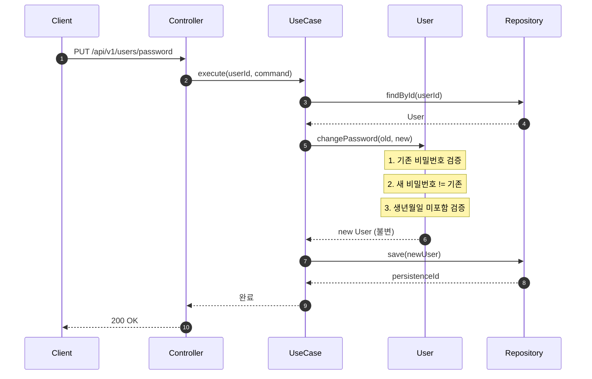

# User 도메인 구현

## 📌 Summary

- 배경: 커머스 서비스에 회원 기능 없음
- 목표: 회원가입, 내 정보 조회, 비밀번호 변경 API 구현
- 결과: 3개 API 완성, 헤더 기반 인증 적용, TDD로 진행

## 🧭 Context & Decision

### 문제 정의
- 현재 동작/제약: 회원 관련 기능 없음
- 문제: JPA Entity를 Domain으로 쓰면 테스트할 때 JPA 의존성이 따라옴. 식별자 역할도 불명확
- 성공 기준: API 정상 동작, 단위/통합/E2E 테스트 통과

### 트레이드 오프

**Domain-Entity 매핑**

- 고려한 대안
  - A: JPA Entity = Domain (Dirty Checking 활용)
  - B: Domain / Entity 분리 + Mapper
- 결정: B
- 트레이드오프: Mapper 코드 늘어나지만, `User.changePassword()` 같은 도메인 로직을 JPA 없이 테스트 가능
- 감수한 비용: `save()` 마다 새 Entity 생성 (GC 부담), ID 매핑 실수 가능 -> 통합 테스트로 커버

**식별자 네이밍**

- 고려한 대안:
  - A: `id` 그대로 사용
  - B: `persistenceId`로 리네이밍
- 최종 결정: B
- 트레이드오프: 필드명 길어지지만 DB PK vs 비즈니스 키 구분 명확해짐

## 🏗️ Design Overview

### 변경 범위
- 영향 받는 모듈/도메인: domain/user, application/user, infrastructure/user, interfaces/api
- 신규 추가: User Aggregate, Value Objects, UseCase 3개, Controller, Filter
- 제거/대체: 없음

### 주요 컴포넌트 책임
- `User`: Aggregate Root. 생성, 인증, 비밀번호 변경. 불변 객체
- `AuthenticationFilter`: 헤더에서 인증 정보 추출, AuthUser 생성
- `UserMapper`: Domain ↔ Entity 변환

## 🔁 Flow Diagram

### Main Flow (비밀번호 변경)

가장 복잡한 흐름이라 이것만 기록.

`User.changePassword()`가 새 객체를 반환함. 기존 객체는 안 바뀜.
