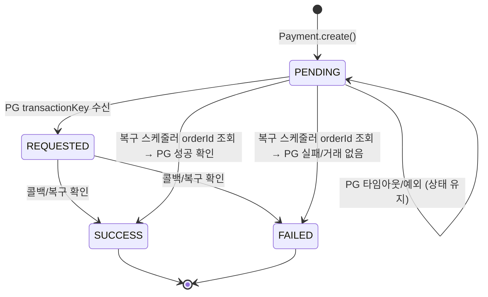

## 📌 Summary

- 배경: 외부 PG 시스템 연동 시 지연/장애가 내부 시스템으로 전파되어 전체 서비스가 마비될 위험이 있다.
- 목표: Timeout, Retry, CircuitBreaker, Fallback 4계층 방어로 PG 장애를 격리하고, 트랜잭션 분리로 DB 커넥션풀을 보호한다.
- 결과: PG 장애 시에도 내부 시스템 가용성 유지. PENDING/REQUESTED 상태 결제는 콜백 + 복구 스케줄러로 최종 확정.


## 🧭 Context & Decision

### 문제 정의
- 현재 동작/제약: PG는 비동기 결제 방식 (요청 시 PENDING 반환 → 1~5초 후 콜백). 요청 성공률 60%, 처리 성공률 70%.
- 문제(또는 리스크):
    - PG 지연 시 thread + DB 커넥션이 동시 점유 → 커넥션풀 고갈 → 전체 서비스 장애
    - PG 타임아웃 시 실제 결제 결과를 모름 → 유령 결제(돈은 빠졌는데 주문 미반영) 가능
    - PG 콜백 미수신 시 결제 상태가 영원히 미확정
- 성공 기준(완료 정의):
    - PG 장애 시 결제 외 API(상품 조회, 주문 목록 등)는 정상 응답
    - 모든 결제 건은 최종적으로 SUCCESS 또는 FAILED로 확정

### 선택지와 결정

#### 타임아웃 시 결제 상태 처리
- A: 즉시 FAILED 처리 → 사용자 재시도 가능하지만, PG 실제 성공 건의 콜백이 `isTerminal()=true`로 무시됨
- B: PENDING 유지 → 콜백 또는 복구 스케줄러가 최종 확정. 유령 결제 방지.
- **최종 결정: B (PENDING 유지)**
- 트레이드오프: 결과 미확정 상태가 최대 5분 지속. 사용자에게 "처리 중" 안내 필요.

#### 트랜잭션 구조
- A: 하나의 트랜잭션 (Payment 생성 + PG 호출 + 상태 업데이트) → DB 커넥션 최대 7초 점유
- B: 3단계 분리 (TX1: PENDING 생성 → PG 호출(트랜잭션 밖) → TX2: 상태 업데이트)
- **최종 결정: B (트랜잭션 분리)**
- 트레이드오프: TX1 커밋 후 서버 크래시 시 PENDING 고착 가능 → 복구 스케줄러가 처리

#### Retry 적용 범위
- A: 결제 요청(POST)에도 Retry 적용 → PG가 멱등하지 않아 중복 결제 발생 위험
- B: 조회(GET)에만 Retry 적용. 결제 POST는 1회 시도 → 실패 시 PENDING 유지 → 복구 스케줄러 위임
- **최종 결정: B**
- 이유: PG 시뮬레이터에 같은 orderId로 POST를 두 번 보내면 별도 결제건이 2건 생성됨(비멱등). Retry는 부작용 없는 GET에만 안전

#### 복구 스케줄러 — PENDING 상태 포함 여부
- 복구 대상: PENDING + REQUESTED 모두 포함
- PENDING은 transactionKey가 없으므로 orderId 기반으로 PG 조회 (`GET /payments?orderId=`)
- PG에 거래가 없으면 FAILED, 있으면 결과 반영

- 추후 개선 여지: 프론트 polling/push로 결과 미확정 시간 단축, 결제 취소 API 연동


## 🏗️ Design Overview

### 변경 범위
- 영향 받는 모듈/도메인: commerce-api (Payment, Order)
- 신규 추가:
    - Domain: Payment, PaymentStatus, CardType, PaymentException, PaymentRepository
    - Application: RequestPaymentUseCase, PaymentTransactionService, HandlePaymentCallbackUseCase, RecoverPaymentUseCase, GetPaymentUseCase, PaymentRecoveryScheduler, PaymentGatewayPort
    - Infrastructure: PaymentEntity, PaymentMapper, PaymentJpaRepository, PaymentRepositoryImpl, PgClientAdapter, PgClientConfig, CallbackUrlProviderImpl
    - Interfaces: PaymentController, PaymentCallbackController, Request/Response DTOs
- 제거/대체: 없음

### 주요 컴포넌트 책임

- `RequestPaymentUseCase`: 결제 요청 오케스트레이션. 트랜잭션 경계 없음. TX 처리를 PaymentTransactionService에 위임.
- `PaymentTransactionService`: 트랜잭션 경계 전담. PENDING 생성, REQUESTED/FAILED 상태 전이. self-invocation 방지를 위해 별도 Bean으로 분리.
- `PgClientAdapter`: PG HTTP 호출. 서킷 인스턴스 분리(pgRequest/pgQuery). 결제 POST에는 Retry 미적용(PG 비멱등), 조회 GET에만 Retry 적용. fallback에서 내부 예외 정보 미노출.
- `HandlePaymentCallbackUseCase`: PG 콜백 수신. SELECT FOR UPDATE로 동시 콜백 직렬화. isTerminal() 멱등 체크.
- `RecoverPaymentUseCase`: 미완료 결제 복구. PG 조회는 트랜잭션 밖, 상태 업데이트는 트랜잭션 안. PENDING은 orderId 기반, REQUESTED는 transactionKey 기반 복구.
- `PaymentRecoveryScheduler`: 60초 주기 스케줄링. PENDING + REQUESTED 중 5분 경과 건 복구.


## 🔁 Flow Diagram

### Main Flow — 결제 요청

```mermaid
sequenceDiagram
    autonumber
    participant Client
    participant Controller as PaymentController
    participant UC as RequestPaymentUseCase
    participant TxSvc as PaymentTransactionService
    participant DB as MySQL
    participant PG as PG 시뮬레이터

    Client->>Controller: POST /api/v1/payments
    Controller->>UC: request(userId, command)

    rect rgb(40, 60, 90)
        Note over TxSvc,DB: TX1 — Payment PENDING 생성
        UC->>TxSvc: createPendingPayment()
        TxSvc->>DB: 주문 검증 + Payment INSERT(PENDING)
        DB-->>TxSvc: paymentId
        TxSvc-->>UC: {paymentId, amount}
        Note over DB: 커밋. 커넥션 반환.
    end

    rect rgb(90, 50, 30)
        Note over UC,PG: 트랜잭션 밖 — PG 호출
        UC->>PG: requestPayment()
        Note over PG: CircuitBreaker(pgRequest) → 실제 호출 (Retry 없음)
        PG-->>UC: {transactionKey} 또는 fallback
    end

    alt PG 성공 (transactionKey 수신)
        rect rgb(30, 70, 50)
            Note over TxSvc,DB: TX2 — REQUESTED 전이
            UC->>TxSvc: markRequested(paymentId, txKey)
            TxSvc->>DB: UPDATE status=REQUESTED
        end
    else PG 실패 또는 타임아웃
        Note over UC: PENDING 유지. 복구 스케줄러에 위임.
    end

    UC-->>Controller: paymentId
    Controller-->>Client: 201 Created
```



### 콜백 수신 Flow

```mermaid
sequenceDiagram
    autonumber
    participant PG as PG 시뮬레이터
    participant CB as CallbackController
    participant UC as HandlePaymentCallbackUseCase
    participant DB as MySQL

    PG->>CB: POST /api/v1/payments/callback
    CB->>UC: handle(callbackInfo)

    rect rgb(40, 60, 90)
        Note over UC,DB: 단일 트랜잭션
        UC->>DB: SELECT FOR UPDATE (transactionKey)
        DB-->>UC: Payment

        alt isTerminal() = true
            Note over UC: 무시 (멱등)
        else SUCCESS 콜백
            UC->>DB: UPDATE payment → SUCCESS
            UC->>DB: SELECT FOR UPDATE order
            UC->>DB: UPDATE order → COMPLETED
        else FAILED 콜백
            UC->>DB: UPDATE payment → FAILED
        end
    end

    UC-->>CB: OK
    CB-->>PG: 200
```



### 복구 스케줄러 Flow

```mermaid
sequenceDiagram
    autonumber
    participant SCH as PaymentRecoveryScheduler
    participant UC as RecoverPaymentUseCase
    participant DB as MySQL
    participant PG as PG 시뮬레이터

    SCH->>UC: recoverPendingPayments()
    UC->>DB: PENDING/REQUESTED + 5분 경과 조회
    DB-->>UC: 복구 대상 목록

    loop 각 결제 건
        alt transactionKey 있음 (REQUESTED)
            UC->>PG: getTransactionStatus(txKey)
        else transactionKey 없음 (PENDING)
            UC->>PG: getTransactionsByOrderId(orderId)
        end
        PG-->>UC: 거래 상태

        rect rgb(30, 70, 50)
            Note over UC,DB: 트랜잭션 — 상태 반영
            UC->>DB: SELECT FOR UPDATE payment
            alt PG SUCCESS
                UC->>DB: payment → SUCCESS, order → COMPLETED
            else PG FAILED 또는 거래 없음
                UC->>DB: payment → FAILED
            end
        end
    end
```




## 🛡️ Resilience 계층 구조

### 결제 요청 (POST)
```
요청 → [Timeout 3s] → [CircuitBreaker pgRequest 70%/10s] → [Fallback]
```
- POST에는 Retry 미적용. PG가 멱등하지 않아 Retry 시 중복 결제 발생.

### 결제 조회 (GET)
```
요청 → [Timeout 3s] → [CircuitBreaker pgQuery 70%/30s] → [Retry 2회/1s] → [Fallback]
```
- 조회는 부작용 없으므로 Retry 적용. 결제 서킷이 열려도 복구 스케줄러의 조회는 동작.

### 설정값 근거

| 계층 | 설정값 | 판단 근거 |
|------|--------|----------|
| Timeout | connect 1s, read 3s | PG 정상 100~500ms. 3s 초과는 장애 |
| Retry (조회만) | 2회, 1s 간격, transport 예외만 | 조회는 멱등. 비즈니스 실패는 재시도 무의미 |
| CB pgRequest | window 10, 실패율 70%, open 10s | PG 기본 실패율 40% + 30%p 여유. 50%면 정상 운영 중 CB 열림 |
| CB pgQuery | window 10, 실패율 70%, open 30s | 조회는 관대하게. 복구 스케줄러가 계속 시도 가능 |
| Fallback | 고정 문구 반환 | 예외 전파 차단. 내부 인프라 정보 미노출 |


## 📊 Payment 상태 머신



| 상태 | 의미 | Order 영향 |
|------|------|-----------|
| PENDING | PG에 보냈는지조차 불확실 | 없음 |
| REQUESTED | PG가 접수함. 결과 미확정 | 없음 |
| SUCCESS | 결제 확정 | Order → COMPLETED |
| FAILED | 실패 확정. 재시도 가능 | 없음 (Order PENDING 유지) |


## ⚖️ 트레이드오프 정리

| 결정 | 얻은 것 | 포기한 것 |
|------|---------|----------|
| read-timeout 3초 | thread 점유 최소화 | 3초 이후 도착한 PG 성공 응답은 버림 |
| 결제 POST에 Retry 미적용 | 중복 결제 방지 (PG 비멱등) | 네트워크 순단 시 재시도 없이 PENDING 유지 |
| 조회 GET에만 Retry 2회 | 복구 스케줄러 안정성 | PG 500이 순간 부하여도 재시도 안 함 |
| 서킷 인스턴스 분리 (pgRequest/pgQuery) | 결제 서킷 열려도 복구 조회 가능 | 인스턴스 2개 관리 |
| CB threshold 70% (PG 실패율 40% + 30%p 여유) | 정상 운영 시 서킷 미작동 보장 | 실패율 70% 넘어야 차단 — 감지가 50%보다 늦음 |
| 타임아웃/fallback 시 PENDING 유지 | PG 성공 건 유실 방지 + orderId 복구 | 최대 5분간 결과 미확정 |
| 트랜잭션 분리 | DB 커넥션풀 보호 | PENDING 고착 가능성 (복구 스케줄러가 처리) |
| 복구 대상 PENDING + REQUESTED | txKey 없는 결제도 orderId로 복구 가능 | PG orderId 조회 API 의존 |


## 🧪 테스트

### 단위 테스트
| 테스트 | 검증 내용 |
|--------|----------|
| PaymentTest (23개) | create, markRequested, approve, fail, isTerminal, assertOwnedBy, isOwnedBy, reconstitute |
| CardNoTest (5개) | 카드번호 형식 검증, 마스킹 |

### 통합 테스트
| 테스트 | 검증 내용 |
|--------|----------|
| HandlePaymentCallbackUseCaseIntegrationTest (5개) | SUCCESS/FAILED 콜백, 존재하지 않는 transactionKey, 멱등성 |
| RequestPaymentUseCaseIntegrationTest (4개) | PG 성공 시 REQUESTED, PG 실패 시 PENDING 유지, NOT_FOUND, 타인 주문 |

### k6 부하 테스트
| 스크립트 | 용도 |
|---------|------|
| payment-load-test.js | 결제 요청 ramp up/down + PG 시뮬레이터 직접 벤치마크 |
| circuit-breaker-test.js | PG 꺼진 상태에서 서킷 OPEN 전이 확인 |

### Grafana 모니터링
- Resilience4j 공식 대시보드 (ID: 21307) import
- `k6/docker-compose.yml`로 Prometheus + Grafana 기동