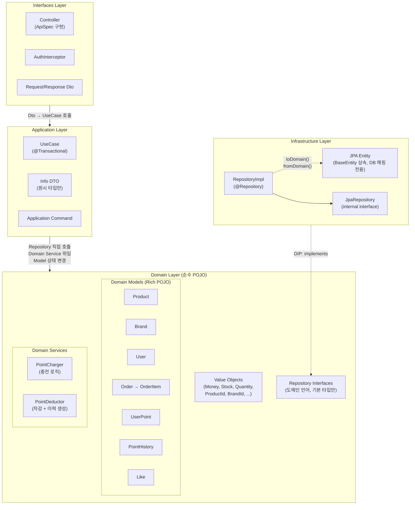
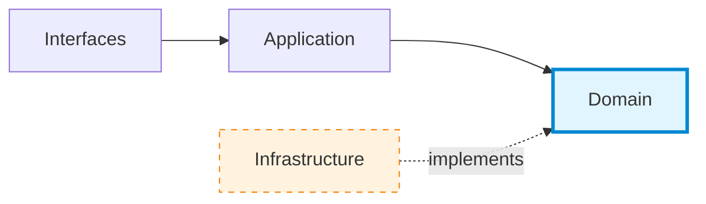
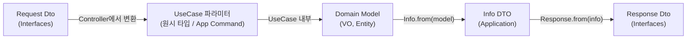
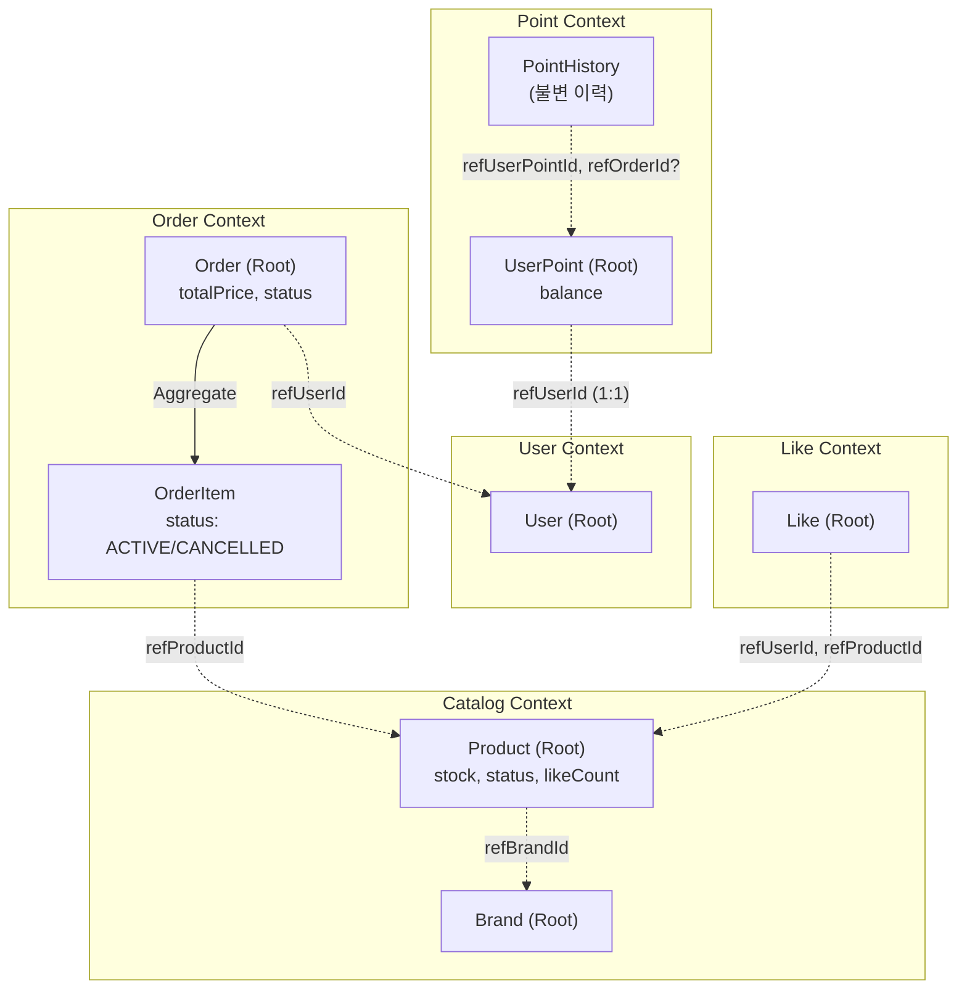

# Architecture Diagram

## 1. Strict Layered Architecture

## 2. 레이어별 책임과 역할

### Interfaces Layer — API 진입점

| 구성 요소                    | 책임                                                                                |
|--------------------------|-----------------------------------------------------------------------------------|
| **Controller**           | HTTP 요청 수신, Request Dto → UseCase 파라미터 변환, UseCase 호출, Info DTO → Response Dto 변환 |
| **ApiSpec**              | OpenAPI 명세 인터페이스. Controller가 구현                                                  |
| **Request/Response Dto** | API 계약. Domain 객체 직접 참조 금지                                                        |
| **AuthInterceptor**      | 헤더 기반 인증 → `AuthenticateUserUseCase` 호출                                           |

**규칙:**

- 모든 요청은 예외 없이 UseCase를 통과한다 (계층 건너뛰기 금지)
- Controller는 Domain 객체(Command, VO, Enum, Service)를 직접 참조하지 않는다
- Domain Enum은 Interfaces에 API 전용 Enum을 선언하고 매핑한다

### Application Layer — 오케스트레이션

| 구성 요소                   | 책임                                                                  |
|-------------------------|---------------------------------------------------------------------|
| **UseCase**             | 단일 유스케이스 실행. Repository/Domain Service 오케스트레이션. `@Transactional` 경계 |
| **Info DTO**            | UseCase → Controller 반환 DTO. 원시 타입만 사용하여 Domain 유출 차단               |
| **Application Command** | cross-domain 오케스트레이션 요청 표현 (예: `PlaceOrderCommand`)                 |

**규칙:**

- 비즈니스 로직 없음. Domain 컴포넌트를 조합만 한다
- 기본 패턴: UseCase가 Repository를 직접 호출. 빈 껍데기 Domain Service 금지
- Domain Service는 원자적 얽힘이 있는 경우에만 위임 (예: `PointDeductor`)
- `@Transactional`은 반드시 UseCase의 `execute()`에 부착. Domain Service에 사용 금지
- 대고객 `XxxUseCase` / 어드민 `XxxAdminUseCase`로 네이밍 구분

### Domain Layer — 비즈니스 핵심

| 구성 요소                    | 책임                                                         |
|--------------------------|------------------------------------------------------------|
| **Domain Model**         | 순수 POJO. 비즈니스 규칙과 상태 변경을 스스로 수행. JPA 의존성 없음                |
| **Value Object**         | 자가 검증하는 값 타입. `@JvmInline value class` 또는 `data class`     |
| **Domain Service**       | 단일 엔티티로 해결 불가한 복합 규칙만 담당 (`PointCharger`, `PointDeductor`) |
| **Repository Interface** | 도메인 언어와 기본 타입만 사용. Spring Data 타입 노출 금지                    |

**규칙:**

- Domain은 어디에도 의존하지 않는다 (DIP)
- 검증, 상태 변경, 상태 판단은 모두 Domain Model 내부에서 수행
- `isDeleted()`(soft delete)와 `isActive()`(비즈니스 상태)는 관심사 분리
- 삭제 여부 검증(`isDeleted()`)은 UseCase의 책임
- POJO는 JPA dirty checking 불가 → 상태 변경 후 반드시 `repository.save()` 명시

### Infrastructure Layer — 영속성 구현

| 구성 요소              | 책임                                                                  |
|--------------------|---------------------------------------------------------------------|
| **JPA Entity**     | DB 테이블 매핑 전용. `BaseEntity` 상속 (id, createdAt, updatedAt, deletedAt) |
| **RepositoryImpl** | Domain Repository 인터페이스 구현. `toDomain()`/`fromDomain()` 변환          |
| **JpaRepository**  | Spring Data JPA 인터페이스. RepositoryImpl과 같은 파일에 선언                    |

**규칙:**

- JPA 연관관계(`@OneToMany`, `@ManyToOne`) 전면 미사용 — ID 참조만
- Soft Delete 필터링: 단건 조회는 삭제 포함, 다건 조회는 `deletedAt IS NULL` 필터
- 비관적 락: `findByIdForUpdate` → `@Lock(PESSIMISTIC_WRITE)`
- JPA Entity의 식별자 및 속성은 `@Converter` 사용을 방지하기 위해 VO 대신 원시 타입(`Long`, `String` 등)을 유지한다.

## 3. 의존 방향 & DIP

**핵심 원칙:** `Application → Domain ← Infrastructure`. Domain은 어디에도 의존하지 않는다.

## 4. 데이터 변환 흐름

| 경계                       | 변환 방향                      | 방법                            |
|--------------------------|----------------------------|-------------------------------|
| Interfaces → Application | Request Dto → UseCase 파라미터 | Controller에서 직접 변환            |
| Application → Domain     | 원시 타입 → VO/Command         | UseCase 내부에서 생성               |
| Domain → Application     | Domain Model → Info DTO    | `Info.from(domainModel)` 팩토리  |
| Application → Interfaces | Info DTO → Response Dto    | `Response.from(info)` 팩토리     |
| Domain ↔ Infrastructure  | Domain Model ↔ JPA Entity  | `toDomain()` / `fromDomain()` |

## 5. Bounded Context & Aggregate

**규칙:**

- Aggregate 내부의 비즈니스 변경은 반드시 Root를 통한다 (예: `Order.cancelItem()`)
- Cross-domain 참조는 ID만 사용. 다른 도메인 모델을 직접 의존하지 않는다
- Order ↔ OrderItem: JPA 연관관계 없이 ID 참조. 저장 시 UseCase에서 명시적 순회

## 6. UseCase 목록

### Catalog (Brand + Product)

| UseCase                   | 역할                     | 비고 |
|---------------------------|------------------------|----|
| `GetBrandUseCase`         | 브랜드 단건 조회 (대고객)        |    |
| `GetBrandsUseCase`        | 브랜드 목록 조회              |    |
| `GetBrandAdminUseCase`    | 브랜드 단건 조회 (어드민, 삭제 포함) |    |
| `CreateBrandUseCase`      | 브랜드 생성                 |    |
| `UpdateBrandUseCase`      | 브랜드 수정                 |    |
| `DeleteBrandUseCase`      | 브랜드 삭제 (+ 소속 상품 연쇄 삭제) |    |
| `RestoreBrandUseCase`     | 브랜드 복구 (소속 상품 미복구)     |    |
| `GetProductUseCase`       | 상품 상세 조회 (대고객, 브랜드 포함) |    |
| `GetProductsUseCase`      | 상품 목록 조회               |    |
| `GetProductAdminUseCase`  | 상품 단건 조회 (어드민)         |    |
| `GetProductsAdminUseCase` | 상품 목록 조회 (어드민)         |    |
| `CreateProductUseCase`    | 상품 생성 (브랜드 검증)         |    |
| `UpdateProductUseCase`    | 상품 수정 (상태 자동 전이)       |    |
| `DeleteProductUseCase`    | 상품 삭제                  |    |
| `RestoreProductUseCase`   | 상품 복구                  |    |

### Like

| UseCase               | 역할                            | 비고                                            |
|-----------------------|-------------------------------|-----------------------------------------------|
| `AddLikeUseCase`      | 좋아요 등록 (비관적 락 + likeCount 증가) | 멱등, 비관적 락 + 2차 상태 검증 시 비활성 상품(!isActive()) 차단 |
| `RemoveLikeUseCase`   | 좋아요 취소 (비관적 락 + likeCount 감소) | 멱등, 비관적 락. 데이터 정합성을 위해 비활성 상품이어도 취소 허용        |
| `GetUserLikesUseCase` | 내 좋아요 목록 조회                   | 활성 상품만                                        |

### Order

| UseCase                 | 역할                             | 비고               |
|-------------------------|--------------------------------|------------------|
| `PlaceOrderUseCase`     | 주문 생성 (재고 차감 → 주문 저장 → 포인트 차감) | PointDeductor 위임 |
| `GetOrderUseCase`       | 주문 단건 조회 (대고객)                 |                  |
| `GetOrdersUseCase`      | 주문 목록 조회 (대고객)                 |                  |
| `GetOrderAdminUseCase`  | 주문 단건 조회 (어드민)                 |                  |
| `GetOrdersAdminUseCase` | 주문 목록 조회 (어드민)                 |                  |

### Point

| UseCase               | 역할        | 비고              |
|-----------------------|-----------|-----------------|
| `ChargePointUseCase`  | 포인트 충전    | PointCharger 위임 |
| `GetUserPointUseCase` | 포인트 잔액 조회 |                 |

### User

| UseCase                   | 역할                         | 비고                   |
|---------------------------|----------------------------|----------------------|
| `RegisterUserUseCase`     | 회원가입 (User + UserPoint 생성) |                      |
| `AuthenticateUserUseCase` | 인증                         | AuthInterceptor에서 호출 |
