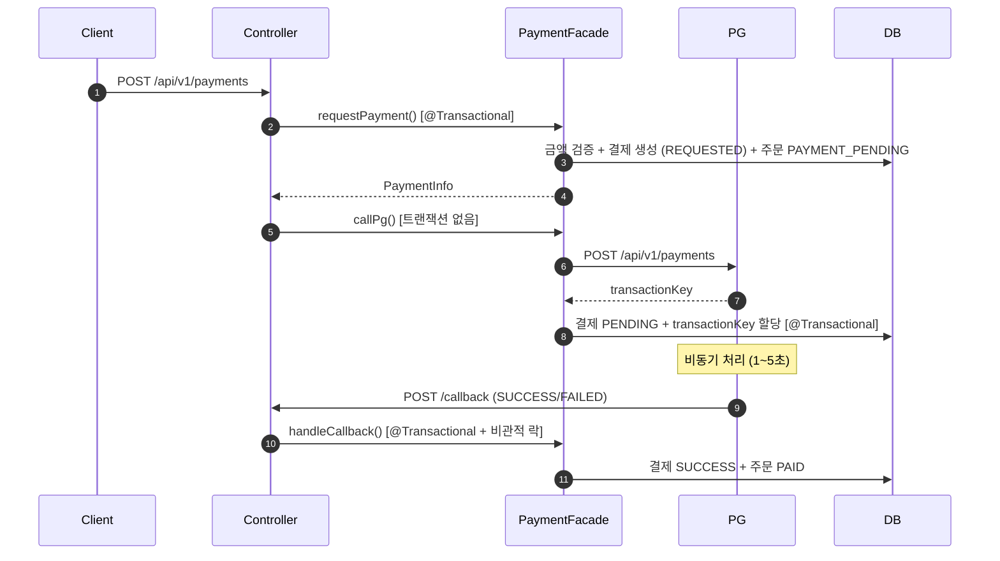
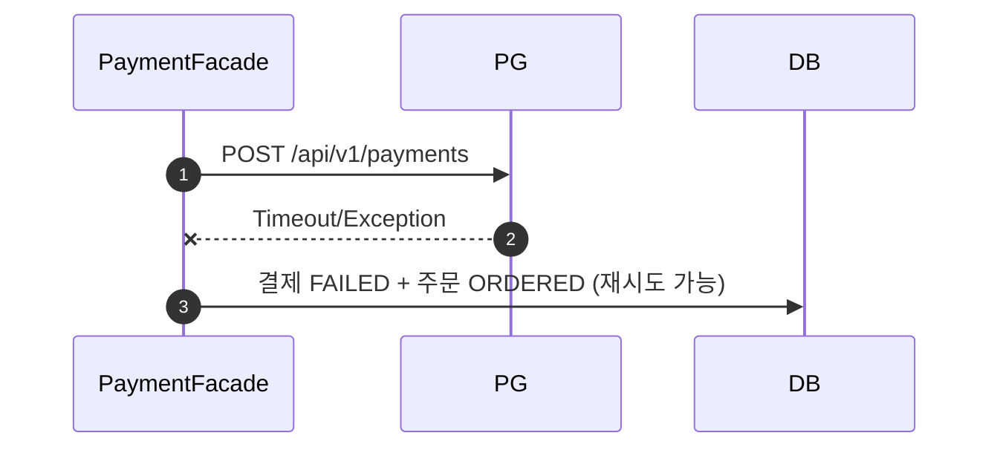
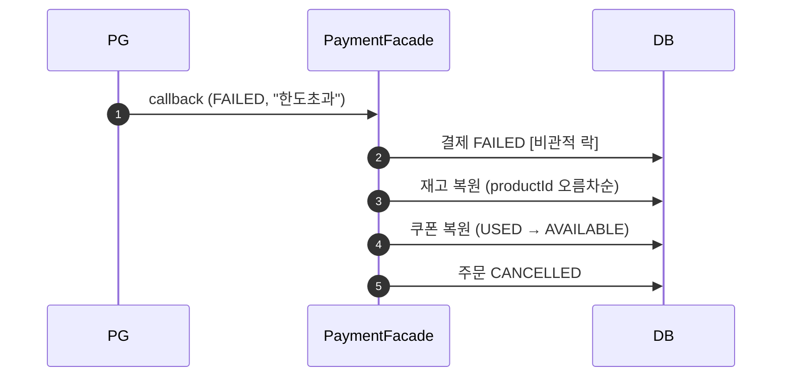
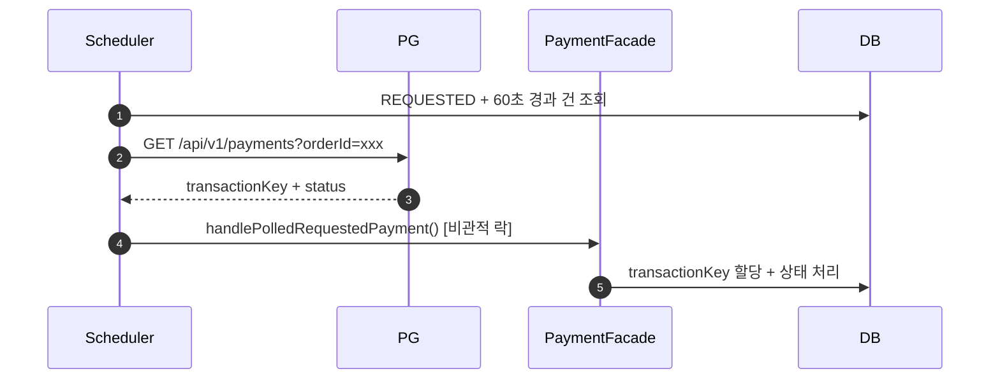

## 📌 Summary

- 목표: 외부 PG 시스템과 연동하여 주문에 대한 결제 처리 기능 구현. 상태 불일치·트랜잭션 경계·장애 시나리오에 대한 안전한 처리
- 결과: 콜백 + 폴링 이중화로 결제 상태 정합성 확보, Resilience4j 서킷브레이커로 외부 시스템 장애 확산 방지, 보상 트랜잭션으로 결제 실패 시 재고/쿠폰/주문 복원

## 🧭 Context & Decision

### 문제 정의
- 현재 동작/제약: 주문 생성까지만 가능하고 결제 처리 없음. PG는 비동기 방식이라 요청과 처리가 분리됨
- 문제(또는 리스크): 외부 시스템 지연/실패 시 내부 상태 불일치, 콜백 유실 시 결제 상태 미반영, 금액 위변조
- 성공 기준: PG 연동 결제 요청/콜백/조회 API 동작, 실패 시 보상 트랜잭션, 서킷브레이커 적용

### 선택지와 결정

**PG 연동 방식 (D43)**
- A: RestTemplate + DIP 포트 패턴 (기존 프로젝트 패턴)
- B: FeignClient (선언적 HTTP 클라이언트)
- 최종 결정: A — 프로젝트 기존 패턴 일관성 유지
- 트레이드오프: FeignClient 대비 보일러플레이트 증가하나, 기존 코드베이스와 일관성 확보

**비동기 결제 처리 (D44)**
- A: 콜백만
- B: 폴링만
- C: 콜백 + 폴링 이중화
- 최종 결정: C — 콜백 유실 대비. 폴링 30초 주기, 60초 이상 경과 건 대상

**트랜잭션 경계 분리 (D46)**
- requestPayment(@Tx) → callPg(no Tx) → handleCallback(@Tx)
- PG HTTP 호출을 트랜잭션 밖으로 분리하여 DB 커넥션 장기 점유 방지

**PG 실패 유형 구분 (D47)**
- PG 호출 자체 실패 (timeout) → 주문 ORDERED 복귀 (재시도 가능)
- 콜백 FAILED (한도초과/잘못된카드) → 보상 트랜잭션 후 CANCELLED

### 외부 연동 리스크 대응
- 금액 검증: `command.amount != order.getTotalAmount()` 서버 측 검증 추가
- transactionKey 미할당 고착: `handlePolledRequestedPayment` — paymentId 기반 직접 처리로 PG 응답 수신 후 크래시 복구
- 콜백/폴링 race condition: `findByTransactionKeyWithLock` 비관적 락으로 동시 진입 방지

- 추후 개선 여지: E2E 테스트, PaymentFacade/PaymentService 단위 테스트 추가 필요

## 🏗️ Design Overview

### 변경 범위
- 영향 받는 모듈/도메인: commerce-api (order, product, coupon, payment), pg-simulator
- 신규 추가: payment 도메인 4-layer, pg-simulator 모듈, DDL, HTTP 파일
- 제거/대체: 없음

### 주요 컴포넌트 책임
- `PaymentFacade`: cross-domain 조합 (결제요청, PG호출, 콜백처리, 보상트랜잭션)
- `PaymentService`: 결제 단일 도메인 CRUD
- `PgClient` / `PgRestClient`: 외부 PG 시스템 연동 포트/어댑터 (DIP). CircuitBreaker 적용
- `PaymentPollingScheduler`: 콜백 유실 대비 30초 주기 폴링
- `PaymentModel`: 결제 상태 머신 (REQUESTED → PENDING → SUCCESS/FAILED)
- `OrderModel`: 결제 연동 상태 전이 (ORDERED → PAYMENT_PENDING → PAID/CANCELLED)
- `ProductModel.restoreStock()` / `IssuedCouponModel.restore()`: 보상 트랜잭션용 복원 메서드

### Resilience 설계
- `@CircuitBreaker(name="pgPayment")`: COUNT_BASED, window=10, failRate=60%, waitOpen=10s
- 타임아웃: connectTimeout=2s, readTimeout=3s
- 서킷 오픈 시 빠른 실패 → 내부 시스템 보호

## 🔁 Flow Diagram

### Main Flow (정상 결제)

### Exception Flow (PG 호출 실패 → 주문 복귀)

### Exception Flow (콜백 FAILED → 보상 트랜잭션)

### Recovery Flow (폴링 스케줄러 — transactionKey 미할당 복구)

## ✅ Checklist

### ⚡ PG 연동 대응
- [x] PG 연동 API는 RestTemplate으로 외부 시스템을 호출한다.
- [x] 응답 지연에 대해 타임아웃을 설정하고, 실패 시 적절한 예외 처리 로직을 구현한다.
- [x] 결제 요청에 대한 실패 응답에 대해 적절한 시스템 연동을 진행한다.
- [x] 콜백 방식 + **결제 상태 확인 API**를 활용해 적절하게 시스템과 결제정보를 연동한다.

### 🛡 Resilience 설계
- [x] 서킷 브레이커를 적용하여 장애 확산을 방지한다.
- [x] 외부 시스템 장애 시에도 내부 시스템은 **정상적으로 응답**하도록 보호한다.
- [x] 콜백이 오지 않더라도, 일정 주기 폴링으로 상태를 복구할 수 있다.
- [x] PG에 대한 요청이 타임아웃에 의해 실패되더라도 해당 결제건에 대한 정보를 확인하여 정상적으로 시스템에 반영한다.

### 🔒 외부 연동 리스크 대응
- [x] 결제 금액과 주문 총액 서버 측 검증
- [x] transactionKey 미할당 고착 복구 (폴링 스케줄러 paymentId 기반 직접 처리)
- [x] 콜백/폴링 동시 진입 방지 (비관적 락)

---

🤖 Generated with [Claude Code](https://claude.com/claude-code)
