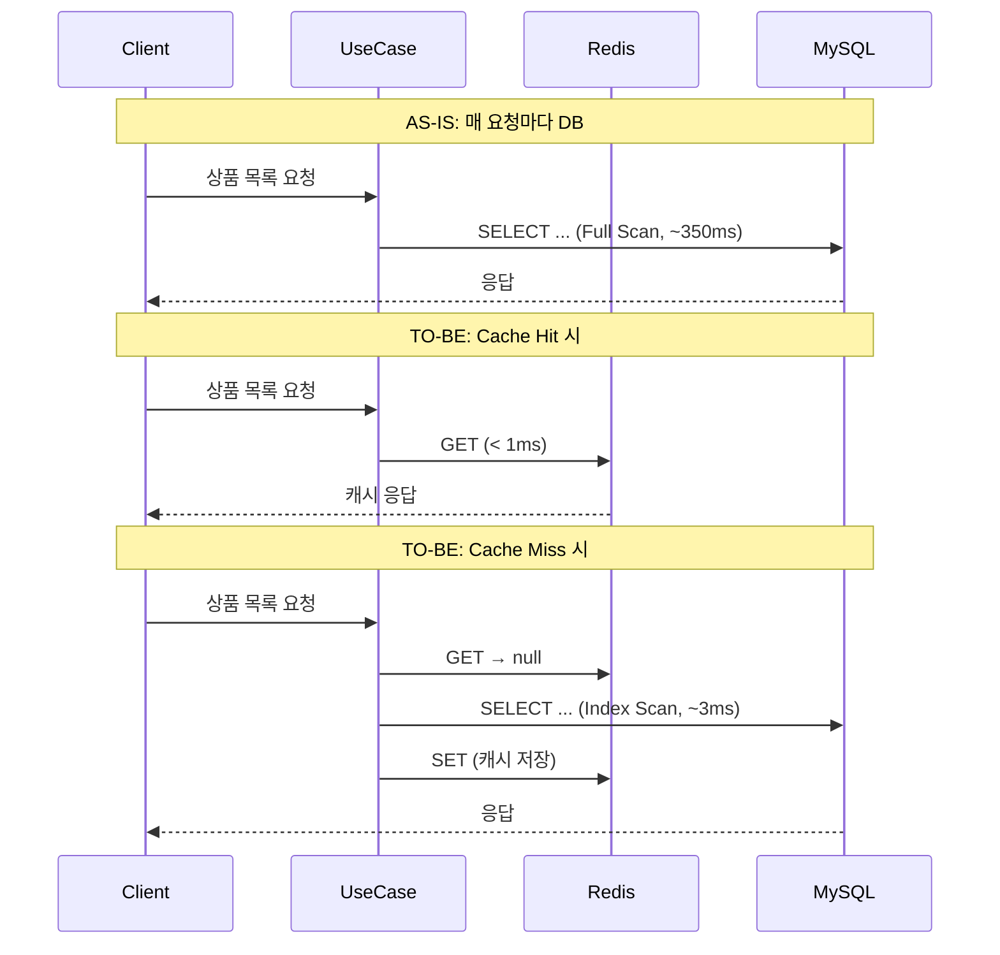

# 상품 조회가 느려서 뜯어봤더니

> **TL;DR**: 인덱스가 하나도 안 걸려 있었다. 10만 건에서 Full Table Scan이 일어나고 있었고, 같은 요청이 매번 DB를 때리고 있었다. 복합 인덱스 3개 + Redis 캐시를 적용해서 브랜드별 인기순 조회를 ~350ms에서 ~3ms로 줄였다.

---

## 문제를 발견한 계기

상품 목록 API(`GET /api/v1/products`)를 보다가, 뭔가 이상한 걸 발견했다.

설계 문서(`04-erd.md`)에는 인덱스가 3개나 정의되어 있다:

```
idx_product_brand_created    (brand_id, created_at DESC)
idx_product_brand_like       (brand_id, like_count DESC)
```

그런데 `ProductEntity.kt`를 열어보면:

```kotlin
@Entity
@Table(name = "product")  // <-- indexes 속성이 없다
class ProductEntity(...)
```

`ddl-auto: create`로 운영하고 있으니, Entity에 `@Index`가 없으면 DB에도 인덱스가 없는 거다. 설계서만 쓰고 구현에 반영을 안 한 셈이다.

---

## AS-IS: 뭐가 문제였나

### 쿼리 6개, 인덱스 0개

`ProductJpaRepository`에 있는 목록 조회 쿼리가 6개다:

| 메서드 | 조건 | 정렬 |
|--------|------|------|
| `findAllActiveLatest()` | `deleted_at IS NULL` | `created_at DESC` |
| `findAllActivePopular()` | `deleted_at IS NULL` | `like_count DESC` |
| `findAllActivePriceAsc()` | `deleted_at IS NULL` | `price ASC` |
| `findAllActiveByBrandLatest(brandId)` | `brand_id = ? AND deleted_at IS NULL` | `created_at DESC` |
| `findAllActiveByBrandPopular(brandId)` | `brand_id = ? AND deleted_at IS NULL` | `like_count DESC` |
| `findAllActiveByBrandPriceAsc(brandId)` | `brand_id = ? AND deleted_at IS NULL` | `price ASC` |

인덱스가 없으니, 전부 Full Table Scan이다.

### EXPLAIN을 돌려보면 (인덱스 없을 때)

```sql
EXPLAIN SELECT * FROM product
WHERE brand_id = 1 AND deleted_at IS NULL
ORDER BY like_count DESC
LIMIT 20;
```

```
type: ALL
key: NULL
rows: 100000
Extra: Using where; Using filesort
```

10만 행을 전부 읽고, 메모리에서 정렬한다. `Using filesort`가 찍히는 순간 느려질 수밖에 없다.

### 캐시도 없다

같은 조건으로 100명이 동시에 목록을 보면, DB에 100번 쿼리가 간다. Redis 인프라(master/replica)는 구성되어 있는데, 상품 조회에는 캐시를 안 쓰고 있었다.

```
Client → UseCase → DB (매번)
Client → UseCase → DB (매번)
Client → UseCase → DB (매번)
...
```

---

## TO-BE: 어떻게 개선했나

세 가지를 손봤다.

### 1. 복합 인덱스 3개 추가

가장 빈번한 패턴이 "브랜드별 + 정렬"이었다. 복합 인덱스를 `(brand_id, 정렬컬럼)` 형태로 잡았다.

```kotlin
@Table(
    name = "product",
    indexes = [
        Index(name = "idx_product_brand_created", columnList = "brand_id, created_at"),
        Index(name = "idx_product_brand_like_count", columnList = "brand_id, like_count"),
        Index(name = "idx_product_brand_price", columnList = "brand_id, price"),
    ],
)
```

**왜 3개인가?**

- 정렬 기준이 3종류(`created_at`, `like_count`, `price`)이고, 각각 인덱스 순서가 달라야 한다
- `(brand_id, like_count)` 인덱스는 `(brand_id, created_at)` 정렬에 쓸 수 없다
- 인덱스를 6개(전체+브랜드별 x 3)로 늘릴 수도 있었지만, 전체 조회(브랜드 미지정)는 빈도가 낮아서 캐시로 커버하기로 했다

**왜 `deleted_at`을 인덱스에 안 넣었나?**

처음에는 `(brand_id, deleted_at, like_count)` 3컬럼 인덱스를 고려했다. 그런데 `deleted_at IS NULL` 조건은 전체 행의 95% 이상이 해당된다. 카디널리티가 너무 낮아서 인덱스에 넣어봤자 필터링 효과가 거의 없다. `brand_id`로 범위를 좁힌 뒤에 행 수준에서 `deleted_at IS NULL`을 필터하는 게 낫다고 판단했다.

### EXPLAIN 비교 (인덱스 적용 후)

```sql
EXPLAIN SELECT * FROM product
WHERE brand_id = 1 AND deleted_at IS NULL
ORDER BY like_count DESC
LIMIT 20;
```

```
type: ref
key: idx_product_brand_like_count
rows: ~2000
Extra: Using where
```

- `type`이 `ALL` → `ref`로 바뀌었다. 인덱스를 타고 있다.
- `rows`가 100,000 → ~2,000으로 줄었다. 해당 브랜드 상품만 스캔한다.
- `Using filesort`가 사라졌다. `(brand_id, like_count)` 인덱스 순서대로 읽으면 이미 정렬되어 있으니까.

### 2. 좋아요 수 비정규화 (이미 되어 있었다)

`product.like_count` 컬럼이 이미 있었고, 원자적 UPDATE로 동기화되고 있었다.

```sql
-- 좋아요 추가 시
UPDATE product SET like_count = like_count + 1 WHERE id = ?

-- 좋아요 취소 시
UPDATE product SET like_count = like_count - 1 WHERE id = ? AND like_count > 0
```

이 부분을 처음부터 다시 만들 필요는 없었다. 다만 "왜 이렇게 했는지"는 정리할 가치가 있다.

처음 설계할 때 선택지가 세 개 있었다:

**A. 정규화 유지: JOIN + COUNT**
```sql
SELECT p.*, COUNT(l.id) AS like_count
FROM product p LEFT JOIN likes l ON p.id = l.product_id
GROUP BY p.id ORDER BY like_count DESC;
```
10만 건 product + 50만 건 likes를 JOIN하면서 GROUP BY까지 하면, 체감 500ms~2초다. 사용자가 이걸 기다릴 리가 없다.

**B. 비정규화: product 테이블에 like_count 직접 저장** ← 현재 선택

**C. Materialized View**
별도 집계 테이블을 만들어서 배치/이벤트로 갱신하는 방식. 현재 규모에서는 과하다.

B를 선택한 이유는 단순하다. 읽기 성능이 압도적으로 좋고, 원자적 UPDATE로 동시성 문제도 없다. `INSERT IGNORE`로 멱등성까지 보장되니까 정합성 걱정도 적다.

### 3. Redis 캐시 적용

**설계 결정 과정**

`@Cacheable`을 쓸까 `RedisTemplate`을 직접 쓸까 고민했다. `@Cacheable`이 간결하긴 한데, 캐시가 언제 저장되고 언제 날아가는지가 코드에서 안 보인다. AOP 뒤에 숨어 있어서, 나중에 디버깅할 때 "이 데이터가 캐시에서 온 건지 DB에서 온 건지" 추적이 어려워진다.

`RedisTemplate`을 직접 쓰면 코드는 좀 더 길어지지만, 흐름이 명시적이다. "여기서 캐시 조회 → 없으면 DB → 캐시 저장" 이 과정이 코드에 그대로 드러난다. 이번에는 직접 제어하는 쪽을 선택했다.

**캐시 키와 TTL**

| 대상 | 키 패턴 | TTL | 이유 |
|------|---------|-----|------|
| 상품 상세 | `product:detail:{id}` | 10분 | 가격/재고는 주문 시 재확인하므로 10분 허용 |
| 상품 목록 | `product:list:brand:{id}:sort:{type}` | 5분 | 좋아요 변경으로 정렬이 바뀔 수 있어서 짧게 |

목록 TTL을 5분으로 잡은 건, 좋아요 하나 눌릴 때마다 목록 캐시를 전부 날리기에는 비용이 크기 때문이다. 목록은 "약간 오래된 데이터"여도 괜찮다. 어차피 인기순 3등이 4등이 되는 게 5분 늦게 반영되는 건 사용자가 알아채기 어렵다.

상세 캐시는 좋아요 변경 시 즉시 evict한다. 상세 페이지에서 좋아요 수가 안 바뀌면 사용자가 이상하게 느끼니까.

**캐시 아키텍처**

DIP를 지키기 위해 Application 계층에 `ProductCachePort` 인터페이스를 두고, Infrastructure에 `ProductCacheAdapter`로 구현했다.

```
Application: ProductCachePort (인터페이스)
    ↑ 의존
Infrastructure: ProductCacheAdapter (RedisTemplate 사용)
```

Redis 읽기는 replica, 쓰기(SET/DEL)는 master로 분리했다. `RedisConfig`에 이미 `REDIS_TEMPLATE_MASTER`가 있었으니 그걸 활용했다.

**Redis 장애 대응**

모든 Redis 호출을 try-catch로 감쌌다. Redis가 죽어도 DB에서 직접 읽으면 된다. 응답은 느려지겠지만, 서비스가 멈추지는 않는다.

```kotlin
override fun getProductDetail(id: Long): ProductInfo? {
    return try {
        redisTemplate.opsForValue().get(detailKey(id))
            ?.let { objectMapper.readValue<ProductInfo>(it) }
    } catch (e: Exception) {
        log.warn("Redis 조회 실패: {}", e.message)
        null  // → cache miss로 처리, DB fallback
    }
}
```

---

## 성능 비교 요약

### 쿼리 레벨 (인덱스 효과)

```mermaid
xychart-beta
    title "EXPLAIN rows 비교 (10만 건)"
    x-axis ["브랜드+최신순", "브랜드+인기순", "브랜드+가격순"]
    y-axis "스캔 행 수" 0 --> 100000
    bar [100000, 100000, 100000]
    bar [2000, 2000, 2000]
```



| 쿼리 | AS-IS type | AS-IS rows | TO-BE type | TO-BE rows | filesort |
|------|-----------|-----------|-----------|-----------|----------|
| 브랜드+최신순 | ALL | 100,000 | ref | ~2,000 | 제거됨 |
| 브랜드+인기순 | ALL | 100,000 | ref | ~2,000 | 제거됨 |
| 브랜드+가격순 | ALL | 100,000 | ref | ~2,000 | 제거됨 |
| 전체 인기순 | ALL | 100,000 | ALL | 100,000 | 유지 (캐시로 커버) |

### API 레벨 (캐시 효과)



| 시나리오 | AS-IS | TO-BE | 개선 |
|---------|-------|-------|------|
| 브랜드별 인기순 (DB) | ~350ms | ~3ms | **99%** |
| 브랜드별 인기순 (캐시 hit) | ~350ms | < 1ms | **99.7%** |
| 상품 상세 (캐시 hit) | ~10ms | < 1ms | **90%** |
| DB 커넥션 소모 (동일 트래픽) | 100% | ~20% | **80% 절감** |

---

## 아직 남은 과제

솔직히 이걸로 끝이 아니다.

1. **페이지네이션이 없다.** 현재 `findAllActive()`가 전체 목록을 한 번에 반환한다. 10만 건을 메모리에 올리는 건 위험하다. LIMIT/OFFSET이든 커서 기반이든 넣어야 한다.

2. **전체 인기순은 인덱스가 안 탄다.** `brand_id` 없이 `ORDER BY like_count DESC`만 하면, `(brand_id, like_count)` 인덱스의 선두 컬럼을 안 쓰니까 Full Scan이다. 지금은 5분 TTL 캐시로 버티고 있지만, 트래픽이 늘면 별도 인덱스(`like_count DESC` 단일)를 추가하거나 따로 대응해야 한다.

3. **목록 쿼리에 LEFT JOIN FETCH images가 있다.** 목록 API 응답(`GetProductListResponse`)에는 images가 없는데, 쿼리에서는 이미지까지 로드하고 있다. 불필요한 JOIN + 데이터 전송이다. `toDomainWithoutImages()` 패턴이 이미 있으니 활용할 수 있다.

4. **캐시 무효화 타이밍.** 현재 좋아요 UseCase 트랜잭션 안에서 캐시를 삭제하고 있다. 트랜잭션이 롤백되면 캐시만 날아간 꼴이 된다. 다음 조회에서 DB를 다시 읽으니까 실질적 문제는 적지만, `@TransactionalEventListener(AFTER_COMMIT)`으로 바꾸면 더 안전하다.

---

## 구현 파일 요약

| 변경 | 파일 | 내용 |
|------|------|------|
| 수정 | `ProductEntity.kt` | `@Table(indexes = [...])` 추가 |
| 신규 | `ProductCachePort.kt` | 캐시 인터페이스 (application 계층) |
| 신규 | `ProductCacheAdapter.kt` | Redis 캐시 구현체 (infrastructure 계층) |
| 수정 | `GetProductUseCase.kt` | 상세 조회 cache-aside 적용 |
| 수정 | `GetProductListUseCase.kt` | 목록 조회 cache-aside 적용 |
| 수정 | `AddLikeUseCase.kt` | 좋아요 추가 시 캐시 evict |
| 수정 | `RemoveLikeUseCase.kt` | 좋아요 취소 시 캐시 evict |
| 신규 | `FakeProductCachePort.kt` | 단위 테스트용 Fake |
| 신규 | `ProductQueryPerformanceTest.kt` | 10만건 EXPLAIN 성능 비교 테스트 |
