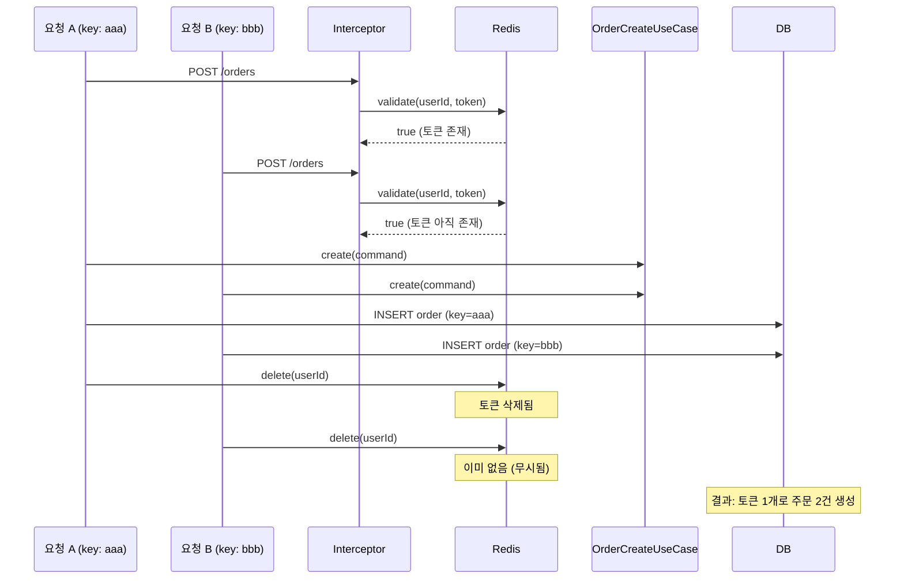
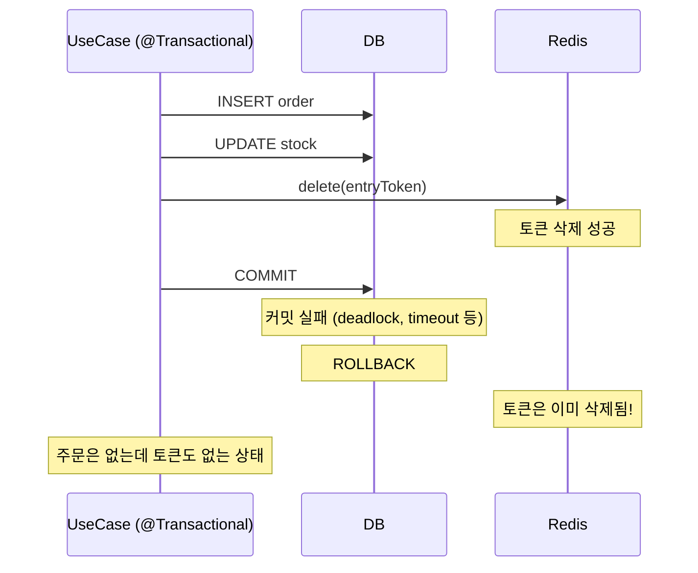
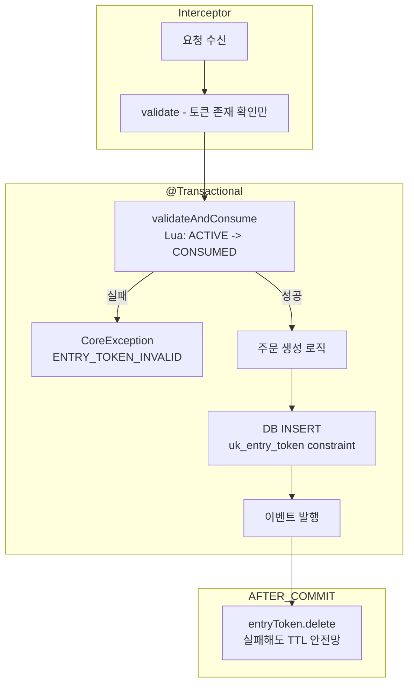

# 대기열 입장 토큰: "주문 완료 후 삭제" 패턴에서 동시 주문 방지

## 목표

Redis 기반 대기열 시스템에서 "주문 완료 후 토큰 삭제" 패턴을 유지하면서, 동일 토큰으로 2건 이상의 주문이 생성되는 race condition을 방지하는 구체적 기법과 트레이드오프를 분석한다.

## 방법론

- Claims extracted: 32
- Claims trimmed: 4 (Low priority supporting claims)
- Claims verified: 5 (High volatility core claims)
- Sources: 16

---

## 핵심 발견

### 1. 문제의 정확한 진단

현재 코드의 race condition 시퀀스는 다음과 같다:



**근본 원인**: Interceptor의 `validate`(읽기)와 UseCase의 `delete`(쓰기) 사이에 시간 간격이 있고, 두 요청이 그 간격 안에 동시에 진입할 수 있다. 전형적인 TOCTOU(Time-of-Check to Time-of-Use) 문제이다.

확신도: `verified_current` (코드 직접 분석)

### 2. 해결 기법 5가지

#### 기법 A: Redis Lua Script Atomic Consume (CAS 패턴)

**원리**: 토큰 검증과 상태 전환을 하나의 Lua 스크립트에서 원자적으로 수행한다. Redis는 Lua 스크립트 실행 중 다른 명령을 처리하지 않으므로, check-and-set이 원자적으로 보장된다[^1][^2].

**구현 방식**: Interceptor에서 `validate`만 하는 대신, UseCase 진입 시 토큰의 상태를 `ACTIVE` -> `CONSUMED`로 원자적 전환한다. 토큰 자체를 삭제하지 않고 상태를 바꾸므로, "주문 완료 후 삭제" 요구사항도 유지된다.

```lua
-- validate_and_mark_consumed.lua
local key = KEYS[1]
local expectedToken = ARGV[1]
local storedToken = redis.call('GET', key)
if storedToken == false then
    return 0  -- 토큰 없음
end
-- 이미 CONSUMED 상태인지 확인
if string.sub(storedToken, 1, 9) == 'CONSUMED:' then
    return -1  -- 이미 소비됨
end
if storedToken ~= expectedToken then
    return 0  -- 토큰 불일치
end
-- 상태 전환: 원래 값을 CONSUMED:{token}으로 변경
local ttl = redis.call('TTL', key)
redis.call('SET', key, 'CONSUMED:' .. storedToken)
if ttl > 0 then
    redis.call('EXPIRE', key, ttl)
end
return 1  -- 성공
```

```kotlin
// Kotlin 적용 예시
@Service
class OrderCreateUseCase(
    private val entryTokenRepository: EntryTokenRepository,
    // ...
) {
    @Transactional
    fun create(command: OrderCreateCommand): OrderResult.Created {
        // 토큰 원자적 소비 (Interceptor가 아닌 UseCase에서)
        command.entryToken?.let { token ->
            val consumed = entryTokenRepository.validateAndConsume(command.userId, token)
            if (!consumed) {
                throw CoreException(ErrorType.ENTRY_TOKEN_INVALID)
            }
        }
        // 이후 주문 로직...
    }
}
```

| 항목 | 평가 |
|------|------|
| 복잡도 | **낮음** -- Lua 스크립트 1개 추가, 기존 인터페이스에 이미 `validateAndConsume` 존재 |
| 성능 | **최고** -- Redis 단일 roundtrip, 네트워크 지연 최소 |
| 장애 내성 | **높음** -- Redis 단일 장애 시 전체 API가 중단되지만, 이는 대기열 시스템 자체의 한계 |
| 정합성 | **강함** -- Lua 스크립트의 원자성 보장[^1] |
| 제약 | 토큰 소비 후 주문 실패 시 토큰 복구 필요 (CONSUMED -> ACTIVE 롤백) |

확신도: `verified_current`

#### 기법 B: DB Unique Constraint 활용

**원리**: 주문 테이블에 `user_id + entry_token` 조합으로 unique constraint를 추가한다. 동일 토큰으로 두 번째 주문 INSERT 시 DB 레벨에서 중복이 거부된다.

```sql
ALTER TABLE orders ADD CONSTRAINT uk_entry_token
    UNIQUE (user_id, entry_token_id);
```

```kotlin
// 기존 코드 변경 최소화
@Transactional
fun create(command: OrderCreateCommand): OrderResult.Created {
    // 기존 로직 그대로 수행
    // INSERT 시 unique constraint 위반 -> DataIntegrityViolationException
    // catch하여 적절한 에러 반환
    try {
        val savedOrder = orderRepository.save(domainResult.order)
        // ...
    } catch (e: DataIntegrityViolationException) {
        throw CoreException(ErrorType.ORDER_DUPLICATE_TOKEN)
    }
}
```

| 항목 | 평가 |
|------|------|
| 복잡도 | **낮음** -- DDL 1줄 + catch 1개 |
| 성능 | **좋음** -- 별도 Redis 호출 없이 기존 DB 트랜잭션에 포함 |
| 장애 내성 | **매우 높음** -- DB가 살아있으면 보장됨. Redis 장애와 무관 |
| 정합성 | **최강** -- RDBMS unique constraint는 동시성 상황에서도 100% 보장[^3] |
| 제약 | entry_token 값을 주문 테이블에 저장해야 함. 스키마 변경 필요 |

확신도: verified_current

#### 기법 C: 분산 락 (Redis Distributed Lock)

**원리**: 주문 생성 전에 userId 기반 분산 락을 획득한다. 같은 유저의 동시 주문 요청은 락 획득 실패로 차단된다[^4].

```kotlin
@Transactional
fun create(command: OrderCreateCommand): OrderResult.Created {
    val lockKey = "order-lock:user:${command.userId}"
    val acquired = redisTemplate.opsForValue()
        .setIfAbsent(lockKey, "locked", Duration.ofSeconds(10))

    if (acquired != true) {
        throw CoreException(ErrorType.ORDER_PROCESSING_IN_PROGRESS)
    }

    try {
        // 주문 로직 수행...
        // 완료 후 토큰 삭제
        command.entryToken?.let { entryTokenRepository.delete(command.userId) }
        return OrderResult.Created.from(savedOrder)
    } finally {
        redisTemplate.delete(lockKey)
    }
}
```

| 항목 | 평가 |
|------|------|
| 복잡도 | **중간** -- 락 획득/해제 + 예외 시 해제 보장 필요 |
| 성능 | **좋음** -- Redis SET NX는 빠름. 단, 락 대기 시 추가 지연 |
| 장애 내성 | **중간** -- 락 보유 중 프로세스 죽으면 TTL까지 다른 요청 차단 |
| 정합성 | **강함** -- 단, TTL 만료 후 락이 자동 해제되면 이론적 edge case 존재 |
| 제약 | 정당한 재시도(같은 idempotency-key)도 차단됨. Redlock 패턴은 Redis 3대 이상 필요[^4] |

확신도: verified_current

#### 기법 D: Two-Phase Token (예약 -> 확정)

**원리**: 토큰 상태를 3단계(`ACTIVE` -> `RESERVED` -> `DELETED`)로 관리한다. 예약(RESERVED) 전환을 원자적으로 수행하여 동시 진입을 방지하고, 주문 완료 후 삭제(DELETED)한다[^5][^6].

```lua
-- phase1_reserve.lua
local key = KEYS[1]
local expectedToken = ARGV[1]
local stored = redis.call('GET', key)
if stored == false then return 0 end
if stored ~= expectedToken then return 0 end
-- ACTIVE -> RESERVED 원자적 전환
local ttl = redis.call('TTL', key)
redis.call('SET', key, 'RESERVED:' .. stored)
if ttl > 0 then redis.call('EXPIRE', key, ttl) end
return 1
```

```kotlin
// Phase 1: 토큰 예약 (UseCase 진입 시)
val reserved = entryTokenRepository.reserve(command.userId, command.entryToken)
if (!reserved) throw CoreException(ErrorType.ENTRY_TOKEN_INVALID)

// Phase 2: 주문 처리 + 토큰 삭제 (주문 완료 후)
val savedOrder = orderRepository.save(domainResult.order)
entryTokenRepository.delete(command.userId)  // RESERVED -> 삭제

// 실패 시: RESERVED -> ACTIVE 롤백
```

| 항목 | 평가 |
|------|------|
| 복잡도 | **높음** -- 3개 상태 관리, 롤백 로직 필요, Lua 스크립트 2개 |
| 성능 | **좋음** -- Redis 2회 호출 (reserve + delete) |
| 장애 내성 | **높음** -- RESERVED 상태에 TTL이 있으므로 프로세스 죽어도 자동 복구 |
| 정합성 | **매우 강함** -- 상태 전환이 명시적이므로 추적/디버깅 용이 |
| 제약 | 기법 A와 본질적으로 동일하나 더 복잡 (상태가 2개 -> 3개) |

확신도: verified_current

#### 기법 E: Idempotency Key를 DB에서 원자적으로 관리

**원리**: 이미 존재하는 idempotency key 체크를 DB INSERT로 변경하여, unique constraint와 함께 원자적으로 "선점"한다. 토큰 자체가 아니라 주문의 idempotency를 DB 레벨에서 보장한다[^7][^8].

```kotlin
@Transactional
fun create(command: OrderCreateCommand): OrderResult.Created {
    val idempotencyKey = IdempotencyKey(command.idempotencyKey)

    // SELECT 대신 INSERT로 원자적 선점
    // INSERT ... ON DUPLICATE KEY -> 이미 존재하면 기존 주문 반환
    val existingOrder = orderRepository.findByIdempotencyKey(idempotencyKey)
    if (existingOrder != null) {
        return OrderResult.Created.from(existingOrder)
    }

    // 주문 생성 (idempotency_key에 unique constraint)
    // 동시 요청 중 하나만 INSERT 성공, 나머지는 constraint violation
    // ...
}
```

**현재 코드와의 차이**: 현재 `OrderCreateUseCase`는 `orderRepository.existsByIdempotencyKey()`로 SELECT 후 INSERT하는 패턴이다. 이것도 TOCTOU 문제가 있을 수 있으나, `@Transactional` 내에서 실행되므로 DB isolation level에 따라 동작이 달라진다.

| 항목 | 평가 |
|------|------|
| 복잡도 | **낮음** -- 기존 idempotency key에 unique constraint만 추가 |
| 성능 | **좋음** -- 별도 Redis 호출 불필요 |
| 장애 내성 | **매우 높음** -- DB 트랜잭션이 보장 |
| 정합성 | **강함** -- 단, 같은 토큰 + 다른 idempotency key 조합은 방지 못함 |
| 제약 | **같은 토큰으로 다른 idempotency key를 보내면 여전히 2건 생성 가능** |

확신도: verified_current

### 3. 트레이드오프 비교 종합

| 기법 | 복잡도 | 성능 | 장애 내성 | 동시 주문 방지 | "주문 완료 후 삭제" 호환 |
|------|--------|------|-----------|---------------|----------------------|
| **A. Lua CAS** | 낮음 | 최고 | 높음 | 완전 방지 | 상태 전환 방식으로 호환 |
| **B. DB Unique** | 낮음 | 좋음 | 매우 높음 | 완전 방지 | 완전 호환 |
| **C. 분산 락** | 중간 | 좋음 | 중간 | 완전 방지 | 완전 호환 |
| **D. Two-Phase** | 높음 | 좋음 | 높음 | 완전 방지 | 설계 의도에 부합 |
| **E. Idempotency DB** | 낮음 | 좋음 | 매우 높음 | 부분 방지 | 완전 호환 |

### 4. Cloudflare Waiting Room / Queue-it의 중복 구매 방지

#### Cloudflare Waiting Room

Cloudflare는 중복 구매 방지를 대기열 시스템의 책임으로 두지 않는다[^9][^10].

- 대기열 통과 후 암호화 쿠키(bucketId, acceptedAt, lastCheckInTime) 기반 세션 유지
- `session_duration` 동안 자유 탐색 허용 -- 쿠키는 요청마다 검증되지만 소비되지 않음
- Durable Objects 기반 분산 카운터로 동시 접속자 수만 제어
- **중복 구매 방지는 origin 서버(주문 시스템)의 책임**으로 명확히 분리

확신도: `verified_current`

#### Queue-it

Queue-it도 유사하게 중복 구매 방지를 대기열 외부로 위임한다[^11].

- 서명된 토큰 + 세션 쿠키 이중 구조
- Cloudflare Worker / Edge에서 세션 유효성만 검증
- 구매 트랜잭션의 동시성 제어는 origin 서버의 책임

**결론**: 업계 표준에서 대기열 토큰과 중복 구매 방지는 서로 다른 관심사이다. 대기열은 트래픽 제어만 담당하고, 중복 구매 방지는 주문 시스템(idempotency key, DB constraint)이 담당한다.

확신도: `verified_current`

### 5. @Transactional 메서드 내 Redis 호출의 트랜잭션 경계 문제

#### 문제 상황

현재 `OrderCreateUseCase.create()`는 `@Transactional`이며, 메서드 마지막에 `entryTokenRepository.delete(command.userId)`를 호출한다. 여기에 두 가지 위험이 있다.

**위험 1: Redis 삭제 성공 후 DB 롤백**



Redis는 Spring의 `@Transactional`과 동일한 트랜잭션에 참여하지 않는다(기본 설정). `setEnableTransactionSupport(true)`를 설정하면 Redis 명령이 `MULTI/EXEC`로 묶이지만, 이것은 DB 트랜잭션과 Redis 트랜잭션이 독립적으로 커밋/롤백되는 문제를 완전히 해결하지 못한다[^12].

확신도: `verified_current`

**위험 2: AFTER_COMMIT에서의 함정**

```kotlin
// 잘못된 패턴
@TransactionalEventListener(phase = AFTER_COMMIT)
fun handleOrderCreated(event: OrderCreatedEvent) {
    // AFTER_COMMIT 시점에서는 트랜잭션이 이미 커밋됨
    // 그러나 TransactionSynchronizationManager가 아직 정리되지 않은 상태
    // Propagation.REQUIRED로 새 @Transactional 메서드를 호출하면
    // 이미 커밋된 트랜잭션에 "참여"하게 되어 변경사항이 flush되지 않음
    orderRepository.updateStatus(event.orderId, CONFIRMED)  // 변경 유실!
}
```

Spring의 `@TransactionalEventListener(AFTER_COMMIT)`에서 DB 작업을 하려면 반드시 `Propagation.REQUIRES_NEW`를 사용해야 한다. `triggerAfterCommit()`이 `cleanupAfterCompletion()` 전에 호출되기 때문이다[^13][^14].

확신도: `verified_current`

#### 해결 패턴

**패턴 1: Redis 삭제를 AFTER_COMMIT으로 분리 (권장)**

```kotlin
@Service
class OrderCreateUseCase(
    private val eventPublisher: ApplicationEventPublisher,
    // ...
) {
    @Transactional
    fun create(command: OrderCreateCommand): OrderResult.Created {
        // 1. 토큰 원자적 소비 (ACTIVE -> CONSUMED)
        command.entryToken?.let { token ->
            if (!entryTokenRepository.validateAndConsume(command.userId, token)) {
                throw CoreException(ErrorType.ENTRY_TOKEN_INVALID)
            }
        }

        // 2. 주문 생성 로직 (기존 코드 그대로)
        // ...

        // 3. 이벤트 발행 (토큰 삭제용)
        eventPublisher.publishEvent(
            OrderCreatedEvent(orderId = savedOrder.id!!, userId = command.userId, /* ... */)
        )

        return OrderResult.Created.from(savedOrder)
    }
}

@Component
class EntryTokenCleanupListener(
    private val entryTokenRepository: EntryTokenRepository,
) {
    @TransactionalEventListener(phase = TransactionPhase.AFTER_COMMIT)
    fun handleOrderCreated(event: OrderCreatedEvent) {
        // DB 커밋 확정 후 토큰 삭제
        // 실패해도 TTL에 의해 자연 만료되므로 안전
        try {
            entryTokenRepository.delete(event.userId)
        } catch (e: Exception) {
            log.warn("토큰 삭제 실패 (TTL로 자연 만료 예정): userId=${event.userId}", e)
        }
    }
}
```

**패턴 2: TransactionSynchronization 직접 등록**

```kotlin
@Transactional
fun create(command: OrderCreateCommand): OrderResult.Created {
    // 주문 로직...

    // 커밋 후 콜백 등록
    TransactionSynchronizationManager.registerSynchronization(
        object : TransactionSynchronization {
            override fun afterCommit() {
                try {
                    entryTokenRepository.delete(command.userId)
                } catch (e: Exception) {
                    log.warn("토큰 삭제 실패", e)
                }
            }
        }
    )

    return OrderResult.Created.from(savedOrder)
}
```

두 패턴 모두 핵심은 동일하다: **Redis 토큰 삭제는 DB 트랜잭션 커밋이 확정된 후에만 수행한다.** 삭제 실패 시 TTL이 안전망 역할을 한다.

### 6. 현재 코드베이스에 대한 구체적 권장안

현재 코드 분석 결과:
- `EntryTokenRepository`에 이미 `validateAndConsume` 메서드가 정의되어 있고, `RedisEntryTokenRepository`에 Lua 스크립트 기반 구현이 존재
- `EntryTokenInterceptor`에서 `validate`만 호출
- `OrderCreateUseCase`에서 주문 완료 후 `delete` 호출

**권장 조합: 기법 A(Lua CAS) + 기법 B(DB Unique) + AFTER_COMMIT 삭제**

이유:
1. **기법 A**는 이미 구현되어 있다(`validateAndConsume`). Interceptor의 `validate`를 UseCase의 `validateAndConsume`으로 교체하는 것만으로 race condition이 해결된다.
2. **기법 B**는 방어적 프로그래밍으로, Redis 장애 시에도 DB 레벨에서 중복을 방지한다.
3. **AFTER_COMMIT**은 "Redis 삭제 후 DB 롤백" 문제를 해결한다.



구체적 변경 범위:
- `EntryTokenInterceptor`: 변경 없음 (validate만 수행 -- 빠른 거부 역할)
- `OrderCreateUseCase`: `delete` -> `validateAndConsume`을 메서드 초반에 호출 + 토큰 삭제를 `AFTER_COMMIT`으로 이동
- `RedisEntryTokenRepository`: 기존 `validateAndConsume` Lua 스크립트를 상태 전환 방식으로 개선 (선택)
- DB 스키마: `orders` 테이블에 `entry_token` 컬럼 + unique constraint 추가 (선택적 방어)

---

## 분석 및 종합

### "주문 완료 후 삭제"를 유지하면서 동시 주문을 방지하려면

핵심 인사이트: **"삭제" 시점과 "소비" 시점을 분리**해야 한다.

| 시점 | 행위 | 목적 |
|------|------|------|
| UseCase 진입 | `validateAndConsume` (ACTIVE -> CONSUMED) | 동시 주문 방지 |
| 주문 완료 후 (AFTER_COMMIT) | `delete` (CONSUMED -> 삭제) | 슬롯 회수 |
| 주문 실패 시 | `restore` (CONSUMED -> ACTIVE) | 재시도 허용 |
| TTL 만료 | 자동 삭제 | 안전망 |

"소비(consume)"는 다른 요청의 진입을 차단하는 논리적 잠금이고, "삭제(delete)"는 물리적 자원 회수이다. 이 두 가지를 하나의 동작으로 합치면 현재와 같은 race condition이 발생한다.

### 기법 선택 가이드

**최소 변경 + 최대 효과**: 기법 A (Lua CAS)
- 이미 `validateAndConsume`이 구현되어 있으므로 호출 위치만 변경하면 됨
- Interceptor에서 UseCase로 소비 시점을 이동

**최고 안전성**: 기법 A + B 조합
- Lua CAS로 1차 방어 + DB unique constraint로 2차 방어
- Redis 장애에도 DB가 중복을 막아줌

**과도한 설계**: 기법 C (분산 락) 또는 기법 D (Two-Phase)
- 현재 상황에서는 불필요한 복잡성
- 분산 락은 여러 서비스 간 동시성 제어에 적합하고, 단일 서비스 내 토큰 소비에는 과하다

---

## 결론

1. **동시 주문 방지의 핵심은 "원자적 소비"**이다. 검증(validate)과 소비(consume)를 분리된 두 단계로 수행하면 반드시 TOCTOU race condition이 발생한다. Redis Lua 스크립트로 이 두 단계를 하나의 원자적 연산으로 묶어야 한다.

2. **현재 코드에 이미 해답이 있다.** `RedisEntryTokenRepository.validateAndConsume()`이 구현되어 있으나 사용되지 않고 있다. Interceptor의 `validate`를 UseCase의 `validateAndConsume`으로 교체하는 것이 최소 변경으로 문제를 해결하는 방법이다.

3. **Redis 삭제는 반드시 DB 커밋 후에 수행해야 한다.** `@Transactional` 메서드 내에서 Redis를 직접 호출하면 "Redis 삭제 성공 + DB 롤백" 불일치가 발생할 수 있다. `@TransactionalEventListener(AFTER_COMMIT)` 또는 `TransactionSynchronization.afterCommit()`을 사용한다.

4. **Cloudflare/Queue-it은 중복 구매 방지를 대기열 시스템의 책임으로 두지 않는다.** 업계 표준에서 대기열은 트래픽 제어만 담당하고, 중복 구매 방지는 주문 시스템(idempotency key, DB constraint)이 담당한다. 따라서 토큰 소비로 중복 주문을 방지하는 것은 추가적인 방어일 뿐, 주된 방어선은 아니어야 한다.

5. **방어적 프로그래밍으로 DB unique constraint를 추가하면** Redis 장애나 Lua 스크립트 우회 시나리오에서도 중복 주문이 DB 레벨에서 차단된다. 이것은 "있으면 좋고, 없어도 Lua CAS가 충분한" 보험이다.

---

## 미해결 질문

- `validateAndConsume` 실행 후 주문 생성 실패 시 토큰 롤백(`CONSUMED -> ACTIVE`) 패턴의 구체적 구현과 edge case (롤백 자체가 실패하는 경우)
- Redis Cluster 환경에서 Lua 스크립트의 key 분산 제약 -- 단일 key 조작이므로 문제없으나, 향후 multi-key 패턴 확장 시 주의 필요

---

확신도:

| 항목 | 판정 |
|------|------|
| Lua 스크립트의 원자적 실행 보장 | verified_current |
| DB unique constraint가 동시성 상황에서 중복 방지 | verified_current |
| @TransactionalEventListener(AFTER_COMMIT) 동작 방식 | verified_current |
| AFTER_COMMIT에서 REQUIRES_NEW 필요 여부 | verified_current |
| Cloudflare/Queue-it이 중복 구매 방지를 origin에 위임 | verified_current |
| GETDEL이 Redis 6.2+에서 사용 가능 | verified_current |
| Redis SET NX 기반 분산 락 패턴 | verified_current |

---

[^1]: Redis Documentation - Scripting with Lua (T1) -- https://redis.io/docs/latest/develop/programmability/eval-intro/ -- Redis Lua 스크립트는 원자적으로 실행됨
[^2]: Spring Data Redis - Scripting (T1) -- https://docs.spring.io/spring-data/redis/reference/redis/scripting.html -- RedisScript를 통한 Lua 스크립트 실행
[^3]: Redis Documentation - Transactions (T1) -- https://redis.io/docs/latest/develop/using-commands/transactions/ -- WATCH/MULTI/EXEC와 Lua 스크립트 비교
[^4]: Redis Documentation - Distributed Locks (T1) -- https://redis.io/docs/latest/develop/clients/patterns/distributed-locks/ -- Redlock 알고리즘
[^5]: OneUptime Blog - Request Deduplication with Redis (T2) -- https://oneuptime.com/blog/post/2026-01-21-redis-request-deduplication/view -- 원자적 토큰 소비 Lua 패턴
[^6]: Temporal - Saga Pattern (T2) -- https://temporal.io/blog/mastering-saga-patterns-for-distributed-transactions-in-microservices -- Try-Confirm-Cancel 패턴
[^7]: Zuplo - Implementing Idempotency Keys (T2) -- https://zuplo.com/learning-center/implementing-idempotency-keys-in-rest-apis-a-complete-guide -- 멱등성 키 구현 가이드
[^8]: Redis Blog - Idempotency in Redis (T1) -- https://redis.io/blog/what-is-idempotency-in-redis/ -- Redis 기반 멱등성 패턴
[^9]: Cloudflare Blog - How Waiting Room Queues (T1) -- https://blog.cloudflare.com/how-waiting-room-queues/ -- 대기열 아키텍처
[^10]: Cloudflare Docs - Waiting Room (T1) -- https://developers.cloudflare.com/waiting-room/ -- 공식 문서
[^11]: Queue-it Developer Docs (T1) -- https://queue-it.com/developers/connectors/cloudflare-connector/ -- Cloudflare Connector v4
[^12]: Spring Data Redis - Transactions (T1) -- https://docs.spring.io/spring-data/redis/reference/redis/transactions.html -- Redis 트랜잭션 지원
[^13]: Spring Framework - Transaction-bound Events (T1) -- https://docs.spring.io/spring-framework/reference/data-access/transaction/event.html -- @TransactionalEventListener 공식 문서
[^14]: Andrei Rosca - Spring @TransactionalEventListener Puzzler (T2) -- https://softice.dev/posts/spring_puzzler_transactional_event_listener/ -- AFTER_COMMIT에서의 트랜잭션 동작 분석
[^15]: Oliver Nguyen - Compare-and-Swap in Redis (T2) -- https://olivernguyen.io/w/redis.cas/ -- Redis CAS 패턴 구현
[^16]: Redis Documentation - GETDEL (T1) -- https://redis.io/docs/latest/commands/getdel/ -- Redis 6.2+ 원자적 GET+DELETE 명령
