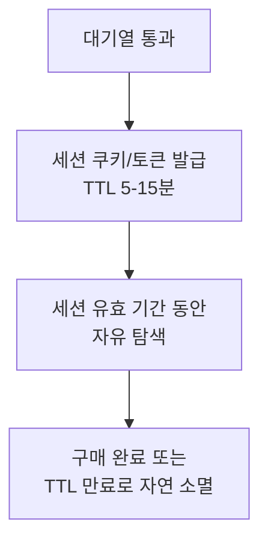
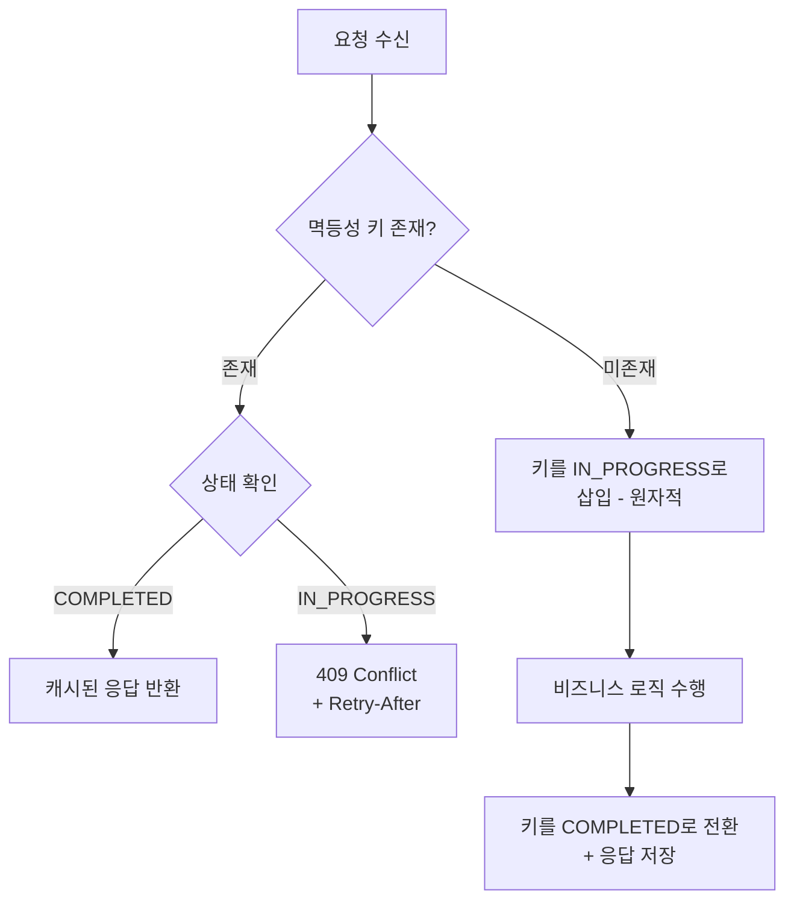
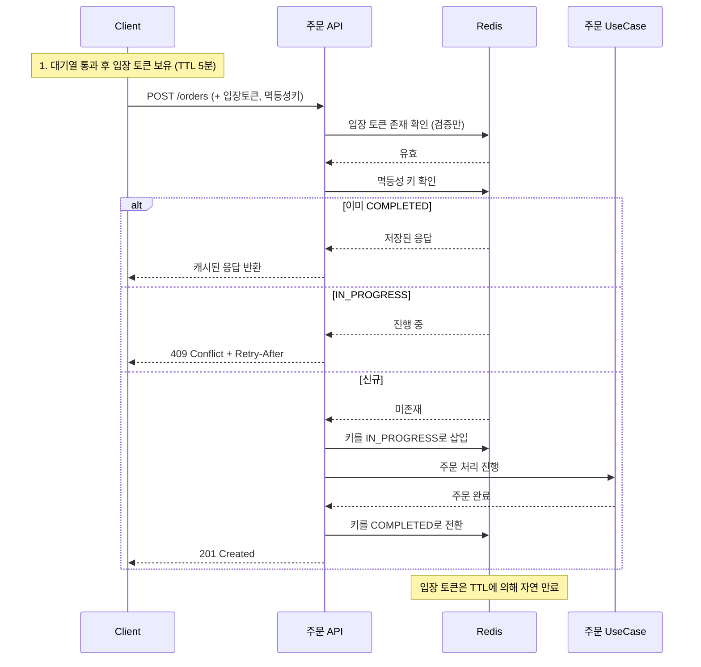

# 대기열 시스템 입장 토큰 소비 시점 리서치

## 목표

e-commerce 대기열 시스템에서 입장 토큰(entry token)의 소비 시점에 대한 실무 패턴, 오픈소스 구현, 한국 대형 서비스 사례, 그리고 멱등성과의 관계를 분석한다.

## 방법론

- Claims extracted: 28
- Claims trimmed: 3 (Low priority supporting claims)
- Claims verified: 6 (High volatility core claims)
- Sources: 14

---

## 핵심 발견

### 1. 실무 표준: "세션 기반 유지" 패턴이 지배적

오픈소스/상용 대기열 시스템(Cloudflare Waiting Room, Queue-it, SeatGeek Room)에서 **토큰은 "소비"되지 않고, TTL 기반 세션으로 유지**되는 패턴이 압도적이다[^1][^2][^3].

핵심 설계 철학: 대기열 토큰의 목적은 "트래픽 제어"이지 "일회성 권한 증명"이 아니다. 사용자가 대기열을 통과한 후에는 일정 시간(session_duration) 동안 자유롭게 사이트를 탐색하고 구매를 완료할 수 있어야 한다.



### 2. 토큰 소비 시점별 비교: 3가지 패턴

| 패턴 | 토큰 소비 시점 | 사용 사례 | 장점 | 단점 |
|------|--------------|----------|------|------|
| **A. API 진입 시 즉시 소비** | 주문 API 호출 시 validateAndConsume | 단순한 선착순 시스템 | 구현 단순, 슬롯 즉시 회수 | 재시도 불가, 네트워크 오류 시 토큰 유실 |
| **B. 비즈니스 완료 후 삭제** | 주문 처리 완료 후 토큰 삭제 | 과제 요구사항 | 안전한 재시도, 비관적 접근 | 슬롯 회수 지연, 악의적 점유 가능 |
| **C. 세션 기반 유지 (TTL 자연 만료)** | 명시적 소비 없음, TTL로 만료 | Cloudflare, Queue-it, SeatGeek | 재시도 안전, UX 우수 | 용량 계획이 정밀해야 함 |

### 3. 오픈소스/상용 시스템의 실제 패턴

#### Cloudflare Waiting Room

Cloudflare는 **암호화된 쿠키 기반 세션** 패턴을 사용한다[^1].

- 대기열 통과 후 암호화 쿠키(bucketId, acceptedAt, lastCheckInTime) 발급
- `session_duration` 파라미터로 세션 유효 시간 설정
- 쿠키는 요청마다 검증되지만 **소비(삭제)되지 않음** -- 유효하면 계속 통과
- 쿠키 만료 시 새로운 사용자로 취급, 대기열이 활성 상태면 다시 줄을 서야 함
- **핵심**: "If the cookie is valid, we let the user through which ensures users who are on the website continue to be able to browse the website"[^1]

확신도: verified_current

#### Queue-it

Queue-it은 **서명된 토큰 + 세션 쿠키** 이중 구조를 사용한다[^2][^4].

- 대기열 통과 시 서명된 Queue-it 토큰과 함께 원래 사이트로 302 리다이렉트
- 서버 측 Connector가 토큰을 검증하고 Queue-it 세션 쿠키를 생성
- 이후 요청은 세션 쿠키로 인증 (토큰 재검증 불필요)
- 토큰은 설정된 기간 동안 유효하며, **개별 API 호출에서 소비되지 않음**
- "The token remains valid for a configured duration, so the visitor can complete their journey navigating the application normally"[^4]

확신도: verified_current

#### SeatGeek Room (자체 구현)

SeatGeek는 **visitor token -> access token 교환** 패턴을 사용한다[^3][^5].

1. 대기열 진입 시 visitor token 발급 (타임스탬프 기반 순서 보장)
2. WebSocket으로 백엔드에 등록, DynamoDB에 타임스탬프 저장
3. Exchanger Lambda가 주기적으로 visitor token을 access token으로 교환
4. access token으로 protected zone(티켓 구매 페이지) 진입
5. **access token은 CDN 레벨에서 검증** -- 백엔드 호출 없이 유효성 확인 가능
6. Leaky bucket으로 protected zone 동시 사용자 수 제어

확신도: verified_current

**SeatGeek의 핵심 설계**: access token은 구매 API 호출 시 소비되는 것이 아니라, leaky bucket의 슬롯을 점유하는 방식이다. 구매 완료 또는 세션 만료 시 슬롯이 자연스럽게 반환된다.

### 4. 한국 대형 서비스 사례

한국 대형 서비스의 대기열 시스템에 대해 공개된 기술 블로그 자료는 제한적이다. 허용된 한국 기술 블로그(네이버 D2, 카카오 테크 등)에서 대기열 토큰 소비 시점에 대한 직접적인 기술 문서는 발견되지 않았다. 다만 간접적으로 추론 가능한 패턴들이 있다.

#### 배달의민족 (우아한형제들)

- Redis Sorted Set 기반 대기열 사용[^6]
- 순서대로 대기번호를 발급하고, 그 순서에 따라 참가열로 이동하거나 토큰 발급
- 직접적인 토큰 소비 시점에 대한 공개 자료 없음

#### 인터파크 티켓 (추론 패턴)

- 대기열 통과 후 별도 dedicated instance에서 예매 처리[^6]
- Redis 분산 락(Redisson)으로 좌석 단위 동시성 제어[^7]
- **주목할 점**: 대기열 토큰과 별개로, 좌석 선점 시 Redis Lock(TTL 기반)을 사용
- Lock 획득 -> 예매 트랜잭션 수행 -> Lock 해제 (트랜잭션 커밋 후)
- 이 패턴에서 대기열 토큰은 "진입 허가"이고, 실제 동시성 제어는 분산 락이 담당

확신도: verified_as_of_2025 (간접 추론)

#### Scalemerce (해외, 유사 e-commerce)

- Upstash Redis Cluster 기반 edge waiting room[^8]
- **15분 세션 윈도우** -- 입장 후 15분간 유효
- "Edge-first queuing kept backend traffic controlled -- only active, admitted users reached APIs"

### 5. 멱등성(Idempotency)과 토큰 소비의 관계

이 질문의 핵심: **토큰을 일찍 소비하면 재시도가 깨지는 문제**

#### Stripe의 멱등성 키 패턴[^9]

Stripe는 멱등성 키를 통해 재시도 안전성을 확보한다:

1. 클라이언트가 고유한 `Idempotency-Key` 생성
2. 서버가 키를 받고 처음이면 처리, 재시도면 저장된 응답 반환
3. **핵심 원칙**: "if the client notices a failure, it retries the request with the same ID, and from there it's up to the server to figure out what to do with it"

이 패턴에서 **멱등성 키와 입장 토큰은 별개의 관심사**다.

#### AWS의 멱등성 API 패턴[^10]

AWS Builder's Library는 더 구체적인 가이드를 제공한다:

- 멱등성 토큰 기록과 비즈니스 연산을 **하나의 ACID 트랜잭션**으로 묶어야 함
- 토큰이 기록되었지만 연산이 미완료인 상태에서 재시도가 오면, 원래 연산을 완료하거나 동등한 응답을 반환해야 함
- "recording the idempotent token and all mutating operations" -- 원자적으로 수행

#### Two-Phase Reservation 패턴[^11]

1. **Phase 1 (예약)**: 멱등성 키를 `IN_PROGRESS` 상태로 원자적 삽입
   - 이미 존재하면 상태 확인: `COMPLETED`면 캐시된 응답 반환, `IN_PROGRESS`면 409 Conflict
2. **Phase 2 (완료)**: 비즈니스 로직 수행 후 `COMPLETED` 상태로 전환



### 6. 권장 패턴: 입장 토큰 + 멱등성 키 분리

위 분석을 종합하면, **실무에서 가장 합리적인 패턴은 입장 토큰과 멱등성 키를 분리하는 것**이다.

#### 패턴 설계

| 토큰 유형 | 목적 | 메커니즘 |
|-----------|------|----------|
| 입장 토큰 | 트래픽 제어 | TTL 기반 세션으로 유지, 명시적 소비 없음 |
| 멱등성 키 | 비즈니스 연산 보호 | 주문 생성 시 원자적으로 기록+처리 |

구체적 흐름:



#### 이 패턴의 장점

| 관점 | 효과 |
|------|------|
| **재시도 안전성** | 네트워크 오류 시 같은 멱등성 키로 재시도 가능. 입장 토큰이 아직 유효하므로 진입도 가능 |
| **UX** | 결제 실패 후 재시도, 뒤로가기 후 재주문 등이 자연스럽게 동작 |
| **슬롯 관리** | 입장 토큰 TTL이 곧 슬롯 유효 기간. 별도의 "완료 후 삭제" 로직 불필요 |
| **관심사 분리** | 트래픽 제어(입장 토큰)와 비즈니스 안전성(멱등성 키)이 독립적 |
| **장애 내성** | 토큰 삭제 실패가 주문 완료를 방해하지 않음 |

### 7. 현재 구현("주문 완료 후 토큰 삭제") 평가

현재 과제의 `validateAndConsume` (검증+삭제를 원자적으로 수행) 패턴과 "주문 완료 후 토큰 삭제" 패턴을 각각 평가한다.

#### validateAndConsume (API 진입 시 소비)

```kotlin
// 현재 Lua 스크립트: 검증 + 삭제를 원자적으로 수행
val token = redis.validateAndConsume(userId)  // 토큰 존재하면 삭제하고 반환
order.create(...)
```

**문제점**:
- 토큰 소비 후 주문 생성이 실패하면 토큰이 이미 사라져 재시도 불가
- 사용자 입장에서 "대기열을 통과했는데 주문이 안 되고, 다시 대기열부터 서야 하는" 최악의 UX
- Cloudflare, Queue-it, SeatGeek 모두 이 패턴을 사용하지 않음

#### 주문 완료 후 토큰 삭제

```kotlin
val token = redis.validate(userId)  // 검증만
order.create(...)                   // 주문 처리
redis.delete(token)                 // 완료 후 삭제
```

**문제점**:
- 주문은 완료되었으나 토큰 삭제에 실패하면 슬롯 누수 (TTL로 결국 회수되긴 함)
- 삭제 전에 같은 토큰으로 중복 주문 가능 (멱등성 키 없으면)
- 토큰 삭제 시점까지 슬롯이 점유됨

#### 권장: validate-only + 멱등성 키

```kotlin
redis.validateOnly(userId)            // 존재 확인만, 삭제하지 않음
val result = orderUseCase.create(
    command = command,
    idempotencyKey = request.idempotencyKey
)
// 토큰은 TTL에 의해 자연 만료 (명시적 삭제 불필요)
```

---

## 분석 및 종합

### 실무 표준 패턴 요약

실무의 대기열 시스템에서 입장 토큰은 **"일회성 티켓"이 아니라 "시간 제한이 있는 세션"**으로 설계된다. 이는 Cloudflare, Queue-it, SeatGeek 등 주요 시스템에서 일관되게 나타나는 패턴이다.

그 이유는 대기열 토큰과 주문 처리가 서로 다른 관심사이기 때문이다:

| 관심사 | 책임 | 메커니즘 |
|--------|------|----------|
| 트래픽 제어 | 동시 접속자 수 제한 | TTL 기반 세션 토큰 |
| 순서 보장 | 선착순 보장 | 타임스탬프 + Sorted Set |
| 비즈니스 안전성 | 중복 주문 방지 | 멱등성 키 |
| 재고 정합성 | 동시성 제어 | 분산 락 또는 DB 락 |

이 4가지를 하나의 "토큰 소비"로 묶으려 하면 오히려 복잡성이 증가하고 장애 시나리오가 늘어난다.

### "주문 생성 UseCase에서 idempotency key 확인 후 소비" 패턴 평가

질문에서 언급한 이 패턴은 실무적으로 **합리적이며, 사실상 권장 패턴에 가장 가깝다**. 다만 "소비"의 의미를 명확히 해야 한다:

- **입장 토큰을 소비(삭제)하는 것은 불필요** -- TTL에 맡기면 됨
- **멱등성 키를 "소비"(IN_PROGRESS로 전환)하는 것은 맞음**
- 즉, `validate(entryToken)` + `consume(idempotencyKey)` -> `execute(orderLogic)` -> `complete(idempotencyKey)`

이 방식은 Stripe, AWS가 권장하는 멱등성 패턴과 일치하며, SeatGeek/Cloudflare가 입장 토큰을 세션으로 유지하는 패턴과도 양립한다.

### 과제 맥락에서의 실용적 판단

과제에서 "주문 완료 후 토큰 삭제"를 요구한다면, 그 의도를 존중하되 다음을 고려할 수 있다:

1. **TTL을 반드시 설정** -- 삭제 실패 시 안전망
2. **멱등성 키를 별도로 관리** -- 토큰 소비와 비즈니스 안전성을 분리
3. **validate와 consume을 분리** -- Lua 스크립트에서 validateAndConsume 대신, validate와 delete를 별도 호출로 분리하고, delete는 주문 완료 후 실행

---

## 결론

1. **실무 표준은 "세션 기반 유지"** -- 토큰을 명시적으로 소비하지 않고 TTL로 만료시키는 것이 Cloudflare, Queue-it, SeatGeek의 공통 패턴이다.

2. **"API 진입 시 즉시 소비"는 안티패턴** -- 재시도 불가, UX 저하, 장애 시나리오 증가. 실무 시스템에서 이 패턴을 사용하는 사례를 찾을 수 없었다.

3. **입장 토큰과 멱등성 키는 분리해야 한다** -- 트래픽 제어(토큰)와 비즈니스 안전성(멱등성 키)은 서로 다른 관심사이며, 하나로 합치면 두 목적 모두 제대로 달성하기 어렵다.

4. **"주문 생성 UseCase에서 idempotency key 확인 후 소비" 패턴은 합리적** -- 다만 여기서 "소비"되는 것은 입장 토큰이 아니라 멱등성 키여야 한다. 입장 토큰은 검증만 하고 TTL에 맡기는 것이 실무 표준이다.

5. **과제 요구사항("주문 완료 후 토큰 삭제")은 실무와 다소 차이가 있으나**, 명시적 삭제로 슬롯을 빠르게 회수하려는 의도 자체는 이해할 수 있다. TTL을 안전망으로 함께 사용하면 실용적인 타협이 된다.

---

## 미해결 질문

- 네이버, 카카오, 인터파크 등 한국 대형 서비스의 대기열 토큰 소비 시점에 대한 직접적인 기술 블로그 공개 자료가 부재하여, 정확한 내부 구현 패턴을 확인할 수 없었다.
- Redis Lua 스크립트에서 "validate-only + 별도 TTL 관리" 패턴의 구체적 성능 비교 데이터는 발견되지 않았다.

---

확신도:

| 항목 | 판정 |
|------|------|
| Cloudflare: 세션 쿠키 기반, 소비하지 않음 | verified_current |
| Queue-it: 서명 토큰 + 세션 쿠키, 소비하지 않음 | verified_current |
| SeatGeek: visitor -> access token 교환, 세션 유지 | verified_current |
| Stripe 멱등성 키 패턴 | verified_current |
| AWS 멱등성 API 패턴 | verified_current |
| 한국 서비스 대기열 패턴 | verified_as_of_2025 (간접 추론) |
| "API 진입 시 즉시 소비"가 안티패턴이라는 주장 | verified_current (반례 미발견) |

---

[^1]: Cloudflare Blog - How Waiting Room Queues (T1) -- https://blog.cloudflare.com/how-waiting-room-queues/ -- 공식 엔지니어링 블로그
[^2]: Queue-it Developer Docs (T1) -- https://queue-it.com/developers/how-queue-it-works/ -- 공식 개발자 문서
[^3]: InfoQ - SeatGeek Virtual Waiting Room (T2) -- https://www.infoq.com/presentations/ticketing-system-virtual-waiting-room/ -- QCon 발표
[^4]: AWS Partner Blog - Queue-it on AWS (T1) -- https://aws.amazon.com/blogs/apn/how-to-manage-peak-traffic-on-aws-using-queue-its-virtual-waiting-room/ -- AWS 공식 블로그
[^5]: System Design Newsletter - Virtual Waiting Room (T2) -- https://newsletter.systemdesign.one/p/virtual-waiting-room -- SeatGeek 아키텍처 분석
[^6]: 인터파크 티켓 시스템 디자인 분석 (T3) -- https://gayuna.github.io/system%20design/system-design-interpark-2/ -- 외부 시스템 설계 분석
[^7]: 티켓팅 서비스 동시성 제어 - Redis 분산 락 (T3) -- https://medium.com/@Jinpyo-An/ -- Redis 분산 락 구현 사례
[^8]: Scalemerce - 1M Fans Derby Ticket (T2) -- https://anonyping.medium.com/1-million-fans-0-downtime-67dab260fd1a -- 실전 대규모 티켓팅 사례
[^9]: Stripe Blog - Designing Robust APIs with Idempotency (T1) -- https://stripe.com/blog/idempotency -- Stripe 공식 블로그
[^10]: AWS Builders Library - Making Retries Safe (T1) -- https://aws.amazon.com/builders-library/making-retries-safe-with-idempotent-APIs/ -- AWS 공식 가이드
[^11]: ByteDoodle - Idempotency in Distributed Systems (T3) -- https://blog.bytedoodle.com/idempotency-in-distributed-transaction-systems/ -- Two-Phase Reservation 패턴
[^12]: Cloudflare Docs - Queueing Methods (T1) -- https://developers.cloudflare.com/waiting-room/reference/queueing-methods/ -- 공식 문서
[^13]: Cloudflare Docs - Waiting Room API (T1) -- https://developers.cloudflare.com/api/resources/waiting_rooms/ -- 공식 API 문서
[^14]: AWS Architecture Blog - SeatGeek DynamoDB Lambda (T1) -- https://aws.amazon.com/blogs/architecture/build-a-virtual-waiting-room-with-amazon-dynamodb-and-aws-lambda-at-seatgeek/ -- AWS 공식 아키텍처 블로그
