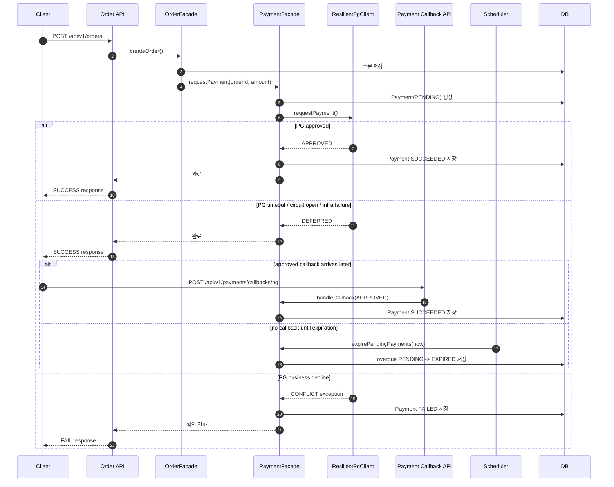

## 📌 Summary
<!--
무엇을/왜 바꿨는지 한눈에 보이게 작성한다.
- 문제(배경) / 목표 / 결과(효과) 중심으로 3~5줄 권장한다.
-->

- 배경: 주문 생성 뒤 결제 요청까지는 연결됐지만, PG 장애를 흡수하는 안전장치와 콜백/만료 같은 사후 보정 흐름, 그리고 이를 검증하는 결제 회귀 시나리오는 없었다.
- 목표: `docs/round6/구현-시나리오.md`의 Phase 4~6 기준에 맞춰 timeout, circuit breaker, fallback, callback, expiration scheduler, 결제 흐름 회귀 테스트를 추가한다.
- 결과: PG 장애 시 결제를 즉시 성공으로 오인하지 않고 `PENDING`으로 남기는 fallback 경로를 만들었고, 이후 callback/expiration으로 상태를 보정할 수 있게 했다. 또한 payment 중심 테스트와 HTTP 시나리오를 추가해 핵심 흐름을 고정했다.

## 🧭 Context & Decision
<!--
설계 의사결정 기록을 남기는 영역이다.
"왜 이렇게 했는가"가 핵심이다.
-->

### 문제 정의
- 현재 동작/제약: `OrderFacade.createOrder()` 이후 `PaymentFacade.requestPayment()`로 결제 요청은 나가지만, PG 지연/장애를 흡수하는 resilience 계층이 없고, callback API 및 expiration scheduler도 없었다.
- 문제(또는 리스크): PG 장애가 바로 주문 생성 흐름 전체 실패로 번지거나, 늦게 도착한 결제 결과를 반영할 수 없어 상태 불일치가 생길 수 있었다.
- 성공 기준(완료 정의): timeout, circuit breaker, fallback이 동작하고, callback/expiration으로 `PENDING` 결제를 후처리할 수 있으며, 성공/실패/timeout/callback/expiration 시나리오를 테스트와 `.http`로 남긴다.

### 선택지와 결정
- 고려한 대안:
  - A: `PaymentFacade` 내부에 resilience, callback, expiration 로직을 모두 직접 넣는다.
  - B: PG 호출은 `ResilientPgClient`로 감싸고, 후처리는 `PaymentFacade` 진입점 + `PaymentV1Controller` + scheduler로 분리한다.
- 최종 결정: B를 선택했다. 기존 주문/결제 책임 경계를 유지하면서 Phase 4~6을 단계적으로 추가하기에 더 안전했다.
- 트레이드오프: `DEFERRED` fallback 상태를 도입해 즉시 실패 전파를 줄였지만, 최종 확정이 callback/expiration 같은 사후 보정 경로에 더 의존하게 됐다. 또한 Docker 기반 통합 환경이 없는 현재 로컬 조건에서는 전체 E2E를 항상 실행할 수 없어 일부 결제 흐름 E2E는 비활성화 상태로 남겼다.
- 추후 개선 여지(있다면): 실제 운영 환경에서는 callback signature 정책 고도화, scheduler 주기 조정, Docker 환경에서의 전체 E2E 상시 실행, Retry 분리 도입을 후속 과제로 가져갈 수 있다.

## 🏗️ Design Overview
<!--
구성 요소와 책임을 간단히 정리한다.
-->

### 변경 범위
- 영향 받는 모듈/도메인: `apps/commerce-api`의 `application/payment`, `domain/payment`, `infrastructure/payment`, `interfaces/api/payment`, `.http/`
- 신규 추가: `ResilientPgClient`, `PaymentResilienceConfig`, `PaymentV1Controller`, `PgCallbackSignatureVerifier`, `PendingPaymentExpirationScheduler`, payment flow E2E/.http 시나리오
- 제거/대체: 기존 `PgClientSimulator` 직접 주입 구조를 resilience wrapper가 감싸는 구조로 확장했다. 기존 결제 요청 흐름 자체를 제거하지는 않았다.

### 주요 컴포넌트 책임
- `ResilientPgClient`: PG 호출에 timeout, circuit breaker, fallback을 적용하고 infra 장애 시 `DEFERRED` 응답으로 변환한다.
- `PaymentFacade`: 결제 생성/성공/실패 처리뿐 아니라 callback 반영과 pending expiration 진입점을 조율한다.
- `PaymentV1Controller`: PG callback 요청을 받고 signature를 검증한 뒤 application 계층으로 전달한다.
- `PgCallbackSignatureVerifier`: callback payload의 HMAC 서명을 생성/검증한다.
- `PendingPaymentExpirationScheduler`: 만료 시각이 지난 `PENDING` 결제를 주기적으로 `EXPIRED`로 전환한다.

## 🔁 Flow Diagram
<!--
가능하면 Mermaid로 작성한다. (시퀀스/플로우 중 택1)
"핵심 경로"를 먼저 그리고, 예외 흐름은 아래에 분리한다.
-->

### Main Flow

