# 🧭 루프팩 BE L2 - Round 4

> RDBMS의 특성을 이해하고 **트랜잭션을 활용해 동시성 문제를 해결**하며 유스케이스를 완성해 나갑니다.

---

## 🎯 Summary

- 동시에 여러 사용자가 주문할 때 재고가 꼬이지 않도록, 트랜잭션과 동시성 제어를 이해하고 해결한다.
- 단순한 `@Transactional` 설정만으로는 막을 수 없는 정합성 문제를 실전 예제를 통해 학습한다.
- 비관적 락과 낙관적 락을 비교하고, 상황에 맞는 전략을 직접 적용해본다.
- 재고 차감 등 복합 도메인 흐름을 유스케이스 수준에서 안전하게 처리하는 방법을 익힌다.
- E2E 테스트를 통해 주문 흐름 전체를 시나리오 단위로 검증하고, 정합성과 실패 처리를 확인한다.

## 📌 Keywords

`트랜잭션(Transaction)` · `동시성 제어(Concurrency Control)` · `Lost Update 문제` · `비관적 락 / 낙관적 락` · `E2E 테스트`

---

# 🧠 Learning

## 🚧 실무에서 겪는 동시성 문제들

> 💬 동시성 문제는 로컬 개발 환경에서는 잘 드러나지 않으며, 실제 운영 환경 또는 부하 테스트 환경에서 발생합니다.

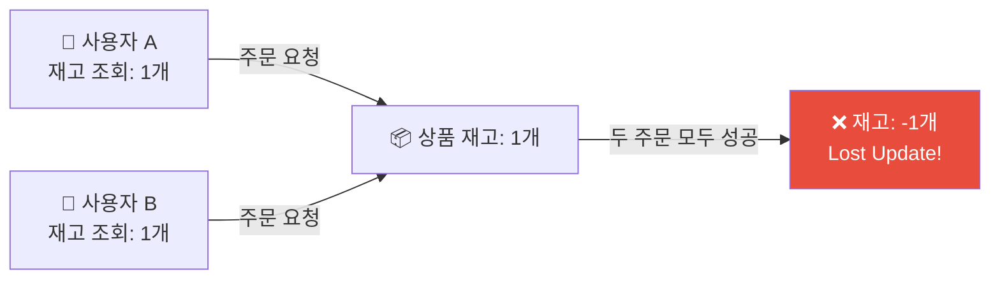

- 동시에 2명의 유저가 같은 상품을 주문했을 때 **재고가 음수**가 되는 현상 (Lost Update)
- **포인트가 부족한** 유저도 주문이 완료되는 사례
- 상품의 재고가 동시에 여러 트랜잭션에서 차감되면서 **정합성이 깨지는** 케이스

---

## 📧 DB Transaction

> 트랜잭션은 일반적으로 **하나의 작업 단위**를 의미합니다.
> **일련의 작업이 하나의 흐름으로 완결되어야 할 때** 사용되며, 실패하면 전체가 취소되어야 하고, 성공하면 모두 반영되어야 한다는 의미를 내포합니다.
>
> **DB Transaction**은 하나의 작업 단위를 구성하는 최소 단위입니다. 여러 작업이 하나의 논리적 흐름으로 묶여야 할 때 사용합니다.

```
e.g.
"유저가 상품을 주문한다"는 작업은 상품 재고 차감, 포인트 차감, 주문 저장 등
여러 작업이 결합된 하나의 트랜잭션입니다.
```

### 🗒️ ACID 원칙

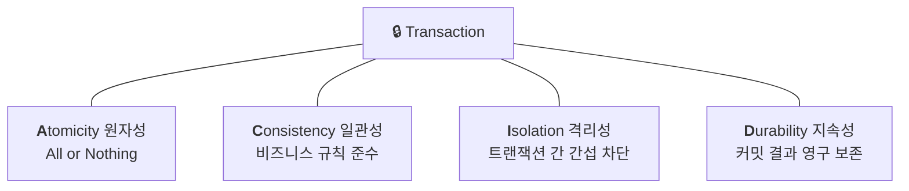

- **Atomicity (원자성):** 작업 전체가 성공하거나, 전부 실패해야 함
- **Consistency (일관성):** 비즈니스 규칙을 위반하지 않아야 함
- **Isolation (격리성):** 동시에 수행되는 트랜잭션들이 서로 간섭하지 않도록 함
- **Durability (지속성):** 성공한 트랜잭션의 결과는 영구 반영됨 (디스크 반영 기준)

### 🗒️ DB 격리 수준 (Isolation Level)

| 격리 수준 | Dirty Read | Non-repeatable Read | Phantom Read |
|-----------|:----------:|:-------------------:|:------------:|
| Read Uncommitted | ✅ 발생함 | ✅ 발생함 | ✅ 발생함 |
| Read Committed | ❌ 방지 | ✅ 발생함 | ✅ 발생함 |
| Repeatable Read | ❌ 방지 | ❌ 방지 | ✅ 발생함 (MySQL InnoDB는 방지함) |
| Serializable | ❌ 방지 | ❌ 방지 | ❌ 방지 |

---

**1️⃣ Dirty Read**

> 다른 트랜잭션이 **아직 커밋하지 않은 데이터를 읽는** 것

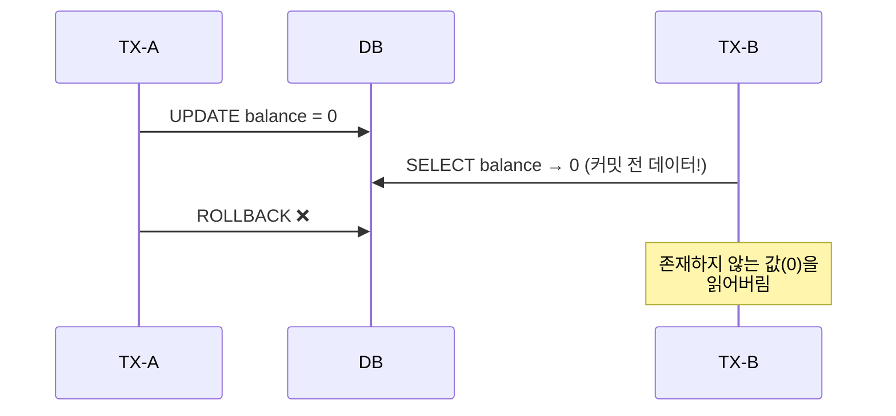

**2️⃣ Non-repeatable Read**

> 같은 쿼리를 같은 트랜잭션 안에서 **두 번 실행했을 때 결과가 달라지는** 것

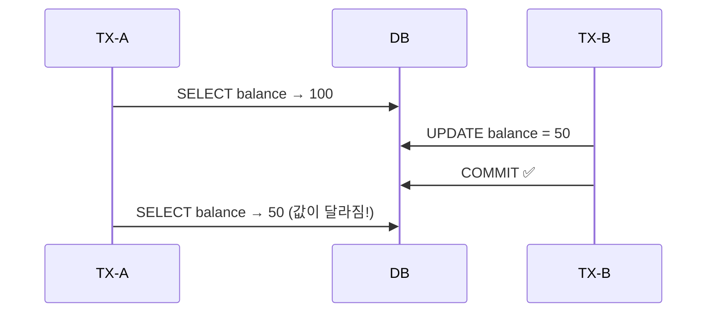

**3️⃣ Phantom Read**

> 조건은 동일하지만, 처음 조회에는 없던 행이 **두 번째 조회에 새롭게 나타나는** 현상
> (예: `WHERE price > 10000` 조건)

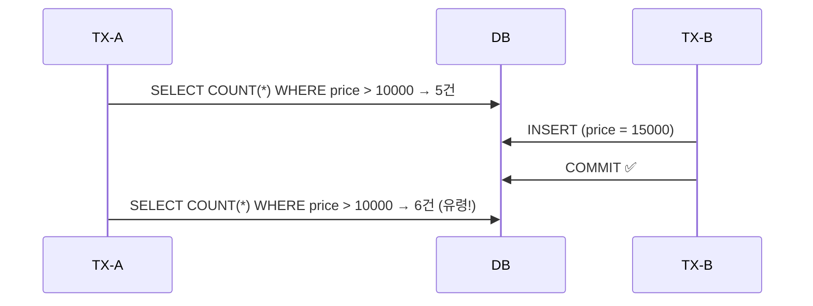

```
e.g.
두 명이 동시에 재고를 차감하는 로직에서 Repeatable Read 이하의 격리 수준이면
중간에 누군가의 차감 결과가 반영돼 의도치 않은 결과가 발생할 수 있습니다.
```

> 🌟 **MySQL InnoDB의 기본 값은 Repeatable Read이며, 대부분의 케이스를 처리할 수 있으나 완전한 동시성 처리는 별도의 락이나 Serializable 수준의 제어가 필요할 수 있습니다.**

---

## 🌱 Spring JPA와 DB

> Spring JPA를 활용해 실무에서 개발을 많이 하고 있습니다.
> **Spring JPA 환경에서 Transactional, Lock** 등 다양한 기본기를 익혀두면 좋아요.

### 🍂 Spring의 `@Transactional`

> Spring에서의 트랜잭션 처리는 `@Transactional` 애너테이션을 통해 선언적으로 적용할 수 있습니다. 이 애너테이션은 내부적으로 AOP 기반 프록시를 통해 트랜잭션 경계를 설정하고, 예외 발생 시 커밋/롤백 여부를 자동으로 결정합니다.

#### ✅ 기본 동작

- `@Transactional`이 붙은 메서드는 트랜잭션 범위 안에서 실행됩니다.
- 해당 범위 내에서 `RuntimeException` 또는 `Error`가 발생하면 자동으로 트랜잭션은 롤백됩니다.
- 정상적으로 메서드가 종료되면 트랜잭션은 커밋됩니다.

> `Error`: 시스템의 비정상적인 상황 (e.g. `StackOverFlowError`)

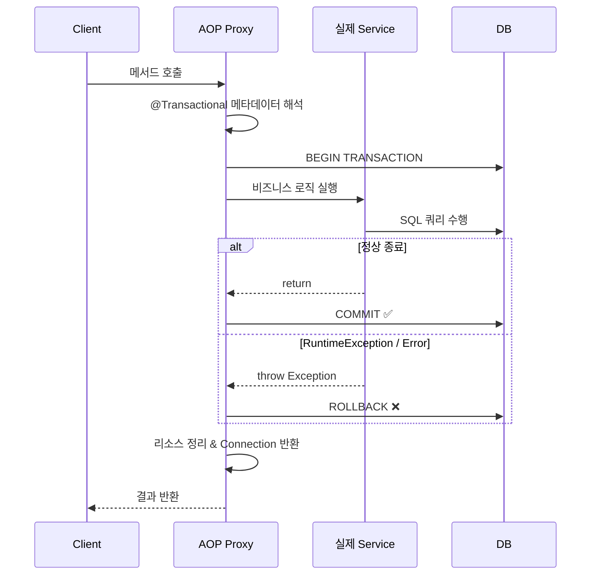

<details>
<summary>💡 <b>@Transactional의 동작 원리 상세</b></summary>

1. **클라이언트 → 프록시 호출**
   스프링 컨테이너에 등록된 트랜잭션 대상 빈을 호출하면 실제 객체가 아닌 **프록시**가 먼저 실행된다.

2. **트랜잭션 속성 해석**
   프록시는 해당 메서드의 `@Transactional` 메타데이터를 읽어 `TransactionDefinition`(전파, 격리수준, readOnly, timeout 등)을 만든다.

3. **트랜잭션 시작/합류 결정**
   `PlatformTransactionManager.getTransaction(def)`을 호출해 다음을 결정한다.
   - **없으면 새로 시작**: REQUIRED, REQUIRES_NEW, NESTED(저장점) 등 조건에 따라 새 트랜잭션 또는 세이브포인트 생성
   - **있으면 합류/중단/예외**: REQUIRED는 합류, NOT_SUPPORTED는 일시 중단, MANDATORY는 없으면 예외, NEVER는 있으면 예외

4. **비즈니스 로직 실행**
   로직 내부에서 같은 스레드, 같은 트랜잭션 컨텍스트에 바인딩된 Connection/EntityManager를 사용한다.
   - JPA의 경우 `JpaTransactionManager`가 **영속성 컨텍스트를 트랜잭션 범위와 동기화**하며, flush 시점/방식을 관리한다.

5. **정상 종료 → 커밋**
   예외 없이 반환되면 `TransactionManager.commit(status)`를 호출한다.
   - 커밋 전에 등록된 `TransactionSynchronization` 콜백(예: `@TransactionalEventListener(phase = AFTER_COMMIT)`)이 실행된다.

6. **예외 발생 → 롤백 판단**
   예외가 발생하면 **롤백 규칙**을 적용해 rollback 또는 commit을 결정한다.

7. **정리(clean up)**
   스레드 로컬에 바인딩된 리소스/동기화를 해제하고, Connection/EM을 풀에 반환한다.

</details>

<details>
<summary>💡 <b>@Transactional은 모든 서비스에 붙여야 할까?</b></summary>

많은 생각하지 않고 `@Transactional`을 Service에 모두 붙이는 경우가 있다. 문제는 없을까?

참고: [카카오페이 기술 블로그 - JPA와 @Transactional](https://tech.kakaopay.com/post/jpa-transactional-bri/#set_option%EC%9D%80-%EB%AC%B4%EC%97%87%EC%9D%B8%EA%B0%80)

</details>

#### ⚠️ 롤백 조건

| 예외 타입 | 기본 동작 | 수동 설정 |
|-----------|----------|----------|
| `RuntimeException` | 자동 롤백 | - |
| `Checked Exception` (e.g. `IOException`) | 커밋됨 | `rollbackFor` 속성 지정 필요 |
| `Error` (e.g. `OutOfMemoryError`) | 롤백 보장 아님 | 비권장: 시스템 종료 가능성 높음 |

```kotlin
@Transactional(rollbackFor = [IOException::class])
fun doSomething() { ... }
```

#### 🔍 트랜잭션 전파 (Propagation)

> `@Transactional`은 전파 방식도 설정할 수 있습니다.
> 여러 트랜잭션이 중첩되거나 계층적으로 호출되는 구조에서 중요한 설정입니다.

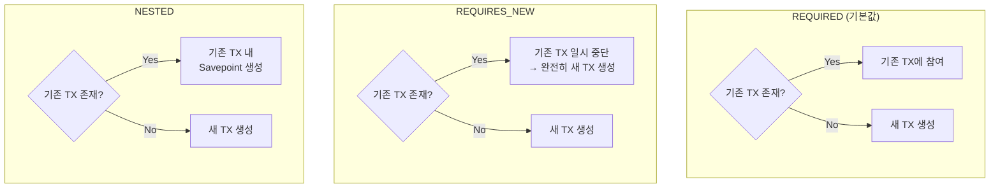

| 전파 방식 | 설명 |
|-----------|------|
| `REQUIRED` (default) | 기존 트랜잭션이 있으면 참여, 없으면 새로 생성 |
| `REQUIRES_NEW` | 기존 트랜잭션을 잠시 중단하고 새 트랜잭션 생성 |
| `NESTED` | 기존 트랜잭션 내에서 저장점(Savepoint)을 두고 새로운 트랜잭션 생성 |

> 💡 PG 연동, 외부 API 호출 등은 `REQUIRES_NEW`로 트랜잭션을 분리해 전체 롤백의 영향이 가지 않도록 제어할 수도 있습니다.

#### 🧱 트랜잭션 격리 수준 설정

기본적으로 DB 설정을 따르지만, Spring에서도 명시적으로 설정할 수 있습니다:

```kotlin
@Transactional(isolation = Isolation.SERIALIZABLE)
fun doSomething() { ... }
```

#### 🚧 기타 주의사항

- `@Transactional(readOnly = true)`는 쓰기 작업을 무시하거나 예외를 발생시킬 수 있습니다.
  - 여전히 **명시적 DML(JPQL/네이티브 UPDATE/DELETE)**, 혹은 **명시적 flush()** 로 쓰기를 발생시킬 수 있습니다.
  - DB가 `Connection#setReadOnly(true)`를 **강제**하지 않는 한, 절대적 차단은 아닙니다.
- 내부 메서드 호출은 프록시를 타지 않기 때문에 **같은 클래스 내에서의 호출에는 트랜잭션이 적용되지 않습니다.** (keyword → `self-invocation`)

<details>
<summary>📄 <b>Self-invocation 예제 코드 (Java)</b></summary>

```java
@Service
@RequiredArgsConstructor
public class WrongService {

    // 외부에서 호출되는 메서드(트랜잭션 없음)
    public void outer() {
        logTx("outer");        // ❌ false
        inner();               // 같은 클래스 내부 호출 → 프록시 미통과
    }

    // 트랜잭션 적용을 기대하는 내부 메서드
    @Transactional
    public void inner() {
        logTx("inner");        // ❌ 여기도 false (self-invocation)
        // DB 작업 …
    }

    private void logTx(String point) {
        boolean active = TransactionSynchronizationManager
            .isActualTransactionActive();
        log.info("[{}] txActive={}", point, active);
    }
}
```

</details>

> 💡 트랜잭션 경계가 잘못 설정되면, 실패한 요청이 커밋되거나 롤백되지 않는 치명적인 문제가 발생할 수 있습니다. 메서드 위치, 호출 방식, 예외 처리 방식까지 함께 고려해야 합니다.

---

### 🔒 JPA에서의 Lock 전략

락은 동시성 문제를 방지하기 위한 대표적인 수단이며, **공유 자원**에 여러 사용자가 동시에 접근할 때 그 정합성을 보장하기 위해 사용됩니다.

JPA에서는 두 가지 종류의 락 전략을 제공합니다. 단순히 **"충돌이 많다/적다"** 로 구분하기보다는 **"누가 성공하고, 나머지는 실패하게 둘 것인가?"** 또는 **"모두가 기다리게 할 것인가?"** 라는 설계 관점으로 접근하는 것이 더 실용적입니다.

> 🔑 **공유 자원**이란 동일한 테이블의 동일한 레코드, 혹은 동일한 비즈니스 대상에 여러 트랜잭션이 접근할 때 문제가 생길 수 있는 자원입니다.
> e.g. 재고 수량, 좌석, 포인트 등

| 전략 | 장점 | 단점 | 적합한 상황 |
|------|------|------|------------|
| **🙂 낙관적 락** | 높은 성능, 락 없음 | 충돌 발생 시 예외 처리 필요 | 조회/수정 빈도가 낮은 대상 |
| **😠 비관적 락** | 안정적, 정합성 보장 | 데드락 위험, 성능 저하 | 정합성을 지키면서 연산해야 하는 대상 |

#### 🙂 낙관적 락 (Optimistic Lock)

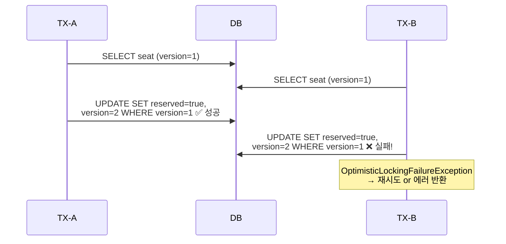

- 동시 접근을 허용하고, 트랜잭션 종료 시점에 버전 필드(`@Version`)를 비교해 충돌 여부를 감지함
  - → 실제 DB 컬럼에 의존성을 가짐
- 충돌 발생 시 예외를 던지고 롤백하거나 재시도 로직이 필요함
- 예시: 이미 선택된 좌석에 대해서는 한 명만 최종 저장에 성공하고, 나머지는 `OptimisticLockingFailureException`으로 실패함
- 즉, **충돌을 허용하되, 오직 한 명만 성공하도록 설계**하고 싶을 때 더 적합함

```kotlin
@Entity
class Seat(
    @Id val id: Long,
    val number: String,
    val isReserved: Boolean,
    @Version val version: Long? = null,
)
```

> ✅ 낙관적 락은 **"충돌이 없을 것이다"** 라는 가정보다, **"충돌해도 실패시켜도 된다"** 는 철학에 더 가깝습니다.
> 즉, **"경쟁자 중 1명만 성공하고 나머지는 실패"** 라는 설계를 구현할 땐 오히려 낙관적 락이 자연스럽습니다.

#### 😠 비관적 락 (Pessimistic Lock)

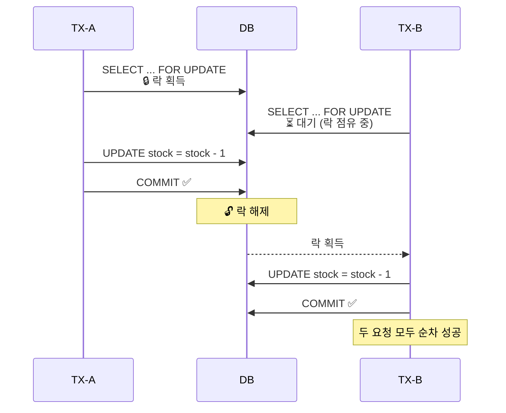

- 데이터를 읽는 순간 DB에 락을 걸고, **다른 트랜잭션이 접근하지 못하게** 막음
- 구현: `@Lock(PESSIMISTIC_WRITE)` (DB Query: `SELECT ... FOR UPDATE`)
- 트랜잭션이 끝날 때까지 해당 데이터는 수정 불가능 상태 → **공유 자원의 상태를 선점적으로 보호할 때 적합**
- 예시: 동시에 같은 좌석을 예매할 때, 한 사용자가 먼저 락을 잡으면 나머지 사용자는 대기하거나 예외 발생

```kotlin
@Lock(LockModeType.PESSIMISTIC_WRITE)
@Query("SELECT s FROM Seat s WHERE s.id = :id")
fun findSeatWithLock(@Param("id") id: Long): Seat
```

#### 🆚 두 전략 비교 요약

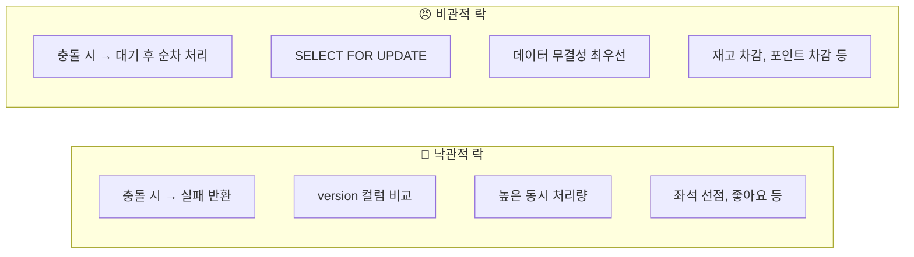

---

## 🧪 동시성 테스트 작성 가이드

동시성 문제는 테스트 코드 없이 눈으로는 절대 발견하기 어렵습니다. 실제 운영 환경에서 문제가 드러나기 전에, 다음 기준을 바탕으로 동시성 테스트를 구성해봅시다.

### 🎯 동시성 테스트의 핵심 목표

- 동시에 여러 요청이 들어올 때 정합성이 깨지지 않는지 확인
- 비관적 락 또는 낙관적 락 전략이 정상 동작하는지 검증
- 예외 상황에서 전체 트랜잭션이 제대로 롤백되는지 확인

### 🗒️ 작성 방법

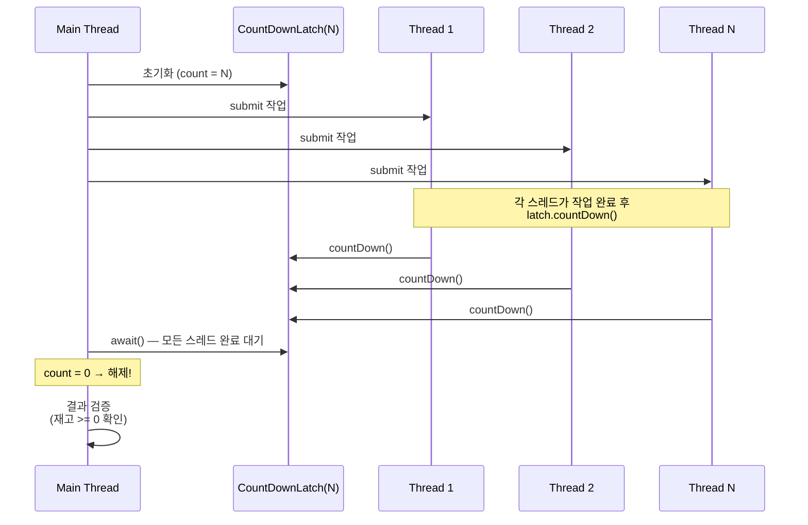

- `CountDownLatch` + `ExecutorService` 또는 `CompletableFuture`로 다수 스레드 동시 실행
- 테스트 대상 서비스에서 `@Transactional` 및 락 전략 포함
- 성공한 요청의 수, 실패한 요청의 수, DB의 최종 상태를 모두 검증

### Java + JUnit5 예제

```java
@DisplayName("동시에 주문해도 재고가 정상적으로 차감된다.")
@Test
void concurrencyTest_stockShouldBeProperlyDecreasedWhenOrdersCreated()
        throws InterruptedException {
    int threadCount = 10;
    ExecutorService executor = Executors.newFixedThreadPool(threadCount);
    CountDownLatch latch = new CountDownLatch(threadCount);

    for (int i = 0; i < threadCount; i++) {
        executor.submit(() -> {
            try {
                orderService.placeOrder(1L, 100L, 1);
            } catch (Exception e) {
                System.out.println("실패: " + e.getMessage());
            } finally {
                latch.countDown();
            }
        });
    }

    latch.await();

    Product product = productRepository.findById(100L).orElseThrow();
    assertThat(product.getStock()).isGreaterThanOrEqualTo(0);
}
```

### Kotlin + JUnit5 예제

```kotlin
@DisplayName("동시에 10명이 주문할 때 재고가 음수로 내려가지 않아야 한다")
@Test
fun concurrencyTest_stockShouldBeProperlyDecreasedWhenOrdersCreated() {
    val numberOfThreads = 10
    val latch = CountDownLatch(numberOfThreads)
    val executor = Executors.newFixedThreadPool(numberOfThreads)

    repeat(numberOfThreads) {
        executor.submit {
            try {
                orderService.placeOrder(userId = 1L, productId = 100L, quantity = 1)
            } catch (e: Exception) {
                println("실패: ${e.message}")
            } finally {
                latch.countDown()
            }
        }
    }

    latch.await()

    val product = productRepository.findById(100L).get()
    assertThat(product.stock).isGreaterThanOrEqualTo(0)
}
```

---

## 📚 References

| 구분 | 링크 |
|------|------|
| 🔢 Spring Transactional | [Spring - 트랜잭션 관리](https://docs.spring.io/spring-framework/reference/data-access/transaction/declarative.html) |
| ✍️ JPA 더티체킹 | [기억보단 기록을 - JPA 더티체킹](https://jojoldu.tistory.com/415) |
| 🧪 MySQL 트랜잭션 격리 레벨 | [MySQL - 트랜잭셔널 격리 레벨](https://dev.mysql.com/doc/refman/8.0/en/innodb-transaction-isolation-levels.html) |
| 🧵 JPA 트랜잭션 격리, 전파 | [Baeldung - JPA 트랜잭션 전파와 격리](https://www.baeldung.com/spring-transactional-propagation-isolation) |
| 🧰 JPA 낙관적 락 | [Baeldung - JPA 낙관적 락](https://www.baeldung.com/jpa-optimistic-locking) |
| ⚙️ 멀티 스레드 코딩 | [Baeldung - Java 멀티 스레드 코드](https://www.baeldung.com/java-testing-multithreaded) |

> JPA의 EntityManager, Dirty Checking 등 다양한 특성을 잘 이해하는 것 또한 중요합니다.
> 아직 익숙하지 않다면, 검색이나 AI 등을 활용해 꼭 기본기는 학습하시기를 권장합니다.

---

# 📝 Round 4 Quests

## 🤖 트랜잭션 분석 Skills 작성해보기

트랜잭션 Skills를 작성하고, 구현된 기능들에 대해 지속적으로 점검해 나가며, 개선합니다.

<details>
<summary>📄 <b>작성 예시 (~/.claude/skills/analyze-query/SKILL.md)</b></summary>

```markdown
---
name: analyze-query
description:
  대상이 되는 코드 범위를 탐색하고, Spring @Transactional, JPA, QueryDSL 기반의
  코드에 대해 트랜잭션 범위, 영속성 컨텍스트, 쿼리 실행 시점 관점에서 분석한다.

  특히 다음을 중점적으로 점검한다.
  - 트랜잭션이 불필요하게 크게 잡혀 있지는 않은지
  - 조회/쓰기 로직이 하나의 트랜잭션에 혼합되어 있지는 않은지
  - JPA의 지연 로딩, flush 타이밍, 변경 감지로 인해
    의도치 않은 쿼리 또는 락이 발생할 가능성은 없는지

  단순한 정답 제시가 아니라, 현재 구조의 의도와 trade-off를 드러내고
  개선 가능 지점을 선택적으로 판단할 수 있도록 돕는다.
---

### 📌 Analysis Scope
이 스킬은 아래 대상에 대해 분석한다.
- @Transactional 이 선언된 클래스 / 메서드
- Service / Facade / Application Layer 코드
- JPA Entity, Repository, QueryDSL 사용 코드
- 하나의 유즈케이스(요청 흐름) 단위
> 컨트롤러 → 서비스 → 레포지토리 전체 흐름을 기준으로 분석하며
> 특정 메서드만 떼어내어 판단하지 않는다.

### 🔍 Analysis Checklist

#### 1. Transaction Boundary 분석
다음을 순서대로 확인한다.
- 트랜잭션 시작 지점은 어디인가? (Service / Facade / 그 외?)
- 트랜잭션이 실제로 필요한 작업은? (상태 변경 vs 단순 조회)
- 트랜잭션 내부에서 수행되는 작업 나열 (외부 API, 복잡한 조회, 반복문 등)

**출력 예시:**
  OrderFacade.placeOrder()
    ├─ 유저 검증
    ├─ 상품 조회
    ├─ 주문 생성
    ├─ 결제 요청
    └─ 재고 차감

  트랜잭션이 필요한 핵심 작업: 주문 생성, 재고 차감

#### 2. 불필요하게 큰 트랜잭션 식별
- Controller에서 Transactional이 사용되고 있음
- 읽기 전용 로직이 쓰기 트랜잭션에 포함됨
- 외부 시스템 호출이 트랜잭션 내부에 포함됨
- 트랜잭션 내부에서 대량 조회 / 복잡한 QueryDSL 실행
- 상태 변경 이후에도 트랜잭션이 길게 유지됨

#### 3. JPA / 영속성 컨텍스트 관점 분석
- Entity 변경이 언제 flush 되는지
- 조회용 Entity가 변경 감지 대상이 되는지
- 지연 로딩으로 인해 트랜잭션 후반에 쿼리가 발생할 가능성
- @Transactional(readOnly = true) 미적용 여부

#### 4. Improvement Proposal (선택적 제안)
- 트랜잭션 분리 (조회 → 쓰기 분리)
- @Transactional(readOnly = true) 적용
- DTO Projection (읽기 전용 모델) 도입
- 외부 호출 / 이벤트 발행을 트랜잭션 외부로 이동
```

</details>

---

## 💻 Implementation Quest

> 주문 시, 재고/포인트/쿠폰의 정합성을 트랜잭션으로 보장하고, 동시성 이슈를 제어합니다.

> 🎯 **Must-Have** (이번 주에 무조건 가져가야 할 것)
> - DB 트랜잭션
> - Lock
> - 동시성 테스트
> - 쿠폰 개념

---

### 🎟 쿠폰 (Coupons)

- 주문 시에 쿠폰을 이용해 사용자가 소유한 쿠폰을 적용해 할인받을 수 있도록 합니다.
- 쿠폰은 **정액, 정률 쿠폰이 존재**하며 **재사용이 불가능**합니다.
- 존재하지 않거나 사용 불가능한 쿠폰으로 요청 시, 주문은 실패해야 합니다.

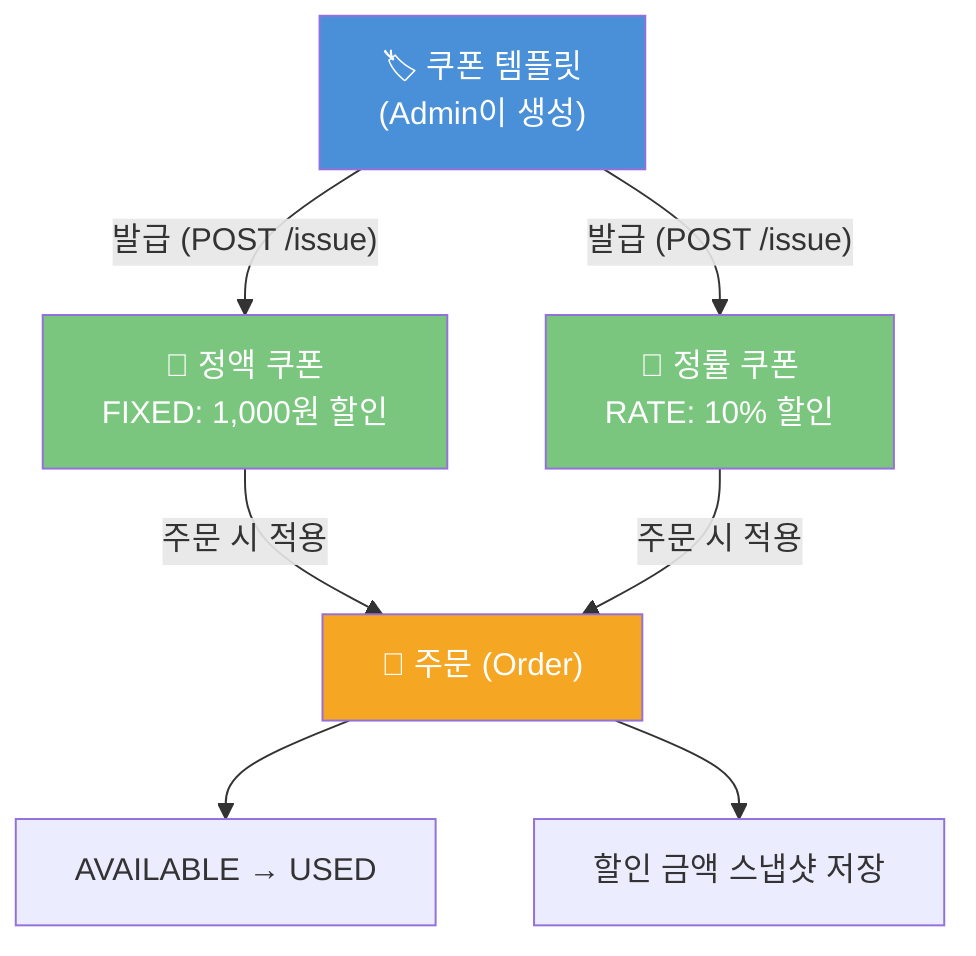

#### 대고객 API

| METHOD | URI | user_required | 설명 |
|--------|-----|:-------------:|------|
| POST | `/api/v1/coupons/{couponId}/issue` | O | 쿠폰 발급 요청 |
| GET | `/api/v1/users/me/coupons` | O | 내 쿠폰 목록 조회 |

> 쿠폰 목록 조회 시 사용 가능한 쿠폰(`AVAILABLE`) / 사용 완료(`USED`) / 만료(`EXPIRED`) 상태를 함께 반환합니다.

#### 🏷 쿠폰 ADMIN

| METHOD | URI | ldap_required | 설명 |
|--------|-----|:------------:|------|
| GET | `/api-admin/v1/coupons?page=0&size=20` | O | 쿠폰 템플릿 목록 조회 |
| GET | `/api-admin/v1/coupons/{couponId}` | O | 쿠폰 템플릿 상세 조회 |
| POST | `/api-admin/v1/coupons` | O | 쿠폰 템플릿 등록 (FIXED / RATE 타입 지정) |
| PUT | `/api-admin/v1/coupons/{couponId}` | O | 쿠폰 템플릿 수정 |
| DELETE | `/api-admin/v1/coupons/{couponId}` | O | 쿠폰 템플릿 삭제 |
| GET | `/api-admin/v1/coupons/{couponId}/issues?page=0&size=20` | O | 특정 쿠폰의 발급 내역 조회 |

**쿠폰 템플릿 등록 요청 예시:**

```json
{
  "name": "신규가입 10% 할인",
  "type": "RATE",
  "value": 10,
  "minOrderAmount": 10000,
  "expiredAt": "2026-12-31T23:59:59"
}
```

#### 🧾 주문 API 변경사항

**요청 예시 (쿠폰 적용):**

```json
{
  "items": [
    { "productId": 1, "quantity": 2 },
    { "productId": 3, "quantity": 1 }
  ],
  "couponId": 42
}
```

> **쿠폰 적용 규칙**
> - 쿠폰은 주문 1건당 1장만 적용 가능합니다.
> - 존재하지 않거나 이미 사용된 쿠폰, 만료된 쿠폰, 타 유저 소유 쿠폰으로 요청 시 주문은 실패합니다.
> - 주문 성공 시 해당 쿠폰은 즉시 `USED` 상태로 변경되며 재사용이 불가합니다.
> - 주문 정보 스냅샷에는 **쿠폰 적용 전 금액, 할인 금액, 최종 결제 금액**이 모두 포함되어야 합니다.

---

### 📋 과제 정보

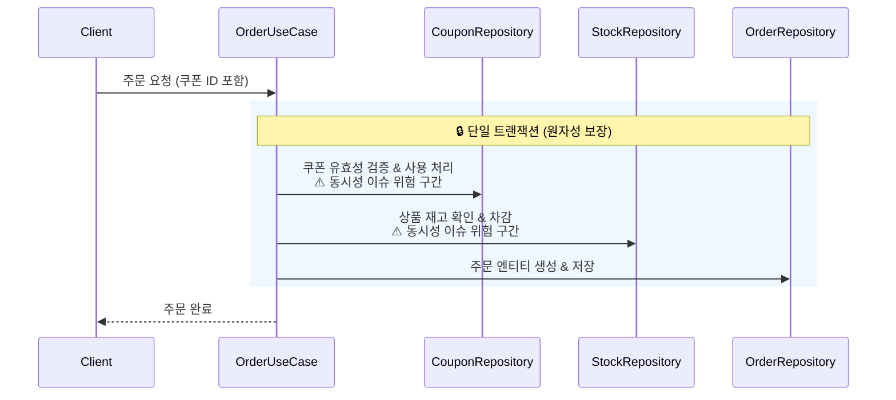

- 주문 API에 트랜잭션을 적용하고, 재고 / 쿠폰 / 주문 도메인의 정합성을 보장합니다.
- 동시성 이슈(Lost Update)가 발생하지 않도록 낙관적 락 또는 비관적 락을 적용합니다.
- 주요 구현 대상은 Application Layer (혹은 OrderFacade 등)에서의 트랜잭션 처리입니다.
- 동시성 이슈가 발생할 수 있는 기능에 대한 테스트가 모두 성공해야 합니다.

**주문 처리 흐름 예시:**

```
1. 주문 요청
2. "주문을 위한 처리" (순서 무관)
    - 쿠폰 유효성 검증 및 사용 처리  // 동시성 이슈 위험 구간
    - 상품 재고 확인 및 차감          // 동시성 이슈 위험 구간
3. 주문 엔티티 생성 및 저장
```

### 🚀 구현 보강

- 모든 API가 요구사항 기반으로 동작해야 합니다.
- 미비한 구현에 대해 모두 완성해주세요.

---

## ✅ Checklist

### 🗞️ Coupon 도메인

- [ ] 쿠폰은 사용자가 소유하고 있으며, 이미 사용된 쿠폰은 사용할 수 없어야 한다.
- [ ] 쿠폰 종류는 정액 / 정률로 구분되며, 각 적용 로직을 구현하였다.
- [ ] 각 발급된 쿠폰은 최대 한번만 사용될 수 있다.

### 🧾 주문

- [ ] 주문 전체 흐름에 대해 원자성이 보장되어야 한다.
- [ ] 사용 불가능하거나 존재하지 않는 쿠폰일 경우 주문은 실패해야 한다.
- [ ] 재고가 존재하지 않거나 부족할 경우 주문은 실패해야 한다.
- [ ] 쿠폰, 재고, 포인트 처리 등 하나라도 작업이 실패하면 모두 롤백처리되어야 한다.
- [ ] 주문 성공 시, 모든 처리는 정상 반영되어야 한다.

### 🧪 동시성 테스트

- [ ] 동일한 상품에 대해 여러명이 좋아요/싫어요를 요청해도, 상품의 좋아요 수가 정상 반영되어야 한다.
- [ ] 동일한 쿠폰으로 여러 기기에서 동시에 주문해도, 쿠폰은 단 한번만 사용되어야 한다.
- [ ] 동일한 상품에 대해 여러 주문이 동시에 요청되어도, 재고가 정상적으로 차감되어야 한다.

---

### 📡 과제 집중할 점

> **모든 기능의 동작을 개발한 후에 동시성, 멱등성, 일관성, 느린 조회, 동시 주문 등 실제 서비스에서 발생하는 문제들을 해결하게 됩니다.**
>
> **낙관적 락(Optimistic Lock)** 또는 **비관적 락(Pessimistic Lock)** 중 각 도메인의 특성에 맞는 전략을 선택하여 적용하세요. Application Layer(혹은 OrderFacade)에서의 트랜잭션 경계 설계가 핵심입니다.

---

## ✍️ Technical Writing Quest

> 이번 주에 학습한 내용, 과제 진행을 되돌아보며
> **"내가 어떤 판단을 하고 왜 그렇게 구현했는지"** 를 글로 정리해봅니다.
>
> **좋은 블로그 글은 내가 겪은 문제를, 타인도 공감할 수 있게 정리한 글입니다.**
>
> 이 글은 단순 과제가 아니라, **향후 이직에 도움이 될 수 있는 포트폴리오**가 될 수 있어요.

### 📚 작성 기준

| 항목 | 설명 |
|------|------|
| **형식** | 블로그 |
| **길이** | 제한 없음, 단 꼭 **1줄 요약 (TL;DR)** 을 포함해 주세요 |
| **포인트** | "무엇을 했다" 보다 **"왜 그렇게 판단했는가"** 중심 |
| **예시 포함** | 코드 비교, 흐름도, 리팩토링 전후 예시 등 자유롭게 |
| **톤** | 실력은 보이지만, 자만하지 않고, **고민이 읽히는 글** |

### ✨ 좋은 톤은 이런 느낌이에요

> 내가 겪은 실전적 고민을 다른 개발자도 공감할 수 있게 풀어내자

| 특징 | 예시 |
|------|------|
| 🤔 내 언어로 설명한 개념 | Stub과 Mock의 차이를 이번 주문 테스트에서 처음 실감했다 |
| 💭 판단 흐름이 드러나는 글 | 처음엔 도메인을 나누지 않았는데, 테스트가 어려워지며 분리했다 |
| 📐 정보 나열보다 인사이트 중심 | 테스트는 작성했지만, 구조는 만족스럽지 않다. 다음엔… |

### ❌ 피해야 할 스타일

| 예시 | 이유 |
|------|------|
| 많이 부족했고, 반성합니다… | 회고가 아니라 일기처럼 보입니다 |
| Stub은 응답을 지정하고… | 내 생각이 아닌 요약문처럼 보입니다 |
| 테스트가 진리다 | 너무 단정적이거나 오만해 보입니다 |

### 🎯 Feature Suggestions

- 트랜잭션이면 안전한 줄 알았다 → rollback 안 되는 경우 실험
- 쿠폰 사용에 대한 처리는 어떤 락이 적절할까?
- 스투시 반팔티를 10명이 동시에 주문했을 때 발생한 일
- 비관적 락 vs 낙관적 락, 선택 기준은 무엇이었나?
- 브랜드에서 전화가 왔다, "우리 상품 좋아요가 한번에 수십개씩 빠져요!"

---

## 🌟 Next Week Preview

> 다음 주에는 **"상품 조회가 느리다"** 는 문제를 해결해보며 인덱스, 캐시, 조회 최적화를 위한 실무 전략들을 다룹니다.
> 단순한 조회 속도 개선을 넘어, **읽기 성능 병목을 추적하고 구조적으로 개선하는 방법**을 학습합니다.

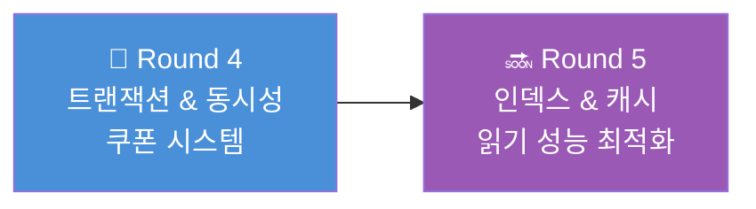
