# 브랜드 & 상품 Admin 시퀀스 다이어그램

## 개요

이 문서는 브랜드 & 상품 Admin API의 처리 흐름을 Mermaid 시퀀스 다이어그램으로 표현합니다.
각 API 엔드포인트별로 성공 흐름과 에러 흐름을 포함합니다.

**대상 API 엔드포인트:**

| # | METHOD | URI | 설명 |
|---|--------|-----|------|
| 1 | POST | `/api-admin/v1/brands` | 브랜드 등록 |
| 2 | GET | `/api-admin/v1/brands?page=0&size=20` | 브랜드 목록 조회 |
| 3 | GET | `/api-admin/v1/brands/{brandId}` | 브랜드 상세 조회 |
| 4 | PUT | `/api-admin/v1/brands/{brandId}` | 브랜드 정보 수정 |
| 5 | DELETE | `/api-admin/v1/brands/{brandId}` | 브랜드 삭제 |
| 6 | POST | `/api-admin/v1/products` | 상품 등록 |
| 7 | GET | `/api-admin/v1/products?page=0&size=20` | 상품 목록 조회 |
| 8 | GET | `/api-admin/v1/products/{productId}` | 상품 상세 조회 |
| 9 | PUT | `/api-admin/v1/products/{productId}` | 상품 정보 수정 |
| 10 | DELETE | `/api-admin/v1/products/{productId}` | 상품 삭제 |

---

## 1. 브랜드 등록 - 성공 흐름

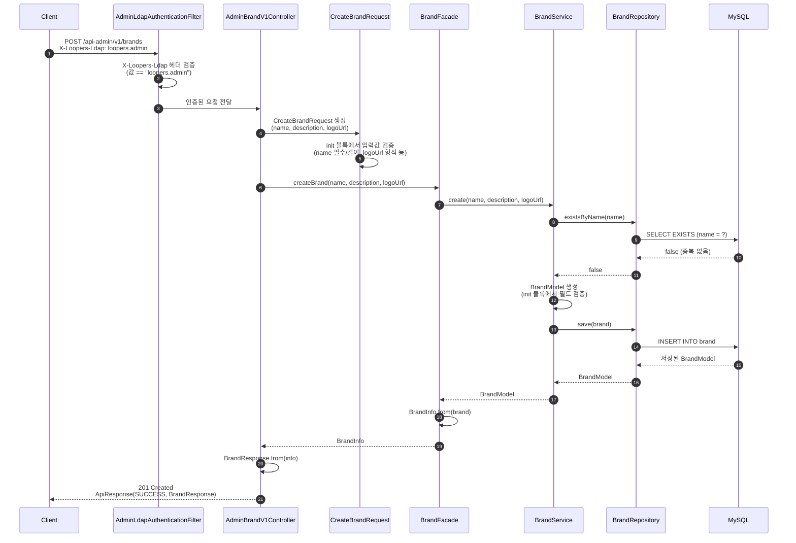
```mermaid
sequenceDiagram
    autonumber
    participant Client
    participant Filter as AdminLdapAuthenticationFilter
    participant Controller as AdminBrandV1Controller
    participant DTO as CreateBrandRequest
    participant Facade as BrandFacade
    participant Service as BrandService
    participant Repository as BrandRepository
    participant DB as MySQL

    Client->>Filter: POST /api-admin/v1/brands<br/>X-Loopers-Ldap: loopers.admin
    Filter->>Filter: X-Loopers-Ldap 헤더 검증<br/>(값 == "loopers.admin")
    Filter->>Controller: 인증된 요청 전달

    Controller->>DTO: CreateBrandRequest 생성<br/>(name, description, logoUrl)
    DTO->>DTO: init 블록에서 입력값 검증<br/>(name 필수/길이, logoUrl 형식 등)

    Controller->>Facade: createBrand(name, description, logoUrl)
    Facade->>Service: create(name, description, logoUrl)
    Service->>Repository: existsByName(name)
    Repository->>DB: SELECT EXISTS (name = ?)
    DB-->>Repository: false (중복 없음)
    Repository-->>Service: false

    Service->>Service: BrandModel 생성<br/>(init 블록에서 필드 검증)
    Service->>Repository: save(brand)
    Repository->>DB: INSERT INTO brand
    DB-->>Repository: 저장된 BrandModel
    Repository-->>Service: BrandModel

    Service-->>Facade: BrandModel
    Facade->>Facade: BrandInfo.from(brand)
    Facade-->>Controller: BrandInfo

    Controller->>Controller: BrandResponse.from(info)
    Controller-->>Client: 201 Created<br/>ApiResponse(SUCCESS, BrandResponse)
```

### 흐름 설명
1. 어드민이 브랜드 등록 요청을 보냅니다.
2. `AdminLdapAuthenticationFilter`가 `X-Loopers-Ldap` 헤더 값을 검증합니다.
3. `CreateBrandRequest` DTO의 init 블록에서 브랜드명 필수 여부, 길이 제한, 로고 URL 형식 등을 검증합니다.
4. `BrandService`가 동일한 브랜드명의 존재 여부를 확인합니다.
5. `BrandModel`을 생성하고 저장합니다.
6. `BrandInfo`를 거쳐 `BrandResponse`로 변환하여 201 Created 응답을 반환합니다.

---

## 2. 브랜드 등록 - 에러 흐름

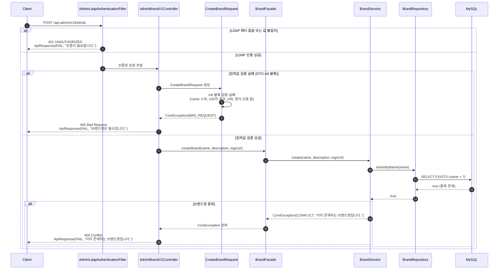
```mermaid
sequenceDiagram
    autonumber
    participant Client
    participant Filter as AdminLdapAuthenticationFilter
    participant Controller as AdminBrandV1Controller
    participant DTO as CreateBrandRequest
    participant Facade as BrandFacade
    participant Service as BrandService
    participant Repository as BrandRepository
    participant DB as MySQL

    Client->>Filter: POST /api-admin/v1/brands

    alt LDAP 헤더 없음 또는 값 불일치
        Filter-->>Client: 401 UNAUTHORIZED<br/>ApiResponse(FAIL, "인증이 필요합니다.")
    else LDAP 인증 성공
        Filter->>Controller: 인증된 요청 전달

        alt 입력값 검증 실패 (DTO init 블록)
            Controller->>DTO: CreateBrandRequest 생성
            DTO->>DTO: init 블록 검증 실패<br/>(name 누락, 100자 초과, URL 형식 오류 등)
            DTO-->>Controller: CoreException(BAD_REQUEST)
            Controller-->>Client: 400 Bad Request<br/>ApiResponse(FAIL, "브랜드명은 필수입니다.")
        else 입력값 검증 성공
            Controller->>Facade: createBrand(name, description, logoUrl)
            Facade->>Service: create(name, description, logoUrl)
            Service->>Repository: existsByName(name)
            Repository->>DB: SELECT EXISTS (name = ?)
            DB-->>Repository: true (중복 존재)
            Repository-->>Service: true

            alt 브랜드명 중복
                Service-->>Facade: CoreException(CONFLICT, "이미 존재하는 브랜드명입니다.")
                Facade-->>Controller: CoreException 전파
                Controller-->>Client: 409 Conflict<br/>ApiResponse(FAIL, "이미 존재하는 브랜드명입니다.")
            end
        end
    end
```

### 에러 시나리오

| 조건 | 발생 시점 | 책임 객체 | 에러 타입 | HTTP 상태 |
|------|----------|----------|----------|----------|
| LDAP 헤더 없음/불일치 | 필터 단계 | AdminLdapAuthenticationFilter | UNAUTHORIZED | 401 |
| 브랜드명 누락/빈 문자열 | DTO 생성 | CreateBrandRequest (init) | BAD_REQUEST | 400 |
| 브랜드명 100자 초과 | DTO 생성 | CreateBrandRequest (init) | BAD_REQUEST | 400 |
| 로고 URL 형식 오류 | DTO 생성 | CreateBrandRequest (init) | BAD_REQUEST | 400 |
| 브랜드 설명 500자 초과 | DTO 생성 | CreateBrandRequest (init) | BAD_REQUEST | 400 |
| 브랜드명 중복 | 서비스 계층 | BrandService | CONFLICT | 409 |

---

## 3. 브랜드 목록 조회 - 성공 흐름

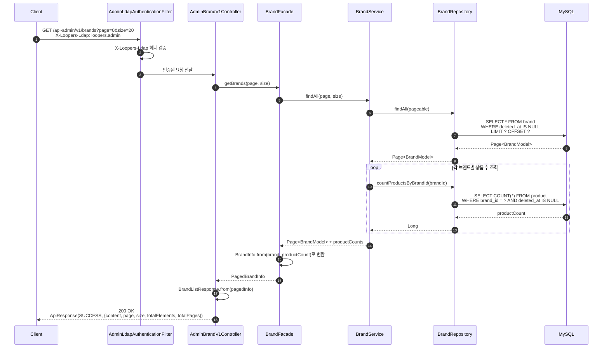
```mermaid
sequenceDiagram
    autonumber
    participant Client
    participant Filter as AdminLdapAuthenticationFilter
    participant Controller as AdminBrandV1Controller
    participant Facade as BrandFacade
    participant Service as BrandService
    participant Repository as BrandRepository
    participant DB as MySQL

    Client->>Filter: GET /api-admin/v1/brands?page=0&size=20<br/>X-Loopers-Ldap: loopers.admin
    Filter->>Filter: X-Loopers-Ldap 헤더 검증
    Filter->>Controller: 인증된 요청 전달

    Controller->>Facade: getBrands(page, size)
    Facade->>Service: findAll(page, size)
    Service->>Repository: findAll(pageable)
    Repository->>DB: SELECT * FROM brand<br/>WHERE deleted_at IS NULL<br/>LIMIT ? OFFSET ?
    DB-->>Repository: Page<BrandModel>
    Repository-->>Service: Page<BrandModel>

    loop 각 브랜드별 상품 수 조회
        Service->>Repository: countProductsByBrandId(brandId)
        Repository->>DB: SELECT COUNT(*) FROM product<br/>WHERE brand_id = ? AND deleted_at IS NULL
        DB-->>Repository: productCount
        Repository-->>Service: Long
    end

    Service-->>Facade: Page<BrandModel> + productCounts
    Facade->>Facade: BrandInfo.from(brand, productCount)로 변환
    Facade-->>Controller: PagedBrandInfo

    Controller->>Controller: BrandListResponse.from(pagedInfo)
    Controller-->>Client: 200 OK<br/>ApiResponse(SUCCESS, {content, page, size, totalElements, totalPages})
```

### 흐름 설명
1. 어드민이 브랜드 목록 조회를 요청합니다.
2. 소프트 삭제된 브랜드를 제외하고 페이징 조회합니다.
3. 각 브랜드별 소속 상품 수를 집계합니다 (삭제된 상품 제외).
4. 페이징 정보와 함께 응답을 반환합니다.

---

## 4. 브랜드 목록 조회 - 에러 흐름

```mermaid
sequenceDiagram
    autonumber
    participant Client
    participant Filter as AdminLdapAuthenticationFilter
    participant Controller as AdminBrandV1Controller

    Client->>Filter: GET /api-admin/v1/brands?page=0&size=20

    alt LDAP 헤더 없음 또는 값 불일치
        Filter-->>Client: 401 UNAUTHORIZED<br/>ApiResponse(FAIL, "인증이 필요합니다.")
    else LDAP 인증 성공
        Filter->>Controller: 인증된 요청 전달
        Note over Controller: 브랜드가 없는 경우에도<br/>빈 content 배열로 200 OK 반환
        Controller-->>Client: 200 OK<br/>ApiResponse(SUCCESS, {content: [], totalElements: 0})
    end
```

### 에러 시나리오

| 조건 | 발생 시점 | 책임 객체 | 에러 타입 | HTTP 상태 |
|------|----------|----------|----------|----------|
| LDAP 헤더 없음/불일치 | 필터 단계 | AdminLdapAuthenticationFilter | UNAUTHORIZED | 401 |

---

## 5. 브랜드 상세 조회 - 성공 흐름

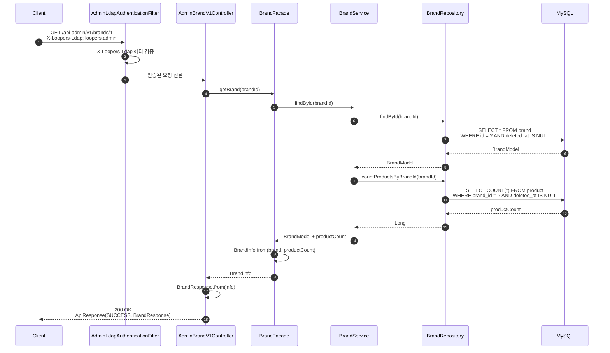
```mermaid
sequenceDiagram
    autonumber
    participant Client
    participant Filter as AdminLdapAuthenticationFilter
    participant Controller as AdminBrandV1Controller
    participant Facade as BrandFacade
    participant Service as BrandService
    participant Repository as BrandRepository
    participant DB as MySQL

    Client->>Filter: GET /api-admin/v1/brands/1<br/>X-Loopers-Ldap: loopers.admin
    Filter->>Filter: X-Loopers-Ldap 헤더 검증
    Filter->>Controller: 인증된 요청 전달

    Controller->>Facade: getBrand(brandId)
    Facade->>Service: findById(brandId)
    Service->>Repository: findById(brandId)
    Repository->>DB: SELECT * FROM brand<br/>WHERE id = ? AND deleted_at IS NULL
    DB-->>Repository: BrandModel
    Repository-->>Service: BrandModel

    Service->>Repository: countProductsByBrandId(brandId)
    Repository->>DB: SELECT COUNT(*) FROM product<br/>WHERE brand_id = ? AND deleted_at IS NULL
    DB-->>Repository: productCount
    Repository-->>Service: Long

    Service-->>Facade: BrandModel + productCount
    Facade->>Facade: BrandInfo.from(brand, productCount)
    Facade-->>Controller: BrandInfo

    Controller->>Controller: BrandResponse.from(info)
    Controller-->>Client: 200 OK<br/>ApiResponse(SUCCESS, BrandResponse)
```

---

## 6. 브랜드 상세 조회 - 에러 흐름

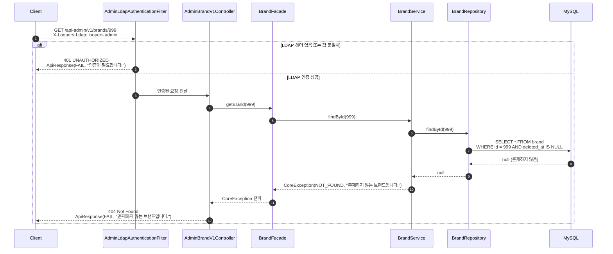
```mermaid
sequenceDiagram
    autonumber
    participant Client
    participant Filter as AdminLdapAuthenticationFilter
    participant Controller as AdminBrandV1Controller
    participant Facade as BrandFacade
    participant Service as BrandService
    participant Repository as BrandRepository
    participant DB as MySQL

    Client->>Filter: GET /api-admin/v1/brands/999<br/>X-Loopers-Ldap: loopers.admin

    alt LDAP 헤더 없음 또는 값 불일치
        Filter-->>Client: 401 UNAUTHORIZED<br/>ApiResponse(FAIL, "인증이 필요합니다.")
    else LDAP 인증 성공
        Filter->>Controller: 인증된 요청 전달
        Controller->>Facade: getBrand(999)
        Facade->>Service: findById(999)
        Service->>Repository: findById(999)
        Repository->>DB: SELECT * FROM brand<br/>WHERE id = 999 AND deleted_at IS NULL
        DB-->>Repository: null (존재하지 않음)
        Repository-->>Service: null

        Service-->>Facade: CoreException(NOT_FOUND, "존재하지 않는 브랜드입니다.")
        Facade-->>Controller: CoreException 전파
        Controller-->>Client: 404 Not Found<br/>ApiResponse(FAIL, "존재하지 않는 브랜드입니다.")
    end
```

### 에러 시나리오

| 조건 | 발생 시점 | 책임 객체 | 에러 타입 | HTTP 상태 |
|------|----------|----------|----------|----------|
| LDAP 헤더 없음/불일치 | 필터 단계 | AdminLdapAuthenticationFilter | UNAUTHORIZED | 401 |
| 존재하지 않는 브랜드 ID | 서비스 계층 | BrandService | NOT_FOUND | 404 |

---

## 7. 브랜드 정보 수정 - 성공 흐름

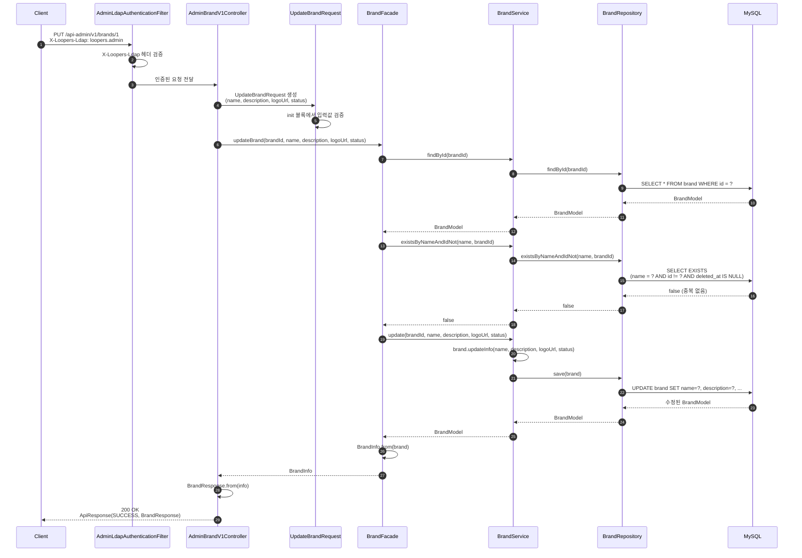
```mermaid
sequenceDiagram
    autonumber
    participant Client
    participant Filter as AdminLdapAuthenticationFilter
    participant Controller as AdminBrandV1Controller
    participant DTO as UpdateBrandRequest
    participant Facade as BrandFacade
    participant Service as BrandService
    participant Repository as BrandRepository
    participant DB as MySQL

    Client->>Filter: PUT /api-admin/v1/brands/1<br/>X-Loopers-Ldap: loopers.admin
    Filter->>Filter: X-Loopers-Ldap 헤더 검증
    Filter->>Controller: 인증된 요청 전달

    Controller->>DTO: UpdateBrandRequest 생성<br/>(name, description, logoUrl, status)
    DTO->>DTO: init 블록에서 입력값 검증

    Controller->>Facade: updateBrand(brandId, name, description, logoUrl, status)
    Facade->>Service: findById(brandId)
    Service->>Repository: findById(brandId)
    Repository->>DB: SELECT * FROM brand WHERE id = ?
    DB-->>Repository: BrandModel
    Repository-->>Service: BrandModel
    Service-->>Facade: BrandModel

    Facade->>Service: existsByNameAndIdNot(name, brandId)
    Service->>Repository: existsByNameAndIdNot(name, brandId)
    Repository->>DB: SELECT EXISTS<br/>(name = ? AND id != ? AND deleted_at IS NULL)
    DB-->>Repository: false (중복 없음)
    Repository-->>Service: false
    Service-->>Facade: false

    Facade->>Service: update(brandId, name, description, logoUrl, status)
    Service->>Service: brand.updateInfo(name, description, logoUrl, status)
    Service->>Repository: save(brand)
    Repository->>DB: UPDATE brand SET name=?, description=?, ...
    DB-->>Repository: 수정된 BrandModel
    Repository-->>Service: BrandModel

    Service-->>Facade: BrandModel
    Facade->>Facade: BrandInfo.from(brand)
    Facade-->>Controller: BrandInfo

    Controller->>Controller: BrandResponse.from(info)
    Controller-->>Client: 200 OK<br/>ApiResponse(SUCCESS, BrandResponse)
```

---

## 8. 브랜드 정보 수정 - 에러 흐름

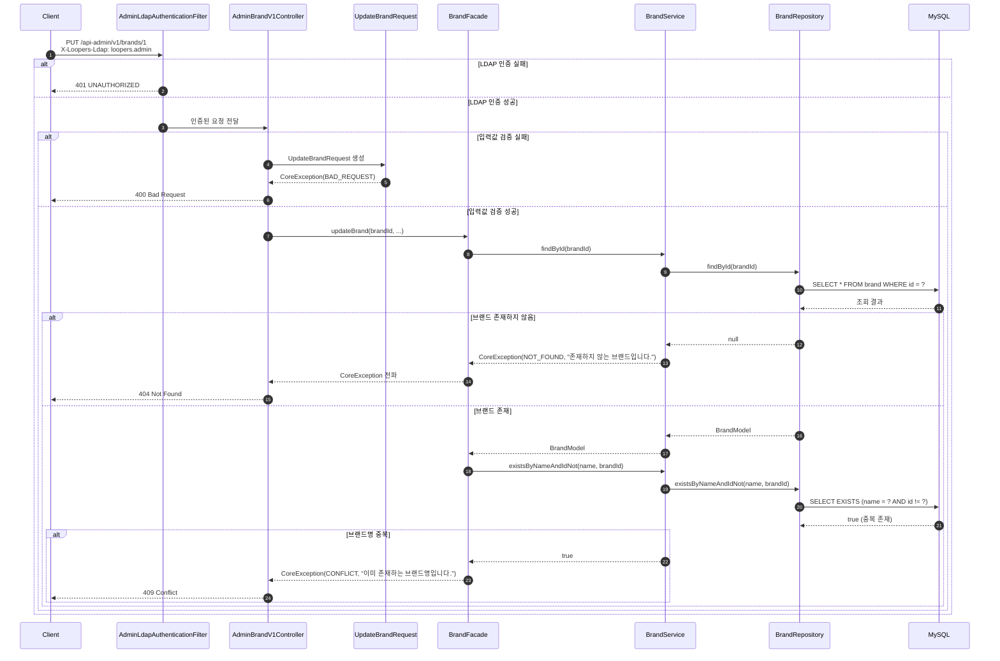
```mermaid
sequenceDiagram
    autonumber
    participant Client
    participant Filter as AdminLdapAuthenticationFilter
    participant Controller as AdminBrandV1Controller
    participant DTO as UpdateBrandRequest
    participant Facade as BrandFacade
    participant Service as BrandService
    participant Repository as BrandRepository
    participant DB as MySQL

    Client->>Filter: PUT /api-admin/v1/brands/1<br/>X-Loopers-Ldap: loopers.admin

    alt LDAP 인증 실패
        Filter-->>Client: 401 UNAUTHORIZED
    else LDAP 인증 성공
        Filter->>Controller: 인증된 요청 전달

        alt 입력값 검증 실패
            Controller->>DTO: UpdateBrandRequest 생성
            DTO-->>Controller: CoreException(BAD_REQUEST)
            Controller-->>Client: 400 Bad Request
        else 입력값 검증 성공
            Controller->>Facade: updateBrand(brandId, ...)
            Facade->>Service: findById(brandId)
            Service->>Repository: findById(brandId)
            Repository->>DB: SELECT * FROM brand WHERE id = ?
            DB-->>Repository: 조회 결과

            alt 브랜드 존재하지 않음
                Repository-->>Service: null
                Service-->>Facade: CoreException(NOT_FOUND, "존재하지 않는 브랜드입니다.")
                Facade-->>Controller: CoreException 전파
                Controller-->>Client: 404 Not Found
            else 브랜드 존재
                Repository-->>Service: BrandModel
                Service-->>Facade: BrandModel

                Facade->>Service: existsByNameAndIdNot(name, brandId)
                Service->>Repository: existsByNameAndIdNot(name, brandId)
                Repository->>DB: SELECT EXISTS (name = ? AND id != ?)
                DB-->>Repository: true (중복 존재)

                alt 브랜드명 중복
                    Service-->>Facade: true
                    Facade-->>Controller: CoreException(CONFLICT, "이미 존재하는 브랜드명입니다.")
                    Controller-->>Client: 409 Conflict
                end
            end
        end
    end
```

### 에러 시나리오

| 조건 | 발생 시점 | 책임 객체 | 에러 타입 | HTTP 상태 |
|------|----------|----------|----------|----------|
| LDAP 헤더 없음/불일치 | 필터 단계 | AdminLdapAuthenticationFilter | UNAUTHORIZED | 401 |
| 브랜드명/상태 검증 실패 | DTO 생성 | UpdateBrandRequest (init) | BAD_REQUEST | 400 |
| 존재하지 않는 브랜드 | 서비스 계층 | BrandService | NOT_FOUND | 404 |
| 브랜드명 중복 (다른 브랜드) | 퍼사드 계층 | BrandFacade | CONFLICT | 409 |

---

## 9. 브랜드 삭제 - 성공 흐름 (연쇄 삭제 포함)

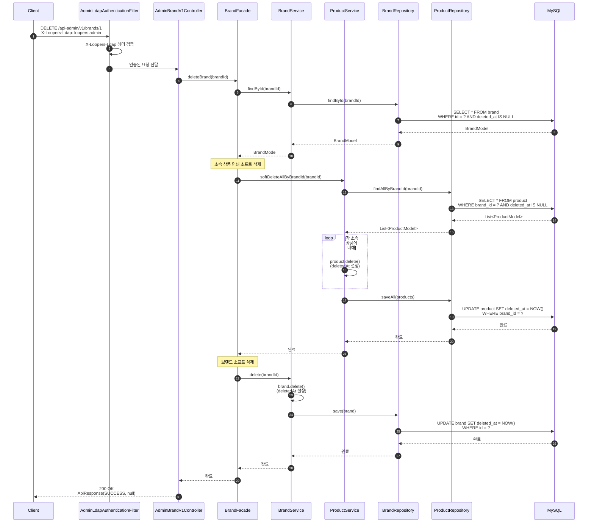
```mermaid
sequenceDiagram
    autonumber
    participant Client
    participant Filter as AdminLdapAuthenticationFilter
    participant Controller as AdminBrandV1Controller
    participant Facade as BrandFacade
    participant BrandService as BrandService
    participant ProductService as ProductService
    participant BrandRepo as BrandRepository
    participant ProductRepo as ProductRepository
    participant DB as MySQL

    Client->>Filter: DELETE /api-admin/v1/brands/1<br/>X-Loopers-Ldap: loopers.admin
    Filter->>Filter: X-Loopers-Ldap 헤더 검증
    Filter->>Controller: 인증된 요청 전달

    Controller->>Facade: deleteBrand(brandId)

    Facade->>BrandService: findById(brandId)
    BrandService->>BrandRepo: findById(brandId)
    BrandRepo->>DB: SELECT * FROM brand<br/>WHERE id = ? AND deleted_at IS NULL
    DB-->>BrandRepo: BrandModel
    BrandRepo-->>BrandService: BrandModel
    BrandService-->>Facade: BrandModel

    Note over Facade: 소속 상품 연쇄 소프트 삭제
    Facade->>ProductService: softDeleteAllByBrandId(brandId)
    ProductService->>ProductRepo: findAllByBrandId(brandId)
    ProductRepo->>DB: SELECT * FROM product<br/>WHERE brand_id = ? AND deleted_at IS NULL
    DB-->>ProductRepo: List<ProductModel>
    ProductRepo-->>ProductService: List<ProductModel>

    loop 각 소속 상품에 대해
        ProductService->>ProductService: product.delete()<br/>(deletedAt 설정)
    end

    ProductService->>ProductRepo: saveAll(products)
    ProductRepo->>DB: UPDATE product SET deleted_at = NOW()<br/>WHERE brand_id = ?
    DB-->>ProductRepo: 완료
    ProductRepo-->>ProductService: 완료
    ProductService-->>Facade: 완료

    Note over Facade: 브랜드 소프트 삭제
    Facade->>BrandService: delete(brandId)
    BrandService->>BrandService: brand.delete()<br/>(deletedAt 설정)
    BrandService->>BrandRepo: save(brand)
    BrandRepo->>DB: UPDATE brand SET deleted_at = NOW()<br/>WHERE id = ?
    DB-->>BrandRepo: 완료
    BrandRepo-->>BrandService: 완료
    BrandService-->>Facade: 완료

    Facade-->>Controller: 완료
    Controller-->>Client: 200 OK<br/>ApiResponse(SUCCESS, null)
```

### 흐름 설명
1. 어드민이 브랜드 삭제를 요청합니다.
2. `BrandFacade`가 브랜드 존재 여부를 확인합니다.
3. `ProductService`를 통해 해당 브랜드에 소속된 모든 상품을 소프트 삭제합니다.
4. `BrandService`를 통해 브랜드 자체를 소프트 삭제합니다.
5. 모든 작업은 단일 트랜잭션 내에서 처리되어 데이터 일관성을 보장합니다.

---

## 10. 브랜드 삭제 - 에러 흐름

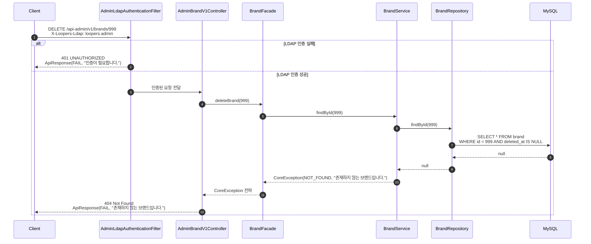
```mermaid
sequenceDiagram
    autonumber
    participant Client
    participant Filter as AdminLdapAuthenticationFilter
    participant Controller as AdminBrandV1Controller
    participant Facade as BrandFacade
    participant BrandService as BrandService
    participant BrandRepo as BrandRepository
    participant DB as MySQL

    Client->>Filter: DELETE /api-admin/v1/brands/999<br/>X-Loopers-Ldap: loopers.admin

    alt LDAP 인증 실패
        Filter-->>Client: 401 UNAUTHORIZED<br/>ApiResponse(FAIL, "인증이 필요합니다.")
    else LDAP 인증 성공
        Filter->>Controller: 인증된 요청 전달
        Controller->>Facade: deleteBrand(999)
        Facade->>BrandService: findById(999)
        BrandService->>BrandRepo: findById(999)
        BrandRepo->>DB: SELECT * FROM brand<br/>WHERE id = 999 AND deleted_at IS NULL
        DB-->>BrandRepo: null
        BrandRepo-->>BrandService: null
        BrandService-->>Facade: CoreException(NOT_FOUND, "존재하지 않는 브랜드입니다.")
        Facade-->>Controller: CoreException 전파
        Controller-->>Client: 404 Not Found<br/>ApiResponse(FAIL, "존재하지 않는 브랜드입니다.")
    end
```

### 에러 시나리오

| 조건 | 발생 시점 | 책임 객체 | 에러 타입 | HTTP 상태 |
|------|----------|----------|----------|----------|
| LDAP 헤더 없음/불일치 | 필터 단계 | AdminLdapAuthenticationFilter | UNAUTHORIZED | 401 |
| 존재하지 않는 브랜드 | 서비스 계층 | BrandService | NOT_FOUND | 404 |

---

## 11. 상품 등록 - 성공 흐름

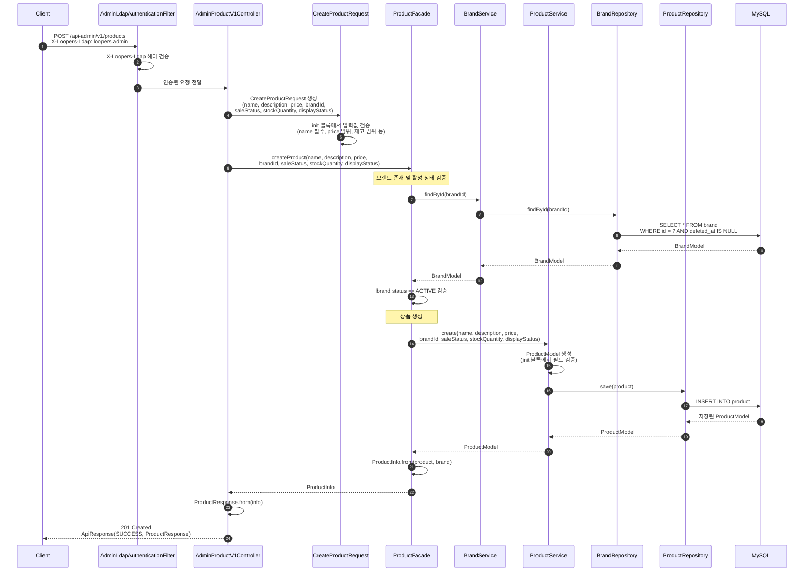
```mermaid
sequenceDiagram
    autonumber
    participant Client
    participant Filter as AdminLdapAuthenticationFilter
    participant Controller as AdminProductV1Controller
    participant DTO as CreateProductRequest
    participant Facade as ProductFacade
    participant BrandService as BrandService
    participant ProductService as ProductService
    participant BrandRepo as BrandRepository
    participant ProductRepo as ProductRepository
    participant DB as MySQL

    Client->>Filter: POST /api-admin/v1/products<br/>X-Loopers-Ldap: loopers.admin
    Filter->>Filter: X-Loopers-Ldap 헤더 검증
    Filter->>Controller: 인증된 요청 전달

    Controller->>DTO: CreateProductRequest 생성<br/>(name, description, price, brandId,<br/>saleStatus, stockQuantity, displayStatus)
    DTO->>DTO: init 블록에서 입력값 검증<br/>(name 필수, price 범위, 재고 범위 등)

    Controller->>Facade: createProduct(name, description, price,<br/>brandId, saleStatus, stockQuantity, displayStatus)

    Note over Facade: 브랜드 존재 및 활성 상태 검증
    Facade->>BrandService: findById(brandId)
    BrandService->>BrandRepo: findById(brandId)
    BrandRepo->>DB: SELECT * FROM brand<br/>WHERE id = ? AND deleted_at IS NULL
    DB-->>BrandRepo: BrandModel
    BrandRepo-->>BrandService: BrandModel
    BrandService-->>Facade: BrandModel

    Facade->>Facade: brand.status == ACTIVE 검증

    Note over Facade: 상품 생성
    Facade->>ProductService: create(name, description, price,<br/>brandId, saleStatus, stockQuantity, displayStatus)
    ProductService->>ProductService: ProductModel 생성<br/>(init 블록에서 필드 검증)
    ProductService->>ProductRepo: save(product)
    ProductRepo->>DB: INSERT INTO product
    DB-->>ProductRepo: 저장된 ProductModel
    ProductRepo-->>ProductService: ProductModel
    ProductService-->>Facade: ProductModel

    Facade->>Facade: ProductInfo.from(product, brand)
    Facade-->>Controller: ProductInfo

    Controller->>Controller: ProductResponse.from(info)
    Controller-->>Client: 201 Created<br/>ApiResponse(SUCCESS, ProductResponse)
```

### 흐름 설명
1. 어드민이 상품 등록 요청을 보냅니다.
2. DTO init 블록에서 상품명, 가격, 재고 수량 등의 기본 검증을 수행합니다.
3. `ProductFacade`가 `BrandService`를 통해 브랜드 존재 여부와 활성 상태를 검증합니다.
4. 검증 통과 후 `ProductService`에서 상품을 생성하고 저장합니다.
5. 응답에 브랜드 요약 정보(brandId, name)를 포함하여 반환합니다.

---

## 12. 상품 등록 - 에러 흐름

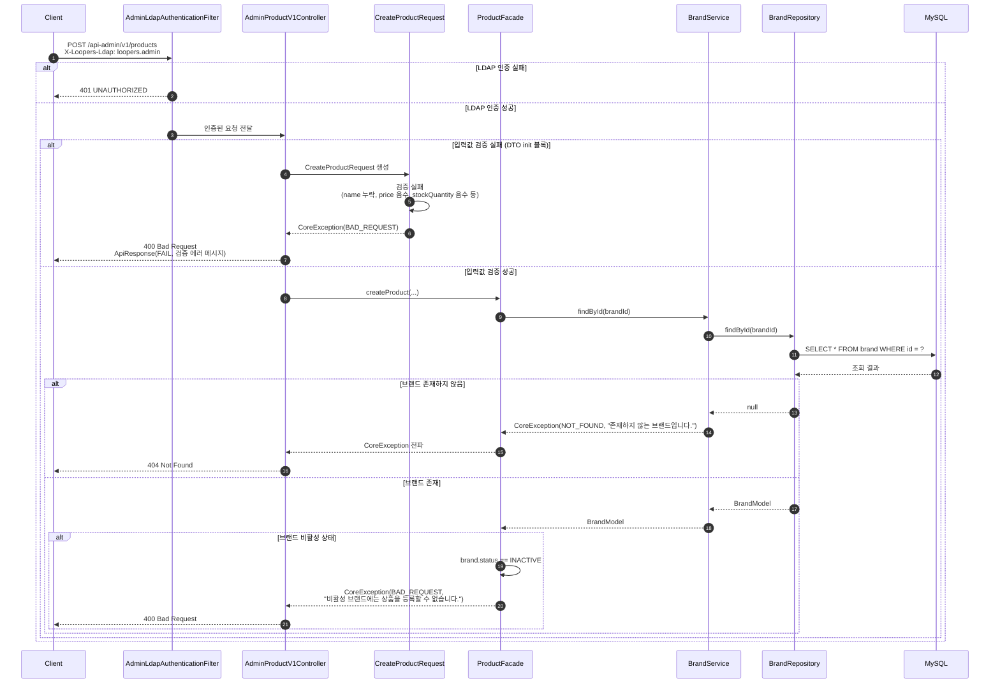
```mermaid
sequenceDiagram
    autonumber
    participant Client
    participant Filter as AdminLdapAuthenticationFilter
    participant Controller as AdminProductV1Controller
    participant DTO as CreateProductRequest
    participant Facade as ProductFacade
    participant BrandService as BrandService
    participant BrandRepo as BrandRepository
    participant DB as MySQL

    Client->>Filter: POST /api-admin/v1/products<br/>X-Loopers-Ldap: loopers.admin

    alt LDAP 인증 실패
        Filter-->>Client: 401 UNAUTHORIZED
    else LDAP 인증 성공
        Filter->>Controller: 인증된 요청 전달

        alt 입력값 검증 실패 (DTO init 블록)
            Controller->>DTO: CreateProductRequest 생성
            DTO->>DTO: 검증 실패<br/>(name 누락, price 음수, stockQuantity 음수 등)
            DTO-->>Controller: CoreException(BAD_REQUEST)
            Controller-->>Client: 400 Bad Request<br/>ApiResponse(FAIL, 검증 에러 메시지)
        else 입력값 검증 성공
            Controller->>Facade: createProduct(...)

            Facade->>BrandService: findById(brandId)
            BrandService->>BrandRepo: findById(brandId)
            BrandRepo->>DB: SELECT * FROM brand WHERE id = ?
            DB-->>BrandRepo: 조회 결과

            alt 브랜드 존재하지 않음
                BrandRepo-->>BrandService: null
                BrandService-->>Facade: CoreException(NOT_FOUND, "존재하지 않는 브랜드입니다.")
                Facade-->>Controller: CoreException 전파
                Controller-->>Client: 404 Not Found
            else 브랜드 존재
                BrandRepo-->>BrandService: BrandModel
                BrandService-->>Facade: BrandModel

                alt 브랜드 비활성 상태
                    Facade->>Facade: brand.status == INACTIVE
                    Facade-->>Controller: CoreException(BAD_REQUEST,<br/>"비활성 브랜드에는 상품을 등록할 수 없습니다.")
                    Controller-->>Client: 400 Bad Request
                end
            end
        end
    end
```

### 에러 시나리오

| 조건 | 발생 시점 | 책임 객체 | 에러 타입 | HTTP 상태 |
|------|----------|----------|----------|----------|
| LDAP 헤더 없음/불일치 | 필터 단계 | AdminLdapAuthenticationFilter | UNAUTHORIZED | 401 |
| 상품명 누락/200자 초과 | DTO 생성 | CreateProductRequest (init) | BAD_REQUEST | 400 |
| 가격 음수/상한 초과 | DTO 생성 | CreateProductRequest (init) | BAD_REQUEST | 400 |
| 재고 수량 음수/상한 초과 | DTO 생성 | CreateProductRequest (init) | BAD_REQUEST | 400 |
| 유효하지 않은 판매/노출 상태 | DTO 생성 | CreateProductRequest (init) | BAD_REQUEST | 400 |
| 존재하지 않는 브랜드 | 서비스 계층 | BrandService | NOT_FOUND | 404 |
| 비활성 브랜드 | 퍼사드 계층 | ProductFacade | BAD_REQUEST | 400 |

---

## 13. 상품 목록 조회 - 성공 흐름

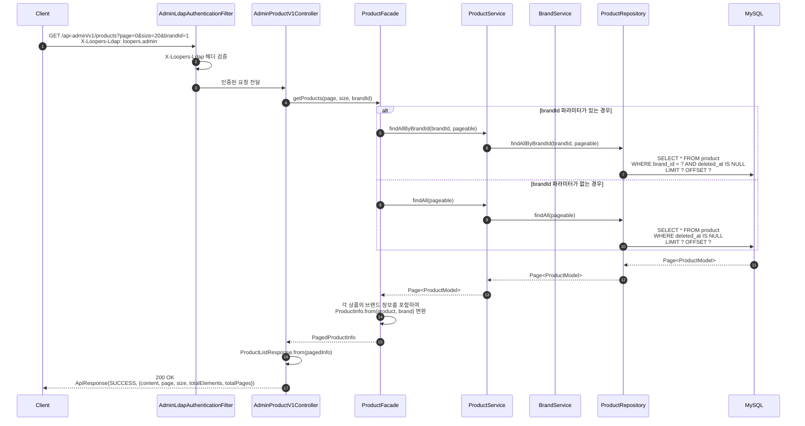
```mermaid
sequenceDiagram
    autonumber
    participant Client
    participant Filter as AdminLdapAuthenticationFilter
    participant Controller as AdminProductV1Controller
    participant Facade as ProductFacade
    participant ProductService as ProductService
    participant BrandService as BrandService
    participant ProductRepo as ProductRepository
    participant DB as MySQL

    Client->>Filter: GET /api-admin/v1/products?page=0&size=20&brandId=1<br/>X-Loopers-Ldap: loopers.admin
    Filter->>Filter: X-Loopers-Ldap 헤더 검증
    Filter->>Controller: 인증된 요청 전달

    Controller->>Facade: getProducts(page, size, brandId)

    alt brandId 파라미터가 있는 경우
        Facade->>ProductService: findAllByBrandId(brandId, pageable)
        ProductService->>ProductRepo: findAllByBrandId(brandId, pageable)
        ProductRepo->>DB: SELECT * FROM product<br/>WHERE brand_id = ? AND deleted_at IS NULL<br/>LIMIT ? OFFSET ?
    else brandId 파라미터가 없는 경우
        Facade->>ProductService: findAll(pageable)
        ProductService->>ProductRepo: findAll(pageable)
        ProductRepo->>DB: SELECT * FROM product<br/>WHERE deleted_at IS NULL<br/>LIMIT ? OFFSET ?
    end

    DB-->>ProductRepo: Page<ProductModel>
    ProductRepo-->>ProductService: Page<ProductModel>
    ProductService-->>Facade: Page<ProductModel>

    Facade->>Facade: 각 상품의 브랜드 정보를 포함하여<br/>ProductInfo.from(product, brand) 변환
    Facade-->>Controller: PagedProductInfo

    Controller->>Controller: ProductListResponse.from(pagedInfo)
    Controller-->>Client: 200 OK<br/>ApiResponse(SUCCESS, {content, page, size, totalElements, totalPages})
```

---

## 14. 상품 목록 조회 - 에러 흐름

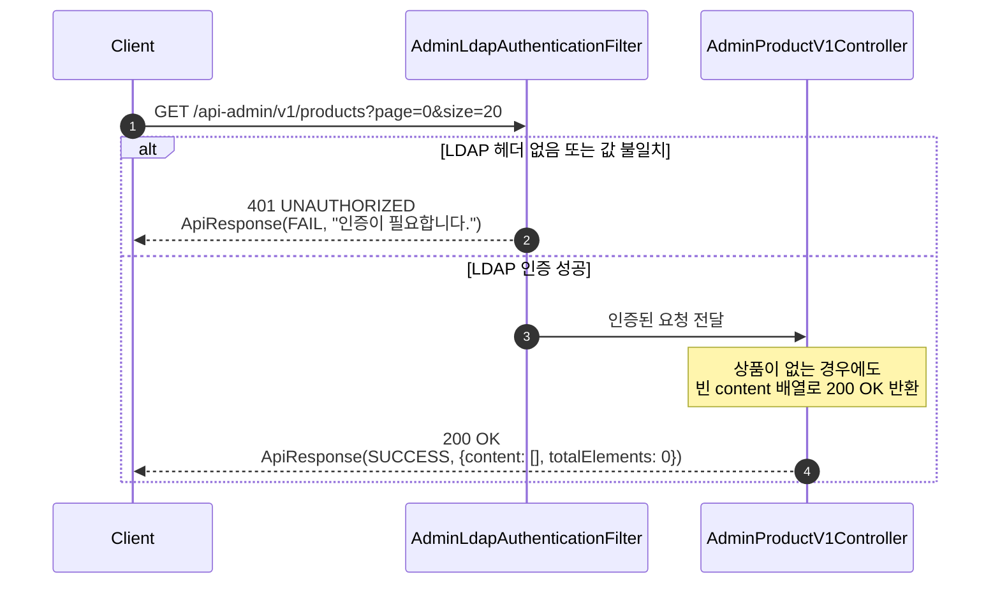
```mermaid
sequenceDiagram
    autonumber
    participant Client
    participant Filter as AdminLdapAuthenticationFilter
    participant Controller as AdminProductV1Controller

    Client->>Filter: GET /api-admin/v1/products?page=0&size=20

    alt LDAP 헤더 없음 또는 값 불일치
        Filter-->>Client: 401 UNAUTHORIZED<br/>ApiResponse(FAIL, "인증이 필요합니다.")
    else LDAP 인증 성공
        Filter->>Controller: 인증된 요청 전달
        Note over Controller: 상품이 없는 경우에도<br/>빈 content 배열로 200 OK 반환
        Controller-->>Client: 200 OK<br/>ApiResponse(SUCCESS, {content: [], totalElements: 0})
    end
```

### 에러 시나리오

| 조건 | 발생 시점 | 책임 객체 | 에러 타입 | HTTP 상태 |
|------|----------|----------|----------|----------|
| LDAP 헤더 없음/불일치 | 필터 단계 | AdminLdapAuthenticationFilter | UNAUTHORIZED | 401 |

---

## 15. 상품 상세 조회 - 성공 흐름

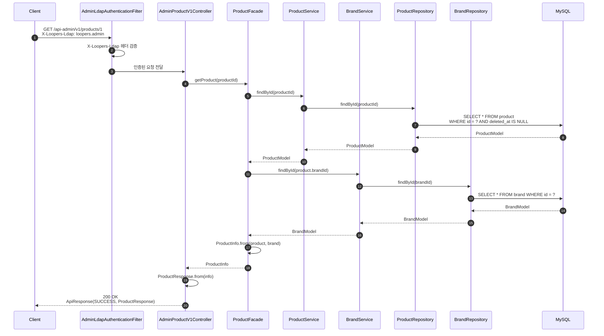
```mermaid
sequenceDiagram
    autonumber
    participant Client
    participant Filter as AdminLdapAuthenticationFilter
    participant Controller as AdminProductV1Controller
    participant Facade as ProductFacade
    participant ProductService as ProductService
    participant BrandService as BrandService
    participant ProductRepo as ProductRepository
    participant BrandRepo as BrandRepository
    participant DB as MySQL

    Client->>Filter: GET /api-admin/v1/products/1<br/>X-Loopers-Ldap: loopers.admin
    Filter->>Filter: X-Loopers-Ldap 헤더 검증
    Filter->>Controller: 인증된 요청 전달

    Controller->>Facade: getProduct(productId)
    Facade->>ProductService: findById(productId)
    ProductService->>ProductRepo: findById(productId)
    ProductRepo->>DB: SELECT * FROM product<br/>WHERE id = ? AND deleted_at IS NULL
    DB-->>ProductRepo: ProductModel
    ProductRepo-->>ProductService: ProductModel
    ProductService-->>Facade: ProductModel

    Facade->>BrandService: findById(product.brandId)
    BrandService->>BrandRepo: findById(brandId)
    BrandRepo->>DB: SELECT * FROM brand WHERE id = ?
    DB-->>BrandRepo: BrandModel
    BrandRepo-->>BrandService: BrandModel
    BrandService-->>Facade: BrandModel

    Facade->>Facade: ProductInfo.from(product, brand)
    Facade-->>Controller: ProductInfo

    Controller->>Controller: ProductResponse.from(info)
    Controller-->>Client: 200 OK<br/>ApiResponse(SUCCESS, ProductResponse)
```

---

## 16. 상품 상세 조회 - 에러 흐름

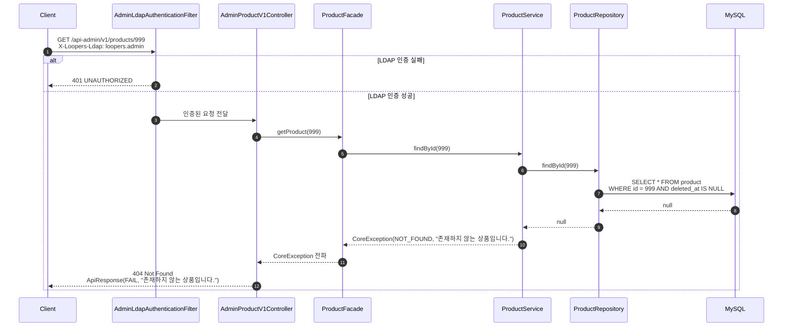
```mermaid
sequenceDiagram
    autonumber
    participant Client
    participant Filter as AdminLdapAuthenticationFilter
    participant Controller as AdminProductV1Controller
    participant Facade as ProductFacade
    participant ProductService as ProductService
    participant ProductRepo as ProductRepository
    participant DB as MySQL

    Client->>Filter: GET /api-admin/v1/products/999<br/>X-Loopers-Ldap: loopers.admin

    alt LDAP 인증 실패
        Filter-->>Client: 401 UNAUTHORIZED
    else LDAP 인증 성공
        Filter->>Controller: 인증된 요청 전달
        Controller->>Facade: getProduct(999)
        Facade->>ProductService: findById(999)
        ProductService->>ProductRepo: findById(999)
        ProductRepo->>DB: SELECT * FROM product<br/>WHERE id = 999 AND deleted_at IS NULL
        DB-->>ProductRepo: null
        ProductRepo-->>ProductService: null
        ProductService-->>Facade: CoreException(NOT_FOUND, "존재하지 않는 상품입니다.")
        Facade-->>Controller: CoreException 전파
        Controller-->>Client: 404 Not Found<br/>ApiResponse(FAIL, "존재하지 않는 상품입니다.")
    end
```

### 에러 시나리오

| 조건 | 발생 시점 | 책임 객체 | 에러 타입 | HTTP 상태 |
|------|----------|----------|----------|----------|
| LDAP 헤더 없음/불일치 | 필터 단계 | AdminLdapAuthenticationFilter | UNAUTHORIZED | 401 |
| 존재하지 않는 상품 | 서비스 계층 | ProductService | NOT_FOUND | 404 |

---

## 17. 상품 정보 수정 - 성공 흐름

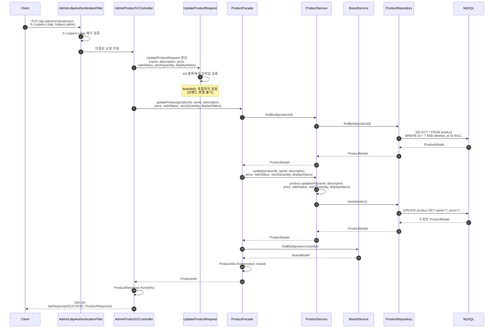
```mermaid
sequenceDiagram
    autonumber
    participant Client
    participant Filter as AdminLdapAuthenticationFilter
    participant Controller as AdminProductV1Controller
    participant DTO as UpdateProductRequest
    participant Facade as ProductFacade
    participant ProductService as ProductService
    participant BrandService as BrandService
    participant ProductRepo as ProductRepository
    participant DB as MySQL

    Client->>Filter: PUT /api-admin/v1/products/1<br/>X-Loopers-Ldap: loopers.admin
    Filter->>Filter: X-Loopers-Ldap 헤더 검증
    Filter->>Controller: 인증된 요청 전달

    Controller->>DTO: UpdateProductRequest 생성<br/>(name, description, price,<br/>saleStatus, stockQuantity, displayStatus)
    DTO->>DTO: init 블록에서 입력값 검증
    Note over DTO: brandId는 포함하지 않음<br/>(브랜드 변경 불가)

    Controller->>Facade: updateProduct(productId, name, description,<br/>price, saleStatus, stockQuantity, displayStatus)

    Facade->>ProductService: findById(productId)
    ProductService->>ProductRepo: findById(productId)
    ProductRepo->>DB: SELECT * FROM product<br/>WHERE id = ? AND deleted_at IS NULL
    DB-->>ProductRepo: ProductModel
    ProductRepo-->>ProductService: ProductModel
    ProductService-->>Facade: ProductModel

    Facade->>ProductService: update(productId, name, description,<br/>price, saleStatus, stockQuantity, displayStatus)
    ProductService->>ProductService: product.updateInfo(name, description,<br/>price, saleStatus, stockQuantity, displayStatus)
    ProductService->>ProductRepo: save(product)
    ProductRepo->>DB: UPDATE product SET name=?, price=?, ...
    DB-->>ProductRepo: 수정된 ProductModel
    ProductRepo-->>ProductService: ProductModel
    ProductService-->>Facade: ProductModel

    Facade->>BrandService: findById(product.brandId)
    BrandService-->>Facade: BrandModel

    Facade->>Facade: ProductInfo.from(product, brand)
    Facade-->>Controller: ProductInfo

    Controller->>Controller: ProductResponse.from(info)
    Controller-->>Client: 200 OK<br/>ApiResponse(SUCCESS, ProductResponse)
```

---

## 18. 상품 정보 수정 - 에러 흐름

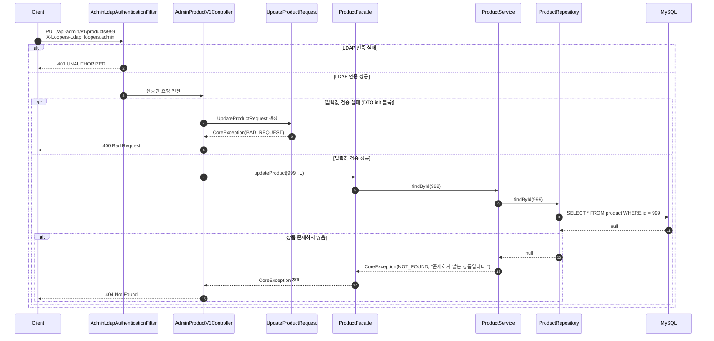
```mermaid
sequenceDiagram
    autonumber
    participant Client
    participant Filter as AdminLdapAuthenticationFilter
    participant Controller as AdminProductV1Controller
    participant DTO as UpdateProductRequest
    participant Facade as ProductFacade
    participant ProductService as ProductService
    participant ProductRepo as ProductRepository
    participant DB as MySQL

    Client->>Filter: PUT /api-admin/v1/products/999<br/>X-Loopers-Ldap: loopers.admin

    alt LDAP 인증 실패
        Filter-->>Client: 401 UNAUTHORIZED
    else LDAP 인증 성공
        Filter->>Controller: 인증된 요청 전달

        alt 입력값 검증 실패 (DTO init 블록)
            Controller->>DTO: UpdateProductRequest 생성
            DTO-->>Controller: CoreException(BAD_REQUEST)
            Controller-->>Client: 400 Bad Request
        else 입력값 검증 성공
            Controller->>Facade: updateProduct(999, ...)
            Facade->>ProductService: findById(999)
            ProductService->>ProductRepo: findById(999)
            ProductRepo->>DB: SELECT * FROM product WHERE id = 999
            DB-->>ProductRepo: null

            alt 상품 존재하지 않음
                ProductRepo-->>ProductService: null
                ProductService-->>Facade: CoreException(NOT_FOUND, "존재하지 않는 상품입니다.")
                Facade-->>Controller: CoreException 전파
                Controller-->>Client: 404 Not Found
            end
        end
    end
```

### 에러 시나리오

| 조건 | 발생 시점 | 책임 객체 | 에러 타입 | HTTP 상태 |
|------|----------|----------|----------|----------|
| LDAP 헤더 없음/불일치 | 필터 단계 | AdminLdapAuthenticationFilter | UNAUTHORIZED | 401 |
| 입력값 검증 실패 | DTO 생성 | UpdateProductRequest (init) | BAD_REQUEST | 400 |
| 존재하지 않는 상품 | 서비스 계층 | ProductService | NOT_FOUND | 404 |

---

## 19. 상품 삭제 - 성공 흐름

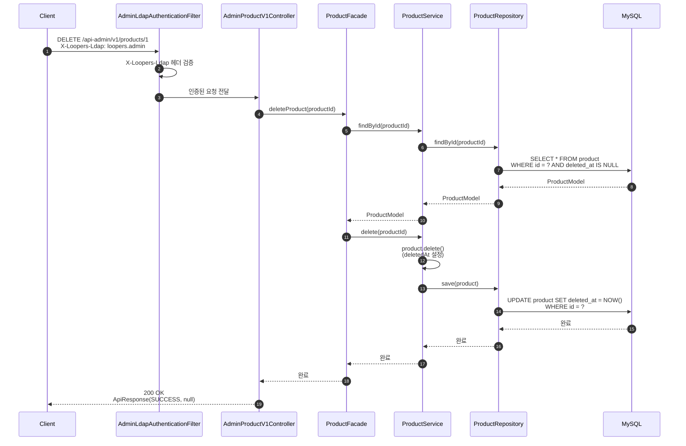
```mermaid
sequenceDiagram
    autonumber
    participant Client
    participant Filter as AdminLdapAuthenticationFilter
    participant Controller as AdminProductV1Controller
    participant Facade as ProductFacade
    participant ProductService as ProductService
    participant ProductRepo as ProductRepository
    participant DB as MySQL

    Client->>Filter: DELETE /api-admin/v1/products/1<br/>X-Loopers-Ldap: loopers.admin
    Filter->>Filter: X-Loopers-Ldap 헤더 검증
    Filter->>Controller: 인증된 요청 전달

    Controller->>Facade: deleteProduct(productId)
    Facade->>ProductService: findById(productId)
    ProductService->>ProductRepo: findById(productId)
    ProductRepo->>DB: SELECT * FROM product<br/>WHERE id = ? AND deleted_at IS NULL
    DB-->>ProductRepo: ProductModel
    ProductRepo-->>ProductService: ProductModel
    ProductService-->>Facade: ProductModel

    Facade->>ProductService: delete(productId)
    ProductService->>ProductService: product.delete()<br/>(deletedAt 설정)
    ProductService->>ProductRepo: save(product)
    ProductRepo->>DB: UPDATE product SET deleted_at = NOW()<br/>WHERE id = ?
    DB-->>ProductRepo: 완료
    ProductRepo-->>ProductService: 완료
    ProductService-->>Facade: 완료

    Facade-->>Controller: 완료
    Controller-->>Client: 200 OK<br/>ApiResponse(SUCCESS, null)
```

---

## 20. 상품 삭제 - 에러 흐름

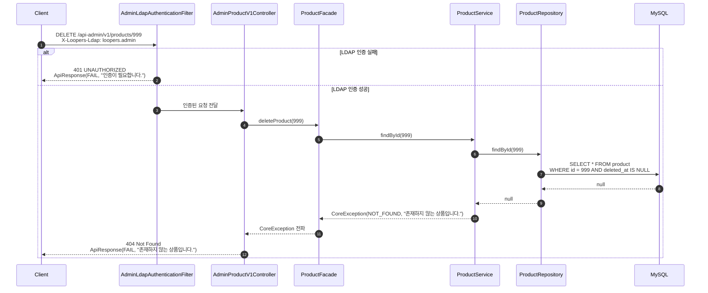
```mermaid
sequenceDiagram
    autonumber
    participant Client
    participant Filter as AdminLdapAuthenticationFilter
    participant Controller as AdminProductV1Controller
    participant Facade as ProductFacade
    participant ProductService as ProductService
    participant ProductRepo as ProductRepository
    participant DB as MySQL

    Client->>Filter: DELETE /api-admin/v1/products/999<br/>X-Loopers-Ldap: loopers.admin

    alt LDAP 인증 실패
        Filter-->>Client: 401 UNAUTHORIZED<br/>ApiResponse(FAIL, "인증이 필요합니다.")
    else LDAP 인증 성공
        Filter->>Controller: 인증된 요청 전달
        Controller->>Facade: deleteProduct(999)
        Facade->>ProductService: findById(999)
        ProductService->>ProductRepo: findById(999)
        ProductRepo->>DB: SELECT * FROM product<br/>WHERE id = 999 AND deleted_at IS NULL
        DB-->>ProductRepo: null
        ProductRepo-->>ProductService: null
        ProductService-->>Facade: CoreException(NOT_FOUND, "존재하지 않는 상품입니다.")
        Facade-->>Controller: CoreException 전파
        Controller-->>Client: 404 Not Found<br/>ApiResponse(FAIL, "존재하지 않는 상품입니다.")
    end
```

### 에러 시나리오

| 조건 | 발생 시점 | 책임 객체 | 에러 타입 | HTTP 상태 |
|------|----------|----------|----------|----------|
| LDAP 헤더 없음/불일치 | 필터 단계 | AdminLdapAuthenticationFilter | UNAUTHORIZED | 401 |
| 존재하지 않는 상품 | 서비스 계층 | ProductService | NOT_FOUND | 404 |

---

## 품질 체크리스트

- [x] 각 participant의 책임(검증, 변환, 조회, 저장 등)이 메서드명으로 명확히 드러나는가?
- [x] 여러 도메인이 관련된 경우, 각 도메인의 Service가 별도 participant로 분리되어 있는가?
  - 브랜드 삭제 시 BrandService + ProductService 분리
  - 상품 등록/조회 시 ProductService + BrandService 분리
- [x] 인증 방식(LDAP 헤더 기반)이 다이어그램에 정확히 반영되어 있는가?
- [x] 성공 흐름과 에러 흐름이 모두 포함되어 있는가? (10개 API x 2 = 20개 다이어그램)
- [x] 에러 시나리오 테이블에 발생 시점과 책임 객체가 명시되어 있는가?
