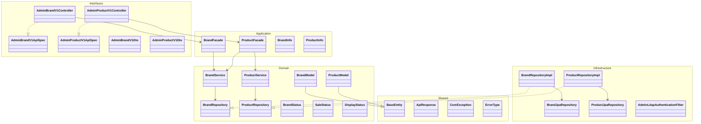
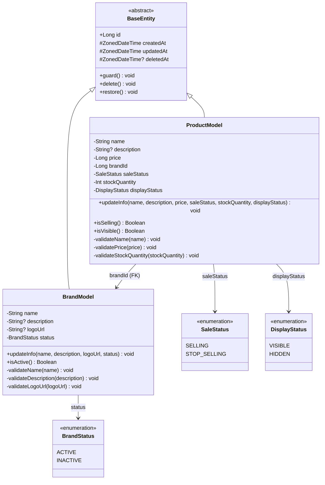
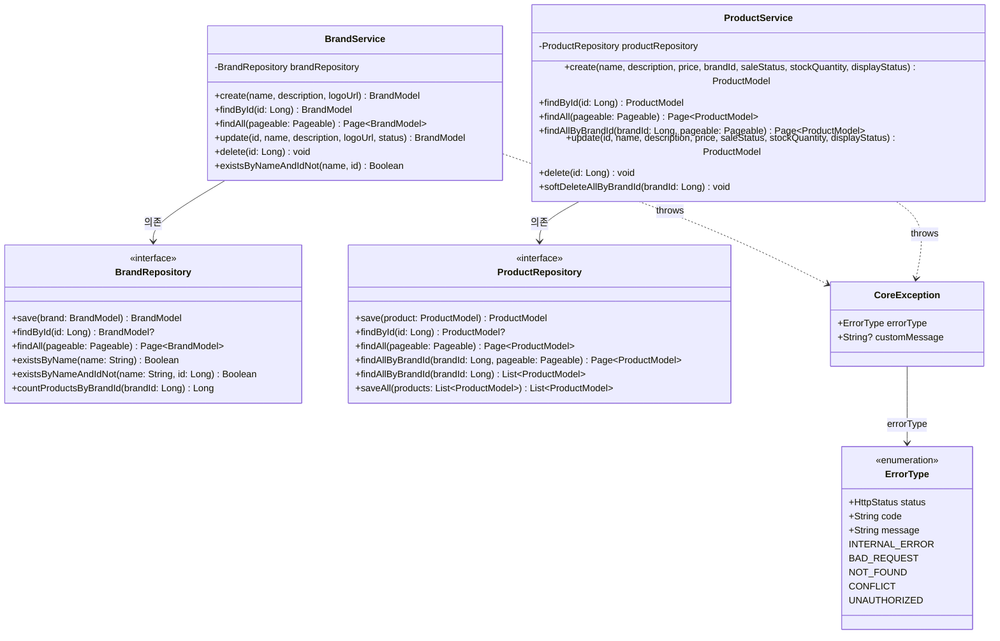
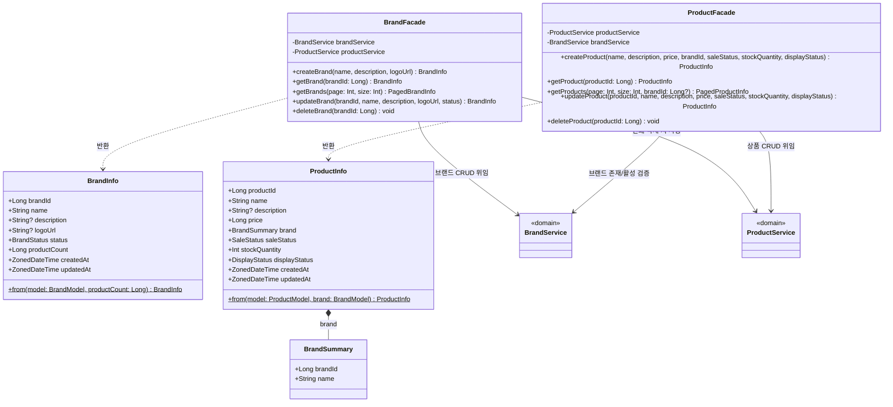
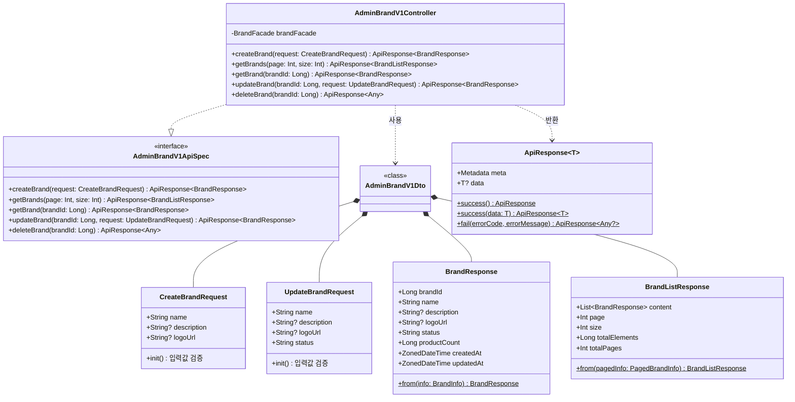
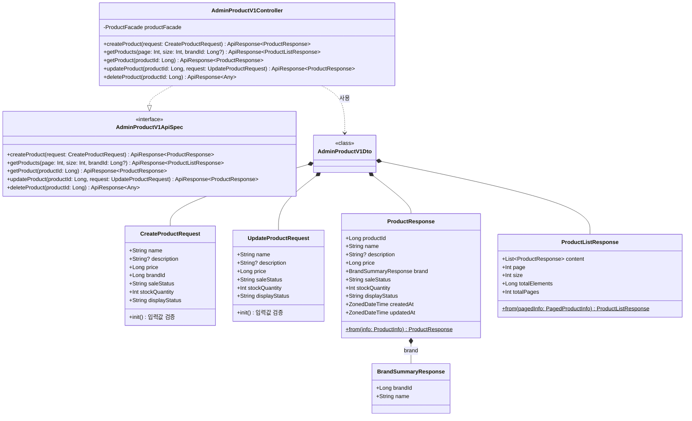
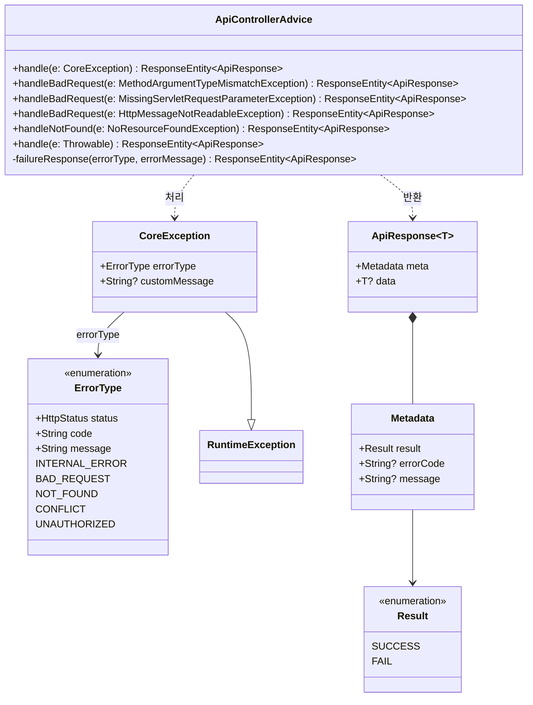

# 브랜드 & 상품 Admin 클래스 다이어그램

## 개요

이 문서는 브랜드 & 상품 Admin API의 클래스 구조를 레이어별 Mermaid 클래스 다이어그램으로 표현합니다.
프로젝트의 레이어드 아키텍처(Interfaces → Application → Domain ← Infrastructure)에 따라
각 레이어의 클래스와 의존 관계를 정의합니다.

---

## 1. 전체 레이어 관계



### 레이어간 의존 방향

```
Interfaces (Controller, DTO)
    ↓ 의존
Application (Facade, Info)
    ↓ 의존
Domain (Model, Service, Repository 인터페이스)
    ↑ 구현
Infrastructure (RepositoryImpl, JpaRepository, Filter)
```

---

## 2. Domain 레이어 상세

### 2.1 엔티티 및 Enum



### 2.2 서비스 및 레포지토리



### 클래스 설명

| 클래스 | 역할 | 주요 메서드 |
|--------|------|-----------|
| `BaseEntity` | 모든 엔티티의 공통 기반 클래스. ID, 생성/수정/삭제 시각을 관리 | `delete()`, `restore()`, `guard()` |
| `BrandModel` | 브랜드 도메인 엔티티. init 블록에서 필드 검증, 비즈니스 메서드 포함 | `updateInfo()`, `isActive()` |
| `ProductModel` | 상품 도메인 엔티티. init 블록에서 필드 검증, 브랜드 ID를 FK로 참조 | `updateInfo()`, `isSelling()`, `isVisible()` |
| `BrandStatus` | 브랜드 활성 상태 (ACTIVE, INACTIVE) | - |
| `SaleStatus` | 상품 판매 상태 (SELLING, STOP_SELLING) | - |
| `DisplayStatus` | 상품 노출 상태 (VISIBLE, HIDDEN) | - |
| `BrandService` | 브랜드 도메인 서비스. CRUD + 중복 검증 로직 | `create()`, `findById()`, `delete()` |
| `ProductService` | 상품 도메인 서비스. CRUD + 브랜드별 연쇄 삭제 로직 | `create()`, `softDeleteAllByBrandId()` |
| `BrandRepository` | 브랜드 영속성 인터페이스 (도메인 계층에 정의) | `existsByName()`, `countProductsByBrandId()` |
| `ProductRepository` | 상품 영속성 인터페이스 (도메인 계층에 정의) | `findAllByBrandId()`, `saveAll()` |

---

## 3. Application 레이어 상세



### 클래스 설명

| 클래스 | 역할 | 핵심 책임 |
|--------|------|----------|
| `BrandFacade` | 브랜드 CRUD 오케스트레이션. 삭제 시 ProductService를 통해 연쇄 삭제 수행 | 브랜드명 중복 검증 조율, 연쇄 삭제 트랜잭션 관리 |
| `ProductFacade` | 상품 CRUD 오케스트레이션. 등록 시 BrandService를 통해 브랜드 존재/활성 검증 | 브랜드 활성 상태 검증, 상품-브랜드 정보 조합 |
| `BrandInfo` | Facade → Controller 간 브랜드 정보 전달 객체. 상품 수(productCount) 포함 | `from()` 팩토리 메서드로 Model → Info 변환 |
| `ProductInfo` | Facade → Controller 간 상품 정보 전달 객체. 브랜드 요약 정보 포함 | `from()` 팩토리 메서드로 Model → Info 변환 |
| `BrandSummary` | 상품 응답에 포함되는 브랜드 요약 정보 (brandId, name만 포함) | ProductInfo의 내부 구성 요소 |

### Facade 의존성 관계

```
BrandFacade
  ├── BrandService    (브랜드 CRUD)
  └── ProductService  (브랜드 삭제 시 소속 상품 연쇄 삭제)

ProductFacade
  ├── ProductService  (상품 CRUD)
  └── BrandService    (상품 등록 시 브랜드 존재/활성 검증, 상품 조회 시 브랜드 정보 조회)
```

---

## 4. Interfaces 레이어 상세

### 4.1 브랜드 API



### 4.2 상품 API



### 클래스 설명

| 클래스 | 역할 |
|--------|------|
| `AdminBrandV1ApiSpec` | 브랜드 어드민 API의 OpenAPI 스펙 인터페이스 (@Tag, @Operation 애노테이션) |
| `AdminBrandV1Controller` | 브랜드 어드민 API 컨트롤러. ApiSpec을 구현하고 BrandFacade에 위임 |
| `AdminProductV1ApiSpec` | 상품 어드민 API의 OpenAPI 스펙 인터페이스 |
| `AdminProductV1Controller` | 상품 어드민 API 컨트롤러. ApiSpec을 구현하고 ProductFacade에 위임 |
| `CreateBrandRequest` | 브랜드 등록 요청 DTO. init 블록에서 name 필수, 길이, logoUrl 형식 검증 |
| `UpdateBrandRequest` | 브랜드 수정 요청 DTO. init 블록에서 name, status 검증 |
| `CreateProductRequest` | 상품 등록 요청 DTO. init 블록에서 name, price 범위, 재고, 상태 값 검증 |
| `UpdateProductRequest` | 상품 수정 요청 DTO. brandId를 포함하지 않음 (브랜드 변경 불가) |
| `BrandResponse` | 브랜드 응답 DTO. productCount 포함 |
| `ProductResponse` | 상품 응답 DTO. 브랜드 요약 정보(BrandSummaryResponse) 포함 |
| `BrandListResponse` | 브랜드 목록 페이징 응답 DTO |
| `ProductListResponse` | 상품 목록 페이징 응답 DTO |

---

## 5. Infrastructure 레이어 상세

```mermaid
classDiagram
    class BrandRepository {
        <<interface>>
        +save(brand: BrandModel) BrandModel
        +findById(id: Long) BrandModel?
        +findAll(pageable: Pageable) Page~BrandModel~
        +existsByName(name: String) Boolean
        +existsByNameAndIdNot(name: String, id: Long) Boolean
        +countProductsByBrandId(brandId: Long) Long
    }

    class BrandRepositoryImpl {
        -BrandJpaRepository brandJpaRepository
        +save(brand: BrandModel) BrandModel
        +findById(id: Long) BrandModel?
        +findAll(pageable: Pageable) Page~BrandModel~
        +existsByName(name: String) Boolean
        +existsByNameAndIdNot(name: String, id: Long) Boolean
        +countProductsByBrandId(brandId: Long) Long
    }

    class BrandJpaRepository {
        <<interface>>
        +existsByNameAndDeletedAtIsNull(name: String) Boolean
        +existsByNameAndIdNotAndDeletedAtIsNull(name: String, id: Long) Boolean
        +findByIdAndDeletedAtIsNull(id: Long) BrandModel?
        +findAllByDeletedAtIsNull(pageable: Pageable) Page~BrandModel~
    }

    class JpaRepository~BrandModel_Long~ {
        <<interface>>
    }

    class ProductRepository {
        <<interface>>
        +save(product: ProductModel) ProductModel
        +findById(id: Long) ProductModel?
        +findAll(pageable: Pageable) Page~ProductModel~
        +findAllByBrandId(brandId: Long, pageable: Pageable) Page~ProductModel~
        +findAllByBrandId(brandId: Long) List~ProductModel~
        +saveAll(products: List~ProductModel~) List~ProductModel~
    }

    class ProductRepositoryImpl {
        -ProductJpaRepository productJpaRepository
        +save(product: ProductModel) ProductModel
        +findById(id: Long) ProductModel?
        +findAll(pageable: Pageable) Page~ProductModel~
        +findAllByBrandId(brandId: Long, pageable: Pageable) Page~ProductModel~
        +findAllByBrandId(brandId: Long) List~ProductModel~
        +saveAll(products: List~ProductModel~) List~ProductModel~
    }

    class ProductJpaRepository {
        <<interface>>
        +findByIdAndDeletedAtIsNull(id: Long) ProductModel?
        +findAllByDeletedAtIsNull(pageable: Pageable) Page~ProductModel~
        +findAllByBrandIdAndDeletedAtIsNull(brandId: Long, pageable: Pageable) Page~ProductModel~
        +findAllByBrandIdAndDeletedAtIsNull(brandId: Long) List~ProductModel~
        +countByBrandIdAndDeletedAtIsNull(brandId: Long) Long
    }

    class JpaRepository~ProductModel_Long~ {
        <<interface>>
    }

    class AdminLdapAuthenticationFilter {
        -ObjectMapper objectMapper
        -String ADMIN_PATH_PREFIX
        -String LDAP_HEADER_NAME
        -String LDAP_HEADER_VALUE
        #shouldNotFilter(request: HttpServletRequest) Boolean
        #doFilterInternal(request, response, filterChain) void
        -writeErrorResponse(response, errorType) void
    }

    class OncePerRequestFilter {
        <<abstract>>
    }

    BrandRepositoryImpl ..|> BrandRepository : 구현
    BrandRepositoryImpl --> BrandJpaRepository : 위임
    BrandJpaRepository --|> JpaRepository~BrandModel_Long~ : 확장

    ProductRepositoryImpl ..|> ProductRepository : 구현
    ProductRepositoryImpl --> ProductJpaRepository : 위임
    ProductJpaRepository --|> JpaRepository~ProductModel_Long~ : 확장

    AdminLdapAuthenticationFilter --|> OncePerRequestFilter : 상속
```



### 클래스 설명

| 클래스 | 역할 |
|--------|------|
| `BrandRepositoryImpl` | BrandRepository 인터페이스의 구현체. BrandJpaRepository에 위임 |
| `BrandJpaRepository` | Spring Data JPA 인터페이스. 소프트 삭제 조건(`deletedAtIsNull`)이 포함된 쿼리 메서드 |
| `ProductRepositoryImpl` | ProductRepository 인터페이스의 구현체. ProductJpaRepository에 위임 |
| `ProductJpaRepository` | Spring Data JPA 인터페이스. 브랜드별 필터링 및 소프트 삭제 조건 포함 |
| `AdminLdapAuthenticationFilter` | 어드민 LDAP 인증 필터. `/api-admin/v1/**` 경로에만 적용, `X-Loopers-Ldap` 헤더 검증 |

### JpaRepository 쿼리 메서드 네이밍 규칙

| 메서드 패턴 | SQL 의미 |
|------------|---------|
| `findByIdAndDeletedAtIsNull(id)` | `WHERE id = ? AND deleted_at IS NULL` |
| `findAllByDeletedAtIsNull(pageable)` | `WHERE deleted_at IS NULL LIMIT ? OFFSET ?` |
| `existsByNameAndDeletedAtIsNull(name)` | `SELECT EXISTS (... WHERE name = ? AND deleted_at IS NULL)` |
| `existsByNameAndIdNotAndDeletedAtIsNull(name, id)` | `SELECT EXISTS (... WHERE name = ? AND id != ? AND deleted_at IS NULL)` |
| `findAllByBrandIdAndDeletedAtIsNull(brandId, pageable)` | `WHERE brand_id = ? AND deleted_at IS NULL LIMIT ? OFFSET ?` |
| `countByBrandIdAndDeletedAtIsNull(brandId)` | `SELECT COUNT(*) WHERE brand_id = ? AND deleted_at IS NULL` |

---

## 6. 에러 처리 구조



### 에러 처리 흐름

```
서비스/퍼사드/DTO에서 CoreException 발생
    → ApiControllerAdvice가 @ExceptionHandler로 캐치
    → ErrorType의 status, code, message를 사용하여 ApiResponse.fail() 생성
    → ResponseEntity에 적절한 HTTP 상태 코드와 함께 반환
```

### 브랜드-상품 Admin에서 사용하는 에러 타입

| ErrorType | 사용 상황 |
|-----------|----------|
| `UNAUTHORIZED` | LDAP 헤더 누락/불일치 |
| `BAD_REQUEST` | 입력값 검증 실패, 비활성 브랜드에 상품 등록 시도 |
| `NOT_FOUND` | 존재하지 않는 브랜드/상품 조회/수정/삭제 |
| `CONFLICT` | 중복 브랜드명으로 등록/수정 시도 |

---

## 7. 도메인 간 관계 다이어그램

```mermaid
classDiagram
    direction LR

    class BrandModel {
        +Long id
        +String name
        +BrandStatus status
    }

    class ProductModel {
        +Long id
        +String name
        +Long price
        +Long brandId
        +SaleStatus saleStatus
        +DisplayStatus displayStatus
    }

    class MemberModel {
        <<existing>>
        +Long id
        +String loginId
    }

    class LikeModel {
        <<future>>
        +Long id
        +Long memberId
        +Long productId
    }

    class OrderModel {
        <<future>>
        +Long id
        +Long memberId
    }

    class OrderItemModel {
        <<future>>
        +Long id
        +Long orderId
        +Long productId
        +String productNameSnapshot
        +Long priceSnapshot
    }

    BrandModel "1" --> "*" ProductModel : 1:N (brandId FK)
    MemberModel "1" --> "*" LikeModel : 1:N (memberId FK)
    ProductModel "1" --> "*" LikeModel : 1:N (productId FK)
    MemberModel "1" --> "*" OrderModel : 1:N (memberId FK)
    OrderModel "1" --> "*" OrderItemModel : 1:N (orderId FK)
    ProductModel "1" --> "*" OrderItemModel : 1:N (productId FK)

    note for OrderItemModel "주문 시점의 상품 정보를\n스냅샷으로 보존\n(productNameSnapshot,\npriceSnapshot)"
```

### 도메인 간 참조 관계

| 관계 | 방향 | 참조 방식 | 설명 |
|------|------|----------|------|
| Brand → Product | 1:N | `ProductModel.brandId` (FK) | 하나의 브랜드에 여러 상품 소속 |
| Product → Like | 1:N | `LikeModel.productId` (FK) | 하나의 상품에 여러 좋아요 (향후 구현) |
| Product → OrderItem | 1:N | `OrderItemModel.productId` (FK) | 하나의 상품이 여러 주문 항목에 포함 (향후 구현) |
| OrderItem (스냅샷) | - | `productNameSnapshot`, `priceSnapshot` | 주문 시점의 상품 정보를 별도 컬럼으로 보존 |

---

## 품질 체크리스트

- [x] 도메인 모델(Model)에 비즈니스 로직과 검증 메서드가 포함되어 있는가? (빈약한 도메인 모델 지양)
  - `BrandModel`: `updateInfo()`, `isActive()`, `validateName()` 등 포함
  - `ProductModel`: `updateInfo()`, `isSelling()`, `isVisible()`, `validatePrice()` 등 포함
- [x] 여러 도메인이 관련된 경우, 도메인 간 참조 관계가 명확히 표현되어 있는가?
  - Brand → Product 1:N 관계, Product → Like/OrderItem 향후 관계 표현
- [x] Facade가 조합하는 여러 Service 의존성이 모두 표현되어 있는가?
  - `BrandFacade` → BrandService + ProductService
  - `ProductFacade` → ProductService + BrandService
- [x] 각 레이어(Domain, Application, Interfaces, Infrastructure)의 클래스가 모두 포함되어 있는가?
- [x] 클래스 간 관계(상속, 구현, 의존, 컴포지션)가 정확히 표현되어 있는가?
  - 상속: `BaseEntity <|-- BrandModel`, `OncePerRequestFilter <|-- AdminLdapAuthenticationFilter`
  - 구현: `BrandRepositoryImpl ..|> BrandRepository`, `AdminBrandV1Controller ..|> AdminBrandV1ApiSpec`
  - 의존: `BrandFacade --> BrandService`, `ProductFacade --> BrandService`
  - 컴포지션: `AdminBrandV1Dto *-- CreateBrandRequest`, `ProductResponse *-- BrandSummaryResponse`
