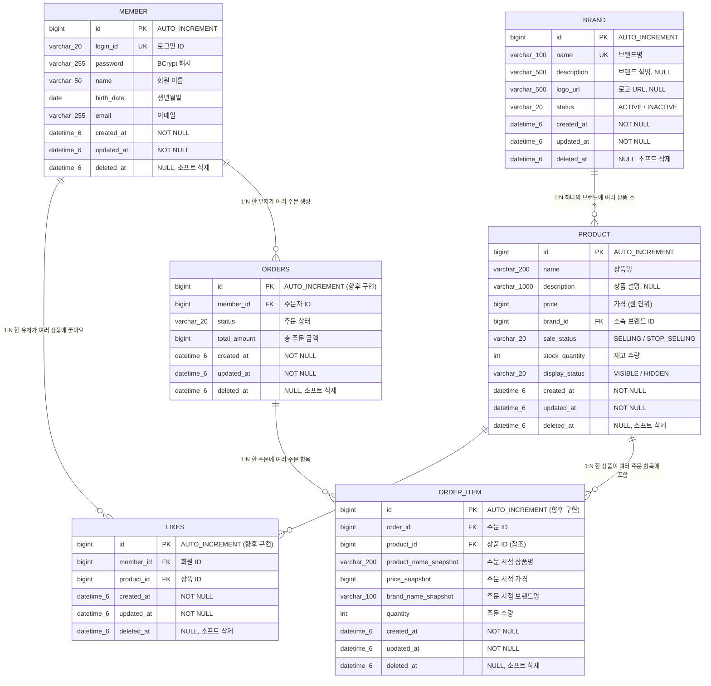

# 브랜드 & 상품 Admin ERD

## 개요

이 문서는 브랜드 & 상품 Admin 기능에 필요한 데이터베이스 테이블 구조를 정의합니다.
기존 `member` 테이블과의 관계, 신규 `brand` 및 `product` 테이블의 상세 명세,
그리고 향후 `like`, `order`, `order_item` 테이블과의 관계를 포함합니다.

**대상 테이블:**
- `brand` (신규): 브랜드 정보
- `product` (신규): 상품 정보
- `member` (기존): 회원 정보 (참고용)

---

## 1. 전체 ERD



---

## 2. 테이블 상세 명세

### 2.1 기존 테이블

#### 테이블명: `member`

회원 정보를 저장합니다. 브랜드-상품 Admin에서 직접 사용하지는 않지만, 향후 좋아요/주문 도메인에서 참조됩니다.

| 컬럼명 | 타입 | Nullable | 제약조건 | 설명 |
|--------|------|----------|---------|------|
| id | BIGINT | NOT NULL | PK, AUTO_INCREMENT | 회원 ID |
| login_id | VARCHAR(20) | NOT NULL | UNIQUE | 로그인 ID |
| password | VARCHAR(255) | NOT NULL | | BCrypt 해시 비밀번호 |
| name | VARCHAR(50) | NOT NULL | | 회원 이름 |
| birth_date | DATE | NOT NULL | | 생년월일 |
| email | VARCHAR(255) | NOT NULL | | 이메일 주소 |
| created_at | DATETIME(6) | NOT NULL | | 생성 시점 |
| updated_at | DATETIME(6) | NOT NULL | | 수정 시점 |
| deleted_at | DATETIME(6) | NULL | | 소프트 삭제 시점 |

---

### 2.2 신규 테이블

#### 테이블명: `brand`

어드민이 관리하는 브랜드 정보를 저장합니다. 브랜드 삭제 시 소프트 삭제(deleted_at 설정)로 처리하며, 소속 상품도 연쇄 소프트 삭제됩니다.

| 컬럼명 | 타입 | Nullable | 제약조건 | 설명 |
|--------|------|----------|---------|------|
| id | BIGINT | NOT NULL | PK, AUTO_INCREMENT | 브랜드 ID |
| name | VARCHAR(100) | NOT NULL | UNIQUE (deleted_at IS NULL 조건부) | 브랜드명 (삭제되지 않은 브랜드 내에서 유일) |
| description | VARCHAR(500) | NULL | | 브랜드 설명 |
| logo_url | VARCHAR(500) | NULL | | 브랜드 로고 URL |
| status | VARCHAR(20) | NOT NULL | DEFAULT 'ACTIVE' | 브랜드 상태 (ACTIVE, INACTIVE) |
| created_at | DATETIME(6) | NOT NULL | | 생성 시점 (BaseEntity) |
| updated_at | DATETIME(6) | NOT NULL | | 수정 시점 (BaseEntity) |
| deleted_at | DATETIME(6) | NULL | | 소프트 삭제 시점 (BaseEntity) |

**Enum 값 정의 - status:**

| 값 | 설명 |
|----|------|
| `ACTIVE` | 활성 상태. 소속 상품이 대고객 API에서 정상 노출 |
| `INACTIVE` | 비활성 상태. 소속 상품이 대고객 API에서 비노출. 신규 상품 등록 불가 |

---

#### 테이블명: `product`

어드민이 관리하는 상품 정보를 저장합니다. 브랜드에 소속되며(brand_id FK), 브랜드 삭제 시 연쇄 소프트 삭제됩니다.

| 컬럼명 | 타입 | Nullable | 제약조건 | 설명 |
|--------|------|----------|---------|------|
| id | BIGINT | NOT NULL | PK, AUTO_INCREMENT | 상품 ID |
| name | VARCHAR(200) | NOT NULL | | 상품명 |
| description | VARCHAR(1000) | NULL | | 상품 설명 |
| price | BIGINT | NOT NULL | CHECK (price >= 0) | 상품 가격 (원 단위, 0 이상) |
| brand_id | BIGINT | NOT NULL | FK → brand.id | 소속 브랜드 ID |
| sale_status | VARCHAR(20) | NOT NULL | | 판매 상태 (SELLING, STOP_SELLING) |
| stock_quantity | INT | NOT NULL | CHECK (stock_quantity >= 0) | 재고 수량 (0 이상) |
| display_status | VARCHAR(20) | NOT NULL | | 노출 상태 (VISIBLE, HIDDEN) |
| created_at | DATETIME(6) | NOT NULL | | 생성 시점 (BaseEntity) |
| updated_at | DATETIME(6) | NOT NULL | | 수정 시점 (BaseEntity) |
| deleted_at | DATETIME(6) | NULL | | 소프트 삭제 시점 (BaseEntity) |

**Enum 값 정의 - sale_status:**

| 값 | 설명 |
|----|------|
| `SELLING` | 판매 중. 대고객 API에서 주문 가능 |
| `STOP_SELLING` | 판매 중지. 대고객 API에서 조회는 가능하지만 주문 불가 |

**Enum 값 정의 - display_status:**

| 값 | 설명 |
|----|------|
| `VISIBLE` | 노출. 대고객 API에서 조회 가능 |
| `HIDDEN` | 숨김. 대고객 API에서 조회 불가, 어드민 API에서만 관리 |

---

### 2.3 향후 구현 테이블 (참고)

브랜드-상품 Admin에서 직접 생성하지는 않지만, 상품 삭제/수정 시 영향을 받는 테이블입니다.

#### 테이블명: `likes` (향후 구현)

유저가 상품에 누른 좋아요 정보를 저장합니다.

| 컬럼명 | 타입 | Nullable | 제약조건 | 설명 |
|--------|------|----------|---------|------|
| id | BIGINT | NOT NULL | PK, AUTO_INCREMENT | 좋아요 ID |
| member_id | BIGINT | NOT NULL | FK → member.id | 좋아요를 누른 회원 ID |
| product_id | BIGINT | NOT NULL | FK → product.id | 좋아요 대상 상품 ID |
| created_at | DATETIME(6) | NOT NULL | | 생성 시점 |
| updated_at | DATETIME(6) | NOT NULL | | 수정 시점 |
| deleted_at | DATETIME(6) | NULL | | 소프트 삭제 시점 |

**UNIQUE 제약**: `(member_id, product_id, deleted_at IS NULL)` - 동일 유저가 동일 상품에 중복 좋아요 방지

---

#### 테이블명: `order_item` (향후 구현)

주문 항목 정보를 저장합니다. 상품 정보를 스냅샷으로 보존하여, 상품이 삭제/수정되더라도 주문 이력에서 원본 정보를 유지합니다.

| 컬럼명 | 타입 | Nullable | 제약조건 | 설명 |
|--------|------|----------|---------|------|
| id | BIGINT | NOT NULL | PK, AUTO_INCREMENT | 주문 항목 ID |
| order_id | BIGINT | NOT NULL | FK → orders.id | 소속 주문 ID |
| product_id | BIGINT | NOT NULL | FK → product.id | 상품 ID (참조용) |
| product_name_snapshot | VARCHAR(200) | NOT NULL | | 주문 시점 상품명 |
| price_snapshot | BIGINT | NOT NULL | | 주문 시점 가격 |
| brand_name_snapshot | VARCHAR(100) | NOT NULL | | 주문 시점 브랜드명 |
| quantity | INT | NOT NULL | CHECK (quantity > 0) | 주문 수량 |
| created_at | DATETIME(6) | NOT NULL | | 생성 시점 |
| updated_at | DATETIME(6) | NOT NULL | | 수정 시점 |
| deleted_at | DATETIME(6) | NULL | | 소프트 삭제 시점 |

**스냅샷 필드 설명**: `product_name_snapshot`, `price_snapshot`, `brand_name_snapshot`은 주문 생성 시점의 상품 정보를 복사하여 저장합니다. 이후 상품이나 브랜드가 수정/삭제되더라도 주문 이력에는 원래 정보가 그대로 남습니다.

---

## 3. 테이블간 관계

### 3.1 핵심 관계 (이번 구현 범위)

| 관계 | 카디널리티 | FK | 삭제 정책 | 설명 |
|------|-----------|----|---------|----|
| brand → product | 1:N | product.brand_id → brand.id | 연쇄 소프트 삭제 | 하나의 브랜드에 여러 상품이 소속됩니다. 브랜드 소프트 삭제 시 소속 상품도 함께 소프트 삭제됩니다. |

### 3.2 참조 관계 (향후 구현 시 영향)

| 관계 | 카디널리티 | FK | 삭제 정책 | 설명 |
|------|-----------|----|---------|----|
| member → likes | 1:N | likes.member_id → member.id | 소프트 삭제 | 한 유저가 여러 상품에 좋아요를 누를 수 있습니다. |
| product → likes | 1:N | likes.product_id → product.id | 소프트 삭제 | 한 상품에 여러 유저가 좋아요를 누를 수 있습니다. 상품 소프트 삭제 시 좋아요 데이터는 보존됩니다. |
| member → orders | 1:N | orders.member_id → member.id | 소프트 삭제 | 한 유저가 여러 주문을 생성할 수 있습니다. |
| orders → order_item | 1:N | order_item.order_id → orders.id | 연쇄 소프트 삭제 | 하나의 주문에 여러 주문 항목이 포함됩니다. |
| product → order_item | 1:N | order_item.product_id → product.id | 참조 유지 | 한 상품이 여러 주문 항목에 포함됩니다. 상품 삭제 시 스냅샷 데이터로 원본 정보를 보존합니다. |

### 3.3 삭제 시나리오별 영향 분석

| 삭제 대상 | 영향 범위 | 처리 방식 |
|----------|----------|----------|
| 브랜드 소프트 삭제 | 소속 상품 전체 | 소속 상품 일괄 소프트 삭제 (단일 트랜잭션) |
| 상품 소프트 삭제 | likes, order_item | likes 데이터 보존 (소프트 삭제된 상품의 좋아요도 유효), order_item 스냅샷으로 원본 정보 유지 |
| 상품 정보 수정 | order_item | order_item의 스냅샷 필드는 변경 없음 (주문 시점 정보 보존) |

---

## 4. 인덱스 설계

### 4.1 brand 테이블

| 인덱스명 | 컬럼 | 타입 | 용도 |
|---------|------|------|------|
| `PRIMARY` | id | PK | 기본 키 |
| `uk_brand_name` | name | UNIQUE (조건부) | 브랜드명 중복 방지. 애플리케이션 레벨에서 `deleted_at IS NULL` 조건과 함께 검증 |
| `idx_brand_deleted_at` | deleted_at | INDEX | 소프트 삭제되지 않은 브랜드 조회 성능 향상 |
| `idx_brand_status` | status | INDEX | 활성/비활성 브랜드 필터링 |

### 4.2 product 테이블

| 인덱스명 | 컬럼 | 타입 | 용도 |
|---------|------|------|------|
| `PRIMARY` | id | PK | 기본 키 |
| `idx_product_brand_id` | brand_id | INDEX | 브랜드별 상품 목록 조회 성능 향상 |
| `idx_product_deleted_at` | deleted_at | INDEX | 소프트 삭제되지 않은 상품 조회 성능 향상 |
| `idx_product_brand_deleted` | brand_id, deleted_at | COMPOSITE INDEX | 브랜드별 활성 상품 조회 (가장 빈번한 쿼리 패턴) |
| `idx_product_sale_status` | sale_status | INDEX | 판매 상태별 상품 필터링 |
| `idx_product_display_status` | display_status | INDEX | 노출 상태별 상품 필터링 (대고객 API에서 VISIBLE 상품만 조회 시 사용) |

### 4.3 인덱스 설계 근거

| 쿼리 패턴 | 사용 인덱스 | 빈도 |
|----------|-----------|------|
| 브랜드 목록 조회 (deleted_at IS NULL) | `idx_brand_deleted_at` | 높음 |
| 브랜드명 중복 확인 (name = ? AND deleted_at IS NULL) | `uk_brand_name` + `idx_brand_deleted_at` | 등록/수정 시 |
| 상품 목록 조회 (deleted_at IS NULL) | `idx_product_deleted_at` | 높음 |
| 브랜드별 상품 조회 (brand_id = ? AND deleted_at IS NULL) | `idx_product_brand_deleted` | 높음 |
| 브랜드별 상품 수 집계 (COUNT WHERE brand_id = ? AND deleted_at IS NULL) | `idx_product_brand_deleted` | 높음 |
| 대고객 API 상품 조회 (display_status = 'VISIBLE' AND deleted_at IS NULL) | `idx_product_display_status` + `idx_product_deleted_at` | 매우 높음 |
| 브랜드 연쇄 삭제 시 상품 일괄 조회 (brand_id = ? AND deleted_at IS NULL) | `idx_product_brand_deleted` | 브랜드 삭제 시 |

---

## 5. DDL 참고 (JPA 자동 생성 기준)

JPA/Hibernate가 엔티티 매핑 기반으로 DDL을 생성합니다. 아래는 참고용이며, 실제 DDL은 JPA의 `@Column`, `@Table` 어노테이션에 의해 결정됩니다.

### brand 테이블

```sql
CREATE TABLE brand (
    id          BIGINT       NOT NULL AUTO_INCREMENT,
    name        VARCHAR(100) NOT NULL,
    description VARCHAR(500) NULL,
    logo_url    VARCHAR(500) NULL,
    status      VARCHAR(20)  NOT NULL DEFAULT 'ACTIVE',
    created_at  DATETIME(6)  NOT NULL,
    updated_at  DATETIME(6)  NOT NULL,
    deleted_at  DATETIME(6)  NULL,
    PRIMARY KEY (id),
    UNIQUE KEY uk_brand_name (name)
) ENGINE=InnoDB DEFAULT CHARSET=utf8mb4;
```

### product 테이블

```sql
CREATE TABLE product (
    id              BIGINT        NOT NULL AUTO_INCREMENT,
    name            VARCHAR(200)  NOT NULL,
    description     VARCHAR(1000) NULL,
    price           BIGINT        NOT NULL,
    brand_id        BIGINT        NOT NULL,
    sale_status     VARCHAR(20)   NOT NULL,
    stock_quantity  INT           NOT NULL,
    display_status  VARCHAR(20)   NOT NULL,
    created_at      DATETIME(6)   NOT NULL,
    updated_at      DATETIME(6)   NOT NULL,
    deleted_at      DATETIME(6)   NULL,
    PRIMARY KEY (id),
    CONSTRAINT fk_product_brand FOREIGN KEY (brand_id) REFERENCES brand(id)
) ENGINE=InnoDB DEFAULT CHARSET=utf8mb4;
```

---

## 품질 체크리스트

- [x] FK 제약 조건으로 참조 무결성이 보장되는가?
  - product.brand_id → brand.id FK 설정
  - 향후 likes, order_item의 FK도 정의
- [x] 연쇄 삭제 또는 소프트 삭제 정책이 비즈니스 규칙과 일치하는가?
  - 브랜드 삭제 시 소속 상품 연쇄 소프트 삭제 (애플리케이션 레벨에서 처리)
  - DB CASCADE DELETE 대신 애플리케이션 소프트 삭제 사용 (데이터 보존)
- [x] UNIQUE 제약 조건으로 데이터 중복이 방지되는가?
  - brand.name UNIQUE (애플리케이션 레벨에서 deleted_at IS NULL 조건부 검증)
  - 향후 likes (member_id, product_id) 복합 UNIQUE
- [x] 스냅샷 데이터와 참조 데이터가 구분되어 있는가?
  - order_item에 product_name_snapshot, price_snapshot, brand_name_snapshot 스냅샷 필드 정의
  - product_id는 참조용으로 유지하되, 실제 표시 정보는 스냅샷에서 조회
- [x] 조회 성능을 위한 인덱스가 적절히 설계되어 있는가?
  - 소프트 삭제 조건 (deleted_at), 브랜드별 상품 조회 (brand_id + deleted_at) 등 주요 쿼리 패턴에 대한 인덱스 설계
- [x] 관련 도메인(유저, 브랜드, 상품, 좋아요, 주문) 테이블 간 관계가 모두 표현되어 있는가?
  - 핵심 관계 (brand → product)와 향후 관계 (likes, orders, order_item) 모두 ERD에 포함
