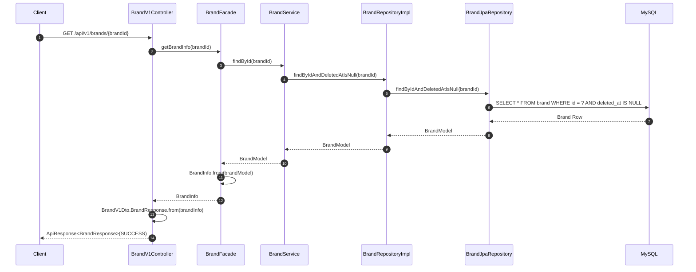
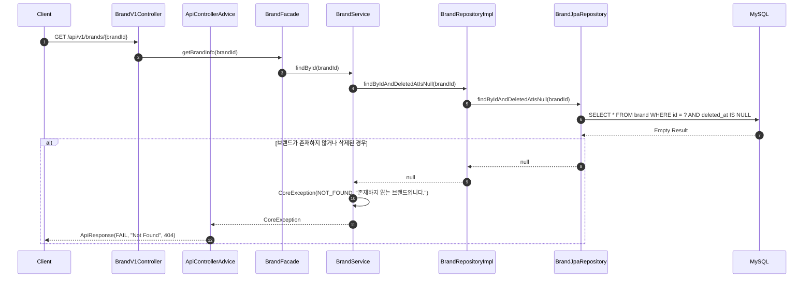
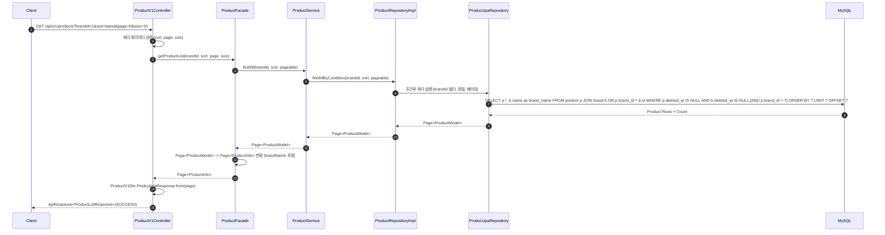
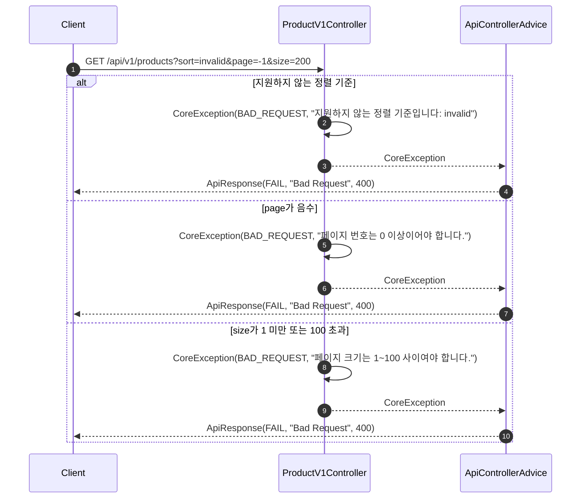
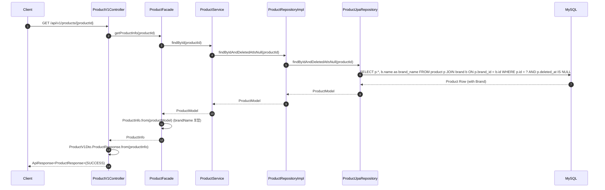
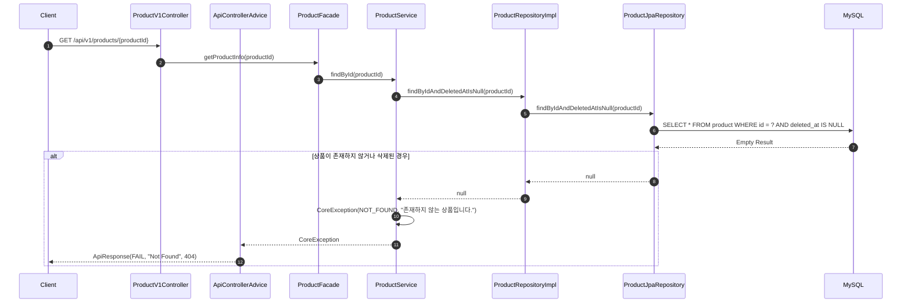

# 브랜드 & 상품 시퀀스 다이어그램

## 개요

이 문서는 브랜드 & 상품 대고객 조회 API의 처리 흐름을 Mermaid 시퀀스 다이어그램으로 표현합니다.
모든 API는 인증이 불필요하므로 인증 필터(HeaderAuthFilter)를 거치지 않습니다.

| API | METHOD | URI |
|-----|--------|-----|
| 브랜드 정보 조회 | GET | `/api/v1/brands/{brandId}` |
| 상품 목록 조회 | GET | `/api/v1/products` |
| 상품 정보 조회 | GET | `/api/v1/products/{productId}` |

---

## 1. 브랜드 정보 조회 - 성공 흐름

### 흐름 설명

1. 클라이언트가 브랜드 ID를 경로 변수로 전달하여 브랜드 정보를 요청합니다.
2. Controller는 Facade에 브랜드 조회를 위임합니다.
3. Facade는 Service를 통해 도메인 모델을 조회합니다.
4. Service는 Repository를 호출하여 `deletedAt`이 null인 브랜드만 조회합니다.
5. Repository는 JPA를 통해 MySQL에서 데이터를 조회합니다.
6. 조회된 BrandModel은 Facade에서 BrandInfo로 변환됩니다.
7. Controller에서 BrandResponse DTO로 변환하여 ApiResponse로 감싸 반환합니다.

---

## 2. 브랜드 정보 조회 - 에러 흐름

### 에러 시나리오

| 조건 | 발생 시점 | 책임 객체 | 에러 타입 | HTTP 상태 |
|------|----------|----------|----------|----------|
| 존재하지 않는 브랜드 ID | DB 조회 결과 null | BrandService | NOT_FOUND | 404 |
| 삭제된 브랜드 (deletedAt != null) | DB 조회 시 필터링됨 (결과 null) | BrandService | NOT_FOUND | 404 |
| brandId가 Long 타입이 아닌 경우 | 파라미터 바인딩 시점 | Spring (MethodArgumentTypeMismatchException) | BAD_REQUEST | 400 |

---

## 3. 상품 목록 조회 - 성공 흐름

### 흐름 설명

1. 클라이언트가 쿼리 파라미터(brandId, sort, page, size)와 함께 상품 목록을 요청합니다.
2. Controller에서 정렬 기준, 페이지 번호, 페이지 크기의 유효성을 검증합니다.
3. Facade를 통해 Service에 조건부 조회를 요청합니다.
4. Repository는 `deletedAt`이 null인 상품만 대상으로, Brand와 JOIN하여 삭제되지 않은 브랜드의 상품만 조회합니다.
5. brandId 필터가 지정된 경우 해당 브랜드의 상품만 필터링합니다.
6. 정렬 기준에 따라 `createdAt DESC`(latest), `price ASC`(price_asc), `likesCount DESC`(likes_desc)로 정렬합니다.
7. Spring Data Page로 페이징 처리된 결과를 반환합니다.
8. Facade에서 ProductModel을 ProductInfo로 변환하며, Brand 관계를 통해 brandName을 포함합니다.
9. Controller에서 ProductListResponse DTO로 변환하여 content, page, size, totalElements, totalPages를 포함한 응답을 반환합니다.

---

## 4. 상품 목록 조회 - 에러 흐름

### 에러 시나리오

| 조건 | 발생 시점 | 책임 객체 | 에러 타입 | HTTP 상태 |
|------|----------|----------|----------|----------|
| 지원하지 않는 정렬 기준 (예: `invalid`) | 쿼리 파라미터 검증 시점 | ProductV1Controller | BAD_REQUEST | 400 |
| page가 음수 | 쿼리 파라미터 검증 시점 | ProductV1Controller | BAD_REQUEST | 400 |
| size가 1 미만 또는 100 초과 | 쿼리 파라미터 검증 시점 | ProductV1Controller | BAD_REQUEST | 400 |
| brandId가 Long 타입이 아닌 경우 | 파라미터 바인딩 시점 | Spring (MethodArgumentTypeMismatchException) | BAD_REQUEST | 400 |

---

## 5. 상품 정보 조회 - 성공 흐름

### 흐름 설명

1. 클라이언트가 상품 ID를 경로 변수로 전달하여 상품 상세 정보를 요청합니다.
2. Controller는 Facade에 상품 조회를 위임합니다.
3. Facade는 Service를 통해 도메인 모델을 조회합니다.
4. Service는 Repository를 호출하여 `deletedAt`이 null인 상품만 조회합니다.
5. JPA는 Brand와 JOIN하여 상품 정보와 브랜드 이름을 함께 조회합니다.
6. 조회된 ProductModel은 Facade에서 ProductInfo로 변환되며, ManyToOne 관계를 통해 brandName이 포함됩니다.
7. Controller에서 ProductResponse DTO로 변환하여 ApiResponse로 감싸 반환합니다.

---

## 6. 상품 정보 조회 - 에러 흐름

### 에러 시나리오

| 조건 | 발생 시점 | 책임 객체 | 에러 타입 | HTTP 상태 |
|------|----------|----------|----------|----------|
| 존재하지 않는 상품 ID | DB 조회 결과 null | ProductService | NOT_FOUND | 404 |
| 삭제된 상품 (deletedAt != null) | DB 조회 시 필터링됨 (결과 null) | ProductService | NOT_FOUND | 404 |
| productId가 Long 타입이 아닌 경우 | 파라미터 바인딩 시점 | Spring (MethodArgumentTypeMismatchException) | BAD_REQUEST | 400 |

---

## 품질 체크리스트

- [x] 각 participant의 책임(검증, 변환, 조회, 저장 등)이 메서드명으로 명확히 드러나는가?
- [x] 여러 도메인이 관련된 경우, 각 도메인의 Service가 별도 participant로 분리되어 있는가? (Brand-Product는 ManyToOne JPA 관계로 처리하므로 별도 Service 호출 불필요)
- [x] 인증 방식(인증 불필요)이 다이어그램에 정확히 반영되어 있는가? (인증 필터 없이 Client → Controller 직접 호출)
- [x] 성공 흐름과 에러 흐름이 모두 포함되어 있는가?
- [x] 에러 시나리오 테이블에 발생 시점과 책임 객체가 명시되어 있는가?
