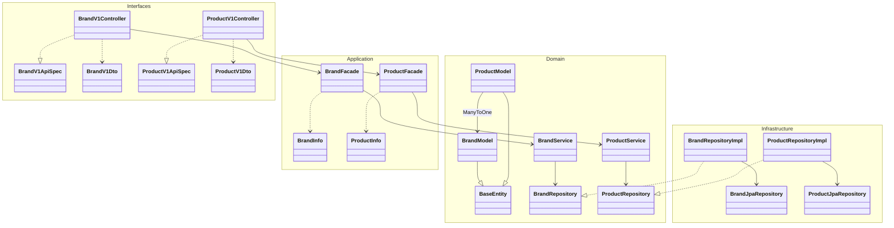
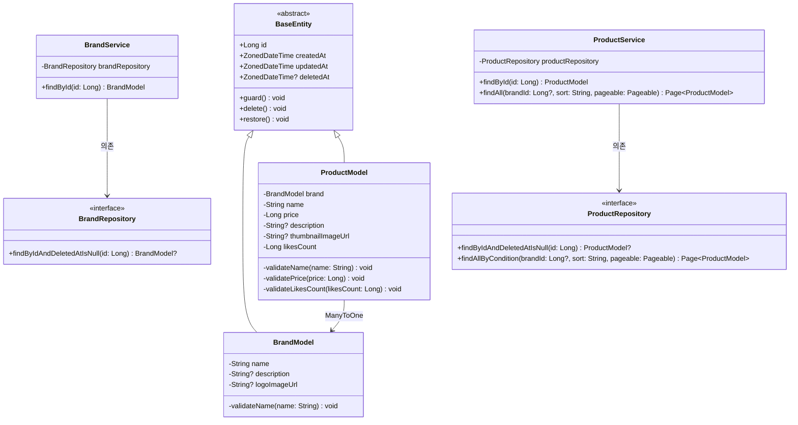
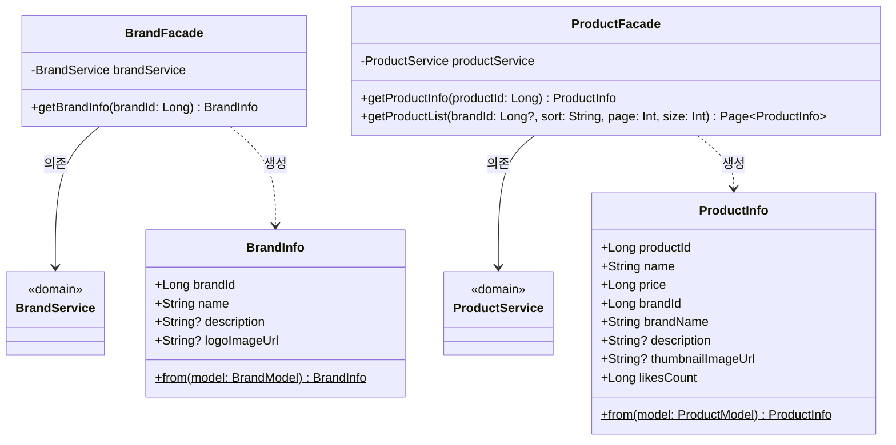
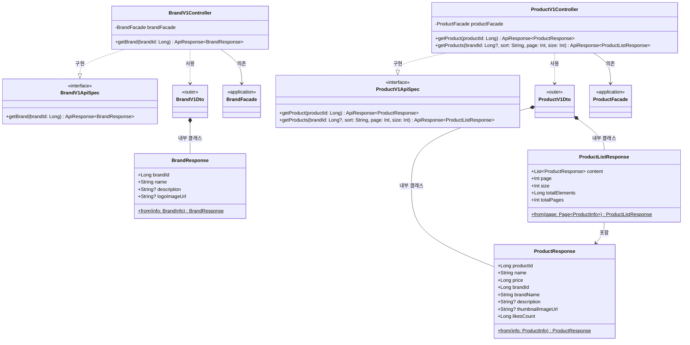
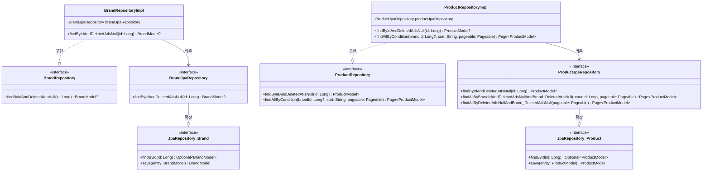
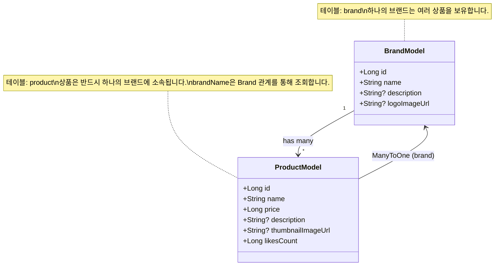

# 브랜드 & 상품 클래스 다이어그램

## 개요

이 문서는 브랜드 & 상품 대고객 조회 API의 레이어별 클래스 구조를 Mermaid 클래스 다이어그램으로 표현합니다.
프로젝트의 기존 패턴(MemberModel, MemberService 등)을 따르며, Brand-Product 간 1:N 관계를 반영합니다.

---

## 1. 전체 레이어 관계



### 레이어 의존 방향

```
Interfaces → Application → Domain ← Infrastructure
```

- **Interfaces**: Controller가 Facade를 호출하고, ApiSpec 인터페이스를 구현합니다.
- **Application**: Facade가 Service를 조합하고, Info DTO로 데이터를 전달합니다.
- **Domain**: Model(엔티티), Service, Repository 인터페이스가 위치합니다. 비즈니스 로직의 핵심입니다.
- **Infrastructure**: Repository 인터페이스의 구현체와 JPA Repository가 위치합니다.

---

## 2. Domain 레이어 상세



### 클래스 설명

| 클래스 | 역할 | 주요 메서드 |
|--------|------|-----------|
| `BaseEntity` | 모든 엔티티의 공통 부모 클래스. id, 생성/수정/삭제 시각을 자동 관리합니다. | `delete()`, `restore()`, `guard()` |
| `BrandModel` | 브랜드 JPA 엔티티. 브랜드명 검증 로직을 포함합니다. | `validateName()` |
| `ProductModel` | 상품 JPA 엔티티. Brand와 ManyToOne 관계를 가지며, 상품명/가격/좋아요수 검증 로직을 포함합니다. | `validateName()`, `validatePrice()`, `validateLikesCount()` |
| `BrandRepository` | 브랜드 Repository 인터페이스. 도메인 레이어에 위치하여 인프라 구현과 분리됩니다. | `findByIdAndDeletedAtIsNull()` |
| `ProductRepository` | 상품 Repository 인터페이스. 조건부 조회(필터, 정렬, 페이징)를 지원합니다. | `findByIdAndDeletedAtIsNull()`, `findAllByCondition()` |
| `BrandService` | 브랜드 도메인 서비스. 브랜드 조회 시 존재하지 않으면 `CoreException(NOT_FOUND)`을 발생시킵니다. | `findById()` |
| `ProductService` | 상품 도메인 서비스. 상품 단건/목록 조회를 담당합니다. | `findById()`, `findAll()` |

---

## 3. Application 레이어 상세



### 클래스 설명

| 클래스 | 역할 | 주요 메서드 |
|--------|------|-----------|
| `BrandFacade` | 브랜드 Service를 호출하고, 결과를 BrandInfo로 변환하여 Controller에 전달합니다. | `getBrandInfo()` |
| `BrandInfo` | Facade와 Controller 사이에서 데이터를 전달하는 DTO입니다. BrandModel로부터 생성됩니다. | `from(BrandModel)` |
| `ProductFacade` | 상품 Service를 호출하고, 결과를 ProductInfo로 변환합니다. Brand 관계를 통해 brandName을 포함합니다. | `getProductInfo()`, `getProductList()` |
| `ProductInfo` | Facade와 Controller 사이에서 데이터를 전달하는 DTO입니다. ProductModel의 Brand 관계에서 brandName을 추출합니다. | `from(ProductModel)` |

---

## 4. Interfaces 레이어 상세



### 클래스 설명

| 클래스 | 역할 | 주요 메서드 |
|--------|------|-----------|
| `BrandV1ApiSpec` | 브랜드 API의 Swagger 문서화를 위한 인터페이스입니다. `@Tag`, `@Operation` 어노테이션을 정의합니다. | `getBrand()` |
| `BrandV1Controller` | 브랜드 REST API 컨트롤러. BrandV1ApiSpec을 구현하고, BrandFacade를 호출합니다. | `getBrand()` |
| `BrandV1Dto` | 브랜드 API의 응답 DTO를 포함하는 외부 클래스입니다. | - |
| `BrandResponse` | 브랜드 조회 응답 DTO. BrandInfo로부터 변환됩니다. | `from(BrandInfo)` |
| `ProductV1ApiSpec` | 상품 API의 Swagger 문서화를 위한 인터페이스입니다. | `getProduct()`, `getProducts()` |
| `ProductV1Controller` | 상품 REST API 컨트롤러. 쿼리 파라미터 검증(sort, page, size) 후 ProductFacade를 호출합니다. | `getProduct()`, `getProducts()` |
| `ProductV1Dto` | 상품 API의 요청/응답 DTO를 포함하는 외부 클래스입니다. | - |
| `ProductResponse` | 상품 단건 조회 응답 DTO. brandName을 포함합니다. | `from(ProductInfo)` |
| `ProductListResponse` | 상품 목록 조회 응답 DTO. Spring Page의 메타 정보(page, size, totalElements, totalPages)와 content를 포함합니다. | `from(Page<ProductInfo>)` |

---

## 5. Infrastructure 레이어 상세



### 클래스 설명

| 클래스 | 역할 | 주요 메서드 |
|--------|------|-----------|
| `BrandRepositoryImpl` | BrandRepository 인터페이스의 구현체. BrandJpaRepository에 위임합니다. | `findByIdAndDeletedAtIsNull()` |
| `BrandJpaRepository` | Spring Data JPA의 `JpaRepository<BrandModel, Long>`을 확장하는 인터페이스입니다. | `findByIdAndDeletedAtIsNull()` |
| `ProductRepositoryImpl` | ProductRepository 인터페이스의 구현체. 정렬 기준에 따라 Pageable을 구성하고 JpaRepository에 위임합니다. | `findByIdAndDeletedAtIsNull()`, `findAllByCondition()` |
| `ProductJpaRepository` | Spring Data JPA의 `JpaRepository<ProductModel, Long>`을 확장하는 인터페이스입니다. deletedAt과 Brand의 deletedAt 필터링을 포함합니다. | `findByIdAndDeletedAtIsNull()`, `findAllByDeletedAtIsNullAndBrand_DeletedAtIsNull()` |

---

## 6. Brand-Product 도메인 관계



---

## 품질 체크리스트

- [x] 도메인 모델(Model)에 비즈니스 로직과 검증 메서드가 포함되어 있는가? (BrandModel: validateName, ProductModel: validateName/validatePrice/validateLikesCount)
- [x] 여러 도메인이 관련된 경우, 도메인 간 참조 관계가 명확히 표현되어 있는가? (ProductModel → BrandModel: ManyToOne)
- [x] Facade가 조합하는 여러 Service 의존성이 모두 표현되어 있는가? (BrandFacade → BrandService, ProductFacade → ProductService)
- [x] 각 레이어(Domain, Application, Interfaces, Infrastructure)의 클래스가 모두 포함되어 있는가?
- [x] 클래스 간 관계(상속, 구현, 의존, 컴포지션)가 정확히 표현되어 있는가?
