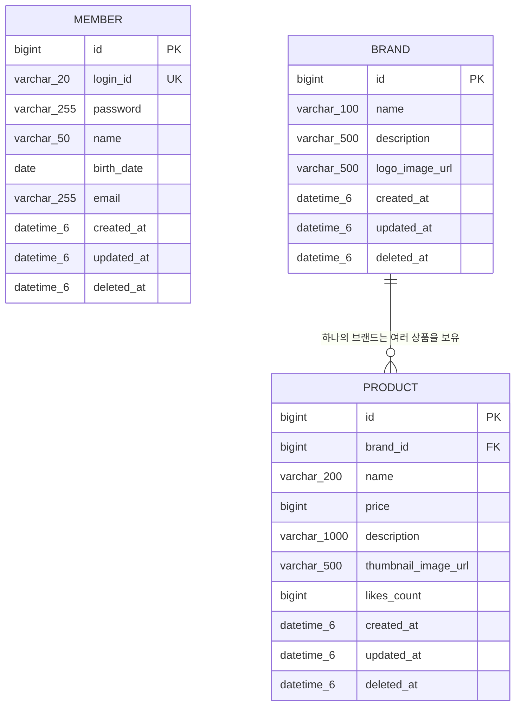

# 브랜드 & 상품 ERD

## 개요

이 문서는 브랜드 & 상품 도메인의 데이터베이스 테이블 구조를 정의합니다.
신규 테이블 `brand`와 `product`를 생성하며, 기존 `member` 테이블과의 관계를 포함한 전체 ERD를 제공합니다.
모든 테이블은 BaseEntity를 상속하여 `id`, `created_at`, `updated_at`, `deleted_at` 공통 컬럼을 포함합니다.

---

## 1. 전체 ERD



---

## 2. 테이블 상세 명세

### 2.1 기존 테이블

#### 테이블명: `member`

| 컬럼명 | 타입 | Nullable | 제약조건 | 설명 |
|--------|------|----------|---------|------|
| `id` | BIGINT | NOT NULL | PK, AUTO_INCREMENT | 회원 고유 식별자 |
| `login_id` | VARCHAR(20) | NOT NULL | UNIQUE | 로그인 ID |
| `password` | VARCHAR(255) | NOT NULL | | BCrypt 해시된 비밀번호 |
| `name` | VARCHAR(50) | NOT NULL | | 회원 이름 |
| `birth_date` | DATE | NOT NULL | | 생년월일 |
| `email` | VARCHAR(255) | NOT NULL | | 이메일 주소 |
| `created_at` | DATETIME(6) | NOT NULL | | 생성 시점 |
| `updated_at` | DATETIME(6) | NOT NULL | | 수정 시점 |
| `deleted_at` | DATETIME(6) | NULL | | 소프트 삭제 시점 |

> member 테이블은 브랜드-상품 도메인과 직접적인 FK 관계는 없으나, 이후 좋아요/주문 기능에서 product 테이블과 연결됩니다.

---

### 2.2 신규 테이블

#### 테이블명: `brand`

| 컬럼명 | 타입 | Nullable | 제약조건 | 설명 |
|--------|------|----------|---------|------|
| `id` | BIGINT | NOT NULL | PK, AUTO_INCREMENT | 브랜드 고유 식별자 |
| `name` | VARCHAR(100) | NOT NULL | | 브랜드명 |
| `description` | VARCHAR(500) | NULL | | 브랜드 설명 |
| `logo_image_url` | VARCHAR(500) | NULL | | 브랜드 로고 이미지 URL |
| `created_at` | DATETIME(6) | NOT NULL | | 생성 시점 |
| `updated_at` | DATETIME(6) | NOT NULL | | 수정 시점 |
| `deleted_at` | DATETIME(6) | NULL | | 소프트 삭제 시점 |

#### 테이블명: `product`

| 컬럼명 | 타입 | Nullable | 제약조건 | 설명 |
|--------|------|----------|---------|------|
| `id` | BIGINT | NOT NULL | PK, AUTO_INCREMENT | 상품 고유 식별자 |
| `brand_id` | BIGINT | NOT NULL | FK → brand.id | 소속 브랜드 ID |
| `name` | VARCHAR(200) | NOT NULL | | 상품명 |
| `price` | BIGINT | NOT NULL | CHECK (price >= 0) | 상품 가격 (원 단위) |
| `description` | VARCHAR(1000) | NULL | | 상품 설명 |
| `thumbnail_image_url` | VARCHAR(500) | NULL | | 상품 대표 이미지 URL |
| `likes_count` | BIGINT | NOT NULL | DEFAULT 0, CHECK (likes_count >= 0) | 좋아요 수 |
| `created_at` | DATETIME(6) | NOT NULL | | 생성 시점 |
| `updated_at` | DATETIME(6) | NOT NULL | | 수정 시점 |
| `deleted_at` | DATETIME(6) | NULL | | 소프트 삭제 시점 |

---

## 3. 테이블간 관계

| 관계 | 카디널리티 | 설명 |
|------|-----------|------|
| `brand` → `product` | 1:N | 하나의 브랜드는 여러 상품을 보유할 수 있습니다. 상품은 반드시 하나의 브랜드에 소속됩니다. |

### 참조 무결성 정책

| FK 관계 | ON DELETE | ON UPDATE | 사유 |
|---------|-----------|-----------|------|
| `product.brand_id` → `brand.id` | RESTRICT | CASCADE | 브랜드 삭제 시 소속 상품이 존재하면 삭제를 차단합니다. 브랜드 삭제는 소프트 삭제(deletedAt 설정)로 처리하며, 실제 물리적 삭제는 소속 상품이 없는 경우에만 허용합니다. |

### 소프트 삭제 정책

| 시나리오 | 처리 방식 |
|----------|----------|
| 브랜드 소프트 삭제 시 | 브랜드의 `deleted_at`을 설정합니다. 소속 상품은 삭제하지 않지만, 대고객 상품 목록 조회 시 삭제된 브랜드의 상품은 제외됩니다. |
| 상품 소프트 삭제 시 | 상품의 `deleted_at`을 설정합니다. 브랜드에는 영향을 주지 않습니다. |
| 대고객 조회 필터링 | 모든 조회 API에서 `deleted_at IS NULL` 조건을 적용합니다. 상품 목록 조회 시 브랜드의 `deleted_at IS NULL` 조건도 함께 적용합니다. |

---

## 4. 인덱스 설계

| 테이블 | 인덱스명 | 컬럼 | 타입 | 용도 |
|--------|---------|------|------|------|
| `product` | `idx_product_brand_id` | `brand_id` | INDEX | 브랜드별 상품 목록 조회 시 성능 향상 |
| `product` | `idx_product_created_at` | `created_at` | INDEX | 최신 등록순(latest) 정렬 조회 성능 향상 |
| `product` | `idx_product_price` | `price` | INDEX | 가격 낮은순(price_asc) 정렬 조회 성능 향상 |
| `product` | `idx_product_likes_count` | `likes_count` | INDEX | 좋아요 많은순(likes_desc) 정렬 조회 성능 향상 |
| `product` | `idx_product_deleted_at` | `deleted_at` | INDEX | 소프트 삭제 필터링 성능 향상 |
| `brand` | `idx_brand_deleted_at` | `deleted_at` | INDEX | 소프트 삭제 필터링 성능 향상 |

### 인덱스 설계 근거

- **`idx_product_brand_id`**: 상품 목록 조회 API에서 `brandId` 필터 사용 시 해당 브랜드의 상품만 빠르게 탐색하기 위해 필요합니다.
- **`idx_product_created_at`**: 기본 정렬 기준인 `latest`(최신 등록순)에서 `ORDER BY created_at DESC`를 효율적으로 처리하기 위해 필요합니다.
- **`idx_product_price`**: `price_asc` 정렬 조회 시 `ORDER BY price ASC`를 효율적으로 처리하기 위해 필요합니다.
- **`idx_product_likes_count`**: `likes_desc` 정렬 조회 시 `ORDER BY likes_count DESC`를 효율적으로 처리하기 위해 필요합니다.
- **`idx_product_deleted_at`**, **`idx_brand_deleted_at`**: 모든 조회 쿼리에서 `deleted_at IS NULL` 조건이 포함되므로, 소프트 삭제 필터링 성능을 확보하기 위해 필요합니다.

---

## 5. 주요 조회 쿼리 패턴

### 브랜드 단건 조회
```sql
SELECT *
FROM brand
WHERE id = :brandId
  AND deleted_at IS NULL;
```

### 상품 단건 조회 (brandName 포함)
```sql
SELECT p.*, b.name AS brand_name
FROM product p
JOIN brand b ON p.brand_id = b.id
WHERE p.id = :productId
  AND p.deleted_at IS NULL;
```

### 상품 목록 조회 (brandId 필터 + 정렬 + 페이징)
```sql
SELECT p.*, b.name AS brand_name
FROM product p
JOIN brand b ON p.brand_id = b.id
WHERE p.deleted_at IS NULL
  AND b.deleted_at IS NULL
  AND (:brandId IS NULL OR p.brand_id = :brandId)
ORDER BY
  CASE :sort
    WHEN 'latest' THEN p.created_at END DESC,
  CASE :sort
    WHEN 'price_asc' THEN p.price END ASC,
  CASE :sort
    WHEN 'likes_desc' THEN p.likes_count END DESC
LIMIT :size OFFSET :page * :size;
```

### 상품 목록 총 개수 조회 (페이징 메타 정보용)
```sql
SELECT COUNT(*)
FROM product p
JOIN brand b ON p.brand_id = b.id
WHERE p.deleted_at IS NULL
  AND b.deleted_at IS NULL
  AND (:brandId IS NULL OR p.brand_id = :brandId);
```

---

## 품질 체크리스트

- [x] FK 제약 조건으로 참조 무결성이 보장되는가? (`product.brand_id` → `brand.id`, RESTRICT)
- [x] 연쇄 삭제 또는 소프트 삭제 정책이 비즈니스 규칙과 일치하는가? (소프트 삭제 사용, 삭제된 브랜드의 상품은 목록에서 제외)
- [x] UNIQUE 제약 조건으로 데이터 중복이 방지되는가? (브랜드-상품 도메인에서는 해당 없음, 이후 좋아요에서 유저+상품 UNIQUE 적용 예정)
- [x] 스냅샷 데이터와 참조 데이터가 구분되어 있는가? (브랜드-상품은 참조 데이터, 이후 주문에서 스냅샷 적용 예정)
- [x] 조회 성능을 위한 인덱스가 적절히 설계되어 있는가? (brand_id, created_at, price, likes_count, deleted_at)
- [x] 관련 도메인(유저, 브랜드, 상품, 좋아요, 주문) 테이블 간 관계가 모두 표현되어 있는가?
