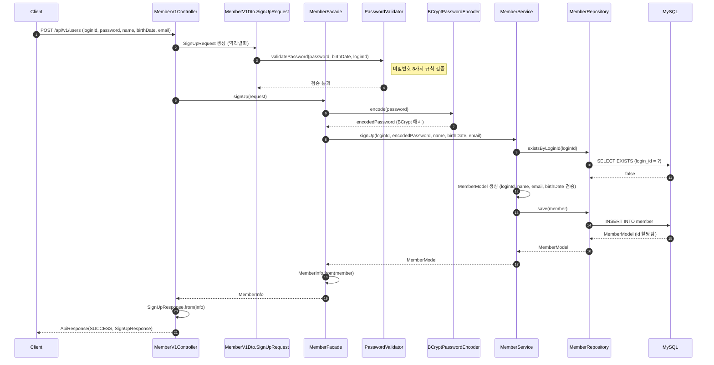
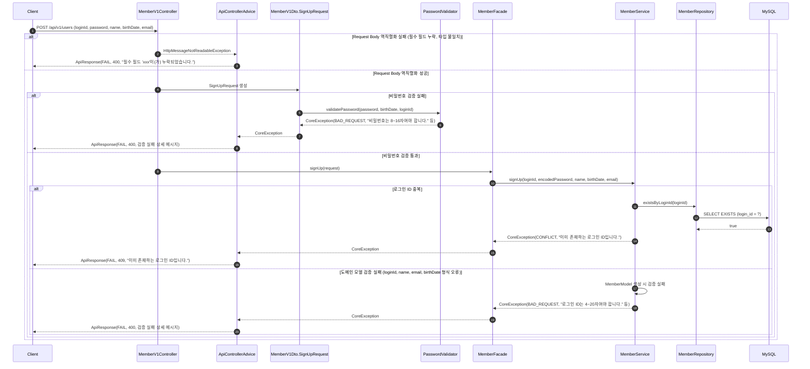
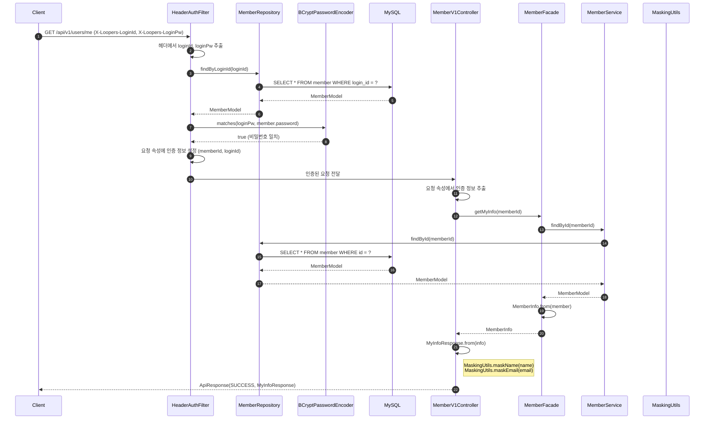
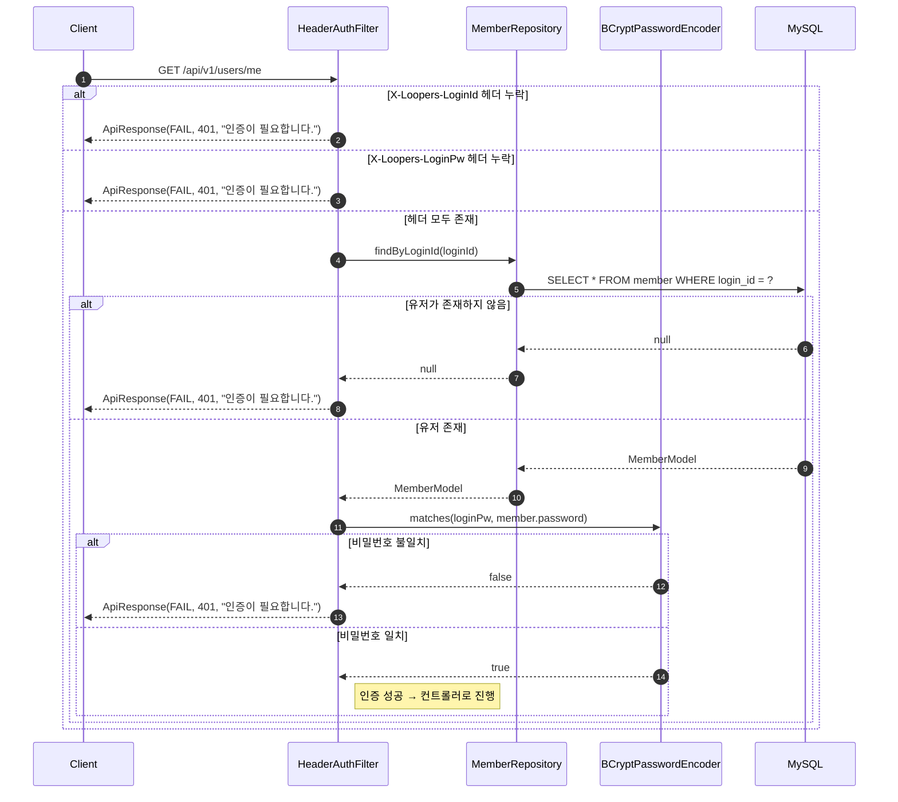
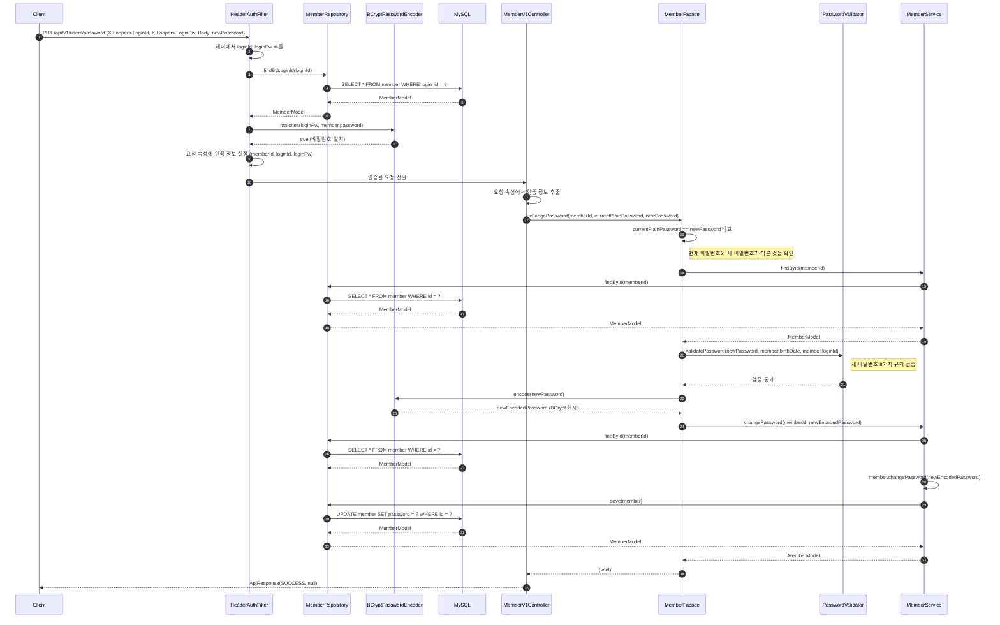
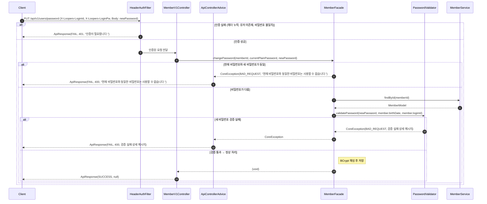

# 유저 시퀀스 다이어그램

## 개요

이 문서는 유저 도메인의 3개 API 엔드포인트에 대한 시퀀스 다이어그램을 정의합니다.
각 API별로 성공 흐름과 에러 흐름을 Mermaid 다이어그램으로 표현하며, 실제 코드베이스의 클래스명과 메서드명을 기반으로 작성되었습니다.

| API | METHOD | URI | 인증 |
|-----|--------|-----|------|
| 회원가입 | POST | `/api/v1/users` | 불필요 |
| 내 정보 조회 | GET | `/api/v1/users/me` | 헤더 인증 필요 |
| 비밀번호 변경 | PUT | `/api/v1/users/password` | 헤더 인증 필요 |

---

## 1. 회원가입 - 성공 흐름

### 흐름 설명

1. 클라이언트가 회원가입 정보를 담아 `POST /api/v1/users`로 요청합니다.
2. 컨트롤러가 Request Body를 `SignUpRequest` DTO로 역직렬화합니다.
3. `SignUpRequest`의 `init` 블록에서 `PasswordValidator.validatePassword()`를 호출하여 비밀번호 규칙(길이, 문자 조합, 연속 문자, 생년월일/로그인ID 포함 여부)을 검증합니다.
4. `MemberFacade`가 비밀번호를 BCrypt로 해싱합니다.
5. `MemberService`가 로그인 ID 중복 여부를 확인하고, `MemberModel`을 생성하여 저장합니다.
6. `MemberModel` 생성자에서 loginId, name, email, birthDate에 대한 형식 검증이 수행됩니다.
7. 저장 결과를 `MemberInfo` -> `SignUpResponse`로 변환하여 클라이언트에게 반환합니다.

---

## 2. 회원가입 - 에러 흐름

### 에러 시나리오

| 조건 | 발생 시점 | 책임 객체 | 에러 타입 | HTTP 상태 |
|------|----------|----------|----------|----------|
| 필수 필드 누락 또는 타입 불일치 | Request Body 역직렬화 | ApiControllerAdvice | BAD_REQUEST | 400 |
| 비밀번호 길이 위반 (8~16자) | SignUpRequest init 블록 | PasswordValidator | BAD_REQUEST | 400 |
| 비밀번호 허용 문자 위반 | SignUpRequest init 블록 | PasswordValidator | BAD_REQUEST | 400 |
| 비밀번호 문자 종류 조합 부족 | SignUpRequest init 블록 | PasswordValidator | BAD_REQUEST | 400 |
| 비밀번호 연속 동일 문자 3개 이상 | SignUpRequest init 블록 | PasswordValidator | BAD_REQUEST | 400 |
| 비밀번호 연속 순서 문자 3개 이상 | SignUpRequest init 블록 | PasswordValidator | BAD_REQUEST | 400 |
| 비밀번호에 생년월일 포함 | SignUpRequest init 블록 | PasswordValidator | BAD_REQUEST | 400 |
| 비밀번호에 로그인 ID 포함 | SignUpRequest init 블록 | PasswordValidator | BAD_REQUEST | 400 |
| 로그인 ID 중복 | MemberService.signUp() | MemberService | CONFLICT | 409 |
| 로그인 ID 형식 위반 (4~20자, 영문 소문자/숫자/언더스코어) | MemberModel 생성자 | MemberModel | BAD_REQUEST | 400 |
| 이름 형식 위반 (2~50자, 한글/영문) | MemberModel 생성자 | MemberModel | BAD_REQUEST | 400 |
| 이메일 형식 위반 | MemberModel 생성자 | MemberModel | BAD_REQUEST | 400 |
| 생년월일이 미래 날짜 | MemberModel 생성자 | MemberModel | BAD_REQUEST | 400 |

---

## 3. 내 정보 조회 - 성공 흐름

### 흐름 설명

1. 클라이언트가 `X-Loopers-LoginId`와 `X-Loopers-LoginPw` 헤더를 포함하여 `GET /api/v1/users/me`로 요청합니다.
2. `HeaderAuthenticationFilter`가 헤더에서 로그인 ID와 비밀번호를 추출합니다.
3. 로그인 ID로 유저를 조회하고, 평문 비밀번호를 BCrypt 해시와 매칭하여 인증합니다.
4. 인증 성공 시 유저 정보(memberId, loginId)를 요청 속성에 설정하고 필터 체인을 진행합니다.
5. 컨트롤러가 요청 속성에서 인증 정보를 추출하여 `MemberFacade.getMyInfo()`를 호출합니다.
6. Facade가 Service를 통해 유저를 조회하고 `MemberInfo`로 변환합니다.
7. `MyInfoResponse.from()`에서 `MaskingUtils`를 사용하여 이름과 이메일을 마스킹한 뒤 응답합니다.

---

## 4. 내 정보 조회 - 에러 흐름

### 에러 시나리오

| 조건 | 발생 시점 | 책임 객체 | 에러 타입 | HTTP 상태 |
|------|----------|----------|----------|----------|
| `X-Loopers-LoginId` 헤더 누락 | 헤더 추출 단계 | HeaderAuthFilter | UNAUTHORIZED | 401 |
| `X-Loopers-LoginPw` 헤더 누락 | 헤더 추출 단계 | HeaderAuthFilter | UNAUTHORIZED | 401 |
| 로그인 ID에 해당하는 유저 없음 | 유저 조회 단계 | HeaderAuthFilter | UNAUTHORIZED | 401 |
| 비밀번호 불일치 | 비밀번호 매칭 단계 | HeaderAuthFilter | UNAUTHORIZED | 401 |

> 보안을 위해 모든 인증 실패 케이스에서 동일한 에러 메시지("인증이 필요합니다.")를 반환하여, 공격자가 유저 존재 여부나 비밀번호 일치 여부를 추론할 수 없도록 합니다.

---

## 5. 비밀번호 변경 - 성공 흐름

### 흐름 설명

1. 클라이언트가 인증 헤더와 새 비밀번호를 포함하여 `PUT /api/v1/users/password`로 요청합니다.
2. `HeaderAuthenticationFilter`가 헤더 기반 인증을 수행합니다 (내 정보 조회와 동일한 인증 과정).
3. 인증 성공 시 현재 비밀번호(평문)도 함께 요청 속성에 설정합니다.
4. 컨트롤러가 `MemberFacade.changePassword()`를 호출합니다.
5. Facade에서 현재 비밀번호(평문)와 새 비밀번호의 동일 여부를 먼저 검사합니다.
6. 유저를 조회한 뒤, `PasswordValidator`로 새 비밀번호의 유효성을 검증합니다.
7. 새 비밀번호를 BCrypt로 해싱하고, `MemberService.changePassword()`를 통해 저장합니다.
8. `MemberModel.changePassword()`가 엔티티의 비밀번호 필드를 갱신하고, Repository가 DB에 반영합니다.

---

## 6. 비밀번호 변경 - 에러 흐름

### 에러 시나리오

| 조건 | 발생 시점 | 책임 객체 | 에러 타입 | HTTP 상태 |
|------|----------|----------|----------|----------|
| 인증 헤더 누락 | HeaderAuthFilter | HeaderAuthFilter | UNAUTHORIZED | 401 |
| 유저 미존재 | HeaderAuthFilter | HeaderAuthFilter | UNAUTHORIZED | 401 |
| 비밀번호 불일치 | HeaderAuthFilter | HeaderAuthFilter | UNAUTHORIZED | 401 |
| 현재 비밀번호와 새 비밀번호 동일 | MemberFacade.changePassword() | MemberFacade | BAD_REQUEST | 400 |
| 새 비밀번호 길이 위반 | PasswordValidator.validatePassword() | PasswordValidator | BAD_REQUEST | 400 |
| 새 비밀번호 허용 문자 위반 | PasswordValidator.validatePassword() | PasswordValidator | BAD_REQUEST | 400 |
| 새 비밀번호 문자 종류 조합 부족 | PasswordValidator.validatePassword() | PasswordValidator | BAD_REQUEST | 400 |
| 새 비밀번호 연속 동일 문자 | PasswordValidator.validatePassword() | PasswordValidator | BAD_REQUEST | 400 |
| 새 비밀번호 연속 순서 문자 | PasswordValidator.validatePassword() | PasswordValidator | BAD_REQUEST | 400 |
| 새 비밀번호에 생년월일 포함 | PasswordValidator.validatePassword() | PasswordValidator | BAD_REQUEST | 400 |
| 새 비밀번호에 로그인 ID 포함 | PasswordValidator.validatePassword() | PasswordValidator | BAD_REQUEST | 400 |

---

## 품질 체크리스트

- [x] 각 participant의 책임(검증, 변환, 조회, 저장 등)이 메서드명으로 명확히 드러나는가?
- [x] 여러 도메인이 관련된 경우, 각 도메인의 Service가 별도 participant로 분리되어 있는가?
- [x] 인증 방식(헤더 기반)이 다이어그램에 정확히 반영되어 있는가?
- [x] 성공 흐름과 에러 흐름이 모두 포함되어 있는가?
- [x] 에러 시나리오 테이블에 발생 시점과 책임 객체가 명시되어 있는가?
