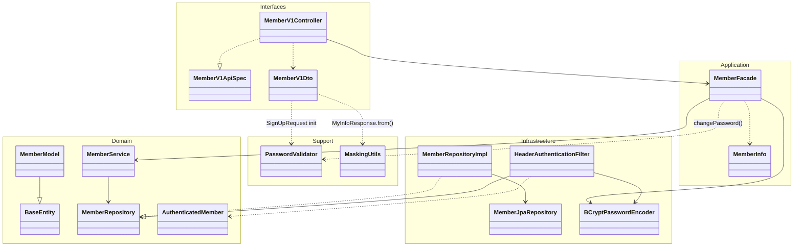
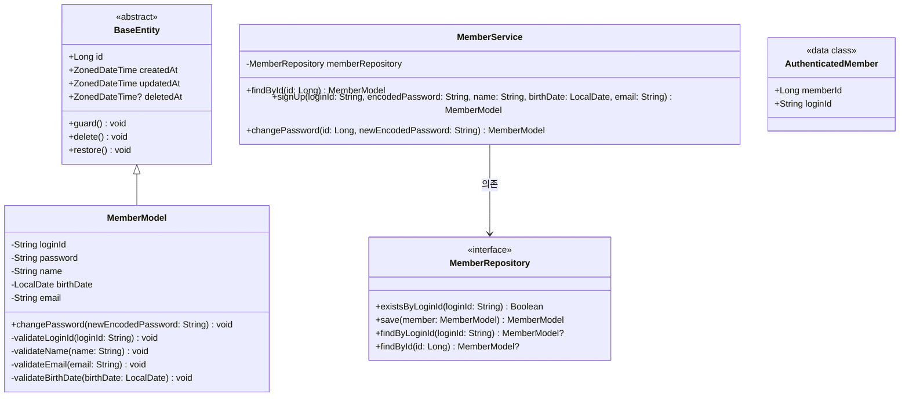
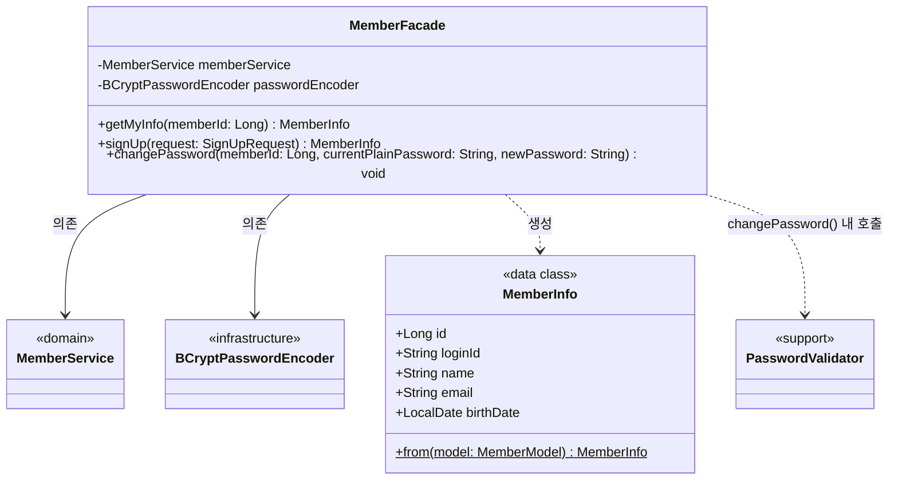
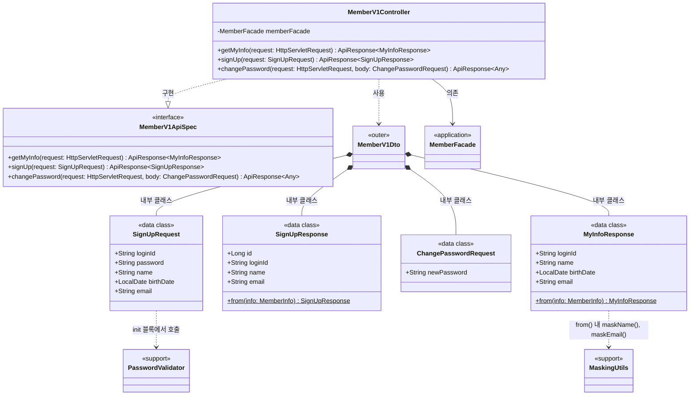
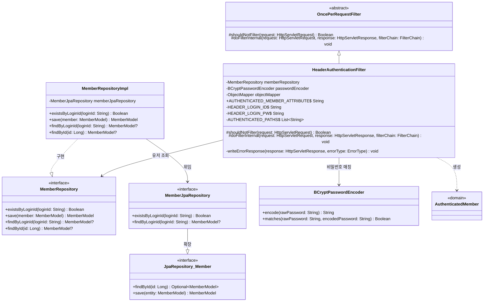
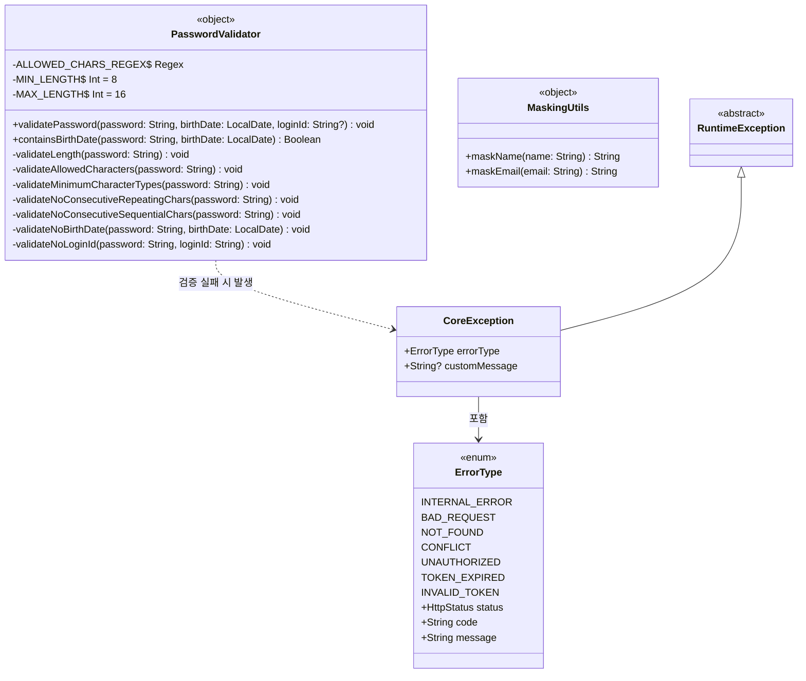

# 유저 클래스 다이어그램

## 개요

이 문서는 유저 도메인의 레이어별 클래스 구조를 Mermaid 클래스 다이어그램으로 표현합니다.
Round2에서는 기존 `member` 패키지 구조를 유지하면서, 인증 방식을 JWT에서 헤더 기반으로 변경하는 것이 핵심입니다.
API 경로는 `/api/v1/users`로 변경되지만, 내부 클래스명은 `Member*` 네이밍을 유지합니다.

---

## 1. 전체 레이어 관계



### 레이어 의존 방향

```
Interfaces → Application → Domain ← Infrastructure
                                  ← Support (유틸리티)
```

- **Interfaces**: Controller가 Facade를 호출하고, ApiSpec 인터페이스를 구현합니다.
- **Application**: Facade가 Service와 BCryptPasswordEncoder를 조합하고, Info DTO로 데이터를 전달합니다.
- **Domain**: Model(엔티티), Service, Repository 인터페이스, AuthenticatedMember가 위치합니다.
- **Infrastructure**: HeaderAuthenticationFilter, Repository 구현체, JPA Repository, BCryptPasswordEncoder가 위치합니다.
- **Support**: PasswordValidator, MaskingUtils 등 도메인에 종속되지 않는 유틸리티가 위치합니다.

---

## 2. Domain 레이어 상세



### 클래스 설명

| 클래스 | 역할 | 주요 메서드 |
|--------|------|-----------|
| `BaseEntity` | 모든 엔티티의 공통 부모 클래스. id, 생성/수정/삭제 시각을 자동 관리합니다. `@PrePersist`와 `@PreUpdate`에서 타임스탬프를 갱신합니다. | `delete()`, `restore()`, `guard()` |
| `MemberModel` | 회원 JPA 엔티티(테이블: `member`). 생성자에서 loginId, name, email, birthDate의 형식을 검증하며, 비밀번호 변경 비즈니스 메서드를 포함합니다. | `changePassword()`, `validateLoginId()`, `validateName()`, `validateEmail()`, `validateBirthDate()` |
| `MemberRepository` | 회원 Repository 인터페이스. 도메인 레이어에 위치하여 인프라 구현과 분리됩니다. | `existsByLoginId()`, `save()`, `findByLoginId()`, `findById()` |
| `MemberService` | 회원 도메인 서비스. 회원 조회, 가입(중복 검사 포함), 비밀번호 변경을 담당합니다. 조회 실패 시 `CoreException(NOT_FOUND)`을 발생시킵니다. | `findById()`, `signUp()`, `changePassword()` |
| `AuthenticatedMember` | 인증 필터에서 검증된 유저 정보를 컨트롤러로 전달하는 데이터 클래스입니다. 요청 속성(attribute)으로 설정됩니다. | - |

### MemberModel 검증 규칙

| 검증 메서드 | 대상 필드 | 규칙 |
|------------|----------|------|
| `validateLoginId()` | loginId | 비어있지 않을 것, 4~20자, 영문 소문자/숫자/언더스코어만 허용 (`^[a-z0-9_]+$`) |
| `validateName()` | name | 비어있지 않을 것, 2~50자, 한글 또는 영문만 허용 (`^[가-힣a-zA-Z\\s]+$`) |
| `validateEmail()` | email | 비어있지 않을 것, 이메일 형식 (`^[a-zA-Z0-9._%+-]+@[a-zA-Z0-9.-]+\\.[a-zA-Z]{2,}$`) |
| `validateBirthDate()` | birthDate | 미래 날짜 불가 |

---

## 3. Application 레이어 상세



### 클래스 설명

| 클래스 | 역할 | 주요 메서드 |
|--------|------|-----------|
| `MemberFacade` | 회원 관련 비즈니스 로직을 조합합니다. MemberService로 도메인 로직을 실행하고, BCryptPasswordEncoder로 비밀번호를 해싱/검증하며, PasswordValidator로 새 비밀번호를 검증합니다. | `getMyInfo()`, `signUp()`, `changePassword()` |
| `MemberInfo` | Facade와 Controller 사이에서 데이터를 전달하는 DTO입니다. MemberModel로부터 `from()` 팩토리 메서드로 생성됩니다. | `from(MemberModel)` |

### MemberFacade 메서드별 책임

| 메서드 | 책임 |
|--------|------|
| `getMyInfo(memberId)` | Service에서 유저 조회 -> MemberInfo로 변환 |
| `signUp(request)` | 비밀번호 BCrypt 해싱 -> Service에서 중복 검사 및 저장 -> MemberInfo로 변환 |
| `changePassword(memberId, currentPlainPassword, newPassword)` | 현재/새 비밀번호 동일 여부 검사 -> 유저 조회 -> PasswordValidator로 새 비밀번호 검증 -> BCrypt 해싱 -> Service에서 저장 |

---

## 4. Interfaces 레이어 상세



### 클래스 설명

| 클래스 | 역할 | 주요 메서드 |
|--------|------|-----------|
| `MemberV1ApiSpec` | 회원 API의 Swagger 문서화를 위한 인터페이스입니다. `@Tag`, `@Operation` 어노테이션을 정의합니다. | `getMyInfo()`, `signUp()`, `changePassword()` |
| `MemberV1Controller` | 회원 REST API 컨트롤러(`@RequestMapping("/api/v1/users")`). MemberV1ApiSpec을 구현하고, MemberFacade를 호출합니다. 인증이 필요한 엔드포인트에서는 요청 속성에서 `AuthenticatedMember`를 추출합니다. | `getMyInfo()`, `signUp()`, `changePassword()` |
| `MemberV1Dto` | 회원 API의 요청/응답 DTO를 포함하는 외부 클래스입니다. | - |
| `SignUpRequest` | 회원가입 요청 DTO. `init` 블록에서 `PasswordValidator.validatePassword()`를 호출하여 비밀번호를 검증합니다. | - |
| `SignUpResponse` | 회원가입 응답 DTO. MemberInfo로부터 id, loginId, name, email을 추출합니다. | `from(MemberInfo)` |
| `ChangePasswordRequest` | 비밀번호 변경 요청 DTO. Round2에서는 `newPassword`만 포함합니다 (현재 비밀번호는 인증 헤더로 전달). | - |
| `MyInfoResponse` | 내 정보 조회 응답 DTO. `MaskingUtils`를 사용하여 이름과 이메일을 마스킹합니다. | `from(MemberInfo)` |

### Round1 대비 변경 사항

| 항목 | Round1 | Round2 |
|------|--------|--------|
| `@RequestMapping` | `/api/v1/members` | `/api/v1/users` |
| 회원가입 매핑 | `@PostMapping("/sign-up")` | `@PostMapping` (루트) |
| 비밀번호 변경 매핑 | `@PatchMapping("/me/password")` | `@PutMapping("/password")` |
| `ChangePasswordRequest` 필드 | currentPassword, newPassword | newPassword만 |
| 인증 정보 추출 | `JwtAuthenticationFilter.AUTHENTICATED_MEMBER_ATTRIBUTE` | `HeaderAuthenticationFilter.AUTHENTICATED_MEMBER_ATTRIBUTE` |

---

## 5. Infrastructure 레이어 상세



### 클래스 설명

| 클래스 | 역할 | 주요 메서드 |
|--------|------|-----------|
| `MemberRepositoryImpl` | MemberRepository 인터페이스의 구현체. MemberJpaRepository에 위임합니다. `findById()`는 `Optional`을 nullable로 변환합니다. | `existsByLoginId()`, `save()`, `findByLoginId()`, `findById()` |
| `MemberJpaRepository` | Spring Data JPA의 `JpaRepository<MemberModel, Long>`을 확장하는 인터페이스입니다. Spring Data가 쿼리 메서드를 자동 생성합니다. | `existsByLoginId()`, `findByLoginId()` |
| `BCryptPasswordEncoder` | BCrypt 알고리즘으로 비밀번호를 해싱하고 매칭합니다. `org.mindrot.jbcrypt.BCrypt`를 사용합니다. | `encode()`, `matches()` |
| `HeaderAuthenticationFilter` | (신규) HTTP 헤더 기반 인증 필터. `X-Loopers-LoginId`와 `X-Loopers-LoginPw` 헤더로 유저를 인증합니다. 기존 `JwtAuthenticationFilter`를 대체합니다. | `shouldNotFilter()`, `doFilterInternal()`, `writeErrorResponse()` |

### HeaderAuthenticationFilter 상세 설계

| 상수/필드 | 값 | 설명 |
|----------|-----|------|
| `HEADER_LOGIN_ID` | `"X-Loopers-LoginId"` | 로그인 ID 헤더명 |
| `HEADER_LOGIN_PW` | `"X-Loopers-LoginPw"` | 비밀번호 헤더명 |
| `AUTHENTICATED_PATHS` | `["/api/v1/users/me", "/api/v1/users/password"]` | 인증이 필요한 경로 목록 |
| `AUTHENTICATED_MEMBER_ATTRIBUTE` | `"authenticatedMember"` | 요청 속성에 설정되는 인증 정보의 키 |

---

## 6. Support 레이어 상세



### 클래스 설명

| 클래스 | 역할 | 주요 메서드 |
|--------|------|-----------|
| `PasswordValidator` | Kotlin `object`(싱글턴). 비밀번호의 7가지 검증 규칙을 담당합니다. 검증 실패 시 `CoreException(BAD_REQUEST)`을 발생시킵니다. | `validatePassword()`, `containsBirthDate()` |
| `MaskingUtils` | Kotlin `object`(싱글턴). 개인정보(이름, 이메일) 마스킹을 담당합니다. | `maskName()`, `maskEmail()` |
| `CoreException` | 비즈니스 예외를 표현하는 커스텀 예외 클래스입니다. `ErrorType`과 선택적 커스텀 메시지를 포함합니다. | - |
| `ErrorType` | HTTP 상태 코드, 에러 코드, 기본 메시지를 정의하는 열거형입니다. `ApiControllerAdvice`에서 에러 응답 생성에 사용됩니다. | - |

---

## 품질 체크리스트

- [x] 도메인 모델(Model)에 비즈니스 로직과 검증 메서드가 포함되어 있는가? (MemberModel: changePassword, validateLoginId, validateName, validateEmail, validateBirthDate)
- [x] 여러 도메인이 관련된 경우, 도메인 간 참조 관계가 명확히 표현되어 있는가? (유저 도메인은 단일 도메인이므로 해당 없음)
- [x] Facade가 조합하는 여러 Service 의존성이 모두 표현되어 있는가? (MemberFacade -> MemberService, BCryptPasswordEncoder, PasswordValidator)
- [x] 각 레이어(Domain, Application, Interfaces, Infrastructure, Support)의 클래스가 모두 포함되어 있는가?
- [x] 클래스 간 관계(상속, 구현, 의존, 컴포지션)가 정확히 표현되어 있는가?
