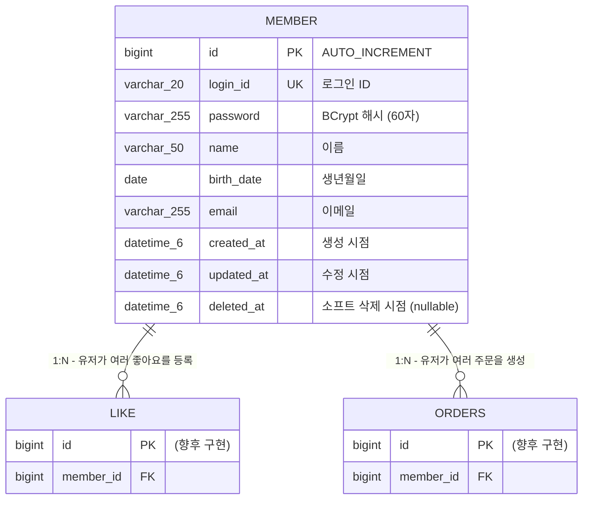

# 유저 ERD

## 개요

이 문서는 유저 도메인의 데이터베이스 테이블 구조를 Mermaid ERD와 상세 명세로 표현합니다.
유저 도메인은 단일 `member` 테이블로 구성되며, Round2에서는 테이블 구조 변경 없이 기존 스키마를 그대로 사용합니다.
향후 좋아요, 주문 등 다른 도메인 테이블에서 `member.id`를 FK로 참조하게 됩니다.

---

## 1. 전체 ERD

> `LIKE`와 `ORDERS` 테이블은 유저 테이블과의 관계를 시각적으로 표현하기 위한 것으로, 상세 스키마는 해당 도메인의 ERD 문서에서 정의됩니다.

---

## 2. 테이블 상세 명세

### 2.1 테이블명: `member`

회원 정보를 저장하는 테이블입니다. `BaseEntity`를 상속하여 공통 컬럼(id, created_at, updated_at, deleted_at)을 포함합니다.

| 컬럼명 | 타입 | Nullable | 제약조건 | 설명 |
|--------|------|----------|---------|------|
| `id` | BIGINT | NOT NULL | PK, AUTO_INCREMENT | 기본 키 |
| `login_id` | VARCHAR(20) | NOT NULL | UNIQUE | 로그인 ID. 4~20자, 영문 소문자/숫자/언더스코어만 허용 |
| `password` | VARCHAR(255) | NOT NULL | | BCrypt로 해싱된 비밀번호 (해시 결과 60자) |
| `name` | VARCHAR(50) | NOT NULL | | 이름. 2~50자, 한글 또는 영문 |
| `birth_date` | DATE | NOT NULL | | 생년월일. 미래 날짜 불가 |
| `email` | VARCHAR(255) | NOT NULL | | 이메일 주소 |
| `created_at` | DATETIME(6) | NOT NULL | | 생성 시점. @PrePersist에서 자동 설정 |
| `updated_at` | DATETIME(6) | NOT NULL | | 최종 수정 시점. @PreUpdate에서 자동 설정 |
| `deleted_at` | DATETIME(6) | NULL | | 소프트 삭제 시점. NULL이면 활성 상태 |

### JPA 어노테이션 매핑

| 컬럼명 | JPA 어노테이션 | 비고 |
|--------|--------------|------|
| `id` | `@Id @GeneratedValue(strategy = GenerationType.IDENTITY)` | BaseEntity에서 상속 |
| `login_id` | `@Column(name = "login_id", nullable = false, unique = true, length = 20)` | UNIQUE 제약 |
| `password` | `@Column(name = "password", nullable = false)` | 기본 length = 255 |
| `name` | `@Column(name = "name", nullable = false, length = 50)` | |
| `birth_date` | `@Column(name = "birth_date", nullable = false)` | LocalDate -> DATE |
| `email` | `@Column(name = "email", nullable = false)` | 기본 length = 255 |
| `created_at` | `@Column(name = "created_at", nullable = false, updatable = false)` | BaseEntity에서 상속 |
| `updated_at` | `@Column(name = "updated_at", nullable = false)` | BaseEntity에서 상속 |
| `deleted_at` | `@Column(name = "deleted_at")` | BaseEntity에서 상속, nullable |

---

## 3. 테이블간 관계

### 현재 관계 (유저 도메인 단독)

유저 도메인은 현재 단일 `member` 테이블로 구성되며, 자체적으로 다른 테이블과의 FK 관계가 없습니다.

### 향후 관계 (다른 도메인에서 참조)

| 참조 테이블 | 관계 | FK 컬럼 | 설명 |
|------------|------|---------|------|
| `like` | member 1:N like | `member_id` -> `member.id` | 한 유저가 여러 상품에 좋아요를 등록할 수 있습니다 |
| `orders` | member 1:N orders | `member_id` -> `member.id` | 한 유저가 여러 주문을 생성할 수 있습니다 |

> 참조하는 테이블의 상세 스키마는 각 도메인의 ERD 문서(`docs/좋아요/04-erd.md`, `docs/주문/04-erd.md`)에서 정의됩니다.

---

## 4. 인덱스 설계

| 테이블 | 인덱스명 | 컬럼 | 타입 | 용도 |
|--------|---------|------|------|------|
| `member` | PK (자동) | `id` | PRIMARY KEY | 기본 키 조회 |
| `member` | UK (자동) | `login_id` | UNIQUE INDEX | 로그인 ID 중복 방지 및 로그인 시 유저 조회 |

### 인덱스 설계 근거

1. **`login_id` UNIQUE INDEX**: `@Column(unique = true)`에 의해 자동 생성됩니다. 두 가지 용도로 사용됩니다.
   - **회원가입 시 중복 검사**: `MemberRepository.existsByLoginId(loginId)` -> `SELECT EXISTS`
   - **헤더 기반 인증 시 유저 조회**: `MemberRepository.findByLoginId(loginId)` -> `SELECT * WHERE login_id = ?`

2. **`email` 인덱스 미설계**: 현재 이메일로 유저를 조회하는 기능이 없으므로 별도 인덱스를 설계하지 않습니다. 향후 이메일 기반 기능(중복 검사, 비밀번호 찾기 등)이 추가되면 인덱스 추가를 검토합니다.

---

## 5. 데이터 정책

### 소프트 삭제 정책

| 정책 | 설명 |
|------|------|
| 삭제 방식 | `deleted_at` 컬럼에 삭제 시각을 기록하는 소프트 삭제 방식입니다 |
| 활성 상태 판별 | `deleted_at IS NULL`이면 활성 상태, 값이 있으면 삭제된 상태입니다 |
| 복원 가능 여부 | `BaseEntity.restore()` 메서드를 통해 `deleted_at`을 NULL로 복원할 수 있습니다 |
| 멱등성 보장 | 삭제와 복원 연산 모두 멱등하게 동작합니다 (이미 삭제된 엔티티를 다시 삭제해도 동일한 결과) |

### 비밀번호 저장 정책

| 정책 | 설명 |
|------|------|
| 해싱 알고리즘 | BCrypt (`org.mindrot.jbcrypt`) |
| 해시 결과 길이 | 60자 (VARCHAR(255)에 저장) |
| 솔트 | BCrypt 내부에서 자동 생성 (`BCrypt.gensalt()`) |
| 평문 저장 금지 | 비밀번호는 반드시 `BCryptPasswordEncoder.encode()`로 해싱 후 저장합니다 |

---

## 품질 체크리스트

- [x] FK 제약 조건으로 참조 무결성이 보장되는가? (유저 도메인은 단일 테이블로 자체 FK 없음. 향후 다른 도메인에서 member.id를 FK로 참조)
- [x] 연쇄 삭제 또는 소프트 삭제 정책이 비즈니스 규칙과 일치하는가? (BaseEntity의 deleted_at 기반 소프트 삭제 정책 명시)
- [x] UNIQUE 제약 조건으로 데이터 중복이 방지되는가? (login_id에 UNIQUE 제약 설정)
- [x] 스냅샷 데이터와 참조 데이터가 구분되어 있는가? (유저 도메인은 참조 데이터만 관리, 스냅샷 해당 없음)
- [x] 조회 성능을 위한 인덱스가 적절히 설계되어 있는가? (login_id UNIQUE INDEX로 조회 성능 확보)
- [x] 관련 도메인(유저, 브랜드, 상품, 좋아요, 주문) 테이블 간 관계가 모두 표현되어 있는가? (향후 관계를 ERD와 관계 테이블에 명시)
